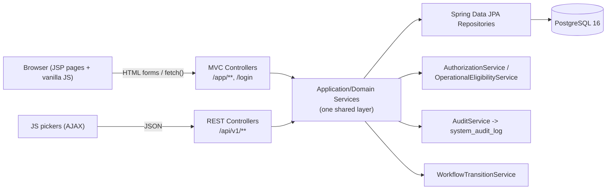
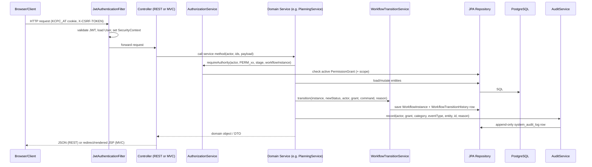
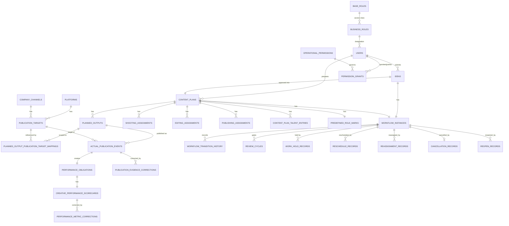
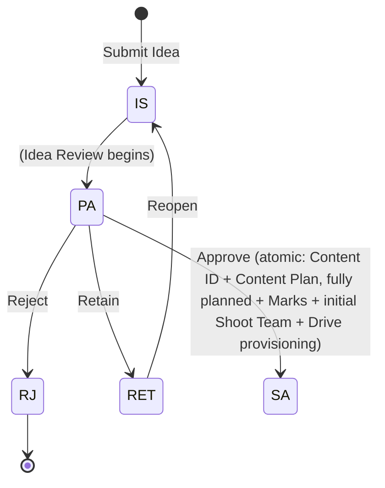
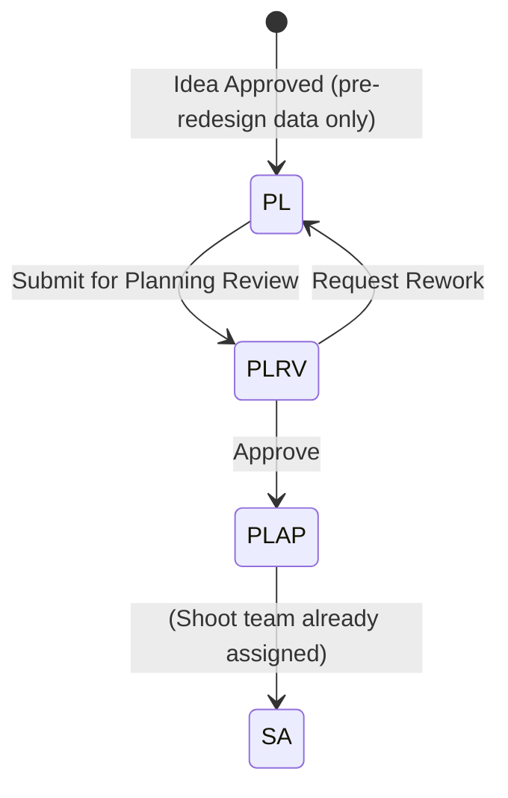
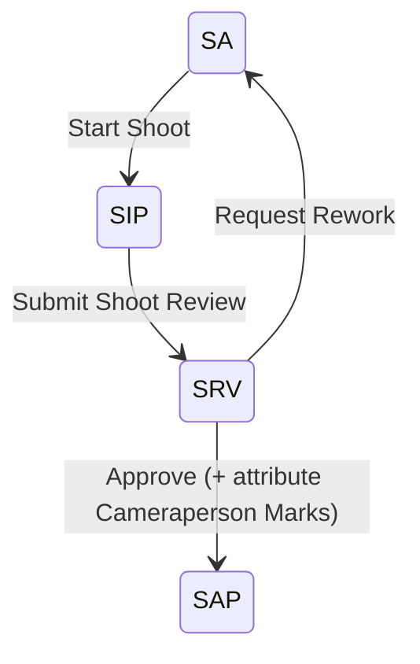
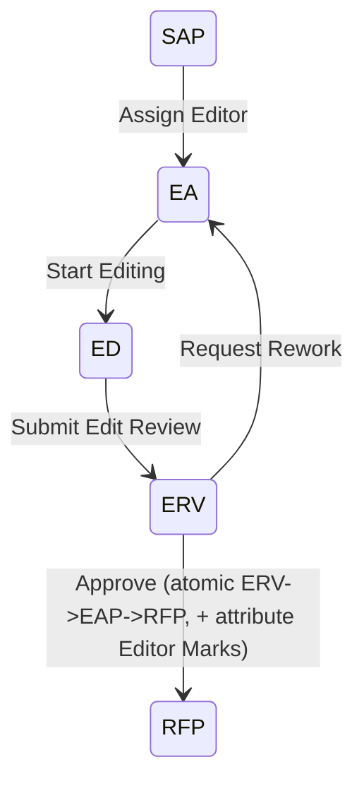
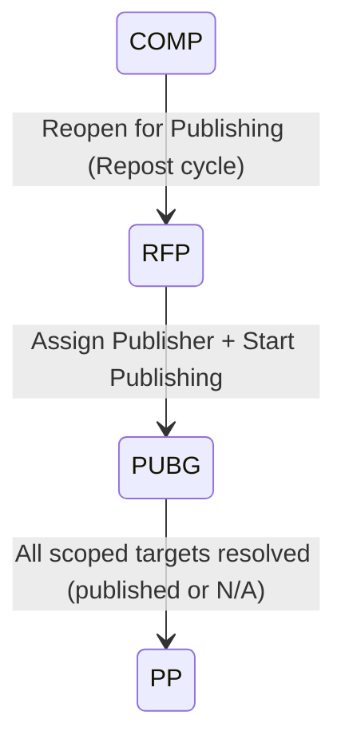
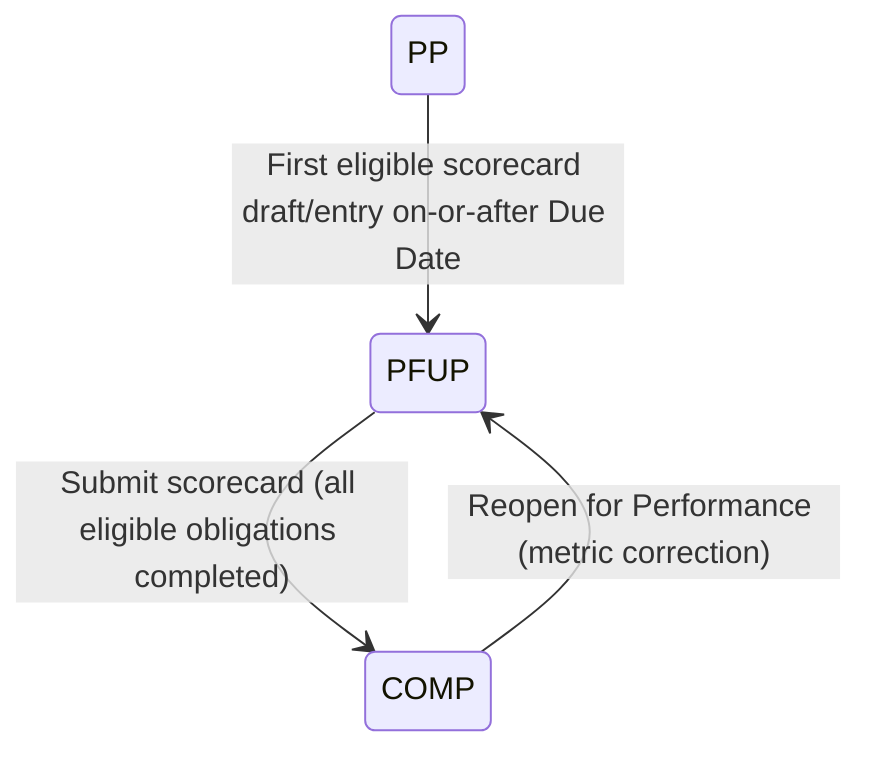
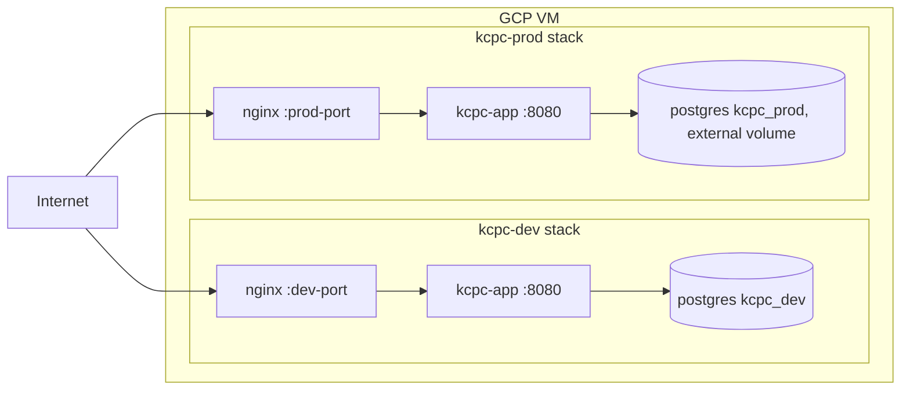

# KCPC Marketing Content Production Lifecycle — Project Documentation

> Source of truth: this document is generated directly from the codebase at
> `/Users/kcpcbandhani/IdeaProjects/sikarkcpc` (branch `dev`), Maven artifact `kcpc-mkt-mvp`,
> version `0.1.0-SNAPSHOT`. Every class, file, and table name below is a real identifier in the
> repository unless explicitly marked **Not implemented**. Where the code disagrees with any
> external spec document (`docs/*.md`), the code is authoritative and is what is documented here.

---

## 1. Project Overview

### Project name
**KCPC Marketing Content Production Lifecycle MVP** (Maven artifact `kcpc-mkt-mvp`, application
title "KCPC Bandhani" in the UI). Internally referred to across code comments as "R3.5" (the
development baseline revision).

### Business purpose
KCPC Bandhani is a marketing/creative agency (or an in-house marketing department) that produces
social-media content (photos, reels, videos) end-to-end: an idea is submitted, approved, planned,
shot, edited, published to social platforms, and its performance is tracked. This application is
the **single system of record** for that entire pipeline — replacing ad-hoc spreadsheet/WhatsApp
coordination with one auditable, permission-governed workflow engine.

### Problem it solves
- **No single source of truth** for where a piece of content is in its lifecycle (idea → planning →
  shoot → edit → publish → performance).
- **Unclear accountability**: who is allowed to assign a Cameraperson, approve a shoot, publish to
  a channel, or correct a metric after the fact — and proving it later (audit).
- **Manual, error-prone scheduling** of shoot/edit/publish dates, with no reschedule/reassign
  history.
- **No visibility into team workload** (who currently has how much active work) or KPI
  performance (on-time delivery, rework rate, delayed content).
- **Multi-platform publishing complexity**: the same content can be posted to several
  Platform × Channel combinations, some of which may be marked Not Applicable, and some
  reposted later — all of which must remain individually auditable.

### Target users
- **CEO / Owner** — full native authority over every workflow action, plus the *exclusive*
  authority to administer user accounts, Business Roles, and Operational Permission grants.
- **Marketing Manager** — full native authority over every workflow execution action (idea review,
  planning, shoot/edit/publishing execution, performance updates, reschedule/reassign/cancel), but
  **zero** access-administration authority (cannot create/deactivate users or grant permissions).
- **Employees** (default: self-service only) who may be granted specific delegated
  `OperationalPermission`s to review/execute/administer specific stages. Employees typically hold a
  **Business Role** designation such as Camera Person, Video Editor, Publisher, Model, HR Manager,
  Marketing Coordinator, etc. (17 seeded designations — see §7).

### Main workflows
1. **Idea → Content Plan** (Idea submission, Idea Review/Approval — **workflow redesign:** Planning
   is no longer a separate stage; schedule, planned outputs, publication scope, talent/model
   selection and initial Shoot team assignment are all validated and created in this same Idea
   Review approval, atomically with Content ID allocation, landing directly on Shoot Assigned).
2. **Shooting** (Shoot execution, Shoot Review, Cameraperson Marks attribution).
3. **Editing** (Editor assignment, Edit execution, Edit Review, Editor Marks attribution).
4. **Publishing** (Publisher assignment, Actual Publication event recording per Platform × Channel
   target, Target N/A handling, Repost cycles).
5. **Performance** (Meta-only — Instagram/Facebook — direct-entry metric scorecards: Hook Rate,
   Hold Rate, Views, Average View Duration; corrections; completion).
6. **Administrative actions** that cut across every stage: Reschedule, Reassign, Cancel, Hold/
   Resume, Reopen (Completed / Publishing / Performance).
7. **Reporting**: Team Workload, Team/KPI dashboards, Content Pipeline, Delayed Deliverables,
   Administrative Actions log, System Audit Log, Multi-format Export (JSON/CSV/XLSX).

### Current development status
Actively developed MVP, **not yet fully hardened for multi-tenant production** but deployed to a
real GCP VM (dev + prod Docker Compose stacks — see §15). Flyway schema is at **V26**
(`V26__meta_only_performance_metrics.sql`). The workflow engine, permission system, and every
module in §4 are implemented end-to-end and covered by 45+ integration test classes (§12) that
drive the real HTTP surface against a real PostgreSQL database (no mocking anywhere in the test
suite). Known gaps are catalogued in §16.

---

## 2. Technology Stack

| Concern | Choice | Notes |
|---|---|---|
| Backend framework | **Spring Boot 3.3.5** (`spring-boot-starter-parent`) | `pom.xml` |
| Language | **Java 21** | `<java.version>21</java.version>`, `<maven.compiler.release>21</maven.compiler.release>` |
| Web layer | Spring MVC (`spring-boot-starter-web`) — REST (`/api/v1/**`) **and** server-rendered JSP MVC (`/app/**`) share one servlet container | Two `SecurityFilterChain`s (§11) |
| View technology | **JSP + JSTL** (`tomcat-embed-jasper`, `jakarta.servlet.jsp.jstl-api` 3.0.0, `org.glassfish.web:jakarta.servlet.jsp.jstl` 3.0.1) | `src/main/webapp/WEB-INF/views/*.jsp` |
| Frontend | Vanilla JavaScript (no framework/bundler), hand-rolled CSS (`src/main/resources/static/css/app.css`) | 21 JS files in `src/main/resources/static/js/` (progressive enhancement over server-rendered forms) |
| ORM / Persistence | **Spring Data JPA / Hibernate 6.5.3** | `spring-boot-starter-data-jpa`; `hibernate.ddl-auto: validate` (schema is Flyway-owned, never Hibernate-generated) |
| Database | **PostgreSQL 16** | `org.postgresql:postgresql` (runtime), `postgres:16` Docker image |
| Schema migration | **Flyway** (`flyway-core` + `flyway-database-postgresql`) | 26 versioned migrations in `src/main/resources/db/migration`, plus a `dev`-profile-only demo dataset in `db/migration-demo` |
| Security | **Spring Security 6** + stateless **JWT** (`io.jsonwebtoken:jjwt-api/impl/jackson` 0.12.6) in an `HttpOnly` cookie, **not** Spring Session | `com.kcpc.mkt.security.*` — see §11 |
| Password hashing | **BCrypt** (`BCryptPasswordEncoder`) | `SecurityConfig.passwordEncoder()` |
| Validation | `spring-boot-starter-validation` (Jakarta Bean Validation) | `@Valid` request DTOs |
| API documentation (generated) | **springdoc-openapi** 2.6.0 (`/api/v1/openapi`, Swagger UI at `/api/v1/docs`) | Non-authoritative — this Markdown document is authoritative |
| CSV/XLSX export | **Apache POI** `poi-ooxml` 5.3.0 | `MultiFormatExportService` |
| CSV import | **Apache Commons CSV** 1.14.1 (+ `commons-io` 2.20.0 pinned explicitly for a transitive-dependency class conflict) | `UserCsvImportService` |
| Google Drive integration | `google-api-client` 2.7.0, `google-api-services-drive`, `google-auth-library-oauth2-http` 1.23.0 | `com.kcpc.mkt.drive.*`, disabled by default (`app.drive.enabled=false`) |
| Boilerplate reduction | Lombok (compile-time only, optional) | |
| Build tool | **Maven** (packaging: `war`) | No Gradle wrapper exists in this repo — see §14 for the real run commands |
| Testing framework | **JUnit 5** (`spring-boot-starter-test`) + `spring-security-test`, real HTTP client (`java.net.http.HttpClient`) via a custom `TestApiClient`, real PostgreSQL `kcpc_test` database — **no mocking** | `src/test/java/com/kcpc/mkt/**` |
| Authentication approach | Stateless JWT (HS512) issued on login, stored in an `HttpOnly` cookie (`KCPC_AT`), **re-validated on every request** (signature + expiry + a server-side revocation registry + account-active check) — not a pure stateless JWT | `JwtService`, `TokenRegistryService`, `JwtAuthenticationFilter` |
| CSRF | Spring Security's `CookieCsrfTokenRepository` (double-submit cookie `KCPC_CSRF` + `X-CSRF-TOKEN` header), enforced on both the REST and MVC filter chains | `SecurityConfig`, `CsrfRestController` |
| Deployment | Docker multi-stage build (`Dockerfile`), Docker Compose (`docker-compose.yml` for local Mac, `deploy/dev` and `deploy/prod` overlays for a shared GCP VM), Nginx reverse proxy | §15 |
| Dev productivity | `spring-boot-devtools` (runtime/optional, auto-restart + LiveReload; excluded from the packaged WAR automatically) | |

---

## 3. System Architecture

### Overall architecture
A **monolithic, layered Spring Boot WAR application**. There is exactly one deployable artifact
(`kcpc-mkt-mvp.war`) that serves:
- A **JSON REST API** under `/api/v1/**` (for programmatic/AJAX clients and the JS-driven picker
  widgets), and
- A **server-rendered JSP MVC UI** under `/app/**` (the primary human-facing product), plus
  `/login`, `/logout`.

Both surfaces are explicitly designed to **share the exact same service layer** — this is a
documented architecture rule enforced by comment and by test
(`MvcScreenSmokeTest`/`GoldenEndToEndFlowTest` exercise the same underlying services from two
different entry points). Example: `DeliverableMvcController` and `PublishingRestController` both
call `PublishingService` — neither reimplements business logic independently.



### Module structure (top-level Java packages under `com.kcpc.mkt`)

| Package | File count | Responsibility |
|---|---|---|
| `identity` | 41 | Users, Business Roles, Access Classes, Operational Permissions, permission grants, authorization, CSV import |
| `web` | 42 | REST controllers, MVC controllers, shared web DTOs, navigation/interceptors |
| `reporting` | 39 | KPI dashboard, Pipeline dashboard, Team Workload, Exports, Audit reporting |
| `workflow` | 37 | `WorkflowInstance`/`WorkflowStatus` engine, transition history, Hold/Resume, Reschedule/Reassign/Cancel/Reopen, Assignment queue |
| `planning` | 29 | Content Plan, Planned Outputs, Publication Scope, Talent entries, Shoot assignment (initial) |
| `publishing` | 16 | Publisher assignment, Actual Publication events, Target N/A, evidence corrections |
| `production` | 13 | Shooting & Editing assignments and execution participants |
| `masterdata` | 13 | Platforms, Company Channels, Publication Targets catalogue |
| `performance` | 14 | Performance obligations, Creative Performance Scorecards (Meta-only model), metric corrections |
| `security` | 12 | JWT issuance/validation, cookie handling, CSRF properties, Spring Security config |
| `marks` | 9 | Predefined Role Marks, Personal Mark Attributions, mark corrections |
| `drive` | 11 | Google Drive per-Content-ID folder provisioning |
| `common` | 10 | `BaseEntity`, `DomainException`/`ErrorCode`, shared repository/util helpers |
| `idea` | 7 | Idea submission/review/approval |
| `discussion` | 3 | Per-stage comment threads |
| `audit` | 4 | System-wide append-only audit log |

Each business package (`identity`, `idea`, `planning`, `production`, `publishing`, `performance`,
`reporting`, `workflow`, `masterdata`, `marks`, `drive`, `discussion`) follows the same internal
convention: `domain/` (JPA entities + enums), `dto/` (request/response records or plain classes),
`repository/` (Spring Data JPA interfaces), `service/` (business logic, `@Transactional`).

### Package structure (illustrative)
```
com.kcpc.mkt
├── KcpcMktApplication.java        (Spring Boot entry point)
├── audit/            domain, dto, repository, service
├── common/           entity (BaseEntity), error (DomainException/ErrorCode), repository, util
├── discussion/        domain, repository, service       (stage comments)
├── drive/             client, config, domain, event, repository, service (Google Drive)
├── idea/               domain, dto, repository, service
├── identity/            domain, dto, repository, service (users, roles, permissions)
├── marks/                 domain, dto, repository       (predefined/attributed marks)
├── masterdata/              domain, dto, repository, service (platforms/channels/targets)
├── performance/               domain, dto, repository, service
├── planning/                    domain, dto, repository, service
├── production/                    domain, dto, repository, service (shoot/edit assignments)
├── publishing/                     domain, dto, repository, service
├── reporting/                       dto, service (KPI/Pipeline/Workload/Export)
├── security/                        (JWT, cookies, CSRF, SecurityConfig)
├── web/
│   ├── mvc/                           (JSP-serving controllers)
│   └── rest/                           (JSON REST controllers)
└── workflow/                            domain, dto, repository, service (status engine, admin actions)
```

### Request flow (Controller → Service → Repository)
A single, consistent pattern is used everywhere:



Every mutating service method follows this shape: **(1)** load the entity, **(2)**
`AuthorizationService.requireAuthority(...)` or `OperationalEligibilityService` check, **(3)**
domain-rule validation (throwing `DomainException` with a specific `ErrorCode` on failure), **(4)**
mutate + save, **(5)** `WorkflowTransitionService.transition(...)` if a status change occurs, **(6)**
`AuditService.record(...)`. This is why every service constructor lists `AuthorizationService` and
`AuditService` as dependencies.

### Database interaction
- **Spring Data JPA** repositories (`extends JpaRepository<Entity, UUID>`) for almost everything.
  Derived query methods (`findByContentPlanAndActiveTrue`, etc.) are the dominant style; a handful
  of aggregation-heavy repositories add `@Query` JPQL methods with **interface projections** (e.g.
  `UserActiveTaskCount` in `reporting.dto`, used by `AssigneeWorkloadCountService`) to get a single
  grouped `COUNT ... GROUP BY` query instead of N+1 lookups.
- **KPI/Reporting services** (`KpiDashboardService`, `PipelineDashboardService`) additionally build
  raw SQL fragments (see `StageSqlFragments`, and the `PERFORMANCE_ELIGIBLE_JOIN`/`_WHERE` constants
  in `KpiDashboardService`) executed via JPA native queries, for reporting aggregates that would be
  awkward or slow to express as fetched entity graphs.
- **All primary keys are UUIDv7**, application-generated (never a DB-side `gen_random_uuid()`
  default) — see `BaseEntity`/`UuidV7`. This gives roughly time-sortable, still-random IDs.
- **`hibernate.ddl-auto: validate`** — the JPA entity model must always match the Flyway-created
  schema exactly; Hibernate never creates or alters tables itself.
- **Append-only enforcement is defense-in-depth at three layers**: (1) no `update`/`delete`
  repository methods are exposed for append-only entities, (2) Postgres `BEFORE UPDATE/DELETE/
  TRUNCATE` triggers reject any attempt at the SQL level (`trg_reject_update_delete`,
  `trg_reject_truncate` — see V12/V13), and (3) a restricted database role `kcpc_app` is granted
  only `SELECT, INSERT` (never `UPDATE`/`DELETE`) on those specific tables in non-local deployments
  (V13 Part B), while a separate schema-owning role `kcpc_migrator` runs Flyway.

### Security flow
See §11 for full detail. Summary: login (`POST /login` or `POST /api/v1/auth/login`) issues an
HS512 JWT, registers it in a DB-backed revocation registry (`user_sessions` /
`TokenRegistryService`), and sets it as an `HttpOnly` cookie (`KCPC_AT`). `JwtAuthenticationFilter`
re-validates that JWT **on every single request** (signature, expiry, registry entry not revoked,
account still active) — this is a deliberate departure from "pure stateless JWT" specifically so
that logout and account deactivation take effect immediately rather than only once the JWT expires.

---

## 4. Application Modules

### Authentication & User Management

**Login/logout**
- `POST /login` (form, `AuthMvcController.doLogin`) and `POST /api/v1/auth/login` (JSON,
  `AuthRestController.login`) both delegate to the single shared
  `AuthenticationApplicationService.login(email, rawPassword, ip, userAgent)`.
- Login verifies: user exists (case-insensitive email lookup), `BCryptPasswordEncoder.matches`,
  and `user.isActive()`. On success, `TokenRegistryService.issueAndRegister(user, ip, userAgent)`
  mints a JWT and inserts a `user_sessions` row (hashed token), then the controller sets the
  `KCPC_AT` cookie (`AuthCookieService`).
- `POST /logout` / `POST /api/v1/auth/logout` call `AuthenticationApplicationService.logout(rawJwt)`
  → `TokenRegistryService.revoke(rawJwt)` (marks the session row revoked) and clears the cookie.
- `GET /api/v1/auth/me` returns the current authenticated user's profile (used by JS to bootstrap
  client-side UI state without a full page reload).

**Session handling**
- **Not** `HttpSession`-based. `SecurityConfig` explicitly disables `sessionManagement` on both
  filter chains and uses `RequestAttributeSecurityContextRepository` (never touches
  `HttpSession`), so no `JSESSIONID` cookie is ever created.
- Every request re-authenticates from the `KCPC_AT` cookie via `JwtAuthenticationFilter` →
  `TokenRegistryService.validateAndResolveUser(jwt)`, which checks JWT signature/expiry **and**
  that the corresponding `user_sessions` row is not revoked **and** that the user is still active
  — so revoking a session or deactivating a user takes effect on the very next request, not merely
  at JWT-expiry time.

**User lifecycle**
- Created exclusively by the CEO (`UserAdminService.createUser`, gated by
  `requireCeo` → `AuthorizationService.requireAccessClass(actor, AccessClass.CEO_OWNER, ...)`).
  There is **no self-registration** anywhere in the system.
- `deactivate()`/`activate()` (soft delete — `User.active`/`deactivatedAt`, never a hard delete).
  Deactivation revokes all active sessions immediately (verified by `PermissionBoundaryTest`).
- `reassignBusinessRole(newRole)` — CEO can change a user's Business Role
  (`UserAdminRestController POST /{userId}/business-role`).
- Bulk **CSV import** of users (`UserCsvImportService`, `AdminMvcController` `/users/import`
  upload → preview → confirm flow) — validates rows, reports per-row outcomes
  (`UserImportOutcome`/`UserImportBatchResult`), generates random passwords
  (`RandomPasswordGenerator`), never auto-grants any `OperationalPermission`.

**User roles** — see §7 for the full Role/Designation/Permission model. In short: every `User` has
exactly one `BusinessRole`, which resolves to exactly one `AccessClass` (`CEO_OWNER` /
`MARKETING_MANAGER` / `EMPLOYEE`).

**Access control** — see §11. Enforced centrally through `AuthorizationService`, never
independently re-implemented per controller.

---

### Idea Management
*Implemented in `IdeaService`, `IdeaMvcController`, `IdeaRestController`, `ReviewsMvcController`.*

**Idea creation**
- `POST /api/v1/ideas` or the MVC `/app/ideas/new` → `/app/ideas` form
  (`IdeaService.submit(submitter, title, referenceLink, notesRemarks, additionalNote)`).
- Creates a new `WorkflowInstance` at status `IS` (Idea Submitted), then an `Idea` row
  (`business_idea_code` auto-generated, `ideas.title/reference_link/notes_remarks/additional_note`).
- `title` is mandatory; `reference_link`/`notes_remarks`/`additional_note` are optional free text.

**Review process / Approval workflow (workflow redesign: Idea Review + Planning Details merged)**
- `IdeaService.decide(reviewer, ideaId, decision, reason, cameramanMark, editorMark, planning)` —
  the reviewer needs `PERM_01_IDEA_REVIEW` (or native CEO/MM authority) scoped to
  `LifecycleStage.IDEA_MANAGEMENT` for this specific `WorkflowInstance`. `planning` is a
  `PlanningApprovalRequest` (`com.kcpc.mkt.idea.dto`), mandatory when `decision == APPROVE`,
  ignored otherwise. **PERM_01 alone governs the whole combined action** — PERM_02/PERM_03 are
  never checked here (see §7).
- `IdeaReviewDecision` values: **APPROVE**, **REJECT**, **RETAIN**.
  - **APPROVE** triggers the atomic compound command: validate every former Planning-required field
    (Content Priority; Planned Live/Shoot/Edit Dates, honoring the same Standard-defaults/5-day-rule
    and Urgent-requires-reason logic Planning always had; Folder Link unless Drive
    auto-provisioning is enabled; at least one Cameraperson, each checked against
    `OperationalEligibilityService.requireShootExecutionEligible`) → allocate a Content ID
    (`ContentIdAllocationService`, format `C-MMYY-NNNN`, monthly-reset sequence via
    `SELECT ... FOR UPDATE` row locking — **never** `MAX()+1`) → create the `ContentPlan` **already
    fully populated** (category/priority/SKU/schedule/folder link) → persist `PredefinedRoleMarks`
    (Cameraperson/Editor marks, each constrained to `{0.0, 0.5, 1.0, 2.0, 3.0}`) → write a
    `PlanningPreparer` row (self-review-conflict provenance, unconditional — the plan is brand new)
    → create `ContentPlanTalentEntry` rows for any selected Models/Talent → create the initial
    `PlannedOutput`(s) (with `reelGroupId` fan-out for multiple Reel Types) and
    `PlannedOutputPublicationTargetMapping`(s) for any selected Output/Publication Scope → create
    the initial `ShootingAssignment`(s) (+ optional Shoot Lead) → trigger
    `DriveProvisioningService.initiateProvisioning` → record a `ReviewCycle`
    (`gate_type = IDEA_REVIEW`) → transition the workflow **directly** `IS → PA → SA` (Shoot
    Assigned) in one transaction — **never** through `PL`/`PLRV`/`PLAP`. One `IDEA_APPROVED` audit
    event covers the whole merged action (no separate Planning-specific audit rows).
  - **REJECT** transitions to `RJ` (terminal).
  - **RETAIN** transitions to `RET` (dormant) — can later be **reopened**
    (`IdeaService.reopen(actor, ideaId)` → back to `IS`).
- A `PredefinedMarkCorrection` can later amend the Cameraperson/Editor marks after approval
  (`correctPredefinedMarks`), append-only, requiring a mandatory reason.

**Ownership rules**
- "My Ideas" (`/app/ideas` for an Employee) shows **only** the logged-in employee's own submitted
  ideas — enforced server-side, not merely hidden in the UI (`MyIdeasVisibilityTest`): an Employee
  cannot view another employee's idea detail page even by guessing the URL.

**Self-review prevention**
- `AuthorizationService.requireNoSelfReviewConflict(actingGrant, currentUser, ...)` —
  BRS-REQ-012/ERD-CON-011: an Employee exercising a **delegated** review permission can never
  decide on their own submitted/prepared/executed work. Native CEO/MM authority is exempt (they
  are the accountable owner of the whole pipeline by design). Covered by
  `SelfReviewConflictTest`.

---

### Planning (folded into Idea Review — workflow redesign)
*Field-population logic now lives in `IdeaService#approve` (see Idea Management above);
`PlanningService` (`com.kcpc.mkt.planning.service.PlanningService`) still owns everything about an
**already-created** plan — ongoing edits, Outputs/Publication Scope management (now rendered in
`deliverable-detail.jsp`'s Publishing tab), and Shoot team adjustments before shoot execution
starts. There is no more Planning or Planning Review tab, and no separate "submit for review" step.*

**What used to be "Planning" is now part of Idea Review approval**
- A Content Plan is created **already fully planned** — category/priority/SKU/schedule/folder
  link/outputs/publication scope/models/initial Shoot team are all supplied in the same
  `PlanningApprovalRequest` that approves the idea (see Idea Management above), never entered
  incrementally afterward the way the old Planning tab worked.
- **Planning fields** (`ContentPlan`): `categoryText`, `contentPriority` (`LOW`/`MEDIUM`/`HIGH`),
  `skuReference` (or `skuNotApplicable`, mutually exclusive — DB CHECK
  `ck_content_plans_sku_na_exclusion`), `plannedLiveDate`, `planningMode` (`STANDARD`/`URGENT`,
  with `urgencyReason` mandatory only under `URGENT`), `plannedShootDate`/`plannedEditDate`,
  `folderLink`.
- **Required fields at approval** (validated in `IdeaService#approve`, not just at the DB — the
  physical columns stay nullable per ERD-CON-026): Content Priority, a schedule
  (Standard defaults shoot/edit to live-5d/live-2d unless overridden, and requires the live date be
  ≥5 days out; Urgent requires all three dates + a reason explicitly), Folder Link (unless Drive
  auto-provisioning is enabled), and at least one Cameraperson. Category/SKU/Outputs/Publication
  Scope/Models remain optional, exactly as before this redesign.
- `ContentPlan.isFullyPlanned()` (renamed from `isReadyForPlanningReview()`) is now always `true`
  for a plan created after this redesign — kept only as an informational API field / for reading
  pre-redesign historical data consistently.
- **Date chronology constraint** (`ck_content_plans_date_chronology`): shoot date ≤ edit date ≤
  live date (equal dates are allowed, specifically to support `URGENT` same-day planning) — still
  enforced, now inside the merged approval instead of a separate schedule-setting call.
- **Ongoing edits after creation**: `PlanningService.updateParameters`/`setStandardSchedule`/
  `setUrgentSchedule` remain available (PERM_02-gated) for adjusting an already-created plan — there
  is no more "submit for Planning Review" step gating this, since Planning Review no longer exists
  as an active gate.

**Outputs**
- `PlannedOutput` (`addPlannedOutput`/`addPlannedOutputs`): `outputType` ∈ `{PHOTOGRAPHY, REEL,
  VIDEO}`; `REEL` additionally requires `reelType` ∈ `{VERY_SHORT, SHORT, LONG}` (non-REEL must
  have a null `reelType` — `ck_planned_outputs_reel_type`).
- Selecting **multiple Reel Types** in one "+ Add Output" submission creates **one separate
  `PlannedOutput` row per Reel Type** (never one row with multiple types), all sharing one
  `reelGroupId` (`V14__planned_output_reel_groups.sql`) so they render as one grouped UI row and
  share **one common Publication Target set** (`syncReelGroup`/`removeReelGroup`).

**Publication scope**
- `mapPublicationScope(user, plannedOutputId, publicationTargetIds)` — **additive only** (never
  replaces/deletes existing mappings); propagates to every `PlannedOutput` in the same
  `reelGroupId`. `unmapPublicationTarget` removes one target from the whole group.
- The "+ Add Target" UI picker is **single-Platform-at-a-time by design**
  (`publication-scope.js`): choosing a Platform filters/resets the Channel checklist so a Channel
  from a different Platform can never be submitted in the same click — adding two platforms
  requires two separate "+ Add Target" submissions.

**Models (Talent)**
- `ContentPlanTalentEntry` (`talentName` + optional `talentUser` FK, `V20`) — the MVC Model(s)
  picker always supplies a real `User` (Business Role = `Model`); the underlying REST contract
  still accepts a bare talent-name string with no linked user for backward compatibility.

**Shoot assignment**
- The **initial** Shoot team is created directly inside `IdeaService#approve` (from
  `PlanningApprovalRequest.camerapersonUserIds`/`leadCamerapersonUserId`), not through
  `PlanningService`. `PlanningService.assignCameraperson`/`removeCameraperson`/`setShootLead`/
  `assignShootTeam` remain available afterward for adjusting the team (creates/ends
  `ShootingAssignment` rows — multi-Cameraperson, one optional `isLead` flag per Content Plan,
  DB-enforced via a partial unique index) — gated on status **`SA`** (changed from `PL` in this
  redesign: "before Shoot execution starts" is now `SA`, the status a plan is created into and sits
  in until Shoot actually starts). Candidate eligibility is governed by
  `OperationalEligibilityService.shootExecutionCandidates` (holds an active `PERM_18_SHOOT_
  EXECUTION` grant covering this item), **never** by Business-Role name — see §7.

---

### Shooting Module
*Implemented in `ShootingService` (`com.kcpc.mkt.production.service`).*

**Shoot workflow**
- `startShooting` (`SA → SIP`, actor must be an actively assigned, `PERM_18`-eligible Cameraperson
  — ENG-043: Business-Role alone grants nothing).
- `submitShootReview` (`SIP → SRV`, creates a `ReviewCycle` `gate_type=SHOOT_REVIEW`) — blocked
  while an open `WorkHoldRecord` exists for this instance (`HoldService.requireNoOpenHold`).
- `decideShootReview(reviewer, approve, reason, qualifyingRecipientUserIds)` — needs
  `PERM_05_SHOOT_REVIEW`:
  - **Approve** → `SRV → SAP` (Shoot Approved) and attributes the **full** predefined Cameraperson
    Mark to each `qualifyingRecipientUserId` (`PersonalMarkAttribution`, `roleType=CAMERAPERSON`)
    — the mark is never split across multiple contributors, each qualifying person receives the
    full predefined value.
  - **Rework** → back to `SA` (or `SIP`, depending on where it was submitted from), with rework
    feedback recorded.
- Every actual execution participant (not just the currently-active assignee) is recorded in
  `ShootingExecutionParticipant` — a Request-Rework-then-restart cycle adds a **new** participant
  row each time, so the same person can legitimately appear more than once across cycles.

**Assignment rules**
- Initial assignment now happens as part of Idea Review approval (see above), even though Shoot
  *execution* eligibility (`PERM_18`) is scoped to `LifecycleStage.SHOOTING` — eligibility is
  always evaluated against the stage being executed, never the screen/action the assignment
  happens to be made from.
- **Reassignment** (post-initial) goes through the cross-cutting `AdminActionService.reassign`
  (Permission #11), valid while the canonical stage is still Planning or Shoot
  (`AvailableActionService.isReassignEligible`) — this check still references the historical
  Planning canonical-stage window for compatibility; new plans reach it already past that window.

**Hold system**
- `HoldService.placeHold`/`resume` — restricted to **native CEO/MM authority only**
  (`requireNativeAuthority`), permitted only while the workflow status is `SIP`, `ED`, or `PUBG`
  (extended to `PUBG` in `V23`). At most one **open** hold per `WorkflowInstance`
  (DB partial unique index `uq_work_hold_records_one_open_per_instance`). The primary
  `WorkflowStatus` is **never** touched by a Hold — it is a parallel record
  (`ERD-CON-061`/`ERD-CON-062`). An open hold blocks the relevant review-submission action.

**Folder handling**
- `content_plans.folder_link` is the display/override URL (manually managed via
  `PERM_13_FOLDER_LINK_MANAGE`); if Google Drive provisioning is enabled
  (`app.drive.enabled=true`), `DriveProvisioningService` automatically creates a governed 3-
  subfolder structure per Content ID (`01 - Raw Shoot`, `02 - Edit`, `03 - Final Content`) and
  syncs `folder_link` to the provisioned root folder URL. **Disabled by default** in every
  environment today — see §15/§16.

**Submission process** — see "Shoot workflow" above (`submitShootReview`).

---

### Editing Module
*Implemented in `EditingService` (`com.kcpc.mkt.production.service`), structurally mirrors
Shooting.*

**Editor assignment**
- Only possible **after Shoot Approval** (`SAP`) — `assignEditor`/`removeEditor`/`setEditLead`/
  `assignEditTeam`, transitioning `SAP → EA` on first assignment. Candidate eligibility via
  `OperationalEligibilityService.editExecutionCandidates` (`PERM_19_EDIT_EXECUTION`).

**Editing workflow**
- `startEditing` (`EA → ED`), `submitEditReview` (`ED → ERV`, blocked by an open Hold).
- `decideEditReview(approve, reason, qualifyingRecipientUserIds)` — `PERM_07_EDIT_REVIEW`:
  - **Approve** fires `ERV → EAP → RFP` (Ready for Publishing) **atomically** — unlike Shoot,
    there is no resting "Edit Approved" status the workflow stays at; it moves straight through
    to RFP in the same transaction — and attributes the full predefined Editor Mark to each
    qualifying recipient.
  - **Rework** → back to `EA`/`ED`.

**Submission rules** — identical pattern to Shooting: `EditingExecutionParticipant` records every
real execution cycle's contributors (append-only, multiple rows possible per person across
rework cycles).

---

### Publishing Module
*Implemented in `PublishingService` (`com.kcpc.mkt.publishing.service`).*

**Publisher assignment**
- `assignPublisher`/`removePublisher` (`PublishingAssignment`, multi-Publisher, **no Lead concept**
  — unlike Shoot/Edit). Candidate eligibility via
  `OperationalEligibilityService.publishingExecutionCandidates` (`PERM_08_PUBLISHING_EXECUTION`,
  which pre-dates the PERM_18/19 pattern it was later mirrored from).
- `startPublishing` (`RFP → PUBG`).

**Publishing scope**
- The set of `PlannedOutputPublicationTargetMapping` rows established in Planning defines which
  Platform × Channel targets this content is expected to be published to. `summarizeTargets(plan)`
  returns a `TargetResolutionSummary(resolvedCount, totalCount)` used to drive completion logic.
- **Target N/A**: `designateTargetNA(actor, plannedOutputId, publicationTargetId, reason)` marks a
  specific target as not applicable (mandatory reason — `ck_publication_target_na_records_reason`);
  `reverseTargetNA` supersedes a prior N/A designation. A resolved target is one that is either
  actually published **or** legitimately marked N/A.

**Publishing workflow**
- `recordActualPublication(actor, contentPlanId, plannedOutputId, publicationTargetId, eventType,
  actualPublicationTimestamp, evidenceUrl)` — `eventType` ∈ `{ORIGINAL, REPOST}`. Creates an
  `ActualPublicationEvent` (immutable core facts) and, if the target platform is Meta-eligible
  (Instagram/Facebook — see Performance Module), a corresponding `PerformanceObligation` due
  **2 calendar days** after the actual publication timestamp (`ERD-CON-016`).
- Once every scoped target for the current cycle is resolved (published or N/A), the workflow
  auto-advances `PUBG → PP` (Performance Pending).
- **Evidence corrections**: `correctEvidenceUrl` — append-only `PublicationEvidenceCorrection`
  chain (`supersedes_correction_id`), never mutates the original `evidence_url`;
  `resolveEffectiveEvidenceUrls` resolves the latest-correction-wins value for display.

**Reopen for Publishing / Repost flow**
- Once `COMP` (Completed), `AdminActionService.reopenForPublishing` (Permission-gated,
  `ReopenPurpose.PUBLISHING_REOPEN`) lands the workflow back on **`RFP`** (Ready for Publishing —
  not `PUBG`, a defect this codebase explicitly fixed and regression-guards — see
  `WorkflowVariantsE2ETest`), so a Publisher must `startPublishing` again before recording a new
  event.
- `currentPublishingCycleStart(workflowInstance)` returns non-null exactly when the deliverable has
  been reopened for Publishing at least once — the single source of truth for "are we mid-Repost."
- **ORIGINAL/REPOST cycle isolation** (Performance-relevant): an old ORIGINAL publication event's
  `PerformanceObligation` never satisfies a later REPOST's own obligation — each publication event
  gets its own 1:1 obligation.

---

### Performance Module
*Implemented in `PerformanceService`, `PerformanceEligibilityService`
(`com.kcpc.mkt.performance.service`). This module was recently converted (V26,
`db/migration/V26__meta_only_performance_metrics.sql`) from a generic 6-metric model to a
**Meta-only (Instagram/Facebook) direct-entry** model.*

**Eligibility**
- `PerformanceEligibilityService.isEligible(ActualPublicationEvent | PublicationTarget)` — the
  single governed rule: a publication event is Performance-eligible **only if its Platform's name
  is "instagram" or "facebook"** (case-insensitive/trimmed — `Platform` has no separate "type"
  column, only a CEO-renamable `platformName` string, so name-matching is the best available
  identifier). Publishing itself remains fully multi-platform; only **Performance measurement**
  narrows to Meta. Reused consistently at obligation creation (`PublishingService`), the
  Performance tab query, completion checks, and KPI queries — never a duplicated ad-hoc platform
  check.

**Metrics (post-V26 model)** — exactly 4 directly-entered fields, sourced from Meta Ads Manager,
never derived/calculated by this application:
| Field | Type | N/A-eligible? |
|---|---|---|
| Hook Rate % | `NUMERIC(5,2)` | Yes (video-specific; N/A for a static PHOTOGRAPHY output) |
| Hold Rate % | `NUMERIC(5,2)` | Yes |
| Views | `BIGINT` | **No** — always required for any eligible Meta record |
| Average View Duration (seconds) | `NUMERIC(8,2)` | Yes |

- `CreativePerformanceScorecard.usesMetaMetricModel` discriminates a pre-V26 legacy scorecard
  (6-field model: `views3sec`, `plays`, `averageWatchTimeSeconds`, `videoLengthSeconds`,
  `linkClicks`, `impressions`, plus derived `hookRatePercent`/`holdRatePercent`/`ctrPercent`) from
  a post-V26 scorecard (always constructed with the flag `true`). **Both models coexist
  permanently** — legacy rows are never migrated or deleted; `resolveLegacyEffectiveMetrics` (old
  model) and `resolveEffectiveMetrics` (new model) are two parallel, never-merged read paths.
- **Draft → Submit workflow**: `saveDraft`/`submit` (`PerformanceService`), only permitted on/after
  `PerformanceObligation.performanceDueDate` (BFD status #19). Submission **seals** the scorecard
  (DB trigger `trg_scorecards_seal_on_submit` rejects any further UPDATE once `submitted_at` is
  set).
- **Corrections**: `correctMetrics` — append-only `PerformanceMetricCorrection` chain
  (typed prior/new column pairs, not generic key-value), each linked to the immediately-prior
  correction (`supersedesCorrectionId`), with a mandatory reason. The sealed scorecard row itself
  is **never** mutated by a correction.
- **Completion**: `maybeComplete` only counts **eligible** obligations (a Content ID must not stay
  Pending forever just because a non-Meta platform, e.g. YouTube, has no Performance concept at
  all) — filtering happens both at obligation-creation time **and** again at read time (covering
  pre-existing, pre-V26 obligations whose platform eligibility rules didn't exist yet).

**KPI/reporting integration** — `KpiDashboardService`'s Performance tab ranks/compares by **Hook
Rate** (replacing the old CTR) and **Views** (replacing the old Impressions), excluding N/A
values from every average/ranking rather than treating N/A as zero.

---

### Administration Module
*Implemented in `UserAdminService`, `BusinessRoleAdminService`, `PermissionGrantAdminService`,
`MasterCatalogueService`, rendered by `AdminMvcController` (`/app/admin/**`).*

**User management** — see "Authentication & User Management" above. Screens:
`admin-users.jsp` (list + create), `admin-user-detail.jsp` (activate/deactivate, change Business
Role, grant/modify/revoke permissions), `admin-users-import*.jsp` (CSV bulk import wizard).

**Permission management**
- `PermissionGrantAdminService` — `grant`/`modify`/`revoke` an `OperationalPermission` to a user,
  with `scopeType` ∈ `{GLOBAL, STAGE_RESTRICTED, ITEM_SPECIFIC}` (`PermissionGrant`,
  `PermissionGrantStageScope`, `PermissionGrantItemScope`). Every grant/modify/revoke is itself an
  audited action. `admin-permissions.jsp` renders the unified single-table grant/revoke/update UI
  (a redesign that replaced an older checklist + separate granted-permissions-table UI).

**Responsibility management** — see §7: there is **no separate "Responsibility" entity**
distinct from Business Role in this codebase; "responsibilities" like Cameraperson/Editor/
Publisher/Model are Business Role designations, and actual execution eligibility is governed by
`OperationalPermission` grants (PERM_18/19/08), not by the Business Role name itself.

**Designation management** — `BusinessRoleAdminService` (`admin-business-roles.jsp`):
create/deactivate/activate a Business Role, and set its `participatesInWorkflow` flag
(`V21` — centralizes whether an `EMPLOYEE`-class Business Role that does *not* participate in the
content-production workflow is restricted to "My Ideas + Submit Idea" only, both in nav and via
direct URL — see `WorkflowParticipationInterceptor`/`WorkflowParticipationRegressionTest`).

**Master Catalogue (Platforms/Channels/Publication Targets)** — `MasterCatalogueService` /
`MasterCatalogueRestController` / `admin-catalogue.jsp`, gated by
`PERM_17_PLATFORM_CATALOGUE_MANAGE`.

---

## 5. Database Documentation

All tables are created by Flyway migrations under `src/main/resources/db/migration/` (V1–V26),
plus a `dev`-profile-only demo dataset (`db/migration-demo/V6__demo_users.sql`, **never** applied
under the `docker`/production profile — see §13/§15). Every primary key is `UUID` (application-
generated UUIDv7, no DB default). Below, "Audit behavior" notes whether a table is **append-only**
(protected by both a Postgres trigger — §3 — and, in non-local deployments, a restricted DB role
that is never granted `UPDATE`/`DELETE` on it).

### Entity-Relationship Diagram (core pipeline)



### Table catalogue

> Format per table: **Table name / Purpose / Columns / Relationships / Indexes / Constraints /
> Audit behavior**. Column lists reproduce the actual migration DDL; "→" denotes a foreign key.

#### `base_roles` (V1)
- **Purpose**: the exactly-3 internal access classes (the real authorization boundary).
- **Columns**: `role_code` (PK, `VARCHAR(30)`), `role_name`, `description`.
- **Relationships**: referenced by `business_roles.access_class_code`.
- **Constraints**: `ck_base_roles_role_code` — `role_code IN ('CEO_OWNER','MARKETING_MANAGER','EMPLOYEE')`.
- **Audit behavior**: static reference data, not audited (fixed 3-row catalogue).

#### `business_roles` (V1, +V21)
- **Purpose**: the expandable organizational designation catalogue (17 seeded).
- **Columns**: `business_role_id` (PK), `role_name` (unique), `access_class_code` → `base_roles`,
  `is_active`, `created_at`, `deactivated_at`, `updated_at`, `participates_in_workflow`
  (`V21`, default `TRUE`).
- **Relationships**: `users.business_role_id` → this table.
- **Audit behavior**: mutable reference data (soft-deactivatable); changes are recorded through the
  generic `system_audit_log`, not its own ledger.

#### `operational_permissions` (V1, +V24)
- **Purpose**: the fixed, governed catalogue of 19 delegable permissions (PERM_01..PERM_19).
- **Columns**: `permission_number` (PK, 1..19), `permission_code` (unique), `permission_name`,
  `description`.
- **Constraints**: `ck_operational_permissions_number` (extended in V24 from 1–17 to 1–19).

#### `permission_grant_stages` (V1)
- **Purpose**: the 7 `LifecycleStage` values (IDEA_MANAGEMENT..ADMINISTRATIVE) permissions can be
  scoped to.

#### `workflow_concepts` (V1)
- **Purpose**: the 22 governed `WorkflowStatus` codes + classification (see §8).
- **Columns**: `status_code` (PK), `concept_number` (unique), `status_name`, `classification`
  (`ACTIVE`/`DORMANT`/`TERMINAL`/`CLOSED`/`SUPPLEMENTARY_FLAG`), `is_primary_status`.

#### `users` (V2)
- **Purpose**: every human account.
- **Columns**: `user_id` (PK), `full_name`, `email` (unique), `password_hash` (BCrypt, never
  serialized — `User.getPasswordHash()` is `@JsonIgnore`), `business_role_id` → `business_roles`,
  `is_active`, `deactivated_at`, `created_at`, `updated_at`.
- **Indexes**: `ix_users_business_role_id`.
- **Audit behavior**: mutated in place (activate/deactivate/role-change); every change is separately
  recorded in `system_audit_log`.

#### `user_sessions` (V2)
- **Purpose**: JWT session registry — one row per **issued** JWT, so logout/deactivation can revoke
  it before natural expiry.
- **Columns**: `session_id` (PK), `user_id` → `users`, `session_token_hash` (unique, SHA-256 of the
  JWT's `jti` — the raw token/jti is **never persisted**), `ip_address`, `user_agent`, `created_at`,
  `expires_at`, `is_revoked`.
- **Indexes**: `ix_user_sessions_user_id`, partial `ix_user_sessions_active_lookup` (`WHERE
  is_revoked = FALSE`) for the hot per-request revalidation path.

#### `permission_grants` (V3)
- **Purpose**: a delegated `OperationalPermission` grant to a user.
- **Columns**: `grant_id` (PK), `grantee_user_id`/`grantor_user_id` → `users`, `permission_number`
  → `operational_permissions`, `scope_type` (`GLOBAL`/`STAGE_RESTRICTED`/`ITEM_SPECIFIC`),
  `effective_from`, `effective_until`, `is_active`, `revoked_at`, `created_at`.
- **Indexes**: partial `ix_permission_grants_active_lookup` (`grantee_user_id, permission_number
  WHERE is_active=TRUE`).
- **Constraints**: `ck_permission_grants_scope_type`, `ck_permission_grants_effective_window`
  (`effective_until > effective_from`).

#### `permission_grant_stage_scopes` (V3)
- **Purpose**: for a `STAGE_RESTRICTED` grant, which `LifecycleStage`(s) it applies to.
- **Columns**: `scope_id` (PK), `grant_id` → `permission_grants`, `stage_number` →
  `permission_grant_stages`. Unique `(grant_id, stage_number)`.

#### `permission_grant_item_scopes` (V4)
- **Purpose**: for an `ITEM_SPECIFIC` grant, which single `WorkflowInstance` it applies to.
- **Columns**: `scope_id` (PK), `grant_id` → `permission_grants`, `workflow_instance_id` →
  `workflow_instances`. Unique `(grant_id, workflow_instance_id)`.

#### `workflow_instances` (V4)
- **Purpose**: the state machine instance backing every Idea/Content Plan (one instance per Idea,
  and a **separate** one per Content Plan — see `ideas.workflow_instance_id` and
  `content_plans.workflow_instance_id`).
- **Columns**: `workflow_instance_id` (PK), `current_status_code` → `workflow_concepts`,
  `first_completed_at`, `created_at`, `updated_at`.
- **Constraints**: `ck_workflow_instances_status_not_delayed` — current status can never literally
  be `DLY` (Delayed is a computed/supplementary flag, never a real resting status).
- **Audit behavior**: `first_completed_at` is a **one-way flag**, enforced by trigger
  `trg_workflow_instances_completion_lock` (cannot be cleared once set) — this is how the system
  distinguishes "first time ever Completed" from a later Reopen.
- **Indexes**: partial `ix_workflow_instances_active` (`WHERE first_completed_at IS NULL`).

#### `workflow_transition_history` (V4)
- **Purpose**: append-only log of every status transition.
- **Columns**: `transition_id` (PK), `workflow_instance_id` → `workflow_instances`,
  `from_status_code`/`to_status_code` → `workflow_concepts`, `triggered_by_user_id` → `users`,
  `acting_permission_grant_id` → `permission_grants` (nullable — null means native CEO/MM
  authority), `trigger_command`, `transition_reason`, `transition_timestamp`.
- **Audit behavior**: **append-only** (V12/V13 triggers).

#### `system_audit_log` (V5)
- **Purpose**: the system-wide, cross-cutting audit trail (every domain service calls
  `AuditService.record(...)` after a successful mutation).
- **Columns**: `audit_id` (PK), `event_timestamp`, `actor_user_id` → `users`,
  `actor_base_role_code`, `acting_permission_grant_id` → `permission_grants`, `event_category`,
  `event_type`, `target_entity_name`, `target_entity_id`, `previous_state_snapshot` (JSONB),
  `new_state_snapshot` (JSONB), `action_reason`, `ip_address`.
- **Indexes**: `ix_system_audit_log_actor`, `ix_system_audit_log_target`,
  `ix_system_audit_log_event_timestamp`.
- **Audit behavior**: **append-only**.

#### `ideas` (V7)
- **Purpose**: a submitted content idea, pre-approval.
- **Columns**: `idea_id` (PK), `workflow_instance_id` (unique) → `workflow_instances`,
  `business_idea_code` (unique), `title`, `reference_link`, `notes_remarks`, `additional_note`
  (`V19`), `submitted_by_user_id` → `users`, `submitted_at`.
- **Indexes**: `ix_ideas_submitted_by`.

#### `content_id_sequences` (V7)
- **Purpose**: the monthly Content ID sequence counter (`ContentIdAllocationService`).
- **Columns**: `business_month_mmyy` (PK, `MMYY`), `last_sequence_number`, `updated_at`.

#### `content_plans` (V7, +V14 indirectly via planned_outputs, +V17)
- **Purpose**: the core production record for one approved piece of content.
- **Columns**: `content_plan_id` (PK), `idea_id` (unique) → `ideas`, `workflow_instance_id`
  (unique) → `workflow_instances`, `content_id` (unique, `C-MMYY-NNNN`, **immutable once
  allocated** — trigger `trg_content_plans_content_id_lock`), `category_text`,
  `content_priority` (`LOW`/`MEDIUM`/`HIGH`), `sku_reference`, `sku_not_applicable`,
  `planned_live_date`, `planning_mode` (`STANDARD`/`URGENT`), `urgency_reason`,
  `planned_shoot_date`, `planned_edit_date`, `folder_link`, `prepared_by_user_id` → `users`,
  `created_at`, `updated_at`, plus (`V17`) `shoot_description`, `edit_description`,
  `publishing_description` (one shared free-text field per stage, not per-assignee).
- **Constraints**: SKU/NA exclusion, priority enum, planning-mode enum, urgency-reason-required-
  iff-URGENT, date chronology (shoot ≤ edit ≤ live).
- **Indexes**: `ix_content_plans_content_id`.

#### `predefined_role_marks` (V7, +V12 corrections)
- **Purpose**: the Cameraperson/Editor mark values set at Idea Approval.
- **Columns**: `mark_id` (PK), `content_plan_id` (unique) → `content_plans`,
  `predefined_cameraperson_mark`/`predefined_editor_mark` (`NUMERIC(3,1)`, each constrained to
  `{0.0,0.5,1.0,2.0,3.0}`), `set_by_user_id` → `users`, `created_at`.

#### `review_cycles` (V7)
- **Purpose**: one row per Approve/Reject/Rework decision at any of the 4 review gates.
- **Columns**: `review_cycle_id` (PK), `workflow_instance_id` → `workflow_instances`,
  `gate_type` (`IDEA_REVIEW`/`PLANNING_REVIEW`/`SHOOT_REVIEW`/`EDIT_REVIEW`), `cycle_number`,
  `submitted_by_user_id`, `submitted_at`, `reviewer_user_id`, `decision`, `decision_reason`,
  `decided_at`, `acting_permission_grant_id`.
- **Constraints**: unique `(workflow_instance_id, gate_type, cycle_number)`.
- **Audit behavior**: decision fields **immutable once `decided_at` is set**
  (`trg_review_cycles_decision_lock`).

#### `platforms` (V8)
- **Purpose**: the governed social platform catalogue (Instagram, Threads, YouTube, Facebook, Moj,
  TikTok seeded).
- **Columns**: `platform_id` (PK), `platform_name` (unique, CEO-renamable), `is_active`,
  `created_at`, `deactivated_at`, `updated_at`.

#### `company_channels` (V8)
- **Purpose**: the company's own accounts/handles catalogue (8 seeded).
- **Columns**: `channel_id` (PK), `channel_handle` (unique), `is_active`, timestamps.

#### `publication_targets` (V8)
- **Purpose**: a concrete Platform × Channel pairing that content can be published to.
- **Columns**: `publication_target_id` (PK), `platform_id` → `platforms`, `channel_id` →
  `company_channels`, `target_name`, `is_active`.
- **Constraints**: unique `(platform_id, channel_id)`.

#### `planned_outputs` (V8, +V14)
- **Purpose**: one deliverable output artifact (a photo, a specific reel length, a video) for a
  Content Plan.
- **Columns**: `planned_output_id` (PK), `content_plan_id` → `content_plans`, `output_type`
  (`PHOTOGRAPHY`/`REEL`/`VIDEO`), `reel_type` (`VERY_SHORT`/`SHORT`/`LONG`, REEL-only),
  `title_description`, `created_at`, `reel_group_id` (`V14`, `NOT NULL`, defaults to its own id for
  a "group of one").
- **Indexes**: `ix_planned_outputs_content_plan`, `ix_planned_outputs_reel_group`.

#### `planned_output_publication_target_mappings` (V8)
- **Purpose**: which Publication Targets a given Planned Output is scoped to.
- **Columns**: `mapping_id` (PK), `planned_output_id` → `planned_outputs`,
  `publication_target_id` → `publication_targets`. Unique `(planned_output_id,
  publication_target_id)`.

#### `content_plan_talent_entries` (V8, +V20)
- **Purpose**: Models/Talent linked to a Content Plan.
- **Columns**: `entry_id` (PK), `content_plan_id` → `content_plans`, `talent_name`,
  `talent_user_id` (`V20`, nullable FK → `users`).
- **Indexes**: `ix_content_plan_talent_entries_plan`, `ix_content_plan_talent_entries_talent_user`.

#### `planning_preparers` (V8)
- **Purpose**: provenance of who prepared a Content Plan (self-review-conflict guard input).
- **Columns**: `preparer_id` (PK), `content_plan_id` → `content_plans`, `preparer_user_id` →
  `users`, `recorded_at`.
- **Audit behavior**: append-only.

#### `shooting_assignments` (V8, +V16)
- **Purpose**: which Cameraperson(s) are/were assigned.
- **Columns**: `assignment_id` (PK), `content_plan_id` → `content_plans`,
  `cameraperson_user_id`/`assigned_by_user_id` → `users`, `assigned_at`, `is_active`, `ended_at`,
  `is_lead` (`V16`).
- **Indexes**: `ix_shooting_assignments_plan`, partial `ix_shooting_assignments_active`.
- **Constraints**: partial unique `ux_shooting_assignments_one_lead` (`WHERE is_lead AND
  is_active`).

#### `editing_assignments` (V9, +V16)
- Mirrors `shooting_assignments` exactly, for `editor_user_id`.

#### `personal_mark_attributions` (V9)
- **Purpose**: the actual Cameraperson/Editor mark(s) awarded to a specific person on a specific
  review cycle.
- **Columns**: `attribution_id` (PK), `recipient_user_id` → `users`, `role_type`
  (`CAMERAPERSON`/`EDITOR`), `content_plan_id` → `content_plans`, `review_cycle_id` →
  `review_cycles`, `predefined_mark_id` → `predefined_role_marks`, `attributed_mark_value`,
  `attributed_at`.
- **Constraints**: unique `(recipient_user_id, review_cycle_id)` — no duplicate attribution to the
  same person for the same review trigger.
- **Audit behavior**: append-only.

#### `shooting_execution_participants` / `editing_execution_participants` (V9)
- **Purpose**: every real contributor across every execution cycle (append-only; a rework round
  can add the same person again as a new row).
- **Audit behavior**: append-only.

#### `work_hold_records` (V9, +V22, +V23)
- **Purpose**: Hold/Resume records (parallel to, never replacing, the primary `WorkflowStatus`).
- **Columns**: `hold_record_id` (PK), `workflow_instance_id` → `workflow_instances`,
  `held_status_code` (`SIP`/`ED`/`PUBG` — extended by V23), `held_by_user_id` → `users`,
  `held_at`, `hold_reason`, `resumed_by_user_id`, `resumed_at`, `created_at`,
  `expected_resume_date` (`V22`, purely informational, never read by any delay/workflow rule).
- **Constraints**: partial unique `uq_work_hold_records_one_open_per_instance` (`WHERE resumed_at
  IS NULL`); resume-pair consistency; `resumed_at >= held_at`.
- **Audit behavior**: hold-origin fields immutable after insert; the row becomes **fully
  immutable** once resumed (`trg_work_hold_records_lifecycle`); hard `DELETE` explicitly rejected
  (`V13`, `trg_work_hold_records_reject_delete` — the one gap V9's UPDATE-only trigger left open).

#### `actual_publication_events` (V10)
- **Purpose**: one immutable fact per real publication to one target.
- **Columns**: `event_id` (PK), `content_plan_id` → `content_plans`, `planned_output_id` →
  `planned_outputs`, `publication_target_id` → `publication_targets`, `event_type`
  (`ORIGINAL`/`REPOST`), `actual_publication_timestamp`, `evidence_url`, `published_by_user_id` →
  `users`, `recorded_at`.
- **Indexes**: `ix_actual_publication_events_plan`, `ix_actual_publication_events_output_target`.
- **Audit behavior**: append-only.

#### `publication_target_na_records` (V10)
- **Purpose**: append-only ledger of "this target is/was Not Applicable" designations.
- **Columns**: `na_record_id` (PK), `planned_output_id`/`publication_target_id` → respective
  tables, `action_type` (`DESIGNATED`/`REVERSED`), `supersedes_na_record_id` (self-FK),
  `mandatory_reason` (required iff `DESIGNATED`), `actor_user_id`, `recorded_at`.
- **Audit behavior**: append-only.

#### `performance_obligations` (V10)
- **Purpose**: one 1:1 obligation per `ActualPublicationEvent` (Meta-eligible only, since V26).
- **Columns**: `obligation_id` (PK), `event_id` (unique) → `actual_publication_events`,
  `performance_due_date`, `is_completed`, `created_at`.
- **Indexes**: partial `ix_performance_obligations_due_date` (`WHERE is_completed=FALSE`).

#### `creative_performance_scorecards` (V10, +V26)
- **Purpose**: the metric entry sheet per obligation.
- **Columns (legacy, V10)**: `scorecard_id` (PK), `obligation_id` (unique) →
  `performance_obligations`, `views_3sec`, `plays`, `average_watch_time_seconds`,
  `video_length_seconds`, `link_clicks`, `impressions`, four `*_is_na` flags, `hook_rate_percent`,
  `hold_rate_percent`, `ctr_percent` (all derived), `submitted_at`, `recorded_by_user_id`,
  `recorded_at`.
- **Columns (new, V26, additive)**: `uses_meta_metric_model` (`BOOLEAN NOT NULL DEFAULT FALSE`,
  backfilled false, always `true` for a new row), `meta_hook_rate_percent`/`_is_na`,
  `meta_hold_rate_percent`/`_is_na`, `meta_views` (`BIGINT`, no N/A flag),
  `meta_average_view_duration_seconds`/`_is_na`.
- **Audit behavior**: **sealed** once `submitted_at` is set (`trg_scorecards_seal_on_submit`
  rejects any UPDATE thereafter) — corrections go through the separate correction ledger below,
  never mutate this row.

#### `reschedule_records` / `reassignment_records` / `reassignment_assignees` /
`cancellation_records` / `reopen_records` (V11)
- **Purpose**: the cross-cutting Administrative Action ledgers (Permissions #10/#11/#12, and
  Reopen).
- **Key columns**: each references `workflow_instances`, carries a `mandatory_reason`,
  `*_by_user_id`, `*_at`, `acting_permission_grant_id`. `reassignment_assignees` links a
  reassignment to its PREVIOUS/NEW assignee(s) (unique `(reassignment_id, user_id, set_side)`).
  `cancellation_records.workflow_instance_id` is **unique** (a plan can only ever be cancelled
  once). `reopen_records.reopen_purpose` ∈ `{RETAINED_REOPEN, PUBLISHING_REOPEN,
  METRIC_CORRECTION_REOPEN}`.
- **Audit behavior**: all append-only.

#### `predefined_mark_corrections` / `publication_evidence_corrections` /
`performance_metric_corrections` (V12)
- **Purpose**: the three governed correction/supersession ledgers, closing "CORR-001".
- **Pattern**: each row carries `prior_*`/`new_*` typed column pairs (never generic key-value),
  `supersedes_correction_id` (self-FK, enforced by trigger to belong to the **same parent**
  record — `trg_*_same_parent`), `mandatory_reason` (non-blank, CHECK-enforced),
  `corrected_by_user_id`, `corrected_at`, `acting_permission_grant_id`.
- **Audit behavior**: append-only.

#### `publishing_assignments` (V15, +V16 lead is NOT added here — Publishing has no Lead concept)
- Mirrors `shooting_assignments`/`editing_assignments` for `publisher_user_id`, **without** an
  `is_lead` column.

#### `stage_comments` (V17, +V18)
- **Purpose**: a Jira-style discussion thread per `(content_plan_id, stage)`.
- **Columns**: `comment_id` (PK), `content_plan_id` → `content_plans`, `stage`
  (`SHOOTING`/`EDITING`/`PUBLISHING`), `commenter_user_id` → `users`, `comment_text`,
  `created_at`, plus (`V18`) `edited_at`, `is_deleted`, `deleted_at`.
- **Audit behavior**: **originally fully append-only**; `V18` narrowly reopened it so an author can
  edit/soft-delete **their own** comment (hard delete stays forbidden — the DELETE-reject trigger
  is untouched), with every edit/delete additionally recorded via the generic `system_audit_log`.

#### `content_drive_provisioning` (V25)
- **Purpose**: tracks the real Google Drive folder IDs and provisioning status per Content Plan.
- **Columns**: `provisioning_id` (PK), `content_plan_id` (unique) → `content_plans`, `status`
  (`NOT_STARTED`/`IN_PROGRESS`/`SUCCEEDED`/`FAILED`), `root_folder_id`, `raw_shoot_folder_id`,
  `edit_folder_id`, `final_content_folder_id`, `last_error`, `created_at`, `updated_at`.
- **Indexes**: `ix_content_drive_provisioning_status`.

### Important business constraints (DB-enforced, cross-referenced)
- A Content ID, once allocated, is immutable (`trg_content_plans_content_id_lock`).
- `workflow_instances.first_completed_at` never clears once set.
- Every correction ledger enforces same-parent supersession chains via trigger.
- Append-only tables reject UPDATE/DELETE/TRUNCATE at the Postgres level, independent of the
  application (`DbIntegrityEnforcementTest`, `CorrectionLedgerFlowTest` both prove this with raw
  JDBC).
- At most one open Hold per workflow instance; at most one Lead per Shoot/Edit assignment set.
- Predefined and corrected marks are restricted to the controlled value set `{0, 0.5, 1, 2, 3}`.

---

## 6. Business Rules

The codebase's own comments consistently cite external identifiers (`BRS-REQ-xxx`, `ERD-CON-xxx`,
`SAD-DES-xxx`, `ENG-xxx`) from a frozen specification (`API_Specification.md`,
`docs/*.md`). This catalogue re-expresses the ones actually enforced in code as `BR-###` entries.

**BR-001 — Native authority for CEO/Marketing Manager**
Description: `AccessClass.CEO_OWNER` and `MARKETING_MANAGER` have full native authority over every
workflow **execution** action without needing an explicit `PermissionGrant`.
Implementation: `AuthorizationService.hasNativeAuthority`/`requireAuthority`.
Impact: Simplifies day-to-day operation for the two management roles; only Employees need
delegated grants.

**BR-002 — CEO-exclusive access administration**
Description: Creating/deactivating users, managing Business Roles, and granting/revoking
Operational Permissions is **CEO-only**, even Marketing Manager cannot do it.
Implementation: `UserAdminService.requireCeo`, `BusinessRoleAdminService`,
`PermissionGrantAdminService` all call `AuthorizationService.requireAccessClass(actor,
AccessClass.CEO_OWNER, ...)`.
Impact: Hard organizational boundary between "operate the pipeline" and "control who can access
the system."

**BR-003 — Self-review conflict prohibition**
Description: An Employee acting on a **delegated** review permission can never approve/reject
their own submitted, prepared, or executed work.
Implementation: `AuthorizationService.requireNoSelfReviewConflict`.
Impact: Prevents an Employee from being both the submitter and the reviewer of the same work item.

**BR-004 — Execution eligibility is permission-driven, not Business-Role-driven**
Description: Being assignable/executable as a Cameraperson/Editor/Publisher requires an explicit,
currently-valid `PERM_18_SHOOT_EXECUTION`/`PERM_19_EDIT_EXECUTION`/`PERM_08_PUBLISHING_EXECUTION`
grant scoped to the relevant `LifecycleStage` — the Business Role name ("Camera Person") is
organizational context only, never itself sufficient.
Implementation: `OperationalEligibilityService`.
Impact: An HR Manager can be granted Shoot execution ability without changing their Business Role;
conversely a "Camera Person" with no active grant cannot execute.

**BR-005 — Content ID immutability and monthly-reset allocation**
Description: Content IDs follow `C-MMYY-NNNN`, reset per calendar month (Asia/Kolkata), allocated
via row-locked (`SELECT...FOR UPDATE`) sequence — never `MAX()+1` (race-safe) — and are immutable
once set.
Implementation: `ContentIdAllocationService`, `trg_content_plans_content_id_lock`.
Impact: Guaranteed unique, gapless-per-month, race-safe identifiers.

**BR-006 — Predefined/attributed marks are from a fixed value set**
Description: Cameraperson/Editor marks (predefined at Idea Approval, later attributed on
Approve-decision, correctable) must be one of `{0.0, 0.5, 1.0, 2.0, 3.0}`.
Implementation: DB `CHECK` constraints on `predefined_role_marks`, `predefined_mark_corrections`.
Impact: Prevents arbitrary numeric mark values.

**BR-007 — Marks are never split across multiple contributors**
Description: When a review is Approved with multiple qualifying recipients, **each** recipient
gets the **full** predefined mark value, never a divided share.
Implementation: `ShootingService.decideShootReview`/`EditingService.decideEditReview` (loop,
attribute full value to each id in `qualifyingRecipientUserIds`).
Impact: Multi-contributor scenes/edits do not penalize teams working together.

**BR-008 — SKU / Not-Applicable mutual exclusion**
Description: A Content Plan cannot simultaneously have a real `sku_reference` and
`sku_not_applicable = true`.
Implementation: DB `CHECK ck_content_plans_sku_na_exclusion`.

**BR-009 — Urgent Planning requires a reason; Standard forbids one**
Description: `planning_mode = URGENT` requires a non-blank `urgency_reason`; `STANDARD` requires it
to be null.
Implementation: `ck_content_plans_urgency_reason`, enforced by `ContentPlan.setPlanningScheduleUrgent`/
`setPlanningScheduleStandard` — called from `IdeaService#approve` for a plan's initial schedule
(workflow redesign) and from `PlanningService.setStandardSchedule`/`setUrgentSchedule` for any later
reschedule.

**BR-010 — Shoot/Edit/Live date chronology**
Description: `plannedShootDate ≤ plannedEditDate ≤ plannedLiveDate` (equal allowed, notably for
same-day Urgent planning).
Implementation: `ck_content_plans_date_chronology`, `ContentPlan.validateChronology` (same call
sites as BR-009).

**BR-011 — Reel Type fan-out**
Description: Selecting multiple Reel Types in one "+ Add Output" submission creates one
`PlannedOutput` row per Reel Type, sharing one `reelGroupId`, never one row with multiple types.
Implementation: `PlanningService.addPlannedOutputs` for any Output added after a plan already
exists (e.g. via the Publishing tab); `IdeaService#approve` applies the identical fan-out logic
directly when creating a plan's initial Output(s) as part of Idea Review approval (workflow
redesign).
Impact: Each Reel Type is tracked/completed/KPI'd independently, while sharing one Publication
Target set.

**BR-012 — Publication scope is additive, propagates across a Reel group**
Description: `mapPublicationScope` never deletes an existing mapping; it always adds, and applies
to every `PlannedOutput` sharing the same `reelGroupId`.
Implementation: `PlanningService.mapPublicationScope` for scope changes after a plan already
exists; `IdeaService#approve` maps the plan's initial Publication Scope directly (one group only)
as part of Idea Review approval (workflow redesign).
Impact (support note): the "+ Add Target" UI is single-Platform-per-submission by design — adding
two platforms requires two clicks (see the C-0826-0060 investigation earlier in this project's
history).

**BR-013 — Editor assignment gated on Shoot Approval**
Description: An Editor cannot be assigned before the plan reaches `SAP` (Shoot Approved).
Implementation: `EditingService.assignEditor` precondition checks.

**BR-014 — Edit Review approval skips a resting "Edit Approved" state**
Description: Unlike Shoot Review approval (which rests at `SAP`), Edit Review approval fires
`ERV → EAP → RFP` atomically in one transaction — there is no observable resting `EAP` state.
Implementation: `EditingService.decideEditReview`.
Impact: Regression-guarded by `EditTaskDetailTest` (the redesigned Edit Task Detail view must fall
back to the standard shell immediately after approval, since the Editor is never "resting" at EAP).

**BR-015 — 2-day Performance Due Date rule**
Description: `PerformanceObligation.performanceDueDate = actualPublicationTimestamp + 2 calendar
days`, computed once at creation, never re-derived or reschedulable.
Implementation: `PublishingService` (obligation creation), `ERD-CON-016`.
Impact: Metric entry is hard-blocked before this date (`PerformanceService.requireDueDateReached`).

**BR-016 — Performance eligibility is Meta-only (Instagram/Facebook)**
Description: Only publication events whose Platform is Instagram or Facebook get a
`PerformanceObligation`/scorecard concept at all — matched by `platformName` (case-insensitive/
trimmed), since `Platform` has no separate type column.
Implementation: `PerformanceEligibilityService`, reused by obligation creation, Performance tab
queries, completion, KPI queries.
Impact: A YouTube/LinkedIn/etc. publication never blocks a Content ID at "Pending" for lack of a
Performance concept it was never supposed to have.

**BR-017 — Performance metrics are direct-entry only, never derived**
Description: Since V26, Hook Rate/Hold Rate/Views/Average View Duration are entered exactly as
reported by Meta Ads Manager — the application never computes/derives them (unlike the legacy
model's `views3sec/plays → hookRatePercent` calculation).
Implementation: `CreativePerformanceScorecard.updateMetaDraft`.

**BR-018 — Views has no N/A flag; the other 3 Meta metrics do**
Description: Views is always required for any eligible record; Hook Rate/Hold Rate/Average View
Duration may be marked N/A for a non-video (PHOTOGRAPHY) output.
Implementation: `CreativePerformanceScorecard` field set, `V26` migration comment.

**BR-019 — Scorecards seal on submit; corrections are a separate append-only ledger**
Description: Once `submitted_at` is set, the scorecard row itself becomes immutable at the DB
level; any later change is a `PerformanceMetricCorrection` row, never an update to the original.
Implementation: `trg_scorecards_seal_on_submit`, `PerformanceService.correctMetrics`.

**BR-020 — ORIGINAL/REPOST cycle isolation**
Description: An old ORIGINAL publication event's obligation never satisfies a later REPOST's own
obligation — each `ActualPublicationEvent` gets its own 1:1 `PerformanceObligation`.
Implementation: `performance_obligations.event_id UNIQUE`.

**BR-021 — Hold/Resume restricted to native CEO/MM authority**
Description: Only CEO/MM can place or resume a Hold — never a delegated permission, and only while
the status is `SIP`, `ED`, or `PUBG`.
Implementation: `HoldService.placeHold`/`resume`, `requireNativeAuthority`.

**BR-022 — At most one open Hold per workflow instance**
Implementation: `uq_work_hold_records_one_open_per_instance` partial unique index.

**BR-023 — Cancellation is permanent and blocked once ever Completed**
Description: A deliverable can be cancelled with `PERM_12_CANCEL` (mandatory reason) any time
before it has **ever** reached Completed — not merely "not currently Completed" (a Reopened-then-
Cancelled sequence is still blocked, since `everCompleted()` looks at the one-way
`first_completed_at` flag).
Implementation: `AdminActionService.cancel`, `AvailableActionService.isCancellable`.

**BR-024 — Reassignment eligibility windows**
Description: SHOOTING reassignment is valid while canonical stage is Planning or Shoot (and an
active `ShootingAssignment` exists); EDITING reassignment is valid while canonical stage is Edit
(and an active `EditingAssignment` exists).
Implementation: `AvailableActionService.isReassignEligible`.

**BR-025 — Reopen-for-Publishing lands on RFP, not PUBG**
Description: Reopening a Completed deliverable for a Repost returns it to `RFP` (Ready for
Publishing) so a Publisher must explicitly Start Publishing again — a previously-shipped defect
(the code once transitioned to `PUBG` directly) that is now fixed and regression-guarded.
Implementation: `AdminActionService.reopenForPublishing`, `WorkflowVariantsE2ETest`.

**BR-026 — Reason is mandatory for every Administrative Action**
Description: Reschedule, Reassign, Cancel, Hold, and every correction require a non-blank reason.
Implementation: uniform `if (reason == null || reason.isBlank()) throw
DomainException.badRequest(VALIDATION_FAILED, ...)` guard repeated in every `*Service`.

**BR-027 — Append-only tables are enforced at three independent layers**
Description: (1) no update/delete repository methods exposed, (2) Postgres triggers reject
UPDATE/DELETE/TRUNCATE, (3) the restricted runtime DB role is never granted those privileges.
Implementation: V12/V13 migrations; `DbIntegrityEnforcementTest`.

**BR-028 — Workflow-participation gate is a Business-Role attribute, never permission-derived**
Description: `BusinessRole.participatesInWorkflow` (default `TRUE`) restricts a non-participating
`EMPLOYEE`-class Business Role to My Ideas + Submit Idea only, in nav **and** via direct URL — set
explicitly by the CEO, never inferred from the role's name and never itself an
`OperationalPermission`.
Implementation: `AuthorizationService.isNonProductionEmployee`,
`WorkflowParticipationInterceptor`, `MvcNavigationAdvice`.

**BR-029 — Assignee-picker workload counts reuse Team Workload's exact "active" definition**
Description: The active-task count shown next to a candidate's name in every assignee picker
(Shoot/Edit/Publisher/Model) must be computed by the same status-window rules Team Workload's
Assignee Load already uses — never a second, independently-drifting definition.
Implementation: `AssigneeActiveWindows` (shared constants), `AssigneeWorkloadCountService`,
`TeamWorkloadService`.

**BR-030 — Demo data never reaches a production/docker deployment**
Description: `db/migration-demo` (8 demo users + 3 demo permission grants, all sharing password
`Demo@123`) is only ever applied under the `dev` Spring profile's Flyway location list — never
`docker`/prod.
Implementation: `application.yml` `spring.flyway.locations` per-profile,
`DockerFlywayProfileConfigurationTest`.

---

## 7. Roles, Responsibilities and Permissions

> **Clarification (read this first)**: this codebase implements **three** distinct concepts, not
> four. There is **no separate "Responsibility" entity** in the data model distinct from Business
> Role — this is worth stating explicitly since it is easy to assume otherwise from the domain
> vocabulary. "Cameraperson", "Video Editor", "Publisher", and "Model" are **Business Role**
> designations (the same table/concept as "HR Manager" or "Marketing Coordinator"), not a separate
> layer. **Responsibility management as a fourth, distinct concept is Not implemented.**

### Roles (`AccessClass`, `base_roles` table — exactly 3, fixed)
| Role | Authority |
|---|---|
| **CEO_OWNER** ("CEO / Owner") | Full native execution authority over every workflow action, **plus** exclusive user/permission/Business-Role administration. |
| **MARKETING_MANAGER** | Full native execution authority over every workflow action. **Zero** access-administration authority (cannot create users, manage Business Roles, or grant/revoke permissions). |
| **EMPLOYEE** | Self-service only by default (My Ideas, Submit Idea, My Work). Additional capability **only** via CEO-granted `OperationalPermission`s. |

### Designations ("Business Roles" — `business_roles` table, 17 seeded, CEO-expandable)
CEO, Marketing Manager, HR Manager, **Camera Person**, **Video Editor**, Marketing Coordinator,
CEO's Executive Assistant, **Publisher**, **Model**, Senior Manager, SEO Executive, SEO Intern,
Marketing Intern, Sales Manager, CRM Manager, Customer Support Executive, Marketing Data Operator.

- Every Business Role resolves to exactly one `AccessClass` (`business_roles.access_class_code`).
  Of the 17 seeded, only "CEO" resolves to `CEO_OWNER` and only "Marketing Manager" resolves to
  `MARKETING_MANAGER` — the other 15 all resolve to `EMPLOYEE`.
- A Business Role's designation/name is **organizational context and display only** — it is never
  itself checked as an authorization rule anywhere in the codebase (`ERD-CON-063`, enforced by
  `AuthorizationService` never branching on `role_name`). The one exception in the domain (not an
  authorization exception) is the **Model** talent-scheduling flow, which is explicitly filtered by
  Business-Role-name `"Model"` for population purposes (e.g.
  `userRepository.findByBusinessRole_RoleNameAndActiveTrueOrderByFullNameAsc("Model")`) — this is
  a deliberate, spec-mandated exception ("do not merge Model talent scheduling with executor
  assignments"), not a general pattern.
- **"Responsibility" (Cameraperson/Video Editor/Publisher/Model) is exactly this same Business
  Role concept** — there is no additional "assign a responsibility" step beyond setting a user's
  Business Role plus (separately) granting the matching `OperationalPermission` (see BR-004).

### Permissions (`OperationalPermission`, 19 total, fixed catalogue)
| # | Code | Grants |
|---|---|---|
| 1 | `PERM_01_IDEA_REVIEW` | Approve/Reject/Retain a submitted Idea — **workflow redesign**: Approve now *alone* governs the entire merged "Idea Review + Planning Details" action (Category/Priority/Schedule/Folder Link/Outputs/Publication Scope/Models/initial Shoot Team) that used to require PERM_02/PERM_03 as well |
| 2 | `PERM_02_PLANNING_EXECUTION` | Manage an already-created plan's Outputs/Publication Scope/parameters (Publishing tab). No longer checked for the initial creation of a plan (see PERM_01) — historical grants remain meaningful for audit purposes and this permission is still actively used for post-creation edits |
| 3 | `PERM_03_PLANNING_REVIEW` | **Vestigial** — Planning Review is no longer an active workflow gate (no code path ever reaches `PLRV` for a new plan), so this permission is no longer checked anywhere in active workflow logic. Kept in the catalogue only for historical grant/audit-label meaning |
| 4 | `PERM_04_SHOOT_ASSIGNMENT` | Assign the initial Shoot team (the *manager* doing the assigning) |
| 5 | `PERM_05_SHOOT_REVIEW` | Approve/Rework Shoot output, attribute Cameraperson Marks |
| 6 | `PERM_06_EDIT_ASSIGNMENT` | Assign Editor(s) after Shoot Approval |
| 7 | `PERM_07_EDIT_REVIEW` | Approve/Rework Edit output, attribute Editor Marks |
| 8 | `PERM_08_PUBLISHING_EXECUTION` | Record Actual Publication events, manage Target N/A |
| 9 | `PERM_09_PERFORMANCE_UPDATE` | Enter/submit/correct Performance Scorecard metrics |
| 10 | `PERM_10_RESCHEDULE` | Modify approved shoot/edit/live dates (mandatory reason) |
| 11 | `PERM_11_REASSIGN` | Replace existing Shoot/Edit assignees (mandatory reason) |
| 12 | `PERM_12_CANCEL` | Cancel a pre-completion deliverable (mandatory reason) |
| 13 | `PERM_13_FOLDER_LINK_MANAGE` | Create/replace the Drive folder link |
| 14 | `PERM_14_TEAM_WORKLOAD_VIEW` | View Team Workload dashboard |
| 15 | `PERM_15_TEAM_KPI_VIEW` | View Team/KPI dashboards |
| 16 | `PERM_16_AUDIT_HISTORY_VIEW` | View permitted audit-history records |
| 17 | `PERM_17_PLATFORM_CATALOGUE_MANAGE` | Administer Platform/Channel/Publication Target master data |
| 18 | `PERM_18_SHOOT_EXECUTION` (`V24`) | Eligible to **be assigned as, and to execute**, a Shoot task |
| 19 | `PERM_19_EDIT_EXECUTION` (`V24`) | Eligible to **be assigned as, and to execute**, an Edit task |

- **Crucial distinction (PERM_04/06 vs PERM_18/19)**: PERM_04/PERM_06 authorize the *manager who
  assigns* a Cameraperson/Editor. PERM_18/PERM_19 authorize the *person being assigned* to actually
  execute the work. They are never interchangeable. `PERM_08_PUBLISHING_EXECUTION` predates this
  pattern and has always meant both "eligible to be a Publisher" and "eligible to execute
  Publishing" in one permission.
- **Scope types** (`PermissionGrant.scopeType`): `GLOBAL` (applies everywhere), `STAGE_RESTRICTED`
  (applies only within specific `LifecycleStage`(s) — `permission_grant_stage_scopes`),
  `ITEM_SPECIFIC` (applies only to one specific `WorkflowInstance` —
  `permission_grant_item_scopes`).
- A grant additionally has `effectiveFrom`/`effectiveUntil` and `isActive`/`revokedAt` — expiry and
  revocation are both independently checkable (`HighPriorityEdgeCaseTest` covers expired,
  revoked, and out-of-scope grant rejection).

### Many-to-many relationships
- **User ↔ Business Role**: many-to-one in practice (each `User` has exactly one current Business
  Role, but a Business Role has many Users) — not a true many-to-many.
- **User ↔ OperationalPermission**: genuinely many-to-many, mediated by `permission_grants` (one
  user can hold many permission grants; one permission can be granted to many users), each with its
  own independent scope/expiry/revocation.
- **WorkflowInstance ↔ User (assignment)**: many-to-many over time via `ShootingAssignment`/
  `EditingAssignment`/`PublishingAssignment` (multiple active assignees per plan; one user can be
  assigned across many plans), with append-only `*_execution_participants` tracking historical
  contributors across rework cycles.

### Authority boundaries (summary)
1. `AccessClass` is the true, hard authorization boundary (§11).
2. `BusinessRole` is a visible organizational label plus the `participatesInWorkflow` nav-scoping
   flag — it never itself grants execution/review/admin authority.
3. `OperationalPermission` grants are the only way an `EMPLOYEE` gains capability beyond
   self-service, and the only mechanism (alongside native CEO/MM authority) checked by
   `AuthorizationService`/`OperationalEligibilityService` for every governed action.

---

## 8. Workflow Documentation

### WorkflowStatus catalogue (22 concepts, `workflow.domain.WorkflowStatus`)
> **Workflow redesign (see Change Log):** Planning is no longer a separate active-workflow stage.
> `PL`/`PLRV`/`PLAP` remain in this catalogue (enum values + `workflow_concepts` DB rows) purely for
> historical/audit-label compatibility with any pre-redesign data — no code path produces a new
> transition into any of them. A freshly-approved Idea now goes straight `PA → SA`; every Planning
> input (Category/Priority/Schedule/Folder Link/Outputs/Publication Scope/Models/initial Shoot Team)
> is collected and validated in that same Idea Review approval (`IdeaService#decide`/`#approve`,
> `PlanningApprovalRequest`), governed solely by `PERM_01_IDEA_REVIEW`.

| Code | Name | Classification |
|---|---|---|
| IS | Idea Submitted | ACTIVE |
| PA | Pending Approval | ACTIVE |
| RJ | Rejected | TERMINAL |
| RET | Retained | DORMANT |
| PL | Planning | HISTORICAL ONLY (see note above) |
| PLRV | Planning Review | HISTORICAL ONLY (see note above) |
| PLAP | Planning Approved | HISTORICAL ONLY (see note above) |
| SA | Shoot Assigned | ACTIVE |
| SIP | Shoot In Progress | ACTIVE |
| SRV | Shoot Review | ACTIVE |
| SAP | Shoot Approved | ACTIVE |
| EA | Edit Assigned | ACTIVE |
| ED | Editing | ACTIVE |
| ERV | Edit Review | ACTIVE |
| EAP | Edit Approved | ACTIVE |
| RFP | Ready for Publishing | ACTIVE |
| PUBG | Publishing | ACTIVE |
| PP | Performance Pending | ACTIVE |
| PFUP | Performance Update | ACTIVE |
| COMP | Completed | CLOSED |
| DLY | Delayed | SUPPLEMENTARY_FLAG (never a real resting status) |
| CAN | Cancelled | TERMINAL |

### Idea lifecycle (workflow redesign: Idea Review + Planning Details merged)

*Note*: `IdeaService.decide` transitions directly `IS/PA → RJ|RET|SA` in the observed code path
(no separately-observable resting `PA` between submit and decide in the current implementation);
`PA` exists in the catalogue as the canonical "awaiting review" concept. Approve validates every
former Planning-required field (Content Priority; Planned Live/Shoot/Edit Dates per Standard/Urgent
mode; Folder Link unless Drive auto-provisioning is enabled; at least one Cameraperson) before the
Content Plan is created — see `PlanningApprovalRequest` and `ContentPlan#isFullyPlanned` (renamed
from `isReadyForPlanningReview`, now always true for a plan created after this redesign).

### Planning (historical only — no longer a reachable stage for new plans)

This diagram documents pre-redesign data only. No code path in the current application produces
these transitions any more — a new Content Plan is created already fully planned and goes straight
`PA → SA` (see Idea lifecycle above). `PlanningService.submitPlanningReview`/
`savePlanAssignAndSubmit`/`decidePlanningReview` and their MVC/REST endpoints
(`/planning-review/submit`, `/planning-review/decision`, `/plan-submit`) have been removed
entirely, along with the Planning/Planning Review tabs in Content Detail and the Manager Reviews
Workspace. `PlanningService` still exposes `updateParameters`/`setStandardSchedule`/
`setUrgentSchedule`/`addPlannedOutput(s)`/`mapPublicationScope`/`syncReelGroup`/
`unmapPublicationTarget`/`assignCameraperson`/`removeCameraperson`/`setShootLead` for ongoing edits
to an already-created plan (Outputs/Publication Scope management now lives in the Publishing tab;
Shoot team edits are gated on status `SA` instead of `PL`).

### Shooting lifecycle


### Editing lifecycle


### Publishing lifecycle


### Performance lifecycle


### Cross-cutting states
- **CAN (Cancelled)**: reachable from any non-closed status via `PERM_12_CANCEL`, terminal.
- **RJ (Rejected)**: terminal, reachable only from Idea Review.
- **RET (Retained)**: dormant, reachable only from Idea Review; reopenable back to `IS`.
- **DLY (Delayed)**: never a real `current_status_code` value — it is a *computed* attribute
  (`StageDelayPolicy`/`PipelineDashboardService.delayDays`) layered over whichever real status a
  plan is actually in, based on whether its current-stage target date has passed.
- **Hold** (any of `SIP`/`ED`/`PUBG`): a parallel record, never changes `current_status_code`
  itself — see `work_hold_records` in §5.

### Full status transition matrix (as implemented)
`IS → PA → {RJ | RET | SA}` · `RET → IS` ·
`SA → SIP → SRV → {SA | SAP}` · `SAP → EA → ED → ERV → {EA | RFP}` ·
`RFP → PUBG → PP → PFUP → COMP` · `COMP → RFP` (Reopen-for-Publishing) ·
`COMP → PFUP` (Reopen-for-Performance) · any non-closed status → `CAN` (Cancel).
`PL → PLRV → {PL | PLAP} → SA` still appears in historical pre-redesign data only — no longer a
producible transition.

---

## 9. API Documentation

All REST endpoints live under `/api/v1/**`, require an authenticated `KCPC_AT` cookie (except
`/api/v1/auth/login` and `/api/v1/csrf`), and every unsafe method additionally requires the
`X-CSRF-TOKEN` header (primed via `GET /api/v1/csrf`). Standard error envelope:
`ApiErrorResponse.of(errorCode, message, requestPath)` with HTTP status set from
`DomainException.getHttpStatus()`. `MethodArgumentNotValidException` (bean-validation failures) is
mapped to `400 VALIDATION_FAILED` by `RestExceptionHandler`.

**Standard error codes** (`ErrorCode` enum): `AUTH_INVALID_CREDENTIALS`, `AUTH_ACCOUNT_INACTIVE`,
`AUTH_TOKEN_MISSING`, `AUTH_TOKEN_INVALID`, `AUTH_TOKEN_EXPIRED`, `AUTH_TOKEN_REVOKED`,
`AUTH_CSRF_INVALID`, `PERM_ACCESS_CLASS_DENIED`, `PERM_OPERATIONAL_PERMISSION_REQUIRED`,
`PERM_OPERATIONAL_PERMISSION_EXPIRED`, `PERM_OPERATIONAL_PERMISSION_OUT_OF_SCOPE`,
`PERM_SELF_APPROVAL_PROHIBITED`, `PERM_DELEGATION_PROHIBITED`, `RESOURCE_NOT_FOUND`,
`VALIDATION_FAILED`, `WORKFLOW_INVALID_TRANSITION`, `WORKFLOW_ACTIVE_HOLD_BLOCKS_ACTION`,
`CONFLICT_DUPLICATE_SUBMISSION`, `CONFLICT_STALE_UPDATE`, `PUBLICATION_TARGET_ALREADY_PUBLISHED`.

### Auth (`AuthRestController`, `CsrfRestController`)
| Method | URL | Purpose | Auth | Permission |
|---|---|---|---|---|
| GET | `/api/v1/csrf` | Prime CSRF cookie/token for a pure JSON client | None | None |
| POST | `/api/v1/auth/login` | `{email,password}` → sets `KCPC_AT` cookie | None (CSRF-exempt) | None |
| POST | `/api/v1/auth/logout` | Revoke current session | Cookie | None |
| GET | `/api/v1/auth/me` | Current user profile | Cookie | None |

### Ideas (`IdeaRestController`)
| Method | URL | Purpose | Permission |
|---|---|---|---|
| POST | `/api/v1/ideas` | Submit a new idea | None (any authenticated user) |
| GET | `/api/v1/ideas` | List ideas | Scope varies (own vs all) |
| GET | `/api/v1/ideas/{ideaId}` | Idea detail | Ownership or native/PERM_01 |
| POST | `/api/v1/ideas/{ideaId}/review` | Approve/Reject/Retain — **workflow redesign**: body now carries an optional `planning` object (`PlanningApprovalRequest` — Category/Priority/SKU/Schedule/Folder Link/Talent/Outputs/Publication Scope/initial Shoot Team), mandatory when `decision=APPROVE`; a successful Approve returns `status: "SA"` directly (never `"PL"`) | `PERM_01_IDEA_REVIEW` |
| POST | `/api/v1/ideas/{ideaId}/reopen` | Reopen a Retained idea | native/`PERM_01` |
| POST | `/api/v1/ideas/{ideaId}/predefined-marks/corrections` | Correct predefined marks | native/`PERM_01`-adjacent |

### Content Plans / Planning (`ContentPlanRestController`)
*Workflow redesign: the initial creation of every field below now happens atomically inside
`POST /api/v1/ideas/{ideaId}/review`'s `planning` object (see Ideas above) — these endpoints remain
only for **ongoing edits to an already-created plan** (e.g. via the Publishing tab).
`/{id}/planning-review/submit` and `/{id}/planning-review/decision` have been **removed entirely**
— Planning Review is no longer a reachable workflow gate.*

| Method | URL | Purpose |
|---|---|---|
| GET | `/api/v1/content-plans/{id}` | Content Plan detail |
| POST | `/{id}/parameters` | Category/Priority/SKU/Folder-link |
| POST | `/{id}/schedule/standard` \| `/schedule/urgent` | Set shoot/edit/live dates |
| POST | `/{id}/outputs` | Add Planned Output(s) |
| POST | `/outputs/{outputId}/publication-scope` | Map Publication Targets (additive) |
| POST | `/{id}/shooting-assignments` | Add/adjust a Cameraperson (gated on status `SA`, changed from `PL`) |
| POST | `/{id}/shooting-assignments/{camerapersonUserId}/remove` | Remove a Cameraperson (status `SA`) |
| POST | `/{id}/shooting-assignments/lead` | Set Shoot Lead (status `SA`) |

Validation: date-chronology / SKU-NA / urgency-reason DB constraints surface as
`VALIDATION_FAILED`; a missing Content Plan is `RESOURCE_NOT_FOUND` (404).

### Shooting (`ShootingRestController`), Editing (`EditingRestController`),
Publishing (`PublishingRestController`)
All under `/api/v1/content-plans/{id}/{shooting|editing|publishing}/**`:
`start`, `assignments` (+ `/{userId}/remove`, `/lead` for shoot/edit), `review/submit`,
`review/decision` (shoot/edit only — Publishing has no review gate),
`events` (Publishing: record Actual Publication), `targets/na` (+ `/{naRecordId}/reverse`).
Permission: `PERM_18`/`PERM_19`/`PERM_08` execution-eligibility (actor must additionally be the
actively assigned executor per ENG-043), `PERM_05`/`PERM_07` for review decisions.

### Performance (`PerformanceRestController`, `PerformanceMetricCorrectionRestController`)
| Method | URL | Purpose |
|---|---|---|
| POST | `/api/v1/performance-obligations/{obligationId}/scorecard/draft` | Save draft metrics (4-field Meta model) |
| POST | `/api/v1/performance-obligations/{obligationId}/scorecard/submit` | Seal the scorecard |
| POST | `/api/v1/performance/scorecards/{scorecardId}/corrections` | Append a metric correction |
Permission: `PERM_09_PERFORMANCE_UPDATE`. Blocked before `performanceDueDate` (400
`VALIDATION_FAILED`).

### Administrative Actions (`AdminActionRestController`, `HoldRestController`)
| Method | URL | Purpose | Permission |
|---|---|---|---|
| POST | `/api/v1/content-plans/{id}/reschedule` | Modify approved dates | `PERM_10_RESCHEDULE` |
| POST | `/{id}/reassign` | Replace Shoot/Edit assignee(s) | `PERM_11_REASSIGN` |
| POST | `/{id}/cancel` | Cancel deliverable | `PERM_12_CANCEL` |
| POST | `/{id}/reopen` | Reopen a Completed/Retained item | context-dependent |
| POST | `/{id}/reopen-publishing` | Reopen for a Repost cycle | context-dependent |
| POST | `/{id}/reopen-performance` | Reopen for a metric correction | context-dependent |
| POST | `/{id}/hold` \| `/{id}/resume` | Hold/Resume work | native CEO/MM only |

### Administration (`UserAdminRestController`, `BusinessRoleAdminRestController`,
`PermissionGrantAdminRestController`, `MasterCatalogueRestController`)
| Method | URL | Purpose | Permission |
|---|---|---|---|
| POST | `/api/v1/admin/users` | Create user | CEO only |
| POST | `/{userId}/deactivate` \| `/activate` | Toggle account | CEO only |
| POST | `/{userId}/business-role` | Change Business Role | CEO only |
| GET/POST | `/api/v1/admin/business-roles` | List/create Business Role | CEO only |
| POST | `/{id}/deactivate` | Deactivate a Business Role | CEO only |
| POST | `/api/v1/admin/permission-grants` | Grant a permission | CEO only |
| POST | `/{id}/modify` \| `/{id}/revoke` | Modify/revoke a grant | CEO only |
| GET/POST/PATCH | `/api/v1/publishing/{platforms,channels,targets}` | Master catalogue CRUD | `PERM_17` |

### Reporting / Export (`ReportingRestController`, `KpiRestController`, `AuditRestController`,
`ExportRestController`, `MySelfServiceRestController`)
| Method | URL | Purpose | Permission |
|---|---|---|---|
| GET | `/api/v1/team/workload` | Team Workload data | `PERM_14_TEAM_WORKLOAD_VIEW` |
| GET | `/api/v1/team/kpis` | Team KPI data | `PERM_15_TEAM_KPI_VIEW` |
| GET | `/api/v1/reports/kpis` | KPI Dashboard data | `PERM_15` |
| GET | `/api/v1/reports/administrative-actions` | Admin action log | native/`PERM_16`-adjacent |
| GET | `/api/v1/reports/delayed-deliverables` | Delayed items | `PERM_15`/`PERM_14` |
| GET | `/api/v1/kpis/summary` | Summary KPI block | `PERM_15` |
| GET | `/api/v1/audit/logs` | System audit log | `PERM_16_AUDIT_HISTORY_VIEW` |
| GET | `/api/v1/export/content-plans/{id}` \| `/api/v1/exports` | Multi-format export (JSON/CSV/XLSX) | governed table-scope + permission |
| GET | `/api/v1/me/marks` \| `/api/v1/me/tasks` | Self-service own marks/tasks | any authenticated user |

> **Full request/response DTO shapes**: this document does not reproduce every DTO field
> exhaustively (they are visible directly in `com.kcpc.mkt.**.dto` — each is a small `record` or
> plain class with `@NotBlank`/`@NotNull`/`@Email` bean-validation annotations already on the
> fields). Springdoc/Swagger UI at `/api/v1/docs` reflects these live from the running
> application and should be treated as the field-level reference; this document is authoritative
> for **behavior**, not for auto-generated schema detail.

---

## 10. UI Documentation

The UI is server-rendered JSP (`src/main/webapp/WEB-INF/views/*.jsp`), always resolved with prefix
`/WEB-INF/views/` and suffix `.jsp` (`application.yml` `spring.mvc.view`). Every screen below is
reachable only when authenticated (`/login` excepted); most additionally gate specific buttons/
forms by `AuthorizationService`/`OperationalEligibilityService`/`AvailableActionService` checks
evaluated server-side and passed into the JSP model — a hidden button is never the only defense
(every one of these checks is re-enforced in the corresponding controller/service).

| Screen | JSP | Route | Purpose | Primary access |
|---|---|---|---|---|
| Login | `login.jsp` | `GET/POST /login` | Sign in | Public |
| Home / Landing | `home.jsp` | `GET /app/home` | Landing dashboard, redirects by role/participation | Any authenticated user |
| My Work | `my-work.jsp` | `GET /app/my-work` | Active/History tabs of the employee's own assigned tasks | Employee |
| My Ideas | (part of `idea-queue*.jsp`) | `GET /app/ideas` | Own submitted ideas only | Employee (non-participating roles land here) |
| Submit Idea | `idea-submit.jsp` | `GET /app/ideas/new`, `POST /app/ideas` | Create a new idea | Any authenticated user |
| Idea Queue | `idea-queue.jsp` / `idea-queue-content.jsp` | `GET /app/ideas` | All ideas (reviewer view) | native or `PERM_01` |
| Idea Detail | `idea-detail.jsp` | `GET /app/ideas/{id}` | Review/decide an idea — **workflow redesign**: the Review Decision card expands, when Approve is selected, into the full former Planning form (Category/Priority/SKU/Schedule/Folder Link/Models/Outputs/Publication Scope/initial Shoot Team), submitted as one form POST alongside the decision | native or `PERM_01` (own-only for a plain employee) |
| Deliverable Detail | `deliverable-detail.jsp` | `GET /app/deliverables/{id}` | The single canonical multi-stage shell (Shoot/Edit/Publishing/Performance tabs + Action Center) — **by far the largest view** (2400+ lines). **Workflow redesign**: the Planning tab is gone (Planning is no longer a separate stage); the Shoot tab's team-assignment picker is now gated on status `SA` (was `PL`); Outputs/Publication Scope management now lives in the Publishing tab | Everyone with access to this Content Plan |
| Shoot Task Detail | `shoot-task-detail.jsp` | (rendered by `DeliverableMvcController`) | Cameraperson-focused redesigned view of their own active Shoot task | Assigned Cameraperson |
| Edit Task Detail | `edit-task-detail.jsp` | ″ | Editor-focused redesigned view | Assigned Editor |
| Publish Task Detail | `publish-task-detail.jsp` | ″ | Publisher-focused redesigned view | Assigned Publisher |
| My Shoots | `my-shoots.jsp` | `GET /app/my-shoots` | Model/Talent's own linked shoots (Upcoming/Past) | Model |
| My Work History Detail | `my-work-history-detail.jsp` | `GET /app/my-work/history/{shoot|edit|publish}/{assignmentId}` | Historical detail of one past assignment | Employee (own history only) |
| Reviews | `reviews.jsp` / `reviews-content.jsp` | `GET /app/reviews` | Unified queue across Idea/Shoot/Edit review gates (Planning tab removed — workflow redesign; the Ideas tab's inline AJAX decision now rejects Approve with a 400 pointing to the full Idea Detail page, since Approve requires the full Planning-details form; Reject/Retain remain actionable inline) | native or the relevant `PERM_0x` |
| Content Pipeline | `pipeline.jsp` / `pipeline-content.jsp` | `GET /app/pipeline` | CEO/MM 18-column dashboard of every in-flight Content ID, filter/sort/paginate (AJAX-partial capable) | CEO/MM only |
| Team Workload | `reports-workload.jsp` / `*-content.jsp` | `GET /app/reports/workload` | Stage counts + per-employee Assignee Load | `PERM_14_TEAM_WORKLOAD_VIEW` |
| Team KPIs | `reports-team-kpis.jsp` | `GET /app/reports/team-kpis` | Legacy per-employee KPI summary | `PERM_15` |
| KPI Dashboard | `reports-kpi-console*.jsp` (+ `fragments/reports-kpi-{overview,workflow,quality,performance}.jspf`) | `GET /app/reports/kpis` | 5-tab KPI dashboard (Overview/Workflow&SLA/Content&Publishing/Quality&Reviews/Performance) | `PERM_15` |
| Delayed Deliverables | `reports-delayed*.jsp` | `GET /app/reports/delayed` | Everything currently past its stage target date | `PERM_15`/`PERM_14` |
| Administrative Actions | `reports-admin-actions*.jsp` | `GET /app/reports/admin-actions` | Reschedule/Reassign/Cancel/Reopen log | native/`PERM_16`-adjacent |
| System Audit / Audit History | `audit-history*.jsp` | `GET /app/audit` | Full `system_audit_log` browser | `PERM_16_AUDIT_HISTORY_VIEW` |
| Export | `export.jsp` | `GET /app/export` | Multi-format (JSON/CSV/XLSX) data export | governed |
| Admin: Users | `admin-users.jsp`, `admin-user-detail.jsp` | `GET /app/admin/users`, `/users/{id}` | User CRUD, activate/deactivate, role change, permission grants | CEO only |
| Admin: User Import | `admin-users-import*.jsp` | `GET /app/admin/users/import` | CSV bulk import (Upload → Preview → Confirm → Result) | CEO only |
| Admin: Permissions | `admin-permissions.jsp` | `GET /app/admin/permissions` | Unified grant/modify/revoke table | CEO only |
| Admin: Business Roles | `admin-business-roles.jsp` | `GET /app/admin/business-roles` | Designation catalogue + workflow-participation toggle | CEO only |
| Admin: Catalogue | `admin-catalogue.jsp` | `GET /app/admin/catalogue` | Platforms/Channels/Publication Targets CRUD | `PERM_17` |

**Common components across screens**: the "Model(s)/Assignment" chip-picker pattern
(`kcpc-model-picker`/`kcpc-assignment-picker` — `model-picker.js`/`assignment-picker.js`), the
Content Detail Action Center (permission- and workflow-state-derived button visibility, always
backed by `AvailableActionService`), server-rendered inline SVG/CSS bar charts on the KPI
Dashboard (no client-side chart library), and per-stage Description + Comments blocks
(`fragments/stage-comments-block.jspf`, `stage-discussion.js`).

**Validation pattern**: every mutating form carries a hidden `_csrf` field
(`${_csrf.parameterName}`/`${_csrf.token}`); client-side JS performs first-pass validation, but the
server (bean validation + domain-service checks) is always the authoritative validator — several
tests (`SubmitIdeaFormTest`) explicitly verify the server rejects invalid input even with JS
disabled and preserves the user's already-entered data on a validation failure rather than
discarding the form.

---

## 11. Security Architecture

### Authentication mechanism
- **JWT, HS512-signed** (`JwtService`), issued on successful login
  (`AuthenticationApplicationService.login`), stored as an `HttpOnly` cookie named `KCPC_AT`
  (`AuthCookieService`, cookie path `/`, `SameSite=Lax`, `Secure` flag controlled by
  `app.security.jwt.cookie-secure` — see §15 for the plain-HTTP footgun this flag guards against).
- **Not purely stateless**: `TokenRegistryService` inserts a `user_sessions` row (hashed token) at
  issuance and `JwtAuthenticationFilter` re-validates **every single request** against it —
  signature, expiry, "not revoked," and "account still active." This means **logout and account
  deactivation take effect immediately**, not merely once the JWT's own expiry passes — a
  deliberate, explicitly-documented departure from textbook stateless JWT.
- Password hashing: **BCrypt** (`BCryptPasswordEncoder`, `SecurityConfig.passwordEncoder()`).

### AuthorizationService (the single authorization authority)
`com.kcpc.mkt.identity.service.AuthorizationService` — **every write path in every domain service
calls through here**; the frontend is never trusted as the security authority. Key methods:
- `hasNativeAuthority(user)` — `AccessClass` is `CEO_OWNER` or `MARKETING_MANAGER`.
- `requireAuthority(user, permission, stage, workflowInstance)` — native authority short-circuits
  true; otherwise requires an active `PermissionGrant` for that permission, correctly scoped
  (`GLOBAL`, or `STAGE_RESTRICTED` covering `stage`, or `ITEM_SPECIFIC` covering
  `workflowInstance`), not expired, not revoked. Returns the specific grant used (for audit
  attribution), or empty for native authority.
- `requireNativeAuthority(user, actionDescription)` — for actions restricted to CEO/MM only
  regardless of any grant (e.g. Hold/Resume, user administration).
- `requireAccessClass(user, required, actionDescription)` — exact-class check (CEO-only actions).
- `requireNoSelfReviewConflict(actingGrant, currentUser, ...)` — BR-003.
- `hasExplicitPermissionGrant`/`findActiveGranteesWithExplicitGrant` — the basis of
  `OperationalEligibilityService`'s candidate pickers (BR-004): **deliberately never** satisfied by
  native CEO/MM authority alone (a CEO must still hold an explicit grant to be *personally*
  eligible as a Shoot/Edit/Publish executor — native authority lets them *authorize* actions, not
  silently qualify as every executor role).
- `isNonProductionEmployee(user)` — BR-028 workflow-participation gate.

### Permission checks / Role authority / Responsibility authority
See §6 (BR-001 through BR-004) and §7. There is no separate "Responsibility authority" layer — see
the clarification at the top of §7.

### CSRF protection
`CookieCsrfTokenRepository.withHttpOnlyFalse()` (double-submit cookie pattern): cookie name
`KCPC_CSRF`, header name `X-CSRF-TOKEN` (`CsrfProperties`, both configurable). Enforced on **both**
the `/api/v1/**` filter chain and the `/app/**`/MVC filter chain, on every unsafe method, with the
single carve-out `POST /api/v1/auth/login` (there is no cookie-authenticated session yet at login
time, so there is no ambient authority for a forged cross-site request to ride on). `GET /api/v1/csrf`
exists specifically so a pure JSON/fetch client (which never renders a JSP that would implicitly
read `${_csrf.token}`) can prime the cookie.

### Session security
No `HttpSession` is ever created (`sessionManagement` fully disabled on both filter chains,
`RequestAttributeSecurityContextRepository` used instead of the default session-backed one) —
deliberate, to avoid Spring Security's `CsrfAuthenticationStrategy` rotating the CSRF cookie on
every request under a per-request-authenticating filter (which would break the "prime once, reuse"
client pattern). `NullRequestCache` is used (no `SavedRequest`/`JSESSIONID` side effects on a 401).

### Two independent SecurityFilterChains
1. `apiFilterChain` (`@Order(1)`, matches `/api/v1/**`): JSON 401/403 via `RestAuthEntryPoint`.
2. `appFilterChain` (`@Order(2)`, everything else): redirects to `/login` via `MvcAuthEntryPoint`.
Both share the same `JwtAuthenticationFilter` instance (constructed directly, not a `@Component`,
so Spring Boot's automatic filter-bean registration cannot accidentally double-run it outside the
security chain).

### Data access rules
- Ownership-scoped reads are enforced server-side, never just hidden in the UI: My Ideas
  (`MyIdeasVisibilityTest`), My Work (`MyWorkVisibilityTest`), My Shoots (`MyShootsTest`) all block
  direct-URL access to another user's data, not just omit it from a list.
- `User.getPasswordHash()` is `@JsonIgnore` (defense-in-depth: a credential hash must never
  serialize into any API response even if an entity is ever accidentally returned directly — this
  exact class of bug was found and fixed for `SystemAuditLog.actor`, see `ReportingApiSecurityTest`
  in §12).
- The restricted database role `kcpc_app` (non-local deployments) has no `UPDATE`/`DELETE` on
  append-only tables at all — even a full application-layer compromise cannot rewrite history
  there.

---

## 12. Testing Documentation

**Framework**: JUnit 5 + `@SpringBootTest(webEnvironment = RANDOM_PORT)` + real PostgreSQL
(`kcpc_test` database, `test` Spring profile) + a hand-rolled `TestApiClient`
(`src/test/java/com/kcpc/mkt/support/TestApiClient.java`) built on `java.net.http.HttpClient` that
drives the **real HTTP surface** exactly as a browser/REST client would: cookie-based JWT auth,
CSRF priming + header, form-encoded MVC POSTs with `_csrf` as a real field, multipart file upload,
AJAX (`X-Requested-With: fetch`) variants, and a raw-cookie variant for revocation tests. **No
mocking** is used anywhere in this suite — every test seeds/mutates real rows through the real
service layer.

### Test inventory (53 test classes, `src/test/java/com/kcpc/mkt/`)

| Class | Scenario covered |
|---|---|
| `GoldenEndToEndFlowTest` | The full happy-path (workflow redesign): Login → Submit Idea → Approve (single call carries the full Planning details, lands directly on Shoot Assigned) → Shoot assign/execute/review → Edit assign/execute/review → Publishing → Actual Publication → Performance Due → Scorecard draft/submit → Completed. |
| `WorkflowVariantsE2ETest` | Golden-path variants: Reject, Retain/Reopen, Urgent Planning (supplied inline in the merged Approve call), the exact 5-day Standard/Urgent boundary, Hold/Resume blocking a review submission, the 2-day Performance Due Date gate, multiple publication events + Target N/A + reversal + Repost, Completed→Reopen-for-Publishing landing on RFP. |
| `PermissionDrivenWorkflowTest` | The permission-driven multi-function model end-to-end (PERM_18/19, `OperationalEligibilityService`, `WorkspaceAccessService`) — 16 tests. |
| `PermissionBoundaryTest` | 403 on ungranted action, 409 on out-of-order action, immediate session revocation on deactivation. |
| `HighPriorityEdgeCaseTest` | Multi-contributor full-mark attribution (never split); expired/revoked/out-of-scope permission-grant rejection. |
| `SelfReviewConflictTest` | Forbidden self-decision + permitted decision by a different delegated reviewer. |
| `ActionCenterEligibilityTest` | Action Center button eligibility derived from stage+status+permission+backend-eligibility together, never permission alone. |
| `AssignmentPickerTest` | Model(s)-style chip-picker add/remove/idempotency for Shoot/Edit/Publishing assignment, including Publishing's RFP-only window + PERM_08 gating. |
| `AssignmentManagementQueueTest` | Shoot-tab-as-canonical-assignment-UI + My Work → Assignment Management actionable queue. |
| `AssigneeWorkloadCountDisplayTest` | Assignee-picker active-task counts: zero, multiple, exclusion of a plan that moved past the stage window, correct rendering, update after reassignment. |
| `CeoPipelineDashboardTest` | Content Pipeline's 18-column dashboard row correctness across multi-valued assignees/channels/platforms; CEO/MM-only role boundary. |
| `PipelineFilterSortTest`, `PipelineAjaxPartialTest`, `PipelinePlatformPopoverTest` | Pipeline filter/sort/pagination, AJAX-partial vs full-page rendering split, Platforms-column popover behavior. |
| `KpiDashboardServiceTest` | On-Time Delivery formula, Review first-pass/rework/pending/retained handling, business-role-independent multi-function KPI attribution, Hook-Rate ranking (post-V26). |
| `KpiServiceTest` | Regression: Shoot-to-Publish Cycle Time must ignore REPOST events (`event_type='ORIGINAL'` filter), never go negative. |
| `StageDelayPolicyReconciliationTest` | Regression: `PipelineDashboardService.delayDays`/`StageDelayPolicy` must agree and cover every non-terminal status (fixes a Stage Health vs Pipeline discrepancy). |
| `CorrectionLedgerFlowTest` | Predefined Mark / Publication Evidence / Performance Metric corrections; append-only enforcement via raw JDBC UPDATE attempt. |
| `DbIntegrityEnforcementTest` | Postgres-level append-only guarantees: hard DELETE rejection on `work_hold_records`, TRUNCATE guard on every append-only table. |
| `PerformanceDraftAndCorrectionTest`, `PerformanceMetaOnlyEligibilityTest`, `PerformanceObligationIdentityTest` | V26 Meta-only model: draft/correct flow, platform-eligibility gate at every integration point, obligation↔event↔target identity display. |
| `ActualPublicationEventsDisplayTest` | Multiple events for the same target (one per Reel variation) stay separately visible; Evidence column shows the corrected (not raw) URL. |
| `PublicationEvidenceCorrection`-adjacent coverage | via `CorrectionLedgerFlowTest` above. |
| `MyIdeasVisibilityTest`, `MyWorkVisibilityTest`, `MyShootsTest` | Ownership-scoped visibility, server-enforced (not just hidden), including a Cameraperson-assigned-mid-Planning not appearing in My Work until SA. |
| `ShootTaskDetailTest`, `EditTaskDetailTest`, `PublisherScreenTest` | Role-specific redesigned single-task detail views, fallback-to-shared-shell timing per stage's own resting-status quirks. |
| `ShootEditReviewParityTest` | Content Detail's and Reviews' Shoot/Edit review paths must share the exact same comment thread and decision service call. |
| `WorkflowParticipationRegressionTest` | `participatesInWorkflow` gate: 6 named role experiences unchanged, every other role restricted to My Ideas+Submit Idea, enforced even on direct URL. |
| `UserCsvImportTest`, `UserCsvImportMvcFlowTest` | CSV import service-level (validation/dedup/partial-success/no-auto-grant) and full HTTP upload→preview→confirm flow. |
| `PermissionQuickGrantTest` | User Detail quick-grant checklist redesign, real HTTP AJAX + form paths. |
| `AdminMvcScreenSmokeTest` | User/Business-Role/Permission/Master-Catalogue admin screens render and accept real form POSTs. |
| `DriveProvisioningServiceTest`, `DriveProvisioningDisabledFeedbackTest`, `GoogleDriveFolderClientTest` | Drive folder auto-provisioning (against a `FakeDriveFolderClient`, no real Google network access) and the "disabled but UI claimed success" incident regression. |
| `DockerFlywayProfileConfigurationTest` | `db/migration-demo` can never reach the `docker` profile (parses `application.yml` directly, no Spring context). |
| `ExportApiTest` | Multi-format export authorization, format handling, table-scope validation. |
| `ReportingApiSecurityTest` | Regression: `AuditRestController` must never leak `User.passwordHash` via an eagerly-fetched association — now projected through `AuditLogResponse` + defense-in-depth `@JsonIgnore`. |
| `ReportsGroupBMvcScreenSmokeTest` | Analytics/Reporting + Data Export screens; regression guard that `KpiValue`/`AuditLogResponse`/`DelayedDeliverableRow` stay plain classes (a `record` breaks classic JSP EL with a masked-as-401 `PropertyNotFoundException`). |
| `MvcScreenSmokeTest` | Full Deliverable Detail shell across every status panel, via real HTML form POSTs — catches `LazyInitializationException`/null-hostile `Collectors.toMap` bugs `mvn compile` cannot. |
| `PlanningSingleFormTest`, `PlannedOutputsTableTest`, `SubmitIdeaFormTest` | Specific UI-redesign regression guards (single-form Planning submit, redesigned Outputs table, Submit-Idea validation/field-preservation). |
| `StageDiscussionTest` | Per-stage shared Description + append-only Comments threads, never mixed across stages. |
| `AuthenticationFlowTest` | Valid login, bad credentials, missing-cookie access, CSRF-missing rejection, logout + reuse rejection. |
| `common.util.DisplayNumberTest` | Singular/plural day formatting, null→"-" handling. |
| `KcpcMktApplicationTests` | Spring context loads. |

### Missing test areas (explicitly not covered — see §16 for the fuller gap list)
- No dedicated test for `AssigneeActiveWindows`/`TeamWorkloadService`'s Planning-stage/Model-role
  Assignee Load rows in isolation (only exercised indirectly via `PermissionDrivenWorkflowTest`'s
  `teamWorkload_*` scenario).
- No load/performance testing of any kind.
- No browser/JS unit tests (the 21 `static/js/*.js` files have zero automated coverage; only
  server-rendered HTML assertions exist).
- No test exercises a *real* Google Drive account (only the `FakeDriveFolderClient`).
- No test exercises HTTPS/`COOKIE_SECURE=true` cookie behavior end-to-end (both DEV and PROD
  currently run `COOKIE_SECURE=false` per `deploy/*/README`/`.env.example`).
- No dedicated migration-rollback test (Flyway `undo` scripts are **Not implemented** — see §16).

---

## 13. Migration History

All under `src/main/resources/db/migration/` unless noted. "Business impact" summarizes why the
migration exists, not just its DDL.

| Version | Purpose | Tables changed | Business impact |
|---|---|---|---|
| **V1** | Fixed reference/lookup catalogues | `base_roles`, `business_roles` (+17 seed rows), `operational_permissions` (+17 seed rows), `permission_grant_stages` (+7), `workflow_concepts` (+22) | Establishes the entire Role/Permission/Status vocabulary before anything else can exist. |
| **V2** | Users & sessions | `users`, `user_sessions` (+ seeded CEO account, password `ChangeMe123!`) | Bootstraps the system with one login-capable account. |
| **V3** | Permission grants | `permission_grants`, `permission_grant_stage_scopes` | Enables delegated authority beyond native CEO/MM. |
| **V4** | Workflow core | `workflow_instances`, `workflow_transition_history`, completes `permission_grant_item_scopes` | The state-machine engine every subsequent module hangs off. |
| **V5** | Audit log | `system_audit_log` | Cross-cutting accountability trail. |
| **V6** *(demo location, dev-profile only)* | Demo dataset | `users` (+8), `permission_grants` (+3) | Lets a fresh dev environment be immediately explorable; **never** reaches production. |
| **V7** | Idea & Content Plan core | `ideas`, `content_id_sequences`, `content_plans`, `predefined_role_marks`, `review_cycles` | The heart of the pipeline: an Idea becomes a trackable, immutably-IDed Content Plan. |
| **V8** | Planning stage | `platforms`, `company_channels`, `publication_targets`, `planned_outputs`, `planned_output_publication_target_mappings`, `content_plan_talent_entries`, `planning_preparers`, `shooting_assignments` | Enables the full Planning workspace (outputs, scope, talent, initial Shoot assignment). |
| **V9** | Shooting/Editing marks & hold | `editing_assignments`, `personal_mark_attributions`, `shooting_execution_participants`, `editing_execution_participants`, `work_hold_records` | Enables Editing and the mark-attribution/Hold systems. |
| **V10** | Publishing & Performance core | `actual_publication_events`, `publication_target_na_records`, `performance_obligations`, `creative_performance_scorecards` | Enables recording real publications and tracking performance. |
| **V11** | Admin actions | `reschedule_records`, `reassignment_records`, `reassignment_assignees`, `cancellation_records`, `reopen_records` | Enables the cross-cutting Reschedule/Reassign/Cancel/Reopen actions with full audit trail. |
| **V12** | Correction ledgers (CORR-001) | `predefined_mark_corrections`, `publication_evidence_corrections`, `performance_metric_corrections`; adds the generic append-only reject-UPDATE/DELETE trigger to 16 tables | Closes the "how do you fix a sealed record" gap without ever mutating history. |
| **V13** | DB privilege split & truncate guards (DB-001) | Trigger-level: TRUNCATE guard on 17 tables, hard-DELETE guard on `work_hold_records`; role-level: restricted `kcpc_app` GRANTs | Defense-in-depth: even a compromised application process cannot rewrite append-only history at the database level. |
| **V14** | Planned Output reel groups | `planned_outputs` (+`reel_group_id`) | Lets multiple Reel Types created together share one Publication Target set. |
| **V15** | Publishing assignments | `publishing_assignments` | Gives Publishing the same chip-picker assignment UX as Shoot/Edit (not in the original frozen ERD — an explicit later addition, ENG-033). |
| **V16** | Assignment leads | `shooting_assignments`/`editing_assignments` (+`is_lead`) | Adds a Team Lead concept to Shoot/Edit (not Publishing, ENG-036). |
| **V17** | Stage descriptions & comments | `content_plans` (+3 description columns), `stage_comments` | Adds free-text stage descriptions and a discussion thread per stage (ENG-046). |
| **V18** | Stage comment edit/delete | `stage_comments` (+`edited_at`/`is_deleted`/`deleted_at`) | Narrow reopening: authors can edit/soft-delete their own comment (ENG-050), hard delete still forbidden. |
| **V19** | Ideas additional note | `ideas` (+`additional_note`) | Splits "Additional Note" from the longer Idea Description field (ENG-060). |
| **V20** | Talent entry user link | `content_plan_talent_entries` (+`talent_user_id`) | Lets "My Shoots" reliably find a Model's own shoots by user id, not free text (ENG-067). |
| **V21** | Business Role workflow participation | `business_roles` (+`participates_in_workflow`) | Central switch restricting a non-production Business Role to My Ideas + Submit Idea only. |
| **V22** | Work hold expected resume date | `work_hold_records` (+`expected_resume_date`) | Purely informational context on a Hold (BR-063), never a workflow input. |
| **V23** | Work hold publishing status | `work_hold_records` CHECK constraint widened | Extends Hold/Resume to the Publishing (`PUBG`) stage. |
| **V24** | Shoot/Edit execution permissions | `operational_permissions` (+2 rows, CHECK widened to 19) | Introduces PERM_18/19 — separates "who assigns" from "who is eligible to execute." |
| **V25** | Content Drive provisioning | `content_drive_provisioning` | Tracks automatic per-Content-ID Google Drive folder structure. |
| **V26** | Meta-only performance metrics | `creative_performance_scorecards` (+8 columns), `performance_metric_corrections` (+14 columns) | Converts Performance tracking to a direct-entry, Instagram/Facebook-only, 4-metric model while permanently preserving the legacy 6-metric model for historical rows. |

---

## 14. Development Setup

### Requirements
- **JDK 21** (`java.version`/`maven.compiler.release` = 21).
- **Maven** (no wrapper script is committed — use a locally installed `mvn`, tested with the
  Maven 3.9 image used in `Dockerfile`'s build stage).
- **PostgreSQL 16** reachable locally (or via the provided `docker-compose.yml`'s `postgres`
  service).
- No Node/npm toolchain is required — the frontend is plain JS/CSS served as static resources.

> **Note on the requested example commands**: this is a **Maven** project, not Gradle — there is
> no `gradlew` in this repository. The equivalent real commands are `mvn test` and
> `mvn spring-boot:run`, given below. If a Gradle wrapper is genuinely wanted for parity with
> another toolchain, that would be a new addition — currently **Not implemented**.

### Installation
```bash
git clone <repository-url>
cd sikarkcpc
mvn -q dependency:go-offline   # optional pre-warm
```

### Database setup
Two supported paths:

**A. Local Postgres directly** (matches the `dev`/`test` profiles' hardcoded connection strings):
```sql
CREATE DATABASE kcpc_dev;
CREATE DATABASE kcpc_test;
CREATE USER kcpc_app WITH PASSWORD 'kcpc_app_dev_pw';
GRANT ALL PRIVILEGES ON DATABASE kcpc_dev TO kcpc_app;
GRANT ALL PRIVILEGES ON DATABASE kcpc_test TO kcpc_app;
```
(Local dev/test intentionally uses one unrestricted role — the two-role split in V13 Part B is a
documented no-op there; see the migration's own guard.)

**B. Docker Compose** (`docker-compose.yml` at repo root) — brings up Postgres + the app + nginx
together; see §15.

Flyway runs automatically on application startup against whichever profile is active — no manual
migration command is needed for normal development.

### Environment variables
| Variable | Used by | Default | Purpose |
|---|---|---|---|
| `APP_SECURITY_JWT_SECRET` | `JwtProperties` | a committed (worthless-as-secret) dev default | HS512 signing key, **must** be overridden (≥64 bytes) in any non-dev environment |
| `APP_SECURITY_JWT_TTL_MINUTES` | `JwtProperties` | `480` | Access token lifetime |
| `COOKIE_SECURE` | `application.yml` `docker` profile | `false` | `Secure` flag on the JWT/session cookies — **must** stay `false` behind plain HTTP or the cookie is silently dropped (see §15) |
| `DB_HOST`/`DB_PORT`/`DB_NAME`/`DB_USER`/`DB_PASSWORD` | `docker` profile datasource | `postgres`/`5432`/`kcpc_prod`/`kcpc_app`/— | Runtime (restricted-role) datasource |
| `FLYWAY_DB_USER`/`FLYWAY_DB_PASSWORD` | `docker` profile Flyway datasource | `kcpc_migrator`/— | Schema-owning migration connection, never used at request time |
| `MIGRATOR_DB_PASSWORD`/`APP_DB_PASSWORD` | Compose Postgres container | required, no default | Sets both DB role passwords at first container start |
| `DRIVE_ENABLED` | `DriveProperties` | `false` | Google Drive folder auto-provisioning toggle |
| `DRIVE_SERVICE_ACCOUNT_KEY`/`DRIVE_SHARED_DRIVE_ID`/`DRIVE_ROOT_FOLDER_ID`/`DRIVE_IMPERSONATE_USER` | `DriveProperties` | blank | Google service-account credentials/target, only relevant if `DRIVE_ENABLED=true` |

`SPRING_PROFILES_ACTIVE` selects `dev`/`test`/`docker` (see `application.yml`); local `mvn
spring-boot:run` with no profile set uses the **base** profile only (production-safe defaults:
`cookie-secure: true`, `spring.flyway.locations: classpath:db/migration` only — no demo data).

### Run commands
```bash
# Run the test suite (requires a reachable kcpc_test Postgres database)
mvn test

# Run a single test class
mvn test -Dtest=GoldenEndToEndFlowTest

# Run the app locally against local Postgres, dev profile (adds demo users, relaxes cookie security)
mvn spring-boot:run -Dspring-boot.run.profiles=dev

# Build the deployable WAR
mvn clean package
```

---

## 15. Deployment Documentation

### Production deployment flow
Three deployment targets exist, **all sharing the same `docker` Spring profile** (a deliberate
choice — see `deploy/README.md`): the local Mac Compose stack (`docker-compose.yml` at repo root),
and two fully isolated stacks (`kcpc-dev`, `kcpc-prod`) on one shared GCP Compute Engine VM
(`deploy/dev/`, `deploy/prod/`), each with its own `.env`, database, Docker volume, and Compose
project — never sharing a network, container name, or `.env` file.



### Docker setup
- `Dockerfile`: multi-stage — build stage (`maven:3.9-eclipse-temurin-21`, `mvn clean package
  -DskipTests`), runtime stage (`eclipse-temurin:21-jre-jammy`, non-root `kcpc` user, runs
  `java -jar /app/app.war`, exposes `8080`).
- `docker-compose.yml` (local Mac): `postgres` (image `postgres:16`, runs
  `db/init/01_create_app_role.sh` on first boot to create the restricted `kcpc_app` role
  separately from the schema-owning `kcpc_migrator` superuser), `kcpc-app` (built from
  `Dockerfile`, `expose: 8080` only — **never** published directly to the host), `nginx`
  (`nginx:1.27-alpine`, reverse-proxies port 80 → `kcpc-app:8080`, published as host port `8085`).
- `deploy/dev/`/`deploy/prod/`: parameterized overlay Compose files + their own `nginx.conf` +
  `.env.example`; PROD's Postgres volume is declared `external: true` so `docker compose down -v`
  structurally cannot delete it — it must be provisioned once out-of-band
  (`docker volume create kcpc_prod_pgdata`).
- `deploy/scripts/`: `deploy.sh`, `rollback.sh`, `backup-postgres.sh`, `restore-postgres.sh` — kept
  environment-agnostic (parameterized by which `deploy/{dev,prod}` directory to target), refreshed
  from git on every deploy, hold no environment-specific values themselves.

### Environment configuration
See §14's environment-variable table. **Known live-deployment pitfall** (diagnosed directly
against this project's actual GCP VM during this project's support history): if the application is
reached directly on its raw port (bypassing nginx) or if Spring Security's default HSTS response
header (`Strict-Transport-Security`) is ever served over a plain-HTTP connection, a browser that
has seen that header will **auto-upgrade all future navigation to that host to HTTPS**, and since
neither the local Compose nginx nor the `deploy/*` nginx configs terminate real TLS (`listen 80`
only, no `listen 443`), the auto-upgraded request cannot connect at all — this looks exactly like
"login works but then nothing loads." `SecurityConfig` does not currently disable HSTS explicitly;
doing so (until real TLS is fronted by a certificate) is a recommended follow-up — see §16.

### Database migration process
Flyway runs automatically at application startup (`spring.flyway.enabled: true`,
`baseline-on-migrate: false`), using the **`kcpc_migrator`** (schema-owning) connection in the
`docker` profile — a separate datasource from the restricted `kcpc_app` runtime connection
(`FLYWAY_DB_USER`/`FLYWAY_DB_PASSWORD` vs `DB_USER`/`DB_PASSWORD`). No manual migration step is
required on deploy; a new `V27__*.sql` file dropped into `src/main/resources/db/migration/` is
picked up on the next application restart. `db/migration-demo` is **only ever** added to
`spring.flyway.locations` under the `dev` profile — verified structurally (no Spring context
needed) by `DockerFlywayProfileConfigurationTest`.

---

## 16. Known Limitations / Pending Work

- **Workflow redesign leaves a few harmless vestigial artifacts** (Planning is no longer a separate
  active-workflow stage as of this Change Log entry): the Content Pipeline Dashboard's "Planning"
  stage filter tab (`pipeline-content.jspf`) and its `planningCount` still exist and will show 0 for
  any Content Plan created after this redesign (pre-redesign historical rows only) — deliberately
  left in place rather than removed, since it's read-only and never errors; `PERM_02_PLANNING_
  EXECUTION`/`PERM_03_PLANNING_REVIEW` remain in the `OperationalPermission` catalogue (PERM_02 is
  still actively used for post-creation plan edits; PERM_03 is fully vestigial, kept only for
  historical grant/audit-label meaning); `WorkflowStatus.PL/PLRV/PLAP` and their `workflow_concepts`
  rows remain in the schema for the same historical-compatibility reason. None of these are reachable
  by any new-plan code path.
- **HSTS is not explicitly disabled** despite no deployment target currently terminating real TLS —
  a real, previously-diagnosed production usability bug (browser auto-upgrades to HTTPS, which
  then cannot connect). See §15.
- **No self-service password reset / forgot-password flow** anywhere in the codebase — a forgotten
  password can only be fixed by a CEO deactivating/recreating the account, or a direct database
  `UPDATE` of `password_hash` (no in-app tool for this either). *(Confirmed absent during this
  project's own support history.)*
- **Google Drive provisioning is fully implemented but disabled by default everywhere** — no
  environment in this repository ships real service-account credentials; `app.drive.enabled` is
  `false` in every `.env.example`.
- **Flyway migrations have no `undo`/rollback scripts** — schema rollback on a bad deploy is a
  manual/backup-restore operation (`deploy/scripts/restore-postgres.sh`), not an automated Flyway
  Undo.
- **DB-level privilege split (V13 Part B) is only meaningful in `docker`/deployed environments** —
  local `dev`/`test` profiles run a single unrestricted database role by convention, so the
  strongest append-only guarantee (a distinct, privilege-restricted role) is not locally testable
  end-to-end without a docker-based test run.
- **No automated frontend/JS test coverage** — all 21 `static/js/*.js` files are exercised only
  indirectly, through server-rendered HTML assertions in the Java integration suite.
- **No load/performance/concurrency testing.**
- **No rate limiting / brute-force login protection** visible anywhere in `SecurityConfig` or
  `AuthenticationApplicationService` — a failed-login counter or lockout is **Not implemented**.
- **OpenAPI/Swagger output is generated, not hand-maintained** — treat `/api/v1/docs` as a live
  schema reference, not a guaranteed-accurate behavioral spec; this Markdown document is the
  authoritative behavioral reference.
- **"Responsibility" as a concept distinct from Business Role is Not implemented** (see §7) — if a
  future requirement genuinely needs a many-to-many "user can hold multiple responsibilities
  independent of their one Business Role" model, that is new work, not a rename of existing data.
- **Multi-tenancy is Not implemented** — this is a single-organization (KCPC Bandhani) system; there
  is no tenant/organization boundary anywhere in the schema.

---

## 17. Future Roadmap

*(Suggested by the documenting engineer based on the gaps in §16 and the codebase's own forward-
looking comments — not a committed plan.)*

**Phase 1 — Hardening for continuous production operation**
- Explicitly disable HSTS (or properly front every deployment with real TLS + a certificate) —
  resolves the diagnosed login-after-redirect failure mode.
- Add brute-force login protection (attempt counting / temporary lockout / IP throttling).
- Add a CEO-mediated or token-based password reset flow.
- Add Flyway `undo` scripts (or a documented backup/restore-based rollback runbook per migration)
  for safer production schema changes.

**Phase 2 — Observability & scale**
- Structured logging/metrics beyond `/actuator/health` (e.g. Micrometer + a metrics backend) to
  support the two live GCP stacks operationally.
- Load-test the KPI/Pipeline reporting queries (several already use raw-SQL aggregation
  specifically for performance — validate under realistic multi-year data volume).
- Automated frontend test coverage for the 21 hand-written JS widgets (at minimum the
  assignment/model pickers and the KPI dashboard's inline chart rendering).

**Phase 3 — Feature completion**
- A genuine Google Drive rollout (real service-account credentials in at least one environment,
  end-to-end verification beyond the `FakeDriveFolderClient` test double).
- Resolve the currently-undefined KPI/business rules flagged during the KPI Dashboard audit
  (`docs/KPI_DATA_RECONCILIATION_REPORT.md`) — e.g. whether Planning has a governed delay SLA at
  all (deliberately left as "no SLA — show '-'" per an explicit product decision during this
  project's history; revisit if/when a real SLA is defined).
- Extend the Meta-only Performance model to additional platforms if the business ever needs
  performance tracking beyond Instagram/Facebook (would require a deliberate, non-silent extension
  of `PerformanceEligibilityService`, never a silent broadening).

---

## 18. Complete File Structure

```
sikarkcpc/
├── Dockerfile
├── docker-compose.yml
├── nginx.conf
├── pom.xml
├── .env.example
├── db/
│   └── init/01_create_app_role.sh
├── deploy/
│   ├── README.md
│   ├── dev/{docker-compose.yml, nginx.conf, .env.example}
│   ├── prod/{docker-compose.yml, nginx.conf, .env.example}
│   └── scripts/{_lib.sh, deploy.sh, rollback.sh, backup-postgres.sh, restore-postgres.sh}
├── docs/                              (specs, audits, change logs — non-authoritative vs. code)
├── src/main/
│   ├── java/com/kcpc/mkt/
│   │   ├── KcpcMktApplication.java
│   │   ├── audit/            {domain, dto, repository, service}
│   │   ├── common/           {entity, error, repository, util}
│   │   ├── discussion/       {domain, repository, service}
│   │   ├── drive/            {client, config, domain, event, repository, service}
│   │   ├── idea/             {domain, dto, repository, service}
│   │   ├── identity/         {domain, dto, repository, service}
│   │   ├── marks/            {domain, dto, repository}
│   │   ├── masterdata/       {domain, dto, repository, service}
│   │   ├── performance/      {domain, dto, repository, service}
│   │   ├── planning/         {domain, dto, repository, service}
│   │   ├── production/       {domain, dto, repository, service}
│   │   ├── publishing/       {domain, dto, repository, service}
│   │   ├── reporting/        {dto, service}
│   │   ├── security/         (JWT/CSRF/SecurityConfig)
│   │   ├── web/
│   │   │   ├── mvc/          (JSP controllers + dto)
│   │   │   └── rest/         (REST controllers)
│   │   └── workflow/         {domain, dto, repository, service}
│   ├── resources/
│   │   ├── application.yml
│   │   ├── db/migration/          V1..V26 (+ demo location: db/migration-demo/V6)
│   │   └── static/{css/app.css, js/*.js}
│   └── webapp/WEB-INF/views/       *.jsp (+ fragments/*.jspf)
└── src/test/java/com/kcpc/mkt/
    ├── support/TestApiClient.java
    ├── drive/{FakeDriveFolderClient.java, GoogleDriveFolderClientTest.java}
    ├── common/util/DisplayNumberTest.java
    └── (53 top-level integration test classes — see §12)
```

---

## 19. Developer Guidelines

**Coding conventions**
- Every business package follows `domain/dto/repository/service` — put new code in the matching
  sub-package, do not invent a new top-level package for a feature that belongs in an existing
  module.
- **MVC and REST controllers must share one service layer** — never duplicate business logic
  between `web.mvc` and `web.rest`; both call the same `*Service` methods (this is enforced by
  convention/comment/test, not by a compiler rule — respect it).
- Every mutating service method follows the same shape: authorize → validate → mutate/save →
  transition (if applicable) → audit. New actions should follow this exact order.
- Prefer `EnumSet`/constants shared across services (e.g. `AssigneeActiveWindows`) over
  re-declaring the "same" business rule's status set in two places — this codebase has already
  paid the cost of exactly that kind of drift once (the Stage Health vs. Content Pipeline delayed-
  count discrepancy fixed by `StageDelayPolicy`) and treats "one governed definition, reused" as a
  hard rule.
- Comments in this codebase habitually cite the external spec identifier a rule comes from
  (`BRS-REQ-xxx`, `ERD-CON-xxx`, `ENG-xxx`) — keep doing this for new spec-driven rules so intent
  is traceable later.

**Database rules**
- **Never** hand-edit the schema outside a new Flyway migration — `hibernate.ddl-auto: validate`
  will fail startup if the entity model and schema disagree.
- A new append-only/history table must get: no update/delete repository methods, the
  `trg_reject_update_delete`/`trg_reject_truncate` triggers attached, and (if it's meant to be
  restricted in deployed environments) added to the `kcpc_app` GRANT list pattern used in
  V13/V15/V17/V25.
- A correction/supersession ledger should follow the established pattern: typed `prior_*`/`new_*`
  column pairs (never generic key-value), a `supersedes_correction_id` self-FK with a
  same-parent-enforcing trigger, and a mandatory non-blank reason CHECK.
- Primary keys are always application-generated UUIDv7 — never add a DB-side UUID default.

**Security rules**
- Never trust a client-supplied permission/role claim — always re-derive authority server-side via
  `AuthorizationService`/`OperationalEligibilityService`.
- Never add a new endpoint that skips `AuthorizationService`/`OperationalEligibilityService` "for
  now" — every governed action in this codebase goes through one of these two.
- Never let an entity with an eager `User`/credential-bearing association serialize directly as a
  REST response body — project through a DTO (see the `ReportingApiSecurityTest` regression this
  codebase already fixed once).

**Workflow modification rules**
- Every status change must go through `WorkflowTransitionService.transition(...)` — never mutate
  `WorkflowInstance.currentStatusCode` any other way, or the transition history and the
  `first_completed_at` one-way lock will silently desync from reality.
- If a new action needs an Action-Center button, add its eligibility rule to
  `AvailableActionService`, not ad hoc in the JSP — the same method must gate both the button's
  visibility and the real POST handler's acceptance, or the two can diverge (a documented,
  explicitly-guarded-against class of bug in this codebase).

**Testing requirements**
- New behavior needs a real-HTTP, real-Postgres integration test in `src/test/java/com/kcpc/mkt/`
  using `TestApiClient` — this codebase does not use mocks, and reviewers should not accept a
  Mockito-based test as equivalent coverage here.
- If a fix corrects a previously-wrong calculation/behavior, the test should reproduce the exact
  original defect scenario and assert the fix, not just assert "the new correct value" in
  isolation (see `KpiServiceTest`, `StageDelayPolicyReconciliationTest` for the established
  pattern).

---

## 20. Change Log

*(Reconstructed from Flyway migration history + code comments; earliest to latest.)*

**Baseline (V1–V13)** — R3.5 MVP core: reference data, users/sessions, permission grants, workflow
engine, audit log, Idea→Content Plan, Planning, Shooting/Editing + marks + hold, Publishing +
Performance, Admin actions, correction ledgers, DB-level append-only/privilege hardening (DB-001,
CORR-001 closed).
Impact: the entire governed pipeline exists and is auditable end-to-end.

**V14–V16** — Planned Output reel grouping; Publishing Assignment (ENG-033, not in the original
frozen ERD); Shoot/Edit Team Lead concept (ENG-036).
Impact: Publishing gets UX parity with Shoot/Edit; multi-Reel-Type outputs share one Publication
Target set.

**V17–V20** — Per-stage Description + Comments (ENG-046, later reopened for author edit/soft-
delete in ENG-050); Idea "Additional Note" split (ENG-060); Talent-entry ↔ User link for "My
Shoots" (ENG-067).
Impact: richer stage-level collaboration context; more precise ownership-based visibility.

**V21** — Business Role workflow-participation gate.
Impact: non-production Business Roles (e.g., pure back-office designations) get a minimal My
Ideas + Submit Idea workspace instead of the full pipeline UI.

**V22–V23** — Hold expected-resume-date (informational); Hold/Resume extended to Publishing
(`PUBG`).
Impact: Hold/Resume becomes usable across all three execution stages, not just Shoot/Edit.

**V24** — PERM_18/PERM_19 Shoot/Edit execution permissions.
Impact: the permission-driven multi-function workflow model — execution eligibility is now fully
decoupled from Business Role name, matching what PERM_08 already meant for Publishing.

**V25** — Google Drive per-Content-ID folder auto-provisioning.
Impact: (when enabled) removes a manual Drive-folder-creation step per Content ID; disabled by
default in every current environment.

**V26 (most recent)** — Performance tracking converted to a Meta-only (Instagram/Facebook),
4-field direct-entry model (Hook Rate/Hold Rate/Views/Average View Duration), replacing the old
6-field/derived-CTR model **for new scorecards only** — legacy scorecards remain permanently
readable through a parallel resolution path (`usesMetaMetricModel` discriminator).
Impact: Performance measurement now matches the metrics the business actually gets from Meta Ads
Manager; KPI Dashboard ranking/comparison updated from CTR/Impressions to Hook Rate/Views
accordingly. A subsequent production-readiness audit (documented in this project's own history)
found and reported one residual defect — a now-dead legacy draft-form/endpoint mismatch for any
scorecard that was mid-draft (saved, not yet submitted) at the exact moment of the V26 deploy —
and several stale documentation comments referencing the retired CTR/Impressions model; neither
has yet been fixed in code as of this document's generation.

**Assignee workload count display** (post-V26, same session as this document) — every assignee-
selection picker (Shoot/Edit/Publisher/Model) now shows each candidate's current active-task count
alongside their name, reusing Team Workload's exact "active" definition
(`AssigneeActiveWindows`/`AssigneeWorkloadCountService`), via one grouped `COUNT...GROUP BY` query
per stage (no N+1).
Impact: assignment decisions can now be made workload-aware directly from the picker, without
navigating to the separate Team Workload report.

**Self-service password reset + Admin/CEO password reset** (post-V26, no new migration for the
former; `V27__password_reset_tokens.sql`/`V28__password_change_required.sql` for the latter) —
`PasswordResetService` (forgot/reset-password, raw token logged only, no SMTP integration exists);
`UserAdminService.resetPasswordByAdmin` (CEO/MM-generated one-time temporary password, forces
password change on next login via `ForcePasswordChangeInterceptor`, revokes all active sessions,
reuses `system_audit_log` rather than a new dedicated history table).
Impact: a forgotten password no longer requires direct database access to fix.

**Planning workflow removed as a separate stage (this Change Log entry, no new migration)** — the
single largest workflow redesign since the R3.5 MVP baseline. Planning (`PL`/`PLRV`/`PLAP`) is no
longer a separate active-workflow stage; every field it used to collect (Category, Priority,
Schedule, Folder Link, Outputs/Reel Type, Publication Scope, Models/Talent, initial Shoot
Assignment) is now supplied in, and validated by, the same "Idea Review + Planning Details" action
that approves an idea (`IdeaService#decide`/`#approve`, new `PlanningApprovalRequest` DTO), governed
solely by `PERM_01_IDEA_REVIEW` (PERM_02/PERM_03 are no longer checked for this action).
Approving an idea now transitions the workflow directly `PA → SA` (Shoot Assigned), never through
`PL`/`PLRV`/`PLAP`. `WorkflowStatus.PL/PLRV/PLAP` and their `workflow_concepts` rows remain in the
schema unchanged (no destructive migration) purely for historical/audit-label compatibility with
any pre-redesign data; no code path produces a new transition into any of them.
`PlanningService.submitPlanningReview`/`savePlanAssignAndSubmit`/`decidePlanningReview` and their
MVC/REST endpoints (`/plan-submit`, `/planning-review/submit`, `/planning-review/decision`) are
removed entirely, along with the Planning tab in Content Detail and the Planning Review tab in the
Manager Reviews Workspace. `PlanningService` retains `updateParameters`/`setStandardSchedule`/
`setUrgentSchedule`/`addPlannedOutput(s)`/`mapPublicationScope`/`syncReelGroup`/
`unmapPublicationTarget`/`assignCameraperson`/`removeCameraperson`/`setShootLead` for ongoing edits
to an already-created plan — Outputs/Publication Scope management now renders in the Publishing
tab, and Shoot-team edits are gated on status `SA` (changed from `PL`).
Impact: one fewer manual hand-off between Idea approval and Shoot readiness — a reviewer now
approves an idea and finalizes every planning detail in one screen/one atomic transaction instead
of two separate review gates.
