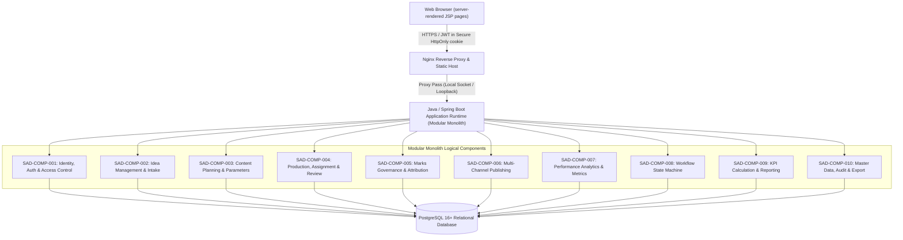
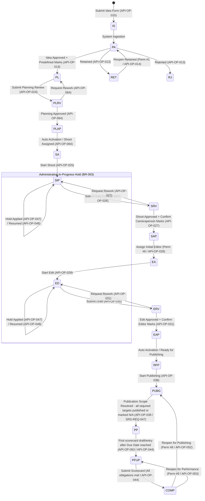

# API Specification — KCPC Marketing Management System (Content Production Lifecycle MVP)

**Document ID:** `KCPC-MKT-API-001`  
**Document Title:** API Specification  
**Project Name:** Content Production Lifecycle MVP  
**Client:** KCPC Bandhani  
**Version:** `0.4.0`  
**Status:** Draft — **CANDIDATE (R3.5)** — Technical Architecture Change Package (`KCPC-MKT-CR-R3.5-001`); PENDING INDEPENDENT RE-REVIEW — not frozen; source frozen baseline: **R3.4 / API v0.3.0**  
**Classification:** Confidential — Internal Use Only  
**Created Date:** August 11, 2026  
**Last Modified Date:** August 13, 2026  

---

## 1. Document Control & Governance

### 1.1 Document Metadata
| Metadata Attribute | Governed Specification Value |
| :--- | :--- |
| **Document Identifier** | `KCPC-MKT-API-001` |
| **Document Title** | API Specification — Content Production Lifecycle MVP |
| **System Name** | KCPC Marketing Management System (Bandhani Content Production) |
| **Release Baseline** | Candidate API Contract Baseline v0.4.0 (R3.5) |
| **Author / Lead** | Principal API Architect & Requirements Traceability Lead |
| **Security Classification** | Strictly Confidential — Internal Development & QA Team Use |
| **Target Architecture** | REST-Oriented Modular Monolith (Java + Spring Boot, Spring Security, Hibernate/JPA, PostgreSQL 16+, Nginx, Spring MVC + JSP server-rendered UI, Docker-compatible) |

### 1.2 Upstream Source Baselines
This API specification strictly derives from and conforms to the following upstream project baselines:

| Baseline ID | Specification Document Title | Version | Date | Baseline Status |
| :--- | :--- | :---: | :---: | :--- |
| **KCPC-MKT-BFD-001** | [`Business_Foundation_Document.md`](file:///c:/Kcpc_Marketing_management_Project/Required_Documents/Business_Foundation_Document.md) | `v1.5.0` | Aug 12, 2026 | Authoritative Single Source of Truth (BR-001..BR-065, 10 Objectives, 30 KPIs, 17 Permissions, 22 Workflow Concepts; R3.4: +BR-064 Business Role catalogue, +BR-065 Planning Mode) |
| **KCPC-MKT-BRS-001** | [`Business_Requirements_Specification.md`](file:///c:/Kcpc_Marketing_management_Project/Required_Documents/Business_Requirements_Specification.md) | `v1.1.0` | Aug 12, 2026 | Business Requirements (86 BRS Requirements incl. R3.4 BRS-REQ-085/086, 214 Acceptance Criteria) |
| **KCPC-MKT-SRS-001** | [`Software_Requirements_Specification.md`](file:///c:/Kcpc_Marketing_management_Project/Required_Documents/Software_Requirements_Specification.md) | `v0.3` | Aug 12, 2026 | Software Requirements (93 SRS Requirements incl. R3.4 SRS-REQ-092/093, 214 ACs) |
| **KCPC-MKT-SAD-001** | [`System_Architecture_and_Solution_Design.md`](file:///c:/Kcpc_Marketing_management_Project/Required_Documents/System_Architecture_and_Solution_Design.md) | `v0.4` | Aug 13, 2026 | Solution Design (10 Logical Components, 34 SAD-DES Elements incl. R3.4 SAD-DES-033/034, 10 ADRs) |
| **KCPC-MKT-ERD-001** | [`Entity_Relationship_Diagram_and_Data_Dictionary.md`](file:///c:/Kcpc_Marketing_management_Project/Required_Documents/Entity_Relationship_Diagram_and_Data_Dictionary.md) | `v0.4` | Aug 13, 2026 | Physical Relational Schema (43 Active Tables incl. R3.4 ERD-TBL-044 business_roles, 1 View, 1 Retired ID, 66 Constraints incl. ERD-CON-063/064/065/066) |
| **KCPC-MKT-RTM-001** | [`Requirements_Traceability_Matrix.md`](file:///c:/Kcpc_Marketing_management_Project/Required_Documents/Requirements_Traceability_Matrix.md) | `v0.4` | Aug 13, 2026 | Traceability Matrix (86 BRS Rows incl. RTM-085/086, 93 SRS Mappings) |
| **KCPC-MKT-WALKTHROUGH-001** | [`walkthrough.md`](file:///c:/Kcpc_Marketing_management_Project/Required_Documents/walkthrough.md) | `Updated` | Aug 12, 2026 | Baseline Alignment & Five-File Transaction Verification Record |

### 1.3 Revision History
| Version | Date | Author / Role | Description of Changes | Reviewed By |
| :---: | :---: | :--- | :--- | :--- |
| **0.1** | August 11, 2026 | Principal API Architect | Complete strict source reconstruction of initial candidate API specification baseline derived from BFD v1.4.4, BRS v1.0.4, SRS v0.2, SAD v0.2, ERD v0.2, and RTM v0.2. Defines REST operations across the 10 formal SAD components. | Pending Technical Review |
| **0.1.1** | August 11, 2026 | Development Review Assistant | Traceability correction pass (no behavioural or scope change): re-mapped `ERD-CON` constraint citations across §17/§21/§22 to the ERD v0.2 constraint catalogue (e.g. all-targets-N/A → `ERD-CON-017`, editor-before-`SAP` → `ERD-CON-013`, delegated self-approval → `ERD-CON-011`, post-completion cancel lock → `ERD-CON-006`); aligned Reschedule eligibility to `SRS-REQ-056` (any active pre-completion stage); corrected the §18 `PLAP → SA` auto-activation reference from `API-OP-023` to `API-OP-024`; clarified the Planning submit/decide flow in `API-OP-024`; corrected the §3 precedence chain to place RTM above SRS. | Pending Technical Review |
| **0.2** | August 11, 2026 | Development Review Assistant | Business-clarification resolution, structural, and closure-fix pass. (1) Resolved `SC-REQ-001` (zero-denominator rate → `N/A`, excluded from averages/KPIs) and `SC-REQ-002` (scorecard **DRAFT lifecycle**: new `API-OP-063` Save/Update Draft, `API-OP-044` finalizes/seals), now sourced in BFD SSOT `v1.4.5`. (2) **Split Planning Review** into submit (`API-OP-024`, `PL`→`PLRV`) and decision (**new `API-OP-064`**, `PLRV`→`PLAP`/`PL`), mirroring Shoot/Edit; **total operations 62 → 64**. (3) Added the mandated Reassign task-state reset to `SA`/`EA` from any active shooting/editing state (`API-OP-050`); specified Reschedule's no-status-change effect (`API-OP-049`); broadened `API-OP-051` Cancel to active-or-dormant pre-first-completion records. (4) **Reconciled every endpoint's `Source Requirements`** to the validated trace chain in §27/§28/§29 & ERD §25 (SAD-DES/BRS/RTM/SRS zero-overlaps eliminated). (5) **Normalized all 64 operation cards** to the full contract template (every card carries Authentication, Operational Permission, Scope, Self-Approval, Privacy, Path/Query, Transaction Boundary, Read/Write Effects, Workflow/Audit Effects, Success Status, and Domain Errors, or explicit N/A). (6) Standardized permission technical codes to `PERM_NN_*`. | Pending Technical Review |
| **0.2.1** | August 12, 2026 | Development Review Assistant | Second closure-review pass (14 findings). **Blockers:** rebuilt each card's `Operational Permission Requirement` from its own Authorized Base Roles (eliminated the spurious "Permission #18"); made the operational-permission lifecycle complete & non-destructive — `API-OP-009` is now a soft-revoke (`revoked_at`/`is_active=FALSE`) and **new `API-OP-065`** modifies/expires a grant; corrected the Content-ID/plan timing — the `content_plans` row and Content ID are now allocated atomically at Idea Approval (`API-OP-013`) with `API-OP-015` **RETIRED** as a reserved identifier (mirroring `ERD-TBL-040`); made `API-OP-039` `PUBG`→`PP` conditional on full publication-scope resolution (`SRS-REQ-047`); repaired `API-OP-042` N/A path to carry both `plannedOutputId` and `targetId`; completed the master-catalogue API with **new `API-OP-066`..`070`** (Platform/Channel/Target CRUD under Perm #17 with mandatory reasons). **Major:** removed non-persistable DTO fields (`title` from `API-OP-018`, `notes` from `API-OP-044`/`063`, replaced the talent DTO in `API-OP-021` with a single `talentName` per `ERD-TBL-041`); represented scorecard N/A via the explicit `*IsNa` flags (`ERD-TBL-024`) with a null-vs-N/A rule; relaxed `API-OP-010` reference to an optional URL **or** note (`SRS-REQ-084`); specified the Employee server-side read-scope on `API-OP-016`/`043`/`060` (`SRS-REQ-002`/`066`/`067`). **Minor:** corrected the §18 `PP`→`PFUP` trigger (first scorecard draft/entry after due date, not date arrival) and the `PUBG`→`PP` label; added `SRS-REQ-088` to `API-OP-045`; synchronized §16/§27/§28/§29/§31 matrices and counts to **70 operation IDs (69 active + retired `API-OP-015`)**. | Pending Technical Review |
| **0.2.2** | August 12, 2026 | Development Review Assistant | Third closure-review pass (7 findings). **Blocker:** broadened the delegated-Employee self-review guard on `API-OP-027`/`031`/`064` (and the §9/§19 governance statements, the §9 17-Permission Catalogue self-approval summaries for Permission #1/#3/#5/#7, and the §31 self-approval-guard checklist item) from "cannot approve" to blocking **every review decision** — Approve **and** Request Rework (Idea Review: Approve/Reject/Retain) — on own work, per `SRS-REQ-012`/`BRS-REQ-012`/`AC-012.1`/`AC-012.2` and `ERD-CON-011`; the item routes to another authorized reviewer (`API-OP-013` Idea Review already blocked at operation level). **High:** replaced all stale system-wide `API-OP-001`..`064` ranges in §27/§28 (permission validation `SRS-REQ-007`, audit logging `SRS-REQ-063`, concurrency `SRS-REQ-079`, external-API exclusion `SRS-REQ-082`, status-edit prohibition `SRS-REQ-083`) with `API-OP-001`..`070` so operations 065–070 inherit the global authorization/audit/validation/security invariants. **Medium:** normalized document metadata to this Version `0.2.2` / Last Modified August 12, 2026 (header now matches the revision history); the §3 precedence self-reference and the §32 closing statement now both read `API v0.2.2`. Companion cross-document fixes this pass (in their own files): SAD state diagram `PP`→`PFUP` trigger corrected to first eligible scorecard draft/metric entry on-or-after the due date; RTM UI/UX column populated for the designed core screens; UI/UX global URL-validation wording split (free-form Reference Link/Note vs strict Folder/Evidence URL) and self-review presentation corrected; Content-ID allocation wording standardized to "allocated atomically during Idea Approval as the approved Idea transitions into Planning." **Round-3.2 traceability correction (same review cycle):** the `SRS-REQ-012` / `RTM-012` self-review mapping in §27/§28 was corrected from the Planning **submit** op `API-OP-024` to the Planning **decision** op `API-OP-064` — the self-review barrier governs the review *decision*, not plan submission, so a preparer may still submit their own plan via `API-OP-024`; and the §1.2 source-baseline dates for the SAD/ERD/RTM/Walkthrough (all revised August 12 at their retained baseline versions) were advanced to Aug 12, 2026. | Pending Independent Re-Audit |
| **0.3.0** | August 12, 2026 | Development Review Assistant | **CANDIDATE — R3.4 Business Change Package (source: frozen R3.3 / API v0.2.3); PENDING INDEPENDENT REVIEW — not frozen.** Change A (Business Roles): session/user DTOs expose `businessRole` (name) + read-only resolved `accessClass`; `API-OP-005`/`API-OP-006` take `businessRoleId` (resolving to one of the 3 unchanged internal access classes); **new `API-OP-071`** (List Business Roles), **`API-OP-072`** (Create Business Role — defaults to `EMPLOYEE`), **`API-OP-073`** (Update/Deactivate Business Role); authorization resolves user→Business Role→access class; a Role name never grants a permission; 17 Operational Permissions unchanged. Change B (Output taxonomy): `API-OP-020` output enum `Photography`/`Reel`/`Video` (`SHORT_CLIP` retired from active values); Reel-Type conditional validation rejects `VIDEO+reelType`, `PHOTOGRAPHY+reelType`, `REEL+null`. Change C (Urgent Planning): `API-OP-018` gains `planningMode` (`STANDARD`/`URGENT`) + `urgencyReason`; STANDARD keeps −5/−2 default, URGENT takes manual Shoot/Edit dates + mandatory reason via the same Planning Review; `<5-day` live-date requires URGENT. Operation IDs now span `API-OP-001`..`073` (72 active + retired `API-OP-015`). Traces to new `SRS-REQ-092/093`, `BRS-REQ-085/086`, `SAD-DES-033/034`, `ERD-TBL-044`, `ERD-CON-063/064/065`. No fourth access class; no Urgent status/priority/permission/gate; no second Planning workflow. **Closure pass (Aug 12, 2026):** applied independent-review corrections — Business-Role-resolving-to-access-class propagated through `SRS-REQ-002/003/004/005`, requirement titles, and §8/§9/§13/§27/§28/§31 role labels; current self-governance (§32, gates #1/#2, precedence, closing statement) advanced to v0.3.0 against the R3.4 candidate baselines; `API-OP-018` gained the `Shoot ≤ Edit ≤ Live` chronology check with **same-day Shoot/Edit permitted under Urgent** (approved decision; `ERD-CON-066`). Pending final independent re-audit. | CANDIDATE — Pending Independent Review |
| **0.4.0** | August 13, 2026 | Solution Architecture Team | **CANDIDATE — R3.5 Technical Architecture Change Package** (`KCPC-MKT-CR-R3.5-001`; source frozen baseline: **R3.4 / API v0.3.0**); PENDING INDEPENDENT RE-REVIEW — not frozen. Developer-stack realignment: **Node.js 20+ → Java + Spring Boot**; **React 18+/TypeScript SPA → Spring MVC + JSP server-rendered UI**; **server-managed sessions → Spring Security signed JWT** in a Secure/HttpOnly/SameSite cookie with a server-side token registry (`ERD-TBL-002`) giving immediate revocation on logout and account deactivation; **the R3.4 prohibition on JWT is superseded**; persistence via **Hibernate/JPA**; **Swagger/OpenAPI** added as conformant documentation (this specification remains authoritative); **PostgreSQL 16+, Nginx, REST `/api/v1` and the modular monolith retained**; Docker-compatible deployment; CSRF protection applies to every unsafe/state-changing request authenticated by the browser cookie, including `/app/**` and cookie-authenticated `/api/v1/**`; `GET`/`HEAD` are non-mutating and exempt. Revised realization for `API-OP-001`/`API-OP-002`/`API-OP-003`. _Independent review closure (rounds 1–4): `API-OP-001`/`003` session/user DTOs corrected from `baseRole` to **`businessRole` + read-only `accessClass`**, and `API-OP-004` peer-privacy attributes and query filters moved to `businessRoleId`/`accessClass` — closing a **pre-existing R3.4 contract defect** already governed by the R3.4 change record and `SRS-REQ-092`, not a new business change. Logout converged on registry revocation (`is_revoked = TRUE`, no deletion); login persists `SHA-256(jti)`; the authentication cookie is scoped `Path=/`; CSRF covers every unsafe cookie-authenticated request._ **No operation added, removed or renumbered — 73 IDs (72 active + retired `API-OP-015`) unchanged**; all paths, methods, validations, permissions, workflow effects and domain error codes preserved. **No business change.** | Pending |
| **0.2.3** | August 12, 2026 | Development Review Assistant | **Controlled post-freeze change (supersedes Development Baseline R3.2 → R3.3).** Closes two contract gaps surfaced by independent review of the UI/UX v0.2 companion, with no business-model change: (1) **`API-OP-005`** now requires a mandatory non-empty **`creationReason`** — user account creation is an account-administration action that `SRS-REQ-005` / `AC-005.1` require to carry a reason (blocked on save if missing), mirroring `statusReason` on `API-OP-006`; the §27/§28 `SRS-REQ-005`/`RTM-005` rows now map both `API-OP-005` and `API-OP-006`. (2) Reporting operations gained explicit filter query parameters matching the existing convention on `API-OP-058`: `startDate`/`endDate` on `API-OP-056` (Team Workload, +`stage`), `API-OP-057` (Team KPI), and `API-OP-059` (Administrative-Action, +`actionType`); and `stage`/`priority` on `API-OP-060` (Delayed Deliverables). No new requirement, table, column, or constraint is introduced; the reason is persisted in the existing `system_audit_log`. | Pending Independent Re-Audit |

### 1.4 Distribution & Governance List
| Role / Stakeholder | Organization / Practice | Purpose |
| :--- | :--- | :--- |
| **CEO / Owner** | KCPC Bandhani | Executive Sign-Off & Governance Invariant Verification |
| **Marketing Manager** | KCPC Bandhani | Operational Workflow & Review Gate Verification |
| **Principal Solution Architect** | Enterprise Advisory | Architectural Conformance & Data Integrity Review |
| **Backend Engineering Lead** | Delivery Team | HTTP Contract, Transaction Boundaries, Error Schemas |
| **Frontend Engineering Lead** | Delivery Team | Server-Rendered View Integration (Spring MVC / JSP), Visibility Constraints |
| **QA / Test Engineering Lead** | Delivery Team | Contract Verification, Boundary & Traceability Testing |

---

## 2. Purpose, Scope & Audience

### 2.1 Purpose
This document provides the formal, implementation-ready HTTP REST API contract for the **KCPC Bandhani — Content Production Lifecycle MVP**. It translates functional and non-functional requirements from the upstream specification baseline into unambiguous REST operations, explicit Data Transfer Objects (DTOs), server-side validation rules, authorization barriers, transactional boundaries, error envelopes, and audit side-effects.

### 2.2 System Boundary & Scope
The API governs the end-to-end content production lifecycle across all **seven operational stages**:
1. **Stage 1 (Idea Submission):** Multi-role idea submission via dedicated form capturing Title, Reference Link/Note, Remarks; automated Idea ID (`IDEA-YYYYMMDD-NNNN`).
2. **Stage 2 (Idea Review):** Formal evaluation gate under Permission #1 (Approve with predefined role Marks `[0, 0.5, 1, 2, 3]`, Reject with mandatory reason, Retain); administrative reopening of Retained ideas under Permission #1.
3. **Stage 3 (Planning):** Content ID generation (`C-MMYY-NNNN` with monthly reset in IST), optional free-text Category, Content Priority (Low/Medium/High), SKU Reference / SKU N/A, Planned Outputs (Photography, Reel [Very Short/Short/Long], Video), Talent entries, Publication Target mappings, Content Asset Folder Link under Permission #13, initial Cameraperson assignment under Permission #4, and Planning Review gate under Permission #3.
4. **Stage 4 (Shooting Execution & Review):** Shooting task activation, folder link validation, Shoot Review gate under Permission #5 (Approve, Request Rework), and qualifying Cameraperson Mark attribution.
5. **Stage 5 (Editing Execution & Review):** Post-Shoot Approval initial Editor assignment under Permission #6, editing task activation, Edit Review gate under Permission #7 (Approve, Request Rework), and qualifying Editor Mark attribution.
6. **Stage 6 (Multi-Channel Publishing):** Master Platform (6) and Company Channel (8) catalogues under Permission #17, Publication Target mapping, Actual Publication Event logging (`Original`/`Repost`) under Permission #8, linked evidence URL correction under Permission #8, and auditable/reversible Target N/A exceptions.
7. **Stage 7 (Performance Tracking & Completion):** Event-specific Performance Obligations with non-reschedulable Performance Due Date (`Actual Date + 2 calendar days`), Creative Performance Scorecard capture under Permission #9, deterministic rate derivation (Hook, Hold, CTR), linked metric corrections under Permission #9, and workflow completion.
8. **Administrative Actions:** Explicit operations for Hold & Resume (SIP/ED only, CEO/MM only, status unchanged, mandatory hold reason, no resume reason), Reschedule under Permission #10 (approved dates only, mandatory reason), Reassign under Permission #11 (mandatory reason), Cancel under Permission #12 (pre-completion only, mandatory reason), Reopen Completed under Permission #8 (Publishing) and Permission #9 (Performance Update), and Predefined Mark corrections under Permission #1.
9. **Analytics, Reporting & Privacy:** 30 Governed KPIs (`KPI-001`..`KPI-030`), Team Workload under Permission #14, Team KPIs under Permission #15, Audit History under Permission #16, Administrative Action reporting, and strict Employee personal performance privacy (5 measures, peer data masked).
10. **Data Export:** Multi-format export engine (JSON, CSV, XLSX) covering the physical database schema union per RTM-081.

### 2.3 Explicit Out-of-Scope Items
- External social media API integrations (no automated publishing, no automated scraping per `BR-048`, `BRS-REQ-082`, `SAD-ADR-004`).
- Third-party marketing automation, schedulers, or webhooks.
- Public/unauthenticated endpoints (all operational endpoints require authenticated sessions).
- Direct client-driven workflow status overrides (all transitions are server-enforced side-effects of governed commands).
- Generic CRUD endpoints for audit logs, submitted scorecards, or marks attributions.

---

## 3. Source Hierarchy & Precedence

$$\text{BFD v1.5.0} \succ \text{BRS v1.1.0} \succ \text{RTM v0.4} \succ \text{SRS v0.3} \succ \text{SAD v0.4} \succ \text{ERD v0.4} \succ \mathbf{\text{API Specification v0.4.0 (R3.5 candidate)}}$$

In the event of ambiguity or apparent conflict during implementation, the higher baseline document strictly governs. The two prior source clarifications `SC-REQ-001` (zero-denominator rate → `N/A`) and `SC-REQ-002` (scorecard draft-then-submit lifecycle) were **RESOLVED by stakeholder decision on August 11, 2026** and are now recorded in the BFD SSOT (`v1.5.0`, Stage 7 governance / BR-026) and reflected across BRS, SRS, SAD, ERD, and this specification; see §26.

---

## 4. Architecture Context



### 4.1 Governed Architecture Baseline
- **Application Structure:** Modular Monolith architecture (`SAD-ADR-009`) with in-memory component interaction.
- **Frontend Consumer:** Server-rendered Spring MVC + JSP pages in the same deployable unit. MVC page controllers and REST controllers share one application/service layer; JSP pages do **not** call this API over HTTP. The REST contract remains externally consumable.
- **Backend Runtime:** Java + Spring Boot runtime; persistence through Hibernate / JPA.
- **Database Engine:** PostgreSQL 16+ enforcing ACID transactions, row-level locking, and 66 physical database integrity constraints (`ERD-CON-001` through `ERD-CON-066`).
- **Web / Proxy Tier:** Nginx reverse proxy terminating TLS and serving static assets (CSS, images).
- **Authentication Subsystem:** **Spring Security with signed JWT** delivered in a **Secure, HttpOnly, SameSite** cookie (`SAD-ADR-001`, R3.5). The token is **deliberately stateful**: its identifier is registered in PostgreSQL `user_sessions` (`ERD-TBL-002`) and revalidated server-side on every authenticated request together with the account's active status, so logout and CEO account deactivation take effect immediately. The token is **never** stored in `localStorage` or any script-readable store. CSRF protection applies to every unsafe/state-changing request authenticated by the browser cookie, including `/app/**` and cookie-authenticated `/api/v1/**`; `GET`/`HEAD` are non-mutating and exempt, enforced with Spring Security's synchronizer-token pattern and reinforced by `SameSite=Lax`. *R3.5 supersedes the R3.4 server-managed-session decision and its JWT prohibition.*
- **Deployment Topology:** Single Linux Virtual Private Server (VPS). Sizing boundary: fewer than 15 concurrent users (`SRS-REQ-079`).

---

## 5. API Design Principles

1. **REST Resource Modeling:** Predictable plural resource paths (e.g., `/api/v1/ideas`, `/api/v1/content-plans`, `/api/v1/workflows/{id}`).
2. **Explicit Domain Commands:** Governed state changes occur via dedicated command sub-resources (e.g., `/api/v1/workflows/{id}/hold`, `/api/v1/workflows/{id}/reschedule`) rather than generic entity mutation.
3. **Deterministic State Invariance:** Primary workflow status cannot be modified via arbitrary payload fields; state transitions are evaluated strictly against the 22 formal workflow concepts.
4. **Server-Side Validation:** All business rules, format patterns, scale limits, and role/permission checks execute on the backend prior to database transaction commit.
5. **Zero Silent Coercion:** Request payloads containing unexpected, malformed, or unparseable fields are rejected with structured `400 Bad Request` or `422 Unprocessable Entity` responses.
6. **Immutable Historical Audit:** All mutations automatically generate immutable records in physical history and audit tables (`system_audit_log`, `workflow_transition_history`, `work_hold_records`, etc.).

---

## 6. Base Path, Versioning & Media Type

- **Base URL Prefix:** `/api/v1` (Environment-configured deployment host; no hard-coded hostnames or ports).
- **API Version:** Fixed `/api/v1` prefix. Strictly no multi-version negotiation.
- **Request Content-Type:** `application/json; charset=utf-8` (Except export downloads).
- **Response Content-Type:** `application/json; charset=utf-8`
- **Character Encoding:** UTF-8 throughout.
- **System Timestamps:** ISO 8601 extended format in UTC (`YYYY-MM-DDTHH:mm:ss.sssZ`, PostgreSQL `TIMESTAMPTZ`).
- **Business Calendar Dates:** ISO 8601 date string (`YYYY-MM-DD`, PostgreSQL `DATE`) evaluated in `Asia/Kolkata` (IST) timezone.

---

## 7. Authentication & Session Contract

```mermaid
sequenceDiagram
    autonumber
    actor Client as Browser (JSP pages)
    participant Nginx as Nginx Proxy
    participant Auth as IAM Subsystem (SAD-COMP-001)
    participant DB as PostgreSQL (users, user_sessions)

    Client->>Nginx: POST /api/v1/auth/login { email, password }
    Nginx->>Auth: Forward Request
    Auth->>DB: Query user by email (users / ERD-TBL-001) & verify password_hash
    alt Credentials Invalid or Account Inactive (is_active = FALSE)
        Auth-->>Client: 401 Unauthorized (AUTH_INVALID_CREDENTIALS / AUTH_ACCOUNT_INACTIVE)
    else Credentials Valid & is_active = TRUE
        Auth->>DB: Insert registry row into user_sessions (ERD-TBL-002) with session_token_hash = SHA-256(jti), expires_at, user_agent, is_revoked = FALSE
        Auth-->>Client: 200 OK (Set-Cookie: kcpc_session=<JWT>; HttpOnly; Secure; SameSite=Lax; Path=/) + User Profile DTO
    end

    Note over Client, DB: Authenticated Requests
    Client->>Nginx: GET /api/v1/auth/session (Cookie: kcpc_session=...)
    Nginx->>Auth: Forward Request
    Auth->>DB: Verify JWT signature/expiry, look up SHA-256(jti) in registry, require is_revoked = FALSE & users.is_active = TRUE
    Auth-->>Client: 200 OK { user (businessRole + resolved accessClass), activePermissions, landingContext }

    Note over Client, DB: Logout
    Client->>Nginx: POST /api/v1/auth/logout (Cookie: kcpc_session=...)
    Nginx->>Auth: Forward Request
    Auth->>DB: UPDATE user_sessions SET is_revoked = TRUE for the presented token registry row (ERD-TBL-002)
    Auth-->>Client: 204 No Content (Set-Cookie: kcpc_session=; Expires=Thu, 01 Jan 1970...)
```

### 7.1 Authentication Token Specifications (R3.5)

- **Cookie Name:** `kcpc_session`
- **Cookie Security:** `HttpOnly=true`, `Secure=true` (production/HTTPS), `SameSite=Lax`, **`Path=/`**.
  > **`Path=/` is mandatory.** The server-rendered application is served under `/app/**` and the REST contract under `/api/v1/**`. A cookie scoped to `/api/v1` would **not** be transmitted to `/app/**` and the JSP application could not authenticate. Spring Security authenticates both path trees from the one cookie.
- **Token Format:** A **signed JWT** (`SAD-ADR-001`). The token is **deliberately stateful** — signature and expiry validation alone are **not** sufficient to authenticate a request.
- **Token Registry:** Each issued token carries a unique `jti` claim. `SHA-256(jti)` is stored in `user_sessions.session_token_hash` (`ERD-TBL-002`) with `expires_at`, `is_revoked` and `user_agent` (`SRS-REQ-077`). **Neither the raw JWT nor the raw `jti` is ever persisted.**
- **Token Storage Prohibition:** The authentication token is delivered **only** via the `HttpOnly` cookie. It must **never** be placed in `localStorage`, `sessionStorage`, or any script-readable store.

#### 7.1.1 Authentication Lifecycle (normative)

| Phase | Server behaviour |
| :--- | :--- |
| **Login** (`API-OP-001`) | Verify credentials → issue signed JWT with a fresh `jti` → insert `SHA-256(jti)` into `user_sessions` with `is_revoked = FALSE` → set the cookie. |
| **Every authenticated request** | Verify JWT signature → verify expiry → derive `jti` → look up `SHA-256(jti)` in `user_sessions` → **require the registry record to exist** → **require `is_revoked = FALSE`** → **require `users.is_active = TRUE`**. Any failure ⇒ `401 Unauthorized`. |
| **Logout** (`API-OP-002`) | Set `is_revoked = TRUE` on the presented token's registry row → clear the cookie. Revocation is server-authoritative; discarding the cookie alone does not end the session. |
| **Account deactivation** (`API-OP-006`) | Set `users.is_active = FALSE` → set `is_revoked = TRUE` on **all** non-revoked registry rows for that user. Previously issued tokens stop working immediately. |

Registry rows are **marked revoked, never physically deleted**, preserving the audit trail. Expired or revoked rows may be purged by a maintenance routine only after they can no longer affect authentication.

#### 7.1.2 CSRF Protection (normative)

Because the token travels in a cookie the browser attaches automatically, **CSRF protection applies to every state-changing request authenticated by that cookie** — both `/app/**` MVC form submissions and cookie-authenticated `/api/v1/**` calls using `POST`, `PUT`, `PATCH` or `DELETE`. Spring Security's synchronizer-token pattern is used, reinforced by `SameSite=Lax`. `GET` and `HEAD` are non-mutating and exempt. A non-browser API client presenting the token by another approved means is outside the cookie CSRF surface.

- **User Identity:** The user entity (`users` / `ERD-TBL-001`) uses `email` for login identification and `password_hash` for verification.
- **Account Inactivity Guard:** If `users.is_active` is `FALSE`, authentication and all previously issued tokens are instantly rejected (`401 Unauthorized` / `AUTH_ACCOUNT_INACTIVE`).

---

## 8. Formal Role & Authorization Model

### 8.1 Formal Base Roles (Internal Access Classes)
The system enforces **exactly three internal access classes** (`base_roles` / `ERD-TBL-003`; also referred to throughout this contract as *Base Roles* — the physical authorization tier). **No fourth access class exists.** These three access classes are the authorization tiers evaluated for every operation; they are **distinct from** the expandable **Business Role** catalogue (`business_roles` / `ERD-TBL-044`, R3.4 Change A), which records a user's organizational *designation* and always resolves to exactly one of these three access classes. A Business Role name never itself grants authority; wherever an operation card below lists **"Authorized Base Roles,"** it refers to these internal access classes, resolved as *user → Business Role → access class*. Business Role administration operations are `API-OP-071`/`072`/`073`.

1. **`CEO_OWNER` (CEO / Owner):** Complete operational visibility; full operational management authority; **exclusive** authority over user account provisioning, Business Role assignment, and operational permission grants; exempt from employee self-approval restrictions.
2. **`MARKETING_MANAGER` (Marketing Manager):** Department-wide operational management, review decision authority, task assignment, and performance tracking. Has **zero** user account administration authority and **zero** permission administration authority; exempt from employee self-approval restrictions.
3. **`EMPLOYEE` (Employee):** Operational contributor (Cameraperson, Editor, Content Team Member) with default self-service workspace. Receives additional operational capabilities **exclusively** via active CEO-Granted Operational Permissions. Has zero administration authority and cannot delegate permissions onward.

---

## 9. Exact 17-Permission Catalogue

In strict accordance with `BFD §6.4`, `BRS-REQ-002`, `SRS-REQ-006`, `SAD-DES-003`, and `ERD-TBL-004`, exactly 17 operational permissions exist:

| Permission # | Formal Permission Code | Governed Permission Name | Default Executive Authority | Delegable to Employee? | Employee Delegated Self-Approval Barrier? |
| :---: | :--- | :--- | :---: | :---: | :---: |
| **#1** | `PERM_01_IDEA_REVIEW` | Idea Review | CEO, MM | Yes | Yes (cannot make **any** review decision — Approve/Reject/Retain — on own submitted idea) |
| **#2** | `PERM_02_PLANNING_EXECUTION` | Planning Execution | CEO, MM | Yes | No |
| **#3** | `PERM_03_PLANNING_REVIEW` | Planning Review | CEO, MM | Yes | Yes (cannot make **any** review decision — Approve/Request Rework — on a plan they prepared) |
| **#4** | `PERM_04_SHOOT_ASSIGNMENT` | Shooting Assignment Management | CEO, MM | Yes | No |
| **#5** | `PERM_05_SHOOT_REVIEW` | Shoot Review | CEO, MM | Yes | Yes (cannot make **any** review decision — Approve/Request Rework — on a shoot they participated in) |
| **#6** | `PERM_06_EDIT_ASSIGNMENT` | Editing Assignment Management | CEO, MM | Yes | No |
| **#7** | `PERM_07_EDIT_REVIEW` | Edit Review | CEO, MM | Yes | Yes (cannot make **any** review decision — Approve/Request Rework — on an edit they participated in) |
| **#8** | `PERM_08_PUBLISHING_EXECUTION` | Publishing Execution | CEO, MM | Yes | No |
| **#9** | `PERM_09_PERFORMANCE_UPDATE` | Performance Update | CEO, MM | Yes | No |
| **#10** | `PERM_10_RESCHEDULE` | Reschedule | CEO, MM | Yes | No |
| **#11** | `PERM_11_REASSIGN` | Reassign | CEO, MM | Yes | No |
| **#12** | `PERM_12_CANCEL` | Cancel | CEO, MM | Yes | No |
| **#13** | `PERM_13_FOLDER_LINK_MANAGE` | Content Asset Folder Link Management | CEO, MM | Yes | No |
| **#14** | `PERM_14_TEAM_WORKLOAD_VIEW` | Team Workload Visibility | CEO, MM | Yes | No |
| **#15** | `PERM_15_TEAM_KPI_VIEW` | Team KPI Visibility | CEO, MM | Yes | No |
| **#16** | `PERM_16_AUDIT_HISTORY_VIEW` | Relevant Audit-History Visibility | CEO, MM | Yes | No |
| **#17** | `PERM_17_PLATFORM_CATALOGUE_MANAGE` | Platform & Channel Catalogue Management | CEO, MM | Yes | No |

> [!IMPORTANT]
> **Permission Governance Rules:**
> - Strictly **NO Permission #18** exists.
> - **Hold & Resume** are administrative lifecycle actions governed by `BR-063` / `BRS-REQ-084` / `SRS-REQ-091` / `SAD-DES-027` / `ERD-TBL-043` restricted exclusively to `CEO_OWNER` and `MARKETING_MANAGER`. They are NOT delegable operational permissions.
> - **User & Business Role Administration** (user account status + the user’s Business Role, which resolves to an internal access class) is an exclusive executive power of `CEO_OWNER` (`SRS-REQ-003`, `SRS-REQ-004`, `SRS-REQ-092`). It is NOT an operational permission.
> - **Delegated Self-Approval Barrier:** Queryable provenance tables (`planning_preparers` / `ERD-TBL-037`, `shooting_execution_participants` / `ERD-TBL-038`, `editing_execution_participants` / `ERD-TBL-039`, `review_cycles` / `ERD-TBL-015`) enforce that Employees exercising delegated Permission #1, #3, #5, or #7 cannot make **any review decision** (neither `Approve` **nor** `Request Rework`) on work they submitted, prepared, executed, or submitted for review (`SRS-REQ-012` / `BRS-REQ-012`).

---

## 10. Exact 22-Workflow Catalogue

In strict accordance with `BFD §5.8`, `BRS-REQ-083`, `SRS-REQ-075`, `SAD §8.1`, and `ERD-TBL-006`, the workflow finite state machine is bounded to **exactly 22 workflow concepts**:

| # | Code | Governed Status Name | Lifecycle Class | Primary Operational Meaning |
| :---: | :---: | :--- | :---: | :--- |
| **1** | `IS` | Idea Submitted | Active | Idea newly ingested into system via dedicated submission form. |
| **2** | `PA` | Pending Approval | Active | Idea in active queue awaiting Stage 2 Idea Review evaluation. |
| **3** | `RJ` | Rejected | Terminal | Idea permanently rejected at Idea Review (requires mandatory reason; cannot be reopened). |
| **4** | `RET` | Retained | Dormant | Idea preserved in non-operational dormant state. Reopenable to `PA` under Permission #1. |
| **5** | `PL` | Planning | Active | Idea approved; Content ID (`C-MMYY-NNNN`) generated; Stage 3 planning in progress. |
| **6** | `PLRV` | Planning Review | Active | Content plan submitted for formal Stage 3 Planning Review evaluation. |
| **7** | `PLAP` | Planning Approved | Active | Content plan formally approved at Planning Review gate. |
| **8** | `SA` | Shoot Assigned | Active | Initial Cameraperson(s) assigned; ready for shooting execution start. |
| **9** | `SIP` | Shoot In Progress | Active | Active shooting execution underway. Eligible for administrative Hold (BR-063). |
| **10** | `SRV` | Shoot Review | Active | Raw footage submitted for formal Stage 4 Shoot Review evaluation. |
| **11** | `SAP` | Shoot Approved | Active | Shoot formally approved; qualifying Cameraperson marks confirmed; eligible for editor assignment. |
| **12** | `EA` | Edit Assigned | Active | Initial Editor(s) assigned post-shoot approval; ready for editing execution start. |
| **13** | `ED` | Editing | Active | Active post-production editing underway. Eligible for administrative Hold (BR-063). |
| **14** | `ERV` | Edit Review | Active | Edited draft submitted for formal Stage 5 Edit Review evaluation. |
| **15** | `EAP` | Edit Approved | Active | Edit formally approved; qualifying Editor marks confirmed. |
| **16** | `RFP` | Ready for Publishing | Active | All production reviews approved; ready for publication execution. |
| **17** | `PUBG` | Publishing | Active | Active multi-platform publication execution underway. |
| **18** | `PP` | Performance Pending | Active | Actual publication event recorded; awaiting arrival of Performance Due Date (`Actual + 2d`). |
| **19** | `PFUP` | Performance Update | Active | Performance Due Date reached; active scorecard metric entry underway. |
| **20** | `COMP` | Completed | Closed / Reopenable | All performance obligations satisfied. Reopenable under Perm #8 (Publishing) or Perm #9 (Performance). |
| **21** | `DLY` | Delayed | Supplementary Flag | Dynamic real-time calculation flag indicating deliverable milestone overdue. **Not a primary status**. |
| **22** | `CAN` | Cancelled | Terminal | Deliverable terminated pre-completion under Permission #12 (requires mandatory reason). |

---

## 11. Common Request / Response Conventions

### 11.1 Request Headers
```http
Content-Type: application/json; charset=utf-8
Accept: application/json
X-Request-ID: 7b39a48e-28cb-4e92-9721-6a2c1f4e0987 (Optional client trace UUID)
```

### 11.2 Standard Success Response Envelope (Single Resource)
```json
{
  "success": true,
  "data": {
    "id": "019142b5-7c01-7000-8000-123456789abc",
    "resourceType": "content_plan",
    "attributes": { ... }
  },
  "metadata": {
    "requestId": "7b39a48e-28cb-4e92-9721-6a2c1f4e0987",
    "timestamp": "2026-08-11T12:00:00.000Z"
  }
}
```

### 11.3 Standard Paginated Collection Response Envelope
```json
{
  "success": true,
  "data": [ ... ],
  "pagination": {
    "page": 1,
    "pageSize": 25,
    "totalRecords": 142,
    "totalPages": 6,
    "hasNextPage": true,
    "hasPreviousPage": false
  },
  "metadata": {
    "requestId": "7b39a48e-28cb-4e92-9721-6a2c1f4e0987",
    "timestamp": "2026-08-11T12:00:00.000Z"
  }
}
```

---

## 12. Canonical Error Contract

### 12.1 Machine-Readable Error Schema
```json
{
  "success": false,
  "error": {
    "errorCode": "WORKFLOW_INVALID_TRANSITION",
    "message": "Cannot submit deliverable for Shoot Review while current workflow status is 'SA'. Work must be in 'SIP' (Shoot In Progress).",
    "details": "Current status code: SA, required status code: SIP",
    "fieldErrors": [
      {
        "field": "workflowInstanceId",
        "rejectedValue": "019142b5-7c01-7000-8000-123456789abc",
        "reason": "Workflow instance is not in an executable state for this action"
      }
    ],
    "requestId": "7b39a48e-28cb-4e92-9721-6a2c1f4e0987",
    "timestamp": "2026-08-11T12:00:00.000Z"
  }
}
```

### 12.2 HTTP Status Codes & Domain Errors
- **`200 OK` / `201 Created` / `204 No Content`**
- **`400 Bad Request`:** `REQ_MALFORMED_JSON`, `REQ_INVALID_SYNTAX`
- **`401 Unauthorized`:** `AUTH_MISSING_SESSION`, `AUTH_INVALID_CREDENTIALS`, `AUTH_SESSION_EXPIRED`, `AUTH_ACCOUNT_INACTIVE`
- **`403 Forbidden`:** `PERM_DENIED`, `PERM_SCOPE_MISMATCH`, `PERM_SELF_APPROVAL_PROHIBITED`, `PERM_EXECUTIVE_ONLY`
- **`404 Not Found`:** `RESOURCE_NOT_FOUND`
- **`409 Conflict`:** `WORKFLOW_STATE_CONFLICT`, `WORKFLOW_ACTIVE_HOLD_BLOCKS_ACTION`, `HOLD_ALREADY_ACTIVE`, `RESUME_NO_ACTIVE_HOLD`, `CANCEL_LOCKED_POST_COMPLETION`
- **`422 Unprocessable Entity`:** `VALIDATION_REQUIRED_FIELD_MISSING`, `VALIDATION_ENUM_INVALID`, `VALIDATION_MARKS_SCALE_INVALID`, `VALIDATION_ALL_TARGETS_NA_PROHIBITED`, `VALIDATION_PLANNING_FIELD_IN_IDEA_PROHIBITED`

---

## 13. Validation Rules & Domain Enumerations

### 13.1 Centralized Domain Enumerations
- **Internal Access Classes (Base Roles):** `CEO_OWNER`, `MARKETING_MANAGER`, `EMPLOYEE` (a user is assigned a **Business Role** that resolves to exactly one of these; see `ERD-TBL-044`).
- **Priority Levels:** `Low`, `Medium`, `High` (Strictly 3 levels; Stage 3 Planning only).
- **Planned Output Types:** `Photography`, `Reel`, `Video`
- **Reel Types (Applicable strictly when Output Type = `Reel`):** `Very Short`, `Short`, `Long` (No duration bands).
- **Predefined Marks Scale:** `0.0`, `0.5`, `1.0`, `2.0`, `3.0` (Fixed numeric set; non-divisible, non-averageable).
- **Publication Event Types:** `Original`, `Repost`
- **Publication Platforms (6 seeds):** `Instagram`, `Threads`, `YouTube`, `Facebook`, `Moj`, `TikTok`
- **Company Channels (8 seeds):** `kcpcsikar`, `kcpcbandhani`, `kcpc_sikar`, `kcpcbandhani.01`, `kcpc.english`, `piyushxbusiness`, `kcpclegacy`, `kcpc_legacy`
- **Review Decisions:**
  - Idea Review: `Approve`, `Reject`, `Retain`
  - Production Reviews (Planning / Shoot / Edit): `Approve`, `Request Rework` (Strictly NO Reject).
- **Workflow Concept Codes (22):** `IS`, `PA`, `RJ`, `RET`, `PL`, `PLRV`, `PLAP`, `SA`, `SIP`, `SRV`, `SAP`, `EA`, `ED`, `ERV`, `EAP`, `RFP`, `PUBG`, `PP`, `PFUP`, `COMP`, `DLY`, `CAN`

### 13.2 Planning Category Rule (Stage 3)
- **Field Name:** `categoryText` (`content_plans.category_text` / `ERD-TBL-010`).
- **Data Type:** `string | null`
- **Governance:** Optional manual free-text attribute. May be blank or contain one/multiple category values as typed by user. Zero reference list, master table, or foreign key backing (`ERD-TBL-040` is retired/reserved). NO delimiter rules, tokenization, or array semantics. Blank Category never blocks review submission or approval.

### 13.3 Business Identifiers
- **Idea ID:** `IDEA-YYYYMMDD-NNNN` (Generated on submission; stored on `ideas` / `ERD-TBL-009`).
- **Content ID:** `C-MMYY-NNNN` (allocated atomically during Idea Approval — `API-OP-013`, as the approved Idea transitions into Planning — via `content_id_sequences` / `ERD-TBL-042` based on IST business month; no separate Planning-entry operation).
- **Technical UUIDs:** RFC 4122 UUIDv7 strings for all primary keys.

---

## 14. Pagination, Filtering & Technical Conventions

- **Query Parameters:** `page` (integer $\ge 1$, default 1), `pageSize` (integer $1..100$, default 25), `sort` (field name), `order` (`asc` / `desc`), `search` (text search).
- **Labeling:** Page-size defaults and limits are API technical transport conventions, not business requirements.
- **Concurrency & Locking:** PostgreSQL ACID transactions with row-level locking (`SELECT ... FOR UPDATE`) on `workflow_instances` and `content_plans` during command execution.

---

## 15. Audit, Immutability & Privacy Rules

1. **System-Wide Immutable Audit:** All mutations automatically write structured event rows into `system_audit_log` (`ERD-TBL-025`). Deletion or modification of audit records is strictly prohibited.
2. **Linked Correction Chains:** Corrections to predefined marks (`ERD-TBL-026`), publication evidence (`ERD-TBL-027`), and scorecard metrics (`ERD-TBL-028`) append immutable linked correction records with mandatory reasons without overwriting original historical records.
3. **Strict Employee Peer Privacy:** Employee personal queries return own tasks, own feedback, and own 5 personal performance measures: (1) Delayed Work, (2) Approved Work / Task Outputs, (3) Review Submissions, (4) Request Rework Before Approval, and (5) Personal Marks for qualifying Cameraperson/Editor work. Peer marks, rankings, compensation, and leaderboards are strictly masked.

---

## 16. API Domain Catalogue

The API operations are organized across the **10 formal SAD components**:

| Domain ID | Formal SAD Component Title | Primary Business Capabilities | Operation Range |
| :---: | :--- | :--- | :---: |
| **`API-DOM-001`** | **`SAD-COMP-001`: Identity, Auth & Access Control** | Authentication, sessions, user management, Business Role catalogue, permission grants (incl. grant revoke/modify/expire) | `API-OP-001` .. `API-OP-009`, `API-OP-065`, `API-OP-071` .. `API-OP-073` |
| **`API-DOM-002`** | **`SAD-COMP-002`: Idea Management & Intake** | Idea submission, idea queue, idea review gate, retained idea reopen | `API-OP-010` .. `API-OP-014` |
| **`API-DOM-003`** | **`SAD-COMP-003`: Content Planning & Parameters** | Content plan entry, outputs, talent, folder link, cameraperson, plan submit & review | `API-OP-015` .. `API-OP-024`, `API-OP-064` |
| **`API-DOM-004`** | **`SAD-COMP-004`: Production, Assignment & Review** | Shoot start/submit/review, editor assign, edit start/submit/review | `API-OP-025` .. `API-OP-031` |
| **`API-DOM-005`** | **`SAD-COMP-005`: Marks Governance & Attribution** | Marks ledger queries, predefined mark corrections under Perm #1 | `API-OP-032` .. `API-OP-033` |
| **`API-DOM-006`** | **`SAD-COMP-006`: Multi-Channel Publishing** | Platforms, channels, targets, publication events, evidence corrections, N/A; master-catalogue CRUD under Perm #17 | `API-OP-034` .. `API-OP-042`, `API-OP-066` .. `API-OP-070` |
| **`API-DOM-007`** | **`SAD-COMP-007`: Performance Analytics & Metrics** | Performance obligations, scorecard draft, scorecard submission, metric corrections | `API-OP-043` .. `API-OP-046`, `API-OP-063` |
| **`API-DOM-008`** | **`SAD-COMP-008`: Workflow State Machine** | Hold, Resume, Reschedule, Reassign, Cancel, Reopen Completed | `API-OP-047` .. `API-OP-054` |
| **`API-DOM-009`** | **`SAD-COMP-009`: KPI Calculation & Reporting** | Employee 5-measures, team workload, team KPIs, 30 KPIs, admin report | `API-OP-055` .. `API-OP-060` |
| **`API-DOM-010`** | **`SAD-COMP-010`: Master Data, Audit & Export** | Audit log visibility under Perm #16, multi-format synchronous data export | `API-OP-061` .. `API-OP-062` |

---

## 17. Detailed API Operation Catalogue (`API-OP-001` .. `API-OP-073`)

### 17.1 Domain 1: Identity, Auth & Access Control (`SAD-COMP-001`)

---

#### `API-OP-001`: User Login & Session Establishment
- **Domain:** `API-DOM-001` (`SAD-COMP-001`)
- **Operation Name:** User Login & Session Establishment
- **HTTP Method & Path:** `POST /api/v1/auth/login`
- **Purpose:** Authenticates user via email and password, issues a signed JWT, registers the token identifier in `user_sessions` (`ERD-TBL-002`), and returns it in a Secure, HttpOnly, SameSite cookie. *Realization revised under R3.5; request/response contract, validation and error behaviour unchanged.*
- **Source Requirements:** `BFD §6.1`, `BR-034`, `BR-035`, `BR-038`, `BR-044`, `BR-049`, `BR-050`, `BR-051`, `BR-053`, `BR-056`, `BR-057`, `BR-058`, `BR-061`, `BR-062` | `BRS-REQ-001`, `BRS-REQ-007`, `BRS-REQ-063`, `BRS-REQ-077`, `BRS-REQ-079`, `BRS-REQ-082`, `BRS-REQ-083` (`RTM-001`, `RTM-007`, `RTM-063`, `RTM-077`, `RTM-079`, `RTM-082`, `RTM-083`) | `SRS-REQ-001`, `SRS-REQ-007`, `SRS-REQ-063`, `SRS-REQ-077`, `SRS-REQ-079`, `SRS-REQ-082`, `SRS-REQ-083` | `SAD-DES-001`, `SAD-DES-004`, `SAD-DES-006`, `SAD-DES-031`, `SAD-DES-032` | `ERD-TBL-001`, `ERD-TBL-002` | `ERD-CON-001`
- **Authentication Requirement:** None (Public login endpoint).
- **Authorized Base Roles:** All registered users (`CEO_OWNER`, `MARKETING_MANAGER`, `EMPLOYEE`).
- **Operational Permission Requirement:** N/A — native to all authenticated roles within authorized scope; no delegated operational permission required.
- **Permission Scope Requirement:** N/A.
- **Employee Self-Approval Guard:** N/A.
- **Peer Privacy Rule:** N/A.
- **Path Parameters:** N/A.
- **Query Parameters:** N/A.
- **Request Body Schema:**
  ```json
  {
    "email": "rohit@kcpcbandhani.com",
    "password": "SecurePassword123!"
  }
  ```
- **Required Fields:** `email` (string, valid email format), `password` (string, non-empty).
- **Optional Fields:** N/A.
- **Field Types & Validation:** Standard string validation; user must exist in `users` (`ERD-TBL-001`) with `is_active = TRUE`.
- **Business Preconditions:** User account must be active.
- **Workflow Preconditions:** N/A.
- **Active-Hold Preconditions:** N/A.
- **Transaction Boundary:** Single transaction inserting the token-registry row and writing the login audit record.
- **Database Read Effects:** Reads `users` (`ERD-TBL-001`), `business_roles` (`ERD-TBL-044`) and `base_roles` (`ERD-TBL-003`) to project the organizational Business Role and its resolved internal access class.
- **Database Write Effects:** Inserts a registry row into `user_sessions` (`ERD-TBL-002`) with `session_token_hash` = `SHA-256(jti)`, `expires_at`, `user_agent`, `is_revoked = FALSE`.
- **Workflow State Effect:** None.
- **Audit Side Effect:** Inserts `AUTH_LOGIN_SUCCESS` or `AUTH_LOGIN_FAILURE` into `system_audit_log` (`ERD-TBL-025`).
- **Success HTTP Status:** `200 OK` (with `Set-Cookie: kcpc_session=<JWT>; HttpOnly; Secure; SameSite=Lax; Path=/`).
- **Success Response Schema:**
  ```json
  {
    "success": true,
    "data": {
      "user": {
        "id": "019142b5-7c01-7000-8000-000000000001",
        "email": "rohit@kcpcbandhani.com",
        "fullName": "Rohit Sharma",
        "businessRole": "Camera Person",
        "accessClass": "EMPLOYEE"
      },
      "landingContext": "/app/my-work"
    }
  }
  ```
- **Domain Error Conditions:** `401 Unauthorized` (`AUTH_INVALID_CREDENTIALS`, `AUTH_ACCOUNT_INACTIVE`), `422 Unprocessable Entity` (`VALIDATION_REQUIRED_FIELD_MISSING`).
- **Duplicate / Conflict Handling:** A new token is issued and registered; previously issued non-revoked tokens for the same user remain valid according to the single-user concurrency configuration.
- **Open Clarification Notes:** N/A.

---

#### `API-OP-002`: User Logout & Session Invalidation
- **Domain:** `API-DOM-001` (`SAD-COMP-001`)
- **Operation Name:** User Logout & Session Invalidation
- **HTTP Method & Path:** `POST /api/v1/auth/logout`
- **Purpose:** Revokes the presented token server-side in `user_sessions` (`ERD-TBL-002`) and clears the authentication cookie. Revocation is server-authoritative — discarding the cookie alone does not end the session. *Realization revised under R3.5; governed logout behaviour unchanged.*
- **Source Requirements:** `BFD §6.1`, `BR-058` | `BRS-REQ-001` (`RTM-001`) | `SRS-REQ-001` | `SAD-DES-001` | `ERD-TBL-002` | `ERD-CON-001`
- **Authentication Requirement:** Required.
- **Authorized Base Roles:** All roles.
- **Operational Permission Requirement:** N/A — native to all authenticated roles within authorized scope; no delegated operational permission required.
- **Permission Scope Requirement:** N/A.
- **Employee Self-Approval Guard:** N/A.
- **Peer Privacy Rule:** N/A.
- **Path / Query / Body:** N/A.
- **Required / Optional Fields:** N/A.
- **Field Types & Validation:** N/A.
- **Business Preconditions:** A valid, non-revoked authentication token is present in the `kcpc_session` cookie.
- **Workflow / Active-Hold Preconditions:** N/A.
- **Transaction Boundary:** Single transaction marking the presented token-registry row `is_revoked = TRUE`; the response clears `kcpc_session` with `Path=/`. **No registry row is physically deleted by logout.**
- **Database Read Effects:** Reads `user_sessions` (`ERD-TBL-002`).
- **Database Write Effects:** Updates the presented `user_sessions` row (`ERD-TBL-002`) to `is_revoked = TRUE`. The row is retained for audit; nothing is deleted.
- **Workflow State Effect:** None.
- **Audit Side Effect:** Inserts `AUTH_LOGOUT` into `system_audit_log` (`ERD-TBL-025`).
- **Success HTTP Status:** `204 No Content`.
- **Success Response Schema:** Empty body; `Set-Cookie` header expires `kcpc_session` with `Path=/`. The registry row is marked `is_revoked = TRUE` server-side.
- **Domain Error Conditions:** `401 Unauthorized` (`AUTH_MISSING_SESSION`).
- **Duplicate / Conflict Handling:** Idempotent revocation — revoking an already-revoked or expired token succeeds without error.
- **Open Clarification Notes:** N/A.

---

#### `API-OP-003`: Get Current Authenticated Session & Active Permissions
- **Domain:** `API-DOM-001` (`SAD-COMP-001`)
- **Operation Name:** Get Current Authenticated Session & Active Permissions
- **HTTP Method & Path:** `GET /api/v1/auth/session`
- **Purpose:** Returns authenticated user profile, Business Role and its resolved internal access class, active CEO-granted operational permissions, permission scopes, and role-appropriate landing context.
- **Source Requirements:** `BFD §6.2`, `BR-057`, `BR-058` | `BRS-REQ-001`, `BRS-REQ-002`, `BRS-REQ-009`, `BRS-REQ-010` (`RTM-001`, `RTM-002`, `RTM-009`, `RTM-010`) | `SRS-REQ-001`, `SRS-REQ-002`, `SRS-REQ-009`, `SRS-REQ-010` | `SAD-DES-001`, `SAD-DES-002`, `SAD-DES-004` | `ERD-TBL-001`..`005`, `ERD-TBL-034`..`036`
- **Transaction Boundary:** N/A (read-only query).
- **Authentication Requirement:** Required.
- **Authorized Base Roles:** All roles.
- **Operational Permission Requirement:** N/A — native to all authenticated roles within authorized scope; no delegated operational permission required.
- **Permission Scope Requirement:** N/A.
- **Employee Self-Approval Guard:** N/A.
- **Peer Privacy Rule:** N/A.
- **Path / Query / Body:** N/A.
- **Database Read Effects:** Reads `users` (`ERD-TBL-001`), `base_roles` (`ERD-TBL-003`), `permission_grants` (`ERD-TBL-005`), `operational_permissions` (`ERD-TBL-004`), `permission_grant_stage_scopes` (`ERD-TBL-034`), `permission_grant_item_scopes` (`ERD-TBL-035`).
- **Database Write Effects:** None (Read-only query).
- **Workflow State / Audit Effect:** None.
- **Success HTTP Status:** `200 OK`.
- **Success Response Schema:**
  ```json
  {
    "success": true,
    "data": {
      "user": {
        "id": "019142b5-7c01-7000-8000-000000000001",
        "email": "rohit@kcpcbandhani.com",
        "fullName": "Rohit Sharma",
        "businessRole": "Camera Person",
        "accessClass": "EMPLOYEE"
      },
      "activePermissions": [
        {
          "permissionNumber": 1,
          "permissionCode": "PERM_01_IDEA_REVIEW",
          "permissionName": "Idea Review",
          "scopeType": "GLOBAL",
          "selfApprovalRestricted": true
        }
      ],
      "landingContext": "/app/my-work"
    }
  }
  ```
- **Domain Errors:** `401 Unauthorized`.
- **Duplicate / Conflict / Open Notes:** N/A.

---

#### `API-OP-004`: List System Users
- **Domain:** `API-DOM-001` (`SAD-COMP-001`)
- **Operation Name:** List System Users
- **HTTP Method & Path:** `GET /api/v1/users`
- **Purpose:** Lists active and inactive system users for task assignment, management, and administrative directory queries.
- **Source Requirements:** `BFD §6.2`, `BR-058` | `BRS-REQ-002` (`RTM-002`) | `SRS-REQ-002` | `SAD-DES-002` | `ERD-TBL-001`, `ERD-TBL-003`
- **Path Parameters:** N/A.
- **Transaction Boundary:** N/A (read-only query).
- **Workflow State Effect:** None.
- **Domain Error Conditions:** `401 Unauthorized` (`AUTH_MISSING_SESSION`); `404 Not Found` (`RESOURCE_NOT_FOUND`).
- **Authentication Requirement:** Required.
- **Authorized Base Roles:** `CEO_OWNER`, `MARKETING_MANAGER`, or `EMPLOYEE` with active operational permission requiring user lookup (e.g., assignment management).
- **Operational Permission / Scope / Self-Approval:** N/A.
- **Peer Privacy Rule:** Returns public operational attributes only (`id`, `fullName`, `email`, `businessRole`, `accessClass`, `isActive`); no performance/marks data.
- **Query Parameters:** `page` (int), `pageSize` (int), `businessRoleId` (UUID), `accessClass` (enum `CEO_OWNER`/`MARKETING_MANAGER`/`EMPLOYEE`), `isActive` (boolean), `search` (string).
- **Database Read Effects:** Reads `users` (`ERD-TBL-001`), `business_roles` (`ERD-TBL-044`) and `base_roles` (`ERD-TBL-003`) to project the organizational Business Role and its resolved internal access class.
- **Database Write / Workflow / Audit:** None.
- **Success HTTP Status:** `200 OK` (Paginated User DTO collection).

---

#### `API-OP-005`: Create User Account (CEO Exclusive)
- **Domain:** `API-DOM-001` (`SAD-COMP-001`)
- **Operation Name:** Create User Account
- **HTTP Method & Path:** `POST /api/v1/users`
- **Purpose:** Provisions a new user account with an assigned **Business Role** (resolving to one internal access class). Exclusive executive authority of CEO / Owner.
- **Source Requirements:** `BFD §6.2`, `BR-041`, `BR-062` | `BRS-REQ-003`, `BRS-REQ-005` (`RTM-003`, `RTM-005`) | `SRS-REQ-003`, `SRS-REQ-005` | `SAD-DES-003` | `ERD-TBL-001`, `ERD-TBL-003`, `ERD-TBL-025` | `ERD-CON-001`
- **Permission Scope Requirement:** N/A.
- **Employee Self-Approval Guard:** N/A.
- **Peer Privacy Rule:** N/A.
- **Path Parameters:** N/A.
- **Query Parameters:** N/A.
- **Transaction Boundary:** Single transaction (atomic write plus immutable audit side-effect).
- **Database Read Effects:** Reads the addressed resource(s) within authorized scope.
- **Workflow State Effect:** None.
- **Authentication Requirement:** Required.
- **Authorized Base Roles:** Strictly `CEO_OWNER` only. (Marketing Manager and Employee have zero user creation authority).
- **Operational Permission Requirement:** N/A — exclusive `CEO_OWNER` (Owner) executive authority; **not** a delegable operational permission.
- **Request Body Schema:**
  ```json
  {
    "email": "priya@kcpcbandhani.com",
    "fullName": "Priya Patel",
    "password": "InitialTempPassword123!",
    "businessRoleId": "019142b5-7c01-7000-8000-0000000000b3",
    "creationReason": "New festive-season content employee onboarded per CEO directive."
  }
  ```
- **Business Role (R3.4):** `businessRoleId` references an active `business_roles` row (`ERD-TBL-044`); the user's **internal access class** is resolved as `business_roles.access_class_code` and is not directly settable here (an ordinary Business Role resolves to `EMPLOYEE`). Replaces the former `baseRole` input.
- **Validation & Preconditions:** `email` unique and valid; `fullName` non-empty; `password` non-empty; `businessRoleId` references an existing active Business Role (`ERD-TBL-044`); the resolved access class is one of `CEO_OWNER`, `MARKETING_MANAGER`, `EMPLOYEE`. **`creationReason` is REQUIRED and non-empty** — user account creation is an account-administration action, and the transaction is blocked (`422`) when the reason is missing (`SRS-REQ-005`, `AC-005.1`), mirroring the mandatory `statusReason` on `API-OP-006`.
- **Database Write Effects:** Inserts row into `users` (`ERD-TBL-001`).
- **Audit Side Effect:** Inserts `USER_CREATED` into `system_audit_log` (`ERD-TBL-025`), capturing affected user, actor (CEO), timestamp, and the mandatory `creationReason`.
- **Success HTTP Status:** `201 Created`.
- **Domain Errors:** `403 Forbidden` (`PERM_EXECUTIVE_ONLY`), `422 Unprocessable Entity` (`VALIDATION_REQUIRED_FIELD_MISSING`).

---

#### `API-OP-006`: Update User Account Status & Business Role (CEO Exclusive)
- **Domain:** `API-DOM-001` (`SAD-COMP-001`)
- **Operation Name:** Update User Account Status & Business Role
- **HTTP Method & Path:** `PATCH /api/v1/users/{userId}`
- **Purpose:** Updates account active status or modifies the user’s **Business Role** (resolving to one internal access class). Exclusive executive authority of CEO / Owner. Deactivation invalidates all active sessions.
- **Source Requirements:** `BFD §6.2`, `BR-041`, `BR-049`, `BR-062` | `BRS-REQ-004`, `BRS-REQ-005` (`RTM-004`, `RTM-005`) | `SRS-REQ-004`, `SRS-REQ-005` | `SAD-DES-003`, `SAD-DES-006` | `ERD-TBL-001`, `ERD-TBL-002`, `ERD-TBL-003` | `ERD-CON-001`
- **Authentication Requirement:** Required.
- **Operational Permission Requirement:** N/A — exclusive `CEO_OWNER` (Owner) executive authority; **not** a delegable operational permission.
- **Permission Scope Requirement:** N/A.
- **Employee Self-Approval Guard:** N/A.
- **Peer Privacy Rule:** N/A.
- **Path Parameters:** `userId` (UUID)
- **Query Parameters:** N/A.
- **Transaction Boundary:** Single transaction (atomic write plus immutable audit side-effect).
- **Database Read Effects:** Reads the addressed resource(s) within authorized scope.
- **Workflow State Effect:** None.
- **Domain Error Conditions:** `401 Unauthorized`; `403 Forbidden` (`PERM_DENIED`); `409 Conflict` (`WORKFLOW_STATE_CONFLICT` where state-dependent); `422 Unprocessable Entity` (validation).
- **Authorized Base Roles:** Strictly `CEO_OWNER` only.
- **Request Body Schema:**
  ```json
  {
    "isActive": false,
    "businessRoleId": "019142b5-7c01-7000-8000-0000000000b3",
    "statusReason": "Resignation effective Aug 11"
  }
  ```
- **Database Write Effects:** Updates `users` (`ERD-TBL-001`); if `isActive = false`, sets `is_revoked = TRUE` on all non-revoked rows for that user in `user_sessions` (`ERD-TBL-002`) — rows are revoked, never deleted, preserving the audit trail.
- **Audit Side Effect:** Inserts `USER_STATUS_UPDATED` or `USER_ROLE_MODIFIED` into `system_audit_log` (`ERD-TBL-025`).
- **Success HTTP Status:** `200 OK`.

---

#### `API-OP-007`: List Operational Permissions Catalogue
- **Domain:** `API-DOM-001` (`SAD-COMP-001`)
- **Operation Name:** List Operational Permissions Catalogue
- **HTTP Method & Path:** `GET /api/v1/permissions`
- **Purpose:** Returns the fixed 17 CEO-granted operational permissions catalogue (`operational_permissions` / `ERD-TBL-004`).
- **Source Requirements:** `BFD §6.4`, `BR-056` | `BRS-REQ-006` (`RTM-006`) | `SRS-REQ-006` | `SAD-DES-004` | `ERD-TBL-004`
- **Authentication Requirement:** Required.
- **Operational Permission Requirement:** N/A — native to all authenticated roles within authorized scope; no delegated operational permission required.
- **Permission Scope Requirement:** N/A.
- **Employee Self-Approval Guard:** N/A.
- **Peer Privacy Rule:** N/A.
- **Path Parameters:** N/A.
- **Query Parameters:** Standard pagination/filter parameters where applicable (`page`, `pageSize`, `sort`, `order`, `search`).
- **Transaction Boundary:** N/A (read-only query).
- **Database Read Effects:** Reads the addressed resource(s) within authorized scope.
- **Database Write Effects:** N/A (read-only).
- **Workflow State Effect:** None.
- **Audit Side Effect:** N/A (read-only).
- **Domain Error Conditions:** `401 Unauthorized` (`AUTH_MISSING_SESSION`); `404 Not Found` (`RESOURCE_NOT_FOUND`).
- **Authorized Base Roles:** All roles.
- **Success HTTP Status:** `200 OK` (Returns permissions `#1` through `#17`).

---

#### `API-OP-008`: Grant Operational Permission to User (CEO Exclusive)
- **Domain:** `API-DOM-001` (`SAD-COMP-001`)
- **Operation Name:** Grant Operational Permission to User
- **HTTP Method & Path:** `POST /api/v1/users/{userId}/permissions`
- **Purpose:** Grants an operational permission (`#1`..`#17`) with defined scope (`GLOBAL`, `STAGE_RESTRICTED`, `ITEM_SPECIFIC`), effective/validity dates, and a **mandatory reason** (`BRS-REQ-013`). Exclusive executive authority of CEO / Owner.
- **Source Requirements:** `BFD §6.4`, `BR-049`, `BR-056`, `BR-057` | `BRS-REQ-006`, `BRS-REQ-008`, `BRS-REQ-009`, `BRS-REQ-011`, `BRS-REQ-013` (`RTM-006`, `RTM-008`, `RTM-009`, `RTM-011`, `RTM-013`) | `SRS-REQ-006`, `SRS-REQ-008`, `SRS-REQ-009`, `SRS-REQ-011`, `SRS-REQ-013` | `SAD-DES-004`, `SAD-DES-005`, `SAD-DES-006` | `ERD-TBL-005`, `ERD-TBL-034`, `ERD-TBL-035`, `ERD-TBL-036` | `ERD-CON-002`, `ERD-CON-021`, `ERD-CON-041`
- **Authentication Requirement:** Required.
- **Operational Permission Requirement:** N/A — exclusive `CEO_OWNER` (Owner) executive authority; **not** a delegable operational permission.
- **Permission Scope Requirement:** Honors granted scope (`GLOBAL` / `STAGE_RESTRICTED` / `ITEM_SPECIFIC`).
- **Employee Self-Approval Guard:** N/A.
- **Peer Privacy Rule:** N/A.
- **Path Parameters:** `userId` (UUID)
- **Query Parameters:** N/A.
- **Transaction Boundary:** Single transaction (atomic write plus immutable audit side-effect).
- **Database Read Effects:** Reads the addressed resource(s) within authorized scope.
- **Workflow State Effect:** None.
- **Domain Error Conditions:** `401 Unauthorized`; `403 Forbidden` (`PERM_DENIED`); `409 Conflict` (`WORKFLOW_STATE_CONFLICT` where state-dependent); `422 Unprocessable Entity` (validation).
- **Authorized Base Roles:** Strictly `CEO_OWNER` only.
- **Request Body Schema:**
  ```json
  {
    "permissionNumber": 5,
    "scopeType": "STAGE_RESTRICTED",
    "stageCodes": ["SRV"],
    "validFrom": "2026-08-11T00:00:00.000Z",
    "validUntil": null,
    "grantReason": "Delegating Shoot Review authority to senior cameraperson for August campaign."
  }
  ```
- **Validation:** `permissionNumber` must be integer $1..17$ (`ERD-CON-002`); Permission #18 does not exist and is rejected. `grantReason` REQUIRED and non-empty (`BRS-REQ-013`). `scopeType` must be `GLOBAL`/`STAGE_RESTRICTED`/`ITEM_SPECIFIC` (`ERD-CON-021`), with matching scope child rows; `validUntil` NULL or > `validFrom` (`ERD-CON-025`).
- **Database Write Effects:** Inserts row into `permission_grants` (`ERD-TBL-005`); inserts scope child rows in `permission_grant_stage_scopes` (`ERD-TBL-034`) or `permission_grant_item_scopes` (`ERD-TBL-035`).
- **Audit Side Effect:** Inserts `PERMISSION_GRANTED` into `system_audit_log` (`ERD-TBL-025`).
- **Success HTTP Status:** `201 Created`.

---

#### `API-OP-009`: Revoke Operational Permission from User (CEO Exclusive)
- **Domain:** `API-DOM-001` (`SAD-COMP-001`)
- **Operation Name:** Revoke Operational Permission from User
- **HTTP Method & Path:** `POST /api/v1/users/{userId}/permissions/{grantId}/revoke`
- **Purpose:** **Soft-revokes** a previously granted operational permission with a **mandatory reason** (`BRS-REQ-013`) — sets `revoked_at`/`is_active = FALSE`, **never physically deleting** the grant, so the permanent permission history is preserved (`ERD-TBL-005`). Exclusive executive authority of CEO / Owner.
- **Source Requirements:** `BFD §6.4`, `BR-049`, `BR-056`, `BR-057` | `BRS-REQ-006`, `BRS-REQ-013` (`RTM-006`, `RTM-013`) | `SRS-REQ-006`, `SRS-REQ-013` | `SAD-DES-004`, `SAD-DES-006` | `ERD-TBL-005`
- **Authentication Requirement:** Required.
- **Operational Permission Requirement:** N/A — exclusive `CEO_OWNER` (Owner) executive authority; **not** a delegable operational permission.
- **Permission Scope Requirement:** N/A.
- **Employee Self-Approval Guard:** N/A.
- **Peer Privacy Rule:** N/A.
- **Path Parameters:** `userId` (UUID), `grantId` (UUID)
- **Query Parameters:** N/A.
- **Transaction Boundary:** Single transaction (atomic write plus immutable audit side-effect).
- **Database Read Effects:** Reads the addressed resource(s) within authorized scope.
- **Workflow State Effect:** None.
- **Domain Error Conditions:** `401 Unauthorized`; `403 Forbidden` (`PERM_DENIED`); `409 Conflict` (`WORKFLOW_STATE_CONFLICT` where state-dependent); `422 Unprocessable Entity` (validation).
- **Authorized Base Roles:** Strictly `CEO_OWNER` only.
- **Request Body Schema:**
  ```json
  {
    "revokeReason": "Employee reassigned off review duties effective immediately."
  }
  ```
- **Validation:** `revokeReason` REQUIRED and non-empty (`BRS-REQ-013`).
- **Database Write Effects:** Updates the grant in `permission_grants` (`ERD-TBL-005`) setting `revoked_at = NOW()` and `is_active = FALSE` (soft revocation; the row and its scope children are retained as permanent history — `ERD-CON-042`). No physical `DELETE`.
- **Audit Side Effect:** Inserts `PERMISSION_REVOKED` into `system_audit_log` (`ERD-TBL-025`).
- **Success HTTP Status:** `200 OK`.

---

### 17.2 Domain 2: Idea Management & Intake (`SAD-COMP-002`)

---

#### `API-OP-010`: Submit Content Idea (Stage 1)
- **Domain:** `API-DOM-002` (`SAD-COMP-002`)
- **Operation Name:** Submit Content Idea
- **HTTP Method & Path:** `POST /api/v1/ideas`
- **Purpose:** Submits a new content idea into Stage 1, allocating unique Idea ID (`IDEA-YYYYMMDD-NNNN`) and binding workflow in `IS` / `PA` status.
- **Source Requirements:** `BFD §5.1`, `BR-001`, `BR-005`, `BR-006` | `BRS-REQ-014`, `BRS-REQ-015` (`RTM-014`, `RTM-015`) | `SRS-REQ-014`, `SRS-REQ-015`, `SRS-REQ-084` | `SAD-DES-007` | `ERD-TBL-009`, `ERD-TBL-007`, `ERD-TBL-008` | `ERD-CON-034`
- **Permission Scope Requirement:** N/A.
- **Peer Privacy Rule:** N/A.
- **Path Parameters:** N/A.
- **Query Parameters:** N/A.
- **Transaction Boundary:** Single transaction (atomic write plus immutable audit side-effect).
- **Database Read Effects:** Reads the addressed resource(s) within authorized scope.
- **Workflow State Effect:** A new `workflow_instances` row is created in `PA` (Pending Approval) (idea ingested `IS` → `PA`).
- **Domain Error Conditions:** `401 Unauthorized`; `403 Forbidden` (`PERM_DENIED`); `409 Conflict` (`WORKFLOW_STATE_CONFLICT` where state-dependent); `422 Unprocessable Entity` (validation).
- **Authentication Requirement:** Required.
- **Authorized Base Roles:** All roles (`CEO_OWNER`, `MARKETING_MANAGER`, `EMPLOYEE`).
- **Operational Permission Requirement:** N/A — native to all authenticated roles within authorized scope; no delegated operational permission required.
- **Employee Self-Approval Guard:** N/A (Submission action).
- **Request Body Schema:**
  ```json
  {
    "title": "Bandhani Saree Festive Styling Tutorial",
    "referenceLinkOrNote": "https://www.instagram.com/p/sample_festive_ref/",
    "remarks": "Focus on quick pallu pleating techniques for Diwali campaign."
  }
  ```
- **Required Fields:** `title` (string, required, non-empty; max 200 chars to match ERD `title VARCHAR(200)`; no business-defined minimum length).
- **Optional Fields:** `referenceLinkOrNote` (string or null; per `SRS-REQ-084` this is an **optional URL *or* free-form reference string** — a valid URL is NOT required — stored as ERD `reference_link TEXT`), `remarks` (string or null; optional long-form free text with **no business-defined length limit**, stored as ERD `notes_remarks TEXT`).
- **Planning Field Exclusion Guard (`SRS-REQ-084`):** Request body CANNOT contain Stage 3 Planning fields (no Priority, Category, SKU, Dates, Planned Outputs, Reel Types, Targets, Cameraperson, Talent). Any planning fields passed are rejected with `422 Unprocessable Entity`.
- **Database Write Effects:** Inserts row into `ideas` (`ERD-TBL-009`) with generated `idea_id = IDEA-YYYYMMDD-NNNN`; inserts row into `workflow_instances` (`ERD-TBL-007`) with `current_status_code = 'PA'`; inserts transition into `workflow_transition_history` (`ERD-TBL-008`).
- **Audit Side Effect:** Inserts `IDEA_SUBMITTED` into `system_audit_log` (`ERD-TBL-025`).
- **Success HTTP Status:** `201 Created`.
- **Success Response Schema:**
  ```json
  {
    "success": true,
    "data": {
      "id": "019142b5-7c01-7000-8000-000000000101",
      "ideaId": "IDEA-20260811-0001",
      "title": "Bandhani Saree Festive Styling Tutorial",
      "status": "PA",
      "submittedByUserId": "019142b5-7c01-7000-8000-000000000001",
      "createdAt": "2026-08-11T12:00:00.000Z"
    }
  }
  ```

---

#### `API-OP-011`: List Content Ideas (Idea Queue)
- **Domain:** `API-DOM-002` (`SAD-COMP-002`)
- **Operation Name:** List Content Ideas
- **HTTP Method & Path:** `GET /api/v1/ideas`
- **Purpose:** Retrieves paginated list of content ideas with filtering by status, submitter, and date ranges.
- **Source Requirements:** `BFD §5.1`, `BR-002`, `BR-003`, `BR-036`, `BR-038`, `BR-061` | `BRS-REQ-016` (`RTM-016`) | `SRS-REQ-016`, `SRS-REQ-085`, `SRS-REQ-090` | `SAD-DES-008`, `SAD-DES-009` | `ERD-TBL-009`, `ERD-TBL-007`
- **Authentication Requirement:** Required.
- **Operational Permission Requirement:** N/A — native to all authenticated roles within authorized scope; no delegated operational permission required.
- **Permission Scope Requirement:** N/A.
- **Employee Self-Approval Guard:** N/A.
- **Peer Privacy Rule:** N/A.
- **Path Parameters:** N/A.
- **Transaction Boundary:** N/A (read-only query).
- **Database Write Effects:** N/A (read-only).
- **Workflow State Effect:** None.
- **Audit Side Effect:** N/A (read-only).
- **Domain Error Conditions:** `401 Unauthorized` (`AUTH_MISSING_SESSION`); `404 Not Found` (`RESOURCE_NOT_FOUND`).
- **Authorized Base Roles:** All roles. (Employees view ideas within operational scope; own submitted ideas always visible).
- **Query Parameters:** `page` (int), `pageSize` (int), `status` (`IS`, `PA`, `RJ`, `RET`, `PL`), `search` (string).
- **Database Read Effects:** Reads `ideas` (`ERD-TBL-009`) and `workflow_instances` (`ERD-TBL-007`).
- **Success HTTP Status:** `200 OK`.

---

#### `API-OP-012`: Get Single Content Idea Details
- **Domain:** `API-DOM-002` (`SAD-COMP-002`)
- **Operation Name:** Get Single Content Idea Details
- **HTTP Method & Path:** `GET /api/v1/ideas/{ideaId}`
- **Purpose:** Retrieves full details of an idea, review history, predefined marks (if approved), and linked content plan (if in planning).
- **Source Requirements:** `BFD §5.1`, `BR-002`, `BR-003`, `BR-036`, `BR-038`, `BR-061` | `BRS-REQ-016` (`RTM-016`) | `SRS-REQ-016`, `SRS-REQ-085`, `SRS-REQ-090` | `SAD-DES-008`, `SAD-DES-009` | `ERD-TBL-009`, `ERD-TBL-012`, `ERD-TBL-015`
- **Authentication Requirement:** Required.
- **Authorized Base Roles:** All authenticated roles within their authorized scope.
- **Operational Permission Requirement:** N/A — native to all authenticated roles within authorized scope; no delegated operational permission required.
- **Permission Scope Requirement:** N/A.
- **Employee Self-Approval Guard:** N/A.
- **Peer Privacy Rule:** N/A.
- **Path Parameters:** `ideaId` (UUID)
- **Query Parameters:** Standard pagination/filter parameters where applicable (`page`, `pageSize`, `sort`, `order`, `search`).
- **Transaction Boundary:** N/A (read-only query).
- **Database Read Effects:** Reads the addressed resource(s) within authorized scope.
- **Database Write Effects:** N/A (read-only).
- **Workflow State Effect:** None.
- **Audit Side Effect:** N/A (read-only).
- **Domain Error Conditions:** `401 Unauthorized` (`AUTH_MISSING_SESSION`); `404 Not Found` (`RESOURCE_NOT_FOUND`).
- **Success HTTP Status:** `200 OK`.

---

#### `API-OP-013`: Submit Idea Review Decision (Stage 2 Gate)
- **Domain:** `API-DOM-002` (`SAD-COMP-002`)
- **Operation Name:** Submit Idea Review Decision
- **HTTP Method & Path:** `POST /api/v1/ideas/{ideaId}/review`
- **Purpose:** Submits formal Idea Review decision: `Approve` (enters Planning — **atomically generates the Content ID and creates the Content Plan**, then captures predefined role Marks), `Reject` (requires mandatory reason, moves to `RJ`), or `Retain` (moves to `RET`).
- **Source Requirements:** `BFD §5.2`, `BR-002`, `BR-003`, `BR-007`, `BR-015`, `BR-020`, `BR-036`, `BR-037`, `BR-038`, `BR-057`, `BR-059`, `BR-061` | `BRS-REQ-012`, `BRS-REQ-016`, `BRS-REQ-017`, `BRS-REQ-018`, `BRS-REQ-020` (`RTM-012`, `RTM-016`, `RTM-017`, `RTM-018`, `RTM-020`) | `SRS-REQ-012`, `SRS-REQ-016`, `SRS-REQ-017`, `SRS-REQ-018`, `SRS-REQ-020`, `SRS-REQ-085`, `SRS-REQ-090` | `SAD-DES-005`, `SAD-DES-008`, `SAD-DES-009`, `SAD-DES-010` | `ERD-TBL-009`, `ERD-TBL-010`, `ERD-TBL-042`, `ERD-TBL-012`, `ERD-TBL-015`, `ERD-TBL-007`, `ERD-TBL-008` | `ERD-CON-010`, `ERD-CON-011`, `ERD-CON-012`, `ERD-CON-036`, `ERD-CON-038`, `ERD-CON-059`
- **Operational Permission Requirement:** Permission #1 for delegated Employees; native to CEO / Owner and Marketing Manager.
- **Permission Scope Requirement:** Honors granted scope (`GLOBAL` / `STAGE_RESTRICTED` / `ITEM_SPECIFIC`).
- **Peer Privacy Rule:** N/A.
- **Path Parameters:** `ideaId` (UUID)
- **Query Parameters:** N/A.
- **Transaction Boundary:** Single transaction (atomic write plus immutable audit side-effect).
- **Database Read Effects:** Reads the addressed resource(s) within authorized scope.
- **Workflow State Effect:** `PA` → `PL` (Approve), `RJ` (Reject, terminal), or `RET` (Retain, dormant).
- **Domain Error Conditions:** `401 Unauthorized`; `403 Forbidden` (`PERM_DENIED`); `409 Conflict` (`WORKFLOW_STATE_CONFLICT` where state-dependent); `422 Unprocessable Entity` (validation).
- **Authentication Requirement:** Required.
- **Authorized Base Roles:** `CEO_OWNER`, `MARKETING_MANAGER`, or `EMPLOYEE` with Permission #1 (`PERM_01_IDEA_REVIEW`).
- **Employee Self-Approval Guard:** If user is `EMPLOYEE`, `session.userId` MUST NOT equal `ideas.submitted_by_user_id` (`ERD-CON-011`). Returns `403 Forbidden` (`PERM_SELF_APPROVAL_PROHIBITED`).
- **Request Body Schema (Approve Decision):**
  ```json
  {
    "decision": "Approve",
    "predefinedMarks": {
      "camerapersonMarks": 1.0,
      "editorMarks": 2.0
    },
    "reviewNotes": "Approved for Stage 3 planning. High commercial relevance."
  }
  ```
- **Request Body Schema (Reject Decision):**
  ```json
  {
    "decision": "Reject",
    "rejectionReason": "Concept overlaps with previously published Reel C-0726-0012."
  }
  ```
- **Validation Rules & Preconditions:**
  - `decision`: enum (`Approve`, `Reject`, `Retain`), required.
  - Idea must be in `PA` status.
  - If `decision == 'Approve'`: `predefinedMarks.camerapersonMarks` and `predefinedMarks.editorMarks` REQUIRED and strictly one of `[0.0, 0.5, 1.0, 2.0, 3.0]`. Numeric `0.0` is a valid intentional score (`SRS-REQ-085`).
  - If `decision == 'Reject'`: `rejectionReason` REQUIRED and non-empty.
- **Database Write Effects (Single Transaction):**
  - Inserts row into `review_cycles` (`ERD-TBL-015`) with `gate_type = 'IDEA_REVIEW'`, `decision`, `reviewer_user_id`, `decided_at`.
  - Transitions `workflow_instances.current_status_code` (`ERD-TBL-007`) to `PL` (Approve), `RJ` (Reject), or `RET` (Retain).
  - **If Approved — atomic Content-ID generation & plan creation (`BRS-REQ-020` / `AC-020.1`):** allocates the next monthly sequence in `content_id_sequences` (`ERD-TBL-042`, `ERD-CON-038`) and **creates the `content_plans` row** (`ERD-TBL-010`) with `content_id = C-MMYY-NNNN` (immutable, `ERD-CON-036`), `idea_id`, and `workflow_instance_id`; **then** inserts the `predefined_role_marks` row (`ERD-TBL-012`), whose NOT-NULL `content_plan_id` FK resolves to the just-created plan. Plan creation strictly precedes mark insertion within the same transaction (marks cannot exist before the plan).
  - Inserts transition into `workflow_transition_history` (`ERD-TBL-008`).
- **Audit Side Effect:** Inserts `IDEA_REVIEW_DECIDED` into `system_audit_log` (`ERD-TBL-025`).
- **Success HTTP Status:** `200 OK`.

---

#### `API-OP-014`: Reopen Retained Idea (Permission #1 Action)
- **Domain:** `API-DOM-002` (`SAD-COMP-002`)
- **Operation Name:** Reopen Retained Idea
- **HTTP Method & Path:** `POST /api/v1/ideas/{ideaId}/reopen`
- **Purpose:** Reopens an idea from Retained (`RET`) status back to Pending Approval (`PA`) under Permission #1 authority.
- **Source Requirements:** `BFD §5.2`, `BR-046`, `BR-059` | `BRS-REQ-019` (`RTM-019`) | `SRS-REQ-019` | `SAD-DES-008` | `ERD-TBL-009`, `ERD-TBL-007`, `ERD-TBL-008`, `ERD-TBL-033` | `ERD-CON-034`
- **Authentication Requirement:** Required.
- **Operational Permission Requirement:** Permission #1 for delegated Employees; native to CEO / Owner and Marketing Manager.
- **Permission Scope Requirement:** Honors granted scope (`GLOBAL` / `STAGE_RESTRICTED` / `ITEM_SPECIFIC`).
- **Employee Self-Approval Guard:** N/A.
- **Peer Privacy Rule:** N/A.
- **Path Parameters:** `ideaId` (UUID)
- **Query Parameters:** N/A.
- **Transaction Boundary:** Single transaction (atomic write plus immutable audit side-effect).
- **Database Read Effects:** Reads the addressed resource(s) within authorized scope.
- **Workflow State Effect:** `RET` → `PA` (Pending Approval).
- **Domain Error Conditions:** `401 Unauthorized`; `403 Forbidden` (`PERM_DENIED`); `409 Conflict` (`WORKFLOW_STATE_CONFLICT` where state-dependent); `422 Unprocessable Entity` (validation).
- **Authorized Base Roles:** `CEO_OWNER`, `MARKETING_MANAGER`, or `EMPLOYEE` with Permission #1 (`PERM_01_IDEA_REVIEW`).
- **Preconditions:** Idea must be in `RET` status.
- **Database Write Effects:** Transitions `workflow_instances.current_status_code` from `RET` to `PA`; inserts row in `reopen_records` (`ERD-TBL-033`); inserts row in `workflow_transition_history` (`ERD-TBL-008`).
- **Audit Side Effect:** Inserts `IDEA_REOPENED_FROM_RETAINED` into `system_audit_log` (`ERD-TBL-025`).
- **Success HTTP Status:** `200 OK`.

---

### 17.3 Domain 3: Content Planning & Parameters (`SAD-COMP-003`)

---

#### `API-OP-015`: Instantiate Content Plan — RETIRED / RESERVED IDENTIFIER
- **Status:** **RETIRED.** Withdrawn from the active API contract; exposes no endpoint, DTO, or side-effect.
- **Domain:** `API-DOM-003` (`SAD-COMP-003`).
- **Reason for retirement:** Per `BRS-REQ-020` / `AC-020.1`, the Content ID and the `content_plans` row are **generated automatically at Idea Approval** (`API-OP-013`) the moment an approved Idea enters Planning. Because `predefined_role_marks.content_plan_id` (`ERD-TBL-012`) is a NOT-NULL foreign key captured at that same approval, the plan must already exist at approval time — there is therefore no separate "create Content Plan" step to perform afterward.
- **Replacement contracts:** Planning parameters (Priority, Category, SKU, Planned Live/Shoot/Edit dates) are entered on the auto-created plan via `API-OP-018`; Planned Outputs, Talent, Target mappings, Folder Link, and Cameraperson assignment via `API-OP-019`–`API-OP-023`; submission for Planning Review via `API-OP-024`.
- **Identifier disposition:** `API-OP-015` is preserved as a retired identifier (mirroring the retired `ERD-TBL-040`) to keep operation numbering stable and traceable. It is **excluded from the active-operation count and template requirements.**
#### `API-OP-016`: List Content Plans & Pipeline Queue
- **Domain:** `API-DOM-003` (`SAD-COMP-003`)
- **Operation Name:** List Content Plans
- **HTTP Method & Path:** `GET /api/v1/content-plans`
- **Purpose:** Lists content deliverables across all lifecycle stages with filtering.
- **Source Requirements:** `BFD §5.3`, `BR-058` | `BRS-REQ-002` (`RTM-002`) | `SRS-REQ-002` | `SAD-DES-002`, `SAD-DES-008` | `ERD-TBL-010`, `ERD-VW-001`
- **Authentication Requirement:** Required.
- **Operational Permission Requirement:** N/A — native to all authenticated roles within authorized scope; no delegated operational permission required.
- **Permission Scope Requirement:** N/A.
- **Employee Self-Approval Guard:** N/A.
- **Peer Privacy Rule:** N/A.
- **Path Parameters:** N/A.
- **Transaction Boundary:** N/A (read-only query).
- **Database Read Effects:** Reads the addressed resource(s) within authorized scope.
- **Database Write Effects:** N/A (read-only).
- **Workflow State Effect:** None.
- **Audit Side Effect:** N/A (read-only).
- **Domain Error Conditions:** `401 Unauthorized` (`AUTH_MISSING_SESSION`); `404 Not Found` (`RESOURCE_NOT_FOUND`).
- **Authorized Base Roles:** All roles.
- **Employee Read-Scope Rule (`SRS-REQ-002`, `SRS-REQ-066`, `SRS-REQ-067`):** CEO / Owner and Marketing Manager receive the full department-wide result set (full operational visibility). For an `EMPLOYEE`, the server restricts the result set to (a) content plans assigned to them or where their actual participation is recorded, plus their own submitted ideas (self-service baseline, `SRS-REQ-066`), **and** (b) content plans falling within the scope of any active CEO-granted operational permission that authorizes acting on this resource — `GLOBAL` scope widens to the full in-scope set, `STAGE_RESTRICTED` to the granted stages, `ITEM_SPECIFIC` to the granted items (`SRS-REQ-002`). Peer operational queues and unassigned work with no in-scope grant are concealed (`SRS-REQ-067`).
- **Query Parameters:** `page` (int), `pageSize` (int), `status` (enum list), `priority` (`Low`/`Medium`/`High`), `camerapersonUserId` (UUID), `editorUserId` (UUID), `isDelayed` (boolean).
- **Success HTTP Status:** `200 OK`.

---

#### `API-OP-017`: Get Content Plan Details
- **Domain:** `API-DOM-003` (`SAD-COMP-003`)
- **Operation Name:** Get Content Plan Details
- **HTTP Method & Path:** `GET /api/v1/content-plans/{contentPlanId}`
- **Purpose:** Returns full deliverable details: Content ID, free-text Category, Priority, Planned Outputs, Talent, Mappings, Folder Link, Assignees, and Hold state.
- **Source Requirements:** `BFD §5.3`, `BR-008`, `BR-011`, `BR-012`, `BR-013`, `BR-031`, `BR-042` | `BRS-REQ-021` (`RTM-021`) | `SRS-REQ-021` | `SAD-DES-011` | `ERD-TBL-010`..`015`, `ERD-TBL-041`
- **Authentication Requirement:** Required.
- **Authorized Base Roles:** All authenticated roles within their authorized scope.
- **Operational Permission Requirement:** N/A — native to all authenticated roles within authorized scope; no delegated operational permission required.
- **Permission Scope Requirement:** N/A.
- **Employee Self-Approval Guard:** N/A.
- **Peer Privacy Rule:** N/A.
- **Path Parameters:** `contentPlanId` (UUID)
- **Query Parameters:** Standard pagination/filter parameters where applicable (`page`, `pageSize`, `sort`, `order`, `search`).
- **Transaction Boundary:** N/A (read-only query).
- **Database Read Effects:** Reads the addressed resource(s) within authorized scope.
- **Database Write Effects:** N/A (read-only).
- **Workflow State Effect:** None.
- **Audit Side Effect:** N/A (read-only).
- **Domain Error Conditions:** `401 Unauthorized` (`AUTH_MISSING_SESSION`); `404 Not Found` (`RESOURCE_NOT_FOUND`).
- **Success HTTP Status:** `200 OK`.

---

#### `API-OP-018`: Update Content Plan Parameters (Stage 3 Planning)
- **Domain:** `API-DOM-003` (`SAD-COMP-003`)
- **Operation Name:** Update Content Plan Parameters
- **HTTP Method & Path:** `PUT /api/v1/content-plans/{contentPlanId}`
- **Purpose:** Updates planning attributes (free-text Category, Priority, SKU, Planning Mode, Urgency Reason, planned dates) while in `PL` status.
- **Source Requirements:** `BFD §5.3`, `BR-008`, `BR-009`, `BR-010`, `BR-011`, `BR-012`, `BR-013`, `BR-023`, `BR-031`, `BR-042`, **`BR-065`** (R3.4 Planning Mode) | `BRS-REQ-021`, `BRS-REQ-026`, `BRS-REQ-027`, **`BRS-REQ-086`** (`RTM-021`, `RTM-026`, `RTM-027`, `RTM-086`) | `SRS-REQ-021`, `SRS-REQ-026`, `SRS-REQ-027`, **`SRS-REQ-093`** | `SAD-DES-011`, `SAD-DES-013`, `SAD-DES-014`, **`SAD-DES-034`** | `ERD-TBL-010`, `ERD-TBL-037` | `ERD-CON-009`, `ERD-CON-055`, **`ERD-CON-064`**, **`ERD-CON-065`**, **`ERD-CON-066`**
- **Authentication Requirement:** Required.
- **Operational Permission Requirement:** Permission #2 for delegated Employees; native to CEO / Owner and Marketing Manager.
- **Permission Scope Requirement:** Honors granted scope (`GLOBAL` / `STAGE_RESTRICTED` / `ITEM_SPECIFIC`).
- **Employee Self-Approval Guard:** N/A.
- **Peer Privacy Rule:** N/A.
- **Path Parameters:** `contentPlanId` (UUID)
- **Query Parameters:** N/A.
- **Transaction Boundary:** Single transaction (atomic write plus immutable audit side-effect).
- **Database Read Effects:** Reads the addressed resource(s) within authorized scope.
- **Workflow State Effect:** None.
- **Audit Side Effect:** Writes an immutable event row into `system_audit_log` (`ERD-TBL-025`).
- **Domain Error Conditions:** `401 Unauthorized`; `403 Forbidden` (`PERM_DENIED`); `409 Conflict` (`WORKFLOW_STATE_CONFLICT` where state-dependent); `422 Unprocessable Entity` (validation).
- **Authorized Base Roles:** `CEO_OWNER`, `MARKETING_MANAGER`, or `EMPLOYEE` with Permission #2 (`PERM_02_PLANNING_EXECUTION`).
- **Preconditions:** Plan must be in `PL` status.
- **Request Body Schema:**
  ```json
  {
    "priority": "High",
    "categoryText": "Festive Silk, Traditional Drape",
    "skuReference": "SKU-BND-2026-081",
    "skuNotApplicable": false,
    "planningMode": "STANDARD",
    "urgencyReason": null,
    "plannedLiveDate": "2026-08-20",
    "plannedShootDate": "2026-08-15",
    "plannedEditDate": "2026-08-18"
  }
  ```
- **Planning Mode (R3.4 — `SRS-REQ-093`, `ERD-CON-064/065`):** `planningMode` ∈ `{STANDARD, URGENT}` (independent of `priority`, which stays `Low`/`Medium`/`High` — no `Urgent` priority). **STANDARD:** server derives default `plannedShootDate = plannedLiveDate − 5d` and `plannedEditDate = plannedLiveDate − 2d` (overridable); `urgencyReason` MUST be null. **URGENT:** the −5/−2 default derivation is suppressed; `plannedShootDate` and `plannedEditDate` are **manually supplied** and `urgencyReason` is **REQUIRED, non-empty** (else `422`). If `plannedLiveDate − current business date < 5 calendar days`, `STANDARD` is rejected and `URGENT` is required (`422 VALIDATION_URGENT_REQUIRED`); at exactly 5 days `STANDARD` is permitted; a past `plannedLiveDate` is invalid; an authorized planner may select `URGENT` intentionally at ≥5 days. Planned dates must satisfy `plannedShootDate ≤ plannedEditDate ≤ plannedLiveDate` (`ERD-CON-066`); the server rejects Edit-before-Shoot or Live-before-Edit with `422 VALIDATION_DATE_ORDER`. Under **URGENT**, `plannedShootDate = plannedEditDate` (**same-day Shoot and Edit) is accepted** — approved by the CEO / Owner (`CEO_OWNER`), 13 August 2026, `KCPC-MKT-DR-R3.4-001`; Standard's −5/−2 formula naturally yields distinct ordered dates. No urgent −2/−1 formula is applied; the same Planning Review gate (`API-OP-024`/`API-OP-064`) approves either mode; post-approval date changes use existing Reschedule (`API-OP-049`).
  ```json
  {
    "_urgentExample": {
      "planningMode": "URGENT",
      "urgencyReason": "Owner-directed accelerated Ganesh-festival launch.",
      "plannedLiveDate": "2026-08-15",
      "plannedShootDate": "2026-08-13",
      "plannedEditDate": "2026-08-14"
    }
  }
  ```
- **Non-Persistable Field Guard:** The content plan has **no title attribute** — `content_plans` (`ERD-TBL-010`) stores no title column; the deliverable title is owned solely by the parent `ideas` row (`ERD-TBL-009`, set at submission via `API-OP-010`) and is immutable through planning. A `title` field passed to this operation is rejected with `422 Unprocessable Entity`.
- **Database Write Effects:** Updates `content_plans` (`ERD-TBL-010`); inserts preparer record in `planning_preparers` (`ERD-TBL-037`).
- **Success HTTP Status:** `200 OK`.

---

#### `API-OP-019`: Manage Content Asset Folder Link (Permission #13 Action)
- **Domain:** `API-DOM-003` (`SAD-COMP-003`)
- **Operation Name:** Manage Content Asset Folder Link
- **HTTP Method & Path:** `PUT /api/v1/content-plans/{contentPlanId}/folder-link`
- **Purpose:** Records or replaces the parent cloud storage folder link for the deliverable under Permission #13 authority.
- **Source Requirements:** `BFD §5.3`, `BR-055` | `BRS-REQ-028` (`RTM-028`) | `SRS-REQ-028` | `SAD-DES-015` | `ERD-TBL-010`
- **Authentication Requirement:** Required.
- **Operational Permission Requirement:** Permission #13 for delegated Employees; native to CEO / Owner and Marketing Manager.
- **Permission Scope Requirement:** Honors granted scope (`GLOBAL` / `STAGE_RESTRICTED` / `ITEM_SPECIFIC`).
- **Employee Self-Approval Guard:** N/A.
- **Peer Privacy Rule:** N/A.
- **Path Parameters:** `contentPlanId` (UUID)
- **Query Parameters:** N/A.
- **Transaction Boundary:** Single transaction (atomic write plus immutable audit side-effect).
- **Database Read Effects:** Reads the addressed resource(s) within authorized scope.
- **Workflow State Effect:** None.
- **Domain Error Conditions:** `401 Unauthorized`; `403 Forbidden` (`PERM_DENIED`); `409 Conflict` (`WORKFLOW_STATE_CONFLICT` where state-dependent); `422 Unprocessable Entity` (validation).
- **Authorized Base Roles:** `CEO_OWNER`, `MARKETING_MANAGER`, or `EMPLOYEE` with Permission #13 (`PERM_13_FOLDER_LINK_MANAGE`).
- **Request Body Schema:**
  ```json
  {
    "folderLink": "https://drive.google.com/drive/folders/1festive_drape_2026_xyz"
  }
  ```
- **Validation:** `folderLink` valid URL format, non-empty.
- **Database Write Effects:** Updates `content_plans.folder_link` (`ERD-TBL-010`).
- **Audit Side Effect:** Inserts `FOLDER_LINK_UPDATED` into `system_audit_log` (`ERD-TBL-025`).
- **Success HTTP Status:** `200 OK`.

---

#### `API-OP-020`: Add Planned Output to Deliverable
- **Domain:** `API-DOM-003` (`SAD-COMP-003`)
- **Operation Name:** Add Planned Output
- **HTTP Method & Path:** `POST /api/v1/content-plans/{contentPlanId}/planned-outputs`
- **Purpose:** Attaches a planned output item (Photography, Reel, Video) to the content plan under the shared Content ID.
- **Source Requirements:** `BFD §5.3`, `BR-012`, `BR-029`, `BR-032`, `BR-033`, `BR-043` | `BRS-REQ-023`, `BRS-REQ-024`, `BRS-REQ-062` (`RTM-023`, `RTM-024`, `RTM-062`) | `SRS-REQ-023`, `SRS-REQ-024`, `SRS-REQ-062` | `SAD-DES-012` | `ERD-TBL-011` | `ERD-CON-007`, `ERD-CON-008`, `ERD-CON-054`
- **Authentication Requirement:** Required.
- **Operational Permission Requirement:** Permission #2 for delegated Employees; native to CEO / Owner and Marketing Manager.
- **Permission Scope Requirement:** Honors granted scope (`GLOBAL` / `STAGE_RESTRICTED` / `ITEM_SPECIFIC`).
- **Employee Self-Approval Guard:** N/A.
- **Peer Privacy Rule:** N/A.
- **Path Parameters:** `contentPlanId` (UUID)
- **Query Parameters:** N/A.
- **Transaction Boundary:** Single transaction (atomic write plus immutable audit side-effect).
- **Database Read Effects:** Reads the addressed resource(s) within authorized scope.
- **Workflow State Effect:** None.
- **Audit Side Effect:** Writes an immutable event row into `system_audit_log` (`ERD-TBL-025`).
- **Domain Error Conditions:** `401 Unauthorized`; `403 Forbidden` (`PERM_DENIED`); `409 Conflict` (`WORKFLOW_STATE_CONFLICT` where state-dependent); `422 Unprocessable Entity` (validation).
- **Authorized Base Roles:** `CEO_OWNER`, `MARKETING_MANAGER`, or `EMPLOYEE` with Permission #2 (`PERM_02_PLANNING_EXECUTION`).
- **Request Body Schema:**
  ```json
  {
    "outputType": "Reel",
    "reelType": "Short"
  }
  ```
- **Validation Rules:**
  - `outputType`: enum (`Photography`, `Reel`, `Video`), required (R3.4: `Short Clip`/`SHORT_CLIP` is retired and is not an accepted value).
  - `reelType`: enum (`Very Short`, `Short`, `Long`). Applies **only** to `Reel`: REQUIRED when `outputType == 'Reel'`; MUST BE `null` for `Photography` and `Video` (`ERD-CON-008`). Under zero-silent-coercion, the server **rejects** (`422`): `Video` + non-null `reelType`, `Photography` + non-null `reelType`, and `Reel` + null `reelType`. (UI clears `reelType` immediately when the planner switches `Reel` → `Photography`/`Video`; server independently enforces.)
- **Database Write Effects:** Inserts row into `planned_outputs` (`ERD-TBL-011`).
- **Success HTTP Status:** `201 Created`.

---

#### `API-OP-021`: Add Talent Entry to Deliverable
- **Domain:** `API-DOM-003` (`SAD-COMP-003`)
- **Operation Name:** Add Talent Entry
- **HTTP Method & Path:** `POST /api/v1/content-plans/{contentPlanId}/talent`
- **Purpose:** Associates internal employee talent or external model talent with the deliverable.
- **Source Requirements:** `BFD §5.3`, `BR-008`, `BR-011`, `BR-012`, `BR-013`, `BR-031`, `BR-042` | `BRS-REQ-021` (`RTM-021`) | `SRS-REQ-021` | `SAD-DES-010`, `SAD-DES-011` | `ERD-TBL-041`
- **Authentication Requirement:** Required.
- **Operational Permission Requirement:** Permission #2 for delegated Employees; native to CEO / Owner and Marketing Manager.
- **Permission Scope Requirement:** Honors granted scope (`GLOBAL` / `STAGE_RESTRICTED` / `ITEM_SPECIFIC`).
- **Employee Self-Approval Guard:** N/A.
- **Peer Privacy Rule:** N/A.
- **Path Parameters:** `contentPlanId` (UUID)
- **Query Parameters:** N/A.
- **Transaction Boundary:** Single transaction (atomic write plus immutable audit side-effect).
- **Database Read Effects:** Reads the addressed resource(s) within authorized scope.
- **Workflow State Effect:** None.
- **Audit Side Effect:** Writes an immutable event row into `system_audit_log` (`ERD-TBL-025`).
- **Domain Error Conditions:** `401 Unauthorized`; `403 Forbidden` (`PERM_DENIED`); `409 Conflict` (`WORKFLOW_STATE_CONFLICT` where state-dependent); `422 Unprocessable Entity` (validation).
- **Authorized Base Roles:** `CEO_OWNER`, `MARKETING_MANAGER`, or Permission #2 (`PERM_02_PLANNING_EXECUTION`).
- **Request Body Schema:**
  ```json
  {
    "talentName": "Aisha Verma"
  }
  ```
- **Field Fidelity Guard (`ERD-TBL-041`):** `content_plan_talent_entries` persists **only** `talent_name` (`VARCHAR(100)`, NOT NULL) beyond its surrogate/parent keys — it has **no** talent-type discriminator, `user_id` link, external-name split, or role-description column. The API therefore accepts a single free-text `talentName`; the earlier `talentType` / `userId` / `externalTalentName` / `roleDescription` shape is **not persistable** and is not accepted. Any such fields are rejected with `422 Unprocessable Entity`.
- **Required Fields:** `talentName` (string, required, non-empty; max 100 chars to match ERD `talent_name VARCHAR(100)`).
- **Database Write Effects:** Inserts row into `content_plan_talent_entries` (`ERD-TBL-041`) with `talent_name = talentName`.
- **Success HTTP Status:** `201 Created`.

---

#### `API-OP-022`: Map Planned Output to Publication Target
- **Domain:** `API-DOM-003` (`SAD-COMP-003`)
- **Operation Name:** Map Planned Output to Publication Target
- **HTTP Method & Path:** `POST /api/v1/planned-outputs/{plannedOutputId}/target-mappings`
- **Purpose:** Maps intended destination Publication Target (Platform + Channel) per Planned Output item.
- **Source Requirements:** `BFD §5.3`, `BR-012` | `BRS-REQ-025` (`RTM-025`) | `SRS-REQ-025` | `SAD-DES-013` | `ERD-TBL-020`, `ERD-TBL-019`
- **Authentication Requirement:** Required.
- **Operational Permission Requirement:** Permission #2 for delegated Employees; native to CEO / Owner and Marketing Manager.
- **Permission Scope Requirement:** Honors granted scope (`GLOBAL` / `STAGE_RESTRICTED` / `ITEM_SPECIFIC`).
- **Employee Self-Approval Guard:** N/A.
- **Peer Privacy Rule:** N/A.
- **Path Parameters:** `plannedOutputId` (UUID)
- **Query Parameters:** N/A.
- **Transaction Boundary:** Single transaction (atomic write plus immutable audit side-effect).
- **Database Read Effects:** Reads the addressed resource(s) within authorized scope.
- **Workflow State Effect:** None.
- **Audit Side Effect:** Writes an immutable event row into `system_audit_log` (`ERD-TBL-025`).
- **Domain Error Conditions:** `401 Unauthorized`; `403 Forbidden` (`PERM_DENIED`); `409 Conflict` (`WORKFLOW_STATE_CONFLICT` where state-dependent); `422 Unprocessable Entity` (validation).
- **Authorized Base Roles:** `CEO_OWNER`, `MARKETING_MANAGER`, or Permission #2 (`PERM_02_PLANNING_EXECUTION`).
- **Request Body Schema:**
  ```json
  {
    "publicationTargetId": "019142b5-7c01-7000-8000-000000000030"
  }
  ```
- **Database Write Effects:** Inserts row into `planned_output_publication_target_mappings` (`ERD-TBL-020`).
- **Success HTTP Status:** `201 Created`.

---

#### `API-OP-023`: Assign Initial Cameraperson(s) (Permission #4 Action)
- **Domain:** `API-DOM-003` (`SAD-COMP-003`)
- **Operation Name:** Assign Initial Cameraperson
- **HTTP Method & Path:** `POST /api/v1/content-plans/{contentPlanId}/assignments/camerapersons`
- **Purpose:** Assigns one or multiple camerapersons during Stage 3 Planning under Permission #4 governance.
- **Source Requirements:** `BFD §5.3`, `BR-008`, `BR-014`, `BR-021` | `BRS-REQ-022`, `BRS-REQ-039`, `BRS-REQ-040` (`RTM-022`, `RTM-039`, `RTM-040`) | `SRS-REQ-022`, `SRS-REQ-039`, `SRS-REQ-040` | `SAD-DES-017`, `SAD-DES-019` | `ERD-TBL-013`, `ERD-TBL-010`
- **Authentication Requirement:** Required.
- **Operational Permission Requirement:** Permission #4 for delegated Employees; native to CEO / Owner and Marketing Manager.
- **Permission Scope Requirement:** Honors granted scope (`GLOBAL` / `STAGE_RESTRICTED` / `ITEM_SPECIFIC`).
- **Employee Self-Approval Guard:** N/A.
- **Peer Privacy Rule:** N/A.
- **Path Parameters:** `contentPlanId` (UUID)
- **Query Parameters:** N/A.
- **Transaction Boundary:** Single transaction (atomic write plus immutable audit side-effect).
- **Database Read Effects:** Reads the addressed resource(s) within authorized scope.
- **Workflow State Effect:** None.
- **Audit Side Effect:** Writes an immutable event row into `system_audit_log` (`ERD-TBL-025`).
- **Domain Error Conditions:** `401 Unauthorized`; `403 Forbidden` (`PERM_DENIED`); `409 Conflict` (`WORKFLOW_STATE_CONFLICT` where state-dependent); `422 Unprocessable Entity` (validation).
- **Authorized Base Roles:** `CEO_OWNER`, `MARKETING_MANAGER`, or `EMPLOYEE` with Permission #4 (`PERM_04_SHOOT_ASSIGNMENT`).
- **Request Body Schema:**
  ```json
  {
    "camerapersonUserIds": [
      "019142b5-7c01-7000-8000-000000000003",
      "019142b5-7c01-7000-8000-000000000004"
    ]
  }
  ```
- **Validation:** Multi-cameraperson supported. All user IDs must be active users.
- **Database Write Effects:** Inserts active rows into `shooting_assignments` (`ERD-TBL-013`) with `is_active = TRUE`.
- **Success HTTP Status:** `200 OK`.

---

#### `API-OP-024`: Submit Content Plan for Planning Review (Stage 3)
- **Domain:** `API-DOM-003` (`SAD-COMP-003`)
- **Operation Name:** Submit Content Plan for Planning Review
- **HTTP Method & Path:** `POST /api/v1/content-plans/{contentPlanId}/submit-planning-review`
- **Purpose:** Submits a completed Stage 3 Content Plan into the Planning Review queue, transitioning `PL` -> `PLRV`. Submission and the review **decision** are distinct operations (mirroring Shoot `API-OP-026`/`API-OP-027` and Edit `API-OP-030`/`API-OP-031`); the decision is `API-OP-064`.
- **Source Requirements:** `BFD §5.3`, `BR-008`, `BR-036`, `BR-037`, `BR-050` | `BRS-REQ-029` (`RTM-029`) | `SRS-REQ-029` | `SAD-DES-016` | `ERD-TBL-010`, `ERD-TBL-011`, `ERD-TBL-013`, `ERD-TBL-015`, `ERD-TBL-007`, `ERD-TBL-008` | `ERD-CON-026`, `ERD-CON-034`
- **Authentication Requirement:** Required.
- **Authorized Base Roles:** `CEO_OWNER`, `MARKETING_MANAGER`, or `EMPLOYEE` with Permission #2 (`PERM_02_PLANNING_EXECUTION`).
- **Operational Permission Requirement:** Permission #2 for delegated Employees; native to CEO / Owner and Marketing Manager.
- **Permission Scope Requirement:** Honors granted scope (`GLOBAL` / `STAGE_RESTRICTED` / `ITEM_SPECIFIC`).
- **Employee Self-Approval Guard:** N/A (submission action; the approval barrier applies at the decision operation `API-OP-064`).
- **Peer Privacy Rule:** N/A.
- **Path Parameters:** `contentPlanId` (UUID).
- **Query Parameters:** N/A.
- **Request Body Schema:**
  ```json
  {
    "submissionNotes": "Plan complete: outputs, targets, camerapersons, and dates set."
  }
  ```
- **Required Fields:** N/A.
- **Optional Fields:** `submissionNotes` (string, max 2000 or null).
- **Field Types & Validation:** `submissionNotes` optional string.
- **Business Preconditions (`ERD-CON-026`):** Stage-3 prerequisites complete — at least 1 Planned Output (`ERD-TBL-011`), at least 1 Assigned Cameraperson (`ERD-TBL-013`), valid `plannedShootDate`, and valid `plannedEditDate`. Category is optional; blank Category does NOT block submission.
- **Workflow Preconditions:** Status MUST be `PL`.
- **Active-Hold Preconditions:** N/A (Hold applies only to `SIP`/`ED`).
- **Transaction Boundary:** Single transaction inserting a pending review cycle and transitioning status.
- **Database Read Effects:** Reads `content_plans` (`ERD-TBL-010`), `planned_outputs` (`ERD-TBL-011`), `shooting_assignments` (`ERD-TBL-013`).
- **Database Write Effects (Single Transaction):**
  - Inserts a **pending** row into `review_cycles` (`ERD-TBL-015`) with `gate_type = 'PLANNING_REVIEW'`.
  - Transitions `workflow_instances.current_status_code` (`ERD-TBL-007`) from `PL` to `PLRV`.
  - Inserts transition into `workflow_transition_history` (`ERD-TBL-008`).
- **Workflow State Effect:** `PL` -> `PLRV`.
- **Audit Side Effect:** Inserts `PLANNING_REVIEW_SUBMITTED` into `system_audit_log` (`ERD-TBL-025`).
- **Success HTTP Status:** `200 OK`.
- **Success Response Schema:** Standard single-resource envelope reflecting updated status `PLRV`.
- **Domain Error Conditions:** `403 Forbidden` (`PERM_DENIED`), `409 Conflict` (`WORKFLOW_INVALID_TRANSITION` if not in `PL`), `422 Unprocessable Entity` (`VALIDATION_REQUIRED_FIELD_MISSING` when Stage-3 prerequisites are unmet).
- **Duplicate / Conflict Handling:** Submitting when already `PLRV` returns `409 Conflict` (`WORKFLOW_STATE_CONFLICT`).
- **Open Clarification Notes:** N/A.

---

### 17.4 Domain 4: Production, Assignment & Review (`SAD-COMP-004`)

---

#### `API-OP-025`: Start Shoot Execution (`SA` $\rightarrow$ `SIP`)
- **Domain:** `API-DOM-004` (`SAD-COMP-004`)
- **Operation Name:** Start Shoot Execution
- **HTTP Method & Path:** `POST /api/v1/workflows/{workflowInstanceId}/start-shoot`
- **Purpose:** Records start of active shooting, transitioning deliverable status from `SA` to `SIP` (Shoot In Progress).
- **Source Requirements:** `BFD §5.4`, `BR-014` | `BRS-REQ-031` (`RTM-031`) | `SRS-REQ-031` | `SAD-DES-017` | `ERD-TBL-007`, `ERD-TBL-008`, `ERD-TBL-038`
- **Authentication Requirement:** Required.
- **Operational Permission Requirement:** N/A — native to all authenticated roles within authorized scope; no delegated operational permission required.
- **Permission Scope Requirement:** N/A.
- **Employee Self-Approval Guard:** N/A.
- **Peer Privacy Rule:** N/A.
- **Path Parameters:** `workflowInstanceId` (UUID)
- **Query Parameters:** N/A.
- **Transaction Boundary:** Single transaction (atomic write plus immutable audit side-effect).
- **Database Read Effects:** Reads the addressed resource(s) within authorized scope.
- **Workflow State Effect:** `SA` → `SIP` (Shoot In Progress).
- **Audit Side Effect:** Writes an immutable event row into `system_audit_log` (`ERD-TBL-025`).
- **Domain Error Conditions:** `401 Unauthorized`; `403 Forbidden` (`PERM_DENIED`); `409 Conflict` (`WORKFLOW_STATE_CONFLICT` where state-dependent); `422 Unprocessable Entity` (validation).
- **Authorized Base Roles:** `CEO_OWNER`, `MARKETING_MANAGER`, or assigned Cameraperson (`shooting_assignments` / `ERD-TBL-013`).
- **Preconditions:** Workflow status must be `SA`. Workflow must NOT be on Hold (`ERD-CON-061`).
- **Database Write Effects:** Updates `workflow_instances.current_status_code = 'SIP'`; records participant in `shooting_execution_participants` (`ERD-TBL-038`); inserts row in `workflow_transition_history` (`ERD-TBL-008`).
- **Success HTTP Status:** `200 OK`.

---

#### `API-OP-026`: Submit Shoot for Review (`SIP` $\rightarrow$ `SRV`)
- **Domain:** `API-DOM-004` (`SAD-COMP-004`)
- **Operation Name:** Submit Shoot for Review
- **HTTP Method & Path:** `POST /api/v1/workflows/{workflowInstanceId}/submit-shoot-review`
- **Purpose:** Submits raw footage for formal Shoot Review, moving deliverable from `SIP` to `SRV`.
- **Source Requirements:** `BFD §5.4`, `BR-015`, `BR-055` | `BRS-REQ-032` (`RTM-032`) | `SRS-REQ-032` | `SAD-DES-015` | `ERD-TBL-007`, `ERD-TBL-010`, `ERD-TBL-015`, `ERD-TBL-038` | `ERD-CON-034`, `ERD-CON-061`
- **Authentication Requirement:** Required.
- **Authorized Base Roles:** All authenticated roles within their authorized scope.
- **Operational Permission Requirement:** N/A — native to all authenticated roles within authorized scope; no delegated operational permission required.
- **Permission Scope Requirement:** N/A.
- **Employee Self-Approval Guard:** N/A.
- **Peer Privacy Rule:** N/A.
- **Path Parameters:** `workflowInstanceId` (UUID)
- **Query Parameters:** N/A.
- **Transaction Boundary:** Single transaction (atomic write plus immutable audit side-effect).
- **Database Read Effects:** Reads the addressed resource(s) within authorized scope.
- **Workflow State Effect:** `SIP` → `SRV` (Shoot Review).
- **Audit Side Effect:** Writes an immutable event row into `system_audit_log` (`ERD-TBL-025`).
- **Domain Error Conditions:** `401 Unauthorized`; `403 Forbidden` (`PERM_DENIED`); `409 Conflict` (`WORKFLOW_STATE_CONFLICT` where state-dependent); `422 Unprocessable Entity` (validation).
- **Preconditions:** Status must be `SIP`. Deliverable must NOT be on Hold (`ERD-CON-061`). Parent folder link (`content_plans.folder_link`) must exist (`SRS-REQ-032`).
- **Request Body Schema:**
  ```json
  {
    "submissionNotes": "All 4 scenes filmed in 4K studio lighting. Raw footage uploaded to folder."
  }
  ```
- **Database Write Effects:** Inserts pending row in `review_cycles` (`ERD-TBL-015`) with `gate_type = 'SHOOT_REVIEW'`; transitions workflow to `SRV`; logs transition in `workflow_transition_history` (`ERD-TBL-008`).
- **Success HTTP Status:** `200 OK`.

---

#### `API-OP-027`: Submit Shoot Review Decision & Confirm Cameraperson Marks
- **Domain:** `API-DOM-004` (`SAD-COMP-004`)
- **Operation Name:** Submit Shoot Review Decision
- **HTTP Method & Path:** `POST /api/v1/workflows/{workflowInstanceId}/shoot-review`
- **Purpose:** Evaluates shoot: `Approve` (transitions to `SAP`, confirms qualifying final Camerapersons, awards full predefined Cameraperson mark to each), or `Request Rework` (mandatory reason, transitions to `SIP`). Strictly NO Reject.
- **Source Requirements:** `BFD §5.4`, `BR-015`, `BR-036`, `BR-037`, `BR-038`, `BR-050`, `BR-061` | `BRS-REQ-033`, `BRS-REQ-034` (`RTM-033`, `RTM-034`) | `SRS-REQ-033`, `SRS-REQ-034`, `SRS-REQ-086` | `SAD-DES-018` | `ERD-TBL-015`, `ERD-TBL-016`, `ERD-TBL-012`, `ERD-TBL-007`, `ERD-TBL-038` | `ERD-CON-011`, `ERD-CON-020`, `ERD-CON-059`, `ERD-CON-061`
- **Operational Permission Requirement:** Permission #5 for delegated Employees; native to CEO / Owner and Marketing Manager.
- **Permission Scope Requirement:** Honors granted scope (`GLOBAL` / `STAGE_RESTRICTED` / `ITEM_SPECIFIC`).
- **Peer Privacy Rule:** N/A.
- **Path Parameters:** `workflowInstanceId` (UUID)
- **Query Parameters:** N/A.
- **Transaction Boundary:** Single transaction (atomic write plus immutable audit side-effect).
- **Database Read Effects:** Reads the addressed resource(s) within authorized scope.
- **Workflow State Effect:** `SRV` → `SAP` (Approve) or `SIP` (Request Rework).
- **Domain Error Conditions:** `401 Unauthorized`; `403 Forbidden` (`PERM_DENIED`); `409 Conflict` (`WORKFLOW_STATE_CONFLICT` where state-dependent); `422 Unprocessable Entity` (validation).
- **Authentication Requirement:** Required.
- **Authorized Base Roles:** `CEO_OWNER`, `MARKETING_MANAGER`, or `EMPLOYEE` with Permission #5 (`PERM_05_SHOOT_REVIEW`).
- **Employee Self-Approval Guard:** If the user is an `EMPLOYEE` recorded in `shooting_execution_participants` (`ERD-TBL-038`) as a participant for this shoot, the system blocks **every review decision** on this gate — both `Approve` **and** `Request Rework` — not merely approval (`SRS-REQ-012` / `BRS-REQ-012` / `AC-012.1`; own-work conflict blocked per `ERD-CON-011`). All review-decision controls are disabled/hidden and any attempted decision returns `403 Forbidden` (`PERM_SELF_APPROVAL_PROHIBITED`) with the unauthorized attempt logged (`AC-012.2`). The gate must be routed to another authorized reviewer (CEO / Owner, Marketing Manager, or a non-conflicted delegated Employee). CEO / Owner and Marketing Manager are exempt.
- **Active-Hold Precondition:** Blocked if active Hold exists (`ERD-CON-061`).
- **Request Body Schema (Approve Decision):**
  ```json
  {
    "decision": "Approve",
    "qualifyingCamerapersonUserIds": [
      "019142b5-7c01-7000-8000-000000000003",
      "019142b5-7c01-7000-8000-000000000004"
    ],
    "reviewNotes": "Footage clarity, lighting, and pleat focus approved."
  }
  ```
- **Request Body Schema (Request Rework Decision):**
  ```json
  {
    "decision": "Request Rework",
    "reworkReason": "Re-shoot Scene 3: pallu pleat folding out of frame."
  }
  ```
- **Validation Rules & Marks Attribution Invariant (`SRS-REQ-086`):**
  - `decision`: enum (`Approve`, `Request Rework`), required. Strictly NO `Reject` allowed.
  - Deliverable must be in `SRV` status.
  - If `decision == 'Approve'`: `qualifyingCamerapersonUserIds` REQUIRED non-empty array of confirmed actual participants. Each confirmed contributor is awarded the FULL predefined Cameraperson mark (`predefined_role_marks.cameraperson_marks` / `ERD-TBL-012`) into `personal_mark_attributions` (`ERD-TBL-016`). NO splitting or averaging. Replaced or non-qualifying contributors receive NO attribution record.
  - If `decision == 'Request Rework'`: `reworkReason` REQUIRED and non-empty. Rework creates NO attribution records.
- **Database Write Effects (Single Transaction):**
  - Updates `review_cycles` (`ERD-TBL-015`) with `decision = 'Approve'` / `'Request Rework'`, `decided_at`.
  - If Approved: Inserts rows into `personal_mark_attributions` (`ERD-TBL-016`) for confirmed contributors.
  - Transitions `workflow_instances.current_status_code` (`ERD-TBL-007`) to `SAP` (Approve) or `SIP` (Request Rework).
  - Inserts transition into `workflow_transition_history` (`ERD-TBL-008`).
- **Audit Side Effect:** Inserts `SHOOT_REVIEW_DECIDED` into `system_audit_log` (`ERD-TBL-025`).
- **Success HTTP Status:** `200 OK`.

---

#### `API-OP-028`: Assign Initial Editor(s) (Post-Shoot Stage Boundary / Permission #6)
- **Domain:** `API-DOM-004` (`SAD-COMP-004`)
- **Operation Name:** Assign Initial Editor
- **HTTP Method & Path:** `POST /api/v1/content-plans/{contentPlanId}/assignments/editors`
- **Purpose:** Performs initial Editor assignment under Permission #6 governance. Strictly prohibited until Shoot Approval (`SAP`) is granted, moving deliverable to `EA` (Edit Assigned).
- **Source Requirements:** `BFD §5.5`, `BR-015`, `BR-019`, `BR-021` | `BRS-REQ-034`, `BRS-REQ-035`, `BRS-REQ-039`, `BRS-REQ-040` (`RTM-034`, `RTM-035`, `RTM-039`, `RTM-040`) | `SRS-REQ-034`, `SRS-REQ-035`, `SRS-REQ-039`, `SRS-REQ-040` | `SAD-DES-017`, `SAD-DES-018`, `SAD-DES-019` | `ERD-TBL-014`, `ERD-TBL-007`, `ERD-TBL-008` | `ERD-CON-013`
- **Authentication Requirement:** Required.
- **Operational Permission Requirement:** Permission #6 for delegated Employees; native to CEO / Owner and Marketing Manager.
- **Permission Scope Requirement:** Honors granted scope (`GLOBAL` / `STAGE_RESTRICTED` / `ITEM_SPECIFIC`).
- **Employee Self-Approval Guard:** N/A.
- **Peer Privacy Rule:** N/A.
- **Path Parameters:** `contentPlanId` (UUID)
- **Query Parameters:** N/A.
- **Transaction Boundary:** Single transaction (atomic write plus immutable audit side-effect).
- **Database Read Effects:** Reads the addressed resource(s) within authorized scope.
- **Workflow State Effect:** `SAP` → `EA` (Edit Assigned).
- **Audit Side Effect:** Writes an immutable event row into `system_audit_log` (`ERD-TBL-025`).
- **Domain Error Conditions:** `401 Unauthorized`; `403 Forbidden` (`PERM_DENIED`); `409 Conflict` (`WORKFLOW_STATE_CONFLICT` where state-dependent); `422 Unprocessable Entity` (validation).
- **Authorized Base Roles:** `CEO_OWNER`, `MARKETING_MANAGER`, or `EMPLOYEE` with Permission #6 (`PERM_06_EDIT_ASSIGNMENT`).
- **Preconditions (`ERD-CON-013`):** Deliverable workflow status MUST be `SAP` (Shoot Approved). Blocked in all prior states.
- **Request Body Schema:**
  ```json
  {
    "editorUserIds": [
      "019142b5-7c01-7000-8000-000000000005"
    ]
  }
  ```
- **Database Write Effects (Single Transaction):**
  - Inserts active rows into `editing_assignments` (`ERD-TBL-014`) with `is_active = TRUE`.
  - Transitions `workflow_instances.current_status_code` (`ERD-TBL-007`) from `SAP` to `EA`.
  - Inserts transition into `workflow_transition_history` (`ERD-TBL-008`).
- **Success HTTP Status:** `200 OK`.

---

#### `API-OP-029`: Start Edit Execution (`EA` $\rightarrow$ `ED`)
- **Domain:** `API-DOM-004` (`SAD-COMP-004`)
- **Operation Name:** Start Edit Execution
- **HTTP Method & Path:** `POST /api/v1/workflows/{workflowInstanceId}/start-edit`
- **Purpose:** Records start of post-production editing, transitioning status from `EA` to `ED` (Editing).
- **Source Requirements:** `BFD §5.5`, `BR-019` | `BRS-REQ-036` (`RTM-036`) | `SRS-REQ-036` | `SAD-DES-019` | `ERD-TBL-007`, `ERD-TBL-008`, `ERD-TBL-039`
- **Authentication Requirement:** Required.
- **Operational Permission Requirement:** N/A — native to all authenticated roles within authorized scope; no delegated operational permission required.
- **Permission Scope Requirement:** N/A.
- **Employee Self-Approval Guard:** N/A.
- **Peer Privacy Rule:** N/A.
- **Path Parameters:** `workflowInstanceId` (UUID)
- **Query Parameters:** N/A.
- **Transaction Boundary:** Single transaction (atomic write plus immutable audit side-effect).
- **Database Read Effects:** Reads the addressed resource(s) within authorized scope.
- **Workflow State Effect:** `EA` → `ED` (Editing).
- **Audit Side Effect:** Writes an immutable event row into `system_audit_log` (`ERD-TBL-025`).
- **Domain Error Conditions:** `401 Unauthorized`; `403 Forbidden` (`PERM_DENIED`); `409 Conflict` (`WORKFLOW_STATE_CONFLICT` where state-dependent); `422 Unprocessable Entity` (validation).
- **Authorized Base Roles:** `CEO_OWNER`, `MARKETING_MANAGER`, or assigned Editor (`editing_assignments` / `ERD-TBL-014`).
- **Preconditions:** Workflow status must be `EA`. Must NOT be on Hold (`ERD-CON-061`).
- **Database Write Effects:** Updates `workflow_instances.current_status_code = 'ED'`; records participant in `editing_execution_participants` (`ERD-TBL-039`); inserts transition into `workflow_transition_history` (`ERD-TBL-008`).
- **Success HTTP Status:** `200 OK`.

---

#### `API-OP-030`: Submit Edit for Review (`ED` $\rightarrow$ `ERV`)
- **Domain:** `API-DOM-004` (`SAD-COMP-004`)
- **Operation Name:** Submit Edit for Review
- **HTTP Method & Path:** `POST /api/v1/workflows/{workflowInstanceId}/submit-edit-review`
- **Purpose:** Submits edited draft for formal Edit Review, moving deliverable from `ED` to `ERV`.
- **Source Requirements:** `BFD §5.5`, `BR-020`, `BR-036`, `BR-037`, `BR-038`, `BR-050`, `BR-061` | `BRS-REQ-037` (`RTM-037`) | `SRS-REQ-037`, `SRS-REQ-087` | `SAD-DES-020` | `ERD-TBL-007`, `ERD-TBL-015`, `ERD-TBL-039` | `ERD-CON-034`, `ERD-CON-061`
- **Authentication Requirement:** Required.
- **Authorized Base Roles:** All authenticated roles within their authorized scope.
- **Operational Permission Requirement:** N/A — native to all authenticated roles within authorized scope; no delegated operational permission required.
- **Permission Scope Requirement:** N/A.
- **Employee Self-Approval Guard:** N/A.
- **Peer Privacy Rule:** N/A.
- **Path Parameters:** `workflowInstanceId` (UUID)
- **Query Parameters:** N/A.
- **Transaction Boundary:** Single transaction (atomic write plus immutable audit side-effect).
- **Database Read Effects:** Reads the addressed resource(s) within authorized scope.
- **Workflow State Effect:** `ED` → `ERV` (Edit Review).
- **Audit Side Effect:** Writes an immutable event row into `system_audit_log` (`ERD-TBL-025`).
- **Domain Error Conditions:** `401 Unauthorized`; `403 Forbidden` (`PERM_DENIED`); `409 Conflict` (`WORKFLOW_STATE_CONFLICT` where state-dependent); `422 Unprocessable Entity` (validation).
- **Preconditions:** Status must be `ED`. Deliverable must NOT be on Hold (`ERD-CON-061`).
- **Request Body Schema:**
  ```json
  {
    "submissionNotes": "Final 9:16 vertical cut exported with festive music overlay and captions."
  }
  ```
- **Database Write Effects:** Inserts pending row in `review_cycles` (`ERD-TBL-015`) with `gate_type = 'EDIT_REVIEW'`; transitions workflow to `ERV`; logs transition in `workflow_transition_history` (`ERD-TBL-008`).
- **Success HTTP Status:** `200 OK`.

---

#### `API-OP-031`: Submit Edit Review Decision & Confirm Editor Marks
- **Domain:** `API-DOM-004` (`SAD-COMP-004`)
- **Operation Name:** Submit Edit Review Decision
- **HTTP Method & Path:** `POST /api/v1/workflows/{workflowInstanceId}/edit-review`
- **Purpose:** Evaluates edit: `Approve` (transitions to `EAP` -> auto `RFP`, confirms qualifying final Editors, awards full predefined Editor mark to each), or `Request Rework` (mandatory reason, transitions to `ED`). Strictly NO Reject.
- **Source Requirements:** `BFD §5.5`, `BR-020`, `BR-036`, `BR-037`, `BR-038`, `BR-050`, `BR-061` | `BRS-REQ-037`, `BRS-REQ-038` (`RTM-037`, `RTM-038`) | `SRS-REQ-037`, `SRS-REQ-038`, `SRS-REQ-087` | `SAD-DES-020` | `ERD-TBL-015`, `ERD-TBL-016`, `ERD-TBL-012`, `ERD-TBL-007`, `ERD-TBL-039` | `ERD-CON-011`, `ERD-CON-020`, `ERD-CON-059`, `ERD-CON-061`
- **Operational Permission Requirement:** Permission #7 for delegated Employees; native to CEO / Owner and Marketing Manager.
- **Permission Scope Requirement:** Honors granted scope (`GLOBAL` / `STAGE_RESTRICTED` / `ITEM_SPECIFIC`).
- **Peer Privacy Rule:** N/A.
- **Path Parameters:** `workflowInstanceId` (UUID)
- **Query Parameters:** N/A.
- **Transaction Boundary:** Single transaction (atomic write plus immutable audit side-effect).
- **Database Read Effects:** Reads the addressed resource(s) within authorized scope.
- **Workflow State Effect:** `ERV` → `EAP` → auto `RFP` (Approve) or `ED` (Request Rework).
- **Domain Error Conditions:** `401 Unauthorized`; `403 Forbidden` (`PERM_DENIED`); `409 Conflict` (`WORKFLOW_STATE_CONFLICT` where state-dependent); `422 Unprocessable Entity` (validation).
- **Authentication Requirement:** Required.
- **Authorized Base Roles:** `CEO_OWNER`, `MARKETING_MANAGER`, or `EMPLOYEE` with Permission #7 (`PERM_07_EDIT_REVIEW`).
- **Employee Self-Approval Guard:** If the user is an `EMPLOYEE` recorded in `editing_execution_participants` (`ERD-TBL-039`) as a participant for this edit, the system blocks **every review decision** on this gate — both `Approve` **and** `Request Rework` — not merely approval (`SRS-REQ-012` / `BRS-REQ-012` / `AC-012.1`; own-work conflict blocked per `ERD-CON-011`). All review-decision controls are disabled/hidden and any attempted decision returns `403 Forbidden` (`PERM_SELF_APPROVAL_PROHIBITED`) with the unauthorized attempt logged (`AC-012.2`). The gate must be routed to another authorized reviewer (CEO / Owner, Marketing Manager, or a non-conflicted delegated Employee). CEO / Owner and Marketing Manager are exempt.
- **Active-Hold Precondition:** Blocked if active Hold exists (`ERD-CON-061`).
- **Request Body Schema (Approve Decision):**
  ```json
  {
    "decision": "Approve",
    "qualifyingEditorUserIds": [
      "019142b5-7c01-7000-8000-000000000005"
    ],
    "reviewNotes": "Pacing, audio balancing, and branding overlays approved."
  }
  ```
- **Request Body Schema (Request Rework Decision):**
  ```json
  {
    "decision": "Request Rework",
    "reworkReason": "Re-trim opening hook: reduce intro silence by 1.5 seconds."
  }
  ```
- **Validation Rules & Marks Attribution Invariant (`SRS-REQ-087`):**
  - `decision`: enum (`Approve`, `Request Rework`), required. Strictly NO `Reject` allowed.
  - Deliverable must be in `ERV` status.
  - If `decision == 'Approve'`: `qualifyingEditorUserIds` REQUIRED non-empty array of confirmed actual participants. Each confirmed contributor is awarded the FULL predefined Editor mark (`predefined_role_marks.editor_marks` / `ERD-TBL-012`) into `personal_mark_attributions` (`ERD-TBL-016`). NO splitting or averaging. Replaced or non-qualifying contributors receive NO attribution record.
  - If `decision == 'Request Rework'`: `reworkReason` REQUIRED and non-empty. Rework creates NO attribution records.
- **Database Write Effects (Single Transaction):**
  - Updates `review_cycles` (`ERD-TBL-015`) with `decision = 'Approve'` / `'Request Rework'`, `decided_at`.
  - If Approved: Inserts rows into `personal_mark_attributions` (`ERD-TBL-016`) for confirmed contributors.
  - Transitions `workflow_instances.current_status_code` (`ERD-TBL-007`) to `RFP` (Approve: `EAP` -> `RFP`) or `ED` (Request Rework).
  - Inserts transition into `workflow_transition_history` (`ERD-TBL-008`).
- **Audit Side Effect:** Inserts `EDIT_REVIEW_DECIDED` into `system_audit_log` (`ERD-TBL-025`).
- **Success HTTP Status:** `200 OK`.

---

### 17.5 Domain 5: Marks Governance & Attribution (`SAD-COMP-005`)

---

#### `API-OP-032`: Get Personal Mark Attributions Ledger
- **Domain:** `API-DOM-005` (`SAD-COMP-005`)
- **Operation Name:** Get Personal Mark Attributions Ledger
- **HTTP Method & Path:** `GET /api/v1/marks/attributions`
- **Purpose:** Retrieves personal mark attribution records from `personal_mark_attributions` (`ERD-TBL-016`).
- **Source Requirements:** `BFD §5.6`, `BR-054` | `BRS-REQ-067`, `BRS-REQ-068` (`RTM-067`, `RTM-068`) | `SRS-REQ-067`, `SRS-REQ-068` | `SAD-DES-029` | `ERD-TBL-016`
- **Authentication Requirement:** Required.
- **Authorized Base Roles:** All authenticated roles within their authorized scope.
- **Operational Permission Requirement:** N/A — native to all authenticated roles within authorized scope; no delegated operational permission required.
- **Permission Scope Requirement:** N/A.
- **Employee Self-Approval Guard:** N/A.
- **Path Parameters:** N/A.
- **Query Parameters:** Standard pagination/filter parameters where applicable (`page`, `pageSize`, `sort`, `order`, `search`).
- **Transaction Boundary:** N/A (read-only query).
- **Database Read Effects:** Reads the addressed resource(s) within authorized scope.
- **Database Write Effects:** N/A (read-only).
- **Workflow State Effect:** None.
- **Audit Side Effect:** N/A (read-only).
- **Domain Error Conditions:** `401 Unauthorized` (`AUTH_MISSING_SESSION`); `404 Not Found` (`RESOURCE_NOT_FOUND`).
- **Peer Privacy Enforcement:** If requester is `EMPLOYEE`, query strictly filters by `contributor_user_id = session.userId`. CEO and MM view department-wide ledger.
- **Success HTTP Status:** `200 OK`.

---

#### `API-OP-033`: Correct Predefined Role Marks (Permission #1 Action)
- **Domain:** `API-DOM-005` (`SAD-COMP-005`)
- **Operation Name:** Correct Predefined Role Marks
- **HTTP Method & Path:** `POST /api/v1/ideas/{ideaId}/predefined-marks/corrections`
- **Purpose:** Corrects the predefined Cameraperson or Editor marks established at Idea Approval under Permission #1 authority, appending an immutable linked correction record to `predefined_mark_corrections` (`ERD-TBL-026`).
- **Source Requirements:** `BFD §5.6`, `BR-002`, `BR-003`, `BR-036`, `BR-038`, `BR-061` | `BRS-REQ-016` (`RTM-016`) | `SRS-REQ-016`, `SRS-REQ-085`, `SRS-REQ-090` | `SAD-DES-008`, `SAD-DES-009` | `ERD-TBL-012`, `ERD-TBL-026`, `ERD-TBL-025` | `ERD-CON-029`, `ERD-CON-050`
- **Operational Permission Requirement:** Permission #1 for delegated Employees; native to CEO / Owner and Marketing Manager.
- **Permission Scope Requirement:** Honors granted scope (`GLOBAL` / `STAGE_RESTRICTED` / `ITEM_SPECIFIC`).
- **Employee Self-Approval Guard:** N/A.
- **Peer Privacy Rule:** N/A.
- **Path Parameters:** `ideaId` (UUID)
- **Query Parameters:** N/A.
- **Transaction Boundary:** Single transaction (atomic write plus immutable audit side-effect).
- **Database Read Effects:** Reads the addressed resource(s) within authorized scope.
- **Workflow State Effect:** None.
- **Domain Error Conditions:** `401 Unauthorized`; `403 Forbidden` (`PERM_DENIED`); `409 Conflict` (`WORKFLOW_STATE_CONFLICT` where state-dependent); `422 Unprocessable Entity` (validation).
- **Authentication Requirement:** Required.
- **Authorized Base Roles:** `CEO_OWNER`, `MARKETING_MANAGER`, or `EMPLOYEE` with Permission #1 (`PERM_01_IDEA_REVIEW`).
- **Request Body Schema:**
  ```json
  {
    "newCamerapersonMarks": 2.0,
    "newEditorMarks": 2.0,
    "correctionReason": "Complexity re-evaluated following multi-angle choreography requirements."
  }
  ```
- **Validation Rules:**
  - Marks must be strictly from `[0.0, 0.5, 1.0, 2.0, 3.0]`.
  - `correctionReason` REQUIRED and non-empty.
- **Database Write Effects (Single Transaction):**
  - Inserts linked row into `predefined_mark_corrections` (`ERD-TBL-026`) with `previous_cameraperson_marks`, `previous_editor_marks`, `new_cameraperson_marks`, `new_editor_marks`, `correction_reason`, `corrected_by_user_id`, `corrected_at`.
  - Updates active values in `predefined_role_marks` (`ERD-TBL-012`).
- **Audit Side Effect:** Inserts `PREDEFINED_MARKS_CORRECTED` into `system_audit_log` (`ERD-TBL-025`).
- **Success HTTP Status:** `200 OK`.

---

### 17.6 Domain 6: Multi-Channel Publishing Execution (`SAD-COMP-006`)

---

#### `API-OP-034`: List Publishing Platforms Catalogue
- **Domain:** `API-DOM-006` (`SAD-COMP-006`)
- **Operation Name:** List Publishing Platforms Catalogue
- **HTTP Method & Path:** `GET /api/v1/publishing/platforms`
- **Purpose:** Returns the 6 governed publishing platforms (`platforms` / `ERD-TBL-017`): `Instagram`, `Threads`, `YouTube`, `Facebook`, `Moj`, `TikTok`.
- **Source Requirements:** `BFD §5.7`, `BR-043` | `BRS-REQ-060` (`RTM-060`) | `SRS-REQ-060` | `SAD-DES-028` | `ERD-TBL-017`
- **Authentication Requirement:** Required.
- **Authorized Base Roles:** All authenticated roles within their authorized scope.
- **Operational Permission Requirement:** N/A — native to all authenticated roles within authorized scope; no delegated operational permission required.
- **Permission Scope Requirement:** N/A.
- **Employee Self-Approval Guard:** N/A.
- **Peer Privacy Rule:** N/A.
- **Path Parameters:** N/A.
- **Query Parameters:** Standard pagination/filter parameters where applicable (`page`, `pageSize`, `sort`, `order`, `search`).
- **Transaction Boundary:** N/A (read-only query).
- **Database Read Effects:** Reads the addressed resource(s) within authorized scope.
- **Database Write Effects:** N/A (read-only).
- **Workflow State Effect:** None.
- **Audit Side Effect:** N/A (read-only).
- **Domain Error Conditions:** `401 Unauthorized` (`AUTH_MISSING_SESSION`); `404 Not Found` (`RESOURCE_NOT_FOUND`).
- **Success HTTP Status:** `200 OK`.

---

#### `API-OP-035`: List Company Channels / Accounts Catalogue
- **Domain:** `API-DOM-006` (`SAD-COMP-006`)
- **Operation Name:** List Company Channels Catalogue
- **HTTP Method & Path:** `GET /api/v1/publishing/channels`
- **Purpose:** Returns the 8 governed company channels/accounts (`company_channels` / `ERD-TBL-018`).
- **Source Requirements:** `BFD §5.7`, `BR-043` | `BRS-REQ-060` (`RTM-060`) | `SRS-REQ-060` | `SAD-DES-028` | `ERD-TBL-018`
- **Authentication Requirement:** Required.
- **Authorized Base Roles:** All authenticated roles within their authorized scope.
- **Operational Permission Requirement:** N/A — native to all authenticated roles within authorized scope; no delegated operational permission required.
- **Permission Scope Requirement:** N/A.
- **Employee Self-Approval Guard:** N/A.
- **Peer Privacy Rule:** N/A.
- **Path Parameters:** N/A.
- **Query Parameters:** Standard pagination/filter parameters where applicable (`page`, `pageSize`, `sort`, `order`, `search`).
- **Transaction Boundary:** N/A (read-only query).
- **Database Read Effects:** Reads the addressed resource(s) within authorized scope.
- **Database Write Effects:** N/A (read-only).
- **Workflow State Effect:** None.
- **Audit Side Effect:** N/A (read-only).
- **Domain Error Conditions:** `401 Unauthorized` (`AUTH_MISSING_SESSION`); `404 Not Found` (`RESOURCE_NOT_FOUND`).
- **Success HTTP Status:** `200 OK`.

---

#### `API-OP-036`: Create / Maintain Company Channel (Permission #17 Action)
- **Domain:** `API-DOM-006` (`SAD-COMP-006`)
- **Operation Name:** Create Company Channel
- **HTTP Method & Path:** `POST /api/v1/publishing/channels`
- **Purpose:** Adds a Company Channel / Account handle to the master catalogue under Permission #17 authority, with a **mandatory reason** (`BRS-REQ-061`).
- **Source Requirements:** `BFD §6.4`, `BR-043`, `BR-049` | `BRS-REQ-060`, `BRS-REQ-061` (`RTM-060`, `RTM-061`) | `SRS-REQ-060`, `SRS-REQ-061` | `SAD-DES-028` | `ERD-TBL-018`, `ERD-TBL-025`
- **Authentication Requirement:** Required.
- **Operational Permission Requirement:** Permission #17 for delegated Employees; native to CEO / Owner and Marketing Manager.
- **Permission Scope Requirement:** Honors granted scope (`GLOBAL` / `STAGE_RESTRICTED` / `ITEM_SPECIFIC`).
- **Employee Self-Approval Guard:** N/A.
- **Peer Privacy Rule:** N/A.
- **Path Parameters:** N/A.
- **Query Parameters:** N/A.
- **Transaction Boundary:** Single transaction (atomic write plus immutable audit side-effect).
- **Database Read Effects:** Reads the addressed resource(s) within authorized scope.
- **Workflow State Effect:** None.
- **Domain Error Conditions:** `401 Unauthorized`; `403 Forbidden` (`PERM_DENIED`); `409 Conflict` (`WORKFLOW_STATE_CONFLICT` where state-dependent); `422 Unprocessable Entity` (validation).
- **Authorized Base Roles:** `CEO_OWNER`, `MARKETING_MANAGER`, or Permission #17 (`PERM_17_PLATFORM_CATALOGUE_MANAGE`).
- **Request Body Schema:**
  ```json
  {
    "channelHandle": "kcpc_exclusive",
    "catalogueReason": "Adding an exclusive-collection channel for the festive campaign."
  }
  ```
- **Validation:** `channelHandle` UNIQUE, non-empty; `catalogueReason` REQUIRED and non-empty (`BRS-REQ-061`). (`ERD-TBL-018` stores `channel_handle` only — no display-name column.)
- **Database Write Effects:** Inserts row into `company_channels` (`ERD-TBL-018`) with `is_active = TRUE`.
- **Audit Side Effect:** Inserts `CHANNEL_CATALOGUE_UPDATED` into `system_audit_log` (`ERD-TBL-025`).
- **Success HTTP Status:** `201 Created`.

---

#### `API-OP-037`: List Publication Targets Catalogue
- **Domain:** `API-DOM-006` (`SAD-COMP-006`)
- **Operation Name:** List Publication Targets Catalogue
- **HTTP Method & Path:** `GET /api/v1/publishing/targets`
- **Purpose:** Returns active Platform $\leftrightarrow$ Company Channel target associations (`publication_targets` / `ERD-TBL-019`).
- **Source Requirements:** `BFD §5.7`, `BR-043` | `BRS-REQ-060` (`RTM-060`) | `SRS-REQ-060` | `SAD-DES-028` | `ERD-TBL-019`
- **Authentication Requirement:** Required.
- **Authorized Base Roles:** All authenticated roles within their authorized scope.
- **Operational Permission Requirement:** N/A — native to all authenticated roles within authorized scope; no delegated operational permission required.
- **Permission Scope Requirement:** N/A.
- **Employee Self-Approval Guard:** N/A.
- **Peer Privacy Rule:** N/A.
- **Path Parameters:** N/A.
- **Query Parameters:** Standard pagination/filter parameters where applicable (`page`, `pageSize`, `sort`, `order`, `search`).
- **Transaction Boundary:** N/A (read-only query).
- **Database Read Effects:** Reads the addressed resource(s) within authorized scope.
- **Database Write Effects:** N/A (read-only).
- **Workflow State Effect:** None.
- **Audit Side Effect:** N/A (read-only).
- **Domain Error Conditions:** `401 Unauthorized` (`AUTH_MISSING_SESSION`); `404 Not Found` (`RESOURCE_NOT_FOUND`).
- **Success HTTP Status:** `200 OK`.

---

#### `API-OP-038`: Start Publishing Stage (`RFP` $\rightarrow$ `PUBG`)
- **Domain:** `API-DOM-006` (`SAD-COMP-006`)
- **Operation Name:** Start Publishing Stage
- **HTTP Method & Path:** `POST /api/v1/workflows/{workflowInstanceId}/start-publishing`
- **Purpose:** Transitions deliverable status from `RFP` (Ready for Publishing) to `PUBG` (Publishing) to record live publication events.
- **Source Requirements:** `BFD §5.7`, `BR-023`, `BR-024` | `BRS-REQ-041` (`RTM-041`) | `SRS-REQ-041` | `SAD-DES-021` | `ERD-TBL-007`, `ERD-TBL-008`
- **Authentication Requirement:** Required.
- **Operational Permission Requirement:** Permission #8 for delegated Employees; native to CEO / Owner and Marketing Manager.
- **Permission Scope Requirement:** Honors granted scope (`GLOBAL` / `STAGE_RESTRICTED` / `ITEM_SPECIFIC`).
- **Employee Self-Approval Guard:** N/A.
- **Peer Privacy Rule:** N/A.
- **Path Parameters:** `workflowInstanceId` (UUID)
- **Query Parameters:** N/A.
- **Transaction Boundary:** Single transaction (atomic write plus immutable audit side-effect).
- **Database Read Effects:** Reads the addressed resource(s) within authorized scope.
- **Workflow State Effect:** `RFP` → `PUBG` (Publishing).
- **Audit Side Effect:** Writes an immutable event row into `system_audit_log` (`ERD-TBL-025`).
- **Domain Error Conditions:** `401 Unauthorized`; `403 Forbidden` (`PERM_DENIED`); `409 Conflict` (`WORKFLOW_STATE_CONFLICT` where state-dependent); `422 Unprocessable Entity` (validation).
- **Authorized Base Roles:** `CEO_OWNER`, `MARKETING_MANAGER`, or `EMPLOYEE` with Permission #8 (`PERM_08_PUBLISHING_EXECUTION`).
- **Database Write Effects:** Transitions workflow status to `PUBG`.
- **Success HTTP Status:** `200 OK`.

---

#### `API-OP-039`: Record Actual Publication Event (Stage 6 Execution)
- **Domain:** `API-DOM-006` (`SAD-COMP-006`)
- **Operation Name:** Record Actual Publication Event
- **HTTP Method & Path:** `POST /api/v1/publishing/events`
- **Purpose:** Records an immutable live publication event (`Original` or `Repost`) with evidence URL, generating an event-specific performance obligation in `performance_obligations` (`ERD-TBL-023`) with non-reschedulable `performance_due_date = Actual Date + 2 calendar days`. The deliverable transitions `PUBG` → `PP` **only once the publication scope is fully resolved** (every mapped Publication Target has ≥1 Actual Publication event OR a designated N/A record, `SRS-REQ-047`); while targets remain outstanding it stays in `PUBG`.
- **Source Requirements:** `BFD §5.7`, `BR-016`, `BR-024`, `BR-025`, `BR-026`, `BR-052`, `BR-053`, `BR-061` | `BRS-REQ-042`, `BRS-REQ-043`, `BRS-REQ-044`, `BRS-REQ-047`, `BRS-REQ-048`, `BRS-REQ-049`, `BRS-REQ-055` (`RTM-042`, `RTM-043`, `RTM-044`, `RTM-047`, `RTM-048`, `RTM-049`, `RTM-055`) | `SRS-REQ-042`, `SRS-REQ-043`, `SRS-REQ-044`, `SRS-REQ-047`, `SRS-REQ-048`, `SRS-REQ-049`, `SRS-REQ-055` | `SAD-DES-021`, `SAD-DES-022`, `SAD-DES-023`, `SAD-DES-024`, `SAD-DES-026` | `ERD-TBL-021`, `ERD-TBL-023`, `ERD-TBL-007`, `ERD-TBL-008` | `ERD-CON-014`, `ERD-CON-015`, `ERD-CON-016`, `ERD-CON-047`
- **Operational Permission Requirement:** Permission #8 for delegated Employees; native to CEO / Owner and Marketing Manager.
- **Permission Scope Requirement:** Honors granted scope (`GLOBAL` / `STAGE_RESTRICTED` / `ITEM_SPECIFIC`).
- **Employee Self-Approval Guard:** N/A.
- **Peer Privacy Rule:** N/A.
- **Path Parameters:** N/A.
- **Query Parameters:** N/A.
- **Transaction Boundary:** Single transaction (atomic write plus immutable audit side-effect).
- **Database Read Effects:** Reads the addressed resource(s) within authorized scope.
- **Workflow State Effect:** `PUBG` → `PP` (Performance Pending) **only when this event completes the publication scope** — i.e. after it, every mapped Publication Target for the deliverable has ≥1 Actual Publication event or a designated N/A record (`SRS-REQ-047`, min ≥1 published). Recording an event while any required target is still outstanding leaves the deliverable in `PUBG`.
- **Domain Error Conditions:** `401 Unauthorized`; `403 Forbidden` (`PERM_DENIED`); `409 Conflict` (`WORKFLOW_STATE_CONFLICT` where state-dependent); `422 Unprocessable Entity` (validation).
- **Authentication Requirement:** Required.
- **Authorized Base Roles:** `CEO_OWNER`, `MARKETING_MANAGER`, or `EMPLOYEE` with Permission #8 (`PERM_08_PUBLISHING_EXECUTION`).
- **Request Body Schema:**
  ```json
  {
    "contentPlanId": "019142b5-7c01-7000-8000-000000000020",
    "plannedOutputId": "019142b5-7c01-7000-8000-000000000021",
    "publicationTargetId": "019142b5-7c01-7000-8000-000000000030",
    "eventType": "Original",
    "actualPublicationTimestamp": "2026-08-16T14:30:00.000Z",
    "evidenceUrl": "https://www.instagram.com/reel/C-0826-sample123/"
  }
  ```
- **Validation Rules & Invariants:**
  - `eventType`: enum (`Original`, `Repost`), required.
  - `evidenceUrl`: valid URL format, required.
  - Repost Invariant: `Repost` events log evidence and create performance obligations, but award NO additional personal marks.
- **Database Write Effects (Single Transaction):**
  - Inserts row into `actual_publication_events` (`ERD-TBL-021`).
  - Computes `performance_due_date = DATE(actualPublicationTimestamp in IST) + INTERVAL '2 DAYS'`.
  - Inserts row into `performance_obligations` (`ERD-TBL-023`) with `status = 'PENDING'`.
  - **Scope-completion evaluation (`SRS-REQ-047`):** if — after inserting this event — every mapped Publication Target for the deliverable is resolved (published or designated N/A, with ≥1 actually published), transitions `workflow_instances.current_status_code` (`ERD-TBL-007`) to `PP`; otherwise the deliverable remains `PUBG` and no status transition occurs.
  - Inserts transition into `workflow_transition_history` (`ERD-TBL-008`).
- **Audit Side Effect:** Inserts `PUBLICATION_EVENT_RECORDED` into `system_audit_log` (`ERD-TBL-025`).
- **Success HTTP Status:** `201 Created`.

---

#### `API-OP-040`: List Actual Publication Events
- **Domain:** `API-DOM-006` (`SAD-COMP-006`)
- **Operation Name:** List Actual Publication Events
- **HTTP Method & Path:** `GET /api/v1/publishing/events`
- **Purpose:** Retrieves paginated list of actual publication events.
- **Source Requirements:** `BFD §5.7`, `BR-024`, `BR-052`, `BR-053` | `BRS-REQ-043` (`RTM-043`) | `SRS-REQ-043` | `SAD-DES-021` | `ERD-TBL-021`
- **Authentication Requirement:** Required.
- **Authorized Base Roles:** All authenticated roles within their authorized scope.
- **Operational Permission Requirement:** N/A — native to all authenticated roles within authorized scope; no delegated operational permission required.
- **Permission Scope Requirement:** N/A.
- **Employee Self-Approval Guard:** N/A.
- **Peer Privacy Rule:** N/A.
- **Path Parameters:** N/A.
- **Query Parameters:** Standard pagination/filter parameters where applicable (`page`, `pageSize`, `sort`, `order`, `search`).
- **Transaction Boundary:** N/A (read-only query).
- **Database Read Effects:** Reads the addressed resource(s) within authorized scope.
- **Database Write Effects:** N/A (read-only).
- **Workflow State Effect:** None.
- **Audit Side Effect:** N/A (read-only).
- **Domain Error Conditions:** `401 Unauthorized` (`AUTH_MISSING_SESSION`); `404 Not Found` (`RESOURCE_NOT_FOUND`).
- **Success HTTP Status:** `200 OK`.

---

#### `API-OP-041`: Correct Publication Evidence URL (Permission #8 Action)
- **Domain:** `API-DOM-006` (`SAD-COMP-006`)
- **Operation Name:** Correct Publication Evidence URL
- **HTTP Method & Path:** `POST /api/v1/publishing/events/{eventId}/evidence-corrections`
- **Purpose:** Corrects an erroneous publication evidence link under Permission #8 authority, appending an immutable linked correction record to `publication_evidence_corrections` (`ERD-TBL-027`) without mutating original event evidence URL.
- **Source Requirements:** `BFD §5.7`, `BR-024`, `BR-061` | `BRS-REQ-046` (`RTM-046`) | `SRS-REQ-046` | `SAD-DES-022` | `ERD-TBL-021`, `ERD-TBL-027`, `ERD-TBL-025` | `ERD-CON-051`
- **Authentication Requirement:** Required.
- **Operational Permission Requirement:** Permission #8 for delegated Employees; native to CEO / Owner and Marketing Manager.
- **Permission Scope Requirement:** Honors granted scope (`GLOBAL` / `STAGE_RESTRICTED` / `ITEM_SPECIFIC`).
- **Employee Self-Approval Guard:** N/A.
- **Peer Privacy Rule:** N/A.
- **Path Parameters:** `eventId` (UUID)
- **Query Parameters:** N/A.
- **Transaction Boundary:** Single transaction (atomic write plus immutable audit side-effect).
- **Database Read Effects:** Reads the addressed resource(s) within authorized scope.
- **Workflow State Effect:** None.
- **Domain Error Conditions:** `401 Unauthorized`; `403 Forbidden` (`PERM_DENIED`); `409 Conflict` (`WORKFLOW_STATE_CONFLICT` where state-dependent); `422 Unprocessable Entity` (validation).
- **Authorized Base Roles:** `CEO_OWNER`, `MARKETING_MANAGER`, or Permission #8 (`PERM_08_PUBLISHING_EXECUTION`).
- **Request Body Schema:**
  ```json
  {
    "correctedEvidenceUrl": "https://www.instagram.com/reel/C-0826-corrected456/",
    "correctionReason": "Original link pointed to staging test post instead of live brand channel reel."
  }
  ```
- **Validation:** `correctionReason` REQUIRED and non-empty.
- **Database Write Effects:** Inserts row into `publication_evidence_corrections` (`ERD-TBL-027`). Original `actual_publication_events` row remains immutable.
- **Audit Side Effect:** Inserts `PUBLICATION_EVIDENCE_CORRECTED` into `system_audit_log` (`ERD-TBL-025`).
- **Success HTTP Status:** `200 OK`.

---

#### `API-OP-042`: Record Publication Target N/A Exception & Reversal (Permission #8 Action)
- **Domain:** `API-DOM-006` (`SAD-COMP-006`)
- **Operation Name:** Record Publication Target N/A Exception
- **HTTP Method & Path:** `POST /api/v1/content-plans/{contentPlanId}/planned-outputs/{plannedOutputId}/targets/{targetId}/na-records`
- **Purpose:** Designates a specific **Planned-Output → Publication-Target mapping** as Not Applicable (N/A) — or reverses a prior N/A — under Permission #8 authority, appending an immutable record to `publication_target_na_records` (`ERD-TBL-022`), which is keyed by **both** `planned_output_id` and `publication_target_id` (one Content ID may map several outputs to the same target, so the Planned Output is required to identify the obligation unambiguously).
- **Source Requirements:** `BFD §5.7`, `BR-024`, `BR-025`, `BR-060` | `BRS-REQ-045`, `BRS-REQ-047` (`RTM-045`, `RTM-047`) | `SRS-REQ-045`, `SRS-REQ-047` | `SAD-DES-023` | `ERD-TBL-022`, `ERD-TBL-020` | `ERD-CON-017`, `ERD-CON-040`, `ERD-CON-056`, `ERD-CON-057`
- **Authentication Requirement:** Required.
- **Operational Permission Requirement:** Permission #8 for delegated Employees; native to CEO / Owner and Marketing Manager.
- **Permission Scope Requirement:** Honors granted scope (`GLOBAL` / `STAGE_RESTRICTED` / `ITEM_SPECIFIC`).
- **Employee Self-Approval Guard:** N/A.
- **Peer Privacy Rule:** N/A.
- **Path Parameters:** `contentPlanId` (UUID), `plannedOutputId` (UUID), `targetId` (UUID)
- **Query Parameters:** N/A.
- **Transaction Boundary:** Single transaction (atomic write plus immutable audit side-effect).
- **Database Read Effects:** Reads the addressed resource(s) within authorized scope.
- **Workflow State Effect:** Normally none; **if this N/A resolves the final outstanding target of the publication scope, transitions `PUBG` → `PP`** (mirrors `API-OP-039`, `SRS-REQ-047`).
- **Audit Side Effect:** Writes an immutable event row into `system_audit_log` (`ERD-TBL-025`).
- **Domain Error Conditions:** `401 Unauthorized`; `403 Forbidden` (`PERM_DENIED`); `409 Conflict` (`WORKFLOW_STATE_CONFLICT` where state-dependent); `422 Unprocessable Entity` (validation).
- **Authorized Base Roles:** `CEO_OWNER`, `MARKETING_MANAGER`, or Permission #8 (`PERM_08_PUBLISHING_EXECUTION`).
- **Request Body Schema (Designate N/A):**
  ```json
  {
    "actionType": "DESIGNATED",
    "reason": "Platform technical outage during planned campaign window; publishing skipped."
  }
  ```
- **Validation & Anti-All-N/A Guard (`ERD-CON-017`):**
  - `reason` REQUIRED and non-empty.
  - At least ONE publication target must remain active/non-N/A. Marking all targets N/A is rejected (`422 Unprocessable Entity` / `VALIDATION_ALL_TARGETS_NA_PROHIBITED`).
- **Database Write Effects:** Inserts row into `publication_target_na_records` (`ERD-TBL-022`) keyed by (`plannedOutputId`, `targetId`). **If this N/A designation resolves the final outstanding target of the publication scope** (all other mapped targets published or N/A, with ≥1 actually published), transitions `workflow_instances.current_status_code` (`ERD-TBL-007`) `PUBG` → `PP` (`SRS-REQ-047`); logs the transition in `workflow_transition_history` (`ERD-TBL-008`).
- **Success HTTP Status:** `200 OK`.

---

### 17.7 Domain 7: Performance Analytics & Metric Capture (`SAD-COMP-007`)

---

#### `API-OP-043`: List Performance Obligations Queue
- **Domain:** `API-DOM-007` (`SAD-COMP-007`)
- **Operation Name:** List Performance Obligations Queue
- **HTTP Method & Path:** `GET /api/v1/performance/obligations`
- **Purpose:** Lists event-level performance obligations and non-reschedulable due dates (`performance_obligations` / `ERD-TBL-023`).
- **Source Requirements:** `BFD §5.8`, `BR-016`, `BR-025`, `BR-026`, `BR-027` | `BRS-REQ-048`, `BRS-REQ-049`, `BRS-REQ-050` (`RTM-048`, `RTM-049`, `RTM-050`) | `SRS-REQ-048`, `SRS-REQ-049`, `SRS-REQ-050`, `SRS-REQ-088`, `SRS-REQ-089` | `SAD-DES-024`, `SAD-DES-025` | `ERD-TBL-023`
- **Authentication Requirement:** Required.
- **Operational Permission Requirement:** N/A — native to all authenticated roles within authorized scope; no delegated operational permission required.
- **Permission Scope Requirement:** N/A.
- **Employee Self-Approval Guard:** N/A.
- **Peer Privacy Rule:** Performance data is peer-private (`SRS-REQ-067`): an Employee sees only their own obligations (see Employee Read-Scope Rule); peer performance obligations, peer Marks, and rankings are withheld and remain visible only to CEO / Owner and Marketing Manager.
- **Path Parameters:** N/A.
- **Query Parameters:** Standard pagination/filter parameters where applicable (`page`, `pageSize`, `sort`, `order`, `search`).
- **Transaction Boundary:** N/A (read-only query).
- **Database Read Effects:** Reads the addressed resource(s) within authorized scope.
- **Database Write Effects:** N/A (read-only).
- **Workflow State Effect:** None.
- **Audit Side Effect:** N/A (read-only).
- **Domain Error Conditions:** `401 Unauthorized` (`AUTH_MISSING_SESSION`); `404 Not Found` (`RESOURCE_NOT_FOUND`).
- **Authorized Base Roles:** All roles.
- **Employee Read-Scope Rule (`SRS-REQ-002`, `SRS-REQ-066`, `SRS-REQ-067`):** CEO / Owner and Marketing Manager receive the full department-wide obligations queue (full operational visibility). For an `EMPLOYEE`, the server restricts the result set to (a) performance obligations for deliverables assigned to them or where their actual participation is recorded (self-service baseline, `SRS-REQ-066`), **and** (b) obligations falling within the scope of any active CEO-granted operational permission that authorizes acting on this resource — `GLOBAL` / `STAGE_RESTRICTED` / `ITEM_SPECIFIC` scope applied accordingly (`SRS-REQ-002`). Peer-private performance obligations outside both are concealed (`SRS-REQ-067`).
- **Success HTTP Status:** `200 OK`.

---

#### `API-OP-044`: Submit Creative Performance Scorecard (Stage 7 Evaluation)
- **Domain:** `API-DOM-007` (`SAD-COMP-007`)
- **Operation Name:** Submit Creative Performance Scorecard
- **HTTP Method & Path:** `POST /api/v1/performance/scorecards`
- **Purpose:** Submits (finalizes) the Creative Performance Scorecard for an Actual Publication Event — either finalizing a saved draft (`API-OP-063`) or accepting a directly-entered complete scorecard — validating that all applicable (non platform-N/A) metric fields are present (`SC-REQ-002`, RESOLVED), computing derived rates (Hook Rate, Hold Rate, CTR), marking the obligation completed, and progressing the deliverable to `COMP` (Completed) once all obligations are satisfied. The scorecard is sealed immutable upon submission (`ERD-CON-060`).
- **Source Requirements:** `BFD §5.8`, `BR-026`, `BR-027`, `BR-028` | `BRS-REQ-050`, `BRS-REQ-052` (`RTM-050`, `RTM-052`) | `SRS-REQ-050`, `SRS-REQ-052`, `SRS-REQ-088`, `SRS-REQ-089` | `SAD-DES-025`, `SAD-DES-026` | `ERD-TBL-024`, `ERD-TBL-023`, `ERD-TBL-007`, `ERD-TBL-008` | `ERD-CON-005`, `ERD-CON-028`, `ERD-CON-060`
- **Operational Permission Requirement:** Permission #9 for delegated Employees; native to CEO / Owner and Marketing Manager.
- **Permission Scope Requirement:** Honors granted scope (`GLOBAL` / `STAGE_RESTRICTED` / `ITEM_SPECIFIC`).
- **Employee Self-Approval Guard:** N/A.
- **Peer Privacy Rule:** N/A.
- **Path Parameters:** N/A.
- **Query Parameters:** N/A.
- **Transaction Boundary:** Single transaction (atomic write plus immutable audit side-effect).
- **Database Read Effects:** Reads the addressed resource(s) within authorized scope.
- **Workflow State Effect:** `PP` → `PFUP` (if submitted directly from `PP`), then `PFUP` → `COMP` once all performance obligations for the deliverable are completed.
- **Domain Error Conditions:** `401 Unauthorized`; `403 Forbidden` (`PERM_DENIED`); `409 Conflict` (`WORKFLOW_STATE_CONFLICT` where state-dependent); `422 Unprocessable Entity` (validation).
- **Authentication Requirement:** Required.
- **Authorized Base Roles:** `CEO_OWNER`, `MARKETING_MANAGER`, or `EMPLOYEE` with Permission #9 (`PERM_09_PERFORMANCE_UPDATE`).
- **Request Body Schema (Non-Zero Denominator):**
  ```json
  {
    "actualPublicationEventId": "019142b5-7c01-7000-8000-000000000401",
    "threeSecondViews": 4500,
    "totalPlays": 12000,
    "averageWatchTimeSeconds": 18.5,
    "videoLengthSeconds": 48.0,
    "linkClicks": 340,
    "impressions": 15000,
    "threeSecondViewsIsNa": false,
    "watchTimeIsNa": false,
    "videoLengthIsNa": false,
    "clicksIsNa": false
  }
  ```
- **Request Body Schema (Platform N/A Example — Moj-style, no 3s views or watch time):**
  ```json
  {
    "actualPublicationEventId": "019142b5-7c01-7000-8000-000000000402",
    "threeSecondViews": null,
    "totalPlays": 22000,
    "averageWatchTimeSeconds": null,
    "videoLengthSeconds": null,
    "linkClicks": 180,
    "impressions": 9000,
    "threeSecondViewsIsNa": true,
    "watchTimeIsNa": true,
    "videoLengthIsNa": true,
    "clicksIsNa": false
  }
  ```
- **Non-Persistable Field Guard:** `creative_performance_scorecards` (`ERD-TBL-024`) has **no free-text notes column**; a `notes` field is not persistable and is not accepted (`422 Unprocessable Entity`). Post-submission commentary/adjustments are recorded exclusively through linked corrections (`API-OP-046`, `ERD-TBL-028`).
- **Validation Rules & Rate Derivations:**
  - Metrics must be non-negative.
  - **Hook Rate:** `(threeSecondViews / totalPlays) * 100`
  - **Hold Rate:** `(averageWatchTimeSeconds / videoLengthSeconds) * 100`
  - **CTR:** `(linkClicks / impressions) * 100`
  - **Explicit N/A Flags (`ERD-TBL-024`):** Each suppressible metric carries a persisted boolean N/A flag mapping to the ERD columns — `threeSecondViewsIsNa` → `views_3sec_is_na`, `watchTimeIsNa` → `watch_time_is_na`, `videoLengthIsNa` → `video_length_is_na`, `clicksIsNa` → `clicks_is_na` (all `BOOLEAN NOT NULL DEFAULT FALSE`). These flags — not a bare `null` — are the authoritative record that a metric is **Not Applicable for this platform/output** (per `SRS-REQ-089`), disambiguating "genuinely N/A" from "value not yet captured."
  - **Platform N/A Suppression (`SRS-REQ-089`):** When a metric's `*IsNa` flag is `true`, its raw field MUST be `null` and every rate that depends on it is suppressed to `null` and excluded from all averages/KPI aggregations (Hook Rate depends on 3s views + plays; Hold Rate on watch time + video length; CTR on clicks + impressions). Submitting a non-null raw value together with `*IsNa = true` for the same metric is rejected (`422 Unprocessable Entity`).
  - **Null-vs-N/A Distinction:** In a **submitted** scorecard a metric may be `null` **only** when its corresponding `*IsNa` flag is `true` (a genuine platform/output N/A); a `null` with `*IsNa = false` is an incomplete entry and is rejected at submission (drafts via `API-OP-063` may hold either state).
  - **Zero-Denominator Rule (`SC-REQ-001`, RESOLVED):** If a rate's denominator is `0` (`totalPlays` for Hook Rate, `videoLengthSeconds` for Hold Rate, `impressions` for CTR), the derived rate is recorded as `null` / **N/A** — identical to platform-N/A suppression — and excluded from all averages and KPI aggregations. The system never divides by zero and never substitutes `0`.
- **Database Write Effects (Single Transaction):**
  - If the deliverable is in `PP` (direct submission without a saved draft), first transitions `workflow_instances.current_status_code` (`ERD-TBL-007`) `PP` → `PFUP` (`SRS-REQ-050`) and logs the transition in `workflow_transition_history` (`ERD-TBL-008`).
  - Inserts (or finalizes the draft) row into `creative_performance_scorecards` (`ERD-TBL-024`); seals it immutable (`submitted_at` set, `ERD-CON-060`).
  - Updates `performance_obligations.status = 'COMPLETED'` (`ERD-TBL-023`).
  - If all obligations for deliverable are completed: Transitions `workflow_instances.current_status_code` to `COMP`; populates `first_completed_at` (permanently blocking cancellation under `ERD-CON-006`).
  - Inserts transition into `workflow_transition_history` (`ERD-TBL-008`).
- **Audit Side Effect:** Inserts `SCORECARD_SUBMITTED` into `system_audit_log` (`ERD-TBL-025`).
- **Success HTTP Status:** `201 Created`.

---

#### `API-OP-045`: Get Creative Performance Scorecard Details
- **Domain:** `API-DOM-007` (`SAD-COMP-007`)
- **Operation Name:** Get Scorecard Details
- **HTTP Method & Path:** `GET /api/v1/performance/scorecards/{scorecardId}`
- **Source Requirements:** `BFD §5.8`, `BR-026`, `BR-027` | `BRS-REQ-050` (`RTM-050`) | `SRS-REQ-050`, `SRS-REQ-088`, `SRS-REQ-089` | `SAD-DES-025` | `ERD-TBL-024`, `ERD-TBL-028` | `ERD-CON-060`
- **Authentication Requirement:** Required.
- **Authorized Base Roles:** All authenticated roles within their authorized scope.
- **Operational Permission Requirement:** N/A — native to all authenticated roles within authorized scope; no delegated operational permission required.
- **Permission Scope Requirement:** N/A.
- **Employee Self-Approval Guard:** N/A.
- **Peer Privacy Rule:** N/A.
- **Path Parameters:** `scorecardId` (UUID)
- **Query Parameters:** Standard pagination/filter parameters where applicable (`page`, `pageSize`, `sort`, `order`, `search`).
- **Transaction Boundary:** N/A (read-only query).
- **Database Read Effects:** Reads the addressed resource(s) within authorized scope.
- **Database Write Effects:** N/A (read-only).
- **Workflow State Effect:** None.
- **Audit Side Effect:** N/A (read-only).
- **Domain Error Conditions:** `401 Unauthorized` (`AUTH_MISSING_SESSION`); `404 Not Found` (`RESOURCE_NOT_FOUND`).
- **Purpose:** Retrieves raw metrics, derived rates, and linked metric corrections for a submitted scorecard (`ERD-TBL-024`).
- **Success HTTP Status:** `200 OK`.

---

#### `API-OP-046`: Correct Performance Scorecard Metrics (Permission #9 Action)
- **Domain:** `API-DOM-007` (`SAD-COMP-007`)
- **Operation Name:** Correct Performance Scorecard Metrics
- **HTTP Method & Path:** `POST /api/v1/performance/scorecards/{scorecardId}/corrections`
- **Purpose:** Records an auditable metric correction for an immutable submitted scorecard under Permission #9 authority, appending a linked correction record to `performance_metric_corrections` (`ERD-TBL-028`).
- **Source Requirements:** `BFD §5.8`, `BR-049`, `BR-061` | `BRS-REQ-051` (`RTM-051`) | `SRS-REQ-051` | `SAD-DES-025` | `ERD-TBL-024`, `ERD-TBL-028`, `ERD-TBL-025` | `ERD-CON-049`
- **Authentication Requirement:** Required.
- **Operational Permission Requirement:** Permission #9 for delegated Employees; native to CEO / Owner and Marketing Manager.
- **Permission Scope Requirement:** Honors granted scope (`GLOBAL` / `STAGE_RESTRICTED` / `ITEM_SPECIFIC`).
- **Employee Self-Approval Guard:** N/A.
- **Peer Privacy Rule:** N/A.
- **Path Parameters:** `scorecardId` (UUID)
- **Query Parameters:** N/A.
- **Transaction Boundary:** Single transaction (atomic write plus immutable audit side-effect).
- **Database Read Effects:** Reads the addressed resource(s) within authorized scope.
- **Workflow State Effect:** None.
- **Domain Error Conditions:** `401 Unauthorized`; `403 Forbidden` (`PERM_DENIED`); `409 Conflict` (`WORKFLOW_STATE_CONFLICT` where state-dependent); `422 Unprocessable Entity` (validation).
- **Authorized Base Roles:** `CEO_OWNER`, `MARKETING_MANAGER`, or Permission #9 (`PERM_09_PERFORMANCE_UPDATE`).
- **Request Body Schema:**
  ```json
  {
    "correctedLinkClicks": 410,
    "correctionReason": "Analytics dashboard reconciliation added delayed attributed link clicks."
  }
  ```
- **Validation:** `correctionReason` REQUIRED and non-empty.
- **Database Write Effects:** Inserts row into `performance_metric_corrections` (`ERD-TBL-028`). Original `creative_performance_scorecards` row remains immutable.
- **Audit Side Effect:** Inserts `PERFORMANCE_METRIC_CORRECTED` into `system_audit_log` (`ERD-TBL-025`).
- **Success HTTP Status:** `200 OK`.

---

### 17.8 Domain 8: Workflow State Machine & Lifecycle Coordination (`SAD-COMP-008`)

---

#### `API-OP-047`: Place In-Progress Work on Hold (BR-063 Governance)
- **Domain:** `API-DOM-008` (`SAD-COMP-008`)
- **Operation Name:** Place In-Progress Work on Hold
- **HTTP Method & Path:** `POST /api/v1/workflows/{workflowInstanceId}/hold`
- **Purpose:** Places active deliverable in `SIP` or `ED` on administrative Hold during operational reprioritization. Preserves primary workflow status, assignees, and Content ID. Blocks normal workflow progression while active.
- **Source Requirements:** `BFD §5.3`, `§6.4`, `BR-063` | `BRS-REQ-084` (`RTM-084`) | `SRS-REQ-091` | `SAD-DES-027` | `ERD-TBL-007`, `ERD-TBL-043`, `ERD-TBL-025` | `ERD-CON-061`, `ERD-CON-058`
- **Operational Permission Requirement:** N/A — exclusive `CEO_OWNER` (Owner) executive authority; **not** a delegable operational permission.
- **Permission Scope Requirement:** N/A.
- **Employee Self-Approval Guard:** N/A.
- **Peer Privacy Rule:** N/A.
- **Path Parameters:** `workflowInstanceId` (UUID)
- **Query Parameters:** N/A.
- **Transaction Boundary:** Single transaction (atomic write plus immutable audit side-effect).
- **Database Read Effects:** Reads the addressed resource(s) within authorized scope.
- **Workflow State Effect:** None.
- **Domain Error Conditions:** `401 Unauthorized`; `403 Forbidden` (`PERM_DENIED`); `409 Conflict` (`WORKFLOW_STATE_CONFLICT` where state-dependent); `422 Unprocessable Entity` (validation).
- **Authentication Requirement:** Required.
- **Authorized Base Roles:** Strictly `CEO_OWNER` and `MARKETING_MANAGER` only. (Employees cannot execute Hold under any delegated permission).
- **Underlying Status Restriction (`ERD-CON-061`):** `workflow_instances.current_status_code` MUST BE strictly `SIP` or `ED`. Returns `409 Conflict` (`HOLD_INVALID_STATUS_NOT_SIP_OR_ED`) if attempted in any other state.
- **Request Body Schema:**
  ```json
  {
    "holdReason": "Fabric sample delayed in transit from Sikar workshop; shoot paused."
  }
  ```
- **Validation Rules & Invariants:**
  - `holdReason`: string, REQUIRED and non-empty (no business-defined length limit; upstream requires only a mandatory non-empty reason).
  - Cannot place on Hold if an open Hold already exists (`HOLD_ALREADY_ACTIVE`).
  - **State Machine Invariant:** Primary status in `workflow_instances.current_status_code` REMAINS `SIP` or `ED` (zero Status #23).
  - **Date Invariant:** Hold does NOT automatically shift approved execution dates. (If approved shoot/edit date changes, Reschedule via `API-OP-049` applies separately). Performance Due Date remains non-reschedulable.
- **Database Write Effects (Single Transaction):**
  - Inserts row into `work_hold_records` (`ERD-TBL-043`) with `workflow_instance_id`, `held_status_code`, `held_by_user_id`, `held_at = NOW()`, `hold_reason`.
- **Audit Side Effect:** Inserts `WORK_HELD` into `system_audit_log` (`ERD-TBL-025`).
- **Success HTTP Status & Response (`200 OK`):**
  ```json
  {
    "success": true,
    "data": {
      "holdRecordId": "019142b5-7c01-7000-8000-000000000601",
      "workflowInstanceId": "019142b5-7c01-7000-8000-000000000001",
      "heldStatusCode": "SIP",
      "isHoldActive": true,
      "heldByUserId": "019142b5-7c01-7000-8000-000000000000",
      "heldAt": "2026-08-11T13:15:00.000Z",
      "holdReason": "Fabric sample delayed in transit from Sikar workshop; shoot paused."
    }
  }
  ```

---

#### `API-OP-048`: Resume In-Progress Work from Hold (BR-063 Governance)
- **Domain:** `API-DOM-008` (`SAD-COMP-008`)
- **Operation Name:** Resume In-Progress Work from Hold
- **HTTP Method & Path:** `POST /api/v1/workflows/{workflowInstanceId}/resume`
- **Purpose:** Resumes previously held work, closing the open Hold record and restoring active execution in `SIP` or `ED`.
- **Source Requirements:** `BFD §5.3`, `§6.4`, `BR-063` | `BRS-REQ-084` (`RTM-084`) | `SRS-REQ-091` | `SAD-DES-027` | `ERD-TBL-007`, `ERD-TBL-043`, `ERD-TBL-025` | `ERD-CON-062`, `ERD-CON-058`
- **Authentication Requirement:** Required.
- **Operational Permission Requirement:** N/A — exclusive `CEO_OWNER` (Owner) executive authority; **not** a delegable operational permission.
- **Permission Scope Requirement:** N/A.
- **Employee Self-Approval Guard:** N/A.
- **Peer Privacy Rule:** N/A.
- **Path Parameters:** `workflowInstanceId` (UUID)
- **Query Parameters:** N/A.
- **Transaction Boundary:** Single transaction (atomic write plus immutable audit side-effect).
- **Database Read Effects:** Reads the addressed resource(s) within authorized scope.
- **Workflow State Effect:** None.
- **Domain Error Conditions:** `401 Unauthorized`; `403 Forbidden` (`PERM_DENIED`); `409 Conflict` (`WORKFLOW_STATE_CONFLICT` where state-dependent); `422 Unprocessable Entity` (validation).
- **Authorized Base Roles:** Strictly `CEO_OWNER` and `MARKETING_MANAGER` only.
- **Preconditions (`ERD-CON-062`):** Open Hold record must exist where `resumed_at IS NULL`.
- **Request Body:** None (`{}` empty object; strictly NO Resume Reason is required or defined).
- **Database Write Effects (Single Transaction):**
  - Updates open row in `work_hold_records` (`ERD-TBL-043`) setting `resumed_by_user_id = session.userId` and `resumed_at = NOW()`.
  - Once updated, row becomes permanently immutable (`ERD-CON-062`).
- **Audit Side Effect:** Inserts `WORK_RESUMED` into `system_audit_log` (`ERD-TBL-025`).
- **Success HTTP Status & Response (`200 OK`):**
  ```json
  {
    "success": true,
    "data": {
      "holdRecordId": "019142b5-7c01-7000-8000-000000000601",
      "workflowInstanceId": "019142b5-7c01-7000-8000-000000000001",
      "heldStatusCode": "SIP",
      "isHoldActive": false,
      "resumedByUserId": "019142b5-7c01-7000-8000-000000000000",
      "resumedAt": "2026-08-11T16:45:00.000Z"
    }
  }
  ```

---

#### `API-OP-049`: Reschedule Approved Execution Dates (Permission #10 Action)
- **Domain:** `API-DOM-008` (`SAD-COMP-008`)
- **Operation Name:** Reschedule Approved Execution Dates
- **HTTP Method & Path:** `POST /api/v1/workflows/{workflowInstanceId}/reschedule`
- **Purpose:** Reschedules approved shoot date, planned edit date, or planned live date with mandatory reason, recording structured history in `reschedule_records` (`ERD-TBL-029`). Performance Due Date cannot be rescheduled.
- **Source Requirements:** `BFD §5.8`, `BR-016`, `BR-045` | `BRS-REQ-056` (`RTM-056`) | `SRS-REQ-056` | `SAD-DES-027` | `ERD-TBL-010`, `ERD-TBL-029`, `ERD-TBL-025` | `ERD-CON-048`
- **Authentication Requirement:** Required.
- **Operational Permission Requirement:** Permission #10 for delegated Employees; native to CEO / Owner and Marketing Manager.
- **Permission Scope Requirement:** Honors granted scope (`GLOBAL` / `STAGE_RESTRICTED` / `ITEM_SPECIFIC`).
- **Employee Self-Approval Guard:** N/A.
- **Peer Privacy Rule:** N/A.
- **Path Parameters:** `workflowInstanceId` (UUID)
- **Query Parameters:** N/A.
- **Transaction Boundary:** Single transaction (atomic write plus immutable audit side-effect).
- **Database Read Effects:** Reads the addressed resource(s) within authorized scope.
- **Audit Side Effect:** Writes an immutable event row into `system_audit_log` (`ERD-TBL-025`).
- **Domain Error Conditions:** `401 Unauthorized`; `403 Forbidden` (`PERM_DENIED`); `409 Conflict` (`WORKFLOW_STATE_CONFLICT` where state-dependent); `422 Unprocessable Entity` (validation).
- **Authorized Base Roles:** `CEO_OWNER`, `MARKETING_MANAGER`, or `EMPLOYEE` with Permission #10 (`PERM_10_RESCHEDULE`).
- **Request Body Schema:**
  ```json
  {
    "targetDateField": "planned_shoot_date",
    "newDate": "2026-08-17",
    "rescheduleReason": "Heavy monsoon rain forecast for outdoor shoot location."
  }
  ```
- **Validation:** `rescheduleReason` REQUIRED and non-empty. `targetDateField` must be valid planned date. Performance Due Date cannot be targeted.
- **Database Write Effects:** Updates target date in `content_plans` (`ERD-TBL-010`); inserts row in `reschedule_records` (`ERD-TBL-029`).
- **Workflow State Effect:** None — the deliverable **remains in its current active execution state**; only the approved planned date(s) change. Reschedule never advances, reverts, or otherwise alters `workflow_instances.current_status_code`, and the non-reschedulable Performance Due Date is never affected.
- **Success HTTP Status:** `200 OK`.

---

#### `API-OP-050`: Reassign Task Contributor (Permission #11 Action)
- **Domain:** `API-DOM-008` (`SAD-COMP-008`)
- **Operation Name:** Reassign Task Contributor
- **HTTP Method & Path:** `POST /api/v1/workflows/{workflowInstanceId}/reassign`
- **Purpose:** Replaces an existing Cameraperson or Editor assignment with mandatory reason, recording prior and replacement assignees in `reassignment_records` (`ERD-TBL-030`) and `reassignment_assignees` (`ERD-TBL-031`).
- **Source Requirements:** `BFD §5.8`, `BR-018`, `BR-022`, `BR-040`, `BR-044` | `BRS-REQ-057` (`RTM-057`) | `SRS-REQ-057` | `SAD-DES-027` | `ERD-TBL-013`, `ERD-TBL-014`, `ERD-TBL-030`, `ERD-TBL-031`, `ERD-TBL-025`, `ERD-TBL-007`, `ERD-TBL-008` | `ERD-CON-045`, `ERD-CON-046`
- **Authentication Requirement:** Required.
- **Operational Permission Requirement:** Permission #11 for delegated Employees; native to CEO / Owner and Marketing Manager.
- **Permission Scope Requirement:** Honors granted scope (`GLOBAL` / `STAGE_RESTRICTED` / `ITEM_SPECIFIC`).
- **Employee Self-Approval Guard:** N/A.
- **Peer Privacy Rule:** N/A.
- **Path Parameters:** `workflowInstanceId` (UUID)
- **Query Parameters:** N/A.
- **Transaction Boundary:** Single transaction (atomic write plus immutable audit side-effect).
- **Database Read Effects:** Reads the addressed resource(s) within authorized scope.
- **Workflow State Effect:** Resets to `SA` for a shooting reassignment invoked from `SA`/`SIP`/`SRV`, or `EA` for an editing reassignment from `EA`/`ED`/`ERV`; no status change if already in the applicable assigned state.
- **Audit Side Effect:** Writes an immutable event row into `system_audit_log` (`ERD-TBL-025`).
- **Domain Error Conditions:** `401 Unauthorized`; `403 Forbidden` (`PERM_DENIED`); `409 Conflict` (`WORKFLOW_STATE_CONFLICT` where state-dependent); `422 Unprocessable Entity` (validation).
- **Authorized Base Roles:** `CEO_OWNER`, `MARKETING_MANAGER`, or `EMPLOYEE` with Permission #11 (`PERM_11_REASSIGN`).
- **Request Body Schema:**
  ```json
  {
    "assignmentType": "SHOOTING",
    "priorUserIds": ["019142b5-7c01-7000-8000-000000000003"],
    "replacementUserIds": ["019142b5-7c01-7000-8000-000000000006"],
    "reassignmentReason": "Prior cameraperson on approved medical leave."
  }
  ```
- **Database Write Effects (Single Transaction):**
  - Marks prior assignment `is_active = FALSE` in `shooting_assignments` (`ERD-TBL-013`) or `editing_assignments` (`ERD-TBL-014`); inserts replacement active assignments.
  - Inserts header row in `reassignment_records` (`ERD-TBL-030`) and detail rows in `reassignment_assignees` (`ERD-TBL-031`).
  - **Task State Reset (`SRS-REQ-057`):** Returns the reassigned task to its applicable assigned state and logs the transition in `workflow_transition_history` (`ERD-TBL-008`). A **shooting** reassignment invoked from any active shooting state (`SA`, `SIP`, or `SRV`) resets `workflow_instances.current_status_code` (`ERD-TBL-007`) to `SA` (Shoot Assigned); an **editing** reassignment invoked from any active editing state (`EA`, `ED`, or `ERV`) resets it to `EA` (Edit Assigned). If the deliverable is already in the applicable assigned state (`SA`/`EA`), the assignment set is replaced with no status change.
- **Success HTTP Status:** `200 OK`.

---

#### `API-OP-051`: Cancel Deliverable Workflow (Permission #12 Action)
- **Domain:** `API-DOM-008` (`SAD-COMP-008`)
- **Operation Name:** Cancel Deliverable Workflow
- **HTTP Method & Path:** `POST /api/v1/workflows/{workflowInstanceId}/cancel`
- **Purpose:** Cancels an active or dormant (`RET`) pre-first-completion record with mandatory reason (`SRS-REQ-058`). Once the deliverable reaches `COMP` at least once (`first_completed_at IS NOT NULL`), cancellation is permanently prohibited (`ERD-CON-006`).
- **Source Requirements:** `BFD §5.8`, `BR-017`, `BR-047` | `BRS-REQ-058`, `BRS-REQ-059` (`RTM-058`, `RTM-059`) | `SRS-REQ-058`, `SRS-REQ-059` | `SAD-DES-027` | `ERD-TBL-007`, `ERD-TBL-032`, `ERD-TBL-025` | `ERD-CON-006`
- **Authentication Requirement:** Required.
- **Operational Permission Requirement:** Permission #12 for delegated Employees; native to CEO / Owner and Marketing Manager.
- **Permission Scope Requirement:** Honors granted scope (`GLOBAL` / `STAGE_RESTRICTED` / `ITEM_SPECIFIC`).
- **Employee Self-Approval Guard:** N/A.
- **Peer Privacy Rule:** N/A.
- **Path Parameters:** `workflowInstanceId` (UUID)
- **Query Parameters:** N/A.
- **Transaction Boundary:** Single transaction (atomic write plus immutable audit side-effect).
- **Database Read Effects:** Reads the addressed resource(s) within authorized scope.
- **Workflow State Effect:** Active or dormant pre-first-completion record → `CAN` (Cancelled, terminal).
- **Audit Side Effect:** Writes an immutable event row into `system_audit_log` (`ERD-TBL-025`).
- **Domain Error Conditions:** `401 Unauthorized`; `403 Forbidden` (`PERM_DENIED`); `409 Conflict` (`WORKFLOW_STATE_CONFLICT` where state-dependent); `422 Unprocessable Entity` (validation).
- **Authorized Base Roles:** `CEO_OWNER`, `MARKETING_MANAGER`, or `EMPLOYEE` with Permission #12 (`PERM_12_CANCEL`).
- **Request Body Schema:**
  ```json
  {
    "cancellationReason": "Product line discontinued by manufacturer."
  }
  ```
- **Database Write Effects:** Transitions `workflow_instances.current_status_code` to `CAN`; inserts row in `cancellation_records` (`ERD-TBL-032`).
- **Success HTTP Status:** `200 OK`.

---

#### `API-OP-052`: Reopen Completed Deliverable for Publishing (Permission #8 Action)
- **Domain:** `API-DOM-008` (`SAD-COMP-008`)
- **Operation Name:** Reopen Completed Deliverable for Publishing
- **HTTP Method & Path:** `POST /api/v1/workflows/{workflowInstanceId}/reopen-publishing`
- **Purpose:** Reopens a Completed deliverable back to `PUBG` (Publishing) to record additional platforms, reposts, evidence corrections, or Target N/A adjustments under Permission #8 authority with mandatory reason.
- **Source Requirements:** `BFD §5.8`, `BR-023`, `BR-024`, `BR-025`, `BR-028`, `BR-061` | `BRS-REQ-053`, `BRS-REQ-055` (`RTM-053`, `RTM-055`) | `SRS-REQ-053`, `SRS-REQ-055` | `SAD-DES-026` | `ERD-TBL-007`, `ERD-TBL-033`, `ERD-TBL-025` | `ERD-CON-034`
- **Authentication Requirement:** Required.
- **Operational Permission Requirement:** Permission #8 for delegated Employees; native to CEO / Owner and Marketing Manager.
- **Permission Scope Requirement:** Honors granted scope (`GLOBAL` / `STAGE_RESTRICTED` / `ITEM_SPECIFIC`).
- **Employee Self-Approval Guard:** N/A.
- **Peer Privacy Rule:** N/A.
- **Path Parameters:** `workflowInstanceId` (UUID)
- **Query Parameters:** N/A.
- **Transaction Boundary:** Single transaction (atomic write plus immutable audit side-effect).
- **Database Read Effects:** Reads the addressed resource(s) within authorized scope.
- **Workflow State Effect:** `COMP` → `PUBG` (reopen for publishing).
- **Audit Side Effect:** Writes an immutable event row into `system_audit_log` (`ERD-TBL-025`).
- **Domain Error Conditions:** `401 Unauthorized`; `403 Forbidden` (`PERM_DENIED`); `409 Conflict` (`WORKFLOW_STATE_CONFLICT` where state-dependent); `422 Unprocessable Entity` (validation).
- **Authorized Base Roles:** `CEO_OWNER`, `MARKETING_MANAGER`, or Permission #8 (`PERM_08_PUBLISHING_EXECUTION`).
- **Request Body Schema:**
  ```json
  {
    "reopenReason": "Cross-posting approved reel to newly launched YouTube Shorts channel."
  }
  ```
- **Database Write Effects:** Transitions status from `COMP` to `PUBG`; inserts row in `reopen_records` (`ERD-TBL-033`).
- **Success HTTP Status:** `200 OK`.

---

#### `API-OP-053`: Reopen Completed Deliverable for Metric Correction (Permission #9 Action)
- **Domain:** `API-DOM-008` (`SAD-COMP-008`)
- **Operation Name:** Reopen Completed Deliverable for Metric Correction
- **HTTP Method & Path:** `POST /api/v1/workflows/{workflowInstanceId}/reopen-performance`
- **Purpose:** Reopens a Completed deliverable back to `PFUP` (Performance Update) exclusively for scorecard metric reconciliation under Permission #9 authority with mandatory reason.
- **Source Requirements:** `BFD §5.8`, `BR-028`, `BR-061` | `BRS-REQ-054` (`RTM-054`) | `SRS-REQ-054` | `SAD-DES-026` | `ERD-TBL-007`, `ERD-TBL-033`, `ERD-TBL-025` | `ERD-CON-034`
- **Authentication Requirement:** Required.
- **Operational Permission Requirement:** Permission #9 for delegated Employees; native to CEO / Owner and Marketing Manager.
- **Permission Scope Requirement:** Honors granted scope (`GLOBAL` / `STAGE_RESTRICTED` / `ITEM_SPECIFIC`).
- **Employee Self-Approval Guard:** N/A.
- **Peer Privacy Rule:** N/A.
- **Path Parameters:** `workflowInstanceId` (UUID)
- **Query Parameters:** N/A.
- **Transaction Boundary:** Single transaction (atomic write plus immutable audit side-effect).
- **Database Read Effects:** Reads the addressed resource(s) within authorized scope.
- **Workflow State Effect:** `COMP` → `PFUP` (reopen for performance/metric correction).
- **Audit Side Effect:** Writes an immutable event row into `system_audit_log` (`ERD-TBL-025`).
- **Domain Error Conditions:** `401 Unauthorized`; `403 Forbidden` (`PERM_DENIED`); `409 Conflict` (`WORKFLOW_STATE_CONFLICT` where state-dependent); `422 Unprocessable Entity` (validation).
- **Authorized Base Roles:** `CEO_OWNER`, `MARKETING_MANAGER`, or Permission #9 (`PERM_09_PERFORMANCE_UPDATE`).
- **Request Body Schema:**
  ```json
  {
    "reopenReason": "Reconciling late attributed impressions from monthly advertising audit."
  }
  ```
- **Database Write Effects:** Transitions status from `COMP` to `PFUP`; inserts row in `reopen_records` (`ERD-TBL-033`).
- **Success HTTP Status:** `200 OK`.

---

#### `API-OP-054`: Get Hold & Resume Cycle History for Deliverable
- **Domain:** `API-DOM-008` (`SAD-COMP-008`)
- **Operation Name:** Get Hold History
- **HTTP Method & Path:** `GET /api/v1/workflows/{workflowInstanceId}/hold-history`
- **Purpose:** Returns the multi-cycle history of all Hold and Resume events for a deliverable from `work_hold_records` (`ERD-TBL-043`).
- **Source Requirements:** `BFD §5.3`, `BR-063` | `BRS-REQ-084` (`RTM-084`) | `SRS-REQ-091` | `SAD-DES-027` | `ERD-TBL-043`
- **Authentication Requirement:** Required.
- **Operational Permission Requirement:** N/A — native to all authenticated roles within authorized scope; no delegated operational permission required.
- **Permission Scope Requirement:** N/A.
- **Employee Self-Approval Guard:** N/A.
- **Peer Privacy Rule:** N/A.
- **Path Parameters:** `workflowInstanceId` (UUID)
- **Query Parameters:** Standard pagination/filter parameters where applicable (`page`, `pageSize`, `sort`, `order`, `search`).
- **Transaction Boundary:** N/A (read-only query).
- **Database Read Effects:** Reads the addressed resource(s) within authorized scope.
- **Database Write Effects:** N/A (read-only).
- **Workflow State Effect:** None.
- **Audit Side Effect:** N/A (read-only).
- **Domain Error Conditions:** `401 Unauthorized` (`AUTH_MISSING_SESSION`); `404 Not Found` (`RESOURCE_NOT_FOUND`).
- **Authorized Base Roles:** `CEO_OWNER`, `MARKETING_MANAGER`, or assigned contributors.
- **Success HTTP Status:** `200 OK`.

---

### 17.9 Domain 9: KPI Calculation & Operational Reporting (`SAD-COMP-009`)

---

#### `API-OP-055`: Get Employee Self-Service Personal Performance (5 Measures)
- **Domain:** `API-DOM-009` (`SAD-COMP-009`)
- **Operation Name:** Get Employee Personal Performance
- **HTTP Method & Path:** `GET /api/v1/employee/performance/me`
- **Purpose:** Retrieves the logged-in Employee's personal performance indicators across the **five governed personal measures**: (1) Delayed Work, (2) Approved Work / Task Outputs, (3) Review Submissions, (4) Request Rework Before Approval, and (5) Personal Marks for qualifying Cameraperson/Editor work. Strictly masks all peer data.
- **Source Requirements:** `BFD §5.6`, `§7.3`, `BR-054` | `BRS-REQ-066`, `BRS-REQ-067`, `BRS-REQ-068` (`RTM-066`, `RTM-067`, `RTM-068`) | `SRS-REQ-066`, `SRS-REQ-067`, `SRS-REQ-068` | `SAD-DES-029` | `ERD-TBL-016`, `ERD-TBL-010`, `ERD-TBL-015`
- **Operational Permission Requirement:** N/A — native to all authenticated roles within authorized scope; no delegated operational permission required.
- **Permission Scope Requirement:** N/A.
- **Employee Self-Approval Guard:** N/A.
- **Peer Privacy Rule:** N/A.
- **Path Parameters:** N/A.
- **Query Parameters:** Standard pagination/filter parameters where applicable (`page`, `pageSize`, `sort`, `order`, `search`).
- **Transaction Boundary:** N/A (read-only query).
- **Database Read Effects:** Reads the addressed resource(s) within authorized scope.
- **Database Write Effects:** N/A (read-only).
- **Workflow State Effect:** None.
- **Audit Side Effect:** N/A (read-only).
- **Domain Error Conditions:** `401 Unauthorized` (`AUTH_MISSING_SESSION`); `404 Not Found` (`RESOURCE_NOT_FOUND`).
- **Authentication Requirement:** Required.
- **Authorized Base Roles:** All roles (Returns authenticated user's own data).
- **Success HTTP Status & Response Schema (`200 OK`):**
  ```json
  {
    "success": true,
    "data": {
      "contributorUserId": "019142b5-7c01-7000-8000-000000000003",
      "reportingPeriod": "CURRENT_MONTH",
      "personalMeasures": {
        "delayedWorkCount": 0,
        "approvedTaskOutputsCount": 8,
        "reviewSubmissionsCount": 9,
        "requestReworkCount": 1,
        "personalMarksTotal": 14.5
      }
    }
  }
  ```

---

#### `API-OP-056`: Get Team Workload Visibility (Permission #14 Action)
- **Domain:** `API-DOM-009` (`SAD-COMP-009`)
- **Operation Name:** Get Team Workload
- **HTTP Method & Path:** `GET /api/v1/team/workload`
- **Purpose:** Returns active task distribution across team members for operational workload balancing under Permission #14 authority.
- **Source Requirements:** `BFD §6.4`, `BR-021`, `BR-054` | `BRS-REQ-069` (`RTM-069`) | `SRS-REQ-069` | `SAD-DES-030` | `ERD-TBL-013`, `ERD-TBL-014`, `ERD-TBL-010`
- **Authentication Requirement:** Required.
- **Operational Permission Requirement:** Permission #14 for delegated Employees; native to CEO / Owner and Marketing Manager.
- **Permission Scope Requirement:** Honors granted scope (`GLOBAL` / `STAGE_RESTRICTED` / `ITEM_SPECIFIC`).
- **Employee Self-Approval Guard:** N/A.
- **Peer Privacy Rule:** N/A.
- **Path Parameters:** N/A.
- **Query Parameters:** `startDate`, `endDate` (IST period/date-range for the workload window), `stage` (optional workflow-stage filter); plus standard pagination (`page`, `pageSize`, `sort`, `order`, `search`).
- **Transaction Boundary:** N/A (read-only query).
- **Database Read Effects:** Reads the addressed resource(s) within authorized scope.
- **Database Write Effects:** N/A (read-only).
- **Workflow State Effect:** None.
- **Audit Side Effect:** N/A (read-only).
- **Domain Error Conditions:** `401 Unauthorized` (`AUTH_MISSING_SESSION`); `404 Not Found` (`RESOURCE_NOT_FOUND`).
- **Authorized Base Roles:** `CEO_OWNER`, `MARKETING_MANAGER`, or `EMPLOYEE` with Permission #14 (`PERM_14_TEAM_WORKLOAD_VIEW`).
- **Success HTTP Status:** `200 OK`.

---

#### `API-OP-057`: Get Team Operational KPIs (Permission #15 Action)
- **Domain:** `API-DOM-009` (`SAD-COMP-009`)
- **Operation Name:** Get Team Operational KPIs
- **HTTP Method & Path:** `GET /api/v1/team/kpis`
- **Purpose:** Returns aggregate departmental operational KPIs under Permission #15 authority.
- **Source Requirements:** `BFD §6.4`, `BR-054` | `BRS-REQ-070` (`RTM-070`) | `SRS-REQ-070` | `SAD-DES-030` | `ERD-TBL-010`, `ERD-TBL-015`, `ERD-TBL-024`
- **Authentication Requirement:** Required.
- **Operational Permission Requirement:** Permission #15 for delegated Employees; native to CEO / Owner and Marketing Manager.
- **Permission Scope Requirement:** Honors granted scope (`GLOBAL` / `STAGE_RESTRICTED` / `ITEM_SPECIFIC`).
- **Employee Self-Approval Guard:** N/A.
- **Peer Privacy Rule:** N/A.
- **Path Parameters:** N/A.
- **Query Parameters:** `startDate`, `endDate` (IST period/date-range for the KPI window); plus standard pagination (`page`, `pageSize`, `sort`, `order`, `search`).
- **Transaction Boundary:** N/A (read-only query).
- **Database Read Effects:** Reads the addressed resource(s) within authorized scope.
- **Database Write Effects:** N/A (read-only).
- **Workflow State Effect:** None.
- **Audit Side Effect:** N/A (read-only).
- **Domain Error Conditions:** `401 Unauthorized` (`AUTH_MISSING_SESSION`); `404 Not Found` (`RESOURCE_NOT_FOUND`).
- **Authorized Base Roles:** `CEO_OWNER`, `MARKETING_MANAGER`, or `EMPLOYEE` with Permission #15 (`PERM_15_TEAM_KPI_VIEW`).
- **Success HTTP Status:** `200 OK`.

---

#### `API-OP-058`: Query 30 Governed KPIs (KPI-001..030)
- **Domain:** `API-DOM-009` (`SAD-COMP-009`)
- **Operation Name:** Query Governed KPIs
- **HTTP Method & Path:** `GET /api/v1/reports/kpis`
- **Purpose:** Queries calculations for the 30 formal KPIs (`KPI-001` through `KPI-030`) across Operational, Productivity, Content/Published Units, Approval/Review, and Delay/SLA categories.
- **Source Requirements:** `BFD §7`, `BRS-REQ-071`..`075` (`RTM-071`..`075`), `BR-039` | `BRS-REQ-071`, `BRS-REQ-072`, `BRS-REQ-073`, `BRS-REQ-074`, `BRS-REQ-075` (`RTM-071`, `RTM-072`, `RTM-073`, `RTM-074`, `RTM-075`) | `SRS-REQ-071`, `SRS-REQ-072`, `SRS-REQ-073`, `SRS-REQ-074`, `SRS-REQ-075` | `SAD-DES-030` | `ERD-TBL-010`..`024`, `ERD-VW-001`
- **Authentication Requirement:** Required.
- **Operational Permission Requirement:** Permission #15 for delegated Employees; native to CEO / Owner and Marketing Manager.
- **Permission Scope Requirement:** Honors granted scope (`GLOBAL` / `STAGE_RESTRICTED` / `ITEM_SPECIFIC`).
- **Employee Self-Approval Guard:** N/A.
- **Peer Privacy Rule:** N/A.
- **Path Parameters:** N/A.
- **Transaction Boundary:** N/A (read-only query).
- **Database Read Effects:** Reads the addressed resource(s) within authorized scope.
- **Database Write Effects:** N/A (read-only).
- **Workflow State Effect:** None.
- **Audit Side Effect:** N/A (read-only).
- **Domain Error Conditions:** `401 Unauthorized` (`AUTH_MISSING_SESSION`); `404 Not Found` (`RESOURCE_NOT_FOUND`).
- **Authorized Base Roles:** `CEO_OWNER`, `MARKETING_MANAGER`, or `EMPLOYEE` with Permission #15 (`PERM_15_TEAM_KPI_VIEW`).
- **Query Parameters:** `category` (`OPERATIONAL`, `PRODUCTIVITY`, `CONTENT_UNITS`, `APPROVAL_REVIEW`, `DELAY_SLA`), `kpiCode` (e.g. `KPI-001`), `startDate`, `endDate`.
- **Success HTTP Status:** `200 OK`.

---

#### `API-OP-059`: Query Administrative Action & Permission Usage Report
- **Domain:** `API-DOM-009` (`SAD-COMP-009`)
- **Operation Name:** Query Administrative Action Report
- **HTTP Method & Path:** `GET /api/v1/reports/administrative-actions`
- **Purpose:** Returns comprehensive operational report on administrative interventions: Hold, Resume, Reschedule, Reassign, Cancel, Reopen, Predefined Mark corrections, and permission grant usage.
- **Source Requirements:** `BFD §6.4` | `BRS-REQ-076` (`RTM-076`) | `SRS-REQ-076` | `SAD-DES-030` | `ERD-TBL-043`, `ERD-TBL-026`..`033`, `ERD-TBL-025`
- **Authentication Requirement:** Required.
- **Operational Permission Requirement:** Permission #16 for delegated Employees; native to CEO / Owner and Marketing Manager.
- **Permission Scope Requirement:** Honors granted scope (`GLOBAL` / `STAGE_RESTRICTED` / `ITEM_SPECIFIC`).
- **Employee Self-Approval Guard:** N/A.
- **Peer Privacy Rule:** N/A.
- **Path Parameters:** N/A.
- **Query Parameters:** `startDate`, `endDate` (IST period/date-range), `actionType` (optional filter: `HOLD`, `RESUME`, `RESCHEDULE`, `REASSIGN`, `CANCEL`, `REOPEN`, `IDEA_RETAINED`, `PERMISSION_GRANT`, `PERMISSION_REVOKE`); plus standard pagination (`page`, `pageSize`, `sort`, `order`, `search`).
- **Transaction Boundary:** N/A (read-only query).
- **Database Read Effects:** Reads the addressed resource(s) within authorized scope.
- **Database Write Effects:** N/A (read-only).
- **Workflow State Effect:** None.
- **Audit Side Effect:** N/A (read-only).
- **Domain Error Conditions:** `401 Unauthorized` (`AUTH_MISSING_SESSION`); `404 Not Found` (`RESOURCE_NOT_FOUND`).
- **Authorized Base Roles:** `CEO_OWNER`, `MARKETING_MANAGER`, or Permission #16 (`PERM_16_AUDIT_HISTORY_VIEW`).
- **Success HTTP Status:** `200 OK`.

---

#### `API-OP-060`: Query Pipeline Delayed Deliverables
- **Domain:** `API-DOM-009` (`SAD-COMP-009`)
- **Operation Name:** Query Delayed Deliverables
- **HTTP Method & Path:** `GET /api/v1/reports/delayed-deliverables`
- **Purpose:** Queries active pipeline deliverables flagged with supplementary `DLY` indicator via dynamic reporting projection (`active_deliverable_delay_views` / `ERD-VW-001`).
- **Source Requirements:** `BFD §5.8`, `BR-039` | `BRS-REQ-075` (`RTM-075`) | `SRS-REQ-075` | `SAD-DES-030`
- **Authentication Requirement:** Required.
- **Operational Permission Requirement:** N/A — native to all authenticated roles within authorized scope; no delegated operational permission required.
- **Permission Scope Requirement:** N/A.
- **Employee Self-Approval Guard:** N/A.
- **Peer Privacy Rule:** N/A.
- **Path Parameters:** N/A.
- **Query Parameters:** `stage` (optional workflow-stage filter), `priority` (`Low`/`Medium`/`High`); plus standard pagination (`page`, `pageSize`, `sort`, `order`, `search`).
- **Transaction Boundary:** N/A (read-only query).
- **Database Read Effects:** Reads the addressed resource(s) within authorized scope.
- **Database Write Effects:** N/A (read-only).
- **Workflow State Effect:** None.
- **Audit Side Effect:** N/A (read-only).
- **Domain Error Conditions:** `401 Unauthorized` (`AUTH_MISSING_SESSION`); `404 Not Found` (`RESOURCE_NOT_FOUND`).
- **Authorized Base Roles:** All authenticated roles.
- **Employee Read-Scope Rule (`SRS-REQ-002`, `SRS-REQ-066`, `SRS-REQ-067`):** CEO / Owner and Marketing Manager receive the full department-wide delayed-deliverable projection (full operational visibility). For an `EMPLOYEE`, the server restricts the projection to (a) delayed deliverables assigned to them or where their actual participation is recorded (self-service baseline, `SRS-REQ-066`), **and** (b) deliverables falling within the scope of any active CEO-granted operational permission that authorizes acting on this resource — `GLOBAL` / `STAGE_RESTRICTED` / `ITEM_SPECIFIC` scope applied accordingly (`SRS-REQ-002`). Peer operational queues and unassigned delayed work with no in-scope grant are concealed (`SRS-REQ-067`).
- **Success HTTP Status:** `200 OK`.

---

### 17.10 Domain 10: Master Data, Audit & Data Export (`SAD-COMP-010`)

---

#### `API-OP-061`: Query System Audit Log (Permission #16 Action)
- **Domain:** `API-DOM-010` (`SAD-COMP-010`)
- **Operation Name:** Query System Audit Log
- **HTTP Method & Path:** `GET /api/v1/audit/logs`
- **Purpose:** Queries immutable system audit trail records (`system_audit_log` / `ERD-TBL-025`) within authorized operational scope.
- **Source Requirements:** `BFD §6.4`, `BR-038`, `BR-044`, `BR-049`, `BR-050`, `BR-051`, `BR-053`, `BR-054`, `BR-056`, `BR-057`, `BR-061`, `BR-062` | `BRS-REQ-063`, `BRS-REQ-064`, `BRS-REQ-065` (`RTM-063`, `RTM-064`, `RTM-065`) | `SRS-REQ-063`, `SRS-REQ-064`, `SRS-REQ-065` | `SAD-DES-006` | `ERD-TBL-025`
- **Authentication Requirement:** Required.
- **Operational Permission Requirement:** Permission #16 for delegated Employees; native to CEO / Owner and Marketing Manager.
- **Permission Scope Requirement:** Honors granted scope (`GLOBAL` / `STAGE_RESTRICTED` / `ITEM_SPECIFIC`).
- **Employee Self-Approval Guard:** N/A.
- **Peer Privacy Rule:** N/A.
- **Path Parameters:** N/A.
- **Transaction Boundary:** N/A (read-only query).
- **Database Read Effects:** Reads the addressed resource(s) within authorized scope.
- **Database Write Effects:** N/A (read-only).
- **Workflow State Effect:** None.
- **Audit Side Effect:** N/A (read-only).
- **Domain Error Conditions:** `401 Unauthorized` (`AUTH_MISSING_SESSION`); `404 Not Found` (`RESOURCE_NOT_FOUND`).
- **Authorized Base Roles:** `CEO_OWNER`, `MARKETING_MANAGER`, or `EMPLOYEE` with Permission #16 (`PERM_16_AUDIT_HISTORY_VIEW`).
- **Query Parameters:** `page` (int), `pageSize` (int), `actionType` (string), `userId` (UUID), `entityType` (string), `startDate`, `endDate`.
- **Success HTTP Status:** `200 OK`.

---

#### `API-OP-062`: Execute Multi-Format Data Export
- **Domain:** `API-DOM-010` (`SAD-COMP-010`)
- **Operation Name:** Execute Multi-Format Data Export
- **HTTP Method & Path:** `GET /api/v1/exports`
- **Purpose:** Generates a structured multi-format data export stream (JSON, CSV, or XLSX) covering the physical database schema union per `RTM-081` for Business OS migration readiness (`SRS-REQ-080`, `SRS-REQ-081`). Uses synchronous streaming; no persistent export job table.
- **Source Requirements:** `BFD §9 CN-007` | `BRS-REQ-080`, `BRS-REQ-081` (`RTM-080`, `RTM-081`) | `SRS-REQ-080`, `SRS-REQ-081` | `SAD-DES-032` | `ERD-TBL-007`..`039`, `ERD-TBL-041`..`043`
- **Authentication Requirement:** Required.
- **Operational Permission Requirement:** N/A — native to all authenticated roles within authorized scope; no delegated operational permission required.
- **Permission Scope Requirement:** N/A.
- **Employee Self-Approval Guard:** N/A.
- **Peer Privacy Rule:** N/A.
- **Path Parameters:** N/A.
- **Transaction Boundary:** N/A (read-only query).
- **Database Read Effects:** Reads the addressed resource(s) within authorized scope.
- **Database Write Effects:** N/A (read-only).
- **Workflow State Effect:** None.
- **Audit Side Effect:** N/A (read-only).
- **Domain Error Conditions:** `401 Unauthorized` (`AUTH_MISSING_SESSION`); `404 Not Found` (`RESOURCE_NOT_FOUND`).
- **Authorized Base Roles:** `CEO_OWNER` or `MARKETING_MANAGER`.
- **Query Parameters:** `format` (`JSON`, `CSV`, `XLSX`), `tables` (comma-separated list of physical tables; excludes retired `ERD-TBL-040`).
- **Success HTTP Status:** `200 OK` (with appropriate binary/text stream and `Content-Disposition: attachment; filename="KCPC_Export_20260811.xlsx"`).

---

#### `API-OP-063`: Save / Update Performance Scorecard Draft (Stage 7 Draft Lifecycle)
- **Domain:** `API-DOM-007` (`SAD-COMP-007`) — appended post-baseline (`SC-REQ-002` resolution); belongs to the Performance Analytics domain.
- **Operation Name:** Save / Update Performance Scorecard Draft
- **HTTP Method & Path:** `PUT /api/v1/performance/scorecards/draft`
- **Purpose:** Creates or updates an editable **DRAFT** Creative Performance Scorecard (`submitted_at IS NULL`) for an Actual Publication Event during the Performance Update stage, allowing partial/incomplete metric values to be saved and revised before final submission via `API-OP-044`. Resolves `SC-REQ-002`.
- **Source Requirements:** `BFD §5.8`, `BR-026`, `BR-027` | `BRS-REQ-050` (`RTM-050`) | `SRS-REQ-050`, `SRS-REQ-088`, `SRS-REQ-089` | `SAD-DES-025` | `ERD-TBL-024`, `ERD-TBL-023`, `ERD-TBL-007`, `ERD-TBL-008` | `ERD-CON-060`
- **Operational Permission Requirement:** Permission #9 for delegated Employees; native to CEO / Owner and Marketing Manager.
- **Permission Scope Requirement:** Honors granted scope (`GLOBAL` / `STAGE_RESTRICTED` / `ITEM_SPECIFIC`).
- **Employee Self-Approval Guard:** N/A.
- **Peer Privacy Rule:** N/A.
- **Path Parameters:** N/A.
- **Query Parameters:** N/A.
- **Transaction Boundary:** Single transaction (atomic write plus immutable audit side-effect).
- **Database Read Effects:** Reads the addressed resource(s) within authorized scope.
- **Authentication Requirement:** Required.
- **Authorized Base Roles:** `CEO_OWNER`, `MARKETING_MANAGER`, or `EMPLOYEE` with Permission #9 (`PERM_09_PERFORMANCE_UPDATE`).
- **Preconditions:** Deliverable in `PP` (Performance Pending) or `PFUP` (Performance Update) with the Performance Due Date reached; target obligation not yet finalized (existing scorecard `submitted_at IS NULL`).
- **Request Body Schema (every metric field OPTIONAL while in draft):**
  ```json
  {
    "actualPublicationEventId": "019142b5-7c01-7000-8000-000000000401",
    "threeSecondViews": 4500,
    "totalPlays": null,
    "averageWatchTimeSeconds": 18.5,
    "videoLengthSeconds": null,
    "linkClicks": null,
    "impressions": null,
    "threeSecondViewsIsNa": false,
    "watchTimeIsNa": false,
    "videoLengthIsNa": false,
    "clicksIsNa": false
  }
  ```
- **Non-Persistable Field Guard:** `creative_performance_scorecards` (`ERD-TBL-024`) has **no free-text notes column**; a `notes` field is not persistable and is not accepted (`422 Unprocessable Entity`).
- **Explicit N/A Flags (`ERD-TBL-024`):** The four persisted boolean N/A flags — `threeSecondViewsIsNa` → `views_3sec_is_na`, `watchTimeIsNa` → `watch_time_is_na`, `videoLengthIsNa` → `video_length_is_na`, `clicksIsNa` → `clicks_is_na` (`BOOLEAN NOT NULL DEFAULT FALSE`) — may be set while drafting to mark a metric as genuinely Not Applicable (`SRS-REQ-089`). They default to `FALSE` when omitted.
- **Validation Rules & Invariants:**
  - Any provided metric MUST be non-negative; ALL metric fields are OPTIONAL while the scorecard is a draft.
  - **Null-vs-N/A (draft):** Unlike the sealed submission (`API-OP-044`), a draft freely permits a metric to be `null` while its `*IsNa` flag is still `false` — this represents "not yet captured," distinct from a `true` flag meaning "genuinely N/A." The N/A-vs-null consistency check is enforced only at final submission.
  - A draft does NOT compute sealed rates, does NOT complete the performance obligation, and does NOT transition the workflow (remains `PFUP`).
  - A draft may be saved/updated repeatedly; each save overwrites the working draft values (drafts are mutable and are NOT sealed by `ERD-CON-060` until submitted).
  - Editing a scorecard whose `submitted_at IS NOT NULL` is rejected (`409 Conflict`); post-submission changes go through the linked correction path (`API-OP-046`).
- **Database Write Effects (Single Transaction):**
  - Inserts or updates the draft row in `creative_performance_scorecards` (`ERD-TBL-024`) with `submitted_at = NULL`.
  - **First-initiation transition (`SRS-REQ-050`):** if the deliverable is currently in `PP`, atomically transitions `workflow_instances.current_status_code` (`ERD-TBL-007`) `PP` → `PFUP` and logs the transition in `workflow_transition_history` (`ERD-TBL-008`). Subsequent draft saves (already in `PFUP`) make no status change.
- **Workflow State Effect:** On the **first** metric/draft initiation for a deliverable in `PP`, atomically performs `PP` → `PFUP` (`SRS-REQ-050`); subsequent draft saves remain in `PFUP`.
- **Audit Side Effect:** Inserts `SCORECARD_DRAFT_SAVED` into `system_audit_log` (`ERD-TBL-025`).
- **Success HTTP Status:** `200 OK`.
- **Domain Error Conditions:** `403 Forbidden` (`PERM_DENIED`), `409 Conflict` (scorecard already submitted), `422 Unprocessable Entity` (negative metric value).
- **Open Clarification Notes:** N/A — `SC-REQ-002` RESOLVED (draft lifecycle authorized).

---

#### `API-OP-064`: Submit Planning Review Decision (Stage 3 Gate)
- **Domain:** `API-DOM-003` (`SAD-COMP-003`) — appended post-baseline (Planning submit/decision separation).
- **Operation Name:** Submit Planning Review Decision
- **HTTP Method & Path:** `POST /api/v1/content-plans/{contentPlanId}/planning-review`
- **Purpose:** Records the Stage 3 Planning Review **decision** on a plan already in the review queue (`PLRV`): `Approve` (transitions `PLRV` -> `PLAP` -> auto `SA`) or `Request Rework` (mandatory reason, transitions `PLRV` -> `PL`). Strictly NO Reject. Submission into the queue is the separate `API-OP-024`.
- **Source Requirements:** `BFD §5.3`, `BR-008`, `BR-036`, `BR-037`, `BR-050` | `BRS-REQ-029`, `BRS-REQ-030` (`RTM-029`, `RTM-030`) | `SRS-REQ-029`, `SRS-REQ-030` | `SAD-DES-016` | `ERD-TBL-015`, `ERD-TBL-007`, `ERD-TBL-008`, `ERD-TBL-037` | `ERD-CON-011`, `ERD-CON-012`, `ERD-CON-039`, `ERD-CON-059`
- **Authentication Requirement:** Required.
- **Authorized Base Roles:** `CEO_OWNER`, `MARKETING_MANAGER`, or `EMPLOYEE` with Permission #3 (`PERM_03_PLANNING_REVIEW`).
- **Operational Permission Requirement:** Permission #3 for delegated Employees; native to CEO / Owner and Marketing Manager.
- **Permission Scope Requirement:** Honors granted scope (`GLOBAL` / `STAGE_RESTRICTED` / `ITEM_SPECIFIC`).
- **Employee Self-Approval Guard:** If the user is an `EMPLOYEE` recorded in `planning_preparers` (`ERD-TBL-037`) as a preparer for this plan, the system blocks **every review decision** on this gate — both `Approve` **and** `Request Rework` — not merely approval (`SRS-REQ-012` / `BRS-REQ-012` / `AC-012.1`; own-work conflict blocked per `ERD-CON-011`). All review-decision controls are disabled/hidden and any attempted decision returns `403 Forbidden` (`PERM_SELF_APPROVAL_PROHIBITED`) with the unauthorized attempt logged (`AC-012.2`). The gate must be routed to another authorized reviewer (CEO / Owner, Marketing Manager, or a non-conflicted delegated Employee). CEO / Owner and Marketing Manager are exempt.
- **Peer Privacy Rule:** N/A.
- **Path Parameters:** `contentPlanId` (UUID).
- **Query Parameters:** N/A.
- **Request Body Schema (Approve Decision):**
  ```json
  {
    "decision": "Approve",
    "reviewNotes": "All planned outputs, target mappings, and shoot dates approved."
  }
  ```
- **Request Body Schema (Request Rework Decision):**
  ```json
  {
    "decision": "Request Rework",
    "reworkReason": "Adjust planned shoot date to avoid conflict with studio maintenance."
  }
  ```
- **Required Fields:** `decision`.
- **Optional Fields:** `reviewNotes` (on Approve).
- **Field Types & Validation:**
  - `decision`: enum (`Approve`, `Request Rework`), required. Strictly NO `Reject` allowed (`ERD-CON-012`).
  - If `decision == 'Request Rework'`: `reworkReason` REQUIRED and non-empty (`ERD-CON-059`).
- **Business Preconditions:** An open (pending) `PLANNING_REVIEW` review cycle exists for the plan.
- **Workflow Preconditions:** Status MUST be `PLRV`.
- **Active-Hold Preconditions:** N/A.
- **Transaction Boundary:** Single transaction finalizing the review cycle and transitioning status.
- **Database Read Effects:** Reads `review_cycles` (`ERD-TBL-015`), `planning_preparers` (`ERD-TBL-037`) for the self-approval guard.
- **Database Write Effects (Single Transaction):**
  - Updates the pending `review_cycles` (`ERD-TBL-015`) row with `decision`, `reviewer_user_id`, `decided_at` (immutable once decided, `ERD-CON-039`).
  - Transitions `workflow_instances.current_status_code` (`ERD-TBL-007`) to `SA` (on Approve: `PLRV` -> `PLAP` -> auto `SA`) or `PL` (on Request Rework).
  - Inserts transition into `workflow_transition_history` (`ERD-TBL-008`).
- **Workflow State Effect:** `PLRV` -> `PLAP` -> auto `SA` (Approve) or `PLRV` -> `PL` (Request Rework).
- **Audit Side Effect:** Inserts `PLANNING_REVIEW_DECIDED` into `system_audit_log` (`ERD-TBL-025`).
- **Success HTTP Status:** `200 OK`.
- **Success Response Schema:** Standard single-resource envelope reflecting updated status (`SA` or `PL`).
- **Domain Error Conditions:** `403 Forbidden` (`PERM_DENIED`, `PERM_SELF_APPROVAL_PROHIBITED`), `409 Conflict` (`WORKFLOW_INVALID_TRANSITION` if not in `PLRV`), `422 Unprocessable Entity` (`VALIDATION_REQUIRED_FIELD_MISSING` for missing rework reason).
- **Duplicate / Conflict Handling:** Deciding an already-decided cycle returns `409 Conflict` (`WORKFLOW_STATE_CONFLICT`).
- **Open Clarification Notes:** N/A.

---

#### `API-OP-065`: Modify / Expire Operational Permission Grant (CEO Exclusive)
- **Domain:** `API-DOM-001` (`SAD-COMP-001`) — appended post-baseline (permission-lifecycle completeness, `BRS-REQ-006`).
- **Operation Name:** Modify / Expire Operational Permission Grant
- **HTTP Method & Path:** `PATCH /api/v1/users/{userId}/permissions/{grantId}`
- **Purpose:** Modifies an existing operational-permission grant's **scope** (`GLOBAL`/`STAGE_RESTRICTED`/`ITEM_SPECIFIC` and its stage/item children) and/or **active validity window** (`effective_until` — set to expire the grant), with a **mandatory reason** (`BRS-REQ-013`). Completes the CEO grant/**modify/expire**/revoke lifecycle required by `BRS-REQ-006`. Exclusive executive authority of CEO / Owner.
- **Source Requirements:** `BFD §6.4`, `BR-056`, `BR-057` | `BRS-REQ-006`, `BRS-REQ-008`, `BRS-REQ-009`, `BRS-REQ-013` (`RTM-006`, `RTM-008`, `RTM-009`, `RTM-013`) | `SRS-REQ-006`, `SRS-REQ-008`, `SRS-REQ-009`, `SRS-REQ-013` | `SAD-DES-004` | `ERD-TBL-005`, `ERD-TBL-034`, `ERD-TBL-035`, `ERD-TBL-036`, `ERD-TBL-025` | `ERD-CON-021`, `ERD-CON-025`, `ERD-CON-041`, `ERD-CON-053`
- **Authentication Requirement:** Required.
- **Authorized Base Roles:** Strictly `CEO_OWNER` only.
- **Operational Permission Requirement:** N/A — exclusive `CEO_OWNER` (Owner) executive authority; **not** a delegable operational permission.
- **Permission Scope Requirement:** N/A.
- **Employee Self-Approval Guard:** N/A.
- **Peer Privacy Rule:** N/A.
- **Path Parameters:** `userId` (UUID), `grantId` (UUID).
- **Query Parameters:** N/A.
- **Request Body Schema (all mutable fields optional; at least one required):**
  ```json
  {
    "scopeType": "STAGE_RESTRICTED",
    "stageCodes": ["SRV", "ERV"],
    "effectiveUntil": "2026-12-31T23:59:59.000Z",
    "modificationReason": "Extended review scope to include Edit Review; validity capped to campaign end."
  }
  ```
- **Required Fields:** `modificationReason` (non-empty); at least one of `scopeType`/`stageCodes`/`itemIds`/`effectiveUntil`.
- **Optional Fields:** `scopeType`, `stageCodes`, `itemIds`, `effectiveUntil`.
- **Field Types & Validation:** `modificationReason` REQUIRED and non-empty (`BRS-REQ-013`); `scopeType` ∈ enum with matching child rows (`ERD-CON-021`, `ERD-CON-053`); `effectiveUntil` NULL or > `effective_from` (`ERD-CON-025`). Cannot modify a grant whose `revoked_at IS NOT NULL`.
- **Business Preconditions:** Target grant exists and is not revoked.
- **Workflow Preconditions:** N/A.
- **Active-Hold Preconditions:** N/A.
- **Transaction Boundary:** Single transaction (atomic update of grant + scope children + immutable audit side-effect).
- **Database Read Effects:** Reads `permission_grants` (`ERD-TBL-005`) and its scope children.
- **Database Write Effects (Single Transaction):** Updates `permission_grants` (`ERD-TBL-005`) `effective_until` and/or replaces scope child rows in `permission_grant_stage_scopes` (`ERD-TBL-034`) / `permission_grant_item_scopes` (`ERD-TBL-035`). No physical deletion of the grant.
- **Workflow State Effect:** None.
- **Audit Side Effect:** Inserts `PERMISSION_MODIFIED` into `system_audit_log` (`ERD-TBL-025`).
- **Success HTTP Status:** `200 OK`.
- **Success Response Schema:** Standard single-resource envelope with the updated grant.
- **Domain Error Conditions:** `403 Forbidden` (`PERM_EXECUTIVE_ONLY`), `404 Not Found` (`RESOURCE_NOT_FOUND`), `409 Conflict` (grant already revoked), `422 Unprocessable Entity` (`VALIDATION_REQUIRED_FIELD_MISSING`).
- **Duplicate / Conflict Handling:** Concurrent modifications resolved by row-level locking on the grant.
- **Open Clarification Notes:** N/A.

---

#### `API-OP-066`: Create Platform (Permission #17 Action)
- **Domain:** `API-DOM-006` (`SAD-COMP-006`) — appended post-baseline (master-catalogue completeness, `BRS-REQ-060`/`061`).
- **Operation Name:** Create Platform (Permission #17 Action)
- **HTTP Method & Path:** `POST /api/v1/publishing/platforms`
- **Purpose:** Adds a Platform to the master catalogue under Permission #17 with a **mandatory reason** (`BRS-REQ-061`).
- **Source Requirements:** `BFD §5.7`, `BR-056`, `BR-057` | `BRS-REQ-060`, `BRS-REQ-061` (`RTM-060`, `RTM-061`) | `SRS-REQ-060`, `SRS-REQ-061` | `SAD-DES-028` | `ERD-TBL-017`, `ERD-TBL-018`, `ERD-TBL-019`, `ERD-TBL-025` | `ERD-CON-032`
- **Authentication Requirement:** Required.
- **Authorized Base Roles:** `CEO_OWNER`, `MARKETING_MANAGER`, or `EMPLOYEE` with Permission #17 (`PERM_17_PLATFORM_CATALOGUE_MANAGE`).
- **Operational Permission Requirement:** Permission #17 for delegated Employees; native to CEO / Owner and Marketing Manager.
- **Permission Scope Requirement:** Honors granted scope (`GLOBAL` / `STAGE_RESTRICTED` / `ITEM_SPECIFIC`).
- **Employee Self-Approval Guard:** N/A.
- **Peer Privacy Rule:** N/A.
- **Path Parameters:** N/A.
- **Query Parameters:** N/A.
- **Request Body Schema:**
  ```json
  {
    "platformName": "Snapchat",
    "catalogueReason": "Adding Snapchat to the publishing platform catalogue."
  }
  ```
- **Field Types & Validation:** `platformName` UNIQUE, non-empty; `catalogueReason` REQUIRED and non-empty (`BRS-REQ-061`).
- **Business Preconditions:** Catalogue object addressed exists (for update/deactivate).
- **Workflow Preconditions:** N/A.
- **Active-Hold Preconditions:** N/A.
- **Transaction Boundary:** Single transaction (atomic catalogue write plus immutable audit side-effect).
- **Database Read Effects:** Reads the addressed catalogue resource within authorized scope.
- **Database Write Effects (Single Transaction):** Inserts a row into `platforms` (`ERD-TBL-017`) with `is_active = TRUE`.
- **Workflow State Effect:** None (master-data maintenance; no deliverable workflow transition).
- **Audit Side Effect:** Inserts `PLATFORM_CATALOGUE_CREATED` into `system_audit_log` (`ERD-TBL-025`) capturing object type, previous/new status, actor, timestamp, and mandatory reason (`BRS-REQ-061`).
- **Success HTTP Status:** `201 Created`
- **Success Response Schema:** Standard single-resource envelope with the created/updated catalogue object.
- **Domain Error Conditions:** `403 Forbidden` (`PERM_DENIED`), `404 Not Found` (`RESOURCE_NOT_FOUND`), `409 Conflict` (uniqueness / `ERD-CON-032`), `422 Unprocessable Entity` (`VALIDATION_REQUIRED_FIELD_MISSING`).
- **Duplicate / Conflict Handling:** Uniqueness enforced (`platform_name`, `channel_handle`, and `(platform_id, channel_id)` target pair `ERD-CON-032`).
- **Open Clarification Notes:** N/A.

---

#### `API-OP-067`: Update / Deactivate Platform (Permission #17 Action)
- **Domain:** `API-DOM-006` (`SAD-COMP-006`) — appended post-baseline (master-catalogue completeness, `BRS-REQ-060`/`061`).
- **Operation Name:** Update / Deactivate Platform (Permission #17 Action)
- **HTTP Method & Path:** `PATCH /api/v1/publishing/platforms/{platformId}`
- **Purpose:** Renames and/or activates/deactivates a Platform with a **mandatory reason** (`BRS-REQ-061`). Deactivated platforms are hidden from new Planning selections while historical data is preserved (`AC-060.2`).
- **Source Requirements:** `BFD §5.7`, `BR-056`, `BR-057` | `BRS-REQ-060`, `BRS-REQ-061` (`RTM-060`, `RTM-061`) | `SRS-REQ-060`, `SRS-REQ-061` | `SAD-DES-028` | `ERD-TBL-017`, `ERD-TBL-018`, `ERD-TBL-019`, `ERD-TBL-025` | `ERD-CON-032`
- **Authentication Requirement:** Required.
- **Authorized Base Roles:** `CEO_OWNER`, `MARKETING_MANAGER`, or `EMPLOYEE` with Permission #17 (`PERM_17_PLATFORM_CATALOGUE_MANAGE`).
- **Operational Permission Requirement:** Permission #17 for delegated Employees; native to CEO / Owner and Marketing Manager.
- **Permission Scope Requirement:** Honors granted scope (`GLOBAL` / `STAGE_RESTRICTED` / `ITEM_SPECIFIC`).
- **Employee Self-Approval Guard:** N/A.
- **Peer Privacy Rule:** N/A.
- **Path Parameters:** `platformId` (UUID)
- **Query Parameters:** N/A.
- **Request Body Schema:**
  ```json
  {
    "platformName": "Snapchat",
    "isActive": false,
    "catalogueReason": "Deactivating Snapchat; no longer used for KCPC publishing."
  }
  ```
- **Field Types & Validation:** At least one of `platformName`/`isActive`; `catalogueReason` REQUIRED and non-empty (`BRS-REQ-061`). Deactivation sets `is_active = FALSE` and `deactivated_at`.
- **Business Preconditions:** Catalogue object addressed exists (for update/deactivate).
- **Workflow Preconditions:** N/A.
- **Active-Hold Preconditions:** N/A.
- **Transaction Boundary:** Single transaction (atomic catalogue write plus immutable audit side-effect).
- **Database Read Effects:** Reads the addressed catalogue resource within authorized scope.
- **Database Write Effects (Single Transaction):** Updates `platforms` (`ERD-TBL-017`) `platform_name` and/or `is_active`/`deactivated_at` (no physical delete; historical data preserved).
- **Workflow State Effect:** None (master-data maintenance; no deliverable workflow transition).
- **Audit Side Effect:** Inserts `PLATFORM_CATALOGUE_UPDATED` into `system_audit_log` (`ERD-TBL-025`) capturing object type, previous/new status, actor, timestamp, and mandatory reason (`BRS-REQ-061`).
- **Success HTTP Status:** `200 OK`
- **Success Response Schema:** Standard single-resource envelope with the created/updated catalogue object.
- **Domain Error Conditions:** `403 Forbidden` (`PERM_DENIED`), `404 Not Found` (`RESOURCE_NOT_FOUND`), `409 Conflict` (uniqueness / `ERD-CON-032`), `422 Unprocessable Entity` (`VALIDATION_REQUIRED_FIELD_MISSING`).
- **Duplicate / Conflict Handling:** Uniqueness enforced (`platform_name`, `channel_handle`, and `(platform_id, channel_id)` target pair `ERD-CON-032`).
- **Open Clarification Notes:** N/A.

---

#### `API-OP-068`: Update / Deactivate Company Channel (Permission #17 Action)
- **Domain:** `API-DOM-006` (`SAD-COMP-006`) — appended post-baseline (master-catalogue completeness, `BRS-REQ-060`/`061`).
- **Operation Name:** Update / Deactivate Company Channel (Permission #17 Action)
- **HTTP Method & Path:** `PATCH /api/v1/publishing/channels/{channelId}`
- **Purpose:** Renames and/or activates/deactivates a Company Channel / Account with a **mandatory reason** (`BRS-REQ-061`). Deactivated channels are hidden from new Planning selections while historical data is preserved (`AC-060.2`).
- **Source Requirements:** `BFD §5.7`, `BR-056`, `BR-057` | `BRS-REQ-060`, `BRS-REQ-061` (`RTM-060`, `RTM-061`) | `SRS-REQ-060`, `SRS-REQ-061` | `SAD-DES-028` | `ERD-TBL-017`, `ERD-TBL-018`, `ERD-TBL-019`, `ERD-TBL-025` | `ERD-CON-032`
- **Authentication Requirement:** Required.
- **Authorized Base Roles:** `CEO_OWNER`, `MARKETING_MANAGER`, or `EMPLOYEE` with Permission #17 (`PERM_17_PLATFORM_CATALOGUE_MANAGE`).
- **Operational Permission Requirement:** Permission #17 for delegated Employees; native to CEO / Owner and Marketing Manager.
- **Permission Scope Requirement:** Honors granted scope (`GLOBAL` / `STAGE_RESTRICTED` / `ITEM_SPECIFIC`).
- **Employee Self-Approval Guard:** N/A.
- **Peer Privacy Rule:** N/A.
- **Path Parameters:** `channelId` (UUID)
- **Query Parameters:** N/A.
- **Request Body Schema:**
  ```json
  {
    "channelHandle": "kcpc_exclusive",
    "isActive": false,
    "catalogueReason": "Retiring the exclusive-collection channel after campaign end."
  }
  ```
- **Field Types & Validation:** At least one of `channelHandle`/`isActive`; `catalogueReason` REQUIRED and non-empty (`BRS-REQ-061`). Deactivation sets `is_active = FALSE` and `deactivated_at`.
- **Business Preconditions:** Catalogue object addressed exists (for update/deactivate).
- **Workflow Preconditions:** N/A.
- **Active-Hold Preconditions:** N/A.
- **Transaction Boundary:** Single transaction (atomic catalogue write plus immutable audit side-effect).
- **Database Read Effects:** Reads the addressed catalogue resource within authorized scope.
- **Database Write Effects (Single Transaction):** Updates `company_channels` (`ERD-TBL-018`) `channel_handle` and/or `is_active`/`deactivated_at` (no physical delete).
- **Workflow State Effect:** None (master-data maintenance; no deliverable workflow transition).
- **Audit Side Effect:** Inserts `CHANNEL_CATALOGUE_UPDATED` into `system_audit_log` (`ERD-TBL-025`) capturing object type, previous/new status, actor, timestamp, and mandatory reason (`BRS-REQ-061`).
- **Success HTTP Status:** `200 OK`
- **Success Response Schema:** Standard single-resource envelope with the created/updated catalogue object.
- **Domain Error Conditions:** `403 Forbidden` (`PERM_DENIED`), `404 Not Found` (`RESOURCE_NOT_FOUND`), `409 Conflict` (uniqueness / `ERD-CON-032`), `422 Unprocessable Entity` (`VALIDATION_REQUIRED_FIELD_MISSING`).
- **Duplicate / Conflict Handling:** Uniqueness enforced (`platform_name`, `channel_handle`, and `(platform_id, channel_id)` target pair `ERD-CON-032`).
- **Open Clarification Notes:** N/A.

---

#### `API-OP-069`: Configure Publication Target (Platform x Channel) (Permission #17 Action)
- **Domain:** `API-DOM-006` (`SAD-COMP-006`) — appended post-baseline (master-catalogue completeness, `BRS-REQ-060`/`061`).
- **Operation Name:** Configure Publication Target (Platform x Channel) (Permission #17 Action)
- **HTTP Method & Path:** `POST /api/v1/publishing/targets`
- **Purpose:** Configures a Platform x Company-Channel **Publication Target** association under Permission #17 with a **mandatory reason** (`BRS-REQ-061`). (`BRS-REQ-060`: Platform-to-Channel associations are configured through controlled master data, not fixed.)
- **Source Requirements:** `BFD §5.7`, `BR-056`, `BR-057` | `BRS-REQ-060`, `BRS-REQ-061` (`RTM-060`, `RTM-061`) | `SRS-REQ-060`, `SRS-REQ-061` | `SAD-DES-028` | `ERD-TBL-017`, `ERD-TBL-018`, `ERD-TBL-019`, `ERD-TBL-025` | `ERD-CON-032`
- **Authentication Requirement:** Required.
- **Authorized Base Roles:** `CEO_OWNER`, `MARKETING_MANAGER`, or `EMPLOYEE` with Permission #17 (`PERM_17_PLATFORM_CATALOGUE_MANAGE`).
- **Operational Permission Requirement:** Permission #17 for delegated Employees; native to CEO / Owner and Marketing Manager.
- **Permission Scope Requirement:** Honors granted scope (`GLOBAL` / `STAGE_RESTRICTED` / `ITEM_SPECIFIC`).
- **Employee Self-Approval Guard:** N/A.
- **Peer Privacy Rule:** N/A.
- **Path Parameters:** N/A.
- **Query Parameters:** N/A.
- **Request Body Schema:**
  ```json
  {
    "platformId": "019142b5-7c01-7000-8000-000000000017",
    "channelId": "019142b5-7c01-7000-8000-000000000018",
    "targetName": "Instagram / kcpcbandhani",
    "catalogueReason": "Enabling Instagram publishing on the kcpcbandhani account."
  }
  ```
- **Field Types & Validation:** `platformId`/`channelId` reference active catalogue rows; `(platform_id, channel_id)` UNIQUE for active targets (`ERD-CON-032`); `targetName` non-empty; `catalogueReason` REQUIRED (`BRS-REQ-061`).
- **Business Preconditions:** Catalogue object addressed exists (for update/deactivate).
- **Workflow Preconditions:** N/A.
- **Active-Hold Preconditions:** N/A.
- **Transaction Boundary:** Single transaction (atomic catalogue write plus immutable audit side-effect).
- **Database Read Effects:** Reads the addressed catalogue resource within authorized scope.
- **Database Write Effects (Single Transaction):** Inserts a row into `publication_targets` (`ERD-TBL-019`) with `is_active = TRUE`.
- **Workflow State Effect:** None (master-data maintenance; no deliverable workflow transition).
- **Audit Side Effect:** Inserts `TARGET_CATALOGUE_CREATED` into `system_audit_log` (`ERD-TBL-025`) capturing object type, previous/new status, actor, timestamp, and mandatory reason (`BRS-REQ-061`).
- **Success HTTP Status:** `201 Created`
- **Success Response Schema:** Standard single-resource envelope with the created/updated catalogue object.
- **Domain Error Conditions:** `403 Forbidden` (`PERM_DENIED`), `404 Not Found` (`RESOURCE_NOT_FOUND`), `409 Conflict` (uniqueness / `ERD-CON-032`), `422 Unprocessable Entity` (`VALIDATION_REQUIRED_FIELD_MISSING`).
- **Duplicate / Conflict Handling:** Uniqueness enforced (`platform_name`, `channel_handle`, and `(platform_id, channel_id)` target pair `ERD-CON-032`).
- **Open Clarification Notes:** N/A.

---

#### `API-OP-070`: Deactivate Publication Target (Permission #17 Action)
- **Domain:** `API-DOM-006` (`SAD-COMP-006`) — appended post-baseline (master-catalogue completeness, `BRS-REQ-060`/`061`).
- **Operation Name:** Deactivate Publication Target (Permission #17 Action)
- **HTTP Method & Path:** `PATCH /api/v1/publishing/targets/{targetId}`
- **Purpose:** Deactivates a Publication Target association with a **mandatory reason** (`BRS-REQ-061`); hidden from new Planning selections while historical mappings/events are preserved.
- **Source Requirements:** `BFD §5.7`, `BR-056`, `BR-057` | `BRS-REQ-060`, `BRS-REQ-061` (`RTM-060`, `RTM-061`) | `SRS-REQ-060`, `SRS-REQ-061` | `SAD-DES-028` | `ERD-TBL-017`, `ERD-TBL-018`, `ERD-TBL-019`, `ERD-TBL-025` | `ERD-CON-032`
- **Authentication Requirement:** Required.
- **Authorized Base Roles:** `CEO_OWNER`, `MARKETING_MANAGER`, or `EMPLOYEE` with Permission #17 (`PERM_17_PLATFORM_CATALOGUE_MANAGE`).
- **Operational Permission Requirement:** Permission #17 for delegated Employees; native to CEO / Owner and Marketing Manager.
- **Permission Scope Requirement:** Honors granted scope (`GLOBAL` / `STAGE_RESTRICTED` / `ITEM_SPECIFIC`).
- **Employee Self-Approval Guard:** N/A.
- **Peer Privacy Rule:** N/A.
- **Path Parameters:** `targetId` (UUID)
- **Query Parameters:** N/A.
- **Request Body Schema:**
  ```json
  {
    "isActive": false,
    "catalogueReason": "Target no longer in use; deactivating from catalogue."
  }
  ```
- **Field Types & Validation:** `isActive` required; `catalogueReason` REQUIRED and non-empty (`BRS-REQ-061`). Deactivation sets `is_active = FALSE`.
- **Business Preconditions:** Catalogue object addressed exists (for update/deactivate).
- **Workflow Preconditions:** N/A.
- **Active-Hold Preconditions:** N/A.
- **Transaction Boundary:** Single transaction (atomic catalogue write plus immutable audit side-effect).
- **Database Read Effects:** Reads the addressed catalogue resource within authorized scope.
- **Database Write Effects (Single Transaction):** Updates `publication_targets` (`ERD-TBL-019`) `is_active` (no physical delete; historical mappings/events preserved).
- **Workflow State Effect:** None (master-data maintenance; no deliverable workflow transition).
- **Audit Side Effect:** Inserts `TARGET_CATALOGUE_UPDATED` into `system_audit_log` (`ERD-TBL-025`) capturing object type, previous/new status, actor, timestamp, and mandatory reason (`BRS-REQ-061`).
- **Success HTTP Status:** `200 OK`
- **Success Response Schema:** Standard single-resource envelope with the created/updated catalogue object.
- **Domain Error Conditions:** `403 Forbidden` (`PERM_DENIED`), `404 Not Found` (`RESOURCE_NOT_FOUND`), `409 Conflict` (uniqueness / `ERD-CON-032`), `422 Unprocessable Entity` (`VALIDATION_REQUIRED_FIELD_MISSING`).
- **Duplicate / Conflict Handling:** Uniqueness enforced (`platform_name`, `channel_handle`, and `(platform_id, channel_id)` target pair `ERD-CON-032`).
- **Open Clarification Notes:** N/A.

---

### 17.11 Domain 1 (R3.4 addition): Business Role Catalogue (`SAD-COMP-001`)

---

#### `API-OP-071`: List Business Roles
- **Domain:** `API-DOM-001` (`SAD-COMP-001`)
- **Operation Name:** List Business Roles
- **HTTP Method & Path:** `GET /api/v1/business-roles`
- **Purpose:** Lists Business Roles (organizational designations) with their resolved internal access class and active/inactive state (`ERD-TBL-044`), for user administration and assignment pickers.
- **Source Requirements:** `BFD §3.1`, `BR-064` | `BRS-REQ-085` (`RTM-085`) | `SRS-REQ-092` | `SAD-DES-033` | `ERD-TBL-044`, `ERD-TBL-003` | `ERD-CON-063`
- **Authentication Requirement:** Required.
- **Authorized Base Roles:** CEO / Owner and Marketing Manager (assignment context); read is available where a user-administration or assignment screen is authorized. CEO retains exclusive create/deactivate/assignment (`API-OP-072/073`, `API-OP-005/006`).
- **Operational Permission Requirement:** N/A — reference-catalogue read within authorized scope.
- **Permission Scope Requirement:** N/A. **Employee Self-Approval Guard:** N/A. **Peer Privacy Rule:** N/A.
- **Path Parameters:** N/A. **Query Parameters:** `isActive` (boolean, optional filter), plus standard pagination (`page`, `pageSize`, `sort`, `order`, `search`).
- **Transaction Boundary:** N/A (read-only). **Database Read Effects:** Reads `business_roles` (`ERD-TBL-044`) joined to `base_roles` (`ERD-TBL-003`). **Database Write Effects:** N/A. **Workflow State Effect:** None. **Audit Side Effect:** N/A.
- **Domain Error Conditions:** `401 Unauthorized`; `403 Forbidden`.
- **Success HTTP Status:** `200 OK` (each row: `businessRoleId`, `roleName`, `accessClassCode`, `isActive`).

---

#### `API-OP-072`: Create Business Role (CEO Exclusive)
- **Domain:** `API-DOM-001` (`SAD-COMP-001`)
- **Operation Name:** Create Business Role
- **HTTP Method & Path:** `POST /api/v1/business-roles`
- **Purpose:** Creates a new ordinary Business Role in the expandable catalogue. Exclusive CEO / Owner authority.
- **Source Requirements:** `BFD §3.1`, `BR-064` | `BRS-REQ-085` (`RTM-085`) | `SRS-REQ-092` | `SAD-DES-033` | `ERD-TBL-044`, `ERD-TBL-003`, `ERD-TBL-025` | `ERD-CON-063`
- **Authentication Requirement:** Required.
- **Authorized Base Roles:** Strictly `CEO_OWNER` only.
- **Operational Permission Requirement:** N/A — exclusive `CEO_OWNER` executive authority; **not** a delegable operational permission.
- **Permission Scope Requirement:** N/A. **Employee Self-Approval Guard:** N/A. **Peer Privacy Rule:** N/A. **Path Parameters:** N/A. **Query Parameters:** N/A.
- **Request Body Schema:**
  ```json
  {
    "roleName": "Graphic Designer",
    "accessClassCode": "EMPLOYEE",
    "reason": "New design designation added to the org structure."
  }
  ```
- **Validation:** `roleName` non-empty and unique; `accessClassCode` MUST reference an existing `base_roles.role_code` (`ERD-CON-063`) and, for an **ordinary** new Business Role, MUST be `EMPLOYEE` — creating a Business Role that resolves to `CEO_OWNER`/`MARKETING_MANAGER` is rejected (`422`) unless a future formally-approved business change authorizes it (no CEO/MM authority granted through ordinary Role creation; no fourth access class). `reason` REQUIRED (auditable).
- **Transaction Boundary:** Single transaction + immutable audit side-effect. **Database Write Effects:** Inserts row into `business_roles` (`ERD-TBL-044`) with `is_active = TRUE`. **Workflow State Effect:** None. **Audit Side Effect:** Inserts `BUSINESS_ROLE_CREATED` into `system_audit_log` (`ERD-TBL-025`) with actor, role, resolved access class, reason.
- **Domain Error Conditions:** `401`; `403 Forbidden` (`PERM_EXECUTIVE_ONLY`); `409 Conflict` (duplicate `roleName`); `422 Unprocessable Entity`.
- **Success HTTP Status:** `201 Created`.

---

#### `API-OP-073`: Update / Deactivate Business Role (CEO Exclusive)
- **Domain:** `API-DOM-001` (`SAD-COMP-001`)
- **Operation Name:** Update / Deactivate Business Role
- **HTTP Method & Path:** `PATCH /api/v1/business-roles/{businessRoleId}`
- **Purpose:** Renames or deactivates an existing Business Role. Deactivation is a soft state change; a Business Role historically referenced by users/audit is **never** destructively deleted. Exclusive CEO / Owner authority.
- **Source Requirements:** `BFD §3.1`, `BR-064` | `BRS-REQ-085` (`RTM-085`) | `SRS-REQ-092` | `SAD-DES-033` | `ERD-TBL-044`, `ERD-TBL-025` | `ERD-CON-063`
- **Authentication Requirement:** Required.
- **Authorized Base Roles:** Strictly `CEO_OWNER` only.
- **Operational Permission Requirement:** N/A — exclusive `CEO_OWNER` executive authority; **not** delegable.
- **Permission Scope Requirement:** N/A. **Employee Self-Approval Guard:** N/A. **Peer Privacy Rule:** N/A. **Path Parameters:** `businessRoleId` (UUID). **Query Parameters:** N/A.
- **Request Body Schema:**
  ```json
  {
    "roleName": "Senior Video Editor",
    "isActive": true,
    "reason": "Designation renamed per HR update."
  }
  ```
- **Validation:** `roleName` (if provided) non-empty and unique; `accessClassCode` is **not** re-assignable through this operation (a Role's access-class binding is fixed at creation to prevent silent privilege change); deactivation sets `is_active = FALSE` and `deactivated_at`; a Role currently assigned to active users cannot be deactivated until those users are reassigned (`409`). `reason` REQUIRED (auditable).
- **Transaction Boundary:** Single transaction + immutable audit side-effect. **Database Write Effects:** Updates `business_roles` (`ERD-TBL-044`). **Workflow State Effect:** None. **Audit Side Effect:** Inserts `BUSINESS_ROLE_UPDATED` / `BUSINESS_ROLE_DEACTIVATED` into `system_audit_log` (`ERD-TBL-025`).
- **Domain Error Conditions:** `401`; `403 Forbidden` (`PERM_EXECUTIVE_ONLY`); `404 Not Found`; `409 Conflict` (deactivate-while-assigned / duplicate name); `422 Unprocessable Entity`.
- **Success HTTP Status:** `200 OK`.

---

## 18. Workflow State Transition Governance



---

## 19. Review Governance Model

- **Gate Isolation:** `Idea Review` is an evaluation gate; `Planning Review`, `Shoot Review`, and `Edit Review` are formal production review gates. Publishing and Performance are operational tracking stages, NOT review gates.
- **Production Review Decisions:** `Approve` or `Request Rework` ONLY. Strictly NO `Reject` option on Planning, Shoot, or Edit review.
- **Idea Review Decisions:** `Approve`, `Reject` (with mandatory reason), or `Retain`.
- **Delegated Self-Approval Barrier:** Any Employee acting under delegated Permission #1, #3, #5, or #7 is strictly prohibited from making **any review decision** (neither `Approve` **nor** `Request Rework`; for Idea Review, neither `Approve`, `Reject`, nor `Retain`) on work where they are recorded as submitter, preparer (`planning_preparers` / `ERD-TBL-037`), or execution participant (`shooting_execution_participants` / `ERD-TBL-038`, `editing_execution_participants` / `ERD-TBL-039`) — the entire review-decision capability for that gate is disabled/hidden, not only the approval control (`SRS-REQ-012` / `BRS-REQ-012` / `AC-012.1`). CEO and MM are exempt.

---

## 20. Marks Governance Model

1. **Predefined Marks Capture (`SRS-REQ-085`):** Captured at Stage 2 Idea Approval under Permission #1 from fixed scale `[0, 0.5, 1.0, 2.0, 3.0]`. Numeric `0.0` is an intentional valid selection.
2. **Cameraperson Mark Attribution (`SRS-REQ-086`):** Upon Stage 4 Shoot Approval under Permission #5, reviewer confirms qualifying final Cameraperson contributors. Each confirmed contributor receives the FULL predefined Cameraperson mark into `personal_mark_attributions` (`ERD-TBL-016`). NO splitting or averaging.
3. **Editor Mark Attribution (`SRS-REQ-087`):** Upon Stage 5 Edit Approval under Permission #7, reviewer confirms qualifying final Editor contributors. Each confirmed contributor receives the FULL predefined Editor mark into `personal_mark_attributions` (`ERD-TBL-016`).
4. **Exclusions:** Earlier/replaced contributors receive NO attribution record (`record absence != numeric 0`). Request Rework, Publishing, and Reposts award NO personal marks.
5. **Predefined Mark Correction (`SRS-REQ-090`):** Executed under Permission #1 via `API-OP-033`, appending an immutable linked correction record to `predefined_mark_corrections` (`ERD-TBL-026`) without overwriting history.

---

## 21. Administrative Actions Governance

| Action | API Operation | Eligible Statuses | Authorized Actors | Mandatory Reason? | Database Side Effect & Trace |
| :--- | :---: | :---: | :---: | :---: | :--- |
| **Hold** | `API-OP-047` | `SIP`, `ED` | `CEO_OWNER`, `MARKETING_MANAGER` | **Yes** | Inserts open record in `work_hold_records` (`ERD-TBL-043`). Primary status unchanged (`ERD-CON-061`). |
| **Resume** | `API-OP-048` | `SIP`, `ED` | `CEO_OWNER`, `MARKETING_MANAGER` | **No** (N/A) | Updates `resumed_by_user_id` & `resumed_at` in `work_hold_records`. Row becomes immutable (`ERD-CON-062`). |
| **Reschedule** | `API-OP-049` | Active pre-completion stages (`SRS-REQ-056`) | CEO, MM, Perm #10 | **Yes** | Updates date in `content_plans` (`ERD-TBL-010`); logs in `reschedule_records` (`ERD-TBL-029`). |
| **Reassign** | `API-OP-050` | `PL`..`ERV` | CEO, MM, Perm #11 | **Yes** | Closes old assignment, creates replacement in `shooting_assignments` / `editing_assignments`, logs in `reassignment_records` (`ERD-TBL-030`). |
| **Cancel** | `API-OP-051` | Pre-completion only | CEO, MM, Perm #12 | **Yes** | Transitions to `CAN`; logs in `cancellation_records` (`ERD-TBL-032`). Blocked if `first_completed_at` exists (`ERD-CON-006`). |
| **Reopen Retained** | `API-OP-014` | `RET` | CEO, MM, Perm #1 | No | Transitions from `RET` to `PA`; logs in `reopen_records` (`ERD-TBL-033`). |
| **Reopen Publishing** | `API-OP-052` | `COMP` | CEO, MM, Perm #8 | **Yes** | Transitions from `COMP` to `PUBG`; logs in `reopen_records` (`ERD-TBL-033`). |
| **Reopen Performance** | `API-OP-053` | `COMP` | CEO, MM, Perm #9 | **Yes** | Transitions from `COMP` to `PFUP`; logs in `reopen_records` (`ERD-TBL-033`). |

---

## 22. Publishing, Target N/A & Evidence Corrections

1. **Hierarchy:** Platform (`ERD-TBL-017`) $\rightarrow$ Company Channel (`ERD-TBL-018`) $\rightarrow$ Publication Target (`ERD-TBL-019`). Master catalogues maintained under Permission #17.
2. **Actual Events:** Logged in `actual_publication_events` (`ERD-TBL-021`) under Permission #8. Event Types: `Original`, `Repost`.
3. **Evidence URL Corrections:** Appends linked correction record in `publication_evidence_corrections` (`ERD-TBL-027`) under Permission #8 with mandatory reason. Original event is immutable.
4. **Target N/A Records:** Appends auditable/reversible exception record in `publication_target_na_records` (`ERD-TBL-022`) under Permission #8 with mandatory reason. All-targets-N/A is prohibited (`ERD-CON-017`).

---

## 23. Performance, Scorecards & Metric Corrections

1. **Performance Obligations:** Each Actual Publication Event creates a row in `performance_obligations` (`ERD-TBL-023`) with non-reschedulable `performance_due_date = Actual Date + 2 calendar days`.
2. **Scorecard Capture:** Logged in `creative_performance_scorecards` (`ERD-TBL-024`) under Permission #9. Formulas: **Hook Rate** = `(3s Views / Plays) * 100`, **Hold Rate** = `(Average Watch Time / Video Length) * 100`, **CTR** = `(Link Clicks / Impressions) * 100`. Platform N/A suppression supported; **zero-denominator rates are recorded as N/A** and excluded from averages/KPIs (`SC-REQ-001`, RESOLVED). **Draft lifecycle (`SC-REQ-002`, RESOLVED):** a scorecard may be saved as an editable DRAFT with partial metrics via `API-OP-063` (`submitted_at IS NULL`), then finalized via `API-OP-044`, which validates applicable metrics, seals it immutable (`ERD-CON-060`), and completes the obligation. Submitted scorecards are immutable; post-submission changes use linked corrections (`API-OP-046`).
3. **Metric Corrections:** Appends linked correction record in `performance_metric_corrections` (`ERD-TBL-028`) under Permission #9 with mandatory reason.
4. **Completion:** Deliverable workflow reaches `COMP` (Completed) only when ALL applicable event performance obligations are satisfied.

---

## 24. Reporting, Analytics & Privacy Governance

1. **Employee Personal Performance:** Logged-in Employee queries own metrics across the 5 personal measures (`API-OP-055`). Peer marks, rankings, and compensation are strictly masked.
2. **Team Oversight:** Team Workload queried under Permission #14 (`API-OP-056`); Team KPIs queried under Permission #15 (`API-OP-057`).
3. **30 Formal KPIs:** KPIs `KPI-001` through `KPI-030` queried via `API-OP-058` directly from operational tables and `active_deliverable_delay_views` (`ERD-VW-001`). No persistent KPI evaluation tables.
4. **Administrative Reporting:** Comprehensive summary of all administrative interventions queried via `API-OP-059`.
5. **System Audit Log:** Immutable audit log queried under Permission #16 via `API-OP-061`.

---

## 25. Multi-Format Data Export Engine

- **Export API (`API-OP-062`):** Synchronous streaming export delivering data archives in `JSON`, `CSV`, or `XLSX` format.
- **Physical Export Scope:** Covers the physical table union (`ERD-TBL-007`..`039`, `ERD-TBL-041`..`043`) per `RTM-081`. Excludes retired `ERD-TBL-040`. No persistent export job tables.

---

## 26. Business Clarifications Register (Resolved)

| Clarification ID | Upstream Source Reference | Core Unresolved Business Issue | Governed API Implementation Constraint | Current Status |
| :---: | :--- | :--- | :--- | :---: |
| **`SC-REQ-001`** | `SRS §13.1 SC-REQ-001`, `SAD §16` | **Scorecard Metric Division-by-Zero Handling:** result when a rate denominator (`totalPlays`, `videoLengthSeconds`, `impressions`) is `0`. | **RESOLVED:** the derived rate is recorded as `null` / **N/A** (identical to platform-N/A suppression) and excluded from averages and KPI aggregations; never `0`, never a division error. | **RESOLVED (Aug 11, 2026)** |
| **`SC-REQ-002`** | `SRS §13.1 SC-REQ-002`, `SAD §16` | **Partial / Incomplete Performance Metric Entry Treatment:** save/submit/completion when some required metric fields are missing on the Performance Due Date. | **RESOLVED:** scorecards support a DRAFT lifecycle — a partial/incomplete scorecard may be saved and revised as an editable draft (`submitted_at IS NULL`) via `API-OP-063`, then finalized (validated, sealed immutable) via `API-OP-044`. | **RESOLVED (Aug 11, 2026)** |

---

## 27. Complete SRS $\rightarrow$ API Traceability Matrix (93/93 Requirements)

| SRS Requirement ID | Exact SRS Requirement Title | API Operation ID(s) | API Impact Classification | Primary Endpoint / Area | Notes |
| :--- | :--- | :---: | :---: | :--- | :--- |
| `SRS-REQ-001` | Shared Application Authentication & Role-Appropriate Landing Experience | `API-OP-001`, `API-OP-002`, `API-OP-003` | Direct Contract Operation | `/api/v1/auth/*` | Spring Security JWT auth (cookie-delivered, server-revocable) & landing context |
| `SRS-REQ-002` | System Access Boundary Enforcement & Screen/Data Scoping | `API-OP-003`, `API-OP-004`, `API-OP-016` | Direct Contract Operation | `/api/v1/auth/session`, `/api/v1/users` | 3 access classes (resolved via Business Role) & data scoping |
| `SRS-REQ-003` | Exclusive CEO User Account Management | `API-OP-005` | Direct Contract Operation | `POST /api/v1/users` | Exclusive CEO user creation |
| `SRS-REQ-004` | Exclusive CEO Business Role Assignment & Modification | `API-OP-006` | Direct Contract Operation | `PATCH /api/v1/users/{id}` | Exclusive CEO Business Role assignment (resolves to access class) |
| `SRS-REQ-005` | Account Status Transitions & User Management Audit Logging | `API-OP-005`, `API-OP-006` | Direct Contract Operation | `POST` / `PATCH /api/v1/users/{id}` | Mandatory-reason + immutable audit on user creation (`005`) and status/role change (`006`) |
| `SRS-REQ-006` | Exclusive CEO Operational Permission Administration & 17-Permission Catalogue | `API-OP-007`, `API-OP-008`, `API-OP-009`, `API-OP-065` | Direct Contract Operation | `/api/v1/permissions`, `/api/v1/users/{id}/permissions` | 17-Permission catalogue & CEO grant/revoke/modify lifecycle |
| `SRS-REQ-007` | Real-Time Runtime Permission Validation & Audit Logging | `API-OP-001`..`073` | Architectural Middleware | Server-Authoritative RBAC | Real-time permission checks |
| `SRS-REQ-008` | Operational Permission Granular Scope Configuration | `API-OP-008` | Direct Contract Operation | `POST /api/v1/users/{id}/permissions` | Global, Stage, Item scope configuration |
| `SRS-REQ-009` | Permission Scope, Active Validity, and System Enforcement | `API-OP-003`, `API-OP-008` | Direct Contract Operation | `/api/v1/auth/session` | Scope & validity period validation |
| `SRS-REQ-010` | Employee Interface Boundary Control for Permission Grants | `API-OP-003` | Direct Contract Operation | `GET /api/v1/auth/session` | UI capability gating via active perms |
| `SRS-REQ-011` | Prohibition of Onward Permission Delegation | `API-OP-008` | Authorization Rule | Server-Side RBAC Guard | Employees cannot grant permissions |
| `SRS-REQ-012` | Employee Self-Approval Prohibition for Delegated Review Permissions | `API-OP-013`, `064`, `027`, `031` | Authorization Guard | Review Gate Endpoints | Server-enforced self-review barrier on the review-**decision** operations (Idea `013`, Planning `064`, Shoot `027`, Edit `031`); the Planning **submit** op `API-OP-024` is deliberately excluded — a preparer may still submit their own plan for review |
| `SRS-REQ-013` | Permission Administration & Exercise Audit Logging | `API-OP-008`, `API-OP-009`, `API-OP-065` | Audit Side Effect | `system_audit_log` | Permission grant/revoke/modify audit logging |
| `SRS-REQ-014` | Multi-Role Idea Submission Access via Dedicated Form | `API-OP-010` | Direct Contract Operation | `POST /api/v1/ideas` | Dedicated idea submission form |
| `SRS-REQ-015` | Automated System-Generated Idea ID Assignment | `API-OP-010` | Direct Contract Operation | `POST /api/v1/ideas` | `IDEA-YYYYMMDD-NNNN` allocation |
| `SRS-REQ-016` | Idea Review Evaluation Gate & Decision Enforcement | `API-OP-011`, `API-OP-012`, `API-OP-013` | Direct Contract Operation | `POST /api/v1/ideas/{id}/review` | Idea Review gate under Perm #1 |
| `SRS-REQ-017` | Terminal Idea Rejection Handling | `API-OP-013` | Direct Contract Operation | `POST /api/v1/ideas/{id}/review` | Rejection with mandatory reason (`RJ`) |
| `SRS-REQ-018` | Dormant Retained Idea Preservation | `API-OP-013` | Direct Contract Operation | `POST /api/v1/ideas/{id}/review` | Retention into dormant `RET` status |
| `SRS-REQ-019` | Administrative Reopen of Retained Ideas | `API-OP-014` | Direct Contract Operation | `POST /api/v1/ideas/{id}/reopen` | Reopen Retained to `PA` under Perm #1 |
| `SRS-REQ-020` | Content ID Generation & Single Content Identity Rule | `API-OP-013` | Direct Contract Operation | `POST /api/v1/ideas/{ideaId}/review` (Approve) | `C-MMYY-NNNN` single identity allocated automatically at Idea Approval (`BRS-REQ-020` / `AC-020.1`); `API-OP-015` retired |
| `SRS-REQ-021` | Non-Assignment Planning Parameter Definition | `API-OP-013`, `API-OP-018`, `API-OP-017`, `API-OP-021` | Direct Contract Operation | `/api/v1/content-plans/*` | Plan auto-created at approval (`API-OP-013`); optional Category free-text, SKU, dates, talent via `018`/`017`/`021` |
| `SRS-REQ-022` | Initial Shooting Assignment during Planning | `API-OP-023` | Direct Contract Operation | `/api/v1/content-plans/{id}/assignments/camerapersons` | Cameraperson assignment under Perm #4 |
| `SRS-REQ-023` | Planned Output Taxonomy Classification & Multi-Asset Grouping | `API-OP-020` | Direct Contract Operation | `/api/v1/content-plans/{id}/planned-outputs` | Photography, Reel, Video outputs |
| `SRS-REQ-024` | Reel Type Duration Attribution per Reel-Type Planned Output | `API-OP-020` | Direct Contract Operation | `/api/v1/content-plans/{id}/planned-outputs` | Very Short, Short, Long reel types |
| `SRS-REQ-025` | Intended Publication Scope Mapping | `API-OP-022` | Direct Contract Operation | `/api/v1/planned-outputs/{id}/target-mappings` | Planned output target mapping |
| `SRS-REQ-026` | Shared Approved Planned Live Date Model | `API-OP-013`, `API-OP-018` | Direct Contract Operation | `/api/v1/content-plans/*` | Planned live date binding (plan auto-created at approval via `API-OP-013`, dates set via `API-OP-018`) |
| `SRS-REQ-027` | Default Execution Date Calculation & Manual Override Governance | `API-OP-013`, `API-OP-018` | Direct Contract Operation | `/api/v1/content-plans/*` | -5d shoot / -2d edit date calculation |
| `SRS-REQ-028` | Content Asset Folder Link Establishment & Maintenance | `API-OP-019` | Direct Contract Operation | `PUT /api/v1/content-plans/{id}/folder-link` | Folder link under Perm #13 |
| `SRS-REQ-029` | Planning Review Gate & Rework Handling | `API-OP-024`, `API-OP-064` | Direct Contract Operation | `/api/v1/content-plans/{id}/(submit-)planning-review` | Submit (`024`) + decision (`064`) under Perm #2/#3 |
| `SRS-REQ-030` | Planning Approval & Task Activation | `API-OP-064` | Direct Contract Operation | `POST /api/v1/content-plans/{id}/planning-review` | Decision: approve -> `PLAP` -> auto `SA` |
| `SRS-REQ-031` | Shoot Execution & Shoot In Progress State Transition | `API-OP-025` | Direct Contract Operation | `POST /api/v1/workflows/{id}/start-shoot` | Shoot start (`SA` -> `SIP`) |
| `SRS-REQ-032` | Folder Link Prerequisite for Shoot Review Submission | `API-OP-026` | Direct Contract Operation | `POST /api/v1/workflows/{id}/submit-shoot-review` | Folder link validation before `SRV` |
| `SRS-REQ-033` | Shoot Review Gate, Approval, and Rework Handling | `API-OP-027` | Direct Contract Operation | `POST /api/v1/workflows/{id}/shoot-review` | Shoot Review under Perm #5 |
| `SRS-REQ-034` | Shoot Approval & Post-Shoot Eligibility for Editor Assignment | `API-OP-027`, `API-OP-028` | State Machine Guard | `/api/v1/workflows/{id}/shoot-review` | Shoot approval unlocks editor assign |
| `SRS-REQ-035` | Initial Post-Shoot Approval Editor Assignment | `API-OP-028` | Direct Contract Operation | `/api/v1/content-plans/{id}/assignments/editors` | Initial Editor assignment under Perm #6 |
| `SRS-REQ-036` | Edit Assigned Task Activation & Editing Execution | `API-OP-029` | Direct Contract Operation | `POST /api/v1/workflows/{id}/start-edit` | Edit start (`EA` -> `ED`) |
| `SRS-REQ-037` | Edit Review Gate, Approval, and Rework Handling | `API-OP-030`, `API-OP-031` | Direct Contract Operation | `/api/v1/workflows/{id}/edit-review` | Edit Review under Perm #7 |
| `SRS-REQ-038` | Edit Approval & Transition to Ready for Publishing | `API-OP-031` | Direct Contract Operation | `/api/v1/workflows/{id}/edit-review` | Edit approve -> `EAP` -> auto `RFP` |
| `SRS-REQ-039` | Contextual Workload Display during Shooting and Editing Assignments | `API-OP-023`, `API-OP-028` | Direct Contract Operation | Assignment Endpoints | Workload display in assignment flows |
| `SRS-REQ-040` | Human Assignment Control & Automated Algorithm Prohibition | `API-OP-023`, `API-OP-028` | Business Policy Invariant | Assignment Endpoints | Human-controlled task assignment |
| `SRS-REQ-041` | Publishing Stage Triggering & Initiation Governance | `API-OP-038` | Direct Contract Operation | `POST /api/v1/workflows/{id}/start-publishing` | Transition `RFP` -> `PUBG` |
| `SRS-REQ-042` | Execution of Manual Publishing, Event Type Classification, & Event Recording | `API-OP-039` | Direct Contract Operation | `POST /api/v1/publishing/events` | Record Original / Repost under Perm #8 |
| `SRS-REQ-043` | Actual Publication Event Traceability & Attribute Capture | `API-OP-039`, `API-OP-040` | Direct Contract Operation | `/api/v1/publishing/events` | Publication event attributes & history |
| `SRS-REQ-044` | Late Actual Publication Recording & Operating Schedule Interpretation | `API-OP-039` | Direct Contract Operation | `POST /api/v1/publishing/events` | Late publication event handling |
| `SRS-REQ-045` | Publication Target N/A Exception Recording & Reversal | `API-OP-042` | Direct Contract Operation | `/api/v1/content-plans/{id}/targets/{id}/na-records` | Target N/A exception & reversal |
| `SRS-REQ-046` | Linked Publication Evidence & Link Correction | `API-OP-041` | Direct Contract Operation | `/api/v1/publishing/events/{id}/evidence-corrections` | Evidence URL correction under Perm #8 |
| `SRS-REQ-047` | Initial Publishing Scope Completion Rule & Minimum Publication Requirement | `API-OP-039`, `API-OP-042` | Business Policy Invariant | Publishing Endpoints | Completion rule & minimum 1 live target |
| `SRS-REQ-048` | Performance Pending State Transition & Event Obligation Tracking | `API-OP-039`, `API-OP-043` | Direct Contract Operation | `/api/v1/performance/obligations` | Event-level obligation tracking (`PP`) |
| `SRS-REQ-049` | System-Derived Performance Due Date Calculation | `API-OP-039`, `API-OP-043` | Direct Contract Operation | `/api/v1/performance/obligations` | `Actual + 2 calendar days` calculation |
| `SRS-REQ-050` | Performance Update Eligibility & Stage Activation | `API-OP-063`, `API-OP-043`, `API-OP-044` | Direct Contract Operation | `/api/v1/performance/*` | `PP` -> `PFUP` on first metric/draft initiation (`API-OP-063`/`044`) |
| `SRS-REQ-051` | Linked Performance Metric Correction Governance | `API-OP-046` | Direct Contract Operation | `/api/v1/performance/scorecards/{id}/corrections` | Metric corrections under Perm #9 |
| `SRS-REQ-052` | Workflow Completion Rule & Closed / Reopenable Classification | `API-OP-044` | Direct Contract Operation | `POST /api/v1/performance/scorecards` | Transition to `COMP` on all obligations met |
| `SRS-REQ-053` | Reopen Completed Deliverable for Additional Publication, Repost, Evidence Correction, or N/A Adjustment | `API-OP-052` | Direct Contract Operation | `POST /api/v1/workflows/{id}/reopen-publishing` | Reopen `COMP` -> `PUBG` under Perm #8 |
| `SRS-REQ-054` | Reopen Completed Deliverable Exclusively for Metric Correction | `API-OP-053` | Direct Contract Operation | `POST /api/v1/workflows/{id}/reopen-performance` | Reopen `COMP` -> `PFUP` under Perm #9 |
| `SRS-REQ-055` | Exit Condition for Reopened Publishing Activities | `API-OP-039`, `API-OP-052` | Workflow State Rule | Publishing Reopen Flows | Exit to `PP` (new event) or `COMP` |
| `SRS-REQ-056` | Cross-Stage Reschedule Governance | `API-OP-049` | Direct Contract Operation | `POST /api/v1/workflows/{id}/reschedule` | Reschedule planned dates under Perm #10 |
| `SRS-REQ-057` | Reassignment Governance & Task State Reset | `API-OP-050` | Direct Contract Operation | `POST /api/v1/workflows/{id}/reassign` | Reassign task assignees under Perm #11 |
| `SRS-REQ-058` | Pre-First-Completion Cancellation Governance & Terminal State Transition | `API-OP-051` | Direct Contract Operation | `POST /api/v1/workflows/{id}/cancel` | Pre-completion cancel under Perm #12 |
| `SRS-REQ-059` | Permanent Post-Completion Cancellation Prohibition | `API-OP-051` | State Machine Guard | `POST /api/v1/workflows/{id}/cancel` | Cancellation blocked if `first_completed_at` |
| `SRS-REQ-060` | Master Publishing Catalogue Maintenance | `API-OP-034`, `API-OP-035`, `API-OP-036`, `API-OP-037`, `API-OP-066`, `API-OP-067`, `API-OP-068`, `API-OP-069`, `API-OP-070` | Direct Contract Operation | `/api/v1/publishing/*` | Platforms, Channels & Targets full master-catalogue CRUD under Perm #17 |
| `SRS-REQ-061` | Master Catalogue Audit Logging | `API-OP-036`, `API-OP-066`, `API-OP-067`, `API-OP-068`, `API-OP-069`, `API-OP-070` | Audit Side Effect | `system_audit_log` | Master catalogue create/update/deactivate changes logged with mandatory reason |
| `SRS-REQ-062` | Controlled Content Taxonomy Governance | `API-OP-020` | DTO Schema & Validation | `/api/v1/content-plans/{id}/planned-outputs` | Outputs & Reel types controlled taxonomy |
| `SRS-REQ-063` | System-Wide Immutable Audit Logging | `API-OP-001`..`073`, `API-OP-061` | Direct Contract Operation | `GET /api/v1/audit/logs` | Immutable audit logging for all mutations |
| `SRS-REQ-064` | Audit Trail Immutability & Deletion Prohibition | `API-OP-061` | Database Schema Constraint | `system_audit_log` | Audit records cannot be modified/deleted |
| `SRS-REQ-065` | Relevant Audit-History Visibility Permission | `API-OP-061` | Direct Contract Operation | `GET /api/v1/audit/logs` | Audit query access under Perm #16 |
| `SRS-REQ-066` | Employee Self-Service Own-Work Operational Visibility | `API-OP-055` | Direct Contract Operation | `GET /api/v1/employee/performance/me` | Employee own-work queue & tasks |
| `SRS-REQ-067` | Peer Privacy Protection & Compensation/Ranking/Marks Boundary | `API-OP-055`, `API-OP-032` | Security / Privacy Guard | `GET /api/v1/employee/performance/me` | Peer marks, rankings, pay masked |
| `SRS-REQ-068` | Employee Personal Performance Attribution & Approved Indicators | `API-OP-055`, `API-OP-032` | Direct Contract Operation | `GET /api/v1/employee/performance/me` | 5 Governed personal performance measures |
| `SRS-REQ-069` | Team Workload Visibility Permission & Aggregate Boundaries | `API-OP-056` | Direct Contract Operation | `GET /api/v1/team/workload` | Team workload view under Perm #14 |
| `SRS-REQ-070` | Team KPI Visibility Permission & Aggregate Boundaries | `API-OP-057` | Direct Contract Operation | `GET /api/v1/team/kpis` | Team KPI view under Perm #15 |
| `SRS-REQ-071` | Operational KPIs Capture & Reporting (KPI-001 through KPI-007) | `API-OP-058` | Direct Contract Operation | `GET /api/v1/reports/kpis` | KPI-001 through KPI-007 |
| `SRS-REQ-072` | Productivity KPIs Capture & Reporting (KPI-008 through KPI-011) | `API-OP-058` | Direct Contract Operation | `GET /api/v1/reports/kpis` | KPI-008 through KPI-011 |
| `SRS-REQ-073` | Content & Published Unit KPIs Capture & Reporting (KPI-012 through KPI-020) | `API-OP-058` | Direct Contract Operation | `GET /api/v1/reports/kpis` | KPI-012 through KPI-020 |
| `SRS-REQ-074` | Approval & Review KPIs Capture & Reporting (KPI-021 through KPI-024) | `API-OP-058` | Direct Contract Operation | `GET /api/v1/reports/kpis` | KPI-021 through KPI-024 |
| `SRS-REQ-075` | Delay, SLA, & On-Time Performance KPIs Capture & Reporting (KPI-025 through KPI-030 & SC-002) | `API-OP-058`, `API-OP-060` | Direct Contract Operation | `GET /api/v1/reports/kpis`, `/delayed-deliverables` | KPI-025..030 & delay reporting view |
| `SRS-REQ-076` | Administrative Action & Permission Usage Reporting | `API-OP-059` | Direct Contract Operation | `GET /api/v1/reports/administrative-actions` | Admin action & permission usage report |
| `SRS-REQ-077` | Web Browser Availability & Operating Environment | `API-OP-001` | Non-Functional Transport Baseline | `/api/v1/auth/login` | Session captures `user_agent` |
| `SRS-REQ-078` | System Availability & 24×7 Uptime Standard | N/A — No Direct API Contract Impact | Non-Functional Quality Standard | Production VPS Infrastructure | 24×7 operational uptime standard |
| `SRS-REQ-079` | User Concurrency Sizing & Capacity Boundary | `API-OP-001`..`073` | Non-Functional Sizing Constraint | All Endpoints | Sized for < 15 concurrent users |
| `SRS-REQ-080` | Temporary MVP Lifespan & Business OS Transition Readiness | `API-OP-062` | Architectural Lifecycle Context | Data Export Engine | Temporary MVP transition design |
| `SRS-REQ-081` | System Data Export Capability | `API-OP-062` | Direct Contract Operation | `GET /api/v1/exports` | Multi-format export (JSON, CSV, XLSX) |
| `SRS-REQ-082` | External API Integration & Automation Exclusion | `API-OP-001`..`073` | Scope Boundary & Security Invariant | System-Wide Policy | External social integrations excluded |
| `SRS-REQ-083` | System-Generated Workflow Status & Manual Status Edit Prohibition | `API-OP-001`..`073` | Architectural Invariant | State Machine Engine | Status changes via commands only |
| `SRS-REQ-084` | Dedicated Idea Form Fields & Planning Field Exclusion Guard | `API-OP-010` | DTO Validation & Schema Constraint | `POST /api/v1/ideas` | Excludes planning fields from idea form |
| `SRS-REQ-085` | Predefined Role Marks Assignment at Idea Approval | `API-OP-013` | Direct Contract Operation | `POST /api/v1/ideas/{id}/review` | Predefined marks `[0, 0.5, 1, 2, 3]` at approval |
| `SRS-REQ-086` | Shoot Approval Qualifying Cameraperson Mark Attribution & Replaced Contributor Exclusion | `API-OP-027` | Direct Contract Operation | `POST /api/v1/workflows/{id}/shoot-review` | Confirm cameraperson marks on shoot approve |
| `SRS-REQ-087` | Edit Approval Qualifying Editor Mark Attribution & Replaced Contributor Exclusion | `API-OP-031` | Direct Contract Operation | `POST /api/v1/workflows/{id}/edit-review` | Confirm editor marks on edit approve |
| `SRS-REQ-088` | Creative Performance Scorecard Raw Metric Capture & Late Entry Compliance | `API-OP-063`, `API-OP-044` | Direct Contract Operation | `/api/v1/performance/scorecards*` | Draft save (`API-OP-063`) + finalize (`API-OP-044`) |
| `SRS-REQ-089` | Creative Performance Scorecard Metric Derivation Formulas & Platform N/A Suppression | `API-OP-044`, `API-OP-045` | Direct Contract Operation | `/api/v1/performance/scorecards/*` | Hook/Hold/CTR formulas & N/A suppression |
| `SRS-REQ-090` | Predefined Role Mark Correction Governance under Permission #1 | `API-OP-033` | Direct Contract Operation | `POST /api/v1/ideas/{id}/predefined-marks/corrections` | Predefined marks correction under Perm #1 |
| `SRS-REQ-091` | In-Progress Work Hold & Resume Governance | `API-OP-047`, `API-OP-048`, `API-OP-054` | Direct Contract Operation | `/api/v1/workflows/{id}/hold`, `/resume`, `/hold-history` | Hold/Resume governance (BR-063) |
| `SRS-REQ-092` | Business Role Catalogue & Administration (R3.4) | `API-OP-071`, `API-OP-072`, `API-OP-073`, `API-OP-005`, `API-OP-006`, `API-OP-001`, `API-OP-003` | Direct Contract Operation | `/api/v1/business-roles*`, `/api/v1/users*`, `/api/v1/auth/*` | Business Role catalogue + user assignment; access-class resolved; DTO exposes businessRole+accessClass |
| `SRS-REQ-093` | Planning Mode & Urgent Scheduling (R3.4) | `API-OP-018`, `API-OP-024`, `API-OP-064` | Direct Contract Operation | `PUT /api/v1/content-plans/{id}`; Planning Review | `planningMode`/`urgencyReason`; STANDARD −5/−2 vs URGENT manual; <5-day rule |

---

## 28. Complete BRS / RTM $\rightarrow$ API Traceability Matrix (86/86 Requirements)

| RTM ID | BRS Requirement ID | Exact BRS Requirement Title | Mapped SRS Requirement ID(s) | Primary API Operation ID(s) | API Coverage Status | Notes |
| :--- | :--- | :--- | :--- | :---: | :---: | :--- |
| `RTM-001` | `BRS-REQ-001` | Shared Application Authentication & Role-Appropriate Landing Experience | `SRS-REQ-001` | `API-OP-001`, `API-OP-002`, `API-OP-003` | **Covered** | Spring Security JWT authentication (cookie-delivered, server-revocable) & landing context |
| `RTM-002` | `BRS-REQ-002` | System Access Boundary Enforcement & Screen/Data Scoping | `SRS-REQ-002` | `API-OP-003`, `API-OP-004`, `API-OP-016` | **Covered** | 3 access classes (resolved via Business Role) & data scoping |
| `RTM-003` | `BRS-REQ-003` | Exclusive CEO User Account Management | `SRS-REQ-003` | `API-OP-005` | **Covered** | Exclusive CEO user creation |
| `RTM-004` | `BRS-REQ-004` | Exclusive CEO Business Role Assignment & Modification | `SRS-REQ-004` | `API-OP-006` | **Covered** | Exclusive CEO Business Role assignment (resolves to access class) |
| `RTM-005` | `BRS-REQ-005` | Account Status Transitions & User Management Audit Logging | `SRS-REQ-005` | `API-OP-005`, `API-OP-006` | **Covered** | Mandatory-reason + immutable audit on user creation (`005`) and status/role change (`006`) |
| `RTM-006` | `BRS-REQ-006` | Exclusive CEO Operational Permission Administration & 17-Permission Catalogue | `SRS-REQ-006` | `API-OP-007`, `API-OP-008`, `API-OP-009`, `API-OP-065` | **Covered** | 17-Permission catalogue & CEO grant/revoke/modify lifecycle |
| `RTM-007` | `BRS-REQ-007` | Real-Time Runtime Permission Validation & Audit Logging | `SRS-REQ-007` | `API-OP-001`..`073` | **Covered** | Real-time permission validation & audit |
| `RTM-008` | `BRS-REQ-008` | Operational Permission Granular Scope Configuration | `SRS-REQ-008` | `API-OP-008` | **Covered** | Permission scope configuration |
| `RTM-009` | `BRS-REQ-009` | Permission Scope, Active Validity, and System Enforcement | `SRS-REQ-009` | `API-OP-003`, `API-OP-008` | **Covered** | Permission scope & validity enforcement |
| `RTM-010` | `BRS-REQ-010` | Employee Interface Boundary Control for Permission Grants | `SRS-REQ-010` | `API-OP-003` | **Covered** | UI capability boundary control via active perms |
| `RTM-011` | `BRS-REQ-011` | Prohibition of Onward Permission Delegation | `SRS-REQ-011` | `API-OP-008` | **Covered** | Prohibition of onward permission delegation |
| `RTM-012` | `BRS-REQ-012` | Employee Self-Approval Prohibition for Delegated Review Permissions | `SRS-REQ-012` | `API-OP-013`, `064`, `027`, `031` | **Covered** | Self-review barrier on review-**decision** ops (Planning decision `064`, not submit `024`) |
| `RTM-013` | `BRS-REQ-013` | Permission Administration & Exercise Audit Logging | `SRS-REQ-013` | `API-OP-008`, `API-OP-009`, `API-OP-065` | **Covered** | Permission administration audit logging |
| `RTM-014` | `BRS-REQ-014` | Multi-Role Idea Submission Access via Dedicated Form | `SRS-REQ-014`, `SRS-REQ-084` | `API-OP-010` | **Covered** | Dedicated idea form with planning exclusion guard |
| `RTM-015` | `BRS-REQ-015` | Automated System-Generated Idea ID Assignment | `SRS-REQ-015` | `API-OP-010` | **Covered** | `IDEA-YYYYMMDD-NNNN` automated assignment |
| `RTM-016` | `BRS-REQ-016` | Idea Review Evaluation Gate, Decision Enforcement, and Predefined Marks Capture | `SRS-REQ-016`, `SRS-REQ-085`, `SRS-REQ-090` | `API-OP-011`, `API-OP-012`, `API-OP-013`, `API-OP-033` | **Covered** | Idea Review gate under Perm #1 & predefined marks |
| `RTM-017` | `BRS-REQ-017` | Terminal Idea Rejection Handling | `SRS-REQ-017` | `API-OP-013` | **Covered** | Terminal idea rejection handling (`RJ`) |
| `RTM-018` | `BRS-REQ-018` | Dormant Retained Idea Preservation | `SRS-REQ-018` | `API-OP-013` | **Covered** | Dormant retained idea preservation (`RET`) |
| `RTM-019` | `BRS-REQ-019` | Administrative Reopen of Retained Ideas | `SRS-REQ-019` | `API-OP-014` | **Covered** | Administrative reopen of retained ideas under Perm #1 |
| `RTM-020` | `BRS-REQ-020` | Content ID Generation & Single Content Identity Rule | `SRS-REQ-020` | `API-OP-013` | **Covered** | Content ID allocated automatically at Idea Approval (`AC-020.1`); `API-OP-015` retired |
| `RTM-021` | `BRS-REQ-021` | Non-Assignment Planning Parameter Definition | `SRS-REQ-021` | `API-OP-013`, `API-OP-018`, `API-OP-017`, `API-OP-021` | **Covered** | Plan auto-created at approval (`013`); Category optional free-text, SKU, dates, talent via `018`/`017`/`021` |
| `RTM-022` | `BRS-REQ-022` | Initial Shooting Assignment during Planning | `SRS-REQ-022` | `API-OP-023` | **Covered** | Initial Cameraperson assignment under Perm #4 |
| `RTM-023` | `BRS-REQ-023` | Planned Output Taxonomy Classification & Multi-Asset Grouping | `SRS-REQ-023` | `API-OP-020` | **Covered** | Planned outputs taxonomy (Photo, Reel, Video) |
| `RTM-024` | `BRS-REQ-024` | Reel Type Duration Attribution per Reel-Type Planned Output | `SRS-REQ-024` | `API-OP-020` | **Covered** | Reel types (Very Short, Short, Long) |
| `RTM-025` | `BRS-REQ-025` | Intended Publication Scope Mapping | `SRS-REQ-025` | `API-OP-022` | **Covered** | Intended publication scope mapping |
| `RTM-026` | `BRS-REQ-026` | Shared Approved Planned Live Date Model | `SRS-REQ-026` | `API-OP-013`, `API-OP-018` | **Covered** | Shared planned live date model (plan auto-created at approval via `013`, dates via `018`) |
| `RTM-027` | `BRS-REQ-027` | Default Execution Date Calculation & Manual Override Governance | `SRS-REQ-027` | `API-OP-013`, `API-OP-018` | **Covered** | Default date calculation (-5d shoot, -2d edit) |
| `RTM-028` | `BRS-REQ-028` | Content Asset Folder Link Establishment & Maintenance | `SRS-REQ-028` | `API-OP-019` | **Covered** | Folder link management under Perm #13 |
| `RTM-029` | `BRS-REQ-029` | Planning Review Gate & Rework Handling | `SRS-REQ-029` | `API-OP-024`, `API-OP-064` | **Covered** | Submit to review (`024`) + decision (`064`) |
| `RTM-030` | `BRS-REQ-030` | Planning Approval & Task Activation | `SRS-REQ-030` | `API-OP-064` | **Covered** | Planning review decision -> `PLAP` -> auto `SA` |
| `RTM-031` | `BRS-REQ-031` | Shoot Execution & Shoot In Progress State Transition | `SRS-REQ-031` | `API-OP-025` | **Covered** | Shoot execution & `SIP` transition |
| `RTM-032` | `BRS-REQ-032` | Folder Link Prerequisite for Shoot Review Submission | `SRS-REQ-032` | `API-OP-026` | **Covered** | Folder link prerequisite for shoot review |
| `RTM-033` | `BRS-REQ-033` | Shoot Review Gate, Approval, Rework, and Cameraperson Marks Attribution Governance | `SRS-REQ-033`, `SRS-REQ-086` | `API-OP-027` | **Covered** | Shoot review & cameraperson marks attribution |
| `RTM-034` | `BRS-REQ-034` | Shoot Approval & Post-Shoot Eligibility for Editor Assignment | `SRS-REQ-034` | `API-OP-027`, `API-OP-028` | **Covered** | Post-shoot eligibility for editor assignment |
| `RTM-035` | `BRS-REQ-035` | Initial Post-Shoot Approval Editor Assignment | `SRS-REQ-035` | `API-OP-028` | **Covered** | Initial Editor assignment under Perm #6 |
| `RTM-036` | `BRS-REQ-036` | Edit Assigned Task Activation & Editing Execution | `SRS-REQ-036` | `API-OP-029` | **Covered** | Edit task activation & editing execution |
| `RTM-037` | `BRS-REQ-037` | Edit Review Gate, Approval, Rework, and Editor Marks Attribution Governance | `SRS-REQ-037`, `SRS-REQ-087` | `API-OP-030`, `API-OP-031` | **Covered** | Edit review & editor marks attribution |
| `RTM-038` | `BRS-REQ-038` | Edit Approval & Transition to Ready for Publishing | `SRS-REQ-038` | `API-OP-031` | **Covered** | Edit approval -> `EAP` -> `RFP` |
| `RTM-039` | `BRS-REQ-039` | Contextual Workload Display during Shooting and Editing Assignments | `SRS-REQ-039` | `API-OP-023`, `API-OP-028` | **Covered** | Contextual workload display in assignment |
| `RTM-040` | `BRS-REQ-040` | Human Assignment Control & Automated Algorithm Prohibition | `SRS-REQ-040` | `API-OP-023`, `API-OP-028` | **Covered** | Human-controlled task assignment |
| `RTM-041` | `BRS-REQ-041` | Publishing Stage Triggering & Initiation Governance | `SRS-REQ-041` | `API-OP-038` | **Covered** | Transition to `PUBG` |
| `RTM-042` | `BRS-REQ-042` | Execution of Manual Publishing, Event Type Classification, & Event Recording | `SRS-REQ-042` | `API-OP-039` | **Covered** | Record publication events (Original / Repost) |
| `RTM-043` | `BRS-REQ-043` | Actual Publication Event Traceability & Attribute Capture | `SRS-REQ-043` | `API-OP-039`, `API-OP-040` | **Covered** | Actual publication event traceability |
| `RTM-044` | `BRS-REQ-044` | Late Actual Publication Recording & Operating Schedule Interpretation | `SRS-REQ-044` | `API-OP-039` | **Covered** | Late publication recording handling |
| `RTM-045` | `BRS-REQ-045` | Publication Target N/A Exception Recording & Reversal | `SRS-REQ-045` | `API-OP-042` | **Covered** | Target N/A exception & reversal under Perm #8 |
| `RTM-046` | `BRS-REQ-046` | Linked Publication Evidence & Link Correction | `SRS-REQ-046` | `API-OP-041` | **Covered** | Evidence URL correction under Perm #8 |
| `RTM-047` | `BRS-REQ-047` | Initial Publishing Scope Completion Rule & Minimum Publication Requirement | `SRS-REQ-047` | `API-OP-039`, `API-OP-042` | **Covered** | Publishing scope completion & min 1 target |
| `RTM-048` | `BRS-REQ-048` | Performance Pending State Transition & Event Obligation Tracking | `SRS-REQ-048` | `API-OP-039`, `API-OP-043` | **Covered** | Event obligation tracking (`PP`) |
| `RTM-049` | `BRS-REQ-049` | System-Derived Performance Due Date Calculation | `SRS-REQ-049` | `API-OP-039`, `API-OP-043` | **Covered** | `Actual + 2 calendar days` calculation |
| `RTM-050` | `BRS-REQ-050` | Performance Update Eligibility, Scorecard Capture, & Manual Metric Entry | `SRS-REQ-050`, `SRS-REQ-088`, `SRS-REQ-089` | `API-OP-043`, `API-OP-063`, `API-OP-044`, `API-OP-045` | **Covered** | Draft save + finalize; rate formulas under Perm #9 |
| `RTM-051` | `BRS-REQ-051` | Linked Performance Metric Correction Governance | `SRS-REQ-051` | `API-OP-046` | **Covered** | Metric corrections under Perm #9 |
| `RTM-052` | `BRS-REQ-052` | Workflow Completion Rule & Closed / Reopenable Classification | `SRS-REQ-052` | `API-OP-044` | **Covered** | Completion rule to `COMP` |
| `RTM-053` | `BRS-REQ-053` | Reopen Completed Deliverable for Additional Publication, Repost, Evidence Correction, or N/A Adjustment | `SRS-REQ-053` | `API-OP-052` | **Covered** | Reopen `COMP` -> `PUBG` under Perm #8 |
| `RTM-054` | `BRS-REQ-054` | Reopen Completed Deliverable Exclusively for Metric Correction | `SRS-REQ-054` | `API-OP-053` | **Covered** | Reopen `COMP` -> `PFUP` under Perm #9 |
| `RTM-055` | `BRS-REQ-055` | Exit Condition for Reopened Publishing Activities | `SRS-REQ-055` | `API-OP-039`, `API-OP-052` | **Covered** | Exit condition for reopened publishing |
| `RTM-056` | `BRS-REQ-056` | Cross-Stage Reschedule Governance | `SRS-REQ-056` | `API-OP-049` | **Covered** | Reschedule dates under Perm #10 |
| `RTM-057` | `BRS-REQ-057` | Reassignment Governance & Task State Reset | `SRS-REQ-057` | `API-OP-050` | **Covered** | Reassignment under Perm #11 |
| `RTM-058` | `BRS-REQ-058` | Pre-First-Completion Cancellation Governance & Terminal State Transition | `SRS-REQ-058` | `API-OP-051` | **Covered** | Pre-completion cancel under Perm #12 |
| `RTM-059` | `BRS-REQ-059` | Permanent Post-Completion Cancellation Prohibition | `SRS-REQ-059` | `API-OP-051` | **Covered** | Post-completion cancel permanently blocked |
| `RTM-060` | `BRS-REQ-060` | Master Publishing Catalogue Maintenance | `SRS-REQ-060` | `API-OP-034`, `API-OP-035`, `API-OP-036`, `API-OP-037`, `API-OP-066`, `API-OP-067`, `API-OP-068`, `API-OP-069`, `API-OP-070` | **Covered** | Platforms, Channels & Targets full master-catalogue CRUD under Perm #17 |
| `RTM-061` | `BRS-REQ-061` | Master Catalogue Audit Logging | `SRS-REQ-061` | `API-OP-036`, `API-OP-066`, `API-OP-067`, `API-OP-068`, `API-OP-069`, `API-OP-070` | **Covered** | Master catalogue create/update/deactivate audit logging |
| `RTM-062` | `BRS-REQ-062` | Controlled Content Taxonomy Governance | `SRS-REQ-062` | `API-OP-020` | **Covered** | Outputs & Reel types controlled taxonomy |
| `RTM-063` | `BRS-REQ-063` | System-Wide Immutable Audit Logging | `SRS-REQ-063` | `API-OP-001`..`073`, `API-OP-061` | **Covered** | System-wide immutable audit logging |
| `RTM-064` | `BRS-REQ-064` | Audit Trail Immutability & Deletion Prohibition | `SRS-REQ-064` | `API-OP-061` | **Covered** | Audit trail immutability |
| `RTM-065` | `BRS-REQ-065` | Relevant Audit-History Visibility Permission | `SRS-REQ-065` | `API-OP-061` | **Covered** | Audit visibility under Perm #16 |
| `RTM-066` | `BRS-REQ-066` | Employee Self-Service Own-Work Operational Visibility | `SRS-REQ-066` | `API-OP-055` | **Covered** | Employee own-work visibility |
| `RTM-067` | `BRS-REQ-067` | Peer Privacy Protection & Compensation/Ranking/Marks Boundary | `SRS-REQ-067` | `API-OP-055`, `API-OP-032` | **Covered** | Peer privacy protection |
| `RTM-068` | `BRS-REQ-068` | Employee Personal Performance Attribution & Approved Indicators | `SRS-REQ-068` | `API-OP-055`, `API-OP-032` | **Covered** | 5 Governed personal performance measures |
| `RTM-069` | `BRS-REQ-069` | Team Workload Visibility Permission & Aggregate Boundaries | `SRS-REQ-069` | `API-OP-056` | **Covered** | Team workload view under Perm #14 |
| `RTM-070` | `BRS-REQ-070` | Team KPI Visibility Permission & Aggregate Boundaries | `SRS-REQ-070` | `API-OP-057` | **Covered** | Team KPI view under Perm #15 |
| `RTM-071` | `BRS-REQ-071` | Operational KPIs Capture & Reporting | `SRS-REQ-071` | `API-OP-058` | **Covered** | Operational KPIs (KPI-001..007) |
| `RTM-072` | `BRS-REQ-072` | Productivity KPIs Capture & Reporting | `SRS-REQ-072` | `API-OP-058` | **Covered** | Productivity KPIs (KPI-008..011) |
| `RTM-073` | `BRS-REQ-073` | Content & Published Unit KPIs Capture & Reporting | `SRS-REQ-073` | `API-OP-058` | **Covered** | Content unit KPIs (KPI-012..020) |
| `RTM-074` | `BRS-REQ-074` | Approval & Review KPIs Capture & Reporting | `SRS-REQ-074` | `API-OP-058` | **Covered** | Approval KPIs (KPI-021..024) |
| `RTM-075` | `BRS-REQ-075` | Delay, SLA, & On-Time Performance KPIs Capture & Reporting | `SRS-REQ-075` | `API-OP-058`, `API-OP-060` | **Covered** | Delay & SLA KPIs (KPI-025..030) |
| `RTM-076` | `BRS-REQ-076` | Administrative Action & Permission Usage Reporting | `SRS-REQ-076` | `API-OP-059` | **Covered** | Administrative action reporting |
| `RTM-077` | `BRS-REQ-077` | Web Browser Availability & Operating Environment | `SRS-REQ-077` | `API-OP-001` | **Covered** | Web browser & session user agent capture |
| `RTM-078` | `BRS-REQ-078` | System Availability & 24×7 Uptime Standard | `SRS-REQ-078` | N/A — No Direct API Impact | **Covered (Infra)** | 24×7 operational uptime standard |
| `RTM-079` | `BRS-REQ-079` | User Concurrency Sizing & Capacity Boundary | `SRS-REQ-079` | `API-OP-001`..`073` | **Covered** | Sized for < 15 concurrent users |
| `RTM-080` | `BRS-REQ-080` | Temporary MVP Lifespan & Business OS Transition Readiness | `SRS-REQ-080` | `API-OP-062` | **Covered** | Temporary MVP transition architecture |
| `RTM-081` | `BRS-REQ-081` | System Data Export Capability | `SRS-REQ-081` | `API-OP-062` | **Covered** | Multi-format data export (JSON, CSV, XLSX) |
| `RTM-082` | `BRS-REQ-082` | External API Integration & Automation Exclusion | `SRS-REQ-082` | `API-OP-001`..`073` | **Covered (Scope)** | External API integrations excluded |
| `RTM-083` | `BRS-REQ-083` | System-Generated Workflow Status & Manual Status Edit Prohibition | `SRS-REQ-083` | `API-OP-001`..`073` | **Covered** | Status edits prohibited; command-driven |
| `RTM-084` | `BRS-REQ-084` | In-Progress Work Hold & Resume Governance | `SRS-REQ-091` | `API-OP-047`, `API-OP-048`, `API-OP-054` | **Covered** | In-progress Hold & Resume (BR-063) |
| `RTM-085` | `BRS-REQ-085` | Business Role Catalogue & Administration (R3.4) | `SRS-REQ-092` | `API-OP-071`, `API-OP-072`, `API-OP-073`, `API-OP-005`, `API-OP-006` | **Covered (Candidate R3.4)** | Business Role catalogue + assignment; resolves to 3 access classes |
| `RTM-086` | `BRS-REQ-086` | Planning Mode — Standard vs Urgent (R3.4) | `SRS-REQ-093` | `API-OP-018`, `API-OP-024`, `API-OP-064` | **Covered (Candidate R3.4)** | planningMode/urgencyReason; STANDARD default vs URGENT manual; <5-day rule |

---

## 29. ERD Physical Resource Cross-Reference (43 Active Tables + 1 View + 1 Retired ID)

| Physical ID | Exact Physical Table / View Name | API Operations Reading Resource | API Operations Writing Resource | Resource Classification |
| :--- | :--- | :--- | :--- | :---: |
| **`ERD-TBL-001`** | `users` | `API-OP-001`, `003`, `004`, `005`, `006` | `API-OP-005`, `API-OP-006` | Mutable Current-State |
| **`ERD-TBL-002`** | `user_sessions` | `API-OP-001`, `002`, `003` | `API-OP-001`, `API-OP-002`, `API-OP-006` | Ephemeral Security Store |
| **`ERD-TBL-003`** | `base_roles` | `API-OP-001`, `003`, `004`, `005`, `006` | *No Direct API Mutation (Seed Catalogue)* | Fixed Reference Data |
| **`ERD-TBL-004`** | `operational_permissions` | `API-OP-003`, `007`, `008` | *No Direct API Mutation (Seed Catalogue)* | Fixed Reference Data |
| **`ERD-TBL-005`** | `permission_grants` | `API-OP-003`, `008`, `009`, `065` | `API-OP-008`, `API-OP-009` (soft-revoke), `API-OP-065` (modify/expire) | Mutable Current-State |
| **`ERD-TBL-006`** | `workflow_concepts` | `API-OP-001`..`073` | *No Direct API Mutation (Seed Catalogue)* | Fixed Reference Data |
| **`ERD-TBL-007`** | `workflow_instances` | `API-OP-010`..`031`, `038`, `039`, `044`, `047`..`054`, `064` | `API-OP-010`, `013`, `014`, `024`..`031`, `038`, `039`, `044`, `047`..`053`, `064` | Core Workflow Engine State |
| **`ERD-TBL-008`** | `workflow_transition_history` | `API-OP-061` | `API-OP-010`, `013`, `014`, `024`..`031`, `038`, `039`, `044`, `051`..`053`, `064` | Append-Only State Audit |
| **`ERD-TBL-009`** | `ideas` | `API-OP-010`, `011`, `012`, `013`, `014` | `API-OP-010`, `API-OP-013` | Mutable Current-State |
| **`ERD-TBL-010`** | `content_plans` | `API-OP-016`..`024`, `026`, `030`, `049` | `API-OP-013` (auto-create at approval), `API-OP-018`, `API-OP-019`, `API-OP-049` | Mutable Current-State |
| **`ERD-TBL-011`** | `planned_outputs` | `API-OP-017`, `020`, `024`, `039`, `042` | `API-OP-020` | Mutable Current-State |
| **`ERD-TBL-012`** | `predefined_role_marks` | `API-OP-012`, `013`, `027`, `031`, `033` | `API-OP-013`, `API-OP-033` | Mutable Current-State |
| **`ERD-TBL-013`** | `shooting_assignments` | `API-OP-017`, `023`, `024`, `025`, `050`, `056` | `API-OP-023`, `API-OP-050` | Mutable Assignment Episodes |
| **`ERD-TBL-014`** | `editing_assignments` | `API-OP-017`, `028`, `029`, `050`, `056` | `API-OP-028`, `API-OP-050` | Mutable Assignment Episodes |
| **`ERD-TBL-015`** | `review_cycles` | `API-OP-012`, `013`, `024`, `026`, `027`, `030`, `031`, `064` | `API-OP-013`, `024`, `026`, `027`, `030`, `031`, `064` | Mutable While Pending / Immutable Decided |
| **`ERD-TBL-016`** | `personal_mark_attributions` | `API-OP-032`, `API-OP-055` | `API-OP-027`, `API-OP-031` | Append-Only Mark Ledger |
| **`ERD-TBL-017`** | `platforms` | `API-OP-034`, `037`, `066`, `067` | `API-OP-066` (create), `API-OP-067` (update/deactivate) | Controlled Master Data |
| **`ERD-TBL-018`** | `company_channels` | `API-OP-035`, `036`, `037`, `068` | `API-OP-036` (create), `API-OP-068` (update/deactivate) | Controlled Master Data |
| **`ERD-TBL-019`** | `publication_targets` | `API-OP-022`, `037`, `039`, `069`, `070` | `API-OP-069` (configure/create), `API-OP-070` (deactivate) | Controlled Master Data |
| **`ERD-TBL-020`** | `planned_output_publication_target_mappings` | `API-OP-017`, `022`, `042` | `API-OP-022` | Mutable Scope Mappings |
| **`ERD-TBL-021`** | `actual_publication_events` | `API-OP-039`, `040`, `041`, `044` | `API-OP-039` | Append-Only Event Ledger |
| **`ERD-TBL-022`** | `publication_target_na_records` | `API-OP-017`, `042` | `API-OP-042` | Append-Only History |
| **`ERD-TBL-023`** | `performance_obligations` | `API-OP-039`, `043`, `044` | `API-OP-039`, `API-OP-044` | Mutable Event Obligations |
| **`ERD-TBL-024`** | `creative_performance_scorecards` | `API-OP-044`, `045`, `046`, `058`, `063` | `API-OP-063` (draft), `API-OP-044` (finalize) | Mutable Draft (`submitted_at IS NULL`) / Immutable Once Submitted |
| **`ERD-TBL-025`** | `system_audit_log` | `API-OP-059`, `API-OP-061` | `API-OP-001`..`073` (System-Wide Side Effect; excludes retired `API-OP-015`) | Append-Only System Audit |
| **`ERD-TBL-026`** | `predefined_mark_corrections` | `API-OP-033`, `059` | `API-OP-033` | Append-Only Correction History |
| **`ERD-TBL-027`** | `publication_evidence_corrections` | `API-OP-041`, `059` | `API-OP-041` | Append-Only Correction History |
| **`ERD-TBL-028`** | `performance_metric_corrections` | `API-OP-045`, `046`, `059` | `API-OP-046` | Append-Only Correction History |
| **`ERD-TBL-029`** | `reschedule_records` | `API-OP-049`, `059` | `API-OP-049` | Append-Only Reschedule History |
| **`ERD-TBL-030`** | `reassignment_records` | `API-OP-050`, `059` | `API-OP-050` | Append-Only Reassignment Header |
| **`ERD-TBL-031`** | `reassignment_assignees` | `API-OP-050`, `059` | `API-OP-050` | Append-Only Assignee History |
| **`ERD-TBL-032`** | `cancellation_records` | `API-OP-051`, `059` | `API-OP-051` | Append-Only Cancellation History |
| **`ERD-TBL-033`** | `reopen_records` | `API-OP-014`, `052`, `053`, `059` | `API-OP-014`, `API-OP-052`, `API-OP-053` | Append-Only Reopen History |
| **`ERD-TBL-034`** | `permission_grant_stage_scopes` | `API-OP-003`, `008` | `API-OP-008` | Mutable Current-State |
| **`ERD-TBL-035`** | `permission_grant_item_scopes` | `API-OP-003`, `008` | `API-OP-008` | Mutable Current-State |
| **`ERD-TBL-036`** | `permission_grant_stages` | `API-OP-003`, `008` | *No Direct API Mutation (Reference Data)* | Fixed Reference Data |
| **`ERD-TBL-037`** | `planning_preparers` | `API-OP-064` (Self-Approval Provenance Check) | `API-OP-018` | Append-Only Preparer Provenance |
| **`ERD-TBL-038`** | `shooting_execution_participants` | `API-OP-027` (Participant Confirmation & Guard) | `API-OP-025` | Append-Only Shoot Provenance |
| **`ERD-TBL-039`** | `editing_execution_participants` | `API-OP-031` (Participant Confirmation & Guard) | `API-OP-029` | Append-Only Edit Provenance |
| **`ERD-TBL-040`** | `categories` *(RETIRED)* | *Zero Direct API Access* | *Zero Direct API Access* | **Retired / Reserved Identifier** |
| **`ERD-TBL-041`** | `content_plan_talent_entries` | `API-OP-017`, `021` | `API-OP-021` | Mutable Talent Association |
| **`ERD-TBL-042`** | `content_id_sequences` | `API-OP-013` | `API-OP-013` (Content ID allocation / sequence increment at Idea Approval) | Concurrency-Safe Sequence Counter |
| **`ERD-TBL-043`** | `work_hold_records` | `API-OP-047`, `048`, `054`, `059` | `API-OP-047`, `API-OP-048` | In-Progress Hold History |
| **`ERD-TBL-044`** | `business_roles` *(R3.4)* | `API-OP-071`, `001`, `003`, `004`, `005`, `006` | `API-OP-072`, `API-OP-073` | Expandable Business Role master (resolves to access class) |
| **`ERD-VW-001`** | `active_deliverable_delay_views` | `API-OP-016`, `058`, `060` | *Derived Reporting View (Read-Only)* | Dynamic Delay View |

---

## 30. Downstream UI / Test Handoff

1. **Frontend Integration:** The MVP user interface is server-rendered by Spring MVC + JSP within the same deployable unit; its page controllers invoke the **same application/service layer** as the REST controllers rather than calling this API over HTTP. The REST contract at base path `/api/v1` remains fully specified and externally consumable, authenticated by the JWT cookie. Status transitions, review gates, and hold actions must bind strictly to the documented operation paths and payload structures, and business, workflow, permission and validation logic must exist in exactly one place — never duplicated between MVC and REST controllers, and never embedded in a JSP.
2. **QA & Test Strategy:** Automated API test suites must validate:
   - Positive execution paths across all 72 active operations (`API-OP-001` .. `API-OP-073`, 73 IDs less the retired `API-OP-015`);
   - Negative authorization tests verifying the 17 permission barriers and Employee delegated self-approval blocks;
   - State machine boundary guards preventing direct status modification;
   - Invariant enforcement (Category free-text without catalogue, Hold in SIP/ED only by CEO/MM, Scorecard immutability, Performance Due Date non-reschedulability).

---

## 31. Mechanical Validation Checklist

| Check # | Mechanical Validation Item | Governed Baseline Standard | Verification Status |
| :---: | :--- | :--- | :---: |
| **1** | **Document Metadata** | `Document ID: KCPC-MKT-API-001`, `Version: 0.4.0`, `Last Modified: August 13, 2026`, `Status: Draft — CANDIDATE (R3.5) API Specification Baseline; Technical Architecture Change Package KCPC-MKT-CR-R3.5-001; Pending Independent Re-Review (source frozen baseline: R3.4 / API v0.3.0); not frozen` | **PASS** |
| **2** | **Source Baselines Cited** | `BFD v1.5.0`, `BRS v1.1.0`, `SRS v0.3` (frozen in R3.4, unchanged), `SAD v0.4`, `ERD v0.4`, `RTM v0.4` (R3.5 candidate), `WALKTHROUGH-001 Updated` | **PASS** |
| **3** | **API Version Prefix** | Strictly `/api/v1` across all routes (no hardcoded hosts or ports) | **PASS** |
| **4** | **Spring Security JWT Auth (R3.5)** | Signed JWT in a Secure/HttpOnly/SameSite cookie; token identifier registered in `user_sessions` (`ERD-TBL-002`) and revalidated server-side each request with account status; immediate revocation on logout and deactivation; never in `localStorage`; CSRF protection applies to every unsafe/state-changing request authenticated by the browser cookie, including `/app/**` and cookie-authenticated `/api/v1/**`; `GET`/`HEAD` are non-mutating and exempt | **PASS** |
| **5** | **Internal Access Class Model** | Exactly 3 internal access classes / Base Roles (`CEO_OWNER`, `MARKETING_MANAGER`, `EMPLOYEE`); Business Role catalogue (`ERD-TBL-044`) resolves to them; no 4th class | **PASS** |
| **6** | **Operational Permissions Count & Names** | Exactly 17 Operational Permissions (`Permission #1` through `#17`); exact governed names; strictly NO Permission #18 | **PASS** |
| **7** | **Workflow Concepts Count & Codes** | Exactly 22 Workflow Concepts (`IS`, `PA`, `RJ`, `RET`, `PL`, `PLRV`, `PLAP`, `SA`, `SIP`, `SRV`, `SAP`, `EA`, `ED`, `ERV`, `EAP`, `RFP`, `PUBG`, `PP`, `PFUP`, `COMP`, `DLY`, `CAN`); zero Status #23 | **PASS** |
| **8** | **Planning Category Rule** | `categoryText` string/null optional manual free-text; zero reference tables; blank allowed; no delimiter semantics | **PASS** |
| **9** | **Planned Output Taxonomy** | `Photography`, `Reel`, `Video` | **PASS** |
| **10** | **Reel Taxonomy** | `Very Short`, `Short`, `Long` (Applicable strictly when Output = Reel; no duration bands) | **PASS** |
| **11** | **Priority Taxonomy** | `Low`, `Medium`, `High` (No "Urgent" or "Critical"; Stage 3 Planning only) | **PASS** |
| **12** | **Predefined Marks Scale** | Strictly `[0.0, 0.5, 1.0, 2.0, 3.0]`; captured at Idea Approval; full mark to all qualifying contributors | **PASS** |
| **13** | **Multi-Contributor Support** | Multiple Camerapersons and multiple Editors fully supported in assignment arrays | **PASS** |
| **14** | **Initial Assignment Boundaries** | Cameraperson in Stage 3 Planning (Perm #4); Editor strictly post-Shoot Approval (`SAP` / Perm #6) | **PASS** |
| **15** | **Employee Self-Approval Guard** | Server-enforced barrier preventing delegated Employees from making **any** review decision (Approve, Request Rework, Reject, or Retain) on ideas, plans, shoots, or edits they submitted, prepared, or participated in — not merely the approval control (`SRS-REQ-012` / `BRS-REQ-012` / `ERD-CON-011`) | **PASS** |
| **16** | **Hold & Resume Governance** | Admin actions in `SIP` & `ED` only; `CEO_OWNER` & `MARKETING_MANAGER` only; primary status unchanged; mandatory hold reason; zero resume reason; `work_hold_records` | **PASS** |
| **17** | **Reschedule Governance** | Approved shoot/edit dates only (Perm #10); mandatory reason; `reschedule_records`; Performance Due Date non-reschedulable | **PASS** |
| **18** | **Reassign Governance** | Replaces active contributor (Perm #11); mandatory reason; `reassignment_records` & `reassignment_assignees` | **PASS** |
| **19** | **Cancellation Governance** | Pre-completion only (Perm #12); mandatory reason; `cancellation_records`; permanently locked once `first_completed_at` set | **PASS** |
| **20** | **Reopening Governance** | Reopen Retained (Perm #1); Completed Reopen for Publishing (Perm #8); Completed Reopen for Performance (Perm #9); `reopen_records` | **PASS** |
| **21** | **Publishing Catalogues** | Platforms catalogue (6 seeds) & Company Channels catalogue (8 seeds) under Perm #17 | **PASS** |
| **22** | **Actual Publication Events** | Multiple events allowed (`Original` / `Repost`); `actual_publication_events`; Reposts award no marks | **PASS** |
| **23** | **Performance Due Date** | `Actual Date + 2 calendar days` in Asia/Kolkata timezone; strictly non-reschedulable | **PASS** |
| **24** | **Scorecard Immutability** | Submitted scorecards immutable (`creative_performance_scorecards`); corrections via `performance_metric_corrections` under Perm #9 | **PASS** |
| **25** | **Scorecard Formulas** | Hook Rate, Hold Rate, CTR explicit formulas; Platform N/A suppression supported | **PASS** |
| **26** | **SC-REQ-001 Resolution** | Zero-denominator rate recorded as N/A (excluded from averages/KPIs); never 0, never a division error | **PASS** |
| **27** | **SC-REQ-002 Resolution** | Draft lifecycle: partial scorecard saved/edited as draft (`API-OP-063`), finalized immutable (`API-OP-044`) | **PASS** |
| **28** | **Employee Peer Privacy** | 5 Personal measures returned for own work; peer marks, ranking, compensation masked | **PASS** |
| **29** | **Export Architecture** | Multi-Format Export Engine (JSON, CSV, XLSX) covering RTM-081 physical table union; no persistent export job table | **PASS** |
| **30** | **SRS Traceability Coverage** | Exactly 93 SRS requirements mapped (`SRS-REQ-001` through `SRS-REQ-093`, incl. R3.4 `SRS-REQ-092/093`); exact titles verified | **PASS** |
| **31** | **RTM Traceability Coverage** | Exactly 86 BRS requirements mapped (`RTM-001` through `RTM-086`, incl. R3.4 `RTM-085/086`); exact titles verified | **PASS** |
| **32** | **ERD Impact Mapping** | 43 Active Physical Tables + 1 View mapped (incl. R3.4 `ERD-TBL-044` `business_roles`); Retired `ERD-TBL-040` explicitly marked | **PASS** |
| **33** | **Unique Operation IDs** | All 73 Operation IDs (`API-OP-001` through `API-OP-073`) unique and sequential; 72 active + 1 retired reserved identifier (`API-OP-015`, mirroring retired `ERD-TBL-040`). R3.4 added `API-OP-071`..`073` (Business Role catalogue). | **PASS** |
| **34** | **Anti-Tamper Status Guard** | Generic status-override endpoints strictly prohibited | **PASS** |

---

## 32. Change Control & Specification Baseline Review Status

This reconstructed API specification artifact (`API_Specification.md` / `KCPC-MKT-API-001 v0.4.0`, R3.5 candidate) is submitted as the candidate API contract baseline. It is fully cross-referenced and verified against the authoritative upstream source baselines ([`Business_Foundation_Document.md`](file:///c:/Kcpc_Marketing_management_Project/Required_Documents/Business_Foundation_Document.md) `v1.5.0`, [`Business_Requirements_Specification.md`](file:///c:/Kcpc_Marketing_management_Project/Required_Documents/Business_Requirements_Specification.md) `v1.1.0`, [`Software_Requirements_Specification.md`](file:///c:/Kcpc_Marketing_management_Project/Required_Documents/Software_Requirements_Specification.md) `v0.3`, [`System_Architecture_and_Solution_Design.md`](file:///c:/Kcpc_Marketing_management_Project/Required_Documents/System_Architecture_and_Solution_Design.md) `v0.4`, [`Entity_Relationship_Diagram_and_Data_Dictionary.md`](file:///c:/Kcpc_Marketing_management_Project/Required_Documents/Entity_Relationship_Diagram_and_Data_Dictionary.md) `v0.4`, [`Requirements_Traceability_Matrix.md`](file:///c:/Kcpc_Marketing_management_Project/Required_Documents/Requirements_Traceability_Matrix.md) `v0.4`, and [`walkthrough.md`](file:///c:/Kcpc_Marketing_management_Project/Required_Documents/walkthrough.md)).

Final approval remains pending formal stakeholder and architectural baseline review.
