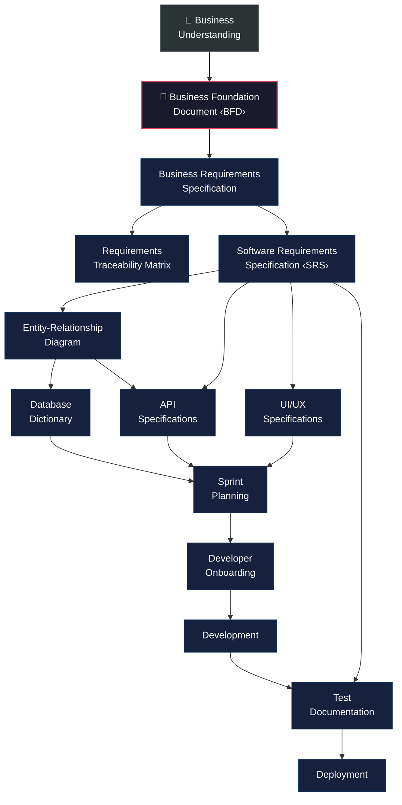
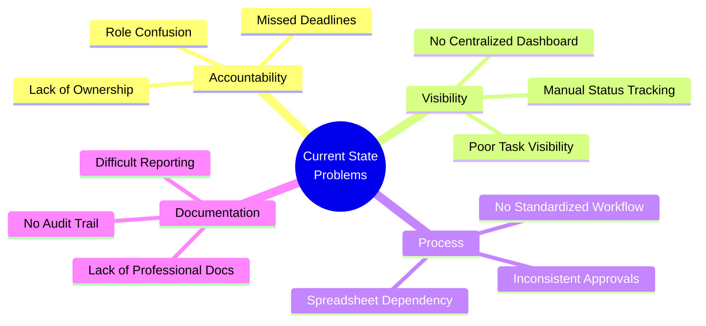
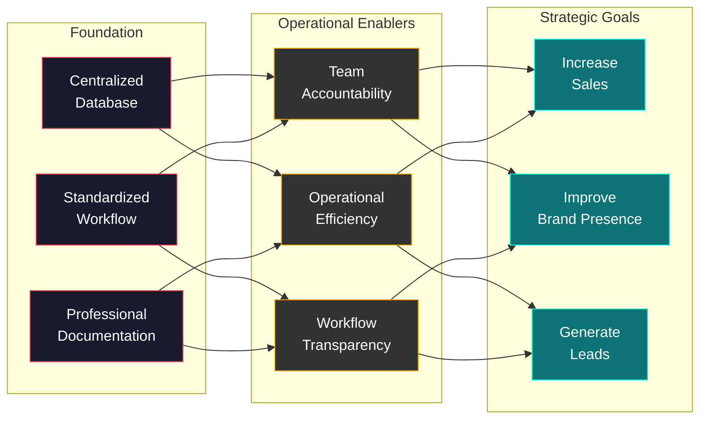
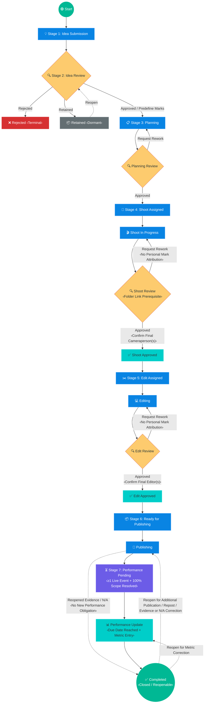
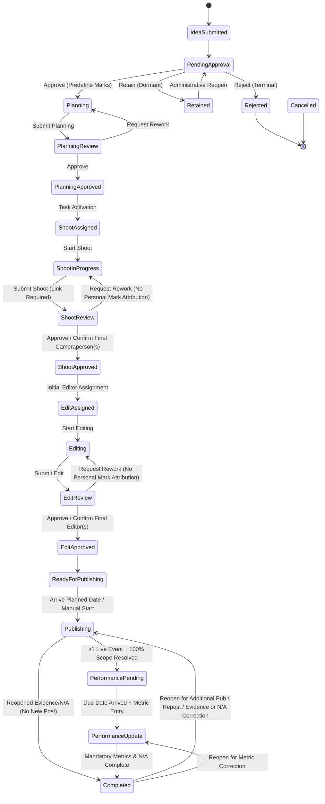
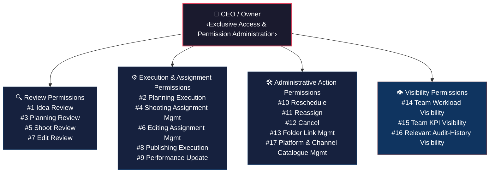
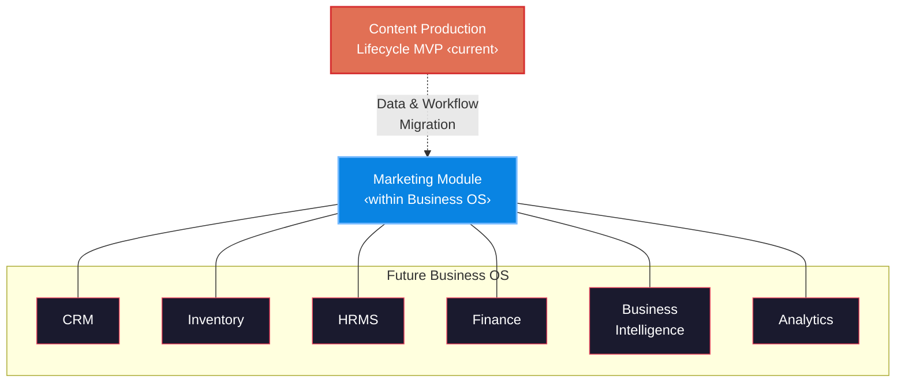

<!-- ─────────────────────────────────────────────────────────────────────────── -->

<!-- KCPC BANDHANI — CONTENT PRODUCTION LIFECYCLE MVP                          -->

<!-- BUSINESS FOUNDATION DOCUMENT (BFD)                                       -->

<!-- ─────────────────────────────────────────────────────────────────────────── -->

---

## Document Control

| Attribute              | Detail                                   |
| :--------------------- | :--------------------------------------- |
| **Document Title**     | Business Foundation Document (BFD)       |
| **Project Name**       | Content Production Lifecycle MVP         |
| **Client**             | KCPC Bandhani                            |
| **Document ID**        | KCPC-MKT-BFD-001                         |
| **Version**            | 1.5.0                                    |
| **Status**             | Draft — Pending CEO Review               |
| **Classification**     | Confidential — Internal Use Only         |
| **Author(s)**          | Enterprise Solutions & Advisory Practice |
| **Reviewed By**        | Pending                                  |
| **Approved By**        | Pending                                  |
| **Created Date**       | August 4, 2026                           |
| **Last Modified Date** | August 12, 2026                          |

### Revision History

| Version | Date           | Author                    | Change Description                                                                                                                                                                                                                                                                                                                                                                                                                                                                                                                                                                                                                                                                                                                                                                                                                                                                                                                                                                                                                                                                                                                                                                                                                                                                                                                                                                                                                                                                                                                                                                                                                                                                                                                                                                                                                                                                                                                                                                                                                                                                                                                                                                                                                                                                                                                                                                                                                                                                                                                                                                                                                                                 | Reviewed By |
| :------ | :------------- | :------------------------ | :------------------------------------------------------------------------------------------------------------------------------------------------------------------------------------------------------------------------------------------------------------------------------------------------------------------------------------------------------------------------------------------------------------------------------------------------------------------------------------------------------------------------------------------------------------------------------------------------------------------------------------------------------------------------------------------------------------------------------------------------------------------------------------------------------------------------------------------------------------------------------------------------------------------------------------------------------------------------------------------------------------------------------------------------------------------------------------------------------------------------------------------------------------------------------------------------------------------------------------------------------------------------------------------------------------------------------------------------------------------------------------------------------------------------------------------------------------------------------------------------------------------------------------------------------------------------------------------------------------------------------------------------------------------------------------------------------------------------------------------------------------------------------------------------------------------------------------------------------------------------------------------------------------------------------------------------------------------------------------------------------------------------------------------------------------------------------------------------------------------------------------------------------------------------------------------------------------------------------------------------------------------------------------------------------------------------------------------------------------------------------------------------------------------------------------------------------------------------------------------------------------------------------------------------------------------------------------------------------------------------------------------------------------------------------------------------ | :---------- |
| 0.1     | August 4, 2026 | Enterprise Solutions Team | Initial draft — structure & content outline                                                                                                                                                                                                                                                                                                                                                                                                                                                                                                                                                                                                                                                                                                                                                                                                                                                                                                                                                                                                                                                                                                                                                                                                                                                                                                                                                                                                                                                                                                                                                                                                                                                                                                                                                                                                                                                                                                                                                                                                                                                                                                                                                                                                                                                                                                                                                                                                                                                                                                                                                                                                                                                       | —           |
| 1.0     | August 4, 2026 | Enterprise Solutions Team | First complete baseline release                                                                                                                                                                                                                                                                                                                                                                                                                                                                                                                                                                                                                                                                                                                                                                                                                                                                                                                                                                                                                                                                                                                                                                                                                                                                                                                                                                                                                                                                                                                                                                                                                                                                                                                                                                                                                                                                                                                                                                                                                                                                                                                                                                                                                                                                                                                                                                                                                                                                                                                                                                                                                                                                   | —           |
| 1.1     | August 5, 2026 | Enterprise Solutions Team | Renamed solution to Content Production Lifecycle MVP; clarified universal review and approval requirements; separated workflow states from administrative actions; removed Rescheduled as a workflow status; corrected Shooting Stage transitions and related business rules; added Planning Review, Planning Approved, Publishing, Publish Review, Publish Approved, and Performance Review statuses; added BR-050 and BR-051.                                                                                                                                                                                                                                                                                                                                                                                                                                                                                                                                                                                                                                                                                                                                                                                                                                                                                                                                                                                                                                                                                                                                                                                                                                                                                                                                                                                                                                                                                                                                                                                                                                                                                                                                                                                                                                                                                                                                                                                                                                                                                                                                                                                                                                                                   | CEO / Owner |
| 1.1.1   | August 5, 2026 | Enterprise Solutions Team | Corrected performance-timing baseline, review-decision governance, approved-outcome wording, Performance Update lifecycle state, Planning Approved workflow representation, administrative backward-transition governance, CEO authority alignment, stage participant definitions, publication-event definition, documentation hierarchy, and duplicate status-catalogue placement.                                                                                                                                                                                                                                                                                                                                                                                                                                                                                                                                                                                                                                                                                                                                                                                                                                                                                                                                                                                                                                                                                                                                                                                                                                                                                                                                                                                                                                                                                                                                                                                                                                                                                                                                                                                                                                                                                                                                                                                                                                                                                                                                                                                                                                                                                                               | CEO / Owner |
| 1.1.2   | August 5, 2026 | Enterprise Solutions Team | Corrected publishing-to-performance transition, status-catalogue administrative transitions, planning authority wording, editing reassignment authority, KPI and success-measurement definitions, publication-event reporting references, cancellation exception wording, and regenerated the v1.1.2 validation report.                                                                                                                                                                                                                                                                                                                                                                                                                                                                                                                                                                                                                                                                                                                                                                                                                                                                                                                                                                                                                                                                                                                                                                                                                                                                                                                                                                                                                                                                                                                                                                                                                                                                                                                                                                                                                                                                                                                                                                                                                                                                                                                                                                                                                                                                                                                                                                           | CEO / Owner |
| 1.1.3   | August 5, 2026 | Enterprise Solutions Team | Corrected authoritative status-catalogue self-transitions and global cancellation representation; clarified controlled status-change governance; added Actual Publication traceability rule BR-052; added multi-channel performance-timing question; and corrected validation-report references and claims.                                                                                                                                                                                                                                                                                                                                                                                                                                                                                                                                                                                                                                                                                                                                                                                                                                                                                                                                                                                                                                                                                                                                                                                                                                                                                                                                                                                                                                                                                                                                                                                                                                                                                                                                                                                                                                                                                                                                                                                                                                                                                                                                                                                                                                                                                                                                                                                       | CEO / Owner |
| 1.1.4   | August 5, 2026 | Enterprise Solutions Team | Separated Planned Live Date from Actual Publication Date and Time; prevented actual publication recording from overwriting planned scheduling data; aligned planning rules, publishing parameters, KPIs, delay measurement, glossary definitions, and business-rule traceability; added BR-053.                                                                                                                                                                                                                                                                                                                                                                                                                                                                                                                                                                                                                                                                                                                                                                                                                                                                                                                                                                                                                                                                                                                                                                                                                                                                                                                                                                                                                                                                                                                                                                                                                                                                                                                                                                                                                                                                                                                                                                                                                                                                                                                                                                                                                                                                                                                                                                                                   | CEO / Owner |
| 1.1.5   | August 5, 2026 | Enterprise Solutions Team | Corrected remaining ambiguous publication-date terminology; aligned Publishing trigger and Ready for Publishing status with Current Planned Live Date; clarified Performance Pending terminology; and added unresolved governance question for original-versus-current schedule measurement.                                                                                                                                                                                                                                                                                                                                                                                                                                                                                                                                                                                                                                                                                                                                                                                                                                                                                                                                                                                                                                                                                                                                                                                                                                                                                                                                                                                                                                                                                                                                                                                                                                                                                                                                                                                                                                                                                                                                                                                                                                                                                                                                                                                                                                                                                                                                                                                                      | CEO / Owner |
| 1.1.6   | August 5, 2026 | Enterprise Solutions Team | Added controlled employee self-service visibility for assigned-task tracking, personal workload, review feedback, and personal performance indicators; established privacy boundaries for peer and management data; added BR-054 and SC-013; and documented unresolved personal-performance attribution and benchmarking questions.                                                                                                                                                                                                                                                                                                                                                                                                                                                                                                                                                                                                                                                                                                                                                                                                                                                                                                                                                                                                                                                                                                                                                                                                                                                                                                                                                                                                                                                                                                                                                                                                                                                                                                                                                                                                                                                                                                                                                                                                                                                                                                                                                                                                                                                                                                                                                               | CEO / Owner |
| 1.2.0   | August 6, 2026 | Enterprise Solutions Team | Resolved delay and on-time measurement against the current approved schedule; added one authoritative Content Asset Folder Link per Content ID; introduced controlled stage-specific delegated production-review authority; established no-self-approval, grant, revocation, scope, and audit requirements; added BR-055 through BR-057.                                                                                                                                                                                                                                                                                                                                                                                                                                                                                                                                                                                                                                                                                                                                                                                                                                                                                                                                                                                                                                                                                                                                                                                                                                                                                                                                                                                                                                                                                                                                                                                                                                                                                                                                                                                                                                                                                                                                                                                                                                                                                                                                                                                                                                                                                                                                                          | CEO / Owner |
| 1.2.1   | August 6, 2026 | Enterprise Solutions Team | Corrected delegated-review authority inconsistencies across stage rules and governance tables; preserved Planning Review as Manager/CEO only; narrowed the Self-Approval definition to delegated employees; clarified Content Asset Folder Link boundaries and permissions; aligned personal on-time measurement terminology; strengthened delegation revocation, expiry, audit, and management-override governance; and regenerated the v1.2.1 validation report.                                                                                                                                                                                                                                                                                                                                                                                                                                                                                                                                                                                                                                                                                                                                                                                                                                                                                                                                                                                                                                                                                                                                                                                                                                                                                                                                                                                                                                                                                                                                                                                                                                                                                                                                                                                                                                                                                                                                                                                                                                                                                                                                                                                                                                | CEO / Owner |
| 1.2.2   | August 6, 2026 | Enterprise Solutions Team | Corrected the authoritative Performance Review Status Catalogue description to include valid delegated reviewers; aligned Planning Review and delegable production-review terminology; restored the approved unresolved-question wording and options; corrected validation-report section references; and regenerated the v1.2.2 validation report.                                                                                                                                                                                                                                                                                                                                                                                                                                                                                                                                                                                                                                                                                                                                                                                                                                                                                                                                                                                                                                                                                                                                                                                                                                                                                                                                                                                                                                                                                                                                                                                                                                                                                                                                                                                                                                                                                                                                                                                                                                                                                                                                                                                                                                                                                                                                               | CEO / Owner |
| 1.2.3   | August 6, 2026 | Enterprise Solutions Team | Restored the correct Section 13 Future Considerations structure; removed the duplicated unresolved-question register from the BFD; aligned BR-050 and the Rework glossary definition with the approved Planning Review and delegable production-stage review classification; corrected validation-report section references; and regenerated the v1.2.3 validation report.                                                                                                                                                                                                                                                                                                                                                                                                                                                                                                                                                                                                                                                                                                                                                                                                                                                                                                                                                                                                                                                                                                                                                                                                                                                                                                                                                                                                                                                                                                                                                                                                                                                                                                                                                                                                                                                                                                                                                                                                                                                                                                                                                                                                                                                                                                                        | CEO / Owner |
| 1.3.0   | August 6, 2026 | Enterprise Solutions Team | Introduced one shared application with role-based user experiences; transferred all user-access and additional operational-permission administration exclusively to the CEO; replaced stage-limited delegated review authority with CEO-granted operational permissions; added the Retain and reopenable Retained idea outcome; removed Publish Review, Publish Approved, and Performance Review; introduced channel-level Actual Publication and performance tracking; established mandatory channel N/A exception handling; revised performance timing to the second calendar date after each channel publication; updated workflow statuses (22 total), business rules (62 total), KPIs (30 total), success criteria (13 total), audit requirements, stakeholder responsibilities, and glossary definitions.                                                                                                                                                                                                                                                                                                                                                                                                                                                                                                                                                                                                                                                                                                                                                                                                                                                                                                                                                                                                                                                                                                                                                                                                                                                                                                                                                                                                                                                                                                                                                                                                                                                                                                                                                                                                                                                                                   | CEO / Owner |
| 1.3.1   | August 6, 2026 | Enterprise Solutions Team | Corrected permission-catalogue overlaps by separating non-assignment Planning Execution from initial Shooting/Editing Assignment Management and Reassign; enforced permission scope, effective date, active validity, expiry, revocation, and modification audit rules; clarified Retain optional fields (comment optional, no reason/date required); aligned employee privacy with CEO-granted aggregate visibility permissions; explicitly prevented complete Marketing Manager interface exposure for permitted employees; added Edit Date to planning parameters and BR-012; clarified Planning Approved and Edit Assigned as task activation; aligned Stage 6 Publishing trigger with Ready for Publishing; defined Performance Update eligibility date and late-entry rules; updated default own-work visibility wording and RACI CEO KPI-monitoring authority; cleaned up SC-004 formatting stray text; added KPI Monitoring RACI footnote; neutralized Performance Pending wording for unresolved all-channels-N/A scenario; completed formal Marketing Manager terminology cleanup; and regenerated the v1.3.1 validation report documenting seven unresolved business questions.                                                                                                                                                                                                                                                                                                                                                                                                                                                                                                                                                                                                                                                                                                                                                                                                                                                                                                                                                                                                                                                                                                                                                                                                                                                                                                                                                                                                                                                                                                        | CEO / Owner |
| 1.4.0   | August 7, 2026 | Enterprise Solutions Team | Formally incorporated stakeholder decisions resolving all seven previously unresolved business questions, followed by confirmed MVP stakeholder simplifications and final targeted consistency alignments: (1) Clarified Idea Submission access (BR-001) permitting CEO / Owner, Marketing Manager, and Employees to submit Ideas via the Idea Submission Form; (2) Established One Approved Idea → One Content ID → Multiple Planned Outputs → One Workflow model (BR-004, BR-029, BR-030, SC-006), grouping planned outputs under a single Content ID without separate IDs or sub-statuses, while preserving one parent Content Asset Folder Link per Content ID (BR-055); (3) Established Editor assignment after Shoot Approval (BR-008, BR-012, BR-019), removing Editor assignment from Planning parameters while preserving Edit Date in Planning; (4) Corrected assigner vs. assignee workload visibility wording (BR-021) to display contextual workload summaries to authorized assigners performing load balancing without automated algorithms; (5) Aligned Planned Output KPI reporting (KPI-013, KPI-014, KPI-016) to count output assets without multiplying Content ID totals; (6) Corrected BR-044 audit logging to explicitly distinguish initial assignment vs reassignment data requirements; (7) Simplified Stage 3 Planning Parameters and BR-012 around Planned Outputs using the controlled content taxonomy; (8) Established that Reel Type belongs to each applicable Reel-type Planned Output (BR-032, BR-033, Stage 3, Glossary); (9) Aligned KPI-012 to count distinct Content IDs having valid Actual Publication events, without multiplying company content counts when multiple publication events occur under one Content ID; (10) Established that all Planned Outputs under a Content ID share the approved Planned Live Date (BR-023, Glossary); (11) Established that multiple Actual Publication events may exist under one Content ID (including separate posts on the same Publication Target), with each event identifying its applicable Planned Output (BR-052, Stage 6); (12) Introduced lightweight Publication Scope parameter in Stage 3 and BR-012 associating Planned Outputs with selected Publication Targets; (13) Corrected BR-024 to record separate Actual Publication events per live post; (14) Aligned event-level Performance Update terminology in Permission #9, Status Catalogue #19, and Stage 7; (15) Preserved same-day Planned Live Date operating interpretation for late publications; preserved 3 roles, 17 permissions, 62 business rules, 30 KPIs, 22 statuses, 13 success criteria, and 0 unresolved business questions. | Pending     |
| 1.4.1   | August 8, 2026 | Enterprise Solutions Team | Controlled business change pass: Incorporated stakeholder decisions: (1) Updated Idea Submission Form fields (Title mandatory, Reference Link optional, Remarks optional long-form free text with no business-defined word limit); (2) Standardized Content ID format `C-MMYY-NNNN` with monthly sequence reset; (3) Established controlled Content Priority levels (Low, Medium, High); (4) Added multi-contributor support across shooting/editing assignments; (5) Integrated review Mark awards from controlled list `[0, 0.1, 0.25, 0.5, 1.0, 2.0, 3.0, 5.0]` to qualifying final Cameraperson(s)/Editor(s) for the Final Approved Work, specifying that Request Rework creates no Mark record and Mark corrections follow immutable linked correction records; (6) Defined Publication Event Type (`Original`, `Repost`) with zero additional Marks on Reposts; (7) Adopted authoritative Creative Performance Scorecard per publication event; (8) Enforced strict Mark privacy (own Marks only for Employees); (9) Re-aligned SC-010 continuous 24×7 operational availability (≥99% uptime, excluding approved planned maintenance).                                                                                                                                                                                                                                                                                                                                                                                                                                                                                                                                                                                                                                                                                                                                                                                                                                                                                                                                                                                                                                                                                                                                                                                                                                                                                                                                                                                                                                                                                                                                                      | Pending     |
| 1.4.2   | August 9, 2026 | Enterprise Solutions Team | Controlled business change pass: Applied CEO-directed Marks model change: (1) Controlled Marks list updated to `[0, 0.5, 1.0, 2.0, 3.0]`; (2) Cameraperson Mark and Editor Mark predefined at Idea Approval as fixed work-value attributes of the approved Idea / resulting Content ID (independent of named resource assignment); (3) Review gates at Shoot Approval and Edit Approval confirm qualifying final contributors who each receive the same predefined role Mark without splitting, averaging, or manual per-person Mark selection; (4) Numeric 0 defined as valid only when intentionally selected as the predefined role Mark value at Idea Approval; (5) Request Rework and Reposts create zero personal Mark attribution records; (6) Mark correction governance adapted to predefined role Mark correction under Idea Review authority; and (7) Editor assignment timing preserved strictly post-Shoot Approval.                                                                                                                                                                                                                                                                                                                                                                                                                                                                                                                                                                                                                                                                                                                                                                                                                                                                                                                                                                                                                                                                                                                                                                                                                                                                                                                                                                                                                                                                                                                                                                                                                                                                                                                                                                 | Pending     |
| 1.4.3   | August 10, 2026 | Enterprise Solutions Team | Controlled Stage 3 Planning data enhancement: (1) Introduced mandatory, single-select Category field selected from a controlled reference list (with illustrative examples such as Saree, Lehenga, Kurti); (2) Established conceptual distinction between Category (broad content/product classification) and SKU ID (specific product code or explicit N/A for generic content); (3) Updated Stage 3 Process, Planning Rule BR-012, Planning Execution Permission #2, and Glossary; and (4) Preserved all existing workflow, assignment, review, Marks, and governance logic. | Pending     |
| 1.4.4   | August 11, 2026 | Enterprise Solutions Team | Controlled business change pass: (1) Updated Category to an optional, manually entered free-text Stage 3 planning attribute that may remain blank or contain multiple category values within a single text field, removing all controlled Category reference lists, master catalogues, and validation blocking; (2) Introduced BR-063 and Administrative Action Governance for temporary Hold and Resume of in-progress Shooting (SIP) and Editing (ED) work under exclusive CEO/Manager authority, preserving workflow status, assignee(s), Content ID, and non-reschedulable D+2 performance timing while recording mandatory Hold reasons and audit history; and (3) Preserved all 3 roles, 17 permissions, 22 workflow concepts, 10 objectives, 30 KPIs, and 13 success criteria. | Pending     |
| 1.4.5   | August 11, 2026 | Enterprise Solutions Team | Formally recorded two stakeholder decisions resolving the previously open scorecard clarifications, incorporated into Stage 7 Performance governance and BR-026: (1) `SC-REQ-001` — a derived scorecard rate whose denominator (`Plays`, `Video length`, or `Impressions`) is zero is recorded as `N/A` (never 0, never a calculation error) and excluded from aggregate rate averages and KPI reporting; (2) `SC-REQ-002` — the Creative Performance Scorecard supports an editable draft-then-submit lifecycle (partial values saved as a draft, validated and sealed on final submission). No new Business Rule introduced; all counts preserved (3 roles, 17 permissions, 22 workflow concepts, 63 Business Rules, 30 KPIs, 13 success criteria). | Pending     |
| 1.5.0 | August 12, 2026 | Enterprise Solutions Team | Controlled Business Change Package **R3.4** (candidate): added **BR-064** (Business Role catalogue over the unchanged three internal access classes) and **BR-065** (Stage-3 Planning Mode — Standard/Urgent); revised BR-009 (Standard-mode default) and reframed the role-model narrative (three internal access classes + organizational Business Role designation). **CANDIDATE — PENDING INDEPENDENT REVIEW; not frozen; R3.3 remains the current frozen baseline.** _Closure pass (Aug 12, 2026): applied independent-review corrections (findings 1–7) and the approved same-day-Urgent decision (new AC-086.6 / ERD-CON-066); independent review returned FAIL→corrected; pending final independent re-audit._ _Final re-audit surgical closure pass (Aug 13, 2026): closed findings 1–5 and 7 (current source-baseline metadata, current normative counts, as-built register, Business Role vs internal access class terminology, self-version footers, mechanical-audit methodology). Historical revision rows and freeze records untouched. Finding 6 (same-day Urgent approval provenance) remains OPEN — PENDING OWNER / STAKEHOLDER CONFIRMATION; the rule and its recorded provenance are unchanged. Status: R3.4 CANDIDATE — PENDING FINAL INDEPENDENT RE-AUDIT._ _Targeted traceability/governance closure pass (Aug 13, 2026) after the second independent re-audit returned FAIL: closed residual findings 1–8 and the two terminology residues (CN-009 role constraint, RTM-086/ERD §25/API-OP-018 trace edges, as-built +9→+10 ACs, 'forced −5/−2' wording, UIUX v0.2.1 R3.2→R3.3 companion governance, SAD §9.1 heading, BFD glossary). Sweep D expected-edge validation added to the audit method. Finding 6 (same-day Urgent approval provenance) remains OPEN — PENDING OWNER / STAKEHOLDER CONFIRMATION; rule and provenance untouched. Status: R3.4 CANDIDATE — PENDING RE-SUBMISSION FOR FINAL INDEPENDENT RE-AUDIT._ _Finding 6 governance closure (Aug 13, 2026): the third independent re-audit returned TECHNICAL & TRACEABILITY PASS with a governance hold; that hold is closed by CEO / Owner business decision record `KCPC-MKT-DR-R3.4-001` (same-day Urgent Shoot/Edit permitted). Provenance wording only — no requirement, AC, design element, constraint, operation, count or identifier changed. Status: R3.4 CANDIDATE — ALL FINDINGS CLOSED; PENDING FINAL FREEZE-READINESS CONFIRMATION._ | Pending |

### Distribution List

| Name / Role       | Purpose          |
| :---------------- | :--------------- |
| CEO / Owner       | Review & Approve |
| Marketing Manager | Review & Approve |
| Development Lead  | Reference        |
| QA Lead           | Reference        |
| Project Manager   | Reference        |

---

## Table of Contents

- [1. Document Purpose \& Scope](#1-document-purpose--scope)
  - [1.1 Purpose](#11-purpose)
  - [1.2 Intended Audience](#12-intended-audience)
  - [1.3 Document Scope](#13-document-scope)
  - [1.4 Downstream Deliverables](#14-downstream-deliverables)
  - [1.5 Out of Scope](#15-out-of-scope)
- [2. Business Context](#2-business-context)
  - [2.1 Company Overview](#21-company-overview)
  - [2.2 Project Background](#22-project-background)
  - [2.3 Current State Analysis](#23-current-state-analysis)
  - [2.4 Problem Statement](#24-problem-statement)
  - [2.5 Business Objectives](#25-business-objectives)
  - [2.6 Strategic Alignment](#26-strategic-alignment)
- [3. Stakeholder Analysis](#3-stakeholder-analysis)
  - [3.1 Stakeholder Register](#31-stakeholder-register)
  - [3.2 RACI Matrix](#32-raci-matrix)
- [4. Business Workflow](#4-business-workflow)
  - [4.1 Workflow Overview](#41-workflow-overview)
  - [4.2 Workflow Stages — Detailed Description](#42-workflow-stages--detailed-description)
  - [4.3 Status Lifecycle](#43-status-lifecycle)
  - [4.4 Workflow State Machine](#44-workflow-state-machine)
- [5. Business Rules](#5-business-rules)
  - [5.1 Idea Management Rules](#51-idea-management-rules)
  - [5.2 Planning Rules](#52-planning-rules)
  - [5.3 Shooting Rules](#53-shooting-rules)
  - [5.4 Editing Rules](#54-editing-rules)
  - [5.5 Publishing Rules](#55-publishing-rules)
  - [5.6 Performance \& Completion Rules](#56-performance--completion-rules)
  - [5.7 Content \& Identification Rules](#57-content--identification-rules)
  - [5.8 Workflow \& Status Rules](#58-workflow--status-rules)
  - [5.9 Operational Rules](#59-operational-rules)
  - [5.10 Access-Control \& Permission Rules](#510-access-control--permission-rules)
  - [5.11 Audit \& Logging Rules](#511-audit--logging-rules)
- [6. System Behaviour](#6-system-behaviour)
  - [6.1 Workflow Concept Classification](#61-workflow-concept-classification)
  - [6.2 Status Transition Rules](#62-status-transition-rules)
  - [6.3 Transition Governance](#63-transition-governance)
  - [6.4 Administrative Action Governance](#64-administrative-action-governance)
  - [6.5 Review and Approval Governance](#65-review-and-approval-governance)
  - [6.6 CEO Access-Control and Permission Governance](#66-ceo-access-control-and-permission-governance)
  - [6.7 Employee Self-Service Visibility Governance](#67-employee-self-service-visibility-governance)
  - [6.8 Status Catalogue](#68-status-catalogue)
- [7. Key Performance Indicators (KPIs)](#7-key-performance-indicators-kpis)
  - [7.1 Operational KPIs](#71-operational-kpis)
  - [7.2 Productivity KPIs](#72-productivity-kpis)
  - [7.3 Content KPIs](#73-content-kpis)
  - [7.4 Approval KPIs](#74-approval-kpis)
  - [7.5 Delay \& SLA KPIs](#75-delay--sla-kpis)
  - [7.6 Administrative Action \& Permission Reporting](#76-administrative-action--permission-reporting)
  - [7.7 Employee Personal Performance Views](#77-employee-personal-performance-views)
- [8. Assumptions](#8-assumptions)
- [9. Constraints](#9-constraints)
- [10. Dependencies](#10-dependencies)
- [11. Risks \& Mitigations](#11-risks--mitigations)
- [12. Success Criteria](#12-success-criteria)
- [13. Future Considerations](#13-future-considerations)
- [14. Glossary](#14-glossary)
- [15. References](#15-references)
- [16. Appendices](#16-appendices)
  - [Appendix A — Content Taxonomy & Planned Output Classifications](#appendix-a--content-taxonomy--planned-output-classifications)
  - [Appendix B — Platform \& Company Channel / Account Catalogue Model](#appendix-b--platform--company-channel--account-catalogue-model)
  - [Appendix C — Reel Type Classification](#appendix-c--reel-type-classification)

---

## 1. Document Purpose & Scope

### 1.1 Purpose

This Business Foundation Document (BFD) establishes the authoritative business context, workflow definitions, business rules, KPIs, stakeholder expectations, and access-control governance for the **KCPC Bandhani — Content Production Lifecycle MVP**.

It is designed as the **Single Source of Truth (SSOT)** from which every subsequent project deliverable — from requirements specification through deployment — will be derived.

> [!IMPORTANT]
> **Governing MVP Principle — Keep the Solution Simple:** This MVP shall intentionally implement only the minimum workflow, access-control, audit, publication-tracking, and reporting capability required to operate the approved Content Production Lifecycle reliably. Additional marketing-management sophistication, automation, advanced analytics, complex configuration, and broader enterprise functionality shall be deferred to the future KCPC Business OS unless explicitly required for MVP operation.

> [!NOTE]
> This document is intentionally **implementation-agnostic**. It captures *what* the business needs, not *how* the system will be built. All technology decisions, architecture patterns, network routes, database schemas, framework choices, and technical access-control mechanisms will be addressed in downstream deliverables.

### 1.2 Intended Audience

| Audience            | Purpose                                                  |
| :------------------ | :------------------------------------------------------- |
| CEO / Owner         | Strategic review, approval, and alignment validation     |
| Marketing Manager   | Operational validation and workflow sign-off             |
| Business Analysts   | Requirements derivation and traceability                 |
| Solution Architects | System design and technology decisions                   |
| Development Team    | Feature understanding and acceptance criteria            |
| QA Team             | Test case derivation and validation                      |
| Project Manager     | Scope management, sprint planning, and progress tracking |

### 1.3 Document Scope

This document covers:

- Business context, problems, and objectives
- One shared application with role-based user experiences
- End-to-end content production lifecycle — from **Idea Submission** (capturing Idea Title as mandatory, Reference Link / Note as optional, and Remarks as optional long-form free text with no business-defined word limit) through **Performance Update & Completion** (with controlled reopening under approved Reopen Completed governance)
- Three internal access classes (CEO / Owner, Marketing Manager, Employee) over an expandable Business Role (organizational designation) catalogue, and CEO-only access-control authority
- CEO-Granted Operational Permission model, permission catalogue (17 permissions), and governance boundaries
- Employee self-service visibility boundaries, peer privacy protection, aggregate visibility permissions, and five approved personal-performance measures: four operational measures (Delayed Work, Approved Work / Task Outputs, Review Submissions, Request Rework Before Approval) plus Personal Marks as the fifth measure for qualifying Camerapersons and Editors
- Hierarchical Platform $\rightarrow$ Company Channel / Account $\rightarrow$ Publication Target distribution model and catalogue management
- Business rules governing workflow behaviour, review gates, multi-channel publishing, reversible publication target N/A exceptions, cross-stage rescheduling, and permission management
- System status lifecycle (22 statuses: 17 Active, 1 Dormant, 2 Terminal, 1 Closed / Reopenable, 1 Supplementary Flag) and transition rules
- Key Performance Indicators (30 KPIs), administrative action reporting, and employee personal performance views
- Assumptions, constraints, dependencies, and risks
- Success criteria for MVP acceptance
- Future extensibility considerations

### 1.4 Downstream Deliverables

This BFD initiates a controlled documentation cascade. Each downstream deliverable derives from and traces to its predecessor. The BFD may not be used to finalize downstream specifications directly — the intervening requirements documents (BRS, RTM, SRS) must be completed first.

### 1.5 Out of Scope

The following items are explicitly **out of scope** for this MVP:

- Enterprise Business OS modules (CRM, Inventory, HRMS, Finance, BI)
- External system integrations (social media APIs, CRM, ERP, Google Drive API)
- Automatic social media publishing, API posting, or automated analytics collection
- File upload, media storage, automatic folder creation, Drive sync, or Drive permission management
- Customer-facing features and e-commerce functionality
- Automated incentive, payroll, or compensation calculations
- Multi-department workflow management
- Historical data migration from existing spreadsheets
- Mobile native application development
- Advanced analytics, employee ranking algorithms, productivity scoring, and machine learning
- Automated workload allocation algorithms

---

## 2. Business Context

### 2.1 Company Overview

**KCPC Bandhani** is a business organization that requires a structured marketing operation to support its brand presence, lead generation, and sales objectives. The Marketing Department is a critical function responsible for content creation, brand communication, and audience engagement across multiple channels.

### 2.2 Project Background

The Marketing Department currently operates using **spreadsheet-based manual workflows** for planning, tracking, and managing content creation activities. As the volume of content production has increased, the limitations of this approach have become a significant operational impediment.

This MVP initiative aims to **digitize and standardize** the content production lifecycle for a period of **6–8 months** while the comprehensive Business Operating System (Business OS) is developed in parallel.

> [!NOTE]
> This MVP is a **transitional solution**. It must solve immediate pain points with sufficient rigour and professionalism, but it is not intended to become the final enterprise system. Design decisions should favour **pragmatism and speed-to-value** over architectural perfection.

### 2.3 Current State Analysis

The current marketing operations suffer from the following deficiencies:

| #   | Problem Area                           | Business Impact                                              |
| --- | :------------------------------------- | :----------------------------------------------------------- |
| 1   | Missed Deadlines                       | Content delivery delays affecting campaign timelines         |
| 2   | Lack of Accountability                 | No clear ownership trail for tasks and deliverables          |
| 3   | Confusion                              | Ambiguity in task status and next steps                      |
| 4   | Role & Responsibility Misunderstanding | Unclear authority boundaries cause friction and duplication  |
| 5   | Poor Visibility                        | Management lacks real-time view of operations                |
| 6   | Manual Tracking                        | Spreadsheet-based tracking is error-prone and unsustainable  |
| 7   | Difficult Reporting                    | No structured data for generating management reports         |
| 8   | No Standardized Workflow               | Inconsistent processes across content types and team members |
| 9   | Lack of Professional Documentation     | No formal records for reviews, approvals, and decisions      |

### 2.4 Problem Statement

> The KCPC Bandhani Marketing Department lacks a digitized, standardized, and transparent workflow management system, resulting in missed deadlines, accountability gaps, poor visibility, and an inability to produce reliable management reports. The current spreadsheet-based approach cannot scale with growing content demands and fails to enforce consistent business processes.

### 2.5 Business Objectives

The MVP shall enable the organization to achieve the following objectives:

| ID      | Objective                                | Category       | Priority |
| :------ | :--------------------------------------- | :------------- | :------- |
| OBJ-001 | Increase Sales                           | Revenue        | High     |
| OBJ-002 | Improve Brand Presence                   | Marketing      | High     |
| OBJ-003 | Generate Leads                           | Marketing      | High     |
| OBJ-004 | Increase Team Accountability             | Operations     | Critical |
| OBJ-005 | Improve Operational Efficiency           | Operations     | Critical |
| OBJ-006 | Improve Documentation                    | Governance     | High     |
| OBJ-007 | Maintain a Secure Centralized Database   | Infrastructure | High     |
| OBJ-008 | Improve Task Visibility                  | Operations     | Critical |
| OBJ-009 | Improve Workflow Transparency            | Governance     | Critical |
| OBJ-010 | Improve Professionalism inside Marketing | Culture        | Medium   |

### 2.6 Strategic Alignment

---

## 3. Stakeholder Analysis

### 3.1 Stakeholder Register

The MVP operates with exactly **three internal access classes** (authorization tiers): CEO / Owner, Marketing Manager, and Employee. **No fourth access class shall be introduced.** Layered on top of these three classes is an **expandable Business Role catalogue** — the user's actual organizational designation (e.g. Camera Person, Video Editor, Publisher, HR Manager) — where each user holds exactly one Business Role that resolves to exactly one of the three access classes (`BR-064`). A Business Role represents organizational identity only; it never, by its name, grants an operational permission, and ordinary designations map to the Employee class.

#### 3.1.1 CEO / Owner

| Attribute            | Detail                                                                                                                                                                                                                                                                                                                                            |
| :------------------- | :------------------------------------------------------------------------------------------------------------------------------------------------------------------------------------------------------------------------------------------------------------------------------------------------------------------------------------------------ |
| **Role**             | Strategic Oversight, Governance, & Exclusive Access-Control Authority                                                                                                                                                                                                                                                                             |
| **Involvement**      | Periodic / As needed                                                                                                                                                                                                                                                                                                                              |
| **Interest Level**   | High                                                                                                                                                                                                                                                                                                                                              |
| **Influence**        | Highest                                                                                                                                                                                                                                                                                                                                           |
| **Responsibilities** | Strategic oversight; exclusive user-access administration (create, activate, deactivate users; assign Business Roles (each resolving to one internal access class); grant, modify, and revoke additional operational permissions); can decide any workflow stage or perform any operational action; holds full operational authority equivalent to the Marketing Manager when exercising authority. |
| **Permissions**      | Full system access; exclusive authority to manage user access and grant, modify, or revoke CEO-Granted Operational Permissions.                                                                                                                                                                                                                   |

#### 3.1.2 Marketing Manager

| Attribute            | Detail                                                                                                                                                                                                                                                                                                                                                                                                                                                                                                                                                                                                                                                                                                                                                                                    |
| :------------------- | :---------------------------------------------------------------------------------------------------------------------------------------------------------------------------------------------------------------------------------------------------------------------------------------------------------------------------------------------------------------------------------------------------------------------------------------------------------------------------------------------------------------------------------------------------------------------------------------------------------------------------------------------------------------------------------------------------------------------------------------------------------------------------------------- |
| **Role**             | Operational Owner                                                                                                                                                                                                                                                                                                                                                                                                                                                                                                                                                                                                                                                                                                                                                                         |
| **Involvement**      | Daily — continuous                                                                                                                                                                                                                                                                                                                                                                                                                                                                                                                                                                                                                                                                                                                                                                        |
| **Interest Level**   | Critical                                                                                                                                                                                                                                                                                                                                                                                                                                                                                                                                                                                                                                                                                                                                                                                  |
| **Influence**        | High                                                                                                                                                                                                                                                                                                                                                                                                                                                                                                                                                                                                                                                                                                                                                                                      |
| **Responsibilities** | Performs planning parameter preparation and initial shooting/editing assignments; maintains Platform and Company Channel / Account catalogues; conducts planning and planning reviews; reviews and decides Idea Review, Shoot Review, and Edit Review; manages publishing execution, publication target selection, and Channel N/A decisions; enters and corrects performance metrics; manages team workload; performs rescheduling, reassignment (replacing existing assignees), and cancellation of eligible records; reopens Completed deliverables under approved Reopen Completed governance (for additional publication, Reposts, publishing-evidence correction, Publication Target N/A reversal/correction, or metric corrections); adds and replaces Content Asset Folder Links. |
| **Permissions**      | Full normal operational access — create, read, update, approve, reject, retain, request rework, reassign, reschedule, cancel, reopen; manage Platform and Company Channel / Account master data; add and replace Content Asset Folder Links; mark publication targets N/A; enter performance metrics. The Marketing Manager retains normal Marketing Manager permissions but **shall not** grant, modify, or revoke user access or employee permissions.                                                                                                                                                                                                                                                                                                                                  |

#### 3.1.3 Employees — Marketing Team Members

| Attribute            | Detail                                                                                                                                                                                                                                                                                                                                                                                                                                                                                                                                                                                                                                                                                                                                                                                                                                                                                                                                                                                                                                                                                                                                                                                                                                                                                                                                                                                                                                                                                                                                                                                                                                                                                                                                                                                                                                                                                                                                                                                                                                                                                                                                                                                                        |
| :------------------- | :------------------------------------------------------------------------------------------------------------------------------------------------------------------------------------------------------------------------------------------------------------------------------------------------------------------------------------------------------------------------------------------------------------------------------------------------------------------------------------------------------------------------------------------------------------------------------------------------------------------------------------------------------------------------------------------------------------------------------------------------------------------------------------------------------------------------------------------------------------------------------------------------------------------------------------------------------------------------------------------------------------------------------------------------------------------------------------------------------------------------------------------------------------------------------------------------------------------------------------------------------------------------------------------------------------------------------------------------------------------------------------------------------------------------------------------------------------------------------------------------------------------------------------------------------------------------------------------------------------------------------------------------------------------------------------------------------------------------------------------------------------------------------------------------------------------------------------------------------------------------------------------------------------------------------------------------------------------------------------------------------------------------------------------------------------------------------------------------------------------------------------------------------------------------------------------------------------ |
| **Role**             | Content Creators, Executors, Self-Service Task Participants, and Permission-Based Operational Performers                                                                                                                                                                                                                                                                                                                                                                                                                                                                                                                                                                                                                                                                                                                                                                                                                                                                                                                                                                                                                                                                                                                                                                                                                                                                                                                                                                                                                                                                                                                                                                                                                                                                                                                                                                                                                                                                                                                                                                                                                                                                                                      |
| **Involvement**      | Daily — task-based                                                                                                                                                                                                                                                                                                                                                                                                                                                                                                                                                                                                                                                                                                                                                                                                                                                                                                                                                                                                                                                                                                                                                                                                                                                                                                                                                                                                                                                                                                                                                                                                                                                                                                                                                                                                                                                                                                                                                                                                                                                                                                                                                                                            |
| **Interest Level**   | Medium                                                                                                                                                                                                                                                                                                                                                                                                                                                                                                                                                                                                                                                                                                                                                                                                                                                                                                                                                                                                                                                                                                                                                                                                                                                                                                                                                                                                                                                                                                                                                                                                                                                                                                                                                                                                                                                                                                                                                                                                                                                                                                                                                                                                        |
| **Influence**        | Low                                                                                                                                                                                                                                                                                                                                                                                                                                                                                                                                                                                                                                                                                                                                                                                                                                                                                                                                                                                                                                                                                                                                                                                                                                                                                                                                                                                                                                                                                                                                                                                                                                                                                                                                                                                                                                                                                                                                                                                                                                                                                                                                                                                                           |
| **Responsibilities** | Submit ideas; execute assigned shooting or editing work; update task progress within assigned scope; monitor assigned workload and deadlines; review task-related feedback and rework requests; use personal performance information for self-monitoring and improvement; view and open Content Asset Folder Links for assigned work; and perform specific operational activities where valid CEO-Granted Operational Permissions exist.                                                                                                                                                                                                                                                                                                                                                                                                                                                                                                                                                                                                                                                                                                                                                                                                                                                                                                                                                                                                                                                                                                                                                                                                                                                                                                                                                                                                                                                                                                                                                                                                                                                                                                                                                                      |
| **Permissions**      | Default self-service access — submit ideas; view tasks assigned to the employee; view current workflow state, planned dates, delay indicators, review comments, rework requests, required next actions, Content Asset Folder Link, personal workload, own Marks (for qualifying Camerapersons/Editors), and five approved personal-performance measures: four operational measures (Delayed Work, Approved Work / Task Outputs, Review Submissions, Request Rework Before Approval) plus Personal Marks as the fifth measure for qualifying Camerapersons and Editors derived from the employee's assigned work and recorded actual participation. Employees shall not replace Content Asset Folder Links unless authorized by a CEO-granted permission. Where a valid CEO-Granted Operational Permission exists, the employee may perform authorized activities within the recorded scope (e.g., Shoot Review, Edit Review, Publishing Execution, Performance Update, Reassign, Platform & Channel Catalogue Management). Granting one or more CEO-Granted Operational Permissions to an Employee shall expose only the corresponding authorized screens, records, information, and actions within the granted scope and shall not provide the Employee with the complete Marketing Manager interface or unrelated management capabilities. Employees exercising review permissions **shall not** perform review decisions on work or ideas they personally submitted, executed, prepared, or submitted for review (Self-Approval is strictly prohibited). Employees shall not view another Employee's private performance information, personal performance record, peer Marks, identifiable peer comparisons, employee rankings, compensation information, payroll information, or incentive calculations. CEO-granted visibility permissions (Team Workload Visibility, Team KPI Visibility) expose authorized aggregate or operational views without exposing individual peer-private performance data, peer Marks, or compensation. Employees **shall never** receive authority to grant, modify, or revoke user access, assign roles, manage the permission catalogue, or delegate permissions onward. |

### 3.2 RACI Matrix

> **R** = Responsible | **A** = Accountable | **C** = Consulted | **I** = Informed

| Activity                                    | CEO / Owner | Marketing Manager | Employee |
| :------------------------------------------ | :---------: | :---------------: | :------: |
| Idea Submission                             |      R      |         R         |    R     |
| Idea Approval / Rejection / Retention       |     A/R     |        A/R        |    R*    |
| Reopen Retained Idea                        |     A/R     |        A/R        |    R*    |
| Planning Parameter Preparation              |     A/R     |        A/R        |    R*    |
| Initial Shooting Assignment                 |     A/R     |        A/R        |    R*    |
| Initial Editing Assignment                  |     A/R     |        A/R        |    R*    |
| Planning Review & Approval                  |     A/R     |        A/R        |    R*    |
| Shooting Execution                          |      I      |         A         |    R     |
| Shoot Review & Approval                     |     A/R     |        A/R        |    R*    |
| Editing Execution                           |      I      |         A         |    R     |
| Edit Review & Approval                      |     A/R     |        A/R        |    R*    |
| Publishing Execution                        |     A/R     |        A/R        |    R*    |
| Channel / Publication Target N/A Decision   |     A/R     |        A/R        |    R*    |
| Performance Metrics Update                  |     A/R     |        A/R        |    R*    |
| Personal Task & Performance Monitoring      |      I      |         A         |    R     |
| Content Asset Folder Link Management        |     A/R     |        A/R        |    R*    |
| Rescheduling (Approved Planned Dates)       |     A/R     |        A/R        |    R*    |
| Reassignment (Replacing Existing Assignee)  |     A/R     |        A/R        |    R*    |
| Cancellation (Eligible Pre-Completion)      |     A/R     |        A/R        |    R*    |
| Reopen Completed                            |     A/R     |        A/R        |    R*    |
| Platform & Channel Catalogue Management     |     A/R     |        A/R        |    R*    |
| User Access Administration                  |     A/R     |         I         |    I     |
| Operational Permission Grant / Mod / Revoke |     A/R     |         I         |    I     |
| KPI Monitoring                              |     A/R     |        A/R        |    R*    |

> `R*` applies only where the Employee holds a valid CEO-Granted Operational Permission for the applicable activity and scope, and is not performing a review decision on work or ideas they personally submitted, executed, prepared, or submitted for review. Marketing Manager and CEO retain primary operational accountability and authority. Only the CEO administers user access and operational permissions. Planning parameter preparation uses Planning Execution permission; initial shooting/editing assignment uses Shooting Assignment Management or Editing Assignment Management permission; replacing an existing assigned team member or editor uses Reassign permission.

> For KPI Monitoring, `R*` applies only where the Employee holds a valid CEO-Granted Team KPI Visibility permission within scope. Such access shall remain limited to authorized aggregate or operational KPI information and shall not expose the complete Marketing Manager interface, identifiable peer comparisons, employee rankings, peer-private performance information, peer Marks, compensation, payroll, or incentive information.

> For Platform & Channel Catalogue Management, `R*` applies only where the Employee holds a valid CEO-Granted Platform & Channel Catalogue Management permission within scope.

---

## 4. Business Workflow

### 4.1 Workflow Overview

The Content Production Lifecycle follows a structured, sequential workflow with formal review and approval gates at critical stages. The lifecycle begins with **Idea Submission** and concludes with **Performance Update & Completion**, with controlled administrative reopening under approved Reopen Completed governance.

> [!NOTE]
> **Single Content ID Workflow Invariant.** One approved Idea generates exactly ONE unique Content ID (`C-MMYY-NNNN`, resetting sequence monthly). All associated Planned Outputs (Photography, Reels, Videos) remain grouped under that single Content ID and workflow lifecycle instance from Planning through Completion.

---

### 4.2 Workflow Stages — Detailed Description

#### Stage 1: Idea Submission

| Attribute        | Detail                                                                                                                                                                                                                                                    |
| :--------------- | :-------------------------------------------------------------------------------------------------------------------------------------------------------------------------------------------------------------------------------------------------------- |
| **Trigger**      | An authorized internal user initiates an Idea submission.                                                                                                                                                                                                 |
| **Input**        | Dedicated Idea Submission Form capturing: (1) **Idea Title** (Mandatory non-empty text), (2) **Reference Link / Note** (Optional reference URL or reference text), and (3) **Remarks** (Optional long-form free text with no business-defined word limit) |
| **Process**      | An authorized internal user (CEO / Owner, Marketing Manager, or Employee) completes and submits the dedicated Idea Submission Form.                                                                                                                       |
| **Output**       | Unique system-generated Idea ID; idea status set to *Idea Submitted $\rightarrow$ Pending Approval*                                                                                                                                                       |
| **Participants** | CEO / Owner, Marketing Manager, Employee                                                                                                                                                                                                                  |
| **Next Stage**   | Idea Review                                                                                                                                                                                                                                               |

#### Stage 2: Idea Review

| Attribute        | Detail                                                                                                                                                                                                                                                                                                                                                                                                                                                                                                                                                                                     |
| :--------------- | :----------------------------------------------------------------------------------------------------------------------------------------------------------------------------------------------------------------------------------------------------------------------------------------------------------------------------------------------------------------------------------------------------------------------------------------------------------------------------------------------------------------------------------------------------------------------------------------- |
| **Trigger**      | Idea queued in *Pending Approval* status                                                                                                                                                                                                                                                                                                                                                                                                                                                                                                                                                   |
| **Input**        | Submitted idea record and reference details                                                                                                                                                                                                                                                                                                                                                                                                                                                                                                                                                |
| **Process**      | Review by authorized user (CEO, Marketing Manager, or Employee with CEO-Granted Idea Review permission)                                                                                                                                                                                                                                                                                                                                                                                                                                                                                    |
| **Decisions**    | **Approve** $\rightarrow$ authorized reviewer captures exactly two predefined role Mark values from the controlled list `[0, 0.5, 1.0, 2.0, 3.0]` (Cameraperson Mark and Editor Mark) attached as fixed work-value attributes to the approved Idea / resulting Content ID (independent of named resource assignment), and proceeds to Stage 3 Planning; **Reject** $\rightarrow$ terminal *Rejected* status (mandatory rejection reason, no Marks required); **Retain** $\rightarrow$ dormant *Retained* status under original Idea ID (no Content ID or Marks assigned, comment optional) |
| **Output**       | Immutable decision record capturing actor, timestamp, decision, reasons/comments, and predefined role Marks (Cameraperson Mark, Editor Mark) on Approve                                                                                                                                                                                                                                                                                                                                                                                                                                    |
| **Participants** | Marketing Manager, CEO, or Permitted Employee (no self-approval)                                                                                                                                                                                                                                                                                                                                                                                                                                                                                                                           |
| **Next Stage**   | Planning (if approved), Rejected (terminal), or Retained (dormant, reopenable)                                                                                                                                                                                                                                                                                                                                                                                                                                                                                                             |

#### Stage 3: Planning

| Attribute        | Detail                                                                                                                                                                                                                                                                                                                                                                                                                                                                                                                                                                                                                                                                                                                                                           |
| :--------------- | :--------------------------------------------------------------------------------------------------------------------------------------------------------------------------------------------------------------------------------------------------------------------------------------------------------------------------------------------------------------------------------------------------------------------------------------------------------------------------------------------------------------------------------------------------------------------------------------------------------------------------------------------------------------------------------------------------------------------------------------------------------------- |
| **Trigger**      | Idea Approved at Idea Review                                                                                                                                                                                                                                                                                                                                                                                                                                                                                                                                                                                                                                                                                                                                     |
| **Input**        | Approved idea record                                                                                                                                                                                                                                                                                                                                                                                                                                                                                                                                                                                                                                                                                                                                             |
| **Process**      | System automatically generates unique Content ID formatted as `C-MMYY-NNNN` (monthly sequence reset). Authorized user prepares planning parameters: Category (optional, manually entered free-text attribute, allowed to remain blank when undecided; single field may contain one or multiple category values), Planned Live Date, default Shoot Date (-5 calendar days), default Edit Date (-2 calendar days), manual date overrides, Content Priority (**Low**, **Medium**, **High**), Models / talent (one or more selected, or empty), SKU ID (or explicit N/A for generic content), Planned Outputs (selected from controlled Planned Output Types: Photography, Reel, Video), Reel Type (Very Short, Short, Long) per applicable Reel-type Planned Output, intended Publication Scope mapping to selected Publication Targets, initial shooting team / Cameraperson(s), and establishes parent Content Asset Folder Link pointing to company cloud storage. Initial Editor assignment is prohibited during Stage 3. |
| **Decisions**    | Planning Review by authorized reviewer (CEO, Marketing Manager, or Employee with CEO-Granted Planning Review permission): **Approve** $\rightarrow$ transitions to *Planning Approved* and automatically activates shooting task in *Shoot Assigned*; **Request Rework** $\rightarrow$ returns deliverable to *Planning* for correction with reviewer feedback comments without changing assignees.                                                                                                                                                                                                                                                                                                                                                              |
| **Output**       | Approved Content ID deliverable record; task queued as *Shoot Assigned*                                                                                                                                                                                                                                                                                                                                                                                                                                                                                                                                                                                                                                                                                          |
| **Participants** | Marketing Manager, CEO, or Permitted Planning user / reviewer (no self-approval)                                                                                                                                                                                                                                                                                                                                                                                                                                                                                                                                                                                                                                                                                 |
| **Next Stage**   | Shooting (Shoot Assigned)                                                                                                                                                                                                                                                                                                                                                                                                                                                                                                                                                                                                                                                                                                                                        |

#### Stage 4: Shooting

| Attribute        | Detail                                                                                                                                                                                                                                                                                                                                                                                                                                                                                                                                                                                                                                                                                                                                                                                                                                                                                                                                                                                                                                                                                                                       |
| :--------------- | :--------------------------------------------------------------------------------------------------------------------------------------------------------------------------------------------------------------------------------------------------------------------------------------------------------------------------------------------------------------------------------------------------------------------------------------------------------------------------------------------------------------------------------------------------------------------------------------------------------------------------------------------------------------------------------------------------------------------------------------------------------------------------------------------------------------------------------------------------------------------------------------------------------------------------------------------------------------------------------------------------------------------------------------------------------------------------------------------------------------------------- |
| **Trigger**      | Planning Approved; task queued in *Shoot Assigned*                                                                                                                                                                                                                                                                                                                                                                                                                                                                                                                                                                                                                                                                                                                                                                                                                                                                                                                                                                                                                                                                           |
| **Input**        | Approved deliverable parameters, assigned shooting team                                                                                                                                                                                                                                                                                                                                                                                                                                                                                                                                                                                                                                                                                                                                                                                                                                                                                                                                                                                                                                                                      |
| **Process**      | Assigned shooting team initiates physical shoot execution, transitioning task status to *Shoot In Progress*. Raw footage is uploaded to the parent company cloud folder and confirmed against the Content Asset Folder Link. Recording a valid Content Asset Folder Link is a strict prerequisite for Shoot Review submission.                                                                                                                                                                                                                                                                                                                                                                                                                                                                                                                                                                                                                                                                                                                                                                                               |
| **Decisions**    | Shoot Review by authorized reviewer (CEO, Marketing Manager, or Employee with CEO-Granted Shoot Review permission): **Approve** $\rightarrow$ transitions deliverable to *Shoot Approved* and reviewer confirms one or more qualifying final Camerapersons responsible for the Final Approved Shoot Work under existing review authority (Permission #5), with each confirmed qualifying final Cameraperson receiving the same predefined Cameraperson Mark established at Idea Approval without splitting or manual Mark selection; **Request Rework** $\rightarrow$ returns task to *Shoot In Progress* with reviewer remarks identifying specific affected outputs, creating no personal Mark attribution record and leaving predefined role Marks unchanged. An incorrectly entered predefined role Mark value may be corrected under Idea Review authority (Permission #1) with a mandatory reason, preserving original and corrected values in an immutable linked correction record. Reassignment (replacing existing assignees), Rescheduling, and Pre-Completion Cancellation remain available to authorized users. |
| **Output**       | Approved shoot output; qualifying final Cameraperson(s) confirmed and attributed predefined Cameraperson Mark; task status *Shoot Approved*                                                                                                                                                                                                                                                                                                                                                                                                                                                                                                                                                                                                                                                                                                                                                                                                                                                                                                                                                                                  |
| **Participants** | Assigned Cameraperson(s), Talent, Reviewer (Marketing Manager, CEO, or Permitted Employee without self-approval)                                                                                                                                                                                                                                                                                                                                                                                                                                                                                                                                                                                                                                                                                                                                                                                                                                                                                                                                                                                                             |
| **Next Stage**   | Editing Assignment & Execution                                                                                                                                                                                                                                                                                                                                                                                                                                                                                                                                                                                                                                                                                                                                                                                                                                                                                                                                                                                                                                                                                               |

#### Stage 5: Editing

| Attribute        | Detail                                                                                                                                                                                                                                                                                                                                                                                                                                                                                                                                                                                                                                                                                                                                                                                                                                                                                                                                                                                                                                                                                                                                                         |
| :--------------- | :------------------------------------------------------------------------------------------------------------------------------------------------------------------------------------------------------------------------------------------------------------------------------------------------------------------------------------------------------------------------------------------------------------------------------------------------------------------------------------------------------------------------------------------------------------------------------------------------------------------------------------------------------------------------------------------------------------------------------------------------------------------------------------------------------------------------------------------------------------------------------------------------------------------------------------------------------------------------------------------------------------------------------------------------------------------------------------------------------------------------------------------------------------- |
| **Trigger**      | Deliverable in *Shoot Approved* status                                                                                                                                                                                                                                                                                                                                                                                                                                                                                                                                                                                                                                                                                                                                                                                                                                                                                                                                                                                                                                                                                                                         |
| **Input**        | Shoot Approved deliverable, recorded folder link                                                                                                                                                                                                                                                                                                                                                                                                                                                                                                                                                                                                                                                                                                                                                                                                                                                                                                                                                                                                                                                                                                               |
| **Process**      | Authorized assigner (CEO, Marketing Manager, or Employee with CEO-Granted Editing Assignment Management permission) assigns one or more Editors, transitioning task status to *Edit Assigned*. Contextual workload summaries (active task counts and delay indicators) are displayed to assist human load balancing without automated allocation algorithms or peer-private performance exposure. Assigned Editor(s) initiate editing, moving status to *Editing*. Edited assets are stored in the parent cloud folder and submitted for Edit Review.                                                                                                                                                                                                                                                                                                                                                                                                                                                                                                                                                                                                          |
| **Decisions**    | Edit Review by authorized reviewer (CEO, Marketing Manager, or Employee with CEO-Granted Edit Review permission): **Approve** $\rightarrow$ transitions deliverable to *Edit Approved* and then automatically queues it in *Ready for Publishing*, and reviewer confirms one or more qualifying final Editors responsible for the Final Approved Edit Work under existing review authority (Permission #7), with each confirmed qualifying final Editor receiving the same predefined Editor Mark established at Idea Approval without splitting or manual Mark selection; **Request Rework** $\rightarrow$ returns task to *Editing* with reviewer remarks identifying specific affected outputs without changing the assigned Editor, creating no personal Mark attribution record and leaving predefined role Marks unchanged. An incorrectly entered predefined role Mark value may be corrected under Idea Review authority (Permission #1) with a mandatory reason, preserving original and corrected values in an immutable linked correction record. Reassignment, Rescheduling, and Pre-Completion Cancellation remain available to authorized users. |
| **Output**       | Approved edited assets; qualifying final Editor(s) confirmed and attributed predefined Editor Mark; deliverable in *Ready for Publishing*                                                                                                                                                                                                                                                                                                                                                                                                                                                                                                                                                                                                                                                                                                                                                                                                                                                                                                                                                                                                                      |
| **Participants** | Assigner, Assigned Editor(s), Reviewer (Marketing Manager, CEO, or Permitted Employee without self-approval)                                                                                                                                                                                                                                                                                                                                                                                                                                                                                                                                                                                                                                                                                                                                                                                                                                                                                                                                                                                                                                                   |
| **Next Stage**   | Ready for Publishing                                                                                                                                                                                                                                                                                                                                                                                                                                                                                                                                                                                                                                                                                                                                                                                                                                                                                                                                                                                                                                                                                                                                           |

#### Stage 6: Publishing

| Attribute        | Detail                                                                                                                                                                                                                                                                                                                                                                                                                                                                                                                                                                                                                                                                                                                                                                                                                                                                                                                                                                                      |
| :--------------- | :------------------------------------------------------------------------------------------------------------------------------------------------------------------------------------------------------------------------------------------------------------------------------------------------------------------------------------------------------------------------------------------------------------------------------------------------------------------------------------------------------------------------------------------------------------------------------------------------------------------------------------------------------------------------------------------------------------------------------------------------------------------------------------------------------------------------------------------------------------------------------------------------------------------------------------------------------------------------------------------ |
| **Trigger**      | For initial publication, the deliverable is in *Ready for Publishing* and the Current Planned Live Date arrives or publishing is manually initiated by an authorized user. For a previously Completed Content ID, an authorized Reopen Completed action for additional publication, Repost, publication-evidence correction, or Publication Target N/A reversal/correction returns the same Content ID directly to *Publishing*.                                                                                                                                                                                                                                                                                                                                                                                                                                                                                                                                                            |
| **Input**        | Edit Approved assets, approved publication scope mapping                                                                                                                                                                                                                                                                                                                                                                                                                                                                                                                                                                                                                                                                                                                                                                                                                                                                                                                                    |
| **Process**      | Transition to *Publishing*. Authorized user (CEO, Marketing Manager, or Employee with CEO-Granted Publishing Execution permission) publishes assets to selected Publication Targets according to the approved publication scope and records a separate Actual Publication event for each separate live publication, capturing **Publication Event Type** as either **Original** or **Repost** along with Actual Publication Date and Time, live URL publishing link, actor, and timestamp. Authorized users may mark a selected Publication Target as N/A by entering a mandatory non-empty reason, excluding it from metric entry obligations while permitting subsequent reversal via linked auditable supersession records. Where late publishing occurs, true actual dates are recorded, preserving the Current Planned Live Date for delay evaluation. Overwriting or deleting recorded publication events or links is prohibited; link corrections require linked correction records. |
| **Decisions**    | Scope completion evaluation: For the initial publication lifecycle, transition to *Performance Pending* occurs only when at least one valid Actual Publication event exists and all publication obligations defined in the approved Publication Scope are resolved through Actual Publication events or authorized Publication Target N/A records. An all-N/A outcome remains strictly prohibited. Where a previously Completed Content ID is reopened to Publishing: if new Actual Publication event(s) or performance obligations are created, the deliverable proceeds to *Performance Pending* after reopened-scope obligations are resolved; if the reopened activity creates no new Actual Publication event or performance obligation, the deliverable may return directly to *Completed* once the reopened obligation is resolved.                                                                                                                                                  |
| **Output**       | Immutable Actual Publication events; deliverable proceeds to *Performance Pending* when new performance obligations exist, or returns to *Completed* when a reopened evidence/N/A correction creates no new publication or performance obligation                                                                                                                                                                                                                                                                                                                                                                                                                                                                                                                                                                                                                                                                                                                                           |
| **Participants** | Marketing Manager, CEO, or Permitted Publishing user                                                                                                                                                                                                                                                                                                                                                                                                                                                                                                                                                                                                                                                                                                                                                                                                                                                                                                                                        |
| **Next Stage**   | Performance Tracking (Performance Pending $\rightarrow$ Performance Update) when new performance obligations exist; otherwise Completed for a reopened evidence/N/A correction that creates no new publication or performance obligation                                                                                                                                                                                                                                                                                                                                                                                                                                                                                                                                                                                                                                                                                                                                                    |

#### Stage 7: Performance Tracking & Completion

| Attribute        | Detail                                                                                                                                                                                                                                                                                                                                                                                                                                                                                                                                                                                                                                                                                                                                                                                                                                                                                                                                                                                                                                                                                                                                                                                                                                                                                                                                                                                                                                                                                                                                                          |
| :--------------- | :-------------------------------------------------------------------------------------------------------------------------------------------------------------------------------------------------------------------------------------------------------------------------------------------------------------------------------------------------------------------------------------------------------------------------------------------------------------------------------------------------------------------------------------------------------------------------------------------------------------------------------------------------------------------------------------------------------------------------------------------------------------------------------------------------------------------------------------------------------------------------------------------------------------------------------------------------------------------------------------------------------------------------------------------------------------------------------------------------------------------------------------------------------------------------------------------------------------------------------------------------------------------------------------------------------------------------------------------------------------------------------------------------------------------------------------------------------------------------------------------------------------------------------------------------------------- |
| **Trigger**      | Scope completed in Publishing; deliverable in *Performance Pending*                                                                                                                                                                                                                                                                                                                                                                                                                                                                                                                                                                                                                                                                                                                                                                                                                                                                                                                                                                                                                                                                                                                                                                                                                                                                                                                                                                                                                                                                                             |
| **Input**        | Recorded Actual Publication events, Creative Performance Scorecard model                                                                                                                                                                                                                                                                                                                                                                                                                                                                                                                                                                                                                                                                                                                                                                                                                                                                                                                                                                                                                                                                                                                                                                                                                                                                                                                                                                                                                                                                                        |
| **Process**      | The system automatically derives the Performance Due Date for each Actual Publication event as Actual Publication Date + 2 calendar days. The Performance Due Date is system-derived and non-reschedulable. When the applicable Performance Due Date is reached, that Actual Publication event becomes eligible for performance metric entry. The Content ID enters Performance Update when an authorized user begins entering or correcting metrics for an eligible Actual Publication event. Authorized user (CEO, Marketing Manager, or Employee with CEO-Granted Performance Update permission) manually enters metrics using the authoritative Creative Performance Scorecard: (1) `Views / Plays` (always available), (2) `3-second views` (IG/YT; missing on Moj), (3) `Average watch time` in seconds (IG/YT; missing on Moj), (4) `Video length` in seconds (video assets), (5) `Link clicks` (posts with link), and (6) `Impressions` (always available). The system calculates derived rates with frozen denominators: `Views` = Raw count, `Hook Rate` = $(\text{3-sec views} \div \text{Plays}) \times 100$, `Hold Rate` = $(\text{Avg watch time} \div \text{Video length}) \times 100$, `CTR` = $(\text{Link clicks} \div \text{Impressions}) \times 100$. Rates with missing platform metrics are recorded as `N/A`. Where a rate denominator is zero (`Plays`, `Video length`, or `Impressions` = 0), the derived rate is likewise recorded as `N/A` (never numeric 0 and never a calculation error) and excluded from aggregate rate averages and KPI reporting (stakeholder decision, August 11, 2026). A Creative Performance Scorecard may be saved as an editable draft holding partial metric values and revised before an explicit final submission that validates the applicable metrics and permanently seals the record; only submitted scorecards are immutable (stakeholder decision, August 11, 2026). Overwriting or deleting recorded metrics is prohibited; corrections require linked correction records preserving history. The deliverable reaches *Completed* when 100% of mandatory metrics and N/A targets are resolved. |
| **Decisions**    | All mandatory scorecard metrics resolved $\rightarrow$ *Completed*; metric corrections $\rightarrow$ *Performance Update* under Reopen Completed                                                                                                                                                                                                                                                                                                                                                                                                                                                                                                                                                                                                                                                                                                                                                                                                                                                                                                                                                                                                                                                                                                                                                                                                                                                                                                                                                                                                                |
| **Output**       | Complete Creative Performance Scorecard per publication event; deliverable in *Completed* status                                                                                                                                                                                                                                                                                                                                                                                                                                                                                                                                                                                                                                                                                                                                                                                                                                                                                                                                                                                                                                                                                                                                                                                                                                                                                                                                                                                                                                                                |
| **Participants** | Marketing Manager, CEO, or Permitted Performance Update user                                                                                                                                                                                                                                                                                                                                                                                                                                                                                                                                                                                                                                                                                                                                                                                                                                                                                                                                                                                                                                                                                                                                                                                                                                                                                                                                                                                                                                                                                                    |
| **Next Stage**   | Completed (closed; reopenable under approved Reopen Completed governance)                                                                                                                                                                                                                                                                                                                                                                                                                                                                                                                                                                                                                                                                                                                                                                                                                                                                                                                                                                                                                                                                                                                                                                                                                                                                                                                                                                                                                                                                                       |

---

### 4.3 Status Lifecycle

The system enforces exactly **22 workflow statuses**: 17 Active, 1 Dormant, 2 Terminal, 1 Closed / Reopenable, and 1 Supplementary Flag.

> *Note: Administrative Cancel transitions from eligible pre-first-completion states are governed by BR-017 and §6.4 and are intentionally not expanded as individual arrows in this lifecycle diagram for readability.*

---

### 4.4 Workflow State Machine

#### Workflow Concept Classification

| Concept Type                       | Description                                                                                                                                                                                                                               | Included Statuses / Flags                                                                                                                                                                                                                                                                                        |
| :--------------------------------- | :---------------------------------------------------------------------------------------------------------------------------------------------------------------------------------------------------------------------------------------- | :--------------------------------------------------------------------------------------------------------------------------------------------------------------------------------------------------------------------------------------------------------------------------------------------------------------- |
| **Active Lifecycle Status** (17)   | Operational stage states representing active deliverable progress                                                                                                                                                                         | `Idea Submitted`, `Pending Approval`, `Planning`, `Planning Review`, `Planning Approved`, `Shoot Assigned`, `Shoot In Progress`, `Shoot Review`, `Shoot Approved`, `Edit Assigned`, `Editing`, `Edit Review`, `Edit Approved`, `Ready for Publishing`, `Publishing`, `Performance Pending`, `Performance Update` |
| **Dormant Status** (1)             | Preserved idea awaiting future reactivation                                                                                                                                                                                               | `Retained`                                                                                                                                                                                                                                                                                                       |
| **Terminal Status** (2)            | Final closed states from which no further workflow progression is permitted                                                                                                                                                               | `Rejected`, `Cancelled`                                                                                                                                                                                                                                                                                          |
| **Closed / Reopenable Status** (1) | Completed deliverable permitting controlled reopening under approved Reopen Completed governance (for additional publication, Reposts, publishing-evidence correction, Publication Target N/A reversal/correction, or metric corrections) | `Completed`                                                                                                                                                                                                                                                                                                      |
| **Supplementary Flag** (1)         | Informational indicator applied alongside active status when planned dates are exceeded                                                                                                                                                   | `Delayed`                                                                                                                                                                                                                                                                                                        |

---

## 5. Business Rules

### 5.1 Idea Management Rules

| Rule ID    | Rule Statement                                                                                                                                                                                                                                                                                                                                                                                                                                                                                                                                                                                                                                                                                                                                                  | Category   | Priority |
| :--------- | :-------------------------------------------------------------------------------------------------------------------------------------------------------------------------------------------------------------------------------------------------------------------------------------------------------------------------------------------------------------------------------------------------------------------------------------------------------------------------------------------------------------------------------------------------------------------------------------------------------------------------------------------------------------------------------------------------------------------------------------------------------------- | :--------- | :------- |
| **BR-001** | The CEO / Owner, Marketing Manager, and Employees shall be permitted to submit Ideas through the designated Idea Submission Form.                                                                                                                                                                                                                                                                                                                                                                                                                                                                                                                                                                                                                               | Access     | High     |
| **BR-002** | Every submitted idea shall require an explicit Idea Review decision before proceeding to Planning. An authorized Cancel action may instead terminate the idea in accordance with BR-017.                                                                                                                                                                                                                                                                                                                                                                                                                                                                                                                                                                        | Evaluation | Critical |
| **BR-003** | Only the Marketing Manager, CEO, or an Employee holding a valid CEO-Granted Operational Permission for Idea Review shall have authority to decide idea reviews. Idea Review decisions shall be Approve, Reject, or Retain. Upon an Approve decision, the authorized Idea Reviewer shall select two predefined role Mark values from the controlled list `[0, 0.5, 1.0, 2.0, 3.0]`: (1) Cameraperson Mark and (2) Editor Mark. Both predefined Mark values are recorded as fixed attributes of the approved Idea / Content ID and do not require assignees to exist at Idea Review. Numeric 0 is a valid predefined Mark only when intentionally selected during Idea Approval. It shall not represent absence, N/A, Request Rework, Repost, or unassigned work. | Authority  | Critical |
| **BR-004** | One approved idea may generate multiple content deliverables (e.g., Photography, Reels, Videos), all grouped under exactly one system-generated Content ID formatted as `C-MMYY-NNNN` (monthly sequence reset) and one shared workflow.                                                                                                                                                                                                                                                                                                                                                                                                                                                                                                                    | Content    | High     |
| **BR-005** | Idea submission shall be performed exclusively through the designated Idea Submission Form capturing Idea Title (mandatory), Reference Link / Note (optional), and Remarks (optional long-form free text with no business-defined word limit).                                                                                                                                                                                                                                                                                                                                                                                                                                                                                                                  | Process    | High     |
| **BR-006** | Each idea shall be assigned a unique system-generated Idea ID upon submission.                                                                                                                                                                                                                                                                                                                                                                                                                                                                                                                                                                                                                                                                                  | Identity   | High     |
| **BR-007** | Rejected ideas shall not proceed to any subsequent workflow stage. The rejection reason shall be recorded. Rejected is a terminal state.                                                                                                                                                                                                                                                                                                                                                                                                                                                                                                                                                                                                                        | Workflow   | High     |
| **BR-059** | A Retain decision shall move an idea to the dormant Retained state. A Retain decision shall not require a retention reason or future review date, though an optional comment may be recorded. A retained idea shall preserve its Idea ID, shall not receive a Content ID, shall not enter Planning, and shall remain available for future reconsideration. An authorized user (CEO, Marketing Manager, or Employee with CEO-Granted Idea Review permission) may perform an administrative Reopen action to send a retained idea back to Pending Approval.                                                                                                                                                                                                       | Workflow   | High     |

### 5.2 Planning Rules

| Rule ID    | Rule Statement                                                                                                                                                                                                                                                                                                                                                                                                                                                                                                                                                                                                                                                                                                                                                                                                                        | Category   | Priority |
| :--------- | :------------------------------------------------------------------------------------------------------------------------------------------------------------------------------------------------------------------------------------------------------------------------------------------------------------------------------------------------------------------------------------------------------------------------------------------------------------------------------------------------------------------------------------------------------------------------------------------------------------------------------------------------------------------------------------------------------------------------------------------------------------------------------------------------------------------------------------ | :--------- | :------- |
| **BR-008** | The Marketing Manager, CEO, or an Employee holding a valid CEO-Granted Operational Permission for Planning Execution shall be responsible for preparing and maintaining non-assignment planning parameters. Initial shooting assignment (supporting one or more Camerapersons) shall be performed during Planning by the CEO, Marketing Manager, or an Employee holding the valid CEO-Granted Shooting Assignment Management permission. Initial editing assignment (supporting one or more Editors) shall be performed after Shoot Approval by the CEO, Marketing Manager, or an Employee holding the valid CEO-Granted Editing Assignment Management permission. Planning output shall be reviewed and approved by the Marketing Manager, CEO, or an Employee holding valid CEO-Granted Operational Permission for Planning Review. | Authority  | Critical |
| **BR-009** | Under Standard Planning Mode, the planned Shoot Date shall default to **Planned Live Date minus 5 calendar days** (a default formula, overridable; suppressed under Urgent mode per BR-065).                                                                                                                                                                                                                                                                                                                                                                                                                                                                                                                                                                                                                                                                                                                                                  | Scheduling | High     |
| **BR-010** | The planned Edit Date shall default to **Planned Live Date minus 2 calendar days**.                                                                                                                                                                                                                                                                                                                                                                                                                                                                                                                                                                                                                                                                                                                                                   | Scheduling | High     |
| **BR-011** | The Marketing Manager, CEO, or an Employee holding valid CEO-Granted Operational Permission for Planning Execution may override any system-calculated default dates.                                                                                                                                                                                                                                                                                                                                                                                                                                                                                                                                                                                                                                                                  | Authority  | High     |
| **BR-012** | Planning shall specify: Category (optional, manually entered free-text attribute; allowed to remain blank or contain multiple category values within the single Category field), Shoot Date, Edit Date, Planned Live Date, Content Priority (**Low**, **Medium**, **High**), SKU ID (or explicit N/A for generic content), Cameraperson(s), Models / talent (one or more selected, or empty), Planned Outputs, Reel Type per applicable Reel-type Planned Output, selected Publication Targets, and Publication Scope mapping between Planned Outputs and Publication Targets. Initial Editor assignment is deferred until after Shoot Approval / Stage 5. | Data       | Critical |
| **BR-013** | A SKU ID may be attached to content; it shall remain **N/A** when the content is generic (non-product).                                                                                                                                                                                                                                                                                                                                                                                                                                                                                                                                                                                                                                                                                                                               | Data       | Medium   |

### 5.3 Shooting Rules

| Rule ID    | Rule Statement                                                                                                                                                                                                                                                                                                                                                                                                                                                                                                                                                                                                                                                                                                                                                                                                                                                                                                                                                                                                                | Category  | Priority |
| :--------- | :---------------------------------------------------------------------------------------------------------------------------------------------------------------------------------------------------------------------------------------------------------------------------------------------------------------------------------------------------------------------------------------------------------------------------------------------------------------------------------------------------------------------------------------------------------------------------------------------------------------------------------------------------------------------------------------------------------------------------------------------------------------------------------------------------------------------------------------------------------------------------------------------------------------------------------------------------------------------------------------------------------------------------- | :-------- | :------- |
| **BR-014** | The assigned team (supporting one or more Camerapersons) shall execute the shoot as per the planned schedule and parameters. Initial assignment of the shooting team or cameraperson(s) shall be performed by the Marketing Manager, CEO, or an Employee holding a valid CEO-Granted Operational Permission for Shooting Assignment Management during Planning. Replacing an existing assigned team member after assignment requires the Reassign permission.                                                                                                                                                                                                                                                                                                                                                                                                                                                                                                                                                                 | Execution | High     |
| **BR-015** | Every completed shoot output shall enter Shoot Review and shall require an Approve or Request Rework decision by the Marketing Manager, CEO, or an Employee holding valid CEO-Granted Operational Permission for Shoot Review. An Employee exercising CEO-granted review permission shall not make a review decision on their own submitted or executed work. Upon an Approve decision, the reviewer does not select or modify Mark values; instead, the reviewer confirms one or more qualifying final Camerapersons who actually contributed to the Final Approved Shoot Work under existing review authority (Permission #5). Each confirmed qualifying final Cameraperson receives the same predefined Cameraperson Mark established at Idea Approval without splitting, averaging, or manual Mark selection. Request Rework returns the task to *Shoot In Progress*, creates no personal Mark attribution record, and leaves predefined role Marks unchanged. Shoot output shall not progress to Editing until approved. | Review    | Critical |
| **BR-016** | The Marketing Manager, CEO, or an Employee holding valid CEO-Granted Operational Permission for Reschedule may reschedule an approved planned date (Shoot Date, Edit Date, Current Planned Live Date, or other defined stage execution date) while the applicable workflow activity is active and not yet completed. Rescheduling shall record the previous planned date, new planned date, actor, timestamp, reason, and applicable stage. The task shall remain in or return to the applicable execution state. Rescheduling shall not be a review outcome or a workflow status. Performance Due Dates shall remain system-derived and non-reschedulable.                                                                                                                                                                                                                                                                                                                                                                   | Control   | High     |
| **BR-017** | The Marketing Manager, CEO, or an Employee holding valid CEO-Granted Operational Permission for Cancel may cancel an eligible idea or content-deliverable workflow record from any eligible non-terminal lifecycle state before its first completion. Once a Content ID has reached Completed at least once, it shall never subsequently transition to Cancelled. The cancellation reason, actor, and timestamp shall be recorded, and the record shall transition to the terminal Cancelled state. Cancellation is prohibited from terminal states (Rejected, Cancelled) and post-completion records.                                                                                                                                                                                                                                                                                                                                                                                                                        | Control   | High     |
| **BR-018** | The Marketing Manager, CEO, or an Employee holding valid CEO-Granted Operational Permission for Reassign may replace an existing assigned shooting team member or cameraperson after an assignment has been made. The previous assignee, new assignee, actor, timestamp, and reason shall be recorded. When reassignment changes the responsible execution team, the shooting task shall return to Shoot Assigned.                                                                                                                                                                                                                                                                                                                                                                                                                                                                                                                                                                                                            | Control   | High     |
| **BR-063** | The CEO / Owner or Marketing Manager may place work currently in Shoot In Progress or Editing on Hold when operational reprioritization requires the assigned person/team to temporarily stop that work. Hold shall preserve the current workflow status and assignee(s), require a mandatory reason, and record the actor and timestamp. Held work shall remain visible but distinguishable from actively executing work. The CEO / Owner or Marketing Manager may subsequently Resume the work, recording the resume actor and timestamp. Hold and Resume may occur repeatedly over the deliverable lifecycle; all historical Hold and Resume cycles shall remain preserved in audit history. Hold and Resume are administrative actions and are not workflow statuses or CEO-granted operational permissions. If the approved execution date must change, the existing Reschedule mechanism shall be used; no automatic date-shifting formula shall apply. Performance Due Dates shall remain system-derived and non-reschedulable. | Control   | High     |
| **BR-064** | The organization shall maintain an **expandable Business Role (designation) catalogue**. Each user shall hold exactly one Business Role, and each Business Role shall resolve to exactly one of the three internal access classes (CEO / Owner, Marketing Manager, Employee). The initial catalogue contains 17 designations (CEO → CEO/Owner class; Marketing Manager → Marketing Manager class; all others → Employee class: HR Manager, Camera Person, Video Editor, Marketing Coordinator, CEO's Executive Assistant, Publisher, Model, Senior Manager, SEO Executive, SEO Intern, Marketing Intern, Sales Manager, CRM Manager, Customer Support Executive, Marketing Data Operator). New ordinary Business Roles may be added without changing authorization rules or system structure and shall default to the Employee class. A Business Role name shall never grant an operational permission, and no fourth access class shall be created. Business Role creation, change, deactivation, and user assignment shall be controlled by the CEO and recorded in audit history; historically referenced roles shall be deactivated rather than deleted. | Access | High |
| **BR-065** | Stage 3 Planning shall support a **Planning Mode** of Standard or Urgent. Standard planning uses the default schedule (Shoot Date = Planned Live Date − 5 calendar days; Edit Date = Planned Live Date − 2 calendar days), overridable as today. Urgent planning shall be used when the standard schedule cannot be applied meaningfully — specifically when the Planned Live Date is less than 5 calendar days from the current business date — and may also be selected intentionally for a compressed schedule when the live date is 5 or more days away. In Urgent mode the planner shall manually specify the Shoot and Edit dates and provide a mandatory Urgency Reason; these are approved through the same Planning Review, after which they become the governed planned dates and any later change uses the existing Reschedule mechanism. Under Urgent, the Shoot and Edit dates may fall on the same calendar day (same-day Shoot/Edit is permitted — approved by the CEO / Owner (`CEO_OWNER`), 13 August 2026, `KCPC-MKT-DR-R3.4-001`); the governing chronology is only that the Edit date is not before the Shoot date and the Live date is not before the Edit date. Planning Mode is not a workflow status, a Priority level, an operational permission, a review gate, or a separate planning process; it is independent of Content Priority, and an Urgent item is not automatically treated as Delayed. A Planned Live Date in the past is invalid. | Planning | High |

### 5.4 Editing Rules

| Rule ID    | Rule Statement                                                                                                                                                                                                                                                                                                                                                                                                                                                                                                                                                                                                                                                                                                                                                                                                                                                                                                                                                                                        | Category   | Priority |
| :--------- | :---------------------------------------------------------------------------------------------------------------------------------------------------------------------------------------------------------------------------------------------------------------------------------------------------------------------------------------------------------------------------------------------------------------------------------------------------------------------------------------------------------------------------------------------------------------------------------------------------------------------------------------------------------------------------------------------------------------------------------------------------------------------------------------------------------------------------------------------------------------------------------------------------------------------------------------------------------------------------------------------------- | :--------- | :------- |
| **BR-019** | Initial assignment of one or more editors for each content deliverable shall be performed after Shoot Approval by the Marketing Manager, CEO, or an Employee holding valid CEO-Granted Operational Permission for Editing Assignment Management. Replacing an existing assigned editor after assignment requires the Reassign permission.                                                                                                                                                                                                                                                                                                                                                                                                                                                                                                                                                                                                                                                             | Assignment | High     |
| **BR-020** | Every completed editing output shall enter Edit Review and shall require an Approve or Request Rework decision by the Marketing Manager, CEO, or an Employee holding valid CEO-Granted Operational Permission for Edit Review. An Employee exercising CEO-granted review permission shall not make a review decision on their own submitted or executed work. Upon an Approve decision, the reviewer does not select or modify Mark values; instead, the reviewer confirms one or more qualifying final Editors who actually contributed to the Final Approved Edit Work under existing review authority (Permission #7). Each confirmed qualifying final Editor receives the same predefined Editor Mark established at Idea Approval without splitting, averaging, or manual Mark selection. Request Rework returns the task to *Editing*, creates no personal Mark attribution record, and leaves predefined role Marks unchanged. Editing output shall not progress to Publishing until approved. | Review     | Critical |
| **BR-021** | Editor workload shall be visible to the CEO, Marketing Manager, and Employees holding a valid CEO-Granted Team Workload Visibility permission within the applicable scope. Additionally, contextual assignment-time workload summaries (such as current active assigned task counts and delay indicators) shall be displayed to authorized assigners during shooting and editor assignments to support human load balancing. Contextual workload summaries shall remain operational and shall not expose peer-private performance, identifiable rankings, compensation, payroll, or incentive information.                                                                                                                                                                                                                                                                                                                                                                                            | Visibility | High     |
| **BR-022** | The Marketing Manager, CEO, or an Employee holding valid CEO-Granted Operational Permission for Reassign may replace an existing editor after an assignment has been made. The previous editor, new editor, actor, timestamp, and reason shall be recorded. Reassignment shall return the editing task to Edit Assigned. Rework shall not automatically change the editor.                                                                                                                                                                                                                                                                                                                                                                                                                                                                                                                                                                                                                            | Control    | High     |

### 5.5 Publishing Rules

| Rule ID    | Rule Statement                                                                                                                                                                                                                                                                                                                                                                                                                                                                                                                                                                                                                                                                                                                                                                                                                                                                                                                                                                                                                                                                                                                                                                                                                                | Category   | Priority |
| :--------- | :-------------------------------------------------------------------------------------------------------------------------------------------------------------------------------------------------------------------------------------------------------------------------------------------------------------------------------------------------------------------------------------------------------------------------------------------------------------------------------------------------------------------------------------------------------------------------------------------------------------------------------------------------------------------------------------------------------------------------------------------------------------------------------------------------------------------------------------------------------------------------------------------------------------------------------------------------------------------------------------------------------------------------------------------------------------------------------------------------------------------------------------------------------------------------------------------------------------------------------------------- | :--------- | :------- |
| **BR-023** | All Planned Outputs intended for publication under a Content ID publication scope shall be planned against the Content ID's approved Planned Live Date. Where a Completed Content ID is reopened for additional publication or Repost, the Publication Target or Publication Targets included in the reopened publication activity — including a previously used Publication Target for a Repost — may use the Current Planned Live Date established for that reopened activity. Any subsequent change to that date shall require Reschedule authority. Previous planned dates shall remain preserved in audit history.                                                                                                                                                                                                                                                                                                                                                                                              | Scheduling | High     |
| **BR-024** | The Marketing Manager, CEO, or an Employee holding valid CEO-Granted Operational Permission for Publishing Execution shall publish content according to the approved Publication Scope and record a separate Actual Publication event and publishing link for each separate live publication, capturing Publication Event Type as **Original** or **Repost** together with Actual Publication Date and Time, live URL, actor, and timestamp. Reposts create zero additional Marks and no numeric 0 Mark record. Where a Completed Content ID is reopened for additional publication or Repost, Publishing Execution permits selecting the applicable existing Publication Target or Publication Targets required for the reopened scope and establishing the Current Planned Live Date for that reopened activity. A Repost may publish an existing approved Planned Output on the same existing Publication Target as an earlier Actual Publication event or on another existing Publication Target under the same existing Content ID.                                                                                                                                                                                                      | Data       | High     |
| **BR-025** | Publishing shall proceed on a multi-channel / publication-target basis. For the initial publication lifecycle, the Content ID shall transition from Publishing to Performance Pending only when at least one valid Actual Publication event has been recorded and all publication obligations defined in the approved publication scope have been resolved through Actual Publication events or authorized Publication Target N/A records. All selected publication targets remaining N/A simultaneously is prohibited as a completed publication outcome. Where a previously Completed Content ID is reopened to Publishing and one or more new Actual Publication events occur, the Content ID shall progress to Performance Pending only once all publication obligations applicable to the reopened Publication Scope are resolved through Actual Publication events or authorized Publication Target N/A records. Where a previously Completed Content ID is reopened to Publishing and the reopened activity creates no new Actual Publication event or performance obligation, the deliverable may return directly to Completed once the reopened obligation is resolved. There shall be no Publish Review or Publish Approved status. | Workflow   | Critical |
| **BR-060** | An authorized user (CEO, Marketing Manager, or Employee with CEO-Granted Publishing Execution permission) may mark a selected publication target N/A by recording a mandatory non-empty reason. Publication Target N/A is an exception data event that excludes the publication target from links, performance metrics, and compliance denominators. An N/A record may be later reversed or superseded by a linked auditable event allowing subsequent Actual Publication on that target.                                                                                                                                                                                                                                                                                                                                                                                                                                                                                                                                                                                                                                                                                                                                                     | Exception  | High     |

### 5.6 Performance & Completion Rules

| Rule ID    | Rule Statement                                                                                                                                                                                                                                                                                                                                                                                                                                                                                                                                                                                                                                                                                                                                                                                                                                                                                                                                                                                                                     | Category  | Priority |
| :--------- | :--------------------------------------------------------------------------------------------------------------------------------------------------------------------------------------------------------------------------------------------------------------------------------------------------------------------------------------------------------------------------------------------------------------------------------------------------------------------------------------------------------------------------------------------------------------------------------------------------------------------------------------------------------------------------------------------------------------------------------------------------------------------------------------------------------------------------------------------------------------------------------------------------------------------------------------------------------------------------------------------------------------------------------- | :-------- | :------- |
| **BR-026** | Performance metrics shall be due on the second calendar date after the applicable Actual Publication event's Actual Publication Date ($\text{Actual Date} + 2\text{ calendar days}$, non-reschedulable). On or after the Performance Due Date, metrics are recorded manually using the Creative Performance Scorecard. A scorecard may be saved as an editable draft with partial metric values and revised before final submission; a derived rate whose denominator is zero is recorded as N/A and excluded from rate averages and KPI reporting.                                                                                                                                                                                                                                                                                                                                                                                                                                                                                                                                                                                                                                                                                                             | Timing    | Critical |
| **BR-027** | The Marketing Manager, CEO, or an Employee holding valid CEO-Granted Operational Permission for Performance Update shall be responsible for entering and correcting performance metrics for eligible Actual Publication events whose Performance Due Date has arrived.                                                                                                                                                                                                                                                                                                                                                                                                                                                                                                                                                                                                                                                                                                                                                             | Authority | High     |
| **BR-028** | The workflow shall transition from Performance Update to Completed when mandatory performance metrics have been entered for all Actual Publication events requiring performance tracking within the active publication scope, and all non-published selected Publication Targets have valid Publication Target N/A records. Completed is a Closed / Reopenable status allowing controlled business reopening under approved Reopen Completed governance (reopening to Publishing for additional publication, Reposts, publishing-evidence correction, or Publication Target N/A reversal/correction; or to Performance Update for metric corrections). There shall be no Performance Review status.                                                                                                                                                                                                                                                                                                                                | Workflow  | Critical |
| **BR-061** | An Actual Publication event or performance metric entry shall never be overwritten or deleted. Where Actual Publication evidence contains an error or an N/A record is reversed, the CEO, Marketing Manager, or an Employee holding a valid CEO-Granted Publishing Execution permission within the applicable scope may create a linked correction or supersession record. Where performance metrics or predefined role Marks contain an error, authorized users holding applicable authority (Permission #1 for predefined role Marks) may create a linked correction record preserving original value, corrected value, affected role / recipient, actor, timestamp, mandatory reason, original record reference, and permission-grant reference where applicable. The latest valid record represents the current business value while the complete history remains traceable. Evidence corrections or N/A-related reopened activities creating no new performance obligation may return directly to Completed after resolution. | Audit     | High     |

### 5.7 Content & Identification Rules

| Rule ID    | Rule Statement                                                                                                                                                                                                                                                                                                                                                                                                                                                                                                                                                                                                                             | Category            | Priority |
| :--------- | :----------------------------------------------------------------------------------------------------------------------------------------------------------------------------------------------------------------------------------------------------------------------------------------------------------------------------------------------------------------------------------------------------------------------------------------------------------------------------------------------------------------------------------------------------------------------------------------------------------------------------------------- | :------------------ | :------- |
| **BR-029** | A unique system-generated **Content ID** formatted as `C-MMYY-NNNN` (monthly sequence reset) shall be generated when an approved idea is converted into a content deliverable and enters Planning.                                                                                                                                                                                                                                                                                                                                                                                                                                         | Identity            | Critical |
| **BR-030** | The Content ID shall be automatically generated by the system and shall not be manually editable. Submitted, rejected, and dormant Retained ideas shall retain only their Idea ID and shall not receive a Content ID. Reopening a Completed deliverable for additional publication shall use the existing Content ID. Planned Outputs shall not receive separate Content IDs.                                                                                                                                                                                                                                                              | Identity            | Critical |
| **BR-031** | Category is an optional, manually entered free-text planning attribute captured during Stage 3 Planning. One Category field may contain one or multiple category values as entered by the user, or may remain blank when the category is unknown or undecided. Category is not selected from a predefined list, is not backed by a Category catalogue or reference data, does not require value normalization or parsing, and remains conceptually distinct from SKU ID.                                                                                                                                                                  | Data                | Medium   |
| **BR-032** | Each Reel-type Planned Output shall support the following Reel Type classifications: **Very Short**, **Short**, **Long**.                                                                                                                                                                                                                                                                                                                                                                                                                                                                                                                  | Content             | High     |
| **BR-033** | Reel Type classification shall be recorded against each applicable Reel-type Planned Output to support future reporting and incentive-related use.                                                                                                                                                                                                                                                                                                                                                                                                                                                                                         | Content             | Medium   |
| **BR-055** | Every Content ID shall support one current Content Asset Folder Link pointing to the parent company-controlled folder for that Content ID, recorded before completed shoot output is submitted to Shoot Review. Planned Outputs may be organized in subfolders within that parent folder according to team operating practice. The link may be added or replaced by the CEO, Marketing Manager, or an Employee with CEO-Granted Content Asset Folder Link Management permission. Assigned employees and authorized reviewers/executors may view and open it. Replacements shall preserve the previous value, actor, timestamp, and reason. | Data / Traceability | High     |

### 5.8 Workflow & Status Rules

| Rule ID    | Rule Statement                                                                                                                                                                                                                                                                                                                                                                                                                                                                                                                                                                                                                                                                                                                                                                                                                                            | Category | Priority |
| :--------- | :-------------------------------------------------------------------------------------------------------------------------------------------------------------------------------------------------------------------------------------------------------------------------------------------------------------------------------------------------------------------------------------------------------------------------------------------------------------------------------------------------------------------------------------------------------------------------------------------------------------------------------------------------------------------------------------------------------------------------------------------------------------------------------------------------------------------------------------------------------- | :------- | :------- |
| **BR-034** | Workflow status shall be **system-generated** based on workflow transitions. Manual status editing is prohibited.                                                                                                                                                                                                                                                                                                                                                                                                                                                                                                                                                                                                                                                                                                                                         | Status   | Critical |
| **BR-035** | Users shall not manually edit, override, or skip statuses within the normal lifecycle sequence. Status changes shall occur only through authorized workflow decisions, administrative actions, or system events defined in the approved state machine.                                                                                                                                                                                                                                                                                                                                                                                                                                                                                                                                                                                                    | Status   | Critical |
| **BR-036** | Every executable production stage (Planning, Shooting, Editing) shall submit its output for a formal Review gate before progression to the next controlled stage. Idea Review shall operate as a separate evaluation gate governed by BR-002, BR-003, BR-007, and BR-059. Publishing and Performance Tracking do not contain separate review statuses.                                                                                                                                                                                                                                                                                                                                                                                                                                                                                                    | Review   | Critical |
| **BR-037** | A reviewed task or lifecycle stage may be approved or returned for rework only by the Marketing Manager, CEO, or an Employee holding valid CEO-Granted Operational Permission for the applicable review gate. An Employee exercising CEO-granted review permission shall not make a review decision on their own submitted, prepared, or executed work.                                                                                                                                                                                                                                                                                                                                                                                                                                                                                                   | Approval | Critical |
| **BR-038** | Decision records shall identify the reviewer, approver, or actor, underlying role, decision, timestamp, related task or stage, review comments where applicable, predefined Marks captured or attributed where applicable, and the applicable CEO permission grant reference where CEO-granted permission was exercised. Correcting an incorrectly entered predefined role Mark value shall be performed only under Idea Review authority (Permission #1) and preserves: original Mark value, corrected Mark value, affected role (Cameraperson or Editor), Idea ID / Content ID, original review decision reference, correcting actor, correction timestamp, mandatory correction reason, and applicable permission grant reference where delegated authority was exercised, creating an immutable linked correction record without overwriting history. | Audit    | High     |
| **BR-039** | Every applicable task within the workflow shall contribute towards Delay KPI measurement using the task or stage's Current Approved Planned Date. For Publishing, the governing delay baseline shall be Current Planned Live Date. Original planned dates shall remain traceable for audit and reschedule-history reporting.                                                                                                                                                                                                                                                                                                                                                                                                                                                                                                                              | KPI      | High     |
| **BR-050** | Where an applicable review gate (Planning Review, Shoot Review, Edit Review) results in Request Rework, the deliverable or task shall return to the applicable execution state of the same lifecycle stage. The current assignment shall remain unchanged unless a separate Reassign action is performed, and Request Rework shall create no personal Mark attribution record and leaves predefined role Marks unchanged.                                                                                                                                                                                                                                                                                                                                                                                                                                 | Workflow | Critical |

### 5.9 Operational Rules

| Rule ID    | Rule Statement                                                                                                                                                                                                                                                                                                                                                                                                                                                                                                                                                                                                                                                                                                                                                                                                                                                                                                                                                                                                                                                                                                                                                                                                                                                                                                                                                                                     | Category            | Priority |
| :--------- | :------------------------------------------------------------------------------------------------------------------------------------------------------------------------------------------------------------------------------------------------------------------------------------------------------------------------------------------------------------------------------------------------------------------------------------------------------------------------------------------------------------------------------------------------------------------------------------------------------------------------------------------------------------------------------------------------------------------------------------------------------------------------------------------------------------------------------------------------------------------------------------------------------------------------------------------------------------------------------------------------------------------------------------------------------------------------------------------------------------------------------------------------------------------------------------------------------------------------------------------------------------------------------------------------------------------------------------------------------------------------------------------------- | :------------------ | :------- |
| **BR-040** | When an employee is absent, the Marketing Manager, CEO, or an Employee holding valid CEO-Granted Operational Permission for Reassign shall reassign the employee's pending tasks to available team members.                                                                                                                                                                                                                                                                                                                                                                                                                                                                                                                                                                                                                                                                                                                                                                                                                                                                                                                                                                                                                                                                                                                                                                                        | Operations          | High     |
| **BR-041** | The CEO shall hold full operational authority equivalent to the Marketing Manager whenever exercising operational authority, and holds exclusive authority for user-access and permission administration.                                                                                                                                                                                                                                                                                                                                                                                                                                                                                                                                                                                                                                                                                                                                                                                                                                                                                                                                                                                                                                                                                                                                                                                          | Authority           | Critical |
| **BR-042** | Priority levels shall be defined and consistently applied across all content deliverables, selected from the controlled list: **Low** (standard/evergreen), **Medium** (regular scheduled release), **High** (time-sensitive/campaign-critical).                                                                                                                                                                                                                                                                                                                                                                                                                                                                                                                                                                                                                                                                                                                                                                                                                                                                                                                                                                                                                                                                                                                                                   | Operations          | Medium   |
| **BR-043** | Controlled content taxonomy classifications used for Planned Outputs shall be maintained as a controlled business list. Platforms and Company Channels / Accounts shall be maintained as controlled publishing catalogues. Platform and Company Channel / Account catalogue changes may be performed by the CEO, Marketing Manager, or an Employee holding a valid CEO-Granted Platform & Channel Catalogue Management permission within scope. Every catalogue change shall preserve object type, Platform, Company Channel / Account, previous status, new status, action, actor, timestamp, reason, and permission reference.                                                                                                                                                                                                                                                                                                                                                                                                                                                                                                                                                                                                                                                                                                                                                                   | Data / Audit        | Medium   |
| **BR-054** | Each Employee shall be permitted to view the current workflow state, planned dates, delay indicators, required next actions, review feedback, rework requests, submitted ideas, personal workload, own Marks (for qualifying Camerapersons/Editors), and five approved personal-performance measures: four operational measures (Delayed Work, Approved Work / Task Outputs, Review Submissions, Request Rework Before Approval) plus Personal Marks as the fifth measure for qualifying Camerapersons and Editors derived from their assigned work and recorded actual participation. Employees shall receive additional visibility or actions only where a valid CEO-Granted Operational Permission exists. Employees shall not view another Employee’s private performance information, personal performance record, peer Marks, identifiable peer comparisons, employee rankings, leaderboards, compensation information, payroll information, or incentive calculations. CEO-Granted Team Workload Visibility and Team KPI Visibility permissions shall provide only the authorized aggregate or operational information defined by those permissions. Personal-performance contribution credit belongs to the Employee or Employees who actually performed the work; shared work credits all recorded participants without multiplying company-level Content ID counts or formal KPI totals. | Visibility / Access | High     |
| **BR-058** | The MVP shall be implemented as one shared application with role-based user experiences. After authentication, CEO, Marketing Manager, and Employee users shall receive role- and permission-appropriate dashboards, navigation, data visibility, and available actions. Unauthorized screens, records, and actions shall remain inaccessible regardless of access method. Granting one or more CEO-Granted Operational Permissions to an Employee shall expose only the corresponding authorized screens, records, information, and actions within the granted scope. It shall not provide the Employee with the complete Marketing Manager interface or unrelated management capabilities.                                                                                                                                                                                                                                                                                                                                                                                                                                                                                                                                                                                                                                                                                                       | System / Access     | Critical |

### 5.10 Access-Control & Permission Rules

| Rule ID    | Rule Statement                                                                                                                                                                                                                                                                                                                                                                                                                                                                                                                                                                                                                                                                                                                                          | Category   | Priority |
| :--------- | :------------------------------------------------------------------------------------------------------------------------------------------------------------------------------------------------------------------------------------------------------------------------------------------------------------------------------------------------------------------------------------------------------------------------------------------------------------------------------------------------------------------------------------------------------------------------------------------------------------------------------------------------------------------------------------------------------------------------------------------------------ | :--------- | :------- |
| **BR-056** | Only the CEO may grant, modify, or revoke a CEO-Granted Operational Permission allowing a named Employee to perform one or more approved operational activities within a recorded scope. Every permission grant, modification, expiry, and revocation shall preserve affected Employee, permission, previous permission state, new permission state, scope, effective date and time, expiry or until-revoked condition, performed by, date and time, mandatory reason, and outcome. The Marketing Manager and Employees shall have no authority to grant, modify, or revoke permissions, assign roles, manage the permission catalogue, or delegate permissions onward. The CEO cannot delegate access-administration authority.                        | Authority  | Critical |
| **BR-057** | An Employee holding a valid CEO-Granted Operational Permission may perform the authorized action only while the permission is active, its effective date and time have been reached, it has not expired, it has not been revoked, and the action falls within the recorded scope. An Employee exercising a CEO-granted review permission shall not make a review decision on work or ideas they personally submitted, executed, prepared, or submitted for review. Every successful exercise and attempted unauthorized use shall record Employee, underlying role, requested permission, applicable scope, Idea/Content ID where applicable, grant reference where available, attempted action, timestamp, outcome, and rejection reason where denied. | Governance | Critical |
| **BR-062** | Only the CEO shall create, activate, or deactivate user accounts, assign or change users' Business Roles, and administer the controlled permission catalogue. Every user-access action (creation, activation, deactivation, Business Role assignment, Business Role change) shall preserve affected user, account action, previous account status, new account status, previous Business Role, new Business Role (and resolved internal access class), performed by, date and time, mandatory reason, and outcome.                                                                                                                                                                                                                                                                                                 | Access     | Critical |

### 5.11 Audit & Logging Rules

| Rule ID    | Rule Statement                                                                                                                                                                                                                                                                                                                                                                                                                                                                                                                                                                                                    | Category         | Priority |
| :--------- | :---------------------------------------------------------------------------------------------------------------------------------------------------------------------------------------------------------------------------------------------------------------------------------------------------------------------------------------------------------------------------------------------------------------------------------------------------------------------------------------------------------------------------------------------------------------------------------------------------------------- | :--------------- | :------- |
| **BR-044** | Every initial assignment action (initial shooting assignment during Planning, initial editor assignment after Shoot Approval) and every reassignment action (replacing existing assignees) shall be logged in immutable audit records. Initial-assignment audit shall record: assigned person(s), assignment type or stage, Content ID, assigned by, timestamp, and applicable permission grant reference where exercised. Reassignment audit shall record: previous assignee(s), new assignee(s), actor, timestamp, mandatory reason, applicable task or stage, and permission grant reference where applicable. | Audit            | High     |
| **BR-045** | Every schedule modification shall be logged with: timestamp, changed by, previous planned date, new planned date, reason, applicable task or stage, and permission grant reference where applicable.                                                                                                                                                                                                                                                                                                                                                                                                              | Audit            | High     |
| **BR-046** | Every decision (approval, rejection, retention, Request Rework), retained-idea reopening action, and Completed reopening action shall be logged with: timestamp, actor, underlying role, action, review comments or reason where applicable, previous state, new state, and applicable CEO permission grant reference where exercised.                                                                                                                                                                                                                                                                            | Audit            | High     |
| **BR-047** | Every cancellation shall be logged with: timestamp, cancelled by, reason, previous state, resulting Cancelled state, and permission grant reference where applicable.                                                                                                                                                                                                                                                                                                                                                                                                                                             | Audit            | High     |
| **BR-048** | Every status transition shall be logged with: timestamp, previous status, new status, and triggered by.                                                                                                                                                                                                                                                                                                                                                                                                                                                                                                           | Audit            | High     |
| **BR-049** | Audit logs shall be immutable — they shall not be editable or deletable by any user.                                                                                                                                                                                                                                                                                                                                                                                                                                                                                                                              | Audit            | Critical |
| **BR-051** | Hold, Resume, Reschedule, Reassign, Cancel, Reopen, and Reopen Completed are administrative actions and shall not be represented as normal lifecycle stages. Each action shall generate an immutable audit record. Cancel shall result in the terminal Cancelled state.                                                                                                                                                                                                                                                                                                                                                         | Workflow / Audit | Critical |
| **BR-052** | For each separate live publication, an Actual Publication event shall be recorded with Content ID, Planned Output, Platform, Company Channel / Account, Publication Target, Publication Event Type (`Original` or `Repost`), Actual Publication Date and Time, publishing link, responsible actor, and system recording timestamp. Multiple Actual Publication events may exist under one Content ID, including multiple separate posts on the same Publication Target. Each Actual Publication event shall be immutable and shall not constitute a workflow status. Corrections shall follow BR-061.             | Data / Audit     | Critical |
| **BR-053** | Planned Live Date and Actual Publication Date and Time shall be maintained as separate business data elements. Recording an Actual Publication event shall not overwrite Planned Live Date. Any authorized change to Planned Live Date shall preserve the previous value and shall be recorded as a schedule modification in accordance with BR-045.                                                                                                                                                                                                                                                              | Data / Audit     | Critical |

---

## 6. System Behaviour

### 6.1 Workflow Concept Classification

*(Satisfied in Section 4.4)*

### 6.2 Status Transition Rules

Status is **never** manually edited. It is exclusively derived from authorized workflow transitions, review decisions, administrative actions, and defined system events.

---

### 6.3 Transition Governance

| Principle                     | Description                                                                                                                                                                                                                           |
| :---------------------------- | :------------------------------------------------------------------------------------------------------------------------------------------------------------------------------------------------------------------------------------ |
| **Controlled Progression**    | Workflow progresses sequentially through defined review gates. Rework returns a task to the execution state of the same stage without changing assignees.                                                                             |
| **Review Gate Enforcement**   | Planning, Shooting, and Editing shall pass their defined formal Review gates before progression. Idea Review operates as a separate evaluation gate. Publishing and Performance Tracking do not require separate formal Review gates. |
| **No Status Skipping**        | Workflow statuses cannot be skipped or bypassed through manual manipulation.                                                                                                                                                          |
| **System-Driven Transitions** | All transitions are triggered by system events and authorized decisions, not by manual status editing.                                                                                                                                |
| **Closed / Reopenable State** | *Completed* indicates satisfaction of currently applicable publication and performance obligations while permitting controlled administrative reopening.                                                                              |
| **Terminal States**           | *Rejected* and *Cancelled* are true terminal states from which no further workflow progression is permitted.                                                                                                                          |
| **Immutable Audit Trail**     | Every transition and administrative action creates an unalterable audit log entry.                                                                                                                                                    |

---

### 6.4 Administrative Action Governance

| Action                           | Applicable Stages / States                                        | Authorized Actors                                                                      | Impact on Deliverable                                                                                                                                                                                                                            | Audit Capture                                                                                   |
| :------------------------------- | :---------------------------------------------------------------- | :------------------------------------------------------------------------------------- | :----------------------------------------------------------------------------------------------------------------------------------------------------------------------------------------------------------------------------------------------- | :---------------------------------------------------------------------------------------------- |
| **Reschedule**                   | Active approved planned dates across stages                       | CEO, Marketing Manager, or Employee with Permission #10                                | Modifies approved execution date; retains or returns task to active state; Performance Due Dates cannot be rescheduled                                                                                                                           | Previous date, new date, actor, timestamp, mandatory reason, permission ref                     |
| **Reassign**                     | *Shoot Assigned*, *Shoot In Progress*, *Edit Assigned*, *Editing* | CEO, Marketing Manager, or Employee with Permission #11                                | Replaces existing assigned employee(s); sets status to *Shoot Assigned* or *Edit Assigned*                                                                                                                                                       | Previous assignee(s), new assignee(s), actor, timestamp, mandatory reason, permission ref       |
| **Cancel**                       | Eligible pre-completion records                                   | CEO, Marketing Manager, or Employee with Permission #12                                | Transitions deliverable to terminal *Cancelled*; permanently prohibited on post-completion records                                                                                                                                               | Actor, timestamp, mandatory reason, permission ref                                              |
| **Reopen Retained Idea**         | Dormant *Retained* ideas                                          | CEO, Marketing Manager, or Employee with Permission #1                                 | Transitions idea back to *Pending Approval* for fresh evaluation                                                                                                                                                                                 | Actor, timestamp, previous/new status, permission ref                                           |
| **Reopen Completed Deliverable** | *Completed* deliverables                                          | CEO, Marketing Manager, or Employee with Permission #8 (Pub) / Permission #9 (Metrics) | Reopens deliverable to *Publishing* (for additional publication, Reposts, publishing-evidence correction, or Publication Target N/A reversal/correction) or *Performance Update* (for metric corrections) without re-executing production stages | Content ID, reopen type, previous/new state, actor, timestamp, mandatory reason, permission ref |
| **Publication Target N/A**       | *Publishing*                                                      | CEO, Marketing Manager, or Employee with Permission #8                                 | Marks target N/A with mandatory reason; reversible via linked supersession records                                                                                                                                                               | Target, previous/new state, actor, timestamp, mandatory reason, permission ref                  |
| **Content Asset Folder Link**    | *Planning*, *Shoot In Progress*, active stages                    | CEO, Marketing Manager, or Employee with Permission #13                                | Adds or replaces parent folder URL; prerequisite for Shoot Review submission                                                                                                                                                                     | Previous URL, new URL, actor, timestamp, mandatory reason, permission ref                       |
| **Hold In-Progress Work**        | *Shoot In Progress* (`SIP`), *Editing* (`ED`)                     | CEO / Owner, Marketing Manager only                                                    | Temporarily pauses active execution; primary workflow status remains SIP or ED; existing assignee(s) and Content ID remain unchanged; task becomes visibly On Hold; submission to review is blocked until resumed                                | Content ID, held status code, actor, timestamp, mandatory reason                                |
| **Resume In-Progress Work**      | Currently held *Shoot In Progress* or *Editing* work              | CEO / Owner, Marketing Manager only                                                    | Closes open Hold record and permits normal execution and review submission to continue; primary workflow status and assignee(s) remain unchanged                                                                                               | Content ID, held status code, actor, timestamp                                                  |

---

### 6.5 Review and Approval Governance

| Gate Type                | Applicable To                                 | Valid Decisions         | Authorized Reviewer                                    | Rework / Rejection Behaviour                                                                                                                                                                                                                                                                                      |
| :----------------------- | :-------------------------------------------- | :---------------------- | :----------------------------------------------------- | :---------------------------------------------------------------------------------------------------------------------------------------------------------------------------------------------------------------------------------------------------------------------------------------------------------------- |
| **Idea Review Gate**     | *Pending Approval* ideas                      | Approve, Reject, Retain | CEO, Marketing Manager, or Employee with Permission #1 | Reject $\rightarrow$ terminal *Rejected*; Retain $\rightarrow$ dormant *Retained*; Approve $\rightarrow$ *Planning* (captures predefined Cameraperson Mark and Editor Mark from `[0, 0.5, 1.0, 2.0, 3.0]`)                                                                                                        |
| **Planning Review Gate** | Completed planning details                    | Approve, Request Rework | CEO, Marketing Manager, or Employee with Permission #3 | Request Rework returns to *Planning*; Approve $\rightarrow$ *Planning Approved* $\rightarrow$ *Shoot Assigned*                                                                                                                                                                                                    |
| **Shoot Review Gate**    | Completed shoot output (Folder Link required) | Approve, Request Rework | CEO, Marketing Manager, or Employee with Permission #5 | Request Rework returns to *Shoot In Progress* (no personal Mark attribution); Approve $\rightarrow$ *Shoot Approved* (confirms one or more qualifying final Camerapersons, each receiving the predefined Cameraperson Mark established at Idea Approval without splitting or manual Mark selection)               |
| **Edit Review Gate**     | Completed edit output                         | Approve, Request Rework | CEO, Marketing Manager, or Employee with Permission #7 | Request Rework returns to *Editing* (no personal Mark attribution); Approve $\rightarrow$ *Edit Approved* $\rightarrow$ *Ready for Publishing* (confirms one or more qualifying final Editors, each receiving the predefined Editor Mark established at Idea Approval without splitting or manual Mark selection) |

> [!CAUTION]
> **Strict Prohibition of Self-Approval.** An Employee exercising a CEO-granted review permission shall not perform review decisions on work or ideas they personally submitted, executed, prepared, or submitted for review.

---

### 6.6 CEO Access-Control and Permission Governance

The system enforces a formal catalogue of exactly **17 CEO-Granted Operational Permissions**:

#### Predefined 17-Permission Operational Catalogue

|   #    | Permission Name                             | Operational Scope & Authority Description                                                                                                                                                                                                                                                                                        |
| :----: | :------------------------------------------ | :------------------------------------------------------------------------------------------------------------------------------------------------------------------------------------------------------------------------------------------------------------------------------------------------------------------------------- |
| **1**  | **Idea Review**                             | Authority to decide Approve (and select predefined Cameraperson Mark and Editor Mark from `[0, 0.5, 1.0, 2.0, 3.0]`), Reject, or Retain on submitted ideas; authority to administratively reopen Retained ideas; authority to correct predefined role Marks via linked correction records.                                       |
| **2**  | **Planning Execution**                      | Authority to configure planning parameters (category, dates, priority, models, SKU, outputs, Reel Type, targets) for approved Content IDs.                                                                                                                                                                                     |
| **3**  | **Planning Review**                         | Authority to decide Approve or Request Rework on completed planning deliverables.                                                                                                                                                                                                                                                |
| **4**  | **Shooting Assignment Management**          | Authority to perform initial shooting team / Cameraperson(s) assignments during Stage 3 Planning.                                                                                                                                                                                                                                |
| **5**  | **Shoot Review**                            | Authority to decide Approve (confirming one or more qualifying final Camerapersons, each receiving the predefined Cameraperson Mark) or Request Rework (no personal Mark attribution) on shoot outputs.                                                                                                                          |
| **6**  | **Editing Assignment Management**           | Authority to perform initial Editor(s) assignment on Shoot Approved deliverables.                                                                                                                                                                                                                                                |
| **7**  | **Edit Review**                             | Authority to decide Approve (confirming one or more qualifying final Editors, each receiving the predefined Editor Mark) or Request Rework (no personal Mark attribution) on edit outputs.                                                                                                                                       |
| **8**  | **Publishing Execution**                    | Authority to record Actual Publication events (`Original` or `Repost`), log live URLs, record Publication Target N/A exceptions, reverse N/A records, correct publishing links, and reopen Completed content for additional publication, Reposts, publishing-evidence correction, or Publication Target N/A reversal/correction. |
| **9**  | **Performance Update**                      | Authority to enter and correct manual performance metrics on/after Performance Due Dates, and reopen Completed content for metric corrections.                                                                                                                                                                                   |
| **10** | **Reschedule**                              | Authority to modify approved planned execution dates across active workflow activities (Shoot Date, Edit Date, Current Planned Live Date).                                                                                                                                                                                       |
| **11** | **Reassign**                                | Authority to replace existing assigned shooting team members or editors on active tasks.                                                                                                                                                                                                                                         |
| **12** | **Cancel**                                  | Authority to cancel eligible active pre-completion deliverable records.                                                                                                                                                                                                                                                          |
| **13** | **Content Asset Folder Link Management**    | Authority to add or replace the parent Content Asset Folder Link URL for a Content ID.                                                                                                                                                                                                                                           |
| **14** | **Team Workload Visibility**                | Authority to view authorized aggregate team workload, task distribution, active queue counts, and stage capacity within granted scope.                                                                                                                                                                                           |
| **15** | **Team KPI Visibility**                     | Authority to view authorized department-level aggregate KPI dashboards without exposing individual peer performance data or peer Marks.                                                                                                                                                                                          |
| **16** | **Relevant Audit-History Visibility**       | Authority to view system audit logs within granted operational scope.                                                                                                                                                                                                                                                            |
| **17** | **Platform & Channel Catalogue Management** | Authority to create, modify, activate, or deactivate Platforms and Company Channels / Accounts in the master publishing catalogue.                                                                                                                                                                                               |

---

### 6.7 Employee Self-Service Visibility Governance

1. **Own-Work Visibility:** Employees view operational information, folder links, review comments, rework requests, personal workload, own Marks (for qualifying Camerapersons/Editors), and five approved personal-performance measures: four operational measures (Delayed Work, Approved Work / Task Outputs, Review Submissions, Request Rework Before Approval) plus Personal Marks as the fifth measure for qualifying Camerapersons and Editors derived exclusively from their own assigned work.
2. **Peer Privacy Boundary:** Employees are strictly prohibited from viewing another employee's private performance data, peer Marks, identifiable peer comparisons, employee rankings, leaderboards, compensation, payroll, or incentive calculations.
3. **Aggregate Scoping:** CEO-granted visibility permissions (#14, #15) expose high-level department metrics only, omitting individual peer performance breakdowns.

---

### 6.8 Status Catalogue

|   #   | Status Name              | Code   | Type               | Description                                                                                                                                                                                                                                                                                |
| :---: | :----------------------- | :----- | :----------------- | :----------------------------------------------------------------------------------------------------------------------------------------------------------------------------------------------------------------------------------------------------------------------------------------- |
|   1   | **Idea Submitted**       | `IS`   | Active             | Idea has been submitted via dedicated form; awaiting review queue placement                                                                                                                                                                                                                |
|   2   | **Pending Approval**     | `PA`   | Active             | Idea is queued for evaluation at Idea Review                                                                                                                                                                                                                                               |
|   3   | **Rejected**             | `RJ`   | Terminal           | Idea was rejected; workflow permanently terminated                                                                                                                                                                                                                                         |
|   4   | **Retained**             | `RET`  | Dormant            | Idea is preserved for future consideration under Idea ID; reopenable                                                                                                                                                                                                                       |
|   5   | **Planning**             | `PL`   | Active             | Content ID generated (`C-MMYY-NNNN`); planning parameters being configured                                                                                                                                                                                                                 |
|   6   | **Planning Review**      | `PLRV` | Active             | Completed planning details under review                                                                                                                                                                                                                                                    |
|   7   | **Planning Approved**    | `PLAP` | Active             | Planning parameters approved; triggers task activation in Shoot Assigned                                                                                                                                                                                                                   |
|   8   | **Shoot Assigned**       | `SA`   | Active             | Shooting team assigned; awaiting shooting execution                                                                                                                                                                                                                                        |
|   9   | **Shoot In Progress**    | `SIP`  | Active             | Physical shooting actively underway                                                                                                                                                                                                                                                        |
|  10   | **Shoot Review**         | `SRV`  | Active             | Raw footage under review (Folder Link required)                                                                                                                                                                                                                                            |
|  11   | **Shoot Approved**       | `SAP`  | Active             | Shoot output approved; qualifying final Cameraperson(s) confirmed and attributed predefined Cameraperson Mark; eligible for Editor assignment                                                                                                                                              |
|  12   | **Edit Assigned**        | `EA`   | Active             | Editor(s) assigned; awaiting post-production execution                                                                                                                                                                                                                                     |
|  13   | **Editing**              | `ED`   | Active             | Post-production editing actively underway                                                                                                                                                                                                                                                  |
|  14   | **Edit Review**          | `ERV`  | Active             | Edited assets under review                                                                                                                                                                                                                                                                 |
|  15   | **Edit Approved**        | `EAP`  | Active             | Edit output approved; qualifying final Editor(s) confirmed and attributed predefined Editor Mark; transitions to Ready for Publishing                                                                                                                                                      |
|  16   | **Ready for Publishing** | `RFP`  | Active             | Content approved; awaiting publishing date or manual publishing start                                                                                                                                                                                                                      |
|  17   | **Publishing**           | `PUBG` | Active             | Live publishing execution underway across selected targets                                                                                                                                                                                                                                 |
|  18   | **Performance Pending**  | `PP`   | Active             | Scope resolved (≥1 live post); one or more Actual Publication events carry outstanding performance obligations, awaiting applicable Performance Due Date eligibility and/or authorized metric-entry initiation                                                                             |
|  19   | **Performance Update**   | `PFUP` | Active             | Performance Due Date reached for ≥1 event and authorized user begins metric entry or correction                                                                                                                                                                                            |
|  20   | **Completed**            | `COMP` | Closed/Reopenable  | 100% metrics and N/A targets resolved; reopenable under approved Reopen Completed governance (reopening to Publishing for additional publication, Reposts, publishing-evidence correction, or Publication Target N/A reversal/correction; or to Performance Update for metric corrections) |
|  21   | **Delayed**              | `DLY`  | Supplementary Flag | Task has exceeded Current Approved Planned Date; applied alongside active status                                                                                                                                                                                                           |
|  22   | **Cancelled**            | `CAN`  | Terminal           | Pre-completion record cancelled by authorized user; permanently closed                                                                                                                                                                                                                     |

---

## 7. Key Performance Indicators (KPIs)

### 7.1 Operational KPIs

- **KPI-001 Pending Work:** Total active content deliverables in progress across all stages.
- **KPI-002 Delayed Work:** Total active tasks currently exceeding their Current Approved Planned Date.
- **KPI-003 Upcoming Shoots:** Count and list of all shoots scheduled within the next 7 calendar days.
- **KPI-004 Upcoming Publishing:** Count and list of all deliverables scheduled for publication within the next 7 calendar days.
- **KPI-005 Pending Approvals:** Total pending review decisions across Idea Review, Planning Review, Shoot Review, and Edit Review.
- **KPI-006 Editor Workload:** Distribution of active editing tasks per assigned editor.
- **KPI-007 Performance Pending Work:** Total Actual Publication events with outstanding performance obligations whose Performance Due Date has not arrived, whose performance entry has not begun, or whose mandatory metrics remain incomplete.

---

### 7.2 Productivity KPIs

- **KPI-008 Employee Productivity:** Total production tasks completed per employee across stages over monthly periods.
- **KPI-009 Manager Productivity:** Total review decisions processed by the Marketing Manager over monthly periods.
- **KPI-010 Tasks Completed:** Total Content IDs transitioning to Completed status for the first time (reopened deliverables excluded).
- **KPI-011 Tasks Cancelled:** Total content deliverables cancelled prior to completion over monthly periods.

---

### 7.3 Content KPIs

- **KPI-012 Published Content:** Distinct Content IDs with $\ge 1$ live Actual Publication event (reposts not counted as new Content IDs).
- **KPI-013 Reels Produced:** Total Reel-type Planned Outputs produced and approved across deliverables.
- **KPI-014 Photography Produced:** Total Photography Planned Outputs produced and approved across deliverables.
- **KPI-015 Publication Distribution:** Distribution of live Actual Publication events by Platform and/or Company Channel / Account.
- **KPI-016 Content by Type:** Distribution of produced Planned Outputs across controlled content taxonomy classifications.
- **KPI-017 Ideas Submitted:** Total ideas submitted through the Idea Submission Form.
- **KPI-018 Ideas Approved:** Total ideas approved at Idea Review and progressed to Planning.
- **KPI-019 Ideas Rejected:** Total ideas rejected at Idea Review.
- **KPI-020 Idea Approval Rate:** Calculated as:
$$\text{Idea Approval Rate} = \left(\frac{\text{Ideas Approved}}{\text{Ideas Approved} + \text{Ideas Rejected}}\right) \times 100$$
*(Dormant Retained ideas are explicitly excluded from the denominator).*

---

### 7.4 Approval KPIs

- **KPI-021 Approval Turnaround Time:** Average duration from review submission to decision logging across all review gates.
- **KPI-022 Approvals by Manager:** Total review decisions processed by the Marketing Manager.
- **KPI-023 Approvals by CEO:** Total review decisions processed by the CEO.
- **KPI-024 Rework Rate:** Percentage of Planning, Shoot, and Edit reviews resulting in Request Rework.

---

### 7.5 Delay & SLA KPIs

- **KPI-025 Average Delay:** Mean calendar days active tasks exceed their Current Approved Planned Date.
- **KPI-026 Content Completion Rate:** Percentage of planned deliverables currently in Completed status.
- **KPI-027 Content Turnaround Time:** Average duration from Planning initiation to initial Completed status.
- **KPI-028 Shoot-to-Publish Cycle Time:** Average duration from Shoot Approved to the latest applicable Actual Publication event under the Content ID publication scope (N/A targets excluded).
- **KPI-029 Delay Distribution:** Breakdown of delays categorized by workflow stage against Current Approved Planned Dates.
- **KPI-030 On-Time Delivery Rate:** Percentage of applicable Actual Publication events whose Actual Publication Date is on or before the applicable Current Planned Live Date (N/A targets excluded).

---

### 7.6 Administrative Action & Permission Reporting

Management reports derived from audit logs summarizing counts and categorical reasons for: Holds, Resumes, Reschedules, Reassignments, Cancellations, Retained idea reopenings, Completed deliverable reopenings, Publication Target N/A exceptions/reversals, Master catalogue changes, User access changes, Permission grants/modifications/revocations, Permission exercise outcomes, and predefined Mark capture, personal Mark attribution, and predefined Mark correction logs.

---

### 7.7 Employee Personal Performance Views

Derived exclusively from an employee's own assigned work:
1. **Delayed Work:** Number of attributable tasks exceeding Current Approved Planned Date.
2. **Approved Work / Task Outputs:** Number of attributable stage outputs receiving approval.
3. **Review Submissions:** Number of times attributable work was submitted for review.
4. **Request Rework Before Approval:** Number of Request Rework decisions received against attributable work.
5. **Personal Marks:** Predefined role Mark values from controlled list `[0, 0.5, 1.0, 2.0, 3.0]` attributed to qualifying final Camerapersons/Editors for the Final Approved Work.

*(Multi-contributor tasks credit all recorded participants individually without multiplying company Content ID totals or formal KPI figures).*

---

## 8. Assumptions

| ID         | Assumption Statement                                                                                                                                                                                                         | Impact if Invalid                                 |
| :--------- | :--------------------------------------------------------------------------------------------------------------------------------------------------------------------------------------------------------------------------- | :------------------------------------------------ |
| **AS-001** | The MVP will be used for approximately 6–8 months before replacement by Business OS.                                                                                                                                         | Extended lifespan may require additional features |
| **AS-002** | The Marketing Department is the only department in scope for this MVP.                                                                                                                                                       | Multi-department support would increase scope     |
| **AS-003** | All users will have access to a modern web browser with internet connectivity.                                                                                                                                               | Offline-first architecture would be required      |
| **AS-004** | Concurrent users will remain fewer than 15 during the MVP period.                                                                                                                                                            | Scale requirements would change                   |
| **AS-005** | Performance metrics will continue to be manually entered by authorized users using the Creative Performance Scorecard.                                                                                                       | Automated integrations would expand scope         |
| **AS-006** | Existing spreadsheet data will not be migrated into the MVP system.                                                                                                                                                          | Migration effort estimated separately             |
| **AS-007** | Platforms and Company Channels / Accounts will be managed through the controlled publishing catalogue during the MVP.                                                                                                        | Uncontrolled accounts create tracking ambiguity   |
| **AS-008** | CEO involvement in day-to-day operations will be periodic, exercising authority as needed.                                                                                                                                   | Dedicated CEO workflow needed                     |
| **AS-009** | All team members can be trained on the new system within 1 week.                                                                                                                                                             | Extended training budget and timeline             |
| **AS-010** | External stakeholders (vendors, agencies) do not require system access.                                                                                                                                                      | External features increase complexity             |
| **AS-011** | The dedicated Idea Submission Form will be the sole entry point for new ideas, capturing Title (required), Reference Link / Note (optional), and Remarks (optional long-form free text with no business-defined word limit). | Multiple entry channels require integration       |
| **AS-012** | Internet connectivity is consistently available at the workplace.                                                                                                                                                            | Offline mode would be needed                      |

---

## 9. Constraints

| ID         | Constraint Statement                                                                     | Category       |
| :--------- | :--------------------------------------------------------------------------------------- | :------------- |
| **CN-001** | Rapid deployment timeline aligned with Business OS development schedule.                 | Time           |
| **CN-002** | Temporary 6–8 month operational lifespan — out-of-scope investment not justified.        | Scope          |
| **CN-003** | Operations must conform to existing team structure without organizational restructuring. | Organizational |
| **CN-004** | Project budget strictly constrained to MVP-level investment.                             | Budget         |
| **CN-005** | No external system integrations including social media APIs, CRM, ERP, Google Drive API. | Technical      |
| **CN-006** | Interface usable by staff with varying technical proficiency levels.                     | Usability      |
| **CN-007** | Data created during MVP should be exportable for potential migration.                    | Data           |
| **CN-008** | Must not introduce workflow complexity beyond approved business process.                 | Process        |
| **CN-009** | Internal access classes fixed at three: CEO / Owner, Marketing Manager, Employee. The organizational **Business Role** catalogue layered over them is expandable (`BR-064`, R3.4); adding a Business Role never adds an access class and never grants an operational permission. | Access         |
| **CN-010** | Performance metrics source remains manual — no automated social media analytics.         | Technical      |

---

## 10. Dependencies

| ID         | Dependency Description                                                                                                                                                        | Type           | Risk Level | Status                                                             |
| :--------- | :---------------------------------------------------------------------------------------------------------------------------------------------------------------------------- | :------------- | :--------- | :----------------------------------------------------------------- |
| **DP-001** | Availability of Marketing Manager for workflow validation and UAT                                                                                                             | Human          | Medium     | Active                                                             |
| **DP-002** | CEO availability for strategic approval and access administration                                                                                                             | Human          | Low        | Active                                                             |
| **DP-003** | Initial Platform and Company Channel / Account master values have been provided for MVP seeding. Platform-to-Channel relationships remain controlled catalogue configuration. | Data           | Medium     | Seeded (Appendix B)                                                |
| **DP-004** | Agreement on Content ID format and sequencing rules                                                                                                                           | Business       | Low        | **Resolved** — Confirmed as `C-MMYY-NNNN` (monthly sequence reset) |
| **DP-005** | Team availability for training and change management                                                                                                                          | Organizational | Medium     | Active                                                             |
| **DP-006** | Stable internet connectivity at workplace                                                                                                                                     | Infrastructure | Low        | Active                                                             |

---

## 11. Risks & Mitigations

| ID         | Risk Description                                         | Likelihood | Impact | Mitigation Strategy                                                 |
| :--------- | :------------------------------------------------------- | :--------- | :----- | :------------------------------------------------------------------ |
| **RK-001** | User adoption resistance — team prefers spreadsheets     | Medium     | High   | Phased rollout with training; demonstrate value early               |
| **RK-002** | Scope creep — stakeholders request out-of-scope features | High       | Medium | Strict scope governance; document change requests formally          |
| **RK-003** | MVP lifespan extends beyond 8 months                     | Medium     | Medium | Design with reasonable extensibility; avoid shortcuts               |
| **RK-004** | Marketing Manager or CEO bottleneck for approvals        | Medium     | High   | CEO-Granted Operational Permissions reduce single-point bottlenecks |
| **RK-005** | Data loss during MVP-to-Business-OS transition           | Low        | High   | Data export capability (CN-007); define migration strategy          |
| **RK-006** | Inconsistent performance metrics due to manual entry     | Medium     | Medium | Standardize entry format; provide validation                        |
| **RK-007** | Delay in Business OS development extends MVP dependency  | Medium     | Medium | Build MVP with clean separation                                     |

---

## 12. Success Criteria

| ID         | Success Criterion Statement                                                                                                                                      | Target Metric         | Baseline Measurement  |
| :--------- | :--------------------------------------------------------------------------------------------------------------------------------------------------------------- | :-------------------- | :-------------------- |
| **SC-001** | 100% of marketing content workflows managed through the system.                                                                                                  | 100% adoption         | 0% (spreadsheets)     |
| **SC-002** | Missed deadlines reduced by $\ge 50\%$ in Days 61–90 compared to Days 1–30 baseline.                                                                             | $\ge 50\%$ reduction  | Measured in Days 1–30 |
| **SC-003** | Real-time status visibility across all content creation stages.                                                                                                  | Available 24×7        | None (manual check)   |
| **SC-004** | 100% audit logging of review decisions, reopenings, predefined Mark capture, personal Mark attribution, predefined Mark corrections, and administrative actions. | 100% capture          | 0% (no log)           |
| **SC-005** | Real-time team workload visibility available for Marketing Manager.                                                                                              | Instant access        | Manual compilation    |
| **SC-006** | Automatic Content ID generation (`C-MMYY-NNNN`) upon entering Planning.                                                                                          | 100% automated        | Manual naming         |
| **SC-007** | Performance metrics recorded for $\ge 90\%$ of published content on the 2nd calendar date.                                                                       | $\ge 90\%$ compliance | Ad-hoc tracking       |
| **SC-008** | 100% audit logging of all reassignments, reschedules, and cancellations with mandatory reasons.                                                                  | 100% capture          | 0%                    |
| **SC-009** | User satisfaction score of $\ge 7/10$ from marketing team members post-UAT.                                                                                      | $\ge 7/10$ score      | N/A                   |
| **SC-010** | Continuous 24×7 operational availability for authorized users, excluding approved planned maintenance.                                                           | Uptime $\ge 99\%$     | N/A                   |
| **SC-011** | Content turnaround time measurable from Planning through Completion.                                                                                             | Reportable            | Not measurable        |
| **SC-012** | Zero manual status edits — 100% of status changes driven by authorized transitions.                                                                              | 0 manual edits        | 100% manual           |
| **SC-013** | Role-based landing experience, access boundaries, employee privacy, and audit compliance verified.                                                               | 100% pass             | 0%                    |

---

## 13. Future Considerations

The future Business OS is envisioned to include integrated modules (CRM, Inventory Management, HRMS, Finance, BI, Analytics).

**Future Extensibility Considerations:**

- Data model allows export to facilitate migration.
- Content IDs and audit logs generated during MVP remain usable or mappable.
- Reel Type classifications (Very Short, Short, Long) captured to support future HRMS/Finance incentive calculations.
- SKU ID linkage captured to enable future Inventory-Marketing cross-referencing.
- Future Business OS employee analytics may incorporate Personal On-Time Rate, Personal Turnaround Rate, Personal Rework Rate, benchmarking, historical trends, weighted contribution scoring, and automated performance tracking.

---

## 14. Glossary

| Term                                   | Definition                                                                                                                                                                                                                                                                                                                                                                                                                                                                                                                                                                                                                                                                                                                                                                                                                                                                                                                                                                                                                                                                                                                                         |
| :------------------------------------- | :------------------------------------------------------------------------------------------------------------------------------------------------------------------------------------------------------------------------------------------------------------------------------------------------------------------------------------------------------------------------------------------------------------------------------------------------------------------------------------------------------------------------------------------------------------------------------------------------------------------------------------------------------------------------------------------------------------------------------------------------------------------------------------------------------------------------------------------------------------------------------------------------------------------------------------------------------------------------------------------------------------------------------------------------------------------------------------------------------------------------------------------------- |
| **Actual Publication**                 | An immutable, auditable business event recorded for each separate live publication of a Planned Output on a Publication Target. Multiple Actual Publication events may exist under one Content ID, including multiple separate posts on the same Publication Target. Captures Content ID, Planned Output, Platform, Company Channel / Account, Publication Target, Publication Event Type (`Original` or `Repost`), Actual Publication Date and Time, live URL link, responsible actor, and system recording timestamp.                                                                                                                                                                                                                                                                                                                                                                                                                                                                                                                                                                                                                            |
| **Actual Publication Date and Time**   | The exact date and time at which content becomes live on a selected target, recorded through an immutable Actual Publication event.                                                                                                                                                                                                                                                                                                                                                                                                                                                                                                                                                                                                                                                                                                                                                                                                                                                                                                                                                                                                                |
| **Administrative Action**              | An authorized action that modifies scheduling, assignment, catalogue data, or workflow continuation without representing completed operational work (Hold, Resume, Reschedule, Reassign, Cancel, Reopen Retained Idea, Reopen Completed Deliverable, Folder Link replacement, Publication Target N/A exception/reversal).                                                                                                                                                                                                                                                                                                                                                                                                                                                                                                                                                                                                                                                                                                                                                                                                                                        |
| **Approval**                           | A formal review decision allowing workflow progression to the next stage or terminal state in accordance with the state machine.                                                                                                                                                                                                                                                                                                                                                                                                                                                                                                                                                                                                                                                                                                                                                                                                                                                                                                                                                                                                                   |
| **Audit Log**                          | An immutable, non-deletable record of all significant transitions, decisions, administrative actions, predefined Mark capture, personal Mark attribution, predefined Mark corrections, and security events.                                                                                                                                                                                                                                                                                                                                                                                                                                                                                                                                                                                                                                                                                                                                                                                                                                                                                                                                        |
| **BFD**                                | Business Foundation Document — this document; the Single Source of Truth for the project.                                                                                                                                                                                                                                                                                                                                                                                                                                                                                                                                                                                                                                                                                                                                                                                                                                                                                                                                                                                                                                                          |
| **Business OS**                        | Business Operating System — the comprehensive, integrated enterprise system planned for future development.                                                                                                                                                                                                                                                                                                                                                                                                                                                                                                                                                                                                                                                                                                                                                                                                                                                                                                                                                                                                                                        |
| **Cancel**                             | An administrative action performed by authorized users to terminate an eligible active deliverable prior to its first completion.                                                                                                                                                                                                                                                                                                                                                                                                                                                                                                                                                                                                                                                                                                                                                                                                                                                                                                                                                                                                                  |
| **Cancelled**                          | A terminal workflow state resulting from an authorized Cancel action. No further transitions permitted.                                                                                                                                                                                                                                                                                                                                                                                                                                                                                                                                                                                                                                                                                                                                                                                                                                                                                                                                                                                                                                            |
| **Category**                           | Optional manually entered free-text Stage 3 Planning attribute, conceptually distinct from SKU; may be blank where undecided and may contain one or multiple category values within the same field; no predefined Category reference list or catalogue is governed.                                                                                                                                                                                                                                                                                                                                                                                                                                                                                                                                                                                                                                                                                                                                                                                                  |
| **CEO-Granted Operational Permission** | Controlled operational permission granted exclusively by the CEO to a named Employee within a recorded scope from the 17-permission catalogue.                                                                                                                                                                                                                                                                                                                                                                                                                                                                                                                                                                                                                                                                                                                                                                                                                                                                                                                                                                                                     |
| **Content ID**                         | Unique system-generated identifier formatted as `C-MMYY-NNNN` assigned to an approved Idea upon entering Planning, resetting to `0001` each calendar month.                                                                                                                                                                                                                                                                                                                                                                                                                                                                                                                                                                                                    |
| **Content Priority**                   | Standardized classification for a deliverable selected from controlled list: **Low** (evergreen/standard), **Medium** (regular scheduled release), **High** (time-sensitive/campaign-critical).                                                                                                                                                                                                                                                                                                                                                                                                                                                                                                                                                                |
| **CTR (Click-Through Rate)**           | Controlled derived rate calculated as $(\text{Link clicks} \div \text{Impressions}) \times 100$. Applicable only on posts with active links. Recorded as N/A where not applicable.                                                                                                                                                                                                                                                                                                                                                                                                                                                                                                                                                                             |
| **Current Planned Live Date**          | Most recent approved Planned Live Date after authorized modification. Applies to all Planned Outputs under the Content ID publication scope.                                                                                                                                                                                                                                                                                                                                                                                                                                                                                                                                                                                                                   |
| **Edit Date**                          | Planned date by which editing should be completed (default: Planned Live Date − 2 calendar days).                                                                                                                                                                                                                                                                                                                                                                                                                                                                                                                                                                                                                                                              |
| **Editing Assignment Management**      | Operational permission allowing an authorized user to assign one or more Editors after Shoot Approval.                                                                                                                                                                                                                                                                                                                                                                                                                                                                                                                                                                                                                                                         |
| **Final Approved Work**                | The completed physical shoot or edit deliverable that successfully passes Shoot Review or Edit Review and receives review approval.                                                                                                                                                                                                                                                                                                                                                                                                                                                                                                                                                                                                                            |
| **Hold / Resume**                      | Administrative operational actions allowing CEO / Owner or Marketing Manager to temporarily pause (`Hold`) or unpause (`Resume`) work currently in *Shoot In Progress* or *Editing* state without changing primary workflow status, assignee(s), or Content ID identity.                                                                                                                                                                                                                                                                                                                                                                                                                                                                               |
| **Hold Rate**                          | Controlled derived rate calculated as $(\text{Average watch time in seconds} \div \text{Video length in seconds}) \times 100$. Recorded as N/A where platform does not provide watch time.                                                                                                                                                                                                                                                                                                                                                                                                                                                                                                                                                                     |
| **Hook Rate**                          | Controlled derived rate calculated as $(\text{3-second views} \div \text{Plays}) \times 100$. Recorded as N/A where platform does not provide 3-second views.                                                                                                                                                                                                                                                                                                                                                                                                                                                                                                                                                                                                  |
| **Idea**                               | Creative concept submitted via the dedicated Idea Submission Form.                                                                                                                                                                                                                                                                                                                                                                                                                                                                                                                                                                                                                                                                                             |
| **Idea Review**                        | Evaluation gate where authorized reviewers Approve, Reject, or Retain a submitted idea.                                                                                                                                                                                                                                                                                                                                                                                                                                                                                                                                                                                                                                                                        |
| **Idea Submission Form**               | Dedicated system form capturing user-entered fields: Idea Title (mandatory), Reference Link / Note (optional), Remarks (optional long-form free text with no business-defined word limit), and populating system-derived attributes.                                                                                                                                                                                                                                                                                                                                                                                                                                                                                                                           |
| **Marks**                              | Controlled performance Mark values selected from the controlled list `[0, 0.5, 1.0, 2.0, 3.0]` during Idea Approval by the authorized Idea Reviewer for two roles: (1) Cameraperson Mark and (2) Editor Mark. The predefined role Marks attach to the approved Idea / Content ID. At Shoot Review (Approve) and Edit Review (Approve), the reviewer confirms all qualifying final Camerapersons or Editors who contributed to the Final Approved Work, and each confirmed contributor receives the full predefined role Mark without splitting, averaging, or manual per-person Mark selection. Numeric 0 is valid ONLY when intentionally chosen as the predefined role Mark at Idea Approval; it never represents absence, N/A, Request Rework, Repost, or unassigned work. Request Rework and Reposts create zero personal Mark attribution records. Predefined role Marks may be corrected only under Idea Review authority (Permission #1) via immutable linked correction records preserving complete history. Governed by strict privacy (qualifying Camerapersons/Editors view own Marks only; full visibility for CEO/Marketing Manager). |
| **Performance Due Date**               | Second calendar date after an Actual Publication event's Actual Publication Date ($\text{Actual Publication Date} + 2\text{ calendar days}$); date when performance entry becomes eligible. Non-reschedulable.                                                                                                                                                                                                                                                                                                                                                                                                                                                                                                                                                                                                                                                                             |
| **Performance Metrics**                | Quantitative data attributable to an Actual Publication event, entered manually on or after its Performance Due Date using the Creative Performance Scorecard. Corrections follow linked correction records preserving history.                                                                                                                                                                                                                                                                                                                                                                                                                                                                                                                                                                                                                                                            |
| **Performance Pending**                | Active status indicating that one or more Actual Publication events under a Content ID have outstanding performance obligations.                                                                                                                                                                                                                                                                                                                                                                                                                                                                                                                                                                                                                                                                                                                                                           |
| **Performance Update**                 | Active status where authorized users enter or correct performance metrics for eligible events.                                                                                                                                                                                                                                                                                                                                                                                                                                                                                                                                                                                                                                                                                                                                                                                             |
| **Planned Live Date**                  | Approved target publication date governing all Planned Outputs under a Content ID.                                                                                                                                                                                                                                                                                                                                                                                                                                                                                                                                                                                                                                                                                                                                                                                                          |
| **Planned Output**                     | Individual deliverable expected under a Content ID selected from the controlled Planned Output Types (**Photography**, **Reel**, **Video**). Each Reel-type output has an associated **Reel Type** (**Very Short**, **Short**, **Long**). Multiple Planned Outputs may be grouped under one Content ID without creating separate Content IDs.                                                                                                                                                                                                                                                                                                                                                                                                                                                                                                                                     |
| **Platform**                           | External publishing service or social network on which a Company Channel / Account operates (Instagram, YouTube, Facebook, Moj, Threads, TikTok).                                                                                                                                                                                                                                                                                                                                                                                                                                                                                                                                                                                                                                                                                                                                           |
| **Publication Scope**                  | Approved association mapping each Planned Output intended for publication with the Publication Targets on which it is expected to be published under a Content ID. Supporting planning data beneath the Content ID.                                                                                                                                                                                                                                                                                                                                                                                                                                                                                                                                                                                                                                                                         |
| **Publication Target**                 | Specific Company Channel / Account selected for publishing content.                                                                                                                                                                                                                                                                                                                                                                                                                                                                                                                                                                                                                                                                                                                                                                                                                         |
| **Publication Target N/A**             | Authorized exception event excluding a target from publishing and performance requirements.                                                                                                                                                                                                                                                                                                                                                                                                                                                                                                                                                                                                                                                                                                                                                                                                 |
| **Reassign**                           | Administrative action replacing an existing assigned resource after an initial assignment exists.                                                                                                                                                                                                                                                                                                                                                                                                                                                                                                                                                                                                                                                                                                                                                                                           |
| **Reel Type**                          | Duration classification (**Very Short**, **Short**, **Long**) attributable individually to each Reel-type Planned Output under a Content ID. (Combined terms such as *Reel — Short* represent derived display classifications).                                                                                                                                                                                                                                                                                                                                                                                                                                                                                                                                                                                                                                                           |
| **Reopen**                             | Administrative action returning a dormant Retained idea to Pending Approval, or returning a Completed deliverable to Publishing or Performance Update for authorized work, preserving original identity and audit history without creating a new status.                                                                                                                                                                                                                                                                                                                                                                                                                                                                                                                                                                                                                                    |
| **Reopen Completed**                   | Administrative action reopening a Completed deliverable to Publishing (for additional publication, Reposts, publishing-evidence correction, or Publication Target N/A reversal/correction) or to Performance Update (for metric corrections).                                                                                                                                                                                                                                                                                                                                                                                                                                                                                                                                                                                                                                               |
| **Repost**                             | Republication of an existing approved Planned Output under the SAME Content ID at a later date on the same or another Publication Target. Reopens to Publishing, tracks fresh publication event and independent performance scorecard metrics, awards ZERO additional Marks (no numeric 0 record created), and does not multiply Content ID or asset counts in KPIs.                                                                                                                                                                                                                                                                                                                                                                                                                                                                                                                        |
| **Request Rework**                     | Review decision returning a task to the execution state of the same stage for correction. Request Rework creates no personal Mark attribution record and does not alter predefined role Marks.                                                                                                                                                                                                                                                                                                                                                                                                                                                                                                                                                                                                                                                                                              |
| **Reschedule**                         | Administrative action modifying an approved planned date across active workflow activities.                                                                                                                                                                                                                                                                                                                                                                                                                                                                                                                                                                                                                                                                                                                                                                                                 |
| **Retain**                             | Review decision moving an idea to dormant Retained status under its Idea ID without a Content ID.                                                                                                                                                                                                                                                                                                                                                                                                                                                                                                                                                                                                                                                                                                                                                                                           |
| **Retained**                           | Dormant workflow status for preserved ideas awaiting future administrative reopening.                                                                                                                                                                                                                                                                                                                                                                                                                                                                                                                                                                                                                                                                                                                                                                                                       |
| **Self-Approval**                      | Prohibited review decision made by an employee on work/ideas they personally prepared or executed.                                                                                                                                                                                                                                                                                                                                                                                                                                                                                                                                                                                                                                                                                                                                                                                          |
| **Shoot Date**                         | Planned date on which content shooting takes place (default: Planned Live Date − 5 calendar days).                                                                                                                                                                                                                                                                                                                                                                                                                                                                                                                                                                                                                                                                                                                                                                                           |
| **Shooting Team**                      | Crew member(s) assigned to shoot content (one or more Camerapersons, with one designated Lead Cameraperson where multiple are assigned).                                                                                                                                                                                                                                                                                                                                                                                                                                                                                                                                                                                                                                                                                                                                                    |
| **SKU ID**                             | Unique alphanumeric product identifier associated with content (or **N/A** for generic content).                                                                                                                                                                                                                                                                                                                                                                                                                                                                                                                                                                                                                                                                                                                                                                                            |
| **Status**                             | Immutable state in the content lifecycle state machine. The MVP enforces exactly 22 formal workflow statuses.                                                                                                                                                                                                                                                                                                                                                                                                                                                                                                                                                                                                                                                                                                                                                                                |
| **User Profile**                       | User record containing the user's single organizational **Business Role**, the **internal access class** that Business Role resolves to, and any CEO-granted operational permissions.                                                                                                                                                                                                                                                                                                                                                                                                                                                                                                                                                                                                                                                                                                                                                                                                              |

---

## 15. Compliance, Governance & Audit

The Content Production Lifecycle MVP shall maintain full compliance with internal governance standards:

- **Immutable Audit Logging:** All workflow transitions, review decisions, predefined Marks capture at Idea Approval, qualifying-contributor Mark attributions at Shoot/Edit Approval, predefined Mark corrections under Idea Review authority, reassignments, schedule modifications, cancellations, idea reopenings, completed deliverable reopenings, and publication events are permanently recorded with timestamps, actor IDs, previous/new values, and mandatory reasons where required.
- **Role-Based Access Control:** Strict enforcement of CEO, Marketing Manager, and Employee permissions ensures users can only perform authorized actions. All access administration is exclusive to the CEO.
- **Privacy Boundaries:** Strict separation between private personal-performance records (individual delay metrics, rework counts, personal review feedback, own Marks for qualifying Camerapersons/Editors, own 5-measure personal performance indicators) and team-level metrics prevents unauthorized peer comparison, leaderboards, rankings, compensation, or payroll exposure. CEO-granted Team Workload Visibility and Team KPI Visibility permissions provide aggregate views only.

---

## 16. Appendices

### Appendix A — Content Taxonomy & Planned Output Classifications

| Planned Output Type | Reel Type Variant | Derived Display Classification |
| :------------------ | :---------------- | :----------------------------- |
| Photography         | N/A               | Photography                    |
| Reel                | Very Short        | Reel — Very Short              |
| Reel                | Short             | Reel — Short                   |
| Reel                | Long              | Reel — Long                    |
| Video          | N/A               | Video                     |

---

### Appendix B — Platform & Company Channel / Account Catalogue Model

The publishing catalogue is maintained as two independent controlled master lists. Platform-to-Channel associations shall be configured through controlled master data and are not fixed by this BFD. Catalogue management is governed under Permission #17 (`Platform & Channel Catalogue Management`).

#### A. Platform Master Seed List (6 Seed Values)

|   #   | Platform Name |
| :---: | :------------ |
|   1   | Instagram     |
|   2   | Threads       |
|   3   | YouTube       |
|   4   | Facebook      |
|   5   | Moj           |
|   6   | TikTok        |

#### B. Company Channel / Account Seed List (8 Seed Values)

|   #   | Company Channel / Account |
| :---: | :------------------------ |
|   1   | piyushxbusiness           |
|   2   | kcpcsikar                 |
|   3   | kcpclegacy                |
|   4   | kcpcbandhani.01           |
|   5   | kcpcbandhani              |
|   6   | kcpc.english              |
|   7   | kcpc_sikar                |
|   8   | kcpc_legacy               |

---

### Appendix C — Reel Type Classification

| Reel Type  | Description                      | Future Use                 |
| :--------- | :------------------------------- | :------------------------- |
| Very Short | Shortest form reel content       | Incentive calculation tier |
| Short      | Standard short-form reel content | Incentive calculation tier |
| Long       | Extended short-form reel content | Incentive calculation tier |

> **Authoritative Baseline Note:** Reel Type duration classifications apply per Reel-type Planned Output under a Content ID.

---

**KCPC Bandhani — Content Production Lifecycle MVP**

**Business Foundation Document (BFD) v1.5.0 (R3.4 candidate)**

**Document ID: KCPC-MKT-BFD-001**

**Status: Draft — Pending CEO Review**

---

