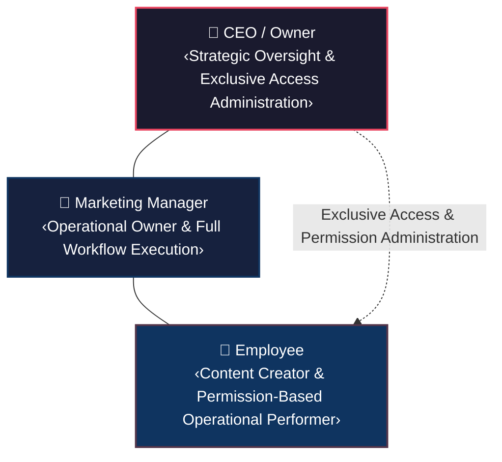
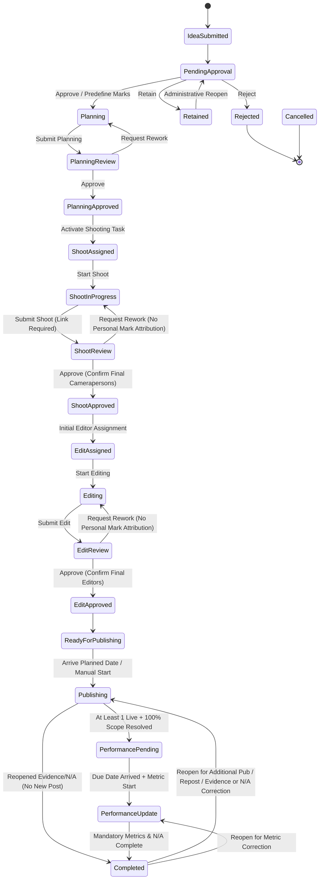

<!-- ─────────────────────────────────────────────────────────────────────────── -->

<!-- KCPC BANDHANI — CONTENT PRODUCTION LIFECYCLE MVP                          -->

<!-- BUSINESS REQUIREMENTS SPECIFICATION (BRS)                                -->

<!-- ─────────────────────────────────────────────────────────────────────────── -->

---

## Document Control

| Attribute              | Detail                                    |
| :--------------------- | :---------------------------------------- |
| **Document Title**     | Business Requirements Specification (BRS) |
| **Project Name**       | Content Production Lifecycle MVP          |
| **Client**             | KCPC Bandhani                             |
| **Document ID**        | KCPC-MKT-BRS-001                          |
| **Version**            | 1.1.0                                     |
| **Status**             | Draft — Pending Stakeholder Review        |
| **Classification**     | Confidential — Internal Use Only          |
| **Source Baseline**    | KCPC-MKT-BFD-001 — BFD v1.5.0 (R3.4 candidate) |
| **Source BFD Status**  | Draft — Pending CEO Review                |
| **Author(s)**          | Enterprise Solutions & Advisory Practice  |
| **Reviewed By**        | Pending                                   |
| **Approved By**        | Pending                                   |
| **Created Date**       | August 7, 2026                            |
| **Last Modified Date** | August 12, 2026                           |

### Revision History

| Version | Date           | Author                    | Change Description                                                                                                                                                                                                                                                                                                                                                                                                                                                                                                                                                                                                                                                                                                                                                                                                                                                                                                                                                                                                                                                                                                                                                                                                                                                                                                                                                                                                                                                                                                                                                                                                                                                                                                                                                                                                                                                                                                                                                                                                                                                        | Reviewed By |
| :------ | :------------- | :------------------------ | :-------------------------------------------------------------------------------------------------------------------------------------------------------------------------------------------------------------------------------------------------------------------------------------------------------------------------------------------------------------------------------------------------------------------------------------------------------------------------------------------------------------------------------------------------------------------------------------------------------------------------------------------------------------------------------------------------------------------------------------------------------------------------------------------------------------------------------------------------------------------------------------------------------------------------------------------------------------------------------------------------------------------------------------------------------------------------------------------------------------------------------------------------------------------------------------------------------------------------------------------------------------------------------------------------------------------------------------------------------------------------------------------------------------------------------------------------------------------------------------------------------------------------------------------------------------------------------------------------------------------------------------------------------------------------------------------------------------------------------------------------------------------------------------------------------------------------------------------------------------------------------------------------------------------------------------------------------------------------------------------------------------------------------------------------------- | :---------- |
| 1.0.0   | August 7, 2026 | Enterprise Solutions Team | Initial formal release of BRS derived from authoritative Business Foundation Document (BFD) v1.4.0 baseline.                                                                                                                                                                                                                                                                                                                                                                                                                                                                                                                                                                                                                                                                                                                                                                                                                                                                                                                                                                                                                                                                                                                                                                                                                                                                                                                                                                                                                                                                                                                                                                                                                                                                                                                                                                                                                                                                                                                                                              | Pending     |
| 1.0.1   | August 8, 2026 | Enterprise Solutions Team | Controlled requirements enhancement and quality pass: (1) Derived from authoritative BFD v1.4.1 baseline; (2) Updated BRS-REQ-014 for dedicated Idea Submission Form fields (Idea Title required, Reference Link / Note optional, Remarks optional long-form free text with no business-defined word limit); (3) Standardized Content ID format `C-MMYY-NNNN` with monthly sequence reset in BRS-REQ-020 (resolving dependency DP-004); (4) Established controlled Content Priority levels (Low, Medium, High) in BRS-REQ-021; (5) Added multi-contributor support across shooting/editing assignments in BRS-REQ-021, BRS-REQ-022, BRS-REQ-035, BRS-REQ-057; (6) Integrated Employee Marks from controlled list `[0, 0.1, 0.25, 0.5, 1.0, 2.0, 3.0, 5.0]` awarded exclusively upon final approval to qualifying final contributors responsible for the Final Approved Work (Shoot Review in BRS-REQ-033; Edit Review in BRS-REQ-037), specifying that Request Rework creates no Mark award record and Mark corrections follow immutable linked correction records; (7) Defined Publication Event Type (Original, Repost) supporting the same or different targets under existing Content ID with zero new Marks and independent performance metrics in BRS-REQ-042, BRS-REQ-043, BRS-REQ-053, BRS-REQ-055, BRS-REQ-073; (8) Adopted authoritative Creative Performance Scorecard per publication event with N/A handling in BRS-REQ-049, BRS-REQ-050, BRS-REQ-051; (9) Enforced strict Mark privacy and 5th personal performance measure in BRS-REQ-066, BRS-REQ-067, BRS-REQ-068, BRS-REQ-070; (10) Expanded Acceptance Criteria across BRS-REQ-071 through BRS-REQ-075 for individual testability of all 30 KPIs (KPI-001..030); (11) Added BR-039 to BRS-REQ-075 source traceability; (12) Phased SC-002 baseline comparison in AC-075; (13) Updated BRS-REQ-078 to continuous 24×7 availability (≥99% uptime, excluding approved planned maintenance); (14) Restored source-fidelity requirement priority governance; (15) Synchronized Glossary and Appendices A–E. | Pending     |
| 1.0.2   | August 9, 2026 | Enterprise Solutions Team | Controlled requirements change pass: (1) Derived from authoritative BFD v1.4.2 baseline; (2) Updated Marks model to predefined role Marks selected during Idea Review (Approve) from controlled list `[0, 0.5, 1.0, 2.0, 3.0]` for Cameraperson Mark and Editor Mark, attaching to approved Idea / Content ID without requiring assignees to exist at Idea Review (BRS-REQ-016); (3) Updated Shoot Review (Approve) to confirm one or more qualifying final Camerapersons, each receiving the predefined Cameraperson Mark without splitting or manual Mark selection (BRS-REQ-033, AC-033.3); (4) Updated Edit Review (Approve) to confirm one or more qualifying final Editors, each receiving the predefined Editor Mark without splitting or manual Mark selection (BRS-REQ-037, AC-037.3); (5) Established that Request Rework and Reposts create zero personal Mark attribution records and leave predefined role Marks unchanged (BRS-REQ-033, BRS-REQ-037, BRS-REQ-053); (6) Restricted predefined Mark value corrections strictly to Idea Review authority (Permission #1) via immutable linked correction records preserving original value, corrected value, affected role, Idea/Content ID, original Idea Review decision reference, actor, timestamp, mandatory reason, and permission reference (BRS-REQ-016, AC-016.4, BRS-REQ-063); (7) Preserved strict privacy governance for qualifying Camerapersons/Editors viewing own Marks only and 5th personal performance measure (BRS-REQ-066, BRS-REQ-067, BRS-REQ-068, BRS-REQ-070); (8) Updated §42 Status Catalogue (#11, #15), §43 Mermaid workflow diagram, §44 Invariants (Marks invariants), §46 Glossary (`Marks`), §47 Appendices A (BR-003, BR-015, BR-020, BR-038, BR-050, BR-054, BR-061) and D (Permissions #1, #5, #7) for 100% bidirectional traceability.                                                                                                                                                                                                                                    | Pending     |
| 1.0.3   | August 10, 2026 | Enterprise Solutions Team | Controlled requirements enhancement and synchronization pass: (1) Derived from authoritative BFD v1.4.3 baseline; (2) Updated BRS-REQ-014 (AC-014.3) to exclude Category from Idea Submission; (3) Updated BRS-REQ-021 (Statement, AC-021.2, AC-021.4) to capture mandatory, single-select Category from controlled reference list (with illustrative examples Saree, Lehenga, Kurti), enforce validation blocking on missing Category, and maintain conceptual distinction from SKU ID; (4) Added Glossary entry for Category; (5) Updated Appendix A BR-012 descriptor; and (6) Preserved all existing workflow, assignment, review, Marks, and governance logic. | Pending     |
| 1.0.4   | August 11, 2026 | Enterprise Solutions Team | Controlled business change pass: (1) Derived from BFD v1.4.4 baseline; (2) Updated BRS-REQ-021 for optional manual free-text Category attribute (blank permitted, single/multi-value in one field, no reference data / lookup, distinct from SKU); (3) Clarified BRS-REQ-062 taxonomy boundary excluding Category; (4) Added BRS-REQ-084 for In-Progress Work Hold & Resume Governance with AC-084.1 through AC-084.4; and (5) Updated totals to 84 BRS requirements and 204 Acceptance Criteria. Current-baseline references were subsequently re-synchronized to BFD v1.4.5 following the recorded SC-REQ-001/002 stakeholder scorecard decisions, which resolved the two previously-open scorecard clarifications — zero-denominator rates are recorded as N/A (excluded from averages/KPIs) and partial metrics use a DRAFT-then-submit lifecycle — thereby changing the affected scorecard capture/derivation semantics; the core role, permission, and workflow business model is unchanged. | Pending     |
| 1.1.0 | August 12, 2026 | Enterprise Solutions Team | Controlled Business Change Package **R3.4** (candidate): added **BRS-REQ-085** (Business Role Catalogue) and **BRS-REQ-086** (Planning Mode & Urgent Scheduling); revised BRS-REQ-027 (Standard/Urgent) and reframed the role model as three internal access classes + Business Role. **CANDIDATE — PENDING INDEPENDENT REVIEW; not frozen; R3.3 remains the current frozen baseline.** _Closure pass (Aug 12, 2026): applied independent-review corrections (findings 1–7) and the approved same-day-Urgent decision (new AC-086.6 / ERD-CON-066); independent review returned FAIL→corrected; pending final independent re-audit._ _Final re-audit surgical closure pass (Aug 13, 2026): closed findings 1–5 and 7 (current source-baseline metadata, current normative counts, as-built register, Business Role vs internal access class terminology, self-version footers, mechanical-audit methodology). Historical revision rows and freeze records untouched. Finding 6 (same-day Urgent approval provenance) remains OPEN — PENDING OWNER / STAKEHOLDER CONFIRMATION; the rule and its recorded provenance are unchanged. Status: R3.4 CANDIDATE — PENDING FINAL INDEPENDENT RE-AUDIT._ _Targeted traceability/governance closure pass (Aug 13, 2026) after the second independent re-audit returned FAIL: closed residual findings 1–8 and the two terminology residues (CN-009 role constraint, RTM-086/ERD §25/API-OP-018 trace edges, as-built +9→+10 ACs, 'forced −5/−2' wording, UIUX v0.2.1 R3.2→R3.3 companion governance, SAD §9.1 heading, BFD glossary). Sweep D expected-edge validation added to the audit method. Finding 6 (same-day Urgent approval provenance) remains OPEN — PENDING OWNER / STAKEHOLDER CONFIRMATION; rule and provenance untouched. Status: R3.4 CANDIDATE — PENDING RE-SUBMISSION FOR FINAL INDEPENDENT RE-AUDIT._ _Finding 6 governance closure (Aug 13, 2026): the third independent re-audit returned TECHNICAL & TRACEABILITY PASS with a governance hold; that hold is closed by CEO / Owner business decision record `KCPC-MKT-DR-R3.4-001` (same-day Urgent Shoot/Edit permitted). Provenance wording only — no requirement, AC, design element, constraint, operation, count or identifier changed. Status: R3.4 CANDIDATE — ALL FINDINGS CLOSED; PENDING FINAL FREEZE-READINESS CONFIRMATION._ | Pending |

### Distribution List

| Name / Role        | Purpose                          |
| :----------------- | :------------------------------- |
| CEO / Owner        | Review & Approve                 |
| Marketing Manager  | Review & Approve                 |
| Business Analyst   | Reference & Traceability         |
| Solution Architect | Reference & SRS Derivation       |
| Development Lead   | Reference                        |
| QA Lead            | Reference & Test Case Derivation |
| Project Manager    | Reference & Scope Control        |

---

## Table of Contents

- [1. Document Control](#document-control)
- [2. Purpose \& Objectives](#2-purpose--objectives)
- [3. Source Baseline \& Requirements Governance](#3-source-baseline--requirements-governance)
- [4. Business Scope](#4-business-scope)
- [5. Stakeholders \& Business Roles](#5-stakeholders--business-roles)
- [6. Business Requirement Classification](#6-business-requirement-classification)
- [7. Functional Business Requirements](#7-functional-business-requirements)
  - [7.1 Authentication \& Role-Based Access Experience](#71-authentication--role-based-access-experience)
  - [7.2 User Access Administration](#72-user-access-administration)
  - [7.3 Operational Permission Management](#73-operational-permission-management)
- [8. Idea Management Requirements](#8-idea-management-requirements)
- [9. Planning Requirements](#9-planning-requirements)
- [10. Content Identity \& Planned Output Requirements](#10-content-identity--planned-output-requirements)
- [11. Publication Scope Requirements](#11-publication-scope-requirements)
- [12. Shooting Requirements](#12-shooting-requirements)
- [13. Editor Assignment \& Editing Requirements](#13-editor-assignment--editing-requirements)
- [14. Assignment-Time Workload Requirements](#14-assignment-time-workload-requirements)
- [15. Publishing Requirements](#15-publishing-requirements)
- [16. Planned Live Date Requirements](#16-planned-live-date-requirements)
- [17. Actual Publication Event Requirements](#17-actual-publication-event-requirements)
- [18. Publishing Scope Completion Requirements](#18-publishing-scope-completion-requirements)
- [19. Publication Target N/A Requirements](#19-publication-target-na-requirements)
- [20. Performance Pending Requirements](#20-performance-pending-requirements)
- [21. Performance Update Requirements](#21-performance-update-requirements)
- [22. Completion Requirements](#22-completion-requirements)
- [23. Reopen Completed Requirements](#23-reopen-completed-requirements)
- [24. Reschedule Requirements](#24-reschedule-requirements)
- [25. Reassignment Requirements](#25-reassignment-requirements)
- [26. Cancellation Requirements](#26-cancellation-requirements)
- [27. Content Asset Folder Link Requirements](#27-content-asset-folder-link-requirements)
- [28. Platform \& Company Channel / Account Catalogue Requirements](#28-platform--company-channel--account-catalogue-requirements)
- [29. Content Taxonomy Requirements](#29-content-taxonomy-requirements)
- [30. Audit \& Traceability Requirements](#30-audit--traceability-requirements)
- [31. Employee Self-Service Requirements](#31-employee-self-service-requirements)
- [32. Personal Performance Requirements](#32-personal-performance-requirements)
- [33. Privacy \& Visibility Requirements](#33-privacy--visibility-requirements)
- [34. KPI \& Reporting Requirements](#34-kpi--reporting-requirements)
- [35. Success Criteria Traceability](#35-success-criteria-traceability)
- [36. Non-Functional Business Requirements](#36-non-functional-business-requirements)
- [37. Assumptions](#37-assumptions)
- [38. Constraints](#38-constraints)
- [39. Dependencies](#39-dependencies)
- [40. Risks](#40-risks)
- [41. Out of Scope](#41-out-of-scope)
- [42. Status Model](#42-status-model)
- [43. Workflow Model](#43-workflow-model)
- [44. Governing Business Invariants](#44-governing-business-invariants)
- [45. Controlled BRS Review Notes](#45-controlled-brs-review-notes)
- [46. Glossary](#46-glossary)
- [47. Appendices](#47-appendices)
  - [Appendix A — BFD Business Rule Coverage](#appendix-a--bfd-business-rule-coverage)
  - [Appendix B — KPI Requirement Coverage](#appendix-b--kpi-requirement-coverage)
  - [Appendix C — Success Criteria Coverage](#appendix-c--success-criteria-coverage)
  - [Appendix D — Operational Permission Coverage](#appendix-d--operational-permission-coverage)
  - [Appendix E — Workflow Status Coverage](#appendix-e--workflow-status-coverage)

---

## 2. Purpose & Objectives

The purpose of this **Business Requirements Specification (BRS)** is to translate the authoritative business baseline established in the **Business Foundation Document (BFD) v1.5.0** (`KCPC-MKT-BFD-001`, Status: *Draft — Pending CEO Review*; R3.4 candidate) into clear, atomic, unambiguous, implementation-agnostic, testable, and traceable business requirements.

This document serves as the bridge between high-level business goals (OBJ-001 through OBJ-010) and downstream engineering specifications:

$$\text{BFD v1.5.0} \longrightarrow \mathbf{\text{BRS v1.1.0}} \longrightarrow \text{RTM} \longrightarrow \text{SRS} \longrightarrow \text{Design \& Code}$$

> [!IMPORTANT]
> **Implementation-Agnostic Boundary:** The BRS specifies *what* business capabilities, workflow logic, governance controls, data capture rules, privacy boundaries, audit trails, and reporting outcomes the system must deliver. It explicitly avoids specifying programming languages, frameworks, database schemas, API routes, cloud providers, or UI layout specs, which belong strictly in downstream deliverables (SRS, ERD, API, UI/UX).

---

## 3. Source Baseline & Requirements Governance

1. **Authoritative Source Baseline:** This BRS is derived exclusively from **Business Foundation Document (BFD) v1.5.0** (`KCPC-MKT-BFD-001`, Status: *Draft — Pending CEO Review*; R3.4 candidate).
2. **Precedence Rule:** In the event of any wording ambiguity or conflict, `KCPC-MKT-BFD-001 v1.5.0` takes precedence over all other documents.
3. **Change Governance:** No business requirement in this BRS may intentionally alter, expand, or contradict the BFD baseline. Any future change to business scope, rules, roles, permissions, KPIs, or workflow statuses must first be formally approved via BFD Change Control before being incorporated into an updated BRS release.

---

## 4. Business Scope

### 4.1 In-Scope Business Capabilities

- Digitization and standardization of the end-to-end Content Production Lifecycle for KCPC Bandhani.
- Role-based application experience serving three internal access classes (CEO / Owner, Marketing Manager, Employee), over which an expandable Business Role (designation) catalogue is layered (`BRS-REQ-085`).
- Multi-role Idea Submission access via a dedicated Idea Submission Form capturing Idea Title (required), Reference Link / Note (optional), and Remarks (optional long-form free text with no business-defined word limit).
- Idea evaluation gate with Approve, Reject, and dormant Retain outcomes, supported by administrative Reopen functionality.
- Content Planning, single Content ID assignment formatted as `C-MMYY-NNNN` (resetting sequence monthly) per approved Idea, controlled Content Priority levels (Low, Medium, High), multi-contributor talent/crew support, multi-asset Planned Output taxonomy classification (Photography, Reel, Video), Reel Type attribution (Very Short, Short, Long) per Reel-type Planned Output, and publication scope mapping.
- Parent Content Asset Folder Link establishment and replacement governance pointing to the company-controlled cloud folder.
- Production stage execution and review gates (Planning Review, Shoot Review, Edit Review) with Approve and Request Rework outcomes.
- Shooting execution and post-Shoot Approval Editor assignment via dedicated operational permissions.
- Predefined role Marks model capturing Cameraperson and Editor Marks from controlled list `[0, 0.5, 1.0, 2.0, 3.0]` at Idea Approval (Permission #1), attributing the predefined Marks without splitting or averaging to qualifying final Cameraperson(s) at Shoot Approval (Permission #5) and qualifying final Editor(s) at Edit Approval (Permission #7) for the Final Approved Work, with Request Rework and Reposts creating zero personal Mark attribution records.
- Contextual workload visibility for authorized assigners during shooting and editing assignments to support human load balancing without automated algorithms.
- Multi-channel publishing according to approved publication scope, event-level Actual Publication recording, Publication Event Type classification (`Original`, `Repost`), zero additional Marks on Reposts, and reversible Publication Target N/A exception handling.
- Creative Performance Scorecard per Actual Publication event, event-level Performance Due Date calculation ($\text{Actual Publication Date} + 2\text{ calendar days}$), manual metric entry (Views/Plays, 3-sec views, Avg watch time, Video length, Link clicks, Impressions), frozen rate formulas (Views, Hook Rate, Hold Rate, CTR), N/A handling for unsupported platform fields, and linked metric corrections.
- Closed / Reopenable `Completed` workflow status with controlled reopening under approved Reopen Completed governance (for additional publication, Reposts, publishing-evidence correction, Publication Target N/A reversal/correction, or metric corrections) without re-executing production stages.
- Cross-stage schedule modifications, reassignment (replacing existing assignees), and pre-completion cancellation.
- Exclusive CEO user-access and operational-permission administration (17 predefined permissions).
- Immutable audit logging across all workflow events, decisions, administrative actions, access changes, Mark corrections, and permission exercises.
- 30 formal KPIs, administrative action reporting, phased 90-day baseline comparison (SC-002), continuous 24×7 operational availability (SC-010), and employee self-service views with peer-privacy enforcement across five approved personal-performance measures: four operational measures (Delayed Work, Approved Work / Task Outputs, Review Submissions, Request Rework Before Approval) plus Personal Marks as the fifth measure for qualifying Camerapersons and Editors.

### 4.2 Out-of-Scope Items

- External social media API integrations, automated publishing, automated social analytics collection.
- File upload, media storage, cloud storage API automation, automated folder creation, or folder permission management.
- Enterprise Business OS modules (CRM, Inventory, HRMS, Finance, BI) and historical spreadsheet data migration.
- Customer-facing e-commerce features, multi-department workflows, mobile native apps.
- Automated payroll, incentive calculations, employee ranking algorithms, automated workload allocation algorithms, or machine learning.

---

## 5. Stakeholders & Business Roles

The system operates with **exactly three internal access classes** (`CEO_OWNER`, `MARKETING_MANAGER`, `EMPLOYEE` — security/authorization classifications). Each user carries **one Business Role** (organizational designation from the expandable Business Role catalogue, `BRS-REQ-085`) that resolves to exactly one of these three access classes. The access classes below are the security boundary; the Business Role is the visible organizational identity and never, by its name, grants an Operational Permission:

1. **CEO / Owner:** Strategic oversight, idea submission, full operational execution authority equivalent to Marketing Manager, and **exclusive authority** for user-access administration (create, activate, deactivate accounts; assign Business Roles (each resolving to one internal access class); grant, modify, expire, revoke operational permissions).
2. **Marketing Manager:** Operational owner with full default authority to submit ideas, prepare planning parameters, assign shooting teams and editors, conduct reviews, manage predefined role Mark capture and qualifying-contributor Mark attribution under the applicable review authorities, execute publishing, manage master catalogues, record N/A exceptions, enter performance metrics, reschedule, reassign, cancel eligible records, and reopen Completed deliverables. Has **zero access-administration authority**.
3. **Employee:** Content creator and executor with default self-service access to assigned tasks, deadlines, feedback, folder links, personal workload, own Marks (for qualifying roles), and five approved personal-performance measures: four operational measures (Delayed Work, Approved Work / Task Outputs, Review Submissions, Request Rework Before Approval) plus Personal Marks as the fifth measure for qualifying Camerapersons and Editors derived from own assigned work. Additional operational capabilities are provided exclusively via CEO-Granted Operational Permissions within recorded scope. Employees **shall never** receive access-administration authority, cannot delegate permissions onward, and cannot perform self-approval when exercising review permissions.

---

## 6. Business Requirement Classification

Every requirement in this specification is assigned to one of ten standardized categories:

| Category Code | Category Name               | Description                                                              |
| :------------ | :-------------------------- | :----------------------------------------------------------------------- |
| **BUS-FUNC**  | Business Functional         | Core operational capabilities and business feature rules                 |
| **WORKFLOW**  | Workflow                    | Lifecycle transitions, state machine behavior, stage exit/entry criteria |
| **ACCESS**    | Access & Authorization      | User authentication, internal access classes (via Business Role), CEO permissions, access scoping |
| **DATA-INFO** | Business Data / Information | Data capture requirements, taxonomy, identity models, attributes         |
| **AUDIT**     | Audit & Traceability        | Log capture, history preservation, change tracking, immutability         |
| **REPORTING** | Reporting & KPI             | Formal KPIs, administrative metrics, personal performance views          |
| **NON-FUNC**  | Non-Functional Business     | System availability, environment, capacity boundaries, lifespan          |
| **CONSTRAIN** | Business Constraint         | Scope boundaries, process limits, integration exclusions                 |
| **PRIVACY**   | Privacy & Visibility        | Employee privacy, peer data protection, aggregate visibility scoping     |
| **EXCEPTION** | Exception / Control         | Business exception rules, N/A governance, rework, cancellation limits    |

---

## 7. Functional Business Requirements

### 7.1 Authentication & Role-Based Access Experience

#### BRS-REQ-001: Shared Application Authentication & Role-Appropriate Landing Experience
- **Category:** Access & Authorization (`ACCESS`)
- **Requirement Statement:** The system shall provide a single shared application entry point that authenticates users and delivers role- and permission-appropriate landing experiences, navigation options, data views, and actionable controls based on the user's resolved internal access class (from the assigned Business Role — CEO / Owner, Marketing Manager, Employee) and active CEO-Granted Operational Permissions.
- **Business Rationale:** Ensures single-system operational unity while enforcing role boundaries and operational clarity across the team.
- **Source Traceability:** BFD §3.1, §5.9 BR-058, SC-001, SC-009, SC-013.
- **Priority:** Critical
- **Acceptance Criteria:**
  - **AC-001.1:** Upon successful authentication, a CEO / Owner receives executive governance views, operational dashboards, and exclusive access-administration entry points.
  - **AC-001.2:** Upon successful authentication, a Marketing Manager receives full operational management dashboards, queue management, and execution controls.
  - **AC-001.3:** Upon successful authentication, an Employee receives a self-service workspace displaying assigned work, deadlines, feedback, and personal performance indicators.

#### BRS-REQ-002: System Access Boundary Enforcement & Screen/Data Scoping
- **Category:** Access & Authorization (`ACCESS`)
- **Requirement Statement:** The system shall strictly restrict access to screens, records, data fields, and operational actions according to the authenticated user's resolved internal access class (from the assigned Business Role) and active CEO-Granted Operational Permissions, ensuring that unauthorized resources remain fully inaccessible regardless of access mechanism.
- **Business Rationale:** Protects system integrity, operational privacy, and administrative authority from unauthorized access or exposure.
- **Source Traceability:** BFD §5.9 BR-058, §6.6, SC-013.
- **Priority:** Critical
- **Acceptance Criteria:**
  - **AC-002.1:** An Employee without relevant CEO-granted permissions is prevented from accessing management dashboards, review screens, or catalogue configuration tools.
  - **AC-002.2:** Attempted navigation or action execution outside assigned permissions is denied and recorded as an unauthorized access attempt in the audit log.

---

### 7.2 User Access Administration

#### BRS-REQ-003: Exclusive CEO User Account Management
- **Category:** Access & Authorization (`ACCESS`)
- **Requirement Statement:** The system shall restrict user account creation, activation, and deactivation exclusively to authenticated users holding the CEO / Owner internal access class.
- **Business Rationale:** Maintains strict executive control over system access and organizational user onboarding/offboarding.
- **Source Traceability:** BFD §3.1.1, §5.9 BR-041, §5.10 BR-062, §6.6, SC-013.
- **Priority:** Critical
- **Acceptance Criteria:**
  - **AC-003.1:** Only a CEO user can initiate account creation, set account status to active, or deactivate existing user accounts.
  - **AC-003.2:** Marketing Managers and Employees cannot view account creation controls or perform account status changes.

#### BRS-REQ-004: Exclusive CEO Business Role Assignment & Modification
- **Category:** Access & Authorization (`ACCESS`)
- **Requirement Statement:** The system shall restrict **Business Role assignment** — the user’s organizational designation, which resolves to exactly one internal access class (CEO / Owner, Marketing Manager, Employee) — during user account creation or modification exclusively to authenticated users holding the CEO / Owner internal access class. Assigning an ordinary Business Role never confers CEO/MM authority.
- **Business Rationale:** Prevents role escalation and ensures role assignments reflect formal enterprise hierarchy.
- **Source Traceability:** BFD §3.1.1, §5.9 BR-041, §5.10 BR-062, §6.6, SC-013.
- **Priority:** Critical
- **Acceptance Criteria:**
  - **AC-004.1:** Only a CEO user can select or alter the Business Role assigned to any user account (and the resolved internal access class follows from that Business Role).
  - **AC-004.2:** Changing a user's Business Role is logged in the audit trail with previous Business Role, new Business Role (and resolved access class), actor, timestamp, and mandatory reason.

#### BRS-REQ-005: Account Status Transitions & User Management Audit Logging
- **Category:** Audit & Traceability (`AUDIT`)
- **Requirement Statement:** The system shall record an immutable audit log entry for every user account creation, activation, deactivation, and Business Role change, capturing affected user, action, previous status/Business Role, new status/Business Role (and resolved access class), actor, timestamp, mandatory reason, and outcome.
- **Business Rationale:** Provides complete accountability and non-repudiation for identity and access governance events.
- **Source Traceability:** BFD §5.10 BR-062, §5.11 BR-049, §6.6, SC-004, SC-013.
- **Priority:** Critical
- **Acceptance Criteria:**
  - **AC-005.1:** Saving an account administration action requires entering a mandatory reason.
  - **AC-005.2:** User access administration records are permanently preserved in the immutable audit log.

---

### 7.3 Operational Permission Management

#### BRS-REQ-006: Exclusive CEO Operational Permission Administration & 17-Permission Catalogue
- **Category:** Access & Authorization (`ACCESS`)
- **Requirement Statement:** The system shall enforce that only the CEO / Owner can grant, modify, expire, or revoke permissions from the predefined 17-permission catalogue to named Employees, without altering their underlying Employee internal access class.
- **Business Rationale:** Enables secure delegation of specific operational duties without diluting role boundaries.
- **Source Traceability:** BFD §3.1.1, §5.10 BR-056, §6.6, SC-013.
- **Priority:** Critical
- **Acceptance Criteria:**
  - **AC-006.1:** Permission grant, modify, and revoke interfaces are accessible exclusively to CEO users.
  - **AC-006.2:** CEO can grant only permissions from the approved 17-item catalogue (Permissions #1 through #17).

#### BRS-REQ-007: Real-Time Runtime Permission Validation & Audit Logging
- **Category:** Access & Authorization (`ACCESS`)
- **Requirement Statement:** The system shall perform real-time authorization checks prior to allowing execution of any permitted action, verifying active status, scope, effective time, and absence of revocation, while logging every permission lifecycle event.
- **Business Rationale:** Enforces continuous security validation and eliminates stale authorization vulnerabilities.
- **Source Traceability:** BFD §5.10 BR-056, BR-057, §6.6, SC-013.
- **Priority:** Critical
- **Acceptance Criteria:**
  - **AC-007.1:** The system verifies permission validity at the exact moment an action is triggered.
  - **AC-007.2:** Every permission grant, modification, and revocation creates an immutable audit record with actor, timestamp, scope, and mandatory reason.

#### BRS-REQ-008: Operational Permission Granular Scope Configuration
- **Category:** Access & Authorization (`ACCESS`)
- **Requirement Statement:** The system shall support configuring granular permission scopes (Global, Stage-Restricted, or Specific Idea ID / Content ID Restricted) for every granted operational permission.
- **Business Rationale:** Prevents over-privileged access by scoping permissions to specific content items or production stages.
- **Source Traceability:** BFD §5.10 BR-056, BR-057, §6.6.
- **Priority:** Critical
- **Acceptance Criteria:**
  - **AC-008.1:** When granting a permission, the CEO can designate whether the scope is Global, Stage-Restricted, or Item-Restricted.
  - **AC-008.2:** The system restricts permitted operations strictly to the designated scope boundary.

#### BRS-REQ-009: Permission Scope, Active Validity, and System Enforcement
- **Category:** Access & Authorization (`ACCESS`)
- **Requirement Statement:** The system shall validate permission validity in real time prior to executing any permitted action, verifying that the permission is active, current timestamp is between effective and expiry times, permission has not been revoked, and requested action falls within recorded scope.
- **Business Rationale:** Guarantees strict runtime compliance for all delegated operational activities.
- **Source Traceability:** BFD §5.10 BR-057, §6.6.
- **Priority:** Critical
- **Acceptance Criteria:**
  - **AC-009.1:** Actions attempted outside effective time boundaries or recorded scope are rejected instantly by the system.
  - **AC-009.2:** Real-time permission checks evaluate active status prior to displaying actionable UI controls or processing requests.

#### BRS-REQ-010: Employee Interface Boundary Control for Permission Grants
- **Category:** Access & Authorization (`ACCESS`)
- **Requirement Statement:** The system shall ensure that granting one or more operational permissions to an Employee exposes only the specific screens, fields, and action controls corresponding to those granted permissions, without exposing the complete Marketing Manager interface or unrelated management features.
- **Business Rationale:** Preserves operational focus and security boundaries while delegating specific tasks.
- **Source Traceability:** BFD §3.1.3, §5.9 BR-058, §6.6, SC-013.
- **Priority:** Critical
- **Acceptance Criteria:**
  - **AC-010.1:** An Employee granted Shoot Review permission sees only Shoot Review queues and controls within their assigned scope.
  - **AC-010.2:** Unrelated management dashboards, catalogues, or administrative settings remain hidden and inaccessible to the permitted Employee.

#### BRS-REQ-011: Prohibition of Onward Permission Delegation
- **Category:** Access & Authorization (`ACCESS`)
- **Requirement Statement:** The system shall prevent Marketing Managers and Employees from granting, modifying, revoking, or delegating operational permissions or user access to any other user.
- **Business Rationale:** Eliminates security risks associated with uncontrolled transitive permission delegation.
- **Source Traceability:** BFD §3.1.3, §5.10 BR-056, §6.6.
- **Priority:** Critical
- **Acceptance Criteria:**
  - **AC-011.1:** Non-CEO users have no interface options or functional capability to delegate permissions or manage user access.
  - **AC-011.2:** System authorization enforcement rejects any permission modification request originated by a non-CEO user.

#### BRS-REQ-012: Employee Self-Approval Prohibition for Delegated Review Permissions
- **Category:** Access & Authorization (`ACCESS`)
- **Requirement Statement:** The system shall prevent an Employee exercising a CEO-granted review permission (Idea Review, Planning Review, Shoot Review, Edit Review) from making review decisions on ideas or work that they personally submitted, executed, prepared, or submitted for review.
- **Business Rationale:** Upholds quality assurance integrity and internal control by preventing self-review conflict of interest.
- **Source Traceability:** BFD §3.1.3, §5.3 BR-015, §5.4 BR-020, §5.8 BR-037, §5.10 BR-057, §6.5, §6.6.
- **Priority:** Critical
- **Acceptance Criteria:**
  - **AC-012.1:** When a review item was submitted, executed, or prepared by a permitted Employee, review decision controls for that item are disabled/hidden for that Employee.
  - **AC-012.2:** Attempting to submit a self-approval decision returns a validation error and logs an unauthorized review attempt.

#### BRS-REQ-013: Permission Administration & Exercise Audit Logging
- **Category:** Audit & Traceability (`AUDIT`)
- **Requirement Statement:** The system shall record immutable audit logs for all operational permission grants, scope modifications, revocations, expirations, successful permission exercises, and denied permission attempts, capturing actor identity, target Employee, permission type, scope, timestamps, decision reasons, and outcomes.
- **Business Rationale:** Ensures complete traceability and governance monitoring for all delegated access lifecycle events.
- **Source Traceability:** BFD §5.10 BR-056, BR-057, §5.11 BR-049, §6.6, SC-004, SC-013.
- **Priority:** Critical
- **Acceptance Criteria:**
  - **AC-013.1:** Permission grant, modification, and revocation actions require entering a mandatory reason before saving.
  - **AC-013.2:** Both successful permission uses and rejected unauthorized attempts generate immutable audit records.

---

## 8. Idea Management Requirements

#### BRS-REQ-014: Multi-Role Idea Submission Access via Dedicated Form
- **Category:** Business Functional (`BUS-FUNC`)
- **Requirement Statement:** The system shall provide a dedicated Idea Submission Form allowing authenticated CEO / Owner, Marketing Manager, and Employee users to submit new marketing ideas.
- **Business Rationale:** Encourages creative contribution across all organizational roles while standardizing input data capture.
- **Source Traceability:** BFD §1.3, §3.2 RACI, §4.2 Stage 1, §5.1 BR-001, BR-005, §8 AS-011, §14 Glossary, KPI-017.
- **Priority:** High
- **Acceptance Criteria:**
  - **AC-014.1:** CEO, Marketing Manager, and Employee users can access and complete the Idea Submission Form.
  - **AC-014.2:** The Idea Submission Form captures user-entered fields: (1) **Idea Title** (Mandatory, non-empty text), (2) **Reference Link / Note** (Optional URL or reference string), and (3) **Remarks** (Optional, long-form free text with no business-defined word limit, supporting extended script notes, dialogue drafts, or creative guidance), while automatically populating system-derived attributes (Idea ID, Submitted By, Submitted Date/Time, Status *Idea Submitted → Pending Approval*).
  - **AC-014.3:** Planning fields (Category, Shoot Date, Edit Date, Content Priority, Cameraperson, Models, Planned Outputs, Publication Targets, SKU ID, Folder Link) are omitted from the Idea Submission Form and captured exclusively after Idea approval during Stage 3 Planning.

#### BRS-REQ-015: Automated System-Generated Idea ID Assignment
- **Category:** Business Data / Information (`DATA-INFO`)
- **Requirement Statement:** The system shall automatically generate and assign a unique system-generated Idea ID to every submitted Idea upon creation.
- **Business Rationale:** Provides unambiguous identity tracking for ideas prior to formal workflow entry.
- **Source Traceability:** BFD §4.2 Stage 1, §5.1 BR-006.
- **Priority:** High
- **Acceptance Criteria:**
  - **AC-015.1:** Upon valid Idea submission, a unique Idea ID is generated automatically.
  - **AC-015.2:** Each submitted Idea is associated with exactly one system-generated Idea ID.

#### BRS-REQ-016: Idea Review Evaluation Gate, Decision Enforcement, and Predefined Marks Capture
- **Category:** Workflow (`WORKFLOW`)
- **Requirement Statement:** The system shall queue newly submitted and reopened ideas in *Pending Approval* status for evaluation by authorized reviewers (CEO, Marketing Manager, or Employee with valid CEO-Granted Idea Review permission), requiring an explicit evaluation decision of **Approve**, **Reject**, or **Retain**. When Approve is selected, the reviewer shall be required to capture two predefined role Mark values from the controlled list `[0, 0.5, 1.0, 2.0, 3.0]`: (1) **Cameraperson Mark** and (2) **Editor Mark**, which attach to the approved Idea / Content ID without requiring assignees to exist at Idea Review.
- **Business Rationale:** Ensures ideas are formally evaluated before consuming planning and production resources, while establishing authoritative baseline Mark values for the deliverable upfront.
- **Source Traceability:** BFD §4.2 Stage 2, §5.1 BR-002, BR-003, §5.6 BR-061, §5.8 BR-036, BR-038, §6.5, §6.6 Permission #1, KPI-005, KPI-018, KPI-021.
- **Priority:** Critical
- **Acceptance Criteria:**
  - **AC-016.1:** Pending ideas cannot progress to Planning or terminal states without an explicit evaluation decision.
  - **AC-016.2:** Authorized reviewers can select Approve, Reject, or Retain for queued ideas.
  - **AC-016.3:** Selecting Approve enforces mandatory selection of two separate predefined role Mark values: Cameraperson Mark and Editor Mark, each selected from the controlled list `[0, 0.5, 1.0, 2.0, 3.0]`. The values attach to the approved Idea / Content ID and do not require assignees to exist at Idea Review.
  - **AC-016.4:** Predefined role Mark value corrections may be performed only under Idea Review authority (Permission #1) and create an immutable linked correction record preserving original value, corrected value, affected role (Cameraperson or Editor), Idea ID / Content ID, original Idea Review decision reference, correcting actor, correction timestamp, mandatory correction reason, and applicable permission reference without overwriting history.
  - **AC-016.5:** Selecting Reject or Retain does not require, create, or assign predefined Cameraperson Mark or Editor Mark values. If a Retained Idea is later administratively reopened and subsequently Approved, the two predefined role Marks are captured only at that later Approve decision.
  - **AC-016.6:** Numeric 0 is a legitimate selectable predefined Cameraperson Mark or Editor Mark value during Approve that satisfies the mandatory Mark-value requirement; blank or missing values are not equivalent to numeric 0, and any value outside the controlled list `[0, 0.5, 1.0, 2.0, 3.0]` is strictly rejected.

#### BRS-REQ-017: Terminal Idea Rejection Handling
- **Category:** Workflow (`WORKFLOW`)
- **Requirement Statement:** The system shall transition an idea selected for Rejection during Idea Review to the terminal *Rejected* status, capture a mandatory rejection reason, log reviewer identity and timestamp, and permanently prevent further workflow progression.
- **Business Rationale:** Formally closes unviable ideas while retaining decision history for analysis.
- **Source Traceability:** BFD §4.2 Stage 2, §5.1 BR-007, §6.8 Status #3, KPI-019, KPI-020.
- **Priority:** High
- **Acceptance Criteria:**
  - **AC-017.1:** Selecting Reject requires entering a mandatory rejection reason.
  - **AC-017.2:** Rejected ideas transition to status *Rejected* and cannot be reopened or edited.

#### BRS-REQ-018: Dormant Retained Idea Preservation
- **Category:** Workflow (`WORKFLOW`)
- **Requirement Statement:** The system shall transition an idea selected for Retention during Idea Review to the dormant *Retained* status under its existing Idea ID, without assigning a Content ID, establishing a future review date, or requiring a mandatory reason (allowing an optional comment), preserving the idea for potential future reconsideration.
- **Business Rationale:** Preserves valuable concepts that are not immediately actionable without cluttering active production queues.
- **Source Traceability:** BFD §4.2 Stage 2, §5.1 BR-059, §6.8 Status #4, KPI-020.
- **Priority:** High
- **Acceptance Criteria:**
  - **AC-018.1:** Selecting Retain moves the idea to status *Retained* under its original Idea ID.
  - **AC-018.2:** Retained ideas receive no Content ID and do not enter Planning queues.

#### BRS-REQ-019: Administrative Reopen of Retained Ideas
- **Category:** Workflow (`WORKFLOW`)
- **Requirement Statement:** The system shall allow authorized users (CEO, Marketing Manager, or Employee with CEO-Granted Idea Review permission) to execute an administrative **Reopen** action on a dormant *Retained* idea, returning it to *Pending Approval* status for fresh evaluation while logging actor, timestamp, and permission references.
- **Business Rationale:** Enables dormant ideas to be reactivated when strategic priorities or seasonal campaigns align.
- **Source Traceability:** BFD §4.2 Stage 2, §5.1 BR-059, §5.11 BR-046, §6.4, §6.8 Status #4.
- **Priority:** High
- **Acceptance Criteria:**
  - **AC-019.1:** Executing Reopen on a Retained idea transitions its status back to *Pending Approval*.
  - **AC-019.2:** The reopening action generates an audit record capturing actor, timestamp, and previous/new status.

---

## 9. Planning Requirements

#### BRS-REQ-020: Content ID Generation & Single Content Identity Rule
- **Category:** Business Data / Information (`DATA-INFO`)
- **Requirement Statement:** The system shall automatically generate exactly ONE unique, non-editable Content ID formatted as `C-MMYY-NNNN` when an approved Idea transitions to *Planning*, grouping all associated Planned Outputs under that single Content ID and workflow lifecycle.
- **Business Rationale:** Establishes single-object accountability and eliminates duplicate workflow tracking for multi-asset content deliverables.
- **Source Traceability:** BFD §1.3, §4.1, §4.2 Stage 3, §5.1 BR-004, §5.7 BR-029, BR-030, §10 DP-004, §14 Glossary, SC-006.
- **Priority:** Critical
- **Acceptance Criteria:**
  - **AC-020.1:** Approving an idea generates exactly one Content ID automatically upon entry to Planning using the format `C-MMYY-NNNN` (where `C` = Content, `MM` = two-digit calendar month of Planning entry `01`–`12`, `YY` = the last two digits of the calendar year in which the approved Idea enters Planning (for example, `26` for 2026), and `NNNN` = four-digit monthly sequence `0001`–`9999` resetting to `0001` at the start of each new `MMYY` period).
  - **AC-020.2:** The Content ID does not encode channel, platform, content type, or employee identifiers into the ID string, is non-editable, and groups all associated Planned Outputs under that single Content ID.

#### BRS-REQ-021: Non-Assignment Planning Parameter Definition
- **Category:** Business Data / Information (`DATA-INFO`)
- **Requirement Statement:** The system shall capture non-assignment Planning parameters including Category (optional, manually entered free-text attribute; allowed to remain blank or contain multiple category values within the single Category field), Content Priority using the controlled list (**Low**, **Medium**, **High**), Models / talent (one or more selected, or empty), SKU ID (or explicit **N/A** for generic content), and selected Publication Targets, prepared by authorized users (CEO, Marketing Manager, or Employee with CEO-Granted Planning Execution permission), without requiring Category selection from a reference table or catalogue.
- **Business Rationale:** Establishes essential commercial, operational, and strategic metadata prior to production execution.
- **Source Traceability:** BFD §4.2 Stage 3, §5.2 BR-008, BR-011, BR-012, BR-013, §5.7 BR-031, §5.9 BR-042, §6.6 Permission #2, §14 Glossary.
- **Priority:** Critical
- **Acceptance Criteria:**
  - **AC-021.1:** Authorized planning users can select Content Priority from the controlled list: **Low** (standard/evergreen), **Medium** (regular scheduled release), or **High** (time-sensitive/campaign-critical).
  - **AC-021.2:** Category is an optional free-text field (single field, supporting one or multiple category values as typed by the user, or left blank when undecided); Category is conceptually distinct from SKU ID (which allows explicit N/A for generic content).
  - **AC-021.3:** Models / talent field supports multi-selection of one or more talent members (or empty if none); SKU ID supports alphanumeric reference or explicit N/A; Publication Targets supports one or more selected targets.
  - **AC-021.4:** The system does not support "Critical" or "Urgent" content priorities, does not enforce Category reference data validation or single-select constraints, and does not execute automatic priority assignment algorithms.

#### BRS-REQ-022: Initial Shooting Assignment during Planning
- **Category:** Business Functional (`BUS-FUNC`)
- **Requirement Statement:** The system shall capture initial shooting team and cameraperson assignments (supporting one or more Camerapersons) during Planning, performed by authorized users (CEO, Marketing Manager, or Employee with CEO-Granted Shooting Assignment Management permission), while prohibiting initial Editor assignment during Stage 3.
- **Business Rationale:** Ensures shooting logistics are established early while deferring editor assignment until raw footage is approved.
- **Source Traceability:** BFD §3.1.2, §4.2 Stage 3, §5.2 BR-008, §5.3 BR-014, Permission #4.
- **Priority:** Critical
- **Acceptance Criteria:**
  - **AC-022.1:** Shooting team assignment allows selecting one or more Camerapersons during Planning using Shooting Assignment Management permission.
  - **AC-022.2:** Editor assignment controls are disabled/hidden during Stage 3 Planning.

#### BRS-REQ-023: Planned Output Taxonomy Classification & Multi-Asset Grouping
- **Category:** Business Data / Information (`DATA-INFO`)
- **Requirement Statement:** The system shall allow selecting one or multiple Planned Outputs under a Content ID during Planning using the controlled Planned Output Types (**Photography**, **Reel**, **Video**), maintaining all outputs under the shared Content ID workflow without creating deliverable-level sub-statuses.
- **Business Rationale:** Supports multi-format marketing campaigns under a unified workflow structure.
- **Source Traceability:** BFD §4.2 Stage 3, §5.2 BR-012, §5.7 BR-029, Appendix A, KPI-013, KPI-014, KPI-016.
- **Priority:** Critical
- **Acceptance Criteria:**
  - **AC-023.1:** Authorized planning users can select multiple Planned Outputs from the controlled Planned Output Types (**Photography**, **Reel**, **Video**) for a single Content ID.
  - **AC-023.2:** Selected Planned Outputs do not generate child workflow states or separate Content IDs.

#### BRS-REQ-024: Reel Type Duration Attribution per Reel-Type Planned Output
- **Category:** Business Data / Information (`DATA-INFO`)
- **Requirement Statement:** The system shall capture Reel Type duration classification (Very Short, Short, Long) individually for each applicable Reel-type Planned Output under a Content ID, rather than as a single property of the overall Content ID.
- **Business Rationale:** Ensures precise asset-level classification for future productivity analysis and incentive structures.
- **Source Traceability:** BFD §4.2 Stage 3, §5.2 BR-012, §5.7 BR-032, BR-033, Appendix C.
- **Priority:** Critical
- **Acceptance Criteria:**
  - **AC-024.1:** When a Reel-type Planned Output is selected, the system requires specifying exactly one Reel Type (Very Short, Short, or Long). Non-Reel Planned Outputs (Photography, Video) do not require a Reel Type.
  - **AC-024.2:** Multiple Reel-type Planned Outputs under the same Content ID can possess distinct Reel Type classifications (e.g., Output #1: Reel [Very Short], Output #2: Reel [Long]).

#### BRS-REQ-025: Intended Publication Scope Mapping
- **Category:** Business Data / Information (`DATA-INFO`)
- **Requirement Statement:** The system shall capture during Planning an intended publication scope mapping that associates each Planned Output intended for publication with one or more selected Publication Targets, serving as supporting data beneath the Content ID without creating child workflows.
- **Business Rationale:** Defines clear publishing expectations per asset and platform without introducing complex sub-task structures.
- **Source Traceability:** BFD §4.2 Stage 3, §5.2 BR-012, Glossary.
- **Priority:** Critical
- **Acceptance Criteria:**
  - **AC-025.1:** Planning allows mapping specific Planned Outputs to specific selected Publication Targets (e.g., Photography → Instagram, Reel [Short] → YouTube).
  - **AC-025.2:** Scope mappings exist as planning attributes under the Content ID without sub-status tracking.

#### BRS-REQ-026: Shared Approved Planned Live Date Model
- **Category:** Business Data / Information (`DATA-INFO`)
- **Requirement Statement:** The system shall enforce a single approved Planned Live Date per Content ID, which shall govern all Planned Outputs within the active publication scope.
- **Business Rationale:** Maintains unified scheduling alignment across all channel assets belonging to a marketing deliverable.
- **Source Traceability:** BFD §4.2 Stage 3, §5.2 BR-012, §5.5 BR-023, Glossary.
- **Priority:** Critical
- **Acceptance Criteria:**
  - **AC-026.1:** Setting or updating the Planned Live Date applies uniformly to all Planned Outputs under the Content ID.
  - **AC-026.2:** Asset-specific planned live dates cannot be created within a single publication scope.

#### BRS-REQ-027: Default Execution Date Calculation & Manual Override Governance
- **Category:** Business Functional (`BUS-FUNC`)
- **Requirement Statement:** Under **Standard** Planning Mode (`BRS-REQ-086`), the system shall automatically calculate default Shoot Date (Planned Live Date minus 5 calendar days) and Edit Date (Planned Live Date minus 2 calendar days) during Planning, while permitting authorized users (CEO, Marketing Manager, or Employee with CEO-Granted Planning Execution permission) to manually override default calculated dates. This −5/−2 model is a default planning formula, not an immutable workflow rule; **Urgent** Planning Mode suppresses this default calculation and uses manually specified dates (`BRS-REQ-086`).
- **Business Rationale:** Provides intelligent scheduling automation while allowing operational adjustments for complex shoots.
- **Source Traceability:** BFD §4.2 Stage 3, §5.2 BR-009, BR-010, BR-011.
- **Priority:** High
- **Acceptance Criteria:**
  - **AC-027.1:** Entering a Planned Live Date populates default Shoot Date (-5 days) and Edit Date (-2 days) automatically.
  - **AC-027.2:** Authorized planning users can override default dates prior to submitting Planning output for review.

#### BRS-REQ-028: Content Asset Folder Link Establishment & Maintenance
- **Category:** Business Data / Information (`DATA-INFO`)
- **Requirement Statement:** The system shall store one current authoritative Content Asset Folder Link pointing to the parent company-controlled cloud storage folder for each Content ID (e.g., Google Drive folder link), allowing the link to be added or replaced by authorized users (CEO, Marketing Manager, or Employee with CEO-Granted Content Asset Folder Link Management permission) while preserving previous link values, actor, timestamp, and mandatory reason in audit history.
- **Business Rationale:** Ensures centralized, auditable access to production files without requiring complex cloud storage API integrations.
- **Source Traceability:** BFD §4.2 Stage 3, §5.7 BR-055, Permission #13.
- **Priority:** High
- **Acceptance Criteria:**
  - **AC-028.1:** Authorized users can add or update the Content Asset Folder Link URL for a Content ID.
  - **AC-028.2:** Link replacements require entering a mandatory reason and log previous/new URLs in audit history.

#### BRS-REQ-029: Planning Review Gate & Rework Handling
- **Category:** Workflow (`WORKFLOW`)
- **Requirement Statement:** The system shall require completed planning details to enter *Planning Review* for review by authorized users (CEO, Marketing Manager, or Employee with CEO-Granted Planning Review permission), enforcing explicit decisions of **Approve** or **Request Rework** (which returns the deliverable to *Planning* for correction without changing assignees).
- **Business Rationale:** Ensures production parameters are thoroughly vetted before assigning execution resources.
- **Source Traceability:** BFD §4.2 Stage 3, §5.2 BR-008, §5.8 BR-036, BR-037, BR-050, §6.5, §6.6 Permission #3, KPI-005, KPI-021, KPI-024.
- **Priority:** Critical
- **Acceptance Criteria:**
  - **AC-029.1:** Planning output cannot progress without explicit review approval.
  - **AC-029.2:** Request Rework returns status to *Planning* and requires reviewer feedback comments.

#### BRS-REQ-030: Planning Approval & Task Activation
- **Category:** Workflow (`WORKFLOW`)
- **Requirement Statement:** The system shall transition a deliverable approved at Planning Review to *Planning Approved* and automatically activate the assigned shooting task in *Shoot Assigned* status.
- **Business Rationale:** Seamlessly hands off approved planning parameters to the shooting execution phase.
- **Source Traceability:** BFD §4.2 Stage 3, §6.8 Status #7, Status #8.
- **Priority:** Derived — No Explicit Priority
- **Acceptance Criteria:**
  - **AC-030.1:** Planning approval updates status to *Planning Approved* and queues the task as *Shoot Assigned*.
  - **AC-030.2:** After Planning approval, the assigned shooting task is active in Shoot Assigned status and is visible to the assigned team within their authorized own-work view.

---

## 10. Content Identity & Planned Output Requirements

*(Satisfied via BRS-REQ-020, BRS-REQ-023, BRS-REQ-024, BRS-REQ-026)*

---

## 11. Publication Scope Requirements

*(Satisfied via BRS-REQ-025, BRS-REQ-042, BRS-REQ-047)*

---

## 12. Shooting Requirements

#### BRS-REQ-031: Shoot Execution & Shoot In Progress State Transition
- **Category:** Workflow (`WORKFLOW`)
- **Requirement Statement:** The system shall allow the assigned shooting team to initiate shooting execution, transitioning deliverable status from *Shoot Assigned* to *Shoot In Progress*.
- **Business Rationale:** Tracks active physical production status in real time.
- **Source Traceability:** BFD §4.2 Stage 4, §5.3 BR-014, §6.8 Status #8, Status #9.
- **Priority:** High
- **Acceptance Criteria:**
  - **AC-031.1:** Assigned team members can transition a task from *Shoot Assigned* to *Shoot In Progress*.
  - **AC-031.2:** Task progress indicators reflect active shooting state.

#### BRS-REQ-032: Folder Link Prerequisite for Shoot Review Submission
- **Category:** Exception / Control (`EXCEPTION`)
- **Requirement Statement:** The system shall enforce that completed shoot output cannot be submitted for Shoot Review unless a valid Content Asset Folder Link has been recorded for the Content ID.
- **Business Rationale:** Guarantees reviewers can access raw footage assets before conducting quality reviews.
- **Source Traceability:** BFD §4.2 Stage 4, §5.3 BR-015, §5.7 BR-055.
- **Priority:** Critical
- **Acceptance Criteria:**
  - **AC-032.1:** Attempting to submit shoot output without a recorded folder link displays a blocking validation error.
  - **AC-032.2:** Recording a valid folder link enables the review submission control.

#### BRS-REQ-033: Shoot Review Gate, Approval, Rework, and Cameraperson Marks Attribution Governance
- **Category:** Workflow (`WORKFLOW`)
- **Requirement Statement:** The system shall queue submitted shoot output in *Shoot Review* for evaluation by authorized reviewers (CEO, Marketing Manager, or Employee with CEO-Granted Shoot Review permission), requiring explicit decisions of **Approve** (transitions to *Shoot Approved*) or **Request Rework** (returns task to *Shoot In Progress* with reviewer remarks identifying specific affected outputs). Upon Shoot Approval, the reviewer does not select a Mark value, but confirms one or more qualifying final Camerapersons who actually contributed to the Final Approved Shoot Work. Every qualifying final Cameraperson receives the full predefined Cameraperson Mark established at Idea Approval without splitting, averaging, or manual per-person Mark selection. Earlier contributors who were replaced or contributed only to earlier reworked versions receive no final-work Marks. Request Rework and Reposts create zero personal Mark attribution records and leave predefined role Marks unchanged.
- **Business Rationale:** Protects visual quality standards prior to post-production editing while accurately attributing predefined Cameraperson Marks to qualifying final shoot contributors.
- **Source Traceability:** BFD §4.2 Stage 4, §5.3 BR-015, §5.6 BR-061, §5.8 BR-036, BR-037, BR-038, BR-050, §6.5, §6.6 Permission #5, §7.7, KPI-005, KPI-021, KPI-024.
- **Priority:** Critical
- **Acceptance Criteria:**
  - **AC-033.1:** Shoot output cannot proceed to editing without explicit Shoot Review approval.
  - **AC-033.2:** Request Rework returns status to *Shoot In Progress*, retains assigned shooting team, captures specific rework comments, creates no personal Mark attribution record, and leaves predefined role Marks unchanged.
  - **AC-033.3:** Upon Shoot Approval, the reviewer confirms all qualifying final Camerapersons who contributed to the Final Approved Shoot Work. The system attributes the full predefined Cameraperson Mark (`[0, 0.5, 1.0, 2.0, 3.0]` established at Idea Approval) to each confirmed qualifying final Cameraperson without splitting, averaging, or manual per-person Mark selection, recorded in immutable audit logs without self-approval. Replaced or non-qualifying contributors receive no Marks.

#### BRS-REQ-034: Shoot Approval & Post-Shoot Eligibility for Editor Assignment
- **Category:** Workflow (`WORKFLOW`)
- **Requirement Statement:** The system shall transition deliverables passing Shoot Review to *Shoot Approved*, rendering the Content ID eligible for initial Editor assignment.
- **Business Rationale:** Formally closes the production stage and opens post-production assignment eligibility.
- **Source Traceability:** BFD §4.2 Stage 4, §5.3 BR-015, §6.8 Status #11.
- **Priority:** Critical
- **Acceptance Criteria:**
  - **AC-034.1:** Passing Shoot Review sets status to *Shoot Approved*.
  - **AC-034.2:** The Content ID becomes visible in the Editing Assignment Management queue.

---

## 13. Editor Assignment & Editing Requirements

#### BRS-REQ-035: Initial Post-Shoot Approval Editor Assignment
- **Category:** Access & Authorization (`ACCESS`)
- **Requirement Statement:** The system shall allow authorized assigners (CEO, Marketing Manager, or Employee with CEO-Granted Editing Assignment Management permission) to perform initial Editor assignment (supporting one or more Editors where collaborative editing occurs) on *Shoot Approved* deliverables prior to editing execution.
- **Business Rationale:** Ensures Editor assignment occurs when footage scope and availability are confirmed.
- **Source Traceability:** BFD §3.1.2, §4.1, §4.2 Stage 5, §5.4 BR-019, Permission #6.
- **Priority:** High
- **Acceptance Criteria:**
  - **AC-035.1:** Assigners holding Editing Assignment Management permission can assign one or more Editors to a Shoot Approved deliverable.
  - **AC-035.2:** Initial Editor assignment updates task status to *Edit Assigned*.

#### BRS-REQ-036: Edit Assigned Task Activation & Editing Execution
- **Category:** Workflow (`WORKFLOW`)
- **Requirement Statement:** The system shall queue assigned editing tasks in *Edit Assigned* status and allow the assigned Editor(s) to initiate post-production work, transitioning status to *Editing*.
- **Business Rationale:** Tracks active post-production editing progress against the approved Edit Date.
- **Source Traceability:** BFD §4.2 Stage 5, §5.4 BR-019, §6.8 Status #12, Status #13.
- **Priority:** High
- **Acceptance Criteria:**
  - **AC-036.1:** Assigned Editors see tasks in *Edit Assigned* and can initiate editing execution.
  - **AC-036.2:** Starting work updates deliverable status to *Editing*.

#### BRS-REQ-037: Edit Review Gate, Approval, Rework, and Editor Marks Attribution Governance
- **Category:** Workflow (`WORKFLOW`)
- **Requirement Statement:** The system shall queue submitted edit output in *Edit Review* for evaluation by authorized reviewers (CEO, Marketing Manager, or Employee with CEO-Granted Edit Review permission), requiring explicit decisions of **Approve** (transitions to *Edit Approved*) or **Request Rework** (returns task to *Editing* with reviewer remarks identifying specific affected outputs without changing the assigned Editor). Upon Edit Approval, the reviewer does not select a Mark value, but confirms one or more qualifying final Editors who actually contributed to the Final Approved Edit Work. Every qualifying final Editor receives the full predefined Editor Mark established at Idea Approval without splitting, averaging, or manual per-person Mark selection. Earlier contributors who were replaced or contributed only to earlier reworked versions receive no final-work Marks. Request Rework and Reposts create zero personal Mark attribution records and leave predefined role Marks unchanged.
- **Business Rationale:** Enforces final creative, compliance, and brand alignment standards before publication while accurately attributing predefined Editor Marks to qualifying final editing contributors.
- **Source Traceability:** BFD §4.2 Stage 5, §5.4 BR-020, §5.6 BR-061, §5.8 BR-036, BR-037, BR-038, BR-050, §6.5, §6.6 Permission #7, §7.7, KPI-005, KPI-021, KPI-024.
- **Priority:** Critical
- **Acceptance Criteria:**
  - **AC-037.1:** Editing output cannot proceed to publishing without explicit Edit Review approval.
  - **AC-037.2:** Request Rework returns status to *Editing*, retains assigned Editor(s), records feedback remarks, creates no personal Mark attribution record, and leaves predefined role Marks unchanged.
  - **AC-037.3:** Upon Edit Approval, the reviewer confirms all qualifying final Editors who contributed to the Final Approved Edit Work. The system attributes the full predefined Editor Mark (`[0, 0.5, 1.0, 2.0, 3.0]` established at Idea Approval) to each confirmed qualifying final Editor without splitting, averaging, or manual per-person Mark selection, recorded in immutable audit logs without self-approval. Replaced or non-qualifying contributors receive no Marks.

#### BRS-REQ-038: Edit Approval & Transition to Ready for Publishing
- **Category:** Workflow (`WORKFLOW`)
- **Requirement Statement:** The system shall transition deliverables passing Edit Review to *Edit Approved* and automatically queue them in *Ready for Publishing* status.
- **Business Rationale:** Marks post-production completion and prepares content for channel distribution.
- **Source Traceability:** BFD §4.2 Stage 5, §5.4 BR-020, §6.8 Status #15, Status #16.
- **Priority:** Critical
- **Acceptance Criteria:**
  - **AC-038.1:** Edit Review approval updates status to *Edit Approved* and then *Ready for Publishing*.
  - **AC-038.2:** The deliverable enters the publishing execution queue.

---

## 14. Assignment-Time Workload Requirements

#### BRS-REQ-039: Contextual Workload Display during Shooting and Editing Assignments
- **Category:** Privacy & Visibility (`PRIVACY`)
- **Requirement Statement:** The system shall display minimal contextual workload summaries—limited to operational active assigned task counts and delay indicators—to authorized assigners performing shooting or editing assignments, supporting human load balancing without exposing peer-private performance data, peer Marks, employee rankings, compensation, or incentives.
- **Business Rationale:** Assists assigners with operational capacity visibility while maintaining strict employee privacy standards.
- **Source Traceability:** BFD §3.1.2, §3.1.3, §5.4 BR-021, §6.6.
- **Priority:** High
- **Acceptance Criteria:**
  - **AC-039.1:** Assignment interfaces display candidate active task counts and delay badges.
  - **AC-039.2:** Contextual views do not display peer performance ratings, peer Marks, rework rates, or personal metrics.

#### BRS-REQ-040: Human Assignment Control & Automated Algorithm Prohibition
- **Category:** Business Constraint (`CONSTRAIN`)
- **Requirement Statement:** The system shall ensure all shooting team and Editor assignments remain fully human-controlled decisions, and shall not automatically allocate tasks, calculate candidate suitability rankings, or execute automated assignment algorithms.
- **Business Rationale:** Upholds human management responsibility and respects creative teamwork nuances.
- **Source Traceability:** BFD §1.5, §5.4 BR-021, §6.6.
- **Priority:** High
- **Acceptance Criteria:**
  - **AC-040.1:** Assigners select task assignees manually from authorized user lists.
  - **AC-040.2:** The system contains zero automated task auto-assignment or candidate ranking routines.

---

## 15. Publishing Requirements

#### BRS-REQ-041: Publishing Stage Triggering & Initiation Governance
- **Category:** Workflow (`WORKFLOW`)
- **Requirement Statement:** The system shall allow transitioning a deliverable from *Ready for Publishing* to *Publishing* either automatically when the Current Planned Live Date arrives or manually when initiated by an authorized user (CEO, Marketing Manager, or Employee with CEO-Granted Publishing Execution permission).
- **Business Rationale:** Supports both schedule-driven release and authorized early publishing.
- **Source Traceability:** BFD §4.2 Stage 6, §5.5 BR-023, BR-024, §6.8 Status #16, Status #17.
- **Priority:** High
- **Acceptance Criteria:**
  - **AC-041.1:** When the Current Planned Live Date arrives, the Content ID becomes eligible to enter Publishing according to the defined workflow rule.
  - **AC-041.2:** Authorized publishing users can manually initiate Publishing prior to the planned date.

#### BRS-REQ-042: Execution of Manual Publishing, Event Type Classification, & Event Recording
- **Category:** Business Functional (`BUS-FUNC`)
- **Requirement Statement:** The system shall enable authorized users (CEO, Marketing Manager, or Employee with CEO-Granted Publishing Execution permission) to execute publishing according to the approved publication scope and record a separate Actual Publication event and live URL publishing link for each separate live publication, capturing **Publication Event Type** as either **Original** or **Repost**.
- **Business Rationale:** Digitizes manual publishing execution proof and establishes multi-post and repost traceability.
- **Source Traceability:** BFD §4.2 Stage 6, §5.5 BR-024, §5.11 BR-052, Permission #8.
- **Priority:** Critical
- **Acceptance Criteria:**
  - **AC-042.1:** Authorized users can record a separate Actual Publication event for every separate live publication, including multiple publication events for the same Planned Output and Publication Target combination, selecting Publication Event Type as `Original` or `Repost`.
  - **AC-042.2:** Each recorded publication event requires capturing a valid publishing link URL, actor, and timestamp.

---

## 16. Planned Live Date Requirements

*(Satisfied via BRS-REQ-026, BRS-REQ-041, BRS-REQ-044, BRS-REQ-056)*

---

## 17. Actual Publication Event Requirements

#### BRS-REQ-043: Actual Publication Event Traceability & Attribute Capture
- **Category:** Business Data / Information (`DATA-INFO`)
- **Requirement Statement:** The system shall capture for every Actual Publication event the Content ID, applicable Planned Output, Platform, Company Channel / Account, Publication Target, Publication Event Type (`Original` or `Repost`), Actual Publication Date and Time, publishing link URL, responsible actor identity, and system recording timestamp.
- **Business Rationale:** Ensures complete proof-of-performance data collection per channel asset.
- **Source Traceability:** BFD §4.2 Stage 6, §5.5 BR-024, §5.11 BR-052, BR-053.
- **Priority:** Critical
- **Acceptance Criteria:**
  - **AC-043.1:** Actual Publication event records capture all mandatory metadata attributes including Publication Event Type (`Original` | `Repost`).
  - **AC-043.2:** Recorded events are associated directly with the parent Content ID and are immutable.

#### BRS-REQ-044: Late Actual Publication Recording & Operating Schedule Interpretation
- **Category:** Business Functional (`BUS-FUNC`)
- **Requirement Statement:** The system shall record the true Actual Publication Date and Time for every publication event, preserving the Current Planned Live Date, allowing late publication events to be recorded and evaluated for delay reporting without hard-blocking or auto-cancelling the deliverable.
- **Business Rationale:** Reflects real-world operational publishing delays while preserving accurate SLA tracking.
- **Source Traceability:** BFD §4.2 Stage 6, §5.5 BR-024, §5.11 BR-053, KPI-030.
- **Priority:** Critical
- **Acceptance Criteria:**
  - **AC-044.1:** Actual Publication Date and Time are recorded truthfully even if later than Planned Live Date.
  - **AC-044.2:** Late Actual Publication events remain recordable and are evaluated for delay / on-time reporting against the applicable Current Planned Live Date.

---

## 18. Publishing Scope Completion Requirements

#### BRS-REQ-045: Publication Target N/A Exception Recording & Reversal
- **Category:** Exception / Control (`EXCEPTION`)
- **Requirement Statement:** The system shall allow authorized users (CEO, Marketing Manager, or Employee with CEO-Granted Publishing Execution permission) to mark a selected Publication Target as N/A by entering a mandatory non-empty reason, excluding the target from performance metrics and compliance denominators, while permitting subsequent reversal via linked auditable supersession records to enable later publication.
- **Business Rationale:** Provides auditable exception governance for canceled channel posts while supporting later target reactivation.
- **Source Traceability:** BFD §4.2 Stage 6, §5.5 BR-025, BR-060, Permission #8.
- **Priority:** Critical
- **Acceptance Criteria:**
  - **AC-045.1:** Marking a target N/A requires entering a non-empty reason and removes its metric entry obligation.
  - **AC-045.2:** Reversing an N/A target logs a supersession audit record and restores publication tracking.

#### BRS-REQ-046: Linked Publication Evidence & Link Correction
- **Category:** Audit & Traceability (`AUDIT`)
- **Requirement Statement:** The system shall prevent overwriting or deleting recorded Actual Publication events or links, requiring corrections to be submitted by authorized users as linked correction records preserving original values, corrected values, actor, timestamp, mandatory reason, and original record reference.
- **Business Rationale:** Maintains strict audit trail integrity for live publishing proof.
- **Source Traceability:** BFD §4.2 Stage 6, §5.5 BR-024, §5.6 BR-061, Permission #8.
- **Priority:** High
- **Acceptance Criteria:**
  - **AC-046.1:** Correcting a publishing link creates a linked correction audit record without altering the original entry.
  - **AC-046.2:** Mandatory correction reasons are required prior to saving link updates.

#### BRS-REQ-047: Initial Publishing Scope Completion Rule & Minimum Publication Requirement
- **Category:** Workflow (`WORKFLOW`)
- **Requirement Statement:** The system shall transition a Content ID from *Publishing* to *Performance Pending* during initial publication only when at least one valid Actual Publication event exists and all publication obligations in the approved publication scope are resolved (as Actual Publication events or authorized Publication Target N/A records), while prohibiting all selected targets from remaining N/A simultaneously as a completed publication outcome.
- **Business Rationale:** Enforces that content deliverables deliver real market value before entering performance tracking.
- **Source Traceability:** BFD §4.2 Stage 6, §5.5 BR-024, BR-025, §6.8 Status #17.
- **Priority:** Critical
- **Acceptance Criteria:**
  - **AC-047.1:** Transition to Performance Pending requires ≥1 Actual Publication event AND 100% scope obligation resolution.
  - **AC-047.2:** Attempting completion when all selected targets are marked N/A returns a blocking validation error.

---

## 19. Publication Target N/A Requirements

*(Satisfied via BRS-REQ-045)*

---

## 20. Performance Pending Requirements

#### BRS-REQ-048: Performance Pending State Transition & Event Obligation Tracking
- **Category:** Workflow (`WORKFLOW`)
- **Requirement Statement:** The system shall maintain deliverables with outstanding publication performance obligations in *Performance Pending* status as a single Content ID-level workflow state, tracking event-level performance due dates underneath the Content ID.
- **Business Rationale:** Provides unified deliverable tracking while individual publication performance windows elapse.
- **Source Traceability:** BFD §4.2 Stage 7, §5.5 BR-025, §6.8 Status #18, KPI-007.
- **Priority:** Critical
- **Acceptance Criteria:**
  - **AC-048.1:** Where Publishing completion leaves one or more outstanding performance obligations from new Actual Publication events, the Content ID transitions to *Performance Pending*.
  - **AC-048.2:** Outstanding event obligations are tracked underneath the Content ID status.

---

## 21. Performance Update Requirements

#### BRS-REQ-049: System-Derived Performance Due Date Calculation
- **Category:** Business Functional (`BUS-FUNC`)
- **Requirement Statement:** The system shall automatically calculate the Performance Due Date for each Actual Publication event as exactly the second calendar date after the event's Actual Publication Date ($\text{Actual Publication Date} + 2\text{ calendar days}$), enforcing that Performance Due Dates are system-derived and non-reschedulable.
- **Business Rationale:** Standardizes performance evaluation timing across all publication channels.
- **Source Traceability:** BFD §4.2 Stage 7, §5.3 BR-016, §5.6 BR-026, SC-007.
- **Priority:** Critical
- **Acceptance Criteria:**
  - **AC-049.1:** Generating an Actual Publication event sets its Performance Due Date to $\text{Actual Publication Date} + 2\text{ calendar days}$.
  - **AC-049.2:** Performance Due Dates cannot be manually edited or reschedulable.

#### BRS-REQ-050: Performance Update Eligibility, Scorecard Capture, & Manual Metric Entry
- **Category:** Business Functional (`BUS-FUNC`)
- **Requirement Statement:** The system shall transition a deliverable from *Performance Pending* to *Performance Update* when at least one eligible Actual Publication event reaches its calculated Performance Due Date and an authorized user (CEO, Marketing Manager, or Employee with CEO-Granted Performance Update permission) begins entering or correcting metrics for that event using the authoritative Creative Performance Scorecard.
- **Business Rationale:** Ensures metrics are collected after a uniform market exposure window while tracking compliance SLAs.
- **Source Traceability:** BFD §4.2 Stage 7, §5.6 BR-026, BR-027, §6.8 Status #19, Permission #9.
- **Priority:** Critical
- **Acceptance Criteria:**
  - **AC-050.1:** Metric entry controls become active only when current date $\ge$ Performance Due Date for that event.
  - **AC-050.2:** The system captures manual scorecard inputs per event: (1) `Views / Plays` (always available), (2) `3-second views` (IG/YT; missing on Moj), (3) `Average watch time` in seconds (IG/YT; missing on Moj), (4) `Video length` in seconds (video assets), (5) `Link clicks` (posts with link), and (6) `Impressions` (always available). A partial or incomplete scorecard may be saved as an editable draft and revised before an explicit final submission that validates the applicable metrics (`SC-REQ-002`, resolved Aug 11, 2026).
  - **AC-050.3:** The system calculates controlled derived rates with frozen denominators: `Views` = Raw count, `Hook Rate` = $(\text{3-second views} \div \text{Plays}) \times 100$, `Hold Rate` = $(\text{Average watch time} \div \text{Video length}) \times 100$, and `CTR` = $(\text{Link clicks} \div \text{Impressions}) \times 100$. Where a platform does not report a metric, the system records `N/A` (never numeric 0) and suppresses rate calculation; likewise, where a rate denominator is 0 (Plays / Video length / Impressions = 0) the derived rate is recorded as `N/A` (never numeric 0, never a division error) and excluded from averages/KPIs (`SC-REQ-001`, resolved Aug 11, 2026).
  - **AC-050.4:** Metric submissions after the Performance Due Date are flagged as late in compliance reporting.

#### BRS-REQ-051: Linked Performance Metric Correction Governance
- **Category:** Audit & Traceability (`AUDIT`)
- **Requirement Statement:** The system shall prevent overwriting or deleting submitted performance metrics, requiring metric corrections to be performed by authorized users via linked correction records capturing original values, corrected values, actor, timestamp, mandatory reason, and original record reference.
- **Business Rationale:** Protects analytical reporting accuracy and data auditability.
- **Source Traceability:** BFD §4.2 Stage 7, §5.6 BR-061, §5.11 BR-049, Permission #9.
- **Priority:** Critical
- **Acceptance Criteria:**
  - **AC-051.1:** Metric updates create linked audit records preserving original metric entries.
  - **AC-051.2:** Mandatory correction reasons are enforced for all metric edits.

---

## 22. Completion Requirements

#### BRS-REQ-052: Workflow Completion Rule & Closed / Reopenable Classification
- **Category:** Workflow (`WORKFLOW`)
- **Requirement Statement:** The system shall transition a Content ID from *Performance Update* to *Completed* as soon as mandatory performance metrics have been entered for all Actual Publication events requiring performance tracking and all non-published targets have valid N/A records, classifying *Completed* as Closed / Reopenable.
- **Business Rationale:** Formally closes successful workflows while allowing future administrative adjustments.
- **Source Traceability:** BFD §4.2 Stage 7, §5.6 BR-028, §6.1, §6.3, §6.8 Status #20, KPI-010, KPI-026.
- **Priority:** Critical
- **Acceptance Criteria:**
  - **AC-052.1:** Status transitions to *Completed* when 100% of event metric obligations and N/A targets are resolved.
  - **AC-052.2:** Completed status closes active operational queues while preserving reopening capability.

---

## 23. Reopen Completed Requirements

#### BRS-REQ-053: Reopen Completed Deliverable for Additional Publication, Repost, Evidence Correction, or N/A Adjustment
- **Category:** Workflow (`WORKFLOW`)
- **Requirement Statement:** The system shall allow authorized users with applicable Publishing Execution authority (CEO, Marketing Manager, or Employee with CEO-Granted Publishing Execution permission) to reopen a Completed Content ID to Publishing for additional publication, Reposts, publishing-evidence correction, or applicable Publication Target N/A reversal/correction, while retaining the original Content ID, generating zero additional Marks, and preventing production-stage re-execution.
- **Business Rationale:** Supports expanding channel distribution, executing Reposts, and correcting publishing evidence while preserving complete production audit history.
- **Source Traceability:** BFD §4.2 Stage 6, Stage 7, §5.5 BR-023, BR-024, §5.6 BR-028, BR-061, §6.3, §6.4, Permission #8.
- **Priority:** Critical
- **Acceptance Criteria:**
  - **AC-053.1:** Where reopening for additional publication or Repost, the authorized user may select the applicable existing Publication Target or Targets and establish the Current Planned Live Date for that reopened activity. A Repost may use the same Publication Target as an earlier Actual Publication event or another existing Publication Target. The original Content ID is retained, production stages are not re-executed, and any new live publication creates a fresh Actual Publication event and Performance Due Date.
  - **AC-053.2:** Where reopening only for publishing evidence correction or Publication Target N/A reversal/correction: an additional Publication Target is not required, correction or supersession audit governance applies, original Content ID is retained, and production stages are not re-executed. Both cases require capturing a mandatory reopen reason in audit history.

#### BRS-REQ-054: Reopen Completed Deliverable Exclusively for Metric Correction
- **Category:** Workflow (`WORKFLOW`)
- **Requirement Statement:** The system shall allow authorized users (CEO, Marketing Manager, or Employee with CEO-Granted Performance Update permission) to execute an administrative Reopen Completed action on a Completed deliverable exclusively to perform metric corrections, returning the deliverable to Performance Update without re-executing production or publishing stages.
- **Business Rationale:** Allows correcting data entry errors in closed deliverables while preserving workflow history.
- **Source Traceability:** BFD §4.2 Stage 7, §5.6 BR-028, BR-061, §6.3, §6.4, Permission #9.
- **Priority:** Critical
- **Acceptance Criteria:**
  - **AC-054.1:** Reopening for metric correction transitions status to Performance Update.
  - **AC-054.2:** Prior production and publishing stages remain locked against re-execution.

#### BRS-REQ-055: Exit Condition for Reopened Publishing Activities
- **Category:** Workflow (`WORKFLOW`)
- **Requirement Statement:** The system shall enforce that a reopened *Publishing* deliverable producing new Actual Publication events progresses through *Performance Pending* $\rightarrow$ *Performance Update* $\rightarrow$ *Completed*, whereas a reopened activity producing no new publication or performance obligation returns directly to *Completed* upon resolution.
- **Business Rationale:** Ensures new publication events undergo full performance tracking while evidence fixes close immediately.
- **Source Traceability:** BFD §4.2 Stage 6, §5.5 BR-025, §5.6 BR-061, §6.3, §6.4.
- **Priority:** Critical
- **Acceptance Criteria:**
  - **AC-055.1:** Reopened publishing creating new live posts progresses to Performance Pending upon scope completion.
  - **AC-055.2:** Reopened publishing resolving evidence/N/A without new posts returns directly to Completed.

---

## 24. Reschedule Requirements

#### BRS-REQ-056: Cross-Stage Reschedule Governance
- **Category:** Business Functional (`BUS-FUNC`)
- **Requirement Statement:** The system shall allow authorized users (CEO, Marketing Manager, or Employee with CEO-Granted Reschedule permission) to execute an administrative **Reschedule** action on active approved execution dates (Shoot Date, Edit Date, Current Planned Live Date, or any other approved business-defined execution date formally supported by the workflow) while an activity is active, retaining or returning the task to its active execution state, recording previous date, new date, actor, timestamp, reason, and permission reference, while prohibiting the rescheduling of Performance Due Dates.
- **Business Rationale:** Provides controlled schedule flexibility for operational disruptions without altering quality gates or performance windows.
- **Source Traceability:** BFD §4.2, §5.3 BR-016, §5.11 BR-045, §6.4, Permission #10.
- **Priority:** High
- **Acceptance Criteria:**
  - **AC-056.1:** Rescheduling updates approved execution dates and logs complete date history.
  - **AC-056.2:** Performance Due Dates remain non-editable and non-reschedulable.

---

## 25. Reassignment Requirements

#### BRS-REQ-057: Reassignment Governance & Task State Reset
- **Category:** Business Functional (`BUS-FUNC`)
- **Requirement Statement:** The system shall allow authorized users (CEO, Marketing Manager, or Employee with CEO-Granted Reassign permission) to replace an existing assigned employee, team member, cameraperson(s), or editor(s) after an initial assignment has been made, returning the task to the applicable assigned state (*Shoot Assigned*, *Edit Assigned*), recording previous assignee(s), new assignee(s), actor, timestamp, mandatory reason, and permission reference.
- **Business Rationale:** Ensures workload continuity during staff absence or re-allocation without losing stage context.
- **Source Traceability:** BFD §4.2, §5.3 BR-018, §5.4 BR-022, §5.9 BR-040, §5.11 BR-044, §6.4, Permission #11.
- **Priority:** High
- **Acceptance Criteria:**
  - **AC-057.1:** Reassigning an active task updates the assigned resource(s) and sets status to *Shoot Assigned* or *Edit Assigned*.
  - **AC-057.2:** Reassignment requires entering a mandatory reason and logs previous/new assignees.

---

## 26. Cancellation Requirements

#### BRS-REQ-058: Pre-First-Completion Cancellation Governance & Terminal State Transition
- **Category:** Workflow (`WORKFLOW`)
- **Requirement Statement:** The system shall allow authorized users (CEO, Marketing Manager, or Employee with CEO-Granted Cancel permission) to cancel an eligible active or dormant workflow record prior to its first completion, capturing mandatory cancellation reason, actor, timestamp, and permission reference, and transitioning the record to the terminal *Cancelled* status.
- **Business Rationale:** Formally terminates obsolete or unviable content projects before resource expenditure completes.
- **Source Traceability:** BFD §4.2, §5.3 BR-017, §5.11 BR-047, §6.4, §6.8 Status #22, Permission #12, KPI-011.
- **Priority:** High
- **Acceptance Criteria:**
  - **AC-058.1:** Executing Cancel on an eligible pre-completion record moves status to terminal *Cancelled*.
  - **AC-058.2:** Mandatory cancellation reasons are captured in the immutable audit log.

#### BRS-REQ-059: Permanent Post-Completion Cancellation Prohibition
- **Category:** Exception / Control (`EXCEPTION`)
- **Requirement Statement:** The system shall permanently prevent executing a Cancel action on any Content ID that has reached *Completed* status at least once.
- **Business Rationale:** Protects historical business records and completed publication archives from administrative destruction.
- **Source Traceability:** BFD §4.2, §5.3 BR-017, §6.4.
- **Priority:** High
- **Acceptance Criteria:**
  - **AC-059.1:** Cancel controls are permanently disabled for any Content ID with historical Completed status.
  - **AC-059.2:** System controls validate historical completion and reject cancel requests for post-completion records.

---

## 27. Content Asset Folder Link Requirements

*(Satisfied via BRS-REQ-028, BRS-REQ-032)*

---

## 28. Platform & Company Channel / Account Catalogue Requirements

#### BRS-REQ-060: Master Publishing Catalogue Maintenance
- **Category:** Business Data / Information (`DATA-INFO`)
- **Requirement Statement:** The system shall maintain a master publishing catalogue structured hierarchically as **Platform $\rightarrow$ Company Channel / Account $\rightarrow$ Publication Target**, seeded with initial business channels (`kcpcsikar`, `kcpcbandhani`, `kcpc_sikar`, `kcpcbandhani.01`, `kcpc.english`, `piyushxbusiness`, `kcpclegacy`, `kcpc_legacy`) across platforms (Instagram, Threads, YouTube, Facebook, Moj, TikTok), allowing authorized users (CEO, Marketing Manager, or Employee with CEO-Granted Platform & Channel Catalogue Management permission) to create, modify, activate, or deactivate platforms and company-controlled channels. Platform-to-Channel associations shall be configured through controlled master data and are not fixed by this BRS.
- **Business Rationale:** Standardizes multi-channel publishing targets across social platforms.
- **Source Traceability:** BFD §3.1.2, §5.9 BR-043, Appendix B, Permission #17.
- **Priority:** Medium
- **Acceptance Criteria:**
  - **AC-060.1:** Authorized catalogue managers can add/update Platforms and Company Channels / Accounts.
  - **AC-060.2:** Deactivated channels are hidden from new Planning selections while preserving historical data.

#### BRS-REQ-061: Master Catalogue Audit Logging
- **Category:** Audit & Traceability (`AUDIT`)
- **Requirement Statement:** The system shall automatically record an immutable audit log entry for every Platform and Company Channel / Account creation, modification, status change, or deactivation, capturing object type, platform, channel/account name, previous status, new status, actor, timestamp, mandatory reason, and permission reference.
- **Business Rationale:** Ensures complete governance traceability for company publishing infrastructure assets.
- **Source Traceability:** BFD §5.9 BR-043, §5.11 BR-049, §7.6.
- **Priority:** Critical
- **Acceptance Criteria:**
  - **AC-061.1:** Catalogue modifications enforce mandatory reason entry.
  - **AC-061.2:** Master catalogue audit records remain preserved as immutable historical records and are not overwritten by subsequent catalogue changes.

---

## 29. Content Taxonomy Requirements

#### BRS-REQ-062: Controlled Content Taxonomy Governance
- **Category:** Business Data / Information (`DATA-INFO`)
- **Requirement Statement:** The system shall enforce a controlled business taxonomy strictly for Planned Output Types (**Photography**, **Reel**, **Video**) and Reel Type classifications (**Very Short**, **Short**, **Long**), restricting planned output and reel type selections strictly to authorized taxonomy values (with combined labels such as *Reel — Short* permitted for derived display and reporting). Category is explicitly excluded from this controlled taxonomy and follows BRS-REQ-021 optional manual free-text governance.
- **Business Rationale:** Eliminates free-text content classification errors for output assets while preserving free-text flexibility for Category.
- **Source Traceability:** BFD §5.9 BR-043, Appendix A.
- **Priority:** Medium
- **Acceptance Criteria:**
  - **AC-062.1:** Planned Output Type and Reel Type selections during Planning are restricted to the controlled taxonomy list.
  - **AC-062.2:** Unrecognized or free-text Planned Output Type or Reel Type classifications are rejected by the system; Category follows optional manual free-text rules under BRS-REQ-021.

---

## 30. Audit & Traceability Requirements

#### BRS-REQ-063: System-Wide Immutable Audit Logging
- **Category:** Audit & Traceability (`AUDIT`)
- **Requirement Statement:** The system shall automatically generate immutable audit log records for all idea evaluation decisions, predefined Marks capture at Idea Approval, planning approvals, shoot reviews, edit reviews, qualifying contributor Marks attributions, predefined Mark corrections, rework requests, initial assignments, reassignments, holds, resumes, reschedules, cancellations, retained idea reopenings, completed deliverable reopenings, workflow status transitions, publication events, link corrections, N/A exceptions, N/A reversals, metric entries, metric corrections, user access administration actions, permission grants/modifications/revocations, and permission exercises/attempts, capturing all BFD-defined mandatory audit attributes.
- **Business Rationale:** Guarantees enterprise-grade compliance, transparency, and operational auditability across the entire software lifecycle.
- **Source Traceability:** BFD §5.6 BR-061, §5.8 BR-038, BR-050, §5.10 BR-056, BR-057, BR-062, §5.11 BR-044 through BR-049, BR-051 through BR-053, §6.5, §6.6, SC-004, SC-008, SC-012, SC-013.
- **Priority:** Critical
- **Acceptance Criteria:**
  - **AC-063.1:** Each auditable business or administrative event captures the mandatory attributes defined by the applicable BFD rule, including actor and timestamp together with event-specific previous/new values, reason, assignee details, date changes, permission references, scope, outcomes, predefined Marks captured, qualifying contributor Marks attributions, predefined Mark corrections, or original-record references where applicable.
  - **AC-063.2:** Audit logs cover 100% of defined system business transitions and administrative actions.

#### BRS-REQ-064: Audit Trail Immutability & Deletion Prohibition
- **Category:** Audit & Traceability (`AUDIT`)
- **Requirement Statement:** The system shall enforce strict immutability on all audit log records, preventing modification, overwriting, or deletion of audit logs by any user, including management and administrative roles.
- **Business Rationale:** Ensures evidentiary reliability and legal compliance for enterprise records.
- **Source Traceability:** BFD §5.11 BR-049, SC-012, SC-013.
- **Priority:** Critical
- **Acceptance Criteria:**
  - **AC-064.1:** User interfaces contain zero audit record edit or delete capabilities.
  - **AC-064.2:** Audit records cannot be modified, overwritten, or deleted by any user.

#### BRS-REQ-065: Relevant Audit-History Visibility Permission
- **Category:** Access & Authorization (`ACCESS`)
- **Requirement Statement:** The system shall restrict viewing system audit logs to authenticated CEO / Owner and Marketing Manager users, and Employees holding a valid CEO-Granted Relevant Audit-History Visibility permission within their granted scope.
- **Business Rationale:** Protects sensitive operational audit data while providing necessary visibility for authorized auditors.
- **Source Traceability:** BFD §5.9 BR-054, §6.6 Permission #16.
- **Priority:** High
- **Acceptance Criteria:**
  - **AC-065.1:** Audit log viewing controls are accessible only to CEO, Marketing Manager, and permitted Employees.
  - **AC-065.2:** Permitted Employees view audit logs scoped strictly to their granted operational boundary.

---

## 31. Employee Self-Service Requirements

#### BRS-REQ-066: Employee Self-Service Own-Work Operational Visibility
- **Category:** Privacy & Visibility (`PRIVACY`)
- **Requirement Statement:** The system shall provide Employees with a self-service workspace displaying record-level operational information exclusively for work assigned to them or where their actual participation is recorded—including assigned tasks, current workflow status, planned execution dates, delay indicators, required next actions, review feedback, rework comments, folder links, personal workload, own Marks (for qualifying Camerapersons/Editors), and submitted ideas.
- **Business Rationale:** Empowers staff to manage daily deliverables efficiently without exposing broader management queues or peer data.
- **Source Traceability:** BFD §3.1.3, §5.9 BR-054, §6.7, §7.7, SC-003, SC-009.
- **Priority:** High
- **Acceptance Criteria:**
  - **AC-066.1:** Employees view task lists, folder links, and progress indicators for their own assigned work.
  - **AC-066.2:** Review feedback, rework requests, and own personal Mark attributions are clearly displayed for assigned employee action and self-monitoring.

---

## 32. Personal Performance Requirements

#### BRS-REQ-067: Peer Privacy Protection & Compensation/Ranking/Marks Boundary
- **Category:** Privacy & Visibility (`PRIVACY`)
- **Requirement Statement:** The system shall strictly prohibit Employees from viewing another Employee's private performance information, personal performance indicators, peer Marks, identifiable peer comparisons, employee rankings, leaderboards, compensation details, payroll data, or incentive calculations.
- **Business Rationale:** Maintains workplace harmony, privacy compliance, and psychological safety.
- **Source Traceability:** BFD §3.1.3, §5.9 BR-054, §6.7, SC-013.
- **Priority:** High
- **Acceptance Criteria:**
  - **AC-067.1:** Employee dashboards contain zero peer performance lookup, peer Marks viewing, peer ranking, or peer comparison features.
  - **AC-067.2:** Peer performance data and peer Marks are restricted strictly to authorized management views (CEO and Marketing Manager).

#### BRS-REQ-068: Employee Personal Performance Attribution & Approved Indicators
- **Category:** Reporting & KPI (`REPORTING`)
- **Requirement Statement:** The system shall derive Employee personal performance views exclusively from their own assigned work and recorded actual participation, limited strictly to five approved measures: (1) Delayed Work, (2) Approved Work / Task Outputs, (3) Review Submissions, (4) Request Rework Before Approval, and (5) Personal Marks (qualifying Camerapersons and Editors only), crediting all recorded participants in shared work without multiplying company-level content counts or formal KPI totals.
- **Business Rationale:** Provides objective self-monitoring indicators without inflating corporate output reporting.
- **Source Traceability:** BFD §3.1.3, §5.9 BR-054, §6.7, §7.7, SC-003, SC-009.
- **Priority:** High
- **Acceptance Criteria:**
  - **AC-068.1:** Personal performance metrics display only the approved measures derived from actual user participation.
  - **AC-068.2:** Shared task contribution credits all participants individually without multiplying Content ID totals.

---

## 33. Privacy & Visibility Requirements

#### BRS-REQ-069: Team Workload Visibility Permission & Aggregate Boundaries
- **Category:** Privacy & Visibility (`PRIVACY`)
- **Requirement Statement:** The system shall allow Employees holding a valid CEO-Granted Team Workload Visibility permission to view authorized aggregate or operational workload information (task distribution, active task counts, unassigned work, stage capacity) within their granted scope, while strictly withholding peer-private performance metrics, peer Marks, rankings, and compensation data.
- **Business Rationale:** Enables operational coordination across team leads without breaching individual peer privacy.
- **Source Traceability:** BFD §3.1.3, §5.4 BR-021, §5.9 BR-054, §6.6 Permission #14, §6.7, SC-005.
- **Priority:** High
- **Acceptance Criteria:**
  - **AC-069.1:** Permitted Employees view team task distribution and active queue counts.
  - **AC-069.2:** Aggregate workload screens omit individual employee performance scores, peer Marks, and peer comparisons.

#### BRS-REQ-070: Team KPI Visibility Permission & Aggregate Boundaries
- **Category:** Privacy & Visibility (`PRIVACY`)
- **Requirement Statement:** The system shall allow Employees holding a valid CEO-Granted Team KPI Visibility permission to view authorized aggregate department-level KPI reports (workflow totals, completion rates, delay totals, channel distribution), while strictly withholding identifiable peer performance, individual peer Marks, individual rankings, and financial data.
- **Business Rationale:** Fosters operational transparency while protecting individual employee evaluation privacy.
- **Source Traceability:** BFD §3.1.3, §5.9 BR-054, §6.6 Permission #15, §6.7.
- **Priority:** High
- **Acceptance Criteria:**
  - **AC-070.1:** Permitted Employees view high-level department KPI dashboards.
  - **AC-070.2:** Department KPI screens contain no individual employee performance breakdowns or peer Marks.

---

## 34. KPI & Reporting Requirements

#### BRS-REQ-071: Operational KPIs Capture & Reporting
- **Category:** Reporting & KPI (`REPORTING`)
- **Requirement Statement:** The system shall calculate and report real-time operational metrics covering KPI-001 through KPI-007.
- **Business Rationale:** Provides immediate visibility into active workload bottlenecks and upcoming production milestones.
- **Source Traceability:** BFD §7.1 KPI-001–KPI-007.
- **Priority:** Derived — No Explicit Priority
- **Acceptance Criteria:**
  - **AC-071.1 (KPI-001 Pending Work):** Computes total active content deliverables in progress across all workflow stages in real time.
  - **AC-071.2 (KPI-002 Delayed Work):** Computes total active tasks currently exceeding their Current Approved Planned Date in real time.
  - **AC-071.3 (KPI-003 Upcoming Shoots):** Lists and counts all shoots scheduled within the next 7 calendar days.
  - **AC-071.4 (KPI-004 Upcoming Publishing):** Lists and counts all deliverables scheduled for publication within the next 7 calendar days.
  - **AC-071.5 (KPI-005 Pending Approvals):** Computes total pending review decisions across Idea Review, Planning Review, Shoot Review, and Edit Review.
  - **AC-071.6 (KPI-006 Editor Workload):** Computes active editing tasks distributed per editor.
  - **AC-071.7 (KPI-007 Performance Pending Work):** Counts total Actual Publication events with outstanding performance obligations whose Performance Due Date has not arrived, whose performance entry has not begun, or whose mandatory metrics remain incomplete.

#### BRS-REQ-072: Productivity KPIs Capture & Reporting
- **Category:** Reporting & KPI (`REPORTING`)
- **Requirement Statement:** The system shall track and report periodic productivity metrics covering KPI-008 through KPI-011.
- **Business Rationale:** Evaluates throughput and operational velocity across team roles.
- **Source Traceability:** BFD §7.2 KPI-008–KPI-011.
- **Priority:** Derived — No Explicit Priority
- **Acceptance Criteria:**
  - **AC-072.1 (KPI-008 Employee Productivity):** Tracks and aggregates total production tasks completed per employee across stages over monthly periods.
  - **AC-072.2 (KPI-009 Manager Productivity):** Tracks and aggregates total review decisions processed by the Marketing Manager over monthly periods.
  - **AC-072.3 (KPI-010 Tasks Completed):** Counts each Content ID exactly once upon initial transition to Completed status (reopened deliverables excluded).
  - **AC-072.4 (KPI-011 Tasks Cancelled):** Aggregates total content deliverables cancelled prior to completion over monthly periods.

#### BRS-REQ-073: Content & Published Unit KPIs Capture & Reporting
- **Category:** Reporting & KPI (`REPORTING`)
- **Requirement Statement:** The system shall compute content volume metrics covering KPI-012 through KPI-020.
- **Business Rationale:** Quantifies marketing output volume and channel distribution accurately without double-counting deliverables.
- **Source Traceability:** BFD §7.3 KPI-012–KPI-020.
- **Priority:** Derived — No Explicit Priority
- **Acceptance Criteria:**
  - **AC-073.1 (KPI-012 Published Content):** Counts distinct Content IDs having $\ge 1$ live Actual Publication event, ensuring multiple posts or Reposts under the same Content ID are counted exactly once.
  - **AC-073.2 (KPI-013 Reels Produced):** Computes total Reel-type Planned Outputs produced and approved across deliverables (reposts excluded from production totals).
  - **AC-073.3 (KPI-014 Photography Produced):** Computes total Photography Planned Outputs produced and approved across deliverables (reposts excluded).
  - **AC-073.4 (KPI-015 Publication Distribution):** Reports the distribution of live Actual Publication events by Platform and/or Company Channel / Account.
  - **AC-073.5 (KPI-016 Content by Type):** Reports distribution of produced Planned Outputs across controlled content taxonomy classifications.
  - **AC-073.6 (KPI-017 Ideas Submitted):** Tracks total ideas submitted through the Idea Submission Form.
  - **AC-073.7 (KPI-018 Ideas Approved):** Tracks total ideas approved at Idea Review and progressed to Planning.
  - **AC-073.8 (KPI-019 Ideas Rejected):** Tracks total ideas rejected at Idea Review.
  - **AC-073.9 (KPI-020 Idea Approval Rate):** Computes idea approval rate as $\left(\frac{\text{Ideas Approved}}{\text{Ideas Approved} + \text{Ideas Rejected}}\right) \times 100$, explicitly excluding dormant Retained ideas from the denominator.

#### BRS-REQ-074: Approval & Review KPIs Capture & Reporting
- **Category:** Reporting & KPI (`REPORTING`)
- **Requirement Statement:** The system shall calculate quality and review efficiency metrics covering KPI-021 through KPI-024.
- **Business Rationale:** Measures management review responsiveness and first-time production quality.
- **Source Traceability:** BFD §7.4 KPI-021–KPI-024.
- **Priority:** Derived — No Explicit Priority
- **Acceptance Criteria:**
  - **AC-074.1 (KPI-021 Approval Turnaround Time):** Measures the average duration from review submission to decision logging across all review gates.
  - **AC-074.2 (KPI-022 Approvals by Manager):** Computes total review decisions processed by the Marketing Manager over monthly periods.
  - **AC-074.3 (KPI-023 Approvals by CEO):** Computes total review decisions processed by the CEO over monthly periods.
  - **AC-074.4 (KPI-024 Rework Rate):** Computes the percentage of Planning, Shoot, and Edit reviews resulting in Request Rework (Retain and Reject decisions excluded).

#### BRS-REQ-075: Delay, SLA, & On-Time Performance KPIs Capture & Reporting
- **Category:** Reporting & KPI (`REPORTING`)
- **Requirement Statement:** The system shall measure SLA and timeliness performance covering KPI-025 through KPI-030 and support the phased 90-day baseline comparison for deadline reduction.
- **Business Rationale:** Evaluates schedule adherence, operational bottlenecks, and SLA compliance.
- **Source Traceability:** BFD §5.8 BR-039, §7.5 KPI-025–KPI-030, §12 SC-002, SC-011.
- **Priority:** High
- **Acceptance Criteria:**
  - **AC-075.1 (KPI-025 Average Delay):** Measures the mean number of calendar days active tasks exceed their Current Approved Planned Date (or Current Planned Live Date).
  - **AC-075.2 (KPI-026 Content Completion Rate):** Computes percentage of planned deliverables currently in Completed status.
  - **AC-075.3 (KPI-027 Content Turnaround Time):** Measures average duration from Planning initiation to initial Completed status.
  - **AC-075.4 (KPI-028 Shoot-to-Publish Cycle Time):** Measures average duration from Shoot Approved to the latest applicable Actual Publication event under the Content ID publication scope (N/A targets excluded).
  - **AC-075.5 (KPI-029 Delay Distribution):** Reports the breakdown of delays categorized by workflow stage against Current Approved Planned Dates.
  - **AC-075.6 (KPI-030 On-Time Delivery Rate):** Measures the percentage of applicable Actual Publication events whose Actual Publication Date is on or before the applicable Current Planned Live Date (N/A targets excluded).
  - **AC-075.7 (SC-002 Phased Baseline Comparison):** Measures delay reduction across three 30-day phases post-deployment (Days 1–30 Baseline, Days 31–60 Stabilization, Days 61–90 Comparison), evaluating whether Days 61–90 achieves $\ge 50\%$ reduction in average delay / missed deadlines compared to the Days 1–30 baseline.

#### BRS-REQ-076: Administrative Action & Permission Usage Reporting
- **Category:** Reporting & KPI (`REPORTING`)
- **Requirement Statement:** The system shall generate management reports derived from audit logs summarizing administrative actions (holds, resumes, reschedule counts/reasons, reassignment counts/reasons, cancellations, ideas retained/reopened, deliverables reopened, publication N/A/reversals, master catalogue changes, user administration events, permission grants/revocations, permission exercise attempt outcomes, and predefined Mark capture, personal Mark attribution, and predefined Mark correction logs).
- **Business Rationale:** Provides executive oversight into operational volatility, exception frequency, and access security.
- **Source Traceability:** BFD §7.6.
- **Priority:** Derived — No Explicit Priority
- **Acceptance Criteria:**
  - **AC-076.1:** Management reporting surfaces total counts and categorical reason breakdowns for all administrative actions and Mark-related events (predefined Mark capture, personal Mark attribution, predefined Mark corrections).
  - **AC-076.2:** Permission usage reports highlight successful permission exercises and unauthorized attempt frequencies.

---

## 35. Success Criteria Traceability

*(Fully detailed in Appendix C)*

---

## 36. Non-Functional Business Requirements

#### BRS-REQ-077: Web Browser Availability & Operating Environment
- **Category:** Non-Functional Business (`NON-FUNC`)
- **Requirement Statement:** The MVP shall be accessible through supported modern web browsers using active internet connectivity.
- **Business Rationale:** Ensures frictionless deployment and accessibility across workstation environments.
- **Source Traceability:** BFD §8 AS-003, §9 CN-006.
- **Priority:** Derived — No Explicit Priority
- **Acceptance Criteria:**
  - **AC-077.1:** Full application functionality is accessible through supported modern web browsers with active internet connectivity.
  - **AC-077.2:** Application interfaces are rendered without requiring native desktop software installation.

#### BRS-REQ-078: System Availability & 24×7 Uptime Standard
- **Category:** Non-Functional Business (`NON-FUNC`)
- **Requirement Statement:** The system shall maintain continuous operational availability of at least 99% on a 24×7 basis, excluding approved planned maintenance windows.
- **Business Rationale:** Ensures dependable round-the-clock access for content publishing, idea capture, and operational tracking.
- **Source Traceability:** BFD §12 SC-010.
- **Priority:** Derived — No Explicit Priority
- **Acceptance Criteria:**
  - **AC-078.1:** Measured system uptime is at least 99% computed continuously across 24 hours per day, 7 days per week.
  - **AC-078.2:** Approved planned maintenance windows are excluded from availability penalty calculations.

#### BRS-REQ-079: User Concurrency Sizing & Capacity Boundary
- **Category:** Non-Functional Business (`NON-FUNC`)
- **Requirement Statement:** The MVP shall be designed under the business assumption that concurrent users remain fewer than 15 during the MVP period.
- **Business Rationale:** Aligns system sizing with current marketing department headcount expectations.
- **Source Traceability:** BFD §8 AS-004.
- **Priority:** Derived — No Explicit Priority
- **Acceptance Criteria:**
  - **AC-079.1:** The system sizing assumption accommodates concurrent users remaining fewer than 15 during the MVP period.
  - **AC-079.2:** Peak marketing department operational access is supported within the documented sub-15 concurrent user capacity.

#### BRS-REQ-080: Temporary MVP Lifespan & Business OS Transition Readiness
- **Category:** Business Constraint (`CONSTRAIN`)
- **Requirement Statement:** The MVP shall operate as a streamlined temporary business solution intended for approximately 6–8 months and shall support structured business data export for transition to the future KCPC Business OS.
- **Business Rationale:** Maintains strict MVP scope focus while preparing for enterprise system integration.
- **Source Traceability:** BFD §1.1, §2.2, §8 AS-001, §9 CN-001, CN-002, CN-007, §11 RK-005, §13.
- **Priority:** Derived — No Explicit Priority
- **Acceptance Criteria:**
  - **AC-080.1:** System operational features adhere strictly to approved MVP scope boundaries.
  - **AC-080.2:** Required operational data can be exported in a structured form suitable for downstream migration activities.

#### BRS-REQ-081: System Data Export Capability
- **Category:** Business Data / Information (`DATA-INFO`)
- **Requirement Statement:** The system shall provide structured data export capabilities allowing authorized management users (CEO, Marketing Manager) to export core operational records, workflow histories, performance metrics, and audit logs.
- **Business Rationale:** Mitigates vendor lock-in and facilitates data transition to the future Business OS.
- **Source Traceability:** BFD §9 CN-007, §11 RK-005.
- **Priority:** Derived — No Explicit Priority
- **Acceptance Criteria:**
  - **AC-081.1:** Authorized users can trigger structured data exports for ideas, deliverables, metrics, and audit logs.
  - **AC-081.2:** Exported files capture full relational attributes, Marks, and historical timestamps.

#### BRS-REQ-082: External API Integration & Automation Exclusion
- **Category:** Business Constraint (`CONSTRAIN`)
- **Requirement Statement:** The system shall explicitly exclude external API integrations (social media posting APIs, analytics APIs, Google Drive API, CRM/ERP interfaces) and automated social publishing, relying exclusively on manual execution proof and manual metric entry during the MVP period.
- **Business Rationale:** Prevents third-party API scope inflation, integration complexity, and cost overruns during the temporary MVP phase.
- **Source Traceability:** BFD §1.5, §8 AS-005, §9 CN-005, CN-010.
- **Priority:** Derived — No Explicit Priority
- **Acceptance Criteria:**
  - **AC-082.1:** Publishing execution and metric entry rely on manual user input screens.
  - **AC-082.2:** The MVP shall not provide external API integrations within the approved scope.

#### BRS-REQ-083: System-Generated Workflow Status & Manual Status Edit Prohibition
- **Category:** Workflow (`WORKFLOW`)
- **Requirement Statement:** The system shall derive workflow status exclusively through authorized workflow transitions, review decisions, administrative actions, and defined system events. Users shall not manually edit, override, skip, or directly set workflow statuses.
- **Business Rationale:** Preserves workflow integrity and ensures lifecycle state reflects approved business actions rather than manual manipulation.
- **Source Traceability:** BFD §5.8 BR-034, BR-035, §6.2, §6.3, SC-012.
- **Priority:** Critical
- **Acceptance Criteria:**
  - **AC-083.1:** Users cannot directly edit or overwrite workflow status.
  - **AC-083.2:** Status changes occur only through defined authorized actions, decisions, or system events.
  - **AC-083.3:** Workflow statuses cannot be skipped through manual status manipulation.

#### BRS-REQ-084: In-Progress Work Hold & Resume Governance
- **Category:** Business Functional (`BUS-FUNC`)
- **Requirement Statement:** The system shall provide Hold and Resume administrative action capabilities allowing authorized users (CEO / Owner or Marketing Manager) to temporarily pause (`Hold`) and unpause (`Resume`) active work currently in *Shoot In Progress* (`SIP`) or *Editing* (`ED`) states without creating a new workflow status, without changing primary workflow status, assigned employee(s), or Content ID identity, and without granting Hold/Resume authority to Employees via CEO-granted operational permissions. Placing work on Hold requires a mandatory non-empty Hold reason and records actor, timestamp, Content/workflow identity, and underlying state. Work currently held is visibly distinguished as On Hold and cannot proceed with normal execution continuation or submit to Shoot Review / Edit Review until Resumed by an authorized actor. Hold does not automatically change approved execution dates; any revised date relies on existing Reschedule governance (BRS-REQ-056). Performance Due Date remains non-reschedulable.
- **Business Rationale:** Provides management flexibility to pause active execution during emergency operational shifts without disrupting assignment history or workflow progression.
- **Source Traceability:** BFD §5.3 BR-063, §6.4 Administrative Action Governance.
- **Priority:** High
- **Acceptance Criteria:**
  - **AC-084.1:** Given current status is Shoot In Progress (`SIP`) or Editing (`ED`), CEO / Owner or Marketing Manager may execute Hold; primary workflow status and assignee(s) remain unchanged, and work is visibly identified as On Hold.
  - **AC-084.2:** Hold requires a mandatory non-empty reason and records actor, timestamp, Content/workflow identity, and underlying SIP / ED state; Employee Hold attempts are rejected regardless of permission grants.
  - **AC-084.3:** CEO / Owner or Marketing Manager may Resume an existing open Hold; the system records resumed by actor and timestamp; status and assignee(s) remain unchanged, work continuation and review submission are restored, and previous Hold/Resume cycles remain preserved in audit history.
  - **AC-084.4:** Hold does not automatically change approved execution dates. If an approved Shoot/Edit execution date changes, existing Reschedule governance (BRS-REQ-056) is used with its own audit history. Performance Due Date remains non-reschedulable.

#### BRS-REQ-085: Business Role Catalogue & Administration (R3.4)
- **Category:** Access & Authorization (`ACCESS`)
- **Requirement Statement:** The system shall maintain an **expandable Business Role (organizational designation) catalogue** in which each user holds exactly **one** current Business Role that resolves to exactly **one** of the three unchanged internal access classes (`CEO_OWNER`, `MARKETING_MANAGER`, `EMPLOYEE`). The initial catalogue seeds exactly 17 Business Roles (`CEO` → `CEO_OWNER`; `Marketing Manager` → `MARKETING_MANAGER`; all others → `EMPLOYEE`: HR Manager, Camera Person, Video Editor, Marketing Coordinator, CEO's Executive Assistant, Publisher, Model, Senior Manager, SEO Executive, SEO Intern, Marketing Intern, Sales Manager, CRM Manager, Customer Support Executive, Marketing Data Operator). New ordinary Business Roles shall be creatable without code or schema change and shall default to `EMPLOYEE`. A Business Role name shall never grant an Operational Permission; no fourth access class shall be created; the 17 Operational Permissions are unchanged. Every `EMPLOYEE`-class Business Role automatically inherits all existing Employee-class governance without per-designation duplication. The catalogue supports controlled administration: list active/inactive Roles, create ordinary Role, assign/change a user's Business Role, deactivate obsolete Role (never destructive delete where historically referenced), with immutable/auditable Role creation/change/deactivation/assignment. CEO retains exclusive user/account and Business-Role administration authority.
- **Business Rationale:** Represents real organizational designations for identity/reporting clarity while preserving the security model, without multiplying authorization classes or hard-coding titles.
- **Source Traceability:** BFD §3.1 role model, §6.6, BR-064.
- **Priority:** High
- **Acceptance Criteria:**
  - **AC-085.1:** Exactly 17 Business Roles are seeded; `CEO` → `CEO_OWNER`, `Marketing Manager` → `MARKETING_MANAGER`, all others → `EMPLOYEE`; the catalogue is expandable and new ordinary Roles default to `EMPLOYEE`.
  - **AC-085.2:** A Business Role name does not grant any Operational Permission (e.g. Publisher ≠ Permission #8; Camera Person ≠ Permission #4/#5; HR Manager ≠ user-administration authority; Senior Manager ≠ Marketing Manager access); authorization evaluates access class + active operational permissions.
  - **AC-085.3:** Business Role creation/change/deactivation and user Business-Role assignment/change are CEO-exclusive and recorded in the immutable audit log; historically referenced Roles are deactivated, never destructively deleted.
  - **AC-085.4:** No fourth internal access class is created; every `EMPLOYEE`-class Business Role inherits Employee privacy, self-review prohibition, no-onward-delegation, and scope rules.

#### BRS-REQ-086: Planning Mode — Standard vs Urgent (R3.4)
- **Category:** Business Functional (`BUS-FUNC`)
- **Requirement Statement:** The system shall provide a Stage-3 **Planning Mode** with exactly two values, **Standard** and **Urgent**, as a characteristic of the single Content Plan and workflow (not a workflow status, Priority level, Operational Permission, review gate, Content ID type, or separate Planning workflow). Standard preserves the default Shoot = Live − 5d / Edit = Live − 2d formula (overridable). Urgent suppresses the −5/−2 default calculation: the planner manually specifies Shoot and Edit dates and provides a mandatory **Urgency Reason**, approved through the **same** Planning Review gate; approved dates become the governed planned dates and later changes use existing Reschedule governance. Under Urgent, the planned Shoot and Edit dates **may be the same calendar day** (same-day Shoot/Edit is permitted, approved by the CEO / Owner (`CEO_OWNER`), 13 August 2026, `KCPC-MKT-DR-R3.4-001`); the only chronological constraint is that Edit is not before Shoot and Live is not before Edit (`Shoot ≤ Edit ≤ Live`). When Planned Live Date is **less than 5 calendar days** from the current business date, Standard is not valid and Urgent is required; at exactly 5 days Standard remains possible; a past Planned Live Date is invalid; an authorized planner may also select Urgent intentionally at 5+ days. Planning Mode is independent of Content Priority (Low/Medium/High); no `Urgent` Priority is added. An Urgent item is not automatically Delayed; the existing Delayed calculation evaluates the approved dates.
- **Business Rationale:** Some content must go live inside a window where the standard −5/−2 schedule cannot be applied; Urgent enables intentional compressed scheduling under the same governance without a second workflow.
- **Source Traceability:** BFD §4.2 Stage 3, §5.2 BR-009/BR-010/BR-011, BR-065.
- **Priority:** High
- **Acceptance Criteria:**
  - **AC-086.1:** Planning Mode is exactly Standard or Urgent; it is not a Priority, workflow status, permission, or review gate, and there is one Planning workflow/form.
  - **AC-086.2:** Standard keeps the −5/−2 default; Urgent requires manually entered Shoot/Edit dates and a mandatory non-empty Urgency Reason before Planning Review.
  - **AC-086.3:** Planned Live Date < 5 calendar days from the current business date requires Urgent; exactly 5 days permits Standard; a past Planned Live Date is invalid; Urgent may be intentionally selected at 5+ days.
  - **AC-086.4:** Approved Urgent dates become the governed planned dates; post-approval date changes use existing Reschedule governance; an Urgent item is not automatically Delayed.
  - **AC-086.5:** Urgency Reason is persisted and auditable; Planning Mode and Content Priority remain independent fields.
  - **AC-086.6:** Under Urgent, same-day Shoot and Edit dates (`Planned Shoot Date = Planned Edit Date`) are accepted; the system enforces only `Planned Shoot Date ≤ Planned Edit Date ≤ Planned Live Date` (Edit not before Shoot, Live not before Edit).

---

## 37. Assumptions

| ID         | Assumption Statement                                                                                                                                                                                               | Impact if Invalid                                 | Traceability  |
| :--------- | :----------------------------------------------------------------------------------------------------------------------------------------------------------------------------------------------------------------- | :------------------------------------------------ | :------------ |
| **AS-001** | The MVP will be used for approximately 6–8 months before replacement by Business OS.                                                                                                                               | Extended lifespan may require additional features | BFD §8 AS-001 |
| **AS-002** | The Marketing Department is the only department in scope for this MVP.                                                                                                                                             | Multi-department support would increase scope     | BFD §8 AS-002 |
| **AS-003** | All users will have access to a modern web browser with internet connectivity.                                                                                                                                     | Offline-first architecture would be required      | BFD §8 AS-003 |
| **AS-004** | Concurrent users will remain fewer than 15 during the MVP period.                                                                                                                                                  | Scale requirements would change                   | BFD §8 AS-004 |
| **AS-005** | Performance metrics will continue to be manually entered by authorized users using the Creative Performance Scorecard.                                                                                             | Automated integrations would expand scope         | BFD §8 AS-005 |
| **AS-006** | Existing spreadsheet data will not be migrated into the MVP system.                                                                                                                                                | Migration effort estimated separately             | BFD §8 AS-006 |
| **AS-007** | Platforms and Company Channels / Accounts will be managed through the controlled publishing catalogue during the MVP.                                                                                              | Uncontrolled accounts create tracking ambiguity   | BFD §8 AS-007 |
| **AS-008** | CEO involvement in day-to-day operations will be periodic, exercising authority as needed.                                                                                                                         | Dedicated CEO workflow needed                     | BFD §8 AS-008 |
| **AS-009** | All team members can be trained on the new system within 1 week.                                                                                                                                                   | Extended training budget and timeline             | BFD §8 AS-009 |
| **AS-010** | External stakeholders (vendors, agencies) do not require system access.                                                                                                                                            | External features increase complexity             | BFD §8 AS-010 |
| **AS-011** | The Idea Submission Form will be the sole entry point for new ideas, capturing Title (required), Reference Link / Note (optional), and Remarks (optional long-form free text with no business-defined word limit). | Multiple entry channels require integration       | BFD §8 AS-011 |
| **AS-012** | Internet connectivity is consistently available at the workplace.                                                                                                                                                  | Offline mode would be needed                      | BFD §8 AS-012 |

---

## 38. Constraints

| ID         | Constraint Statement                                                                     | Category       | Traceability  |
| :--------- | :--------------------------------------------------------------------------------------- | :------------- | :------------ |
| **CN-001** | Rapid deployment timeline aligned with Business OS development schedule.                 | Time           | BFD §9 CN-001 |
| **CN-002** | Temporary 6–8 month operational lifespan — out-of-scope investment not justified.        | Scope          | BFD §9 CN-002 |
| **CN-003** | Operations must conform to existing team structure without organizational restructuring. | Organizational | BFD §9 CN-003 |
| **CN-004** | Project budget strictly constrained to MVP-level investment.                             | Budget         | BFD §9 CN-004 |
| **CN-005** | No external system integrations including social media APIs, CRM, ERP, Google Drive API. | Technical      | BFD §9 CN-005 |
| **CN-006** | Interface usable by staff with varying technical proficiency levels.                     | Usability      | BFD §9 CN-006 |
| **CN-007** | Data created during MVP should be exportable for potential migration.                    | Data           | BFD §9 CN-007 |
| **CN-008** | Must not introduce workflow complexity beyond approved business process.                 | Process        | BFD §9 CN-008 |
| **CN-009** | Internal access classes fixed at three: CEO / Owner, Marketing Manager, Employee. The organizational **Business Role** catalogue layered over them is expandable (`BRS-REQ-085`, R3.4); adding a Business Role never adds an access class and never grants an Operational Permission. | Access         | BFD §9 CN-009 |
| **CN-010** | Performance metrics source remains manual — no automated social media analytics.         | Technical      | BFD §9 CN-010 |

---

## 39. Dependencies

| ID         | Dependency Description                                                                                                                                                        | Type           | Risk Level | Status                                                             | Traceability   |
| :--------- | :---------------------------------------------------------------------------------------------------------------------------------------------------------------------------- | :------------- | :--------- | :----------------------------------------------------------------- | :------------- |
| **DP-001** | Availability of Marketing Manager for workflow validation and UAT                                                                                                             | Human          | Medium     | Active                                                             | BFD §10 DP-001 |
| **DP-002** | CEO availability for strategic approval and access administration                                                                                                             | Human          | Low        | Active                                                             | BFD §10 DP-002 |
| **DP-003** | Initial Platform and Company Channel / Account master values have been provided for MVP seeding. Platform-to-Channel relationships remain controlled catalogue configuration. | Data           | Medium     | Seeded (Appendix B)                                                | BFD §10 DP-003 |
| **DP-004** | Agreement on Content ID format and sequencing rules                                                                                                                           | Business       | Low        | **Resolved** — Confirmed as `C-MMYY-NNNN` (monthly sequence reset) | BFD §10 DP-004 |
| **DP-005** | Team availability for training and change management                                                                                                                          | Organizational | Medium     | Active                                                             | BFD §10 DP-005 |
| **DP-006** | Stable internet connectivity at workplace                                                                                                                                     | Infrastructure | Low        | Active                                                             | BFD §10 DP-006 |

---

## 40. Risks

| ID         | Risk                                                     | Likelihood | Impact | Mitigation Strategy                                                 | Traceability   |
| :--------- | :------------------------------------------------------- | :--------- | :----- | :------------------------------------------------------------------ | :------------- |
| **RK-001** | User adoption resistance — team prefers spreadsheets     | Medium     | High   | Phased rollout with training; demonstrate value early               | BFD §11 RK-001 |
| **RK-002** | Scope creep — stakeholders request out-of-scope features | High       | Medium | Strict scope governance; document change requests formally          | BFD §11 RK-002 |
| **RK-003** | MVP lifespan extends beyond 8 months                     | Medium     | Medium | Design with reasonable extensibility; avoid shortcuts               | BFD §11 RK-003 |
| **RK-004** | Marketing Manager or CEO bottleneck for approvals        | Medium     | High   | CEO-Granted Operational Permissions reduce single-point bottlenecks | BFD §11 RK-004 |
| **RK-005** | Data loss during MVP-to-Business-OS transition           | Low        | High   | Data export capability (CN-007); define migration strategy          | BFD §11 RK-005 |
| **RK-006** | Inconsistent performance metrics due to manual entry     | Medium     | Medium | Standardize entry format; provide validation                        | BFD §11 RK-006 |
| **RK-007** | Delay in Business OS development extends MVP dependency  | Medium     | Medium | Build MVP with clean separation                                     | BFD §11 RK-007 |

---

## 41. Out of Scope

The following items are explicitly **out of scope** for this BRS and the MVP system:

- Enterprise Business OS modules:
  - CRM (Customer Relationship Management)
  - Inventory Management
  - HRMS (Human Resource Management System)
  - Finance & Accounting
  - Business Intelligence (BI)
- External system integrations:
  - Social media APIs (Instagram Graph API, YouTube Data API, Meta Marketing API)
  - CRM integrations
  - ERP integrations
  - Google Drive API automation
- Automatic social media publishing, API posting, and automated analytics collection.
- File upload, media storage, Google Drive API integration, automated folder creation, Drive sync, and Drive permission management.
- Customer-facing features and e-commerce functionality.
- Automated incentive calculations, payroll calculations, and compensation calculations.
- Multi-department workflow management.
- Historical spreadsheet data migration.
- Mobile native application development (iOS/Android native apps).
- Advanced analytics, employee ranking algorithms, productivity scoring, automated workload allocation algorithms, and machine learning.

---

## 42. Status Model

The system enforces **exactly 22 workflow statuses**: 17 Active, 1 Dormant, 2 Terminal, 1 Closed / Reopenable, and 1 Supplementary Flag.

| #    | Status Name              | Code   | Type              | Applicable Stage | BRS Requirements Traceability                      |
| :--- | :----------------------- | :----- | :---------------- | :--------------- | :------------------------------------------------- |
| 1    | **Idea Submitted**       | `IS`   | Active            | Idea             | BRS-REQ-014                                        |
| 2    | **Pending Approval**     | `PA`   | Active            | Idea             | BRS-REQ-014, BRS-REQ-016, BRS-REQ-019              |
| 3    | **Rejected**             | `RJ`   | Terminal          | Idea             | BRS-REQ-016, BRS-REQ-017                           |
| 4    | **Retained**             | `RET`  | Dormant           | Idea             | BRS-REQ-016, BRS-REQ-018, BRS-REQ-019              |
| 5    | **Planning**             | `PL`   | Active            | Planning         | BRS-REQ-016, BRS-REQ-020, BRS-REQ-021, BRS-REQ-029 |
| 6    | **Planning Review**      | `PLRV` | Active            | Planning         | BRS-REQ-029                                        |
| 7    | **Planning Approved**    | `PLAP` | Active            | Planning         | BRS-REQ-029, BRS-REQ-030                           |
| 8    | **Shoot Assigned**       | `SA`   | Active            | Shooting         | BRS-REQ-022, BRS-REQ-030, BRS-REQ-031, BRS-REQ-057 |
| 9    | **Shoot In Progress**    | `SIP`  | Active            | Shooting         | BRS-REQ-031, BRS-REQ-033                           |
| 10   | **Shoot Review**         | `SRV`  | Active            | Shooting         | BRS-REQ-032, BRS-REQ-033                           |
| 11   | **Shoot Approved**       | `SAP`  | Active            | Shooting         | BRS-REQ-033, BRS-REQ-034, BRS-REQ-035              |
| 12   | **Edit Assigned**        | `EA`   | Active            | Editing          | BRS-REQ-035, BRS-REQ-036, BRS-REQ-057              |
| 13   | **Editing**              | `ED`   | Active            | Editing          | BRS-REQ-036, BRS-REQ-037                           |
| 14   | **Edit Review**          | `ERV`  | Active            | Editing          | BRS-REQ-037                                        |
| 15   | **Edit Approved**        | `EAP`  | Active            | Editing          | BRS-REQ-037, BRS-REQ-038                           |
| 16   | **Ready for Publishing** | `RFP`  | Active            | Publishing       | BRS-REQ-038, BRS-REQ-041                           |
| 17   | **Publishing**           | `PUBG` | Active            | Publishing       | BRS-REQ-041, BRS-REQ-042, BRS-REQ-047, BRS-REQ-053 |
| 18   | **Performance Pending**  | `PP`   | Active            | Performance      | BRS-REQ-047, BRS-REQ-048, BRS-REQ-050              |
| 19   | **Performance Update**   | `PFUP` | Active            | Performance      | BRS-REQ-050, BRS-REQ-052, BRS-REQ-054              |
| 20   | **Completed**            | `COMP` | Closed/Reopenable | Complete         | BRS-REQ-052, BRS-REQ-053, BRS-REQ-054, BRS-REQ-055 |
| 21   | **Delayed**              | `DLY`  | Flag              | Any Active       | BRS-REQ-071, BRS-REQ-075                           |
| 22   | **Cancelled**            | `CAN`  | Terminal          | Any Pre-Complete | BRS-REQ-058, BRS-REQ-059                           |

---

## 43. Workflow Model

The Content Production Lifecycle follows the authoritative status transition sequence:

> *Note: Administrative Cancel transitions from eligible pre-first-completion states are governed by BRS-REQ-058 and BRS-REQ-059, derived from BFD BR-017 and §6.4, and are intentionally not expanded as individual arrows in this lifecycle diagram for readability.*

---

## 44. Governing Business Invariants

The BRS strictly enforces the following **30 governing invariants**:

1. Exactly 3 internal access classes exist (`CEO_OWNER`, `MARKETING_MANAGER`, `EMPLOYEE`); users carry one Business Role (expandable catalogue) that resolves to one access class (`BRS-REQ-085`).
2. Exactly 17 predefined operational permissions exist in the permission catalogue.
3. One approved Idea generates exactly ONE unique system Content ID (`C-MMYY-NNNN`, monthly reset) upon entering Planning.
4. Retained ideas receive no Content ID and do not enter Planning.
5. Multiple Planned Outputs remain grouped under one Content ID without separate Content IDs.
6. Planned Outputs possess no independent workflow statuses or deliverable sub-states.
7. Exactly one overall workflow status exists per Content ID.
8. One shared approved Planned Live Date governs all Planned Outputs in the active publication scope.
9. Publication Scope maps Planned Outputs to selected Publication Targets as supporting data beneath the Content ID.
10. One selected Publication Target may receive multiple Actual Publication events, including multiple separate live publications for the same or different Planned Outputs.
11. Each Actual Publication event identifies its applicable Planned Output, platform, channel, Publication Event Type (`Original` | `Repost`), timestamp, and link.
12. Performance metrics are attributable to individual Actual Publication events using the Creative Performance Scorecard.
13. KPI-012 counts distinct Content IDs with $\ge 1$ live event, not individual publication events or reposts.
14. Initial Editor assignment occurs after Shoot Approval via Editing Assignment Management, not during Planning.
15. Reassignment (replacing an existing assignee) uses Reassign permission and is separate from initial assignment.
16. Request Rework returns a task to the execution state of the same stage without changing the assignee and creates no Mark attribution record (predefined role Marks remain unchanged).
17. The CEO alone possesses authority to manage user accounts, Business Roles (resolving to internal access classes), and operational permissions.
18. Employee self-approval is strictly prohibited when exercising delegated review permissions.
19. `Completed` is classified as Closed / Reopenable.
20. Reopening a Completed deliverable retains the original Content ID and complete historical audit trail.
21. Production stages are never re-executed for any approved post-completion Reopen Completed activity, including additional publication, Reposts, publishing-evidence correction, Publication Target N/A reversal/correction, or metric corrections.
22. Once a Content ID reaches Completed at least once, it can never subsequently transition to Cancelled.
23. Transitioning from Publishing to Performance Pending requires $\ge 1$ Actual Publication event; all-N/A completion is prohibited.
24. Publication Target N/A records are reversible via linked supersession audit records.
25. Performance Due Date is system-derived ($\text{Actual Publication Date} + 2\text{ calendar days}$) and non-reschedulable.
26. Actual Publication events, predefined role marks, and performance metrics are immutable; corrections require linked correction records under applicable authority (Permission #1 for predefined role marks).
27. Exactly one authoritative parent Content Asset Folder Link exists per Content ID.
28. External API integrations (Drive API, social posting APIs, analytics APIs) are excluded from the MVP.
29. Automated resource allocation, candidate ranking algorithms, and auto-assignments are prohibited.
30. Zero child workflows or deliverable sub-task state machines shall be introduced.

---

## 45. Controlled BRS Review Notes

- **Source Baseline Consistency:** All requirements in this BRS trace directly to BFD v1.5.0 (Draft — Pending CEO Review; R3.4 candidate). No unresolved business questions exist in the source baseline.
- **SRS Derivation Boundary:** Technical implementation details (database tables, API schemas, UI component frameworks, server deployment configs) are explicitly omitted from this BRS and deferred to downstream SRS and technical architecture documents.

---

## 46. Glossary

| Term                                   | Definition                                                                                                                                                                                                                                                                                                                                                                                                                                                                                                                                                                                                                                                                                                                                                                                                                                                                                                                                                                                                                                                                                                                                         |
| :------------------------------------- | :------------------------------------------------------------------------------------------------------------------------------------------------------------------------------------------------------------------------------------------------------------------------------------------------------------------------------------------------------------------------------------------------------------------------------------------------------------------------------------------------------------------------------------------------------------------------------------------------------------------------------------------------------------------------------------------------------------------------------------------------------------------------------------------------------------------------------------------------------------------------------------------------------------------------------------------------------------------------------------------------------------------------------------------------------------------------------------------------------------------------------------------------- |
| **Actual Publication**                 | An immutable, auditable business event recorded for each separate live publication of a Planned Output on a Publication Target. Multiple Actual Publication events may exist under one Content ID, including multiple separate posts on the same Publication Target. Captures Content ID, Planned Output, Platform, Company Channel / Account, Publication Target, Publication Event Type (`Original` or `Repost`), Actual Publication Date and Time, live URL link, responsible actor, and system recording timestamp.                                                                                                                                                                                                                                                                                                                                                                                                                                                                                                                                                                                                                            |
| **Actual Publication Date and Time**   | Exact date and time when content becomes live on a publication target.                                                                                                                                                                                                                                                                                                                                                                                                                                                                                                                                                                                                                                                                                                                                                                                                                                                                                   |
| **Category**                           | Optional manually entered free-text Stage 3 Planning attribute, conceptually distinct from SKU; may be blank where undecided and may contain one or multiple category values within the same field; no predefined Category reference list or catalogue is governed. |
| **CEO-Granted Operational Permission** | Controlled operational permission granted exclusively by the CEO to a named Employee within a recorded scope.                                                                                                                                                                                                                                                                                                                                                                                                                                                                                                                                                                                                                                                                                                                                                                                                                                                                                                          |
| **Company Channel / Account**          | A company-controlled publishing identity operated on an external publishing service (Platform) (e.g., `kcpcsikar`, `kcpcbandhani`, `piyushxbusiness`).                                                                                                                                                                                                                                                                                                                                                                                                                                                                                                                                                                                                                                                                                                                                                                                                                                                                                                                                                                                             |
| **Completed**                          | Closed / Reopenable status indicating that 100% of mandatory performance metrics and Publication Target N/A records are resolved. Reopenable under approved Reopen Completed governance (reopening to Publishing for additional publication, Reposts, publishing-evidence correction, or Publication Target N/A reversal/correction; or to Performance Update for metric corrections) without re-executing production stages.                                                                                                                                                                                                                                                                                                                                                                                                                                                                                                                                                                                                                                                                                                                      |
| **Content Deliverable**                | Single trackable business unit (Content ID) that follows the workflow from Planning to Completion. May contain multiple Planned Outputs sharing the same Content ID.                                                                                                                                                                                                                                                                                                                                                                                                                                                                                                                                                                                                                                                                                                                                                                                                                                                                                                                                                                               |
| **Content ID**                         | Unique system-generated identifier formatted as `C-MMYY-NNNN` assigned to an approved Idea upon entering Planning, resetting to `0001` each calendar month.                                                                                                                                                                                                                                                                                                                                                                                                                                                                                                                                                                                                                                                                                                                                                                                                                                                                                                                                                                                        |
| **Content Priority**                   | Standardized classification for a deliverable selected from controlled list: **Low** (evergreen/standard), **Medium** (regular scheduled release), **High** (time-sensitive/campaign-critical).                                                                                                                                                                                                                                                                                                                                                                                                                                                                                                                                                                                                                                                                                                                                                                                                                                                                                                                                                    |
| **CTR (Click-Through Rate)**           | Controlled derived rate calculated as $(\text{Link clicks} \div \text{Impressions}) \times 100$. Applicable only on posts with active links. Recorded as N/A where not applicable.                                                                                                                                                                                                                                                                                                                                                                                                                                                                                                                                                                                                                                                                                                                                                                                                                                                                                                                                                                 |
| **Current Planned Live Date**          | Most recent approved Planned Live Date after authorized modification. Applies to all Planned Outputs under the Content ID publication scope.                                                                                                                                                                                                                                                                                                                                                                                                                                                                                                                                                                                                                                                                                                                                                                                                                                                                                                                                                                                                       |
| **Edit Date**                          | Planned date by which editing should be completed (default: Planned Live Date − 2 calendar days).                                                                                                                                                                                                                                                                                                                                                                                                                                                                                                                                                                                                                                                                                                                                                                                                                                                                                                                                                                                                                                                  |
| **Editing Assignment Management**      | Operational permission allowing an authorized user to assign one or more Editors after Shoot Approval.                                                                                                                                                                                                                                                                                                                                                                                                                                                                                                                                                                                                                                                                                                                                                                                                                                                                                                                                                                                                                                             |
| **Final Approved Work**                | The completed physical shoot or edit deliverable that successfully passes Shoot Review or Edit Review and receives review approval.                                                                                                                                                                                                                                                                                                                                                                                                                                                                                                                                                                                                                                                                                                                                                                                                                                                                                                                                                                                                                |
| **Hold Rate**                          | Controlled derived rate calculated as $(\text{Average watch time in seconds} \div \text{Video length in seconds}) \times 100$. Recorded as N/A where platform does not provide watch time.                                                                                                                                                                                                                                                                                                                                                                                                                                                                                                                                                                                                                                                                                                                                                                                                                                                                                                                                                         |
| **Hook Rate**                          | Controlled derived rate calculated as $(\text{3-second views} \div \text{Plays}) \times 100$. Recorded as N/A where platform does not provide 3-second views.                                                                                                                                                                                                                                                                                                                                                                                                                                                                                                                                                                                                                                                                                                                                                                                                                                                                                                                                                                                      |
| **Idea**                               | Creative concept submitted via the dedicated Idea Submission Form.                                                                                                                                                                                                                                                                                                                                                                                                                                                                                                                                                                                                                                                                                                                                                                                                                                                                                                                                                                                                                                                                                 |
| **Idea Review**                        | Evaluation gate where authorized reviewers Approve, Reject, or Retain a submitted idea.                                                                                                                                                                                                                                                                                                                                                                                                                                                                                                                                                                                                                                                                                                                                                                                                                                                                                                                                                                                                                                                            |
| **Idea Submission Form**               | Dedicated system form capturing user-entered fields: Idea Title (mandatory), Reference Link / Note (optional), Remarks (optional long-form free text with no business-defined word limit), and populating system-derived attributes.                                                                                                                                                                                                                                                                                                                                                                                                                                                                                                                                                                                                                                                                                                                                                                                                                                                                                                               |
| **Marks**                              | Controlled performance Mark values selected from the controlled list `[0, 0.5, 1.0, 2.0, 3.0]` during Idea Approval by the authorized Idea Reviewer for two roles: (1) Cameraperson Mark and (2) Editor Mark. The predefined role Marks attach to the approved Idea / Content ID. At Shoot Review (Approve) and Edit Review (Approve), the reviewer confirms all qualifying final Camerapersons or Editors who contributed to the Final Approved Work, and each confirmed contributor receives the full predefined role Mark without splitting, averaging, or manual per-person Mark selection. Numeric 0 is valid ONLY when intentionally chosen as the predefined role Mark at Idea Approval; it never represents absence, N/A, Request Rework, Repost, or unassigned work. Request Rework and Reposts create zero personal Mark attribution records. Predefined role Marks may be corrected only under Idea Review authority (Permission #1) via immutable linked correction records preserving complete history. Governed by strict privacy (qualifying Camerapersons/Editors view own Marks only; full visibility for CEO/Marketing Manager). |
| **Performance Due Date**               | Second calendar date after an Actual Publication event's Actual Publication Date ($\text{Actual Publication Date} + 2\text{ calendar days}$); date when performance entry becomes eligible. Non-reschedulable.                                                                                                                                                                                                                                                                                                                                                                                                                                                                                                                                                                                                                                                                                                                                                                                                                                                                                                                                     |
| **Performance Metrics**                | Quantitative data attributable to an Actual Publication event, entered manually on or after its Performance Due Date using the Creative Performance Scorecard. Corrections follow linked correction records preserving history.                                                                                                                                                                                                                                                                                                                                                                                                                                                                                                                                                                                                                                                                                                                                                                                                                                                                                                                    |
| **Performance Pending**                | Active status indicating that one or more Actual Publication events under a Content ID have outstanding performance obligations.                                                                                                                                                                                                                                                                                                                                                                                                                                                                                                                                                                                                                                                                                                                                                                                                                                                                                                                                                                                                                   |
| **Performance Update**                 | Active status where authorized users enter or correct performance metrics for eligible events.                                                                                                                                                                                                                                                                                                                                                                                                                                                                                                                                                                                                                                                                                                                                                                                                                                                                                                                                                                                                                                                     |
| **Planned Live Date**                  | Approved target publication date governing all Planned Outputs under a Content ID.                                                                                                                                                                                                                                                                                                                                                                                                                                                                                                                                                                                                                                                                                                                                                                                                                                                                                                                                                                                                                                                                 |
| **Planned Output**                     | Individual deliverable expected under a Content ID selected from the controlled Planned Output Types (**Photography**, **Reel**, **Video**). Each Reel-type output has an associated **Reel Type** (**Very Short**, **Short**, **Long**). Multiple Planned Outputs may be grouped under one Content ID without creating separate Content IDs.                                                                                                                                                                                                                                                                                                                                                                                                        |
| **Platform**                           | External publishing service or social network on which a Company Channel / Account operates (Instagram, YouTube, Facebook, Moj, Threads, TikTok).                                                                                                                                                                                                                                                                                                                                                                                                                                                                                                                                                                                                                                                                                                                                                                                                                                                                                                                                                                                                  |
| **Publication Scope**                  | Approved association mapping each Planned Output intended for publication with the Publication Targets on which it is expected to be published under a Content ID. Supporting planning data beneath the Content ID.                                                                                                                                                                                                                                                                                                                                                                                                                                                                                                                                            |
| **Publication Target**                 | Specific Company Channel / Account selected for publishing content.                                                                                                                                                                                                                                                                                                                                                                                                                                                                                                                                                                                                                                                                                                                                                                                                                                                                                                                                                                                                                                                                                |
| **Publication Target N/A**             | Authorized exception event excluding a target from publishing and performance requirements.                                                                                                                                                                                                                                                                                                                                                                                                                                                                                                                                                                                                                                                                                                                                                                                                                                                                                                                                                                                                                                                        |
| **Reassign**                           | Administrative action replacing an existing assigned resource after an initial assignment exists.                                                                                                                                                                                                                                                                                                                                                                                                                                                                                                                                                                                                                                                                                                                                                                                                                                                                                                                                                                                                                                                  |
| **Reel Type**                          | Duration classification (**Very Short**, **Short**, **Long**) attributable individually to each Reel-type Planned Output under a Content ID. (Combined terms such as *Reel — Short* represent derived display classifications).                                                                                                                                                                                                                                                                                                                                                                                                                                                                                                                              |
| **Reopen**                             | Administrative action returning a dormant Retained idea to Pending Approval, or returning a Completed deliverable to Publishing or Performance Update for authorized work, preserving original identity and audit history without creating a new status.                                                                                                                                                                                                                                                                                                                                                                                                                                                                                                                                                                                                                                                                                                                                                                                                                                                                                           |
| **Reopen Completed**                   | Administrative action reopening a Completed deliverable to Publishing (for additional publication, Reposts, publishing-evidence correction, or Publication Target N/A reversal/correction) or to Performance Update (for metric corrections).                                                                                                                                                                                                                                                                                                                                                                                                                                                                                                                                                                                                                                                                                                                                                                                                                                                                                                      |
| **Repost**                             | Republication of an existing approved Planned Output under the SAME Content ID at a later date on the same or another Publication Target. Reopens to Publishing, tracks fresh publication event and independent performance scorecard metrics, awards ZERO additional Marks (no numeric 0 record created), and does not multiply Content ID or asset counts in KPIs.                                                                                                                                                                                                                                                                                                                                                                                                                                                                                                                                                                                                                                                                                                                                                                               |
| **Request Rework**                     | Review decision returning a task to the execution state of the same stage for correction. Request Rework creates no personal Mark attribution record and does not alter predefined role Marks.                                                                                                                                                                                                                                                                                                                                                                                                                                                                                                                                                                                                                                                                                                                                                                                                                                                                                                                                                     |
| **Reschedule**                         | Administrative action modifying an approved planned date across active workflow activities.                                                                                                                                                                                                                                                                                                                                                                                                                                                                                                                                                                                                                                                                                                                                                                                                                                                                                                                                                                                                                                                        |
| **Retain**                             | Review decision moving an idea to dormant Retained status under its Idea ID without a Content ID.                                                                                                                                                                                                                                                                                                                                                                                                                                                                                                                                                                                                                                                                                                                                                                                                                                                                                                                                                                                                                                                  |
| **Retained**                           | Dormant workflow status for preserved ideas awaiting future administrative reopening.                                                                                                                                                                                                                                                                                                                                                                                                                                                                                                                                                                                                                                                                                                                                                                                                                                                                                                                                                                                                                                                              |
| **Self-Approval**                      | Prohibited review decision made by an employee on work/ideas they personally prepared or executed.                                                                                                                                                                                                                                                                                                                                                                                                                                                                                                                                                                                                                                                                                                                                                                                                                                                                                                                                                                                                                                                 |
| **Shoot Date**                         | Planned date on which content shooting takes place (default: Planned Live Date − 5 calendar days).                                                                                                                                                                                                                                                                                                                                                                                                                                                                                                                                                                                                                                                                                                                                                                                                                                                                                                                                                                                                                                                 |
| **Shooting Assignment Management**     | Operational permission allowing an authorized user to assign shooting team/cameraperson(s) during Planning.                                                                                                                                                                                                                                                                                                                                                                                                                                                                                                                                                                                                                                                                                                                                                                                                                                                                                                                                                                                                                                        |
| **Views / Plays**                      | Authoritative measure of raw plays/impressions-of-video captured per Actual Publication event.                                                                                                                                                                                                                                                                                                                                                                                                                                                                                                                                                                                                                                                                                                                                                                                                                                                                                                                                                                                                                                                     |
| **Workflow Status**                    | System-generated indicator representing the current operational lifecycle state of an Idea or Content ID, derived exclusively from authorized workflow transitions, review decisions, administrative actions, and system events.                                                                                                                                                                                                                                                                                                                                                                                                                                                                                                                                                                                                                                                                                                                                                                                                                                                                                                                   |

---

## 47. Appendices

### Appendix A — BFD Business Rule Coverage

| BFD Rule ID | Description Summary                                                                                         | BRS Requirement(s)                                                                                                  | Coverage Status |
| :---------- | :---------------------------------------------------------------------------------------------------------- | :------------------------------------------------------------------------------------------------------------------ | :-------------- |
| **BR-001**  | Multi-role idea submission access                                                                           | BRS-REQ-014                                                                                                         | Covered         |
| **BR-002**  | Idea Review requirement before planning                                                                     | BRS-REQ-016                                                                                                         | Covered         |
| **BR-003**  | Idea Review decisions & predefined Marks capture [0, 0.5, 1.0, 2.0, 3.0]                                    | BRS-REQ-016                                                                                                         | Covered         |
| **BR-004**  | One Content ID per approved Idea                                                                            | BRS-REQ-020                                                                                                         | Covered         |
| **BR-005**  | Dedicated Idea Submission Form fields                                                                       | BRS-REQ-014                                                                                                         | Covered         |
| **BR-006**  | Unique system Idea ID assignment                                                                            | BRS-REQ-015                                                                                                         | Covered         |
| **BR-007**  | Rejected ideas terminal state                                                                               | BRS-REQ-017                                                                                                         | Covered         |
| **BR-008**  | Planning parameter preparation, multi-shooting/editing authority                                            | BRS-REQ-021, BRS-REQ-022, BRS-REQ-029                                                                               | Covered         |
| **BR-009**  | Planned Shoot Date default calculation                                                                      | BRS-REQ-027                                                                                                         | Covered         |
| **BR-010**  | Planned Edit Date default calculation                                                                       | BRS-REQ-027                                                                                                         | Covered         |
| **BR-011**  | Manual override of calculated default dates                                                                 | BRS-REQ-021, BRS-REQ-027                                                                                            | Covered         |
| **BR-012**  | Planning parameters, Category, Priority Low/Med/High, multi-select, scope                                   | BRS-REQ-021, BRS-REQ-023, BRS-REQ-024, BRS-REQ-025, BRS-REQ-026                                                     | Covered         |
| **BR-013**  | SKU ID attachment & N/A default                                                                             | BRS-REQ-021                                                                                                         | Covered         |
| **BR-014**  | Shooting execution & multi-cameraperson assignment authority                                                | BRS-REQ-022, BRS-REQ-031                                                                                            | Covered         |
| **BR-015**  | Shoot Review gate, folder link, qualifying Cameraperson Marks attribution                                   | BRS-REQ-012, BRS-REQ-032, BRS-REQ-033, BRS-REQ-034                                                                  | Covered         |
| **BR-016**  | Reschedule administrative action governance                                                                 | BRS-REQ-049, BRS-REQ-056                                                                                            | Covered         |
| **BR-017**  | Cancel action governance & terminal state                                                                   | BRS-REQ-058, BRS-REQ-059                                                                                            | Covered         |
| **BR-018**  | Shooting team reassignment governance                                                                       | BRS-REQ-057                                                                                                         | Covered         |
| **BR-019**  | Initial Editor assignment (multi-editor), contextual workload                                               | BRS-REQ-035, BRS-REQ-036                                                                                            | Covered         |
| **BR-020**  | Edit Review gate, approval/rework, qualifying Editor Marks attribution                                      | BRS-REQ-012, BRS-REQ-037, BRS-REQ-038                                                                               | Covered         |
| **BR-021**  | Assigner contextual workload visibility                                                                     | BRS-REQ-039, BRS-REQ-040, BRS-REQ-069                                                                               | Covered         |
| **BR-022**  | Editor reassignment governance                                                                              | BRS-REQ-057                                                                                                         | Covered         |
| **BR-023**  | Shared Planned Live Date & reopened dates                                                                   | BRS-REQ-026, BRS-REQ-041, BRS-REQ-053                                                                               | Covered         |
| **BR-024**  | Actual Publication event, Publication Event Type `Original`/`Repost`                                        | BRS-REQ-041, BRS-REQ-042, BRS-REQ-043, BRS-REQ-044, BRS-REQ-046, BRS-REQ-047, BRS-REQ-053                           | Covered         |
| **BR-025**  | Multi-channel publishing & scope completion                                                                 | BRS-REQ-045, BRS-REQ-047, BRS-REQ-048, BRS-REQ-055                                                                  | Covered         |
| **BR-026**  | Scorecard metrics, Due Date (+2 calendar days), rate formulas                                               | BRS-REQ-049, BRS-REQ-050                                                                                            | Covered         |
| **BR-027**  | Performance Update authority & entry rule                                                                   | BRS-REQ-050                                                                                                         | Covered         |
| **BR-028**  | Completion rule & Closed/Reopenable state                                                                   | BRS-REQ-052, BRS-REQ-053, BRS-REQ-054                                                                               | Covered         |
| **BR-029**  | Content ID format `C-MMYY-NNNN` single-object identity                                                      | BRS-REQ-020, BRS-REQ-023                                                                                            | Covered         |
| **BR-030**  | System-generated Content ID non-editability & monthly reset                                                 | BRS-REQ-020                                                                                                         | Covered         |
| **BR-031**  | Optional Manual Category Entry                                                                              | BRS-REQ-021                                                                                                         | Covered         |
| **BR-032**  | Reel Type classifications (Very Short/Short/Long)                                                           | BRS-REQ-024                                                                                                         | Covered         |
| **BR-033**  | Reel Type attribution per Planned Output                                                                    | BRS-REQ-024                                                                                                         | Covered         |
| **BR-034**  | System-generated workflow status enforcement                                                                | BRS-REQ-083                                                                                                         | Covered         |
| **BR-035**  | Manual status override prohibition                                                                          | BRS-REQ-083                                                                                                         | Covered         |
| **BR-036**  | Executable stage review gate enforcement                                                                    | BRS-REQ-016, BRS-REQ-029, BRS-REQ-033, BRS-REQ-037                                                                  | Covered         |
| **BR-037**  | Review decision authority & self-approval rule                                                              | BRS-REQ-012, BRS-REQ-029, BRS-REQ-033, BRS-REQ-037                                                                  | Covered         |
| **BR-038**  | Decision records, predefined Mark capture / personal Mark attribution, and predefined Mark correction audit | BRS-REQ-016, BRS-REQ-033, BRS-REQ-037, BRS-REQ-063                                                                  | Covered         |
| **BR-039**  | Delay measurement baseline (Current Planned Date)                                                           | BRS-REQ-075                                                                                                         | Covered         |
| **BR-040**  | Absence task reassignment rule                                                                              | BRS-REQ-057                                                                                                         | Covered         |
| **BR-041**  | CEO full operational & exclusive access authority                                                           | BRS-REQ-003, BRS-REQ-004                                                                                            | Covered         |
| **BR-042**  | Controlled Content Priority levels (Low, Medium, High)                                                      | BRS-REQ-021                                                                                                         | Covered         |
| **BR-043**  | Master catalogue & content taxonomy maintenance                                                             | BRS-REQ-060, BRS-REQ-061, BRS-REQ-062                                                                               | Covered         |
| **BR-044**  | Assignment vs reassignment audit logging                                                                    | BRS-REQ-057, BRS-REQ-063                                                                                            | Covered         |
| **BR-045**  | Schedule modification audit logging                                                                         | BRS-REQ-056, BRS-REQ-063                                                                                            | Covered         |
| **BR-046**  | Review decision, reopen, & Mark correction audit logging                                                    | BRS-REQ-019, BRS-REQ-063                                                                                            | Covered         |
| **BR-047**  | Cancellation audit logging                                                                                  | BRS-REQ-058, BRS-REQ-063                                                                                            | Covered         |
| **BR-048**  | Workflow status transition audit logging                                                                    | BRS-REQ-063                                                                                                         | Covered         |
| **BR-049**  | Immutability of audit logs                                                                                  | BRS-REQ-005, BRS-REQ-013, BRS-REQ-051, BRS-REQ-061, BRS-REQ-063, BRS-REQ-064                                        | Covered         |
| **BR-050**  | Request Rework state return rule (no personal Mark attribution; predefined role Marks unchanged)            | BRS-REQ-029, BRS-REQ-033, BRS-REQ-037, BRS-REQ-063                                                                  | Covered         |
| **BR-051**  | Administrative actions classification & audit                                                               | BRS-REQ-063                                                                                                         | Covered         |
| **BR-052**  | Actual Publication event immutability & Repost rules                                                        | BRS-REQ-042, BRS-REQ-043, BRS-REQ-063                                                                               | Covered         |
| **BR-053**  | Planned Live Date vs Actual Date separation                                                                 | BRS-REQ-043, BRS-REQ-044, BRS-REQ-063                                                                               | Covered         |
| **BR-054**  | Employee self-service visibility, own Marks & privacy boundary                                              | BRS-REQ-065, BRS-REQ-066, BRS-REQ-067, BRS-REQ-068, BRS-REQ-069, BRS-REQ-070                                        | Covered         |
| **BR-055**  | Content Asset Folder Link governance                                                                        | BRS-REQ-028, BRS-REQ-032                                                                                            | Covered         |
| **BR-056**  | Exclusive CEO permission administration rule                                                                | BRS-REQ-006, BRS-REQ-007, BRS-REQ-008, BRS-REQ-011, BRS-REQ-013, BRS-REQ-063                                        | Covered         |
| **BR-057**  | Permission scope validity & exercise audit rule                                                             | BRS-REQ-007, BRS-REQ-008, BRS-REQ-009, BRS-REQ-012, BRS-REQ-013, BRS-REQ-063                                        | Covered         |
| **BR-058**  | One application, role-based UI & scope boundary                                                             | BRS-REQ-001, BRS-REQ-002, BRS-REQ-010                                                                               | Covered         |
| **BR-059**  | Retained idea dormant state & reopen rule                                                                   | BRS-REQ-018, BRS-REQ-019                                                                                            | Covered         |
| **BR-060**  | Publication Target N/A exception & reversal rule                                                            | BRS-REQ-045                                                                                                         | Covered         |
| **BR-061**  | Linked evidence, N/A, metric, and predefined role Mark correction audit governance                          | BRS-REQ-016, BRS-REQ-033, BRS-REQ-037, BRS-REQ-046, BRS-REQ-051, BRS-REQ-053, BRS-REQ-054, BRS-REQ-055, BRS-REQ-063 | Covered         |
| **BR-062**  | Exclusive CEO user access administration rule                                                               | BRS-REQ-003, BRS-REQ-004, BRS-REQ-005, BRS-REQ-063                                                                  | Covered         |
| **BR-063**  | In-Progress Work Hold & Resume Governance                                                                   | BRS-REQ-084                                                                                                         | Covered         |
| **BR-064**  | Business Role (designation) catalogue over the three internal access classes (R3.4)                        | BRS-REQ-085                                                                                                         | Covered         |
| **BR-065**  | Stage-3 Planning Mode (Standard / Urgent) (R3.4)                                                            | BRS-REQ-086                                                                                                         | Covered         |

---

### Appendix B — KPI Requirement Coverage

| KPI ID      | KPI Name                    | BRS Requirement(s)                                                         | Coverage Status |
| :---------- | :-------------------------- | :------------------------------------------------------------------------- | :-------------- |
| **KPI-001** | Pending Work                | BRS-REQ-071 (AC-071.1)                                                     | Covered         |
| **KPI-002** | Delayed Work                | BRS-REQ-071 (AC-071.2)                                                     | Covered         |
| **KPI-003** | Upcoming Shoots             | BRS-REQ-071 (AC-071.3)                                                     | Covered         |
| **KPI-004** | Upcoming Publishing         | BRS-REQ-071 (AC-071.4)                                                     | Covered         |
| **KPI-005** | Pending Approvals           | BRS-REQ-016, BRS-REQ-029, BRS-REQ-033, BRS-REQ-037, BRS-REQ-071 (AC-071.5) | Covered         |
| **KPI-006** | Editor Workload             | BRS-REQ-071 (AC-071.6)                                                     | Covered         |
| **KPI-007** | Performance Pending Work    | BRS-REQ-048, BRS-REQ-071 (AC-071.7)                                        | Covered         |
| **KPI-008** | Employee Productivity       | BRS-REQ-072 (AC-072.1)                                                     | Covered         |
| **KPI-009** | Manager Productivity        | BRS-REQ-072 (AC-072.2)                                                     | Covered         |
| **KPI-010** | Tasks Completed             | BRS-REQ-052, BRS-REQ-072 (AC-072.3)                                        | Covered         |
| **KPI-011** | Tasks Cancelled             | BRS-REQ-058, BRS-REQ-072 (AC-072.4)                                        | Covered         |
| **KPI-012** | Published Content           | BRS-REQ-073 (AC-073.1)                                                     | Covered         |
| **KPI-013** | Reels Produced              | BRS-REQ-023, BRS-REQ-073 (AC-073.2)                                        | Covered         |
| **KPI-014** | Photography Produced        | BRS-REQ-023, BRS-REQ-073 (AC-073.3)                                        | Covered         |
| **KPI-015** | Publication Distribution    | BRS-REQ-073 (AC-073.4)                                                     | Covered         |
| **KPI-016** | Content by Type             | BRS-REQ-023, BRS-REQ-073 (AC-073.5)                                        | Covered         |
| **KPI-017** | Ideas Submitted             | BRS-REQ-014, BRS-REQ-073 (AC-073.6)                                        | Covered         |
| **KPI-018** | Ideas Approved              | BRS-REQ-016, BRS-REQ-073 (AC-073.7)                                        | Covered         |
| **KPI-019** | Ideas Rejected              | BRS-REQ-017, BRS-REQ-073 (AC-073.8)                                        | Covered         |
| **KPI-020** | Idea Approval Rate          | BRS-REQ-017, BRS-REQ-018, BRS-REQ-073 (AC-073.9)                           | Covered         |
| **KPI-021** | Approval Turnaround Time    | BRS-REQ-016, BRS-REQ-029, BRS-REQ-033, BRS-REQ-037, BRS-REQ-074 (AC-074.1) | Covered         |
| **KPI-022** | Approvals by Manager        | BRS-REQ-074 (AC-074.2)                                                     | Covered         |
| **KPI-023** | Approvals by CEO            | BRS-REQ-074 (AC-074.3)                                                     | Covered         |
| **KPI-024** | Rework Rate                 | BRS-REQ-029, BRS-REQ-033, BRS-REQ-037, BRS-REQ-074 (AC-074.4)              | Covered         |
| **KPI-025** | Average Delay               | BRS-REQ-075 (AC-075.1)                                                     | Covered         |
| **KPI-026** | Content Completion Rate     | BRS-REQ-052, BRS-REQ-075 (AC-075.2)                                        | Covered         |
| **KPI-027** | Content Turnaround Time     | BRS-REQ-075 (AC-075.3)                                                     | Covered         |
| **KPI-028** | Shoot-to-Publish Cycle Time | BRS-REQ-075 (AC-075.4)                                                     | Covered         |
| **KPI-029** | Delay Distribution          | BRS-REQ-075 (AC-075.5)                                                     | Covered         |
| **KPI-030** | On-Time Delivery Rate       | BRS-REQ-044, BRS-REQ-075 (AC-075.6)                                        | Covered         |

---

### Appendix C — Success Criteria Coverage

| Criterion ID | Success Criterion Name                                                           | BRS Requirement(s)                                                                                                                                         | Coverage Status |
| :----------- | :------------------------------------------------------------------------------- | :--------------------------------------------------------------------------------------------------------------------------------------------------------- | :-------------- |
| **SC-001**   | 100% content workflows managed in system                                         | BRS-REQ-001                                                                                                                                                | Covered         |
| **SC-002**   | Missed deadlines reduced by $\ge 50\%$ in Days 61–90 vs Days 1–30 baseline       | BRS-REQ-075                                                                                                                                                | Covered         |
| **SC-003**   | Real-time status visibility across all stages                                    | BRS-REQ-066, BRS-REQ-068                                                                                                                                   | Covered         |
| **SC-004**   | 100% review, reopen, Marks, and decision audit logging                           | BRS-REQ-005, BRS-REQ-013, BRS-REQ-063                                                                                                                      | Covered         |
| **SC-005**   | Real-time team workload visibility for Manager                                   | BRS-REQ-069                                                                                                                                                | Covered         |
| **SC-006**   | Automatic Content ID generation (`C-MMYY-NNNN`) on Planning entry                | BRS-REQ-020                                                                                                                                                | Covered         |
| **SC-007**   | $\ge 90\%$ performance entry on 2nd calendar date                                | BRS-REQ-049                                                                                                                                                | Covered         |
| **SC-008**   | 100% audit logging of reassignments/reschedules                                  | BRS-REQ-063                                                                                                                                                | Covered         |
| **SC-009**   | User satisfaction score $\ge 7/10$                                               | BRS-REQ-001, BRS-REQ-066, BRS-REQ-068                                                                                                                      | Covered         |
| **SC-010**   | Continuous 24×7 system uptime $\ge 99\%$, excluding approved planned maintenance | BRS-REQ-078                                                                                                                                                | Covered         |
| **SC-011**   | Content turnaround time measurable and improving                                 | BRS-REQ-075                                                                                                                                                | Covered         |
| **SC-012**   | Zero manual status edits — system generated                                      | BRS-REQ-063, BRS-REQ-064, BRS-REQ-083                                                                                                                      | Covered         |
| **SC-013**   | Role experience, access control, privacy & audit compliance                      | BRS-REQ-001, BRS-REQ-002, BRS-REQ-003, BRS-REQ-004, BRS-REQ-005, BRS-REQ-006, BRS-REQ-007, BRS-REQ-010, BRS-REQ-013, BRS-REQ-063, BRS-REQ-064, BRS-REQ-067 | Covered         |

---

### Appendix D — Operational Permission Coverage

| Permission #       | Permission Name                         | BRS Requirement(s)                                 | Coverage Status |
| :----------------- | :-------------------------------------- | :------------------------------------------------- | :-------------- |
| **Permission #1**  | Idea Review                             | BRS-REQ-016                                        | Covered         |
| **Permission #2**  | Planning Execution                      | BRS-REQ-021                                        | Covered         |
| **Permission #3**  | Planning Review                         | BRS-REQ-029                                        | Covered         |
| **Permission #4**  | Shooting Assignment Management          | BRS-REQ-022                                        | Covered         |
| **Permission #5**  | Shoot Review                            | BRS-REQ-033                                        | Covered         |
| **Permission #6**  | Editing Assignment Management           | BRS-REQ-035                                        | Covered         |
| **Permission #7**  | Edit Review                             | BRS-REQ-037                                        | Covered         |
| **Permission #8**  | Publishing Execution                    | BRS-REQ-042, BRS-REQ-045, BRS-REQ-046, BRS-REQ-053 | Covered         |
| **Permission #9**  | Performance Update                      | BRS-REQ-050, BRS-REQ-051, BRS-REQ-054              | Covered         |
| **Permission #10** | Reschedule                              | BRS-REQ-056                                        | Covered         |
| **Permission #11** | Reassign                                | BRS-REQ-057                                        | Covered         |
| **Permission #12** | Cancel                                  | BRS-REQ-058                                        | Covered         |
| **Permission #13** | Content Asset Folder Link Management    | BRS-REQ-028                                        | Covered         |
| **Permission #14** | Team Workload Visibility                | BRS-REQ-069                                        | Covered         |
| **Permission #15** | Team KPI Visibility                     | BRS-REQ-070                                        | Covered         |
| **Permission #16** | Relevant Audit-History Visibility       | BRS-REQ-065                                        | Covered         |
| **Permission #17** | Platform & Channel Catalogue Management | BRS-REQ-060                                        | Covered         |

---

### Appendix E — Workflow Status Coverage

| Status # | Status Name          | Code   | Type              | BRS Requirement(s)                                 | Coverage Status |
| :------- | :------------------- | :----- | :---------------- | :------------------------------------------------- | :-------------- |
| **1**    | Idea Submitted       | `IS`   | Active            | BRS-REQ-014                                        | Covered         |
| **2**    | Pending Approval     | `PA`   | Active            | BRS-REQ-014, BRS-REQ-016, BRS-REQ-019              | Covered         |
| **3**    | Rejected             | `RJ`   | Terminal          | BRS-REQ-016, BRS-REQ-017                           | Covered         |
| **4**    | Retained             | `RET`  | Dormant           | BRS-REQ-016, BRS-REQ-018, BRS-REQ-019              | Covered         |
| **5**    | Planning             | `PL`   | Active            | BRS-REQ-016, BRS-REQ-020, BRS-REQ-021, BRS-REQ-029 | Covered         |
| **6**    | Planning Review      | `PLRV` | Active            | BRS-REQ-029                                        | Covered         |
| **7**    | Planning Approved    | `PLAP` | Active            | BRS-REQ-029, BRS-REQ-030                           | Covered         |
| **8**    | Shoot Assigned       | `SA`   | Active            | BRS-REQ-022, BRS-REQ-030, BRS-REQ-031, BRS-REQ-057 | Covered         |
| **9**    | Shoot In Progress    | `SIP`  | Active            | BRS-REQ-031, BRS-REQ-033                           | Covered         |
| **10**   | Shoot Review         | `SRV`  | Active            | BRS-REQ-032, BRS-REQ-033                           | Covered         |
| **11**   | Shoot Approved       | `SAP`  | Active            | BRS-REQ-033, BRS-REQ-034, BRS-REQ-035              | Covered         |
| **12**   | Edit Assigned        | `EA`   | Active            | BRS-REQ-035, BRS-REQ-036, BRS-REQ-057              | Covered         |
| **13**   | Editing              | `ED`   | Active            | BRS-REQ-036, BRS-REQ-037                           | Covered         |
| **14**   | Edit Review          | `ERV`  | Active            | BRS-REQ-037                                        | Covered         |
| **15**   | Edit Approved        | `EAP`  | Active            | BRS-REQ-037, BRS-REQ-038                           | Covered         |
| **16**   | Ready for Publishing | `RFP`  | Active            | BRS-REQ-038, BRS-REQ-041                           | Covered         |
| **17**   | Publishing           | `PUBG` | Active            | BRS-REQ-041, BRS-REQ-042, BRS-REQ-047, BRS-REQ-053 | Covered         |
| **18**   | Performance Pending  | `PP`   | Active            | BRS-REQ-047, BRS-REQ-048, BRS-REQ-050              | Covered         |
| **19**   | Performance Update   | `PFUP` | Active            | BRS-REQ-050, BRS-REQ-052, BRS-REQ-054              | Covered         |
| **20**   | Completed            | `COMP` | Closed/Reopenable | BRS-REQ-052, BRS-REQ-053, BRS-REQ-054, BRS-REQ-055 | Covered         |
| **21**   | Delayed              | `DLY`  | Flag              | BRS-REQ-071, BRS-REQ-075                           | Covered         |
| **22**   | Cancelled            | `CAN`  | Terminal          | BRS-REQ-058, BRS-REQ-059                           | Covered         |

---

**KCPC Bandhani — Content Production Lifecycle MVP**

**Business Requirements Specification (BRS) v1.1.0 (R3.4 candidate)**

**Document ID: KCPC-MKT-BRS-001**

**Status: Draft — Pending Stakeholder Review**

---

