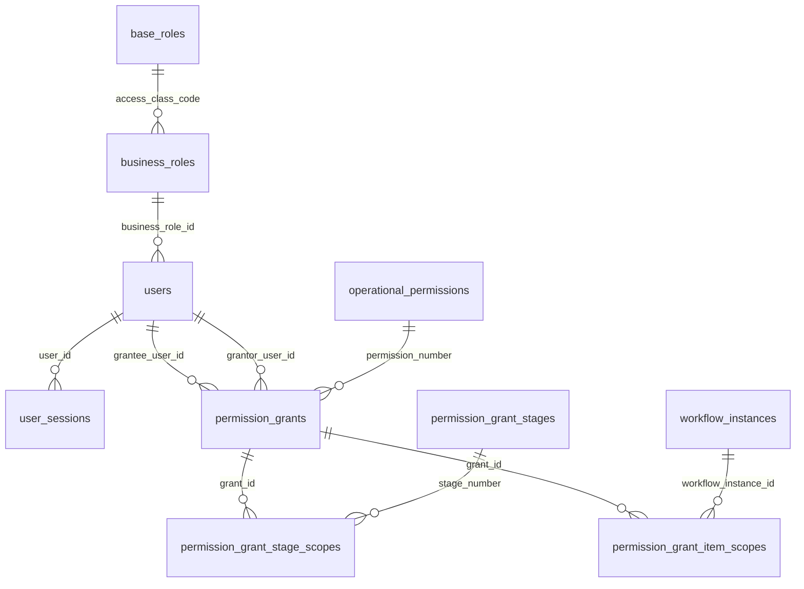
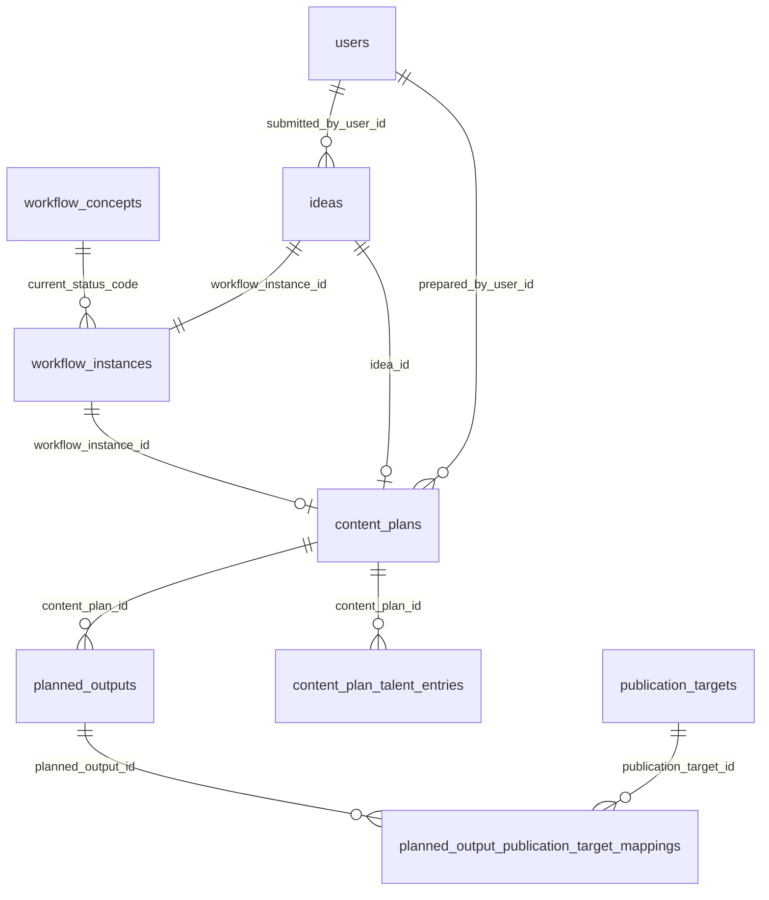
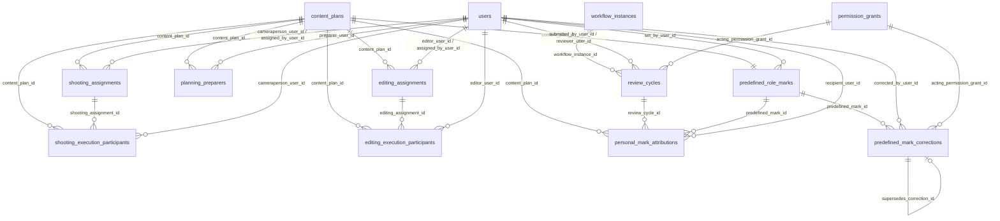
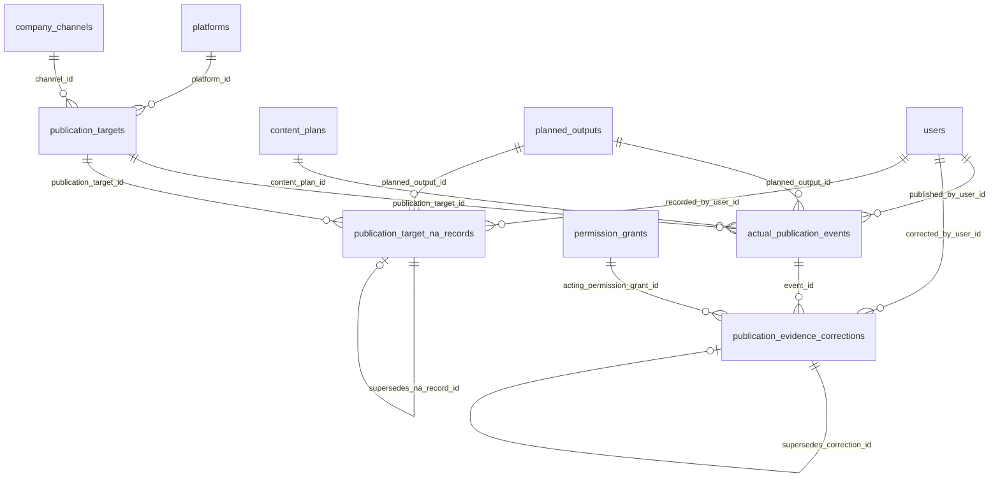
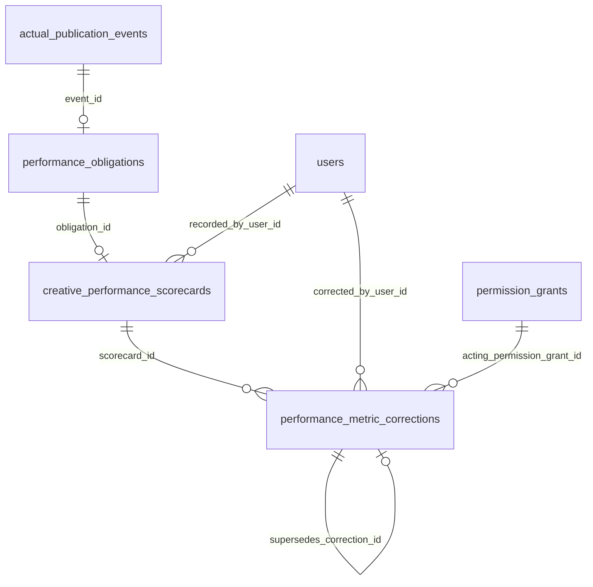

<!-- =========================================================================== -->
<!-- KCPC BANDHANI — CONTENT PRODUCTION LIFECYCLE MVP                          -->
<!-- ENTITY RELATIONSHIP DIAGRAM & PHYSICAL DATA DICTIONARY                    -->
<!-- =========================================================================== -->

---
## Document Control

| Attribute              | Detail                                                                                                                            |
| :--------------------- | :-------------------------------------------------------------------------------------------------------------------------------- |
| **Document ID**        | `KCPC-MKT-ERD-001`                                                                                                                |
| **Document Title**     | Entity Relationship Diagram & Physical Data Dictionary                                                                            |
| **Project Name**       | Content Production Lifecycle MVP                                                                                                  |
| **Client**             | KCPC Bandhani                                                                                                                     |
| **Version**            | 0.4                                                                                                                               |
| **Status**             | Draft — Initial Physical Data Model Baseline                                                                                      |
| **Classification**     | Confidential — Internal Use Only                                                                                                  |
| **Author(s)**          | Lead Principal Database Architect & Data Engineering Practice Lead                                                                |
| **Reviewed By**        | Pending Technical / Data Model Review                                                                                             |
| **Approved By**        | Pending Stakeholder / Technical Sign-Off                                                                                          |
| **Created Date**       | August 10, 2026                                                                                                                   |
| **Last Modified Date** | August 13, 2026                                                                                                                   |
| **Source Baselines**   | `KCPC-MKT-BFD-001` v1.5.0, `KCPC-MKT-BRS-001` v1.1.0, `KCPC-MKT-SRS-001` v0.3 (all unchanged by R3.5), `KCPC-MKT-SAD-001` v0.4, & `KCPC-MKT-RTM-001` v0.4 (R3.5 candidate) |

### Revision History

| Version | Date            | Author                   | Change Description                                                                                                                                                                                                                                                                                                                                                                                                                                                                                                                                                                                                                                                                                                                                                                                                                                                                                                                                                                    | Reviewed By |
| :------ | :-------------- | :----------------------- | :------------------------------------------------------------------------------------------------------------------------------------------------------------------------------------------------------------------------------------------------------------------------------------------------------------------------------------------------------------------------------------------------------------------------------------------------------------------------------------------------------------------------------------------------------------------------------------------------------------------------------------------------------------------------------------------------------------------------------------------------------------------------------------------------------------------------------------------------------------------------------------------------------------------------------------------------------------------------------------ | :---------- |
| 0.1     | August 11, 2026 | Enterprise Database Team | Three-area closure micro-pass (`ERD-TBL-001` through `ERD-TBL-042` & `ERD-VW-001`). Reconciled functional scope wording for Permissions #4, #6, and #11 in Section 18.2 distinguishing initial assignment authority from later reassignment; aligned physical traceability mappings in Section 25 for SRS-REQ-016, SRS-REQ-033, SRS-REQ-037, and SRS-REQ-050 to remove sibling decomposition overreach; reclassified `creative_performance_scorecards` as `Draft-then-Sealed — mutable while `submitted_at IS NULL`, immutable once submitted` in Sections 6 & 19; and introduced `ERD-CON-060` in Section 20 sealing submitted scorecards as historical evidence while leaving pre-submission behavior pending under `SC-REQ-002`. Constraint catalogue expanded to 60 rules (`ERD-CON-001` through `ERD-CON-060`). Completed final metadata closure pass by updating SRS-REQ-090 title in Section 25 to exact formal SRS heading and adding SRS-REQ-086 and SRS-REQ-087 to ERD-TBL-016 table-level metadata in Section 19. | Pending     |
| 0.2     | August 11, 2026 | Enterprise Database Team | Downstream baseline synchronization pass: (1) Derived from BFD v1.4.4, BRS v1.0.4, SRS v0.2, SAD v0.2, and RTM v0.2 baselines; (2) Updated Category taxonomy governance in `content_plans` (`ERD-TBL-010`) to optional manual free-text attribute (`category_text TEXT NULLABLE`) and retired `categories` (`ERD-TBL-040`); (3) Added `work_hold_records` (`ERD-TBL-043`) for In-Progress Work Hold & Resume Governance (BR-063 / BRS-REQ-084 / SRS-REQ-091) across Shoot In Progress and Edit In Progress with `ERD-CON-061` and `ERD-CON-062`. Total active tables: 42 (`ERD-TBL-001..039`, `ERD-TBL-041..043`) + 1 view (`ERD-VW-001`); total constraints: 62 (`ERD-CON-001..062`). Section 25 maps all 91 SRS requirements (`SRS-REQ-001..091`). Current-baseline references were subsequently re-synchronized to BFD v1.4.5 following the recorded SC-REQ-001/002 stakeholder scorecard decisions, which resolved the two previously-open scorecard clarifications — zero-denominator rates are recorded as N/A (excluded from averages/KPIs) and partial metrics use a DRAFT-then-submit lifecycle — thereby changing the affected scorecard capture/derivation semantics; the core role, permission, and workflow business model is unchanged. | Pending     |
| 0.2     | August 12, 2026 | Enterprise Database Team | Round-3 downstream synchronization (no data-model change): standardized Content-ID / `content_plans` allocation wording in `ERD-TBL-010` (business purpose), the `content_id` field notes, `ERD-CON-036`, and invariant #6 to "created atomically during Idea Approval as the approved Idea transitions into Planning; Content ID allocated within the same transaction" — no new table, column, or constraint. | Pending     |
| 0.3 | August 12, 2026 | Enterprise Database Team | Controlled Business Change Package **R3.4** (candidate): added **ERD-TBL-044** `business_roles` (+17-role seed) and **ERD-CON-063/064/065**; `users.base_role_code`→`business_role_id`; `content_plans` gained `planning_mode`/`urgency_reason`; ERD-CON-007 planned-output enum now PHOTOGRAPHY/REEL/VIDEO. **CANDIDATE — PENDING INDEPENDENT REVIEW; not frozen; R3.3 remains the current frozen baseline.** _Closure pass (Aug 12, 2026): applied independent-review corrections (findings 1–7) and the approved same-day-Urgent decision (new AC-086.6 / ERD-CON-066); independent review returned FAIL→corrected; pending final independent re-audit._ _Final re-audit surgical closure pass (Aug 13, 2026): closed findings 1–5 and 7 (current source-baseline metadata, current normative counts, as-built register, Business Role vs internal access class terminology, self-version footers, mechanical-audit methodology). Historical revision rows and freeze records untouched. Finding 6 (same-day Urgent approval provenance) remains OPEN — PENDING OWNER / STAKEHOLDER CONFIRMATION; the rule and its recorded provenance are unchanged. Status: R3.4 CANDIDATE — PENDING FINAL INDEPENDENT RE-AUDIT._ _Targeted traceability/governance closure pass (Aug 13, 2026) after the second independent re-audit returned FAIL: closed residual findings 1–8 and the two terminology residues (CN-009 role constraint, RTM-086/ERD §25/API-OP-018 trace edges, as-built +9→+10 ACs, 'forced −5/−2' wording, UIUX v0.2.1 R3.2→R3.3 companion governance, SAD §9.1 heading, BFD glossary). Sweep D expected-edge validation added to the audit method. Finding 6 (same-day Urgent approval provenance) remains OPEN — PENDING OWNER / STAKEHOLDER CONFIRMATION; rule and provenance untouched. Status: R3.4 CANDIDATE — PENDING RE-SUBMISSION FOR FINAL INDEPENDENT RE-AUDIT._ _Finding 6 governance closure (Aug 13, 2026): the third independent re-audit returned TECHNICAL & TRACEABILITY PASS with a governance hold; that hold is closed by CEO / Owner business decision record `KCPC-MKT-DR-R3.4-001` (same-day Urgent Shoot/Edit permitted). Provenance wording only — no requirement, AC, design element, constraint, operation, count or identifier changed. Status: R3.4 CANDIDATE — ALL FINDINGS CLOSED; PENDING FINAL FREEZE-READINESS CONFIRMATION._ | Pending |
| 0.4 | August 13, 2026 | Enterprise Database Team | Controlled Technical Architecture Change Package **R3.5** (candidate) — *Developer-Stack Technical Architecture Realignment* (`KCPC-MKT-CR-R3.5-001`). Revised **`ERD-TBL-002`** (`user_sessions`) **in place**: re-described as the authentication **token registry** backing Spring Security JWT with immediate server-side revocation, and `session_token_hash` re-documented as the SHA-256 hash of the issued token identifier (JWT `jti`). **No column, constraint, table or identifier added, removed or renumbered** — the frozen R3.4 structure already provided `session_token_hash` (UNIQUE), `expires_at`, `is_revoked` and the `user_id` foreign key, so no new ERD table was required for JWT revocation. PostgreSQL 16+ **retained** (no MySQL conversion); `JSONB`, CHECK constraints, append-only audit privileges, indexes and all business tables **unchanged**; Hibernate/JPA is an access-layer realization and does not alter the physical model. Active tables remain **43**, constraints remain **66**. **No business change.** **CANDIDATE — NOT FROZEN; R3.4 remains the frozen implementation baseline.** | Pending |

### Distribution List

| Role / Stakeholder                | Organization / Practice   | Purpose                                      |
| :-------------------------------- | :------------------------ | :------------------------------------------- |
| CEO / Owner                       | KCPC Bandhani             | Executive Sign-Off & Governance Approval     |
| Marketing Manager                 | KCPC Bandhani             | Business Validation & Operational Acceptance |
| Enterprise Solutions Team         | Advisory Practice         | Requirements Engineering & Baseline Control  |
| Solution Architecture & Tech Lead | Engineering Delivery Team | Technical Architecture & DDL Enforcement     |
| Data & Software Engineers         | Implementation Practice   | Physical Database Schema Implementation      |
| QA & Testing Lead                 | Quality Engineering Team  | Data Integrity Verification & Test Suite     |

---

## Table of Contents

- [1. Document Control](#document-control)
- [2. Purpose, Scope & Governance](#2-purpose-scope--governance)
- [3. Source Baseline & Data-Model Traceability](#3-source-baseline--data-model-traceability)
- [4. Physical Data Modeling Principles](#4-physical-data-modeling-principles)
- [5. Naming, Identifier & Timestamp Standards](#5-naming-identifier--timestamp-standards)
- [6. Domain / Table Inventory](#6-domain--table-inventory)
- [7. Full Physical Entity Relationship Diagram (ERD)](#7-full-physical-entity-relationship-diagram-erd)
  - [7.1 High-Level Master Entity Relationship Diagram](#71-high-level-master-entity-relationship-diagram)
  - [7.2 Compact Domain ERD — Identity & Permissions](#72-compact-domain-erd--identity--permissions)
  - [7.3 Compact Domain ERD — Idea, Workflow & Planning](#73-compact-domain-erd--idea-workflow--planning)
  - [7.4 Compact Domain ERD — Production, Provenance, Review & Marks](#74-compact-domain-erd--production-provenance-review--marks)
  - [7.5 Compact Domain ERD — Publishing, Target N/A & Evidence Corrections](#75-compact-domain-erd--publishing-target-na--evidence-corrections)
  - [7.6 Compact Domain ERD — Performance, Scorecards & Metric Corrections](#76-compact-domain-erd--performance-scorecards--metric-corrections)
  - [7.7 Compact Domain ERD — Administrative History & Audit](#77-compact-domain-erd--administrative-history--audit)
- [8. Identity, Authentication & Permission Schema](#8-identity-authentication--permission-schema)
- [9. Idea & Workflow Schema](#9-idea--workflow-schema)
- [10. Planning & Content Identity Schema](#10-planning--content-identity-schema)
- [11. Shooting, Editing, Assignment & Review Schema](#11-shooting-editing-assignment--review-schema)
- [12. Marks Governance & Attribution Schema](#12-marks-governance--attribution-schema)
- [13. Publishing Master Data & Publication Event Schema](#13-publishing-master-data--publication-event-schema)
- [14. Performance & Scorecard Schema](#14-performance--scorecard-schema)
- [15. Administrative Action & Lifecycle History Schema](#15-administrative-action--lifecycle-history-schema)
- [16. Audit & Correction / Supersession Schema](#16-audit--correction--supersession-schema)
- [17. KPI / Reporting Data Support](#17-kpi--reporting-data-support)
- [18. Reference Data & Seed Catalogue](#18-reference-data--seed-catalogue)
- [19. Complete Physical Data Dictionary](#19-complete-physical-data-dictionary)
- [20. Constraint & Integrity Catalogue](#20-constraint--integrity-catalogue)
- [21. Indexing Strategy](#21-indexing-strategy)
- [22. Data Retention, Deactivation & Deletion Rules](#22-data-retention-deactivation--deletion-rules)
- [23. Export & Business OS Migration Considerations](#23-export--business-os-migration-considerations)
- [24. Resolved Business Clarification Data Boundaries](#24-resolved-business-clarification-data-boundaries)
- [25. SRS / SAD → ERD Traceability Matrix](#25-srs--sad--erd-traceability-matrix)
- [26. Downstream API / UI / Test Handoff](#26-downstream-api--ui--test-handoff)
- [27. Risks & Physical Design Trade-Offs](#27-risks--physical-design-trade-offs)
- [28. Change Control](#28-change-control)
- [29. Final Physical Data Model Validation Checklist](#29-final-physical-data-model-validation-checklist)

---

## 2. Purpose, Scope & Governance

### 2.1 Purpose of the Physical Data Model
This document establishes the authoritative **Physical Relational Data Model and Physical Data Dictionary** (`KCPC-MKT-ERD-001` v0.4, R3.5 candidate) for the **KCPC Bandhani Content Production Lifecycle MVP**. It translates the business foundation rules in BFD v1.5.0 (`KCPC-MKT-BFD-001`), the engineering requirements in BRS v1.1.0 (`KCPC-MKT-BRS-001`), the software specifications in SRS v0.3 (`KCPC-MKT-SRS-001`), the modular monolith architecture in SAD v0.4 (`KCPC-MKT-SAD-001`), and the traceability baseline in RTM v0.4 (`KCPC-MKT-RTM-001`) into an explicit PostgreSQL 16+ relational schema.

### 2.2 Document Hierarchy & Precedence
$$\text{BFD v1.5.0} \succ \text{BRS v1.1.0} \succ \text{RTM v0.4} \succ \text{SRS v0.3} \succ \text{SAD v0.4} \succ \mathbf{\text{ERD v0.4}} \succ \text{API / UI / Test Specs} \succ \text{Implementation Code}$$

If any conflict arises between physical data structures and higher baseline documents, the higher document governs. Discrepancies shall be logged in formal change control and resolved upstream.

---

## 3. Source Baseline & Data-Model Traceability

The physical database model strictly respects all established upstream baselines:
1. **Target RDBMS:** PostgreSQL 16+ Relational Database Management System (`SAD-ADR-002`).
2. **Architecture Baseline:** Single-instance Modular Monolith backend application (`SAD-ADR-009`).
3. **Core Invariants Preserved:**
   - **3 Internal Access Classes:** `CEO_OWNER`, `MARKETING_MANAGER`, `EMPLOYEE` — authorization/security classes persisted in `base_roles` (`ERD-TBL-003`); no fourth access class.
   - **Business Role Catalogue (introduced in R3.4):** Expandable organizational designations in `business_roles` (`ERD-TBL-044`), seeded with 17 roles; `users.business_role_id` gives each user exactly one Business Role, which resolves to exactly one access class via `business_roles.access_class_code` (`ERD-CON-063`). A Business Role name never grants an Operational Permission.
   - **17 Operational Permissions:** Explicitly catalogued (#1 through #17) with active validity ranges and scopes.
   - **22 Workflow Concepts:** 17 Active, 1 Dormant, 2 Terminal, 1 Closed/Reopenable, and 1 Supplementary Flag (`DLY`). Primary status in `workflow_instances` cannot be set to `DLY`.
   - **Single Content Identity:** One Approved Idea $\rightarrow$ One Content ID (`C-MMYY-NNNN`) $\rightarrow$ 1..N Planned Outputs $\rightarrow$ One Shared Workflow Instance. Sequence allocated at Idea Approval as the approved Idea enters Planning, in IST.
   - **Predefined Marks Model:** Fixed set `[0, 0.5, 1.0, 2.0, 3.0]` captured at Idea Approval; full mark awarded to qualifying Cameraperson/Editor at review approval; no personal mark attributions on Request Rework, Publishing, or Reposts (`record absence != numeric 0`).
   - **Delegated Self-Approval Barrier:** Server-enforced queryable provenance checking historical submitter/preparer/executor identity for delegated Employee review authority only (`CEO_OWNER` and `MARKETING_MANAGER` access classes exercise direct authority and are not subject to employee delegated self-approval guards).
   - **Master Publishing Catalogue:** Configurable `Platform` $\leftrightarrow$ `Company Channel/Account` association creating governed `PublicationTarget` entities.
   - **Performance Obligations:** `Actual Publication Date + 2 Calendar Days` (non-reschedulable).

---

## 4. Physical Data Modeling Principles

1. **Third Normal Form (3NF) Default:** All operational tables are modeled in 3NF to eliminate redundancy, ensure referential integrity, and enforce strict ACID transactions.
2. **Surrogate Primary Keys:** Operational entity tables use `UUID` primary keys (`SAD-ADR-002`) generated by backend application runtimes (UUIDv7 sequential locality); fixed reference catalogues use stable governed natural/code keys (`VARCHAR` / `INTEGER`).
3. **Business Identifiers:** Human-readable business keys (e.g., Idea ID `IDEA-YYYYMMDD-NNNN`, Content ID `C-MMYY-NNNN`) are stored as unique index-backed columns separate from surrogate UUID PKs.
4. **Immutable Audit & Event Ledgers:** Audit logs, review cycle decisions, actual publication events, corrections, reschedules, reassignments, cancellations, reopenings, and attribution records are append-only. History is never overwritten.
5. **Soft Deactivation over Hard Deletion:** Master data and user accounts use `is_active` / `deactivated_at` flags. Foreign keys enforce `ON DELETE RESTRICT` to preserve historical integrity.
6. **Developer-Independent Integrity:** Integrity rules are built into PostgreSQL constraints (PK, FK, UNIQUE, CHECK, NOT NULL) and database triggers rather than relying exclusively on application ORMs.

---

## 5. Naming, Identifier & Timestamp Standards

1. **Table Naming:** Lowercase `snake_case` plural nouns (e.g., `users`, `ideas`, `content_plans`, `planned_outputs`).
2. **Column Naming:** Lowercase `snake_case` (e.g., `user_id`, `created_at`, `is_active`).
3. **Primary Key Naming:** `<singular_table_name>_id` of type `UUID` for operational tables, or code/number for reference catalogues.
4. **Foreign Key Naming:** `<referenced_entity>_id` matching the target PK name.
5. **Timestamp Standard:**
   - **System/Audit Events:** `TIMESTAMPTZ` stored in UTC (e.g., `created_at`, `submitted_at`, `recorded_at`).
   - **Business Calendar Dates:** `DATE` using `Asia/Kolkata` (IST) business calendar (e.g., `planned_live_date`, `planned_shoot_date`, `planned_edit_date`, `performance_due_date`).

---

## 6. Domain / Table Inventory

The physical data model comprises **43 active primary tables** (`ERD-TBL-001` through `ERD-TBL-039`, `ERD-TBL-041` through `ERD-TBL-044`), **1 retired table identifier** (`ERD-TBL-040`), and **1 reporting view** (`ERD-VW-001`) grouped into functional schema domains (R3.4 adds `business_roles` / `ERD-TBL-044`):

| Table / View ID | Name                                         | Schema Domain          | Owning SAD Component           | Primary Business Function                                                                                                | Mutability Class                            |
| :-------------- | :------------------------------------------- | :--------------------- | :----------------------------- | :----------------------------------------------------------------------------------------------------------------------- | :------------------------------------------ |
| **ERD-TBL-001** | `users`                                      | Identity & Access      | `SAD-COMP-001`                 | Base user accounts, authentication credentials, and status                                                               | Mutable Current-State                       |
| **ERD-TBL-002** | `user_sessions`                              | Identity & Access      | `SAD-COMP-001`                 | Authentication token registry (JWT `jti` hashes) with revocation (`SAD-ADR-001`)                                                                | Ephemeral Security Data                     |
| **ERD-TBL-003** | `base_roles`                                 | Identity & Access      | `SAD-COMP-001`                 | Lookup catalogue for the 3 internal access classes (security classes)                                                    | Fixed Reference Data                        |
| **ERD-TBL-044** | `business_roles`                             | Identity & Access      | `SAD-COMP-001`                 | Expandable organizational Business Role (designation) master; each resolves to one access class                          | Mutable Current-State (controlled admin)    |
| **ERD-TBL-004** | `operational_permissions`                    | Identity & Access      | `SAD-COMP-001`                 | Lookup catalogue for 17 operational permissions                                                                          | Fixed Reference Data                        |
| **ERD-TBL-005** | `permission_grants`                          | Identity & Access      | `SAD-COMP-001`                 | CEO-granted operational permissions with active scope/validity                                                           | Mutable Current-State                       |
| **ERD-TBL-006** | `workflow_concepts`                          | Workflow & State       | `SAD-COMP-008`                 | Catalogue of 22 formal workflow concepts and primary status metadata                                                     | Fixed Reference Data                        |
| **ERD-TBL-007** | `workflow_instances`                         | Workflow & State       | `SAD-COMP-008`                 | Single shared workflow instance per deliverable (`first_completed_at` guard)                                             | Mutable Current-State                       |
| **ERD-TBL-008** | `workflow_transition_history`                | Workflow & State       | `SAD-COMP-008`                 | Immutable log of all system-generated lifecycle status transitions                                                       | Append-Only Event                           |
| **ERD-TBL-009** | `ideas`                                      | Idea Management        | `SAD-COMP-002`                 | Submitted content ideas (`IDEA-YYYYMMDD-NNNN`)                                                                           | Mutable Current-State                       |
| **ERD-TBL-010** | `content_plans`                              | Content Planning       | `SAD-COMP-003`                 | Stage 3 Planning baseline and Content ID (`C-MMYY-NNNN`) governance                                                      | Mutable Current-State                       |
| **ERD-TBL-011** | `planned_outputs`                            | Content Planning       | `SAD-COMP-003`                 | Multi-asset Planned Outputs (Photography, Reel, Video)                                                              | Mutable Current-State                       |
| **ERD-TBL-012** | `predefined_role_marks`                      | Marks Governance       | `SAD-COMP-005`                 | Predefined Cameraperson & Editor role Marks set at Idea Approval                                                         | Mutable Current-State                       |
| **ERD-TBL-013** | `shooting_assignments`                       | Production Execution   | `SAD-COMP-004`                 | Cameraperson shooting assignment episodes                                                                                | Mutable Current-State                       |
| **ERD-TBL-014** | `editing_assignments`                        | Production Execution   | `SAD-COMP-004`                 | Post-Shoot Approval Editor assignment episodes                                                                           | Mutable Current-State                       |
| **ERD-TBL-015** | `review_cycles`                              | Production Execution   | `SAD-COMP-002`..`004`          | Review submission & decision records (`Mutable While Pending / Immutable Once Decided`)                                  | Mutable While Pending                       |
| **ERD-TBL-016** | `personal_mark_attributions`                 | Marks Governance       | `SAD-COMP-005`                 | Qualifying contributor personal Mark attribution ledger                                                                  | Append-Only Ledger                          |
| **ERD-TBL-017** | `platforms`                                  | Publishing Master Data | `SAD-COMP-010`                 | Governed Platform master data catalogue (6 seeds)                                                                        | Controlled Master Data                      |
| **ERD-TBL-018** | `company_channels`                           | Publishing Master Data | `SAD-COMP-010`                 | Governed Company Channel / Account master data catalogue (8 seeds)                                                       | Controlled Master Data                      |
| **ERD-TBL-019** | `publication_targets`                        | Publishing Master Data | `SAD-COMP-010`                 | Active Platform $\leftrightarrow$ Company Channel association targets                                                    | Controlled Master Data                      |
| **ERD-TBL-020** | `planned_output_publication_target_mappings` | Content Planning       | `SAD-COMP-003`                 | Intended publication target scope mapping per Planned Output                                                             | Mutable Current-State                       |
| **ERD-TBL-021** | `actual_publication_events`                  | Publishing Execution   | `SAD-COMP-006`                 | Discrete actual publication event records (`Original` / `Repost`)                                                        | Append-Only Event                           |
| **ERD-TBL-022** | `publication_target_na_records`              | Publishing Execution   | `SAD-COMP-006`                 | Publication Target N/A exception records & supersession history                                                          | Append-Only History                         |
| **ERD-TBL-023** | `performance_obligations`                    | Performance Tracking   | `SAD-COMP-007`                 | Event-level performance obligations and D+2 due date tracking                                                            | Mutable Current-State                       |
| **ERD-TBL-024** | `creative_performance_scorecards`            | Performance Tracking   | `SAD-COMP-007`                 | Raw scorecard metrics and rate computation snapshot                                                                      | Submission-Bound — Immutable Once Submitted |
| **ERD-TBL-025** | `system_audit_log`                           | System Audit           | `SAD-COMP-010`                 | System-wide immutable append-only audit log                                                                              | Append-Only Ledger                          |
| **ERD-TBL-026** | `predefined_mark_corrections`                | Marks Governance       | `SAD-COMP-005`                 | Append-Only Predefined Role Mark correction history under Perm #1                                                        | Append-Only History                         |
| **ERD-TBL-027** | `publication_evidence_corrections`           | Publishing Execution   | `SAD-COMP-006`                 | Append-Only Publication Evidence URL correction history under Perm #8                                                    | Append-Only History                         |
| **ERD-TBL-028** | `performance_metric_corrections`             | Performance Tracking   | `SAD-COMP-007`                 | Append-Only Performance Metric correction history under Perm #9                                                          | Append-Only History                         |
| **ERD-TBL-029** | `reschedule_records`                         | Administrative History | `SAD-COMP-008`                 | Structured operational reschedule history under Perm #10                                                                 | Append-Only History                         |
| **ERD-TBL-030** | `reassignment_records`                       | Administrative History | `SAD-COMP-008`                 | Structured operational reassignment history header under Perm #11                                                        | Append-Only History                         |
| **ERD-TBL-031** | `reassignment_assignees`                     | Administrative History | `SAD-COMP-008`                 | Reassignment prior and replacement assignee details                                                                      | Append-Only History                         |
| **ERD-TBL-032** | `cancellation_records`                       | Administrative History | `SAD-COMP-008`                 | Structured operational cancellation history under Perm #12                                                               | Append-Only History                         |
| **ERD-TBL-033** | `reopen_records`                             | Administrative History | `SAD-COMP-008`                 | Structured operational reopen history under Perm #1 / #8 / #9                                                            | Append-Only History                         |
| **ERD-TBL-034** | `permission_grant_stage_scopes`              | Identity & Access      | `SAD-COMP-001`                 | Stage scope mappings for STAGE_RESTRICTED permission grants                                                              | Mutable Current-State                       |
| **ERD-TBL-035** | `permission_grant_item_scopes`               | Identity & Access      | `SAD-COMP-001`                 | Item scope mappings for ITEM_SPECIFIC permission grants                                                                  | Mutable Current-State                       |
| **ERD-TBL-036** | `permission_grant_stages`                    | Identity & Access      | `SAD-COMP-001`                 | Lookup catalogue for 7 governed lifecycle stages                                                                         | Fixed Reference Data                        |
| **ERD-TBL-037** | `planning_preparers`                         | Production Provenance  | `SAD-COMP-001`, `SAD-COMP-003` | Queryable Planning preparation participation provenance                                                                  | Append-Only History                         |
| **ERD-TBL-038** | `shooting_execution_participants`            | Production Provenance  | `SAD-COMP-004`                 | Queryable actual recorded Cameraperson shoot participants                                                                | Append-Only History                         |
| **ERD-TBL-039** | `editing_execution_participants`             | Production Provenance  | `SAD-COMP-004`                 | Queryable actual recorded Editor edit participants                                                                       | Append-Only History                         |
| **ERD-TBL-040** | `categories` (Retired)                       | Content Planning       | `SAD-COMP-003`                 | RETIRED / RESERVED IDENTIFIER — Obsolete under optional free-text category model; retained solely as reserved identifier | Retired Reference Data                      |
| **ERD-TBL-041** | `content_plan_talent_entries`                | Content Planning       | `SAD-COMP-003`                 | Multi-selection Models / Talent entries per Content Plan                                                                 | Mutable Current-State                       |
| **ERD-TBL-042** | `content_id_sequences`                       | Content Planning       | `SAD-COMP-003`                 | Concurrency-safe monthly sequence allocation table (`C-MMYY-NNNN`)                                                       | Mutable Current-State                       |
| **ERD-TBL-043** | `work_hold_records`                          | Administrative History | `SAD-COMP-008`                 | In-progress work hold and resume cycle history in Shoot In Progress and Editing (BR-063 / SRS-REQ-091)          | Append-Only History with Controlled Resume Mutation |
| **ERD-VW-001**  | `active_deliverable_delay_views`             | Reporting Projections  | `SAD-COMP-008`, `SAD-COMP-009` | Dynamic reporting projection computing Delayed deliverables                                                              | Derived View / Projection                   |

---

## 7. Full Physical Entity Relationship Diagram (ERD)

### 7.1 High-Level Master Entity Relationship Diagram

```mermaid
erDiagram
    users ||--o{ user_sessions : "has sessions"
    business_roles ||--o{ users : "assigned Business Role"
    base_roles ||--o{ business_roles : "resolves to access class"
    users ||--o{ permission_grants : "granted to / by"
    operational_permissions ||--o{ permission_grants : "defines permission"
    permission_grants ||--o{ permission_grant_stage_scopes : "has stage scope"
    permission_grants ||--o{ permission_grant_item_scopes : "has item scope"
    permission_grant_stages ||--o{ permission_grant_stage_scopes : "references stage"

    ideas ||--|| workflow_instances : "binds workflow"
    users ||--o{ ideas : "submits"
    ideas ||--o| content_plans : "progresses to"
    
    workflow_concepts ||--o{ workflow_instances : "current status"
    workflow_instances ||--o{ workflow_transition_history : "records transitions"
    workflow_instances ||--o{ review_cycles : "evaluates through gates"

    workflow_instances ||--o{ work_hold_records : "placed on hold"
    users ||--o{ work_hold_records : "held or resumed by"
    workflow_concepts ||--o{ work_hold_records : "held status"
    content_plans ||--o{ planned_outputs : "contains outputs"
    content_plans ||--o{ content_plan_talent_entries : "has talent"
    content_plans ||--|| predefined_role_marks : "establishes marks"
    content_plans ||--o{ shooting_assignments : "assigns camerapersons"
    content_plans ||--o{ editing_assignments : "assigns editors"
    content_plans ||--o{ planning_preparers : "prepared by"
    content_plans ||--o{ shooting_execution_participants : "participated in shoot"
    content_plans ||--o{ editing_execution_participants : "participated in edit"
    content_plans ||--o{ personal_mark_attributions : "attaches personal mark"
    
    planned_outputs ||--o{ planned_output_publication_target_mappings : "maps target scope"
    publication_targets ||--o{ planned_output_publication_target_mappings : "target destination"

    platforms ||--o{ publication_targets : "platform association"
    company_channels ||--o{ publication_targets : "channel association"

    review_cycles ||--o{ personal_mark_attributions : "awards marks on approval"
    predefined_role_marks ||--o{ personal_mark_attributions : "references predefined mark"
    predefined_role_marks ||--o{ predefined_mark_corrections : "has mark correction"

    shooting_assignments ||--o{ shooting_execution_participants : "records participant"
    editing_assignments ||--o{ editing_execution_participants : "records participant"

    planned_outputs ||--o{ actual_publication_events : "publishes output"
    publication_targets ||--o{ actual_publication_events : "publishes to target"
    content_plans ||--o{ actual_publication_events : "direct plan link"
    actual_publication_events ||--o{ publication_evidence_corrections : "has evidence correction"

    actual_publication_events ||--o| performance_obligations : "generates obligation"
    performance_obligations ||--o| creative_performance_scorecards : "records scorecard"
    creative_performance_scorecards ||--o{ performance_metric_corrections : "has metric correction"

    planned_outputs ||--o{ publication_target_na_records : "records target NA"
    publication_targets ||--o{ publication_target_na_records : "target NA scope"

    workflow_instances ||--o{ reschedule_records : "has reschedule"
    workflow_instances ||--o{ reassignment_records : "has reassignment"
    reassignment_records ||--o{ reassignment_assignees : "reassignee details"
    workflow_instances ||--o| cancellation_records : "has cancellation"
    workflow_instances ||--o{ reopen_records : "has reopen"

    users ||--o{ system_audit_log : "performs audit action"
```

### 7.2 Compact Domain ERD — Identity & Permissions

### 7.3 Compact Domain ERD — Idea, Workflow & Planning

### 7.4 Compact Domain ERD — Production, Provenance, Review & Marks

### 7.5 Compact Domain ERD — Publishing, Target N/A & Evidence Corrections

### 7.6 Compact Domain ERD — Performance, Scorecards & Metric Corrections

### 7.7 Compact Domain ERD — Administrative History & Audit

```mermaid
erDiagram
    workflow_instances ||--o{ workflow_transition_history : "workflow_instance_id"
    workflow_concepts ||--o{ workflow_transition_history : "from_status_code / to_status_code"
    users ||--o{ workflow_transition_history : "triggered_by_user_id"
    permission_grants ||--o{ workflow_transition_history : "acting_permission_grant_id"
    workflow_instances ||--o{ reschedule_records : "workflow_instance_id"
    users ||--o{ reschedule_records : "rescheduled_by_user_id"
    permission_grants ||--o{ reschedule_records : "acting_permission_grant_id"
    workflow_instances ||--o{ reassignment_records : "workflow_instance_id"
    users ||--o{ reassignment_records : "reassigned_by_user_id"
    permission_grants ||--o{ reassignment_records : "acting_permission_grant_id"
    reassignment_records ||--o{ reassignment_assignees : "reassignment_id"
    users ||--o{ reassignment_assignees : "user_id"
    workflow_instances ||--o| cancellation_records : "workflow_instance_id"
    users ||--o{ cancellation_records : "cancelled_by_user_id"
    permission_grants ||--o{ cancellation_records : "acting_permission_grant_id"
    workflow_instances ||--o{ reopen_records : "workflow_instance_id"
    workflow_concepts ||--o{ reopen_records : "from_status_code / to_status_code"
    users ||--o{ reopen_records : "reopened_by_user_id"
    permission_grants ||--o{ reopen_records : "acting_permission_grant_id"
    workflow_instances ||--o{ work_hold_records : "workflow_instance_id"
    workflow_concepts ||--o{ work_hold_records : "held_status_code"
    users ||--o{ work_hold_records : "held_by_user_id / resumed_by_user_id"
    users ||--o{ system_audit_log : "actor_user_id"
    permission_grants ||--o{ system_audit_log : "acting_permission_grant_id"
```

---

## 8. Identity, Authentication & Permission Schema

#### `users` (`ERD-TBL-001`)
Stores base user accounts, authentication credentials, and status.
- `user_id` (`UUID`, PK)
- `full_name` (`VARCHAR(100)`, NOT NULL)
- `email` (`VARCHAR(255)`, UNIQUE, NOT NULL)
- `password_hash` (`VARCHAR(255)`, NOT NULL) — Secure approved password-hash output; exact algorithm is implementation detail
- `business_role_id` (`UUID`, FK -> `business_roles.business_role_id`, NOT NULL) — user's one current Business Role (R3.4); the internal access class used for authorization is resolved as `business_roles.access_class_code` (`ERD-TBL-044`). Replaces the former `base_role_code` column.
- `is_active` (`BOOLEAN`, DEFAULT `TRUE`, NOT NULL)
- `deactivated_at` (`TIMESTAMPTZ`, NULLABLE)
- `created_at` (`TIMESTAMPTZ`, DEFAULT `CURRENT_TIMESTAMP`, NOT NULL)
- `updated_at` (`TIMESTAMPTZ`, DEFAULT `CURRENT_TIMESTAMP`, NOT NULL)

#### `user_sessions` (`ERD-TBL-002`)
Authentication **token registry** supporting immediate server-side revocation (`SAD-ADR-001`). Under R3.5 this table backs Spring Security JWT authentication: the JWT is deliberately **stateful**, and every authenticated request revalidates its identifier against this registry and the owning account's active status, so that logout and CEO account deactivation take effect immediately (`SRS-REQ-003`, `SRS-REQ-005`, `AC-003.1`, `AC-003.2`). **Structure is unchanged from R3.4** — only the description and the semantics of `session_token_hash` are revised; no column, constraint or identifier is added.
- `session_id` (`UUID`, PK) — registry entry identifier
- `user_id` (`UUID`, FK -> `users.user_id`, NOT NULL)
- `session_token_hash` (`VARCHAR(64)`, UNIQUE, NOT NULL) — SHA-256 hash of the issued token identifier (JWT `jti`); the raw token is never persisted
- `ip_address` (`INET`, NULLABLE)
- `user_agent` (`TEXT`, NULLABLE)
- `created_at` (`TIMESTAMPTZ`, DEFAULT `CURRENT_TIMESTAMP`, NOT NULL)
- `expires_at` (`TIMESTAMPTZ`, NOT NULL)
- `is_revoked` (`BOOLEAN`, DEFAULT `FALSE`, NOT NULL)

#### `base_roles` (`ERD-TBL-003`)
Lookup catalogue for the 3 internal access classes (`CEO_OWNER`, `MARKETING_MANAGER`, `EMPLOYEE`); the user-facing expandable Business Role catalogue is `business_roles` (`ERD-TBL-044`).
- `role_code` (`VARCHAR(30)`, PK) — `CEO_OWNER`, `MARKETING_MANAGER`, `EMPLOYEE`
- `role_name` (`VARCHAR(50)`, NOT NULL)
- `description` (`TEXT`, NOT NULL)

#### `business_roles` (`ERD-TBL-044`) — R3.4
Expandable organizational Business Role (designation) master; each user references exactly one Business Role (`users.business_role_id`), and each Business Role resolves to exactly one internal access class. Seeds 17 designations; ordinary/new roles default to `EMPLOYEE`. A Business Role name never grants a permission.
- `business_role_id` (`UUID`, PK)
- `role_name` (`VARCHAR(100)`, UNIQUE, NOT NULL) — organizational designation (e.g. `Camera Person`, `Video Editor`, `Publisher`)
- `access_class_code` (`VARCHAR(30)`, FK -> `base_roles.role_code`, NOT NULL) — resolves to one access class (`ERD-CON-063`); ordinary roles default to `EMPLOYEE`
- `is_active` (`BOOLEAN`, DEFAULT `TRUE`, NOT NULL)
- `created_at` (`TIMESTAMPTZ`, DEFAULT `CURRENT_TIMESTAMP`, NOT NULL)
- `updated_at` (`TIMESTAMPTZ`, DEFAULT `CURRENT_TIMESTAMP`, NOT NULL)

#### `operational_permissions` (`ERD-TBL-004`)
Lookup catalogue for the 17 CEO-granted operational permissions.
- `permission_number` (`INTEGER`, PK) — 1 through 17
- `permission_code` (`VARCHAR(50)`, UNIQUE, NOT NULL) — e.g., `PERM_01_IDEA_REVIEW`, `PERM_10_RESCHEDULE`
- `permission_name` (`VARCHAR(100)`, NOT NULL)
- `description` (`TEXT`, NOT NULL)

#### `permission_grants` (`ERD-TBL-005`)
CEO-granted permission assignments with active temporal validity and scope bounds.
- `grant_id` (`UUID`, PK)
- `grantee_user_id` (`UUID`, FK -> `users.user_id`, NOT NULL)
- `grantor_user_id` (`UUID`, FK -> `users.user_id`, NOT NULL)
- `permission_number` (`INTEGER`, FK -> `operational_permissions.permission_number`, NOT NULL)
- `scope_type` (`VARCHAR(20)`, NOT NULL) — `GLOBAL`, `STAGE_RESTRICTED`, `ITEM_SPECIFIC`
- `effective_from` (`TIMESTAMPTZ`, DEFAULT `CURRENT_TIMESTAMP`, NOT NULL)
- `effective_until` (`TIMESTAMPTZ`, NULLABLE)
- `is_active` (`BOOLEAN`, DEFAULT `TRUE`, NOT NULL)
- `revoked_at` (`TIMESTAMPTZ`, NULLABLE)
- `created_at` (`TIMESTAMPTZ`, DEFAULT `CURRENT_TIMESTAMP`, NOT NULL)

#### `permission_grant_stage_scopes` (`ERD-TBL-034`)
Stage scope mappings for `STAGE_RESTRICTED` permission grants.
- `scope_id` (`UUID`, PK)
- `grant_id` (`UUID`, FK -> `permission_grants.grant_id`, NOT NULL)
- `stage_number` (`INTEGER`, FK -> `permission_grant_stages.stage_number`, NOT NULL)

#### `permission_grant_item_scopes` (`ERD-TBL-035`)
Item scope mappings for `ITEM_SPECIFIC` permission grants.
- `scope_id` (`UUID`, PK)
- `grant_id` (`UUID`, FK -> `permission_grants.grant_id`, NOT NULL)
- `workflow_instance_id` (`UUID`, FK -> `workflow_instances.workflow_instance_id`, NOT NULL)

#### `permission_grant_stages` (`ERD-TBL-036`)
Lookup catalogue for the 7 governed lifecycle stages.
- `stage_number` (`INTEGER`, PK) — 1 through 7
- `stage_code` (`VARCHAR(30)`, UNIQUE, NOT NULL) — `IDEA_MANAGEMENT`, `IDEA_REVIEW`, `PLANNING_PARAMETERS`, `SHOOTING_PRODUCTION`, `EDITING_POST_PRODUCTION`, `MULTI_CHANNEL_PUBLISHING`, `PERFORMANCE_COMPLETION`
- `stage_name` (`VARCHAR(100)`, NOT NULL)

---

## 9. Idea & Workflow Schema

#### `workflow_concepts` (`ERD-TBL-006`)
Catalogue of all 22 workflow concepts.
- `status_code` (`VARCHAR(10)`, PK) — e.g., `IS`, `PA`, `PL`, `COMP`, `DLY`, `CAN`
- `concept_number` (`INTEGER`, UNIQUE, NOT NULL) — 1 through 22
- `status_name` (`VARCHAR(50)`, NOT NULL)
- `classification` (`VARCHAR(30)`, NOT NULL) — `ACTIVE`, `DORMANT`, `TERMINAL`, `CLOSED`, `SUPPLEMENTARY_FLAG`
- `is_primary_status` (`BOOLEAN`, NOT NULL) — `FALSE` for `DLY` (`Delayed`)

#### `workflow_instances` (`ERD-TBL-007`)
Single shared lifecycle workflow instance for each deliverable (`SAD-DES-031`).
- `workflow_instance_id` (`UUID`, PK)
- `current_status_code` (`VARCHAR(10)`, FK -> `workflow_concepts.status_code`, NOT NULL)
- `first_completed_at` (`TIMESTAMPTZ`, NULLABLE) — Permanent post-completion cancellation guard (`SAD-DES-027`); once non-null, immutable
- `created_at` (`TIMESTAMPTZ`, DEFAULT `CURRENT_TIMESTAMP`, NOT NULL)
- `updated_at` (`TIMESTAMPTZ`, DEFAULT `CURRENT_TIMESTAMP`, NOT NULL)

#### `workflow_transition_history` (`ERD-TBL-008`)
System-generated transition log enforcing manual edit prohibitions (`SRS-REQ-083`).
- `transition_id` (`UUID`, PK)
- `workflow_instance_id` (`UUID`, FK -> `workflow_instances.workflow_instance_id`, NOT NULL)
- `from_status_code` (`VARCHAR(10)`, FK -> `workflow_concepts.status_code`, NOT NULL)
- `to_status_code` (`VARCHAR(10)`, FK -> `workflow_concepts.status_code`, NOT NULL)
- `triggered_by_user_id` (`UUID`, FK -> `users.user_id`, NOT NULL)
- `acting_permission_grant_id` (`UUID`, FK -> `permission_grants.grant_id`, NULLABLE)
- `trigger_command` (`VARCHAR(100)`, NOT NULL)
- `transition_reason` (`TEXT`, NULLABLE)
- `transition_timestamp` (`TIMESTAMPTZ`, DEFAULT `CURRENT_TIMESTAMP`, NOT NULL)

#### `ideas` (`ERD-TBL-009`)
Idea submission records (`IDEA-YYYYMMDD-NNNN`).
- `idea_id` (`UUID`, PK)
- `workflow_instance_id` (`UUID`, FK -> `workflow_instances.workflow_instance_id`, UNIQUE, NOT NULL)
- `business_idea_code` (`VARCHAR(30)`, UNIQUE, NOT NULL) — `IDEA-YYYYMMDD-NNNN`
- `title` (`VARCHAR(200)`, NOT NULL)
- `reference_link` (`TEXT`, NULLABLE)
- `notes_remarks` (`TEXT`, NULLABLE)
- `submitted_by_user_id` (`UUID`, FK -> `users.user_id`, NOT NULL)
- `submitted_at` (`TIMESTAMPTZ`, DEFAULT `CURRENT_TIMESTAMP`, NOT NULL)

#### `active_deliverable_delay_views` (`ERD-VW-001`)
Dynamic reporting projection computing Delayed deliverables in real time.
- `workflow_instance_id` (`UUID`, PK)
- `content_id` (`VARCHAR(20)`)
- `current_status_code` (`VARCHAR(10)`)
- `planned_date` (`DATE`)
- `current_business_date` (`DATE`)
- `delay_days` (`INTEGER`)

---

## 10. Planning & Content Identity Schema

#### `categories` (`ERD-TBL-040` — RETIRED / RESERVED IDENTIFIER)
*Status:* RETIRED / RESERVED IDENTIFIER. Not instantiated in active database schema. Category is captured as optional free-text directly on `content_plans.category_text` (`ERD-TBL-010`). Identifier `ERD-TBL-040` is reserved to prevent numbering collisions.

#### `content_plans` (`ERD-TBL-010`)
Content-plan baseline created **atomically during Idea Approval** as the approved Idea transitions into Planning; the Content ID (`C-MMYY-NNNN`) is allocated within the same transaction (`SAD-DES-010`, via `API-OP-013`). There is no separate Planning-entry creation command. Parameter fields are physically nullable at row establishment.
- `content_plan_id` (`UUID`, PK)
- `idea_id` (`UUID`, FK -> `ideas.idea_id`, UNIQUE, NOT NULL)
- `workflow_instance_id` (`UUID`, FK -> `workflow_instances.workflow_instance_id`, UNIQUE, NOT NULL)
- `content_id` (`VARCHAR(20)`, UNIQUE, NOT NULL) — `C-MMYY-NNNN` allocated at Idea Approval (as the approved Idea enters Planning); immutable
- `category_text` (`TEXT`, NULLABLE) — Optional manual free-text input; blank permitted; one or multiple category values may be entered as user-entered text; no foreign key, lookup table, parsing rule, or fixed catalogue
- `content_priority` (`VARCHAR(10)`, NULLABLE) — `LOW`, `MEDIUM`, `HIGH` (Required prior to Planning Review submission)
- `sku_reference` (`VARCHAR(100)`, NULLABLE)
- `sku_not_applicable` (`BOOLEAN`, DEFAULT `FALSE`, NOT NULL)
- `planned_live_date` (`DATE`, NULLABLE) — Required prior to Planning Review submission
- `planned_shoot_date` (`DATE`, NULLABLE) — Required prior to Planning Review submission; under `STANDARD` defaults to live − 5 days, under `URGENT` entered manually
- `planned_edit_date` (`DATE`, NULLABLE) — Required prior to Planning Review submission; under `STANDARD` defaults to live − 2 days, under `URGENT` entered manually
- `planning_mode` (`VARCHAR(10)`, NOT NULL, DEFAULT `STANDARD`) — `STANDARD` or `URGENT` (`ERD-CON-064`); Stage-3 planning characteristic, not a status/priority/permission (R3.4)
- `urgency_reason` (`TEXT`, NULLABLE) — Mandatory non-empty when `planning_mode = URGENT`; NULL when `STANDARD` (`ERD-CON-065`); auditable (R3.4)
- `folder_link` (`TEXT`, NULLABLE) — Google Drive URL prerequisite (`SAD-DES-015`)
- `prepared_by_user_id` (`UUID`, FK -> `users.user_id`, NULLABLE) — Optional metadata; `planning_preparers` (`ERD-TBL-037`) is authoritative
- `created_at` (`TIMESTAMPTZ`, DEFAULT `CURRENT_TIMESTAMP`, NOT NULL)
- `updated_at` (`TIMESTAMPTZ`, DEFAULT `CURRENT_TIMESTAMP`, NOT NULL)

#### `content_plan_talent_entries` (`ERD-TBL-041`)
Multi-selection Models / Talent entries per Content Plan.
- `entry_id` (`UUID`, PK)
- `content_plan_id` (`UUID`, FK -> `content_plans.content_plan_id`, NOT NULL)
- `talent_name` (`VARCHAR(100)`, NOT NULL)

#### `planned_outputs` (`ERD-TBL-011`)
1..N Planned Outputs under single Content ID (`SAD-DES-012`).
- `planned_output_id` (`UUID`, PK)
- `content_plan_id` (`UUID`, FK -> `content_plans.content_plan_id`, NOT NULL)
- `output_type` (`VARCHAR(30)`, NOT NULL) — `PHOTOGRAPHY`, `REEL`, `VIDEO`
- `reel_type` (`VARCHAR(20)`, NULLABLE) — `VERY_SHORT`, `SHORT`, `LONG` (Required ONLY for Reel)
- `title_description` (`VARCHAR(200)`, NULLABLE)
- `created_at` (`TIMESTAMPTZ`, DEFAULT `CURRENT_TIMESTAMP`, NOT NULL)

#### `content_id_sequences` (`ERD-TBL-042`)
Concurrency-safe monthly sequence allocation table (`C-MMYY-NNNN`).
Sequence allocation concurrency rules:
1. Resolve Planning-entry business month `MMYY` in `Asia/Kolkata` (IST) timezone.
2. Open PostgreSQL transaction (`BEGIN`).
3. Insert monthly sequence row for `MMYY` if absent.
4. Lock the `business_month_mmyy` row using `SELECT ... FOR UPDATE` (or atomic UPSERT/increment strategy).
5. Increment `last_sequence_number` by exactly 1.
6. Format Content ID string: `C-MMYY-NNNN`.
7. Create `content_plans` record with generated Content ID within the SAME transaction.
8. Commit transaction (`COMMIT`).
9. Naive `MAX(content_id) + 1` queries MUST NOT be used.
- `business_month_mmyy` (`VARCHAR(4)`, PK) — `MMYY` in IST
- `last_sequence_number` (`INTEGER`, NOT NULL)
- `updated_at` (`TIMESTAMPTZ`, DEFAULT `CURRENT_TIMESTAMP`, NOT NULL)

---

## 11. Shooting, Editing, Assignment & Review Schema

#### `shooting_assignments` (`ERD-TBL-013`)
Multi-cameraperson shooting task assignments (`SAD-DES-017`). Initial assignment created under Permission #4; later replacement/reassignment governed strictly under Permission #11.
- `assignment_id` (`UUID`, PK)
- `content_plan_id` (`UUID`, FK -> `content_plans.content_plan_id`, NOT NULL)
- `cameraperson_user_id` (`UUID`, FK -> `users.user_id`, NOT NULL)
- `assigned_by_user_id` (`UUID`, FK -> `users.user_id`, NOT NULL)
- `assigned_at` (`TIMESTAMPTZ`, DEFAULT `CURRENT_TIMESTAMP`, NOT NULL)
- `is_active` (`BOOLEAN`, DEFAULT `TRUE`, NOT NULL)
- `ended_at` (`TIMESTAMPTZ`, NULLABLE)

#### `editing_assignments` (`ERD-TBL-014`)
Multi-editor task assignments (Initial assignment restricted post-Shoot Approval `SAD-DES-019` under Permission #6; later replacement/reassignment governed strictly under Permission #11).
- `assignment_id` (`UUID`, PK)
- `content_plan_id` (`UUID`, FK -> `content_plans.content_plan_id`, NOT NULL)
- `editor_user_id` (`UUID`, FK -> `users.user_id`, NOT NULL)
- `assigned_by_user_id` (`UUID`, FK -> `users.user_id`, NOT NULL)
- `assigned_at` (`TIMESTAMPTZ`, DEFAULT `CURRENT_TIMESTAMP`, NOT NULL)
- `is_active` (`BOOLEAN`, DEFAULT `TRUE`, NOT NULL)
- `ended_at` (`TIMESTAMPTZ`, NULLABLE)

#### `planning_preparers` (`ERD-TBL-037`)
Authoritative queryable Planning preparation participation provenance for self-approval verification (`SAD-COMP-001`, `SAD-COMP-003`).
- `preparer_id` (`UUID`, PK)
- `content_plan_id` (`UUID`, FK -> `content_plans.content_plan_id`, NOT NULL)
- `preparer_user_id` (`UUID`, FK -> `users.user_id`, NOT NULL)
- `recorded_at` (`TIMESTAMPTZ`, DEFAULT `CURRENT_TIMESTAMP`, NOT NULL)

#### `shooting_execution_participants` (`ERD-TBL-038`)
Actual recorded Cameraperson shoot participants for self-approval verification.
- `participant_id` (`UUID`, PK)
- `shooting_assignment_id` (`UUID`, FK -> `shooting_assignments.assignment_id`, NULLABLE)
- `content_plan_id` (`UUID`, FK -> `content_plans.content_plan_id`, NOT NULL)
- `cameraperson_user_id` (`UUID`, FK -> `users.user_id`, NOT NULL)
- `recorded_at` (`TIMESTAMPTZ`, DEFAULT `CURRENT_TIMESTAMP`, NOT NULL)

#### `editing_execution_participants` (`ERD-TBL-039`)
Actual recorded Editor edit participants for self-approval verification.
- `participant_id` (`UUID`, PK)
- `editing_assignment_id` (`UUID`, FK -> `editing_assignments.assignment_id`, NULLABLE)
- `content_plan_id` (`UUID`, FK -> `content_plans.content_plan_id`, NOT NULL)
- `editor_user_id` (`UUID`, FK -> `users.user_id`, NOT NULL)
- `recorded_at` (`TIMESTAMPTZ`, DEFAULT `CURRENT_TIMESTAMP`, NOT NULL)

#### `review_cycles` (`ERD-TBL-015`)
Review submission and decision records supporting delegated self-approval verification (`SAD-DES-005`). Mutability: `Mutable While Pending / Immutable Once Decided`.
- `review_cycle_id` (`UUID`, PK)
- `workflow_instance_id` (`UUID`, FK -> `workflow_instances.workflow_instance_id`, NOT NULL)
- `gate_type` (`VARCHAR(20)`, NOT NULL) — `IDEA_REVIEW`, `PLANNING_REVIEW`, `SHOOT_REVIEW`, `EDIT_REVIEW`
- `cycle_number` (`INTEGER`, NOT NULL)
- `submitted_by_user_id` (`UUID`, FK -> `users.user_id`, NOT NULL)
- `submitted_at` (`TIMESTAMPTZ`, DEFAULT `CURRENT_TIMESTAMP`, NOT NULL)
- `reviewer_user_id` (`UUID`, FK -> `users.user_id`, NULLABLE)
- `decision` (`VARCHAR(20)`, NULLABLE) — Gate-specific: `APPROVED`, `REQUEST_REWORK`, `REJECTED`, `RETAINED`
- `decision_reason` (`TEXT`, NULLABLE) — Mandatory when decision is `REJECTED` or `REQUEST_REWORK`
- `decided_at` (`TIMESTAMPTZ`, NULLABLE)
- `acting_permission_grant_id` (`UUID`, FK -> `permission_grants.grant_id`, NULLABLE)

---

## 12. Marks Governance & Attribution Schema

#### `predefined_role_marks` (`ERD-TBL-012`)
Predefined role Marks captured at Idea Approval from `[0, 0.5, 1.0, 2.0, 3.0]` (`SAD-DES-009`).
- `mark_id` (`UUID`, PK)
- `content_plan_id` (`UUID`, FK -> `content_plans.content_plan_id`, UNIQUE, NOT NULL)
- `predefined_cameraperson_mark` (`NUMERIC(3,1)`, NOT NULL)
- `predefined_editor_mark` (`NUMERIC(3,1)`, NOT NULL)
- `set_by_user_id` (`UUID`, FK -> `users.user_id`, NOT NULL)
- `created_at` (`TIMESTAMPTZ`, DEFAULT `CURRENT_TIMESTAMP`, NOT NULL)

#### `predefined_mark_corrections` (`ERD-TBL-026`)
Append-Only Predefined Role Mark correction history under Permission #1 (`SAD-DES-009`).
- `correction_id` (`UUID`, PK)
- `predefined_mark_id` (`UUID`, FK -> `predefined_role_marks.mark_id`, NOT NULL)
- `supersedes_correction_id` (`UUID`, FK -> `predefined_mark_corrections.correction_id`, NULLABLE)
- `prior_cameraperson_mark` (`NUMERIC(3,1)`, NOT NULL)
- `prior_editor_mark` (`NUMERIC(3,1)`, NOT NULL)
- `new_cameraperson_mark` (`NUMERIC(3,1)`, NOT NULL)
- `new_editor_mark` (`NUMERIC(3,1)`, NOT NULL)
- `correction_reason` (`TEXT`, NOT NULL)
- `corrected_by_user_id` (`UUID`, FK -> `users.user_id`, NOT NULL)
- `corrected_at` (`TIMESTAMPTZ`, DEFAULT `CURRENT_TIMESTAMP`, NOT NULL)
- `acting_permission_grant_id` (`UUID`, FK -> `permission_grants.grant_id`, NULLABLE)

#### `personal_mark_attributions` (`ERD-TBL-016`)
Qualifying contributor Mark attribution ledger awarded at review approval (`SAD-DES-018`, `SAD-DES-020`). No personal mark attributions are created on Request Rework, Publishing, or Reposts (`record absence != numeric 0`).
- `attribution_id` (`UUID`, PK)
- `recipient_user_id` (`UUID`, FK -> `users.user_id`, NOT NULL)
- `role_type` (`VARCHAR(20)`, NOT NULL) — `CAMERAPERSON`, `EDITOR`
- `content_plan_id` (`UUID`, FK -> `content_plans.content_plan_id`, NOT NULL)
- `review_cycle_id` (`UUID`, FK -> `review_cycles.review_cycle_id`, NOT NULL)
- `predefined_mark_id` (`UUID`, FK -> `predefined_role_marks.mark_id`, NOT NULL)
- `attributed_mark_value` (`NUMERIC(3,1)`, NOT NULL) — Full predefined Mark value (no splitting)
- `attributed_at` (`TIMESTAMPTZ`, DEFAULT `CURRENT_TIMESTAMP`, NOT NULL)

---

## 13. Publishing Master Data & Publication Event Schema

#### `platforms` (`ERD-TBL-017`)
Governed Platform master data catalogue (6 seeds).
- `platform_id` (`UUID`, PK)
- `platform_name` (`VARCHAR(50)`, UNIQUE, NOT NULL)
- `is_active` (`BOOLEAN`, DEFAULT `TRUE`, NOT NULL)
- `created_at` (`TIMESTAMPTZ`, DEFAULT `CURRENT_TIMESTAMP`, NOT NULL)
- `deactivated_at` (`TIMESTAMPTZ`, NULLABLE)
- `updated_at` (`TIMESTAMPTZ`, DEFAULT `CURRENT_TIMESTAMP`, NOT NULL)

#### `company_channels` (`ERD-TBL-018`)
Governed Company Channel / Account master data catalogue (8 seeds).
- `channel_id` (`UUID`, PK)
- `channel_handle` (`VARCHAR(100)`, UNIQUE, NOT NULL)
- `is_active` (`BOOLEAN`, DEFAULT `TRUE`, NOT NULL)
- `created_at` (`TIMESTAMPTZ`, DEFAULT `CURRENT_TIMESTAMP`, NOT NULL)
- `deactivated_at` (`TIMESTAMPTZ`, NULLABLE)
- `updated_at` (`TIMESTAMPTZ`, DEFAULT `CURRENT_TIMESTAMP`, NOT NULL)

#### `publication_targets` (`ERD-TBL-019`)
Configurable `Platform` $\leftrightarrow$ `Company Channel` association destinations.
- `publication_target_id` (`UUID`, PK)
- `platform_id` (`UUID`, FK -> `platforms.platform_id`, NOT NULL)
- `channel_id` (`UUID`, FK -> `company_channels.channel_id`, NOT NULL)
- `target_name` (`VARCHAR(150)`, NOT NULL)
- `is_active` (`BOOLEAN`, DEFAULT `TRUE`, NOT NULL)

#### `planned_output_publication_target_mappings` (`ERD-TBL-020`)
Intended publication scope mapping per Planned Output (`SAD-DES-013`).
- `mapping_id` (`UUID`, PK)
- `planned_output_id` (`UUID`, FK -> `planned_outputs.planned_output_id`, NOT NULL)
- `publication_target_id` (`UUID`, FK -> `publication_targets.publication_target_id`, NOT NULL)

#### `actual_publication_events` (`ERD-TBL-021`)
Immutable actual publication event records (`SAD-DES-021`).
- `event_id` (`UUID`, PK)
- `content_plan_id` (`UUID`, FK -> `content_plans.content_plan_id`, NOT NULL)
- `planned_output_id` (`UUID`, FK -> `planned_outputs.planned_output_id`, NOT NULL)
- `publication_target_id` (`UUID`, FK -> `publication_targets.publication_target_id`, NOT NULL)
- `event_type` (`VARCHAR(20)`, NOT NULL) — `ORIGINAL`, `REPOST`
- `actual_publication_timestamp` (`TIMESTAMPTZ`, NOT NULL)
- `evidence_url` (`TEXT`, NOT NULL)
- `published_by_user_id` (`UUID`, FK -> `users.user_id`, NOT NULL)
- `recorded_at` (`TIMESTAMPTZ`, DEFAULT `CURRENT_TIMESTAMP`, NOT NULL)

#### `publication_evidence_corrections` (`ERD-TBL-027`)
Append-Only Publication Evidence URL correction history under Permission #8 (`SAD-DES-022`).
- `correction_id` (`UUID`, PK)
- `event_id` (`UUID`, FK -> `actual_publication_events.event_id`, NOT NULL)
- `supersedes_correction_id` (`UUID`, FK -> `publication_evidence_corrections.correction_id`, NULLABLE)
- `prior_evidence_url` (`TEXT`, NOT NULL)
- `corrected_evidence_url` (`TEXT`, NOT NULL)
- `mandatory_reason` (`TEXT`, NOT NULL)
- `corrected_by_user_id` (`UUID`, FK -> `users.user_id`, NOT NULL)
- `corrected_at` (`TIMESTAMPTZ`, DEFAULT `CURRENT_TIMESTAMP`, NOT NULL)
- `acting_permission_grant_id` (`UUID`, FK -> `permission_grants.grant_id`, NULLABLE)

#### `publication_target_na_records` (`ERD-TBL-022`)
Publication Target N/A exception records and append-only supersession history (`SAD-DES-023`).
- `na_record_id` (`UUID`, PK)
- `planned_output_id` (`UUID`, FK -> `planned_outputs.planned_output_id`, NOT NULL)
- `publication_target_id` (`UUID`, FK -> `publication_targets.publication_target_id`, NOT NULL)
- `action_type` (`VARCHAR(20)`, NOT NULL) — `DESIGNATED`, `REVERSED`
- `supersedes_na_record_id` (`UUID`, FK -> `publication_target_na_records.na_record_id`, NULLABLE) — Backward link on NEW row
- `mandatory_reason` (`TEXT`, NULLABLE) — Mandatory for DESIGNATED; conditional for REVERSED
- `recorded_by_user_id` (`UUID`, FK -> `users.user_id`, NOT NULL)
- `recorded_at` (`TIMESTAMPTZ`, DEFAULT `CURRENT_TIMESTAMP`, NOT NULL)

---

## 14. Performance & Scorecard Schema

#### `performance_obligations` (`ERD-TBL-023`)
Event-level performance obligation tracking (`SAD-DES-024`).
- `obligation_id` (`UUID`, PK)
- `event_id` (`UUID`, FK -> `actual_publication_events.event_id`, UNIQUE, NOT NULL)
- `performance_due_date` (`DATE`, NOT NULL) — `Actual Publication Date + 2 Calendar Days` (Non-reschedulable)
- `is_completed` (`BOOLEAN`, DEFAULT `FALSE`, NOT NULL) — System-managed obligation state flag
- `created_at` (`TIMESTAMPTZ`, DEFAULT `CURRENT_TIMESTAMP`, NOT NULL)

#### `creative_performance_scorecards` (`ERD-TBL-024`)
Raw scorecard metrics and rate computation snapshot (`SAD-DES-025`). Mutability Class: `Draft-then-Sealed — mutable while `submitted_at IS NULL`, immutable once submitted`. Once `submitted_at` is non-null, the scorecard record is sealed as immutable historical evidence (`ERD-CON-060`); subsequent metric corrections are executed exclusively through linked correction records in `performance_metric_corrections` (`ERD-TBL-028`). Pre-submission create/save/update of an editable DRAFT scorecard (`submitted_at IS NULL`, partial metric values permitted) is authorized per the resolved `SC-REQ-002` draft lifecycle; the record becomes immutable only once `submitted_at` is set.
- `scorecard_id` (`UUID`, PK)
- `obligation_id` (`UUID`, FK -> `performance_obligations.obligation_id`, UNIQUE, NOT NULL)
- `views_3sec` (`INTEGER`, NULLABLE)
- `plays` (`INTEGER`, NULLABLE) — Physical raw count representing source-governed Views / Plays input
- `average_watch_time_seconds` (`NUMERIC(8,2)`, NULLABLE)
- `video_length_seconds` (`NUMERIC(8,2)`, NULLABLE)
- `link_clicks` (`INTEGER`, NULLABLE)
- `impressions` (`INTEGER`, NULLABLE)
- `views_3sec_is_na` (`BOOLEAN`, DEFAULT `FALSE`, NOT NULL) — Platform N/A flag for 3s views (e.g. Moj)
- `watch_time_is_na` (`BOOLEAN`, DEFAULT `FALSE`, NOT NULL) — Platform N/A flag for watch time (e.g. Moj)
- `video_length_is_na` (`BOOLEAN`, DEFAULT `FALSE`, NOT NULL) — N/A flag when not applicable to non-video output
- `clicks_is_na` (`BOOLEAN`, DEFAULT `FALSE`, NOT NULL) — N/A flag when post contains no link
- `hook_rate_percent` (`NUMERIC(5,2)`, NULLABLE) — `(3s views / Plays) * 100`
- `hold_rate_percent` (`NUMERIC(5,2)`, NULLABLE) — `(Avg Watch / Video Length) * 100`
- `ctr_percent` (`NUMERIC(5,2)`, NULLABLE) — `(Link Clicks / Impressions) * 100`
- `submitted_at` (`TIMESTAMPTZ`, NULLABLE) — Formal submission timestamp for late check vs performance_due_date
- `recorded_by_user_id` (`UUID`, FK -> `users.user_id`, NOT NULL)
- `recorded_at` (`TIMESTAMPTZ`, DEFAULT `CURRENT_TIMESTAMP`, NOT NULL)

#### `performance_metric_corrections` (`ERD-TBL-028`)
Append-Only Performance Metric correction history under Permission #9 (`SAD-DES-025`). Mirrors allowable metrics and N/A states of `creative_performance_scorecards`.
- `correction_id` (`UUID`, PK)
- `scorecard_id` (`UUID`, FK -> `creative_performance_scorecards.scorecard_id`, NOT NULL)
- `supersedes_correction_id` (`UUID`, FK -> `performance_metric_corrections.correction_id`, NULLABLE)
- `prior_views_3sec` (`INTEGER`, NULLABLE)
- `new_views_3sec` (`INTEGER`, NULLABLE)
- `prior_plays` (`INTEGER`, NULLABLE)
- `new_plays` (`INTEGER`, NULLABLE)
- `prior_watch_time` (`NUMERIC(8,2)`, NULLABLE)
- `new_watch_time` (`NUMERIC(8,2)`, NULLABLE)
- `prior_video_length` (`NUMERIC(8,2)`, NULLABLE)
- `new_video_length` (`NUMERIC(8,2)`, NULLABLE)
- `prior_clicks` (`INTEGER`, NULLABLE)
- `new_clicks` (`INTEGER`, NULLABLE)
- `prior_impressions` (`INTEGER`, NULLABLE)
- `new_impressions` (`INTEGER`, NULLABLE)
- `prior_views_3sec_is_na` (`BOOLEAN`, NULLABLE)
- `new_views_3sec_is_na` (`BOOLEAN`, NULLABLE)
- `prior_watch_time_is_na` (`BOOLEAN`, NULLABLE)
- `new_watch_time_is_na` (`BOOLEAN`, NULLABLE)
- `prior_video_length_is_na` (`BOOLEAN`, NULLABLE)
- `new_video_length_is_na` (`BOOLEAN`, NULLABLE)
- `prior_clicks_is_na` (`BOOLEAN`, NULLABLE)
- `new_clicks_is_na` (`BOOLEAN`, NULLABLE)
- `mandatory_reason` (`TEXT`, NOT NULL)
- `corrected_by_user_id` (`UUID`, FK -> `users.user_id`, NOT NULL)
- `corrected_at` (`TIMESTAMPTZ`, DEFAULT `CURRENT_TIMESTAMP`, NOT NULL)
- `acting_permission_grant_id` (`UUID`, FK -> `permission_grants.grant_id`, NULLABLE)

---

## 15. Administrative Action & Lifecycle History Schema

#### `reschedule_records` (`ERD-TBL-029`)
Structured operational reschedule history under Permission #10 (`SAD-DES-027`).
- `reschedule_id` (`UUID`, PK)
- `workflow_instance_id` (`UUID`, FK -> `workflow_instances.workflow_instance_id`, NOT NULL)
- `stage_context` (`VARCHAR(30)`, NOT NULL) — `SHOOTING`, `EDITING`, `PUBLISHING`
- `prior_planned_shoot_date` (`DATE`, NULLABLE)
- `prior_planned_edit_date` (`DATE`, NULLABLE)
- `prior_planned_live_date` (`DATE`, NULLABLE)
- `new_planned_shoot_date` (`DATE`, NULLABLE)
- `new_planned_edit_date` (`DATE`, NULLABLE)
- `new_planned_live_date` (`DATE`, NULLABLE)
- `mandatory_reason` (`TEXT`, NOT NULL)
- `rescheduled_by_user_id` (`UUID`, FK -> `users.user_id`, NOT NULL)
- `rescheduled_at` (`TIMESTAMPTZ`, DEFAULT `CURRENT_TIMESTAMP`, NOT NULL)
- `acting_permission_grant_id` (`UUID`, FK -> `permission_grants.grant_id`, NULLABLE)

#### `reassignment_records` (`ERD-TBL-030`) & `reassignment_assignees` (`ERD-TBL-031`)
Structured operational reassignment history header under Permission #11 (`SAD-DES-027`).
- `reassignment_id` (`UUID`, PK)
- `workflow_instance_id` (`UUID`, FK -> `workflow_instances.workflow_instance_id`, NOT NULL)
- `task_stage` (`VARCHAR(30)`, NOT NULL) — `SHOOTING`, `EDITING`
- `mandatory_reason` (`TEXT`, NOT NULL)
- `reassigned_by_user_id` (`UUID`, FK -> `users.user_id`, NOT NULL)
- `reassigned_at` (`TIMESTAMPTZ`, DEFAULT `CURRENT_TIMESTAMP`, NOT NULL)
- `acting_permission_grant_id` (`UUID`, FK -> `permission_grants.grant_id`, NULLABLE)

#### `reassignment_assignees` (`ERD-TBL-031`)
Structured reassignment prior and replacement assignee details per reassignment episode.
- `reassignment_assignee_id` (`UUID`, PK)
- `reassignment_id` (`UUID`, FK -> `reassignment_records.reassignment_id`, NOT NULL)
- `user_id` (`UUID`, FK -> `users.user_id`, NOT NULL)
- `assignee_role` (`VARCHAR(20)`, NOT NULL) — `CAMERAPERSON`, `EDITOR`
- `set_side` (`VARCHAR(20)`, NOT NULL) — `PREVIOUS`, `NEW`
- `recorded_at` (`TIMESTAMPTZ`, DEFAULT `CURRENT_TIMESTAMP`, NOT NULL)

#### `cancellation_records` (`ERD-TBL-032`)
Structured operational cancellation history under Permission #12 (`SAD-DES-027`).
- `cancellation_id` (`UUID`, PK)
- `workflow_instance_id` (`UUID`, FK -> `workflow_instances.workflow_instance_id`, UNIQUE, NOT NULL)
- `mandatory_reason` (`TEXT`, NOT NULL)
- `cancelled_by_user_id` (`UUID`, FK -> `users.user_id`, NOT NULL)
- `cancelled_at` (`TIMESTAMPTZ`, DEFAULT `CURRENT_TIMESTAMP`, NOT NULL)
- `acting_permission_grant_id` (`UUID`, FK -> `permission_grants.grant_id`, NULLABLE)

#### `reopen_records` (`ERD-TBL-033`)
Structured operational reopen history under Permission #1 / #8 / #9 (`SAD-DES-026`).
- `reopen_id` (`UUID`, PK)
- `workflow_instance_id` (`UUID`, FK -> `workflow_instances.workflow_instance_id`, NOT NULL)
- `from_status_code` (`VARCHAR(10)`, FK -> `workflow_concepts.status_code`, NOT NULL)
- `to_status_code` (`VARCHAR(10)`, FK -> `workflow_concepts.status_code`, NOT NULL)
- `reopen_purpose` (`VARCHAR(50)`, NOT NULL) — `RETAINED_REOPEN`, `PUBLISHING_REOPEN`, `METRIC_CORRECTION_REOPEN`
- `mandatory_reason` (`TEXT`, NULLABLE) — Mandatory for Completed reopen; optional for Retained
- `reopened_by_user_id` (`UUID`, FK -> `users.user_id`, NOT NULL)
- `reopened_at` (`TIMESTAMPTZ`, DEFAULT `CURRENT_TIMESTAMP`, NOT NULL)
- `acting_permission_grant_id` (`UUID`, FK -> `permission_grants.grant_id`, NULLABLE)

#### `work_hold_records` (`ERD-TBL-043`)
Structured operational Hold and Resume action log for active in-progress work (`BR-063` / `SRS-REQ-091` / `SAD-DES-027`).
- `hold_record_id` (`UUID`, PK)
- `workflow_instance_id` (`UUID`, FK -> `workflow_instances.workflow_instance_id`, NOT NULL)
- `held_status_code` (`VARCHAR(10)`, FK -> `workflow_concepts.status_code`, NOT NULL) — Governed hold status (`SIP` or `ED`)
- `held_by_user_id` (`UUID`, FK -> `users.user_id`, NOT NULL)
- `held_at` (`TIMESTAMPTZ`, DEFAULT `CURRENT_TIMESTAMP`, NOT NULL)
- `hold_reason` (`TEXT`, NOT NULL) — Mandatory non-empty business rationale
- `resumed_by_user_id` (`UUID`, FK -> `users.user_id`, NULLABLE)
- `resumed_at` (`TIMESTAMPTZ`, NULLABLE)
- `created_at` (`TIMESTAMPTZ`, DEFAULT `CURRENT_TIMESTAMP`, NOT NULL)

---

## 16. Audit & Correction / Supersession Schema

#### `system_audit_log` (`ERD-TBL-025`)
System-wide append-only audit trail (`SAD-DES-006`).
- `audit_id` (`UUID`, PK)
- `event_timestamp` (`TIMESTAMPTZ`, DEFAULT `CURRENT_TIMESTAMP`, NOT NULL)
- `actor_user_id` (`UUID`, FK -> `users.user_id`, NOT NULL)
- `actor_base_role_code` (`VARCHAR(30)`, NOT NULL)
- `acting_permission_grant_id` (`UUID`, FK -> `permission_grants.grant_id`, NULLABLE)
- `event_category` (`VARCHAR(50)`, NOT NULL)
- `event_type` (`VARCHAR(50)`, NOT NULL)
- `target_entity_name` (`VARCHAR(50)`, NOT NULL)
- `target_entity_id` (`UUID`, NOT NULL)
- `previous_state_snapshot` (`JSONB`, NULLABLE)
- `new_state_snapshot` (`JSONB`, NULLABLE)
- `action_reason` (`TEXT`, NULLABLE)
- `ip_address` (`INET`, NULLABLE)

---

## 17. KPI / Reporting Data Support

The schema provides explicit queryable support for all 30 governed KPIs (`KPI-001` through `KPI-030`) and the 5 employee personal measures (`SAD-DES-029`, `SAD-DES-030`):
1. **KPI-001 (Pending Work):** Real-time count of active workflow instances in active statuses (`current_status_code NOT IN ('COMP', 'CAN', 'RJ', 'RET')`).
2. **KPI-002 (Delayed Work):** Queryable via `ERD-VW-001` comparing planned dates against IST calendar date.
3. **KPI-005 / KPI-021 / KPI-024 (Approvals & Rework):** Computed directly from `review_cycles` using `submitted_at`, `decided_at`, and `decision` (`REQUEST_REWORK`).
4. **KPI-025 / KPI-029 / KPI-030 (Delays & SLAs):** Computed from `reschedule_records`, `content_plans`, and `actual_publication_events`.
5. **Employee 5 Personal Measures:** Queried from `shooting_assignments`, `editing_assignments`, `shooting_execution_participants`, `editing_execution_participants`, `review_cycles`, and `personal_mark_attributions` scoped strictly to `recipient_user_id = current_user`.

---

## 18. Reference Data & Seed Catalogue

### 18.1 Governed Internal Access Classes / Base Roles (`ERD-TBL-003`)
1. `CEO_OWNER` — CEO / Owner internal access class
2. `MARKETING_MANAGER` — Marketing Manager internal access class
3. `EMPLOYEE` — Employee internal access class

### 18.2 Explicit 17 Operational Permissions Catalogue (`ERD-TBL-004`)

| Perm # | Technical Code          | Permission Formal Name                  | Functional Scope                                                                                                                                                                         |
| :----: | :---------------------- | :-------------------------------------- | :--------------------------------------------------------------------------------------------------------------------------------------------------------------------------------------- |
| **1**  | `PERM_01_IDEA_REVIEW`      | Idea Review                             | Evaluate submitted ideas (Approve/Reject/Retain) & set/correct predefined role Marks                                                                                                     |
| **2**  | `PERM_02_PLANNING_EXECUTION`    | Planning Execution                      | Prepare Stage 3 planning parameters & submit for Planning Review                                                                                                                         |
| **3**  | `PERM_03_PLANNING_REVIEW`  | Planning Review                         | Evaluate Stage 3 planning parameters (Approve/Request Rework)                                                                                                                            |
| **4**  | `PERM_04_SHOOT_ASSIGNMENT`     | Shooting Assignment Management          | Create and manage initial Cameraperson assignment set during Stage 3 Planning; later replacement/reassignment of existing assignees is governed by Permission #11                        |
| **5**  | `PERM_05_SHOOT_REVIEW`     | Shoot Review                            | Evaluate submitted shooting deliverables (Approve/Request Rework)                                                                                                                        |
| **6**  | `PERM_06_EDIT_ASSIGNMENT`      | Editing Assignment Management           | Create and manage initial Editor assignment set after Shoot Approval; later replacement/reassignment of existing assignees is governed by Permission #11                                 |
| **7**  | `PERM_07_EDIT_REVIEW`      | Edit Review                             | Evaluate submitted editing deliverables (Approve/Request Rework)                                                                                                                         |
| **8**  | `PERM_08_PUBLISHING_EXECUTION`         | Publishing Execution                    | Execute manual publishing, record evidence URLs & manage target N/A exceptions                                                                                                           |
| **9**  | `PERM_09_PERFORMANCE_UPDATE`      | Performance Update                      | Capture creative performance scorecards & execute metric corrections                                                                                                                     |
| **10** | `PERM_10_RESCHEDULE`       | Reschedule                              | Execute operational stage date reschedules with mandatory reason                                                                                                                         |
| **11** | `PERM_11_REASSIGN`         | Reassign                                | Replace existing Cameraperson and/or Editor assignee(s) after initial assignment, preserving structured reassignment history, mandatory reason, and applicable task-state reset behavior |
| **12** | `PERM_12_CANCEL`           | Cancel                                  | Execute pre-first-completion deliverable cancellations with mandatory reason                                                                                                             |
| **13** | `PERM_13_FOLDER_LINK_MANAGE`      | Content Asset Folder Link Management    | Establish & update Google Drive asset folder links                                                                                                                                       |
| **14** | `PERM_14_TEAM_WORKLOAD_VIEW`    | Team Workload Visibility                | View aggregate team operational task workloads                                                                                                                                           |
| **15** | `PERM_15_TEAM_KPI_VIEW`         | Team KPI Visibility                     | View aggregate department operational & productivity KPIs                                                                                                                                |
| **16** | `PERM_16_AUDIT_HISTORY_VIEW` | Relevant Audit-History Visibility       | View system audit logs & administrative action histories                                                                                                                                 |
| **17** | `PERM_17_PLATFORM_CATALOGUE_MANAGE`   | Platform & Channel Catalogue Management | Maintain Platform & Company Channel master catalogues                                                                                                                                    |

### 18.3 Explicit 22 Workflow Concepts Catalogue (`ERD-TBL-006`)

| Concept # | Status Code | Formal Status Name   | Classification     | Primary Status? |
| :-------: | :---------- | :------------------- | :----------------- | :-------------: |
|   **1**   | `IS`        | Idea Submitted       | Active             |       Yes       |
|   **2**   | `PA`        | Pending Approval     | Active             |       Yes       |
|   **3**   | `RJ`        | Rejected             | Terminal           |       Yes       |
|   **4**   | `RET`       | Retained             | Dormant            |       Yes       |
|   **5**   | `PL`        | Planning             | Active             |       Yes       |
|   **6**   | `PLRV`      | Planning Review      | Active             |       Yes       |
|   **7**   | `PLAP`      | Planning Approved    | Active             |       Yes       |
|   **8**   | `SA`        | Shoot Assigned       | Active             |       Yes       |
|   **9**   | `SIP`       | Shoot In Progress    | Active             |       Yes       |
|  **10**   | `SRV`       | Shoot Review         | Active             |       Yes       |
|  **11**   | `SAP`       | Shoot Approved       | Active             |       Yes       |
|  **12**   | `EA`        | Edit Assigned        | Active             |       Yes       |
|  **13**   | `ED`        | Editing              | Active             |       Yes       |
|  **14**   | `ERV`       | Edit Review          | Active             |       Yes       |
|  **15**   | `EAP`       | Edit Approved        | Active             |       Yes       |
|  **16**   | `RFP`       | Ready for Publishing | Active             |       Yes       |
|  **17**   | `PUBG`      | Publishing           | Active             |       Yes       |
|  **18**   | `PP`        | Performance Pending  | Active             |       Yes       |
|  **19**   | `PFUP`      | Performance Update   | Active             |       Yes       |
|  **20**   | `COMP`      | Completed            | Closed/Reopenable  |       Yes       |
|  **21**   | `DLY`       | Delayed              | Supplementary Flag |       No        |
|  **22**   | `CAN`       | Cancelled            | Terminal           |       Yes       |

### 18.4 Remaining Seed Catalogues
1. **7 Lifecycle Stages (`ERD-TBL-036`):** Stage numbers 1 through 7.
2. **6 Platform Seeds (`ERD-TBL-017`):** `Instagram`, `Threads`, `YouTube`, `Facebook`, `Moj`, `TikTok`.
3. **8 Company Channel Seeds (`ERD-TBL-018`):** `kcpcsikar`, `kcpcbandhani`, `kcpc_sikar`, `kcpcbandhani.01`, `kcpc.english`, `piyushxbusiness`, `kcpclegacy`, `kcpc_legacy`.
4. **3 Planned Output Types:** `PHOTOGRAPHY`, `REEL`, `VIDEO`.
5. **3 Reel Types:** `VERY_SHORT`, `SHORT`, `LONG`.
6. **5 Marks Values Set:** `[0, 0.5, 1.0, 2.0, 3.0]`.
7. **2 Publication Event Types:** `ORIGINAL`, `REPOST`.
8. **3 Content Priority Values:** `LOW`, `MEDIUM`, `HIGH`.

---

## 19. Complete Physical Data Dictionary

### Table `ERD-TBL-001`: `users`
- **Business Purpose:** Core user account data, authentication hash, **Business Role** link (organizational designation, which resolves to exactly one internal access class), and status. A user references **one** Business Role; the internal access class used for authorization is resolved as `business_roles.access_class_code`.
- **Owning SAD Component:** `SAD-COMP-001` | **Source SAD-DES:** `SAD-DES-001`, `SAD-DES-003`, `SAD-DES-033` | **SRS:** `SRS-REQ-001`..`005`, `SRS-REQ-092`
- **Mutability Class:** Mutable Current-State | **Retention:** Active operational master data.

| Column Name      | Data Type      | Nullable? | Default             |  PK?  |  FK?  | FK Target              | Unique? | Business Definition & Check Rule     |
| :--------------- | :------------- | :-------: | :------------------ | :---: | :---: | :--------------------- | :-----: | :----------------------------------- |
| `user_id`        | `UUID`         |    No     | Application UUIDv7  |  Yes  |  No   | None                   |   Yes   | Surrogate primary key                |
| `full_name`      | `VARCHAR(100)` |    No     | None                |  No   |  No   | None                   |   No    | User's full display name             |
| `email`          | `VARCHAR(255)` |    No     | None                |  No   |  No   | None                   |   Yes   | Unique login email address           |
| `password_hash`  | `VARCHAR(255)` |    No     | None                |  No   |  No   | None                   |   No    | Secure approved password-hash output |
| `business_role_id` | `UUID`       |    No     | None                |  No   |  Yes  | `business_roles.business_role_id` |   No | User's **one** current Business Role (organizational designation); internal access class = `business_roles.access_class_code` (`ERD-TBL-044`). Replaces the former `base_role_code` column (R3.4). |
| `is_active`      | `BOOLEAN`      |    No     | `TRUE`              |  No   |  No   | None                   |   No    | Account active status flag           |
| `deactivated_at` | `TIMESTAMPTZ`  |    Yes    | `NULL`              |  No   |  No   | None                   |   No    | Account deactivation timestamp       |
| `created_at`     | `TIMESTAMPTZ`  |    No     | `CURRENT_TIMESTAMP` |  No   |  No   | None                   |   No    | Record creation timestamp            |
| `updated_at`     | `TIMESTAMPTZ`  |    No     | `CURRENT_TIMESTAMP` |  No   |  No   | None                   |   No    | Record last update timestamp         |

### Table `ERD-TBL-002`: `user_sessions`
- **Business Purpose:** **Authentication token registry (R3.5).** Holds one row per issued JWT, keyed by the hash of the token's `jti` claim, enabling server-side revocation on logout and account deactivation (`SAD-ADR-001`). Neither the raw JWT nor the raw `jti` is ever persisted. Rows are marked revoked, never physically deleted, preserving the audit trail.
- **Owning SAD Component:** `SAD-COMP-001` | **Source SAD-DES:** `SAD-DES-001` | **SRS:** `SRS-REQ-001`
- **Mutability Class:** Ephemeral Security Data | **Retention:** Retained while a token can affect authentication; expired or revoked rows may be purged only by a maintenance routine, never by logout.

| Column Name          | Data Type     | Nullable? | Default             |  PK?  |  FK?  | FK Target       | Unique? | Business Definition & Check Rule |
| :------------------- | :------------ | :-------: | :------------------ | :---: | :---: | :-------------- | :-----: | :------------------------------- |
| `session_id`         | `UUID`        |    No     | Application UUIDv7  |  Yes  |  No   | None            |   Yes   | Registry-entry identifier (surrogate PK) |
| `user_id`            | `UUID`        |    No     | None                |  No   |  Yes  | `users.user_id` |   No    | Owning user of the issued token  |
| `session_token_hash` | `VARCHAR(64)` |    No     | None                |  No   |  No   | None            |   Yes   | SHA-256 of the JWT `jti` identifier; raw JWT/`jti` never stored |
| `ip_address`         | `INET`        |    Yes    | `NULL`              |  No   |  No   | None            |   No    | Client IP address snapshot       |
| `user_agent`         | `TEXT`        |    Yes    | `NULL`              |  No   |  No   | None            |   No    | Client User-Agent string         |
| `created_at`         | `TIMESTAMPTZ` |    No     | `CURRENT_TIMESTAMP` |  No   |  No   | None            |   No    | Token issuance timestamp         |
| `expires_at`         | `TIMESTAMPTZ` |    No     | None                |  No   |  No   | None            |   No    | Token expiry timestamp           |
| `is_revoked`         | `BOOLEAN`     |    No     | `FALSE`             |  No   |  No   | None            |   No    | Explicit revocation flag; set TRUE on logout and on account deactivation |

### Table `ERD-TBL-003`: `base_roles`
- **Business Purpose:** System lookup catalogue for the **3 internal access classes** (security/authorization classifications). These are **not** the user-facing Business Role catalogue (see `business_roles` / `ERD-TBL-044`); each Business Role resolves to exactly one of these access classes. Structure and rows are unchanged in R3.4 — only the description is clarified.
- **Owning SAD Component:** `SAD-COMP-001` | **Source SAD-DES:** `SAD-DES-001`, `SAD-DES-033` | **SRS:** `SRS-REQ-004`
- **Mutability Class:** Fixed Reference Data | **Retention:** Permanent reference catalogue.

| Column Name   | Data Type     | Nullable? | Default |  PK?  |  FK?  | FK Target | Unique? | Business Definition & Check Rule             |
| :------------ | :------------ | :-------: | :------ | :---: | :---: | :-------- | :-----: | :------------------------------------------- |
| `role_code`   | `VARCHAR(30)` |    No     | None    |  Yes  |  No   | None      |   Yes   | Internal access class: `CEO_OWNER`, `MARKETING_MANAGER`, `EMPLOYEE` (exactly 3) |
| `role_name`   | `VARCHAR(50)` |    No     | None    |  No   |  No   | None      |   No    | Display name of the internal access class    |
| `description` | `TEXT`        |    No     | None    |  No   |  No   | None      |   No    | Access-class functional description          |

### Table `ERD-TBL-044`: `business_roles`
- **Business Purpose:** **Expandable master catalogue of organizational Business Roles (designations).** A user references exactly one Business Role (`users.business_role_id`); each Business Role resolves to exactly one internal access class via `access_class_code`. New ordinary Business Roles can be added without any code or schema change and default to the `EMPLOYEE` access class. A Business Role name **never** grants an Operational Permission; authorization continues to evaluate access class + active operational permissions.
- **Owning SAD Component:** `SAD-COMP-001` | **Source SAD-DES:** `SAD-DES-033` | **SRS:** `SRS-REQ-092`
- **Mutability Class:** Mutable Current-State (controlled admin) | **Retention:** Permanent; deactivate (never destructively delete) where historically referenced.

| Column Name         | Data Type      | Nullable? | Default             |  PK?  |  FK?  | FK Target              | Unique? | Business Definition & Check Rule |
| :------------------ | :------------- | :-------: | :------------------ | :---: | :---: | :--------------------- | :-----: | :------------------------------- |
| `business_role_id`  | `UUID`         |    No     | Application UUIDv7  |  Yes  |  No   | None                   |   Yes   | Surrogate Business Role PK |
| `role_name`         | `VARCHAR(100)` |    No     | None                |  No   |  No   | None                   |   Yes   | Organizational designation (e.g. `Camera Person`, `Video Editor`, `Publisher`) |
| `access_class_code` | `VARCHAR(30)`  |    No     | None                |  No   |  Yes  | `base_roles.role_code` |   No    | Resolves to exactly one internal access class (`ERD-CON-063`); ordinary roles default to `EMPLOYEE` |
| `is_active`         | `BOOLEAN`      |    No     | `TRUE`              |  No   |  No   | None                   |   No    | Active/inactive catalogue flag (deactivate obsolete roles) |
| `created_at`        | `TIMESTAMPTZ`  |    No     | `CURRENT_TIMESTAMP` |  No   |  No   | None                   |   No    | Record creation timestamp |
| `deactivated_at`    | `TIMESTAMPTZ`  |    Yes    | `NULL`              |  No   |  No   | None                   |   No    | Deactivation timestamp |
| `updated_at`        | `TIMESTAMPTZ`  |    No     | `CURRENT_TIMESTAMP` |  No   |  No   | None                   |   No    | Record last update timestamp |

**Seed data — 17 initial Business Roles (`role_name` → `access_class_code`):**
`CEO` → `CEO_OWNER`; `Marketing Manager` → `MARKETING_MANAGER`; and → `EMPLOYEE` for all others: `HR Manager`, `Camera Person`, `Video Editor`, `Marketing Coordinator`, `CEO's Executive Assistant`, `Publisher`, `Model`, `Senior Manager`, `SEO Executive`, `SEO Intern`, `Marketing Intern`, `Sales Manager`, `CRM Manager`, `Customer Support Executive`, `Marketing Data Operator`. (Exactly 17; expandable — future roles such as *Graphic Designer* / *Content Writer* are added here and default to `EMPLOYEE`.) Business Role creation/change/deactivation and user Business-Role assignment are recorded in `system_audit_log` (`ERD-TBL-025`).

### Table `ERD-TBL-004`: `operational_permissions`
- **Business Purpose:** System lookup catalogue for 17 operational permissions.
- **Owning SAD Component:** `SAD-COMP-001` | **Source SAD-DES:** `SAD-DES-004` | **SRS:** `SRS-REQ-006`
- **Mutability Class:** Fixed Reference Data | **Retention:** Permanent reference catalogue.

| Column Name         | Data Type      | Nullable? | Default |  PK?  |  FK?  | FK Target | Unique? | Business Definition & Check Rule          |
| :------------------ | :------------- | :-------: | :------ | :---: | :---: | :-------- | :-----: | :---------------------------------------- |
| `permission_number` | `INTEGER`      |    No     | None    |  Yes  |  No   | None      |   Yes   | Catalogued permission #1..#17             |
| `permission_code`   | `VARCHAR(50)`  |    No     | None    |  No   |  No   | None      |   Yes   | Unique technical permission code          |
| `permission_name`   | `VARCHAR(100)` |    No     | None    |  No   |  No   | None      |   No    | Formal permission name                    |
| `description`       | `TEXT`         |    No     | None    |  No   |  No   | None      |   No    | Functional scope & governance description |

### Table `ERD-TBL-005`: `permission_grants`
- **Business Purpose:** CEO-granted permission assignments with temporal and scope bounds.
- **Owning SAD Component:** `SAD-COMP-001` | **Source SAD-DES:** `SAD-DES-004` | **SRS:** `SRS-REQ-006`..`013`
- **Mutability Class:** Mutable Current-State | **Retention:** Permanent grant history.

| Column Name         | Data Type     | Nullable? | Default             |  PK?  |  FK?  | FK Target                                   | Unique? | Business Definition & Check Rule              |
| :------------------ | :------------ | :-------: | :------------------ | :---: | :---: | :------------------------------------------ | :-----: | :-------------------------------------------- |
| `grant_id`          | `UUID`        |    No     | Application UUIDv7  |  Yes  |  No   | None                                        |   Yes   | Surrogate grant primary key                   |
| `grantee_user_id`   | `UUID`        |    No     | None                |  No   |  Yes  | `users.user_id`                             |   No    | Grantee employee user ID                      |
| `grantor_user_id`   | `UUID`        |    No     | None                |  No   |  Yes  | `users.user_id`                             |   No    | Grantor CEO user ID                           |
| `permission_number` | `INTEGER`     |    No     | None                |  No   |  Yes  | `operational_permissions.permission_number` |   No    | Catalogued permission #1..#17                 |
| `scope_type`        | `VARCHAR(20)` |    No     | None                |  No   |  No   | None                                        |   No    | `GLOBAL`, `STAGE_RESTRICTED`, `ITEM_SPECIFIC` |
| `effective_from`    | `TIMESTAMPTZ` |    No     | `CURRENT_TIMESTAMP` |  No   |  No   | None                                        |   No    | Grant start timestamp                         |
| `effective_until`   | `TIMESTAMPTZ` |    Yes    | `NULL`              |  No   |  No   | None                                        |   No    | Optional grant end timestamp                  |
| `is_active`         | `BOOLEAN`     |    No     | `TRUE`              |  No   |  No   | None                                        |   No    | Active grant status flag                      |
| `revoked_at`        | `TIMESTAMPTZ` |    Yes    | `NULL`              |  No   |  No   | None                                        |   No    | Explicit revocation timestamp                 |
| `created_at`        | `TIMESTAMPTZ` |    No     | `CURRENT_TIMESTAMP` |  No   |  No   | None                                        |   No    | Record creation timestamp                     |

### Table `ERD-TBL-006`: `workflow_concepts`
- **Business Purpose:** Catalogue of all 22 workflow concepts.
- **Owning SAD Component:** `SAD-COMP-008` | **Source SAD-DES:** `SAD-DES-031` | **SRS:** `SRS-REQ-083`
- **Mutability Class:** Fixed Reference Data | **Retention:** Permanent reference catalogue.

| Column Name         | Data Type     | Nullable? | Default |  PK?  |  FK?  | FK Target | Unique? | Business Definition & Check Rule                                |
| :------------------ | :------------ | :-------: | :------ | :---: | :---: | :-------- | :-----: | :-------------------------------------------------------------- |
| `status_code`       | `VARCHAR(10)` |    No     | None    |  Yes  |  No   | None      |   Yes   | `IS`, `PA`, `PL`, `COMP`, `DLY`, `CAN` etc.                     |
| `concept_number`    | `INTEGER`     |    No     | None    |  No   |  No   | None      |   Yes   | Governed concept number 1..22                                   |
| `status_name`       | `VARCHAR(50)` |    No     | None    |  No   |  No   | None      |   No    | Formal workflow status display name                             |
| `classification`    | `VARCHAR(30)` |    No     | None    |  No   |  No   | None      |   No    | `ACTIVE`, `DORMANT`, `TERMINAL`, `CLOSED`, `SUPPLEMENTARY_FLAG` |
| `is_primary_status` | `BOOLEAN`     |    No     | `TRUE`  |  No   |  No   | None      |   No    | `FALSE` for `DLY` (`Delayed`)                                   |

### Table `ERD-TBL-007`: `workflow_instances`
- **Business Purpose:** Single shared lifecycle workflow instance for each deliverable (`SAD-DES-031`).
- **Owning SAD Component:** `SAD-COMP-008` | **Source SAD-DES:** `SAD-DES-031` | **SRS:** `SRS-REQ-083`
- **Mutability Class:** Mutable Current-State | **Retention:** Permanent lifecycle instance.

| Column Name            | Data Type     | Nullable? | Default             |  PK?  |  FK?  | FK Target                       | Unique? | Business Definition & Check Rule                      |
| :--------------------- | :------------ | :-------: | :------------------ | :---: | :---: | :------------------------------ | :-----: | :---------------------------------------------------- |
| `workflow_instance_id` | `UUID`        |    No     | Application UUIDv7  |  Yes  |  No   | None                            |   Yes   | Surrogate workflow instance PK                        |
| `current_status_code`  | `VARCHAR(10)` |    No     | None                |  No   |  Yes  | `workflow_concepts.status_code` |   No    | Current primary status; cannot be `DLY`               |
| `first_completed_at`   | `TIMESTAMPTZ` |    Yes    | `NULL`              |  No   |  No   | None                            |   No    | Permanent cancellation guard; once non-null immutable |
| `created_at`           | `TIMESTAMPTZ` |    No     | `CURRENT_TIMESTAMP` |  No   |  No   | None                            |   No    | Instance creation timestamp                           |
| `updated_at`           | `TIMESTAMPTZ` |    No     | `CURRENT_TIMESTAMP` |  No   |  No   | None                            |   No    | Instance last update timestamp                        |

### Table `ERD-TBL-008`: `workflow_transition_history`
- **Business Purpose:** System-generated transition log enforcing manual edit prohibitions (`SRS-REQ-083`).
- **Owning SAD Component:** `SAD-COMP-008` | **Source SAD-DES:** `SAD-DES-031` | **SRS:** `SRS-REQ-083`
- **Mutability Class:** Append-Only Event | **Retention:** Permanent transition log.

| Column Name                  | Data Type      | Nullable? | Default             |  PK?  |  FK?  | FK Target                                 | Unique? | Business Definition & Check Rule       |
| :--------------------------- | :------------- | :-------: | :------------------ | :---: | :---: | :---------------------------------------- | :-----: | :------------------------------------- |
| `transition_id`              | `UUID`         |    No     | Application UUIDv7  |  Yes  |  No   | None                                      |   Yes   | Surrogate transition PK                |
| `workflow_instance_id`       | `UUID`         |    No     | None                |  No   |  Yes  | `workflow_instances.workflow_instance_id` |   No    | Parent workflow instance link          |
| `from_status_code`           | `VARCHAR(10)`  |    No     | None                |  No   |  Yes  | `workflow_concepts.status_code`           |   No    | Originating status code                |
| `to_status_code`             | `VARCHAR(10)`  |    No     | None                |  No   |  Yes  | `workflow_concepts.status_code`           |   No    | Target status code                     |
| `triggered_by_user_id`       | `UUID`         |    No     | None                |  No   |  Yes  | `users.user_id`                           |   No    | Actor triggering command               |
| `acting_permission_grant_id` | `UUID`         |    Yes    | `NULL`              |  No   |  Yes  | `permission_grants.grant_id`              |   No    | Acting delegated permission grant link |
| `trigger_command`            | `VARCHAR(100)` |    No     | None                |  No   |  No   | None                                      |   No    | FSM command name triggering transition |
| `transition_reason`          | `TEXT`         |    Yes    | `NULL`              |  No   |  No   | None                                      |   No    | Optional transition reason text        |
| `transition_timestamp`       | `TIMESTAMPTZ`  |    No     | `CURRENT_TIMESTAMP` |  No   |  No   | None                                      |   No    | Transition timestamp                   |

### Table `ERD-TBL-009`: `ideas`
- **Business Purpose:** Idea submission records (`IDEA-YYYYMMDD-NNNN`).
- **Owning SAD Component:** `SAD-COMP-002` | **Source SAD-DES:** `SAD-DES-007` | **SRS:** `SRS-REQ-014`..`019`
- **Mutability Class:** Mutable Current-State | **Retention:** Permanent idea master data.

| Column Name            | Data Type      | Nullable? | Default             |  PK?  |  FK?  | FK Target                                 | Unique? | Business Definition & Check Rule      |
| :--------------------- | :------------- | :-------: | :------------------ | :---: | :---: | :---------------------------------------- | :-----: | :------------------------------------ |
| `idea_id`              | `UUID`         |    No     | Application UUIDv7  |  Yes  |  No   | None                                      |   Yes   | Surrogate idea PK                     |
| `workflow_instance_id` | `UUID`         |    No     | None                |  No   |  Yes  | `workflow_instances.workflow_instance_id` |   Yes   | 1:1 bound lifecycle workflow instance |
| `business_idea_code`   | `VARCHAR(30)`  |    No     | None                |  No   |  No   | None                                      |   Yes   | `IDEA-YYYYMMDD-NNNN`                  |
| `title`                | `VARCHAR(200)` |    No     | None                |  No   |  No   | None                                      |   No    | Idea title text                       |
| `reference_link`       | `TEXT`         |    Yes    | `NULL`              |  No   |  No   | None                                      |   No    | Optional reference URL                |
| `notes_remarks`        | `TEXT`         |    Yes    | `NULL`              |  No   |  No   | None                                      |   No    | Optional submitter notes/remarks      |
| `submitted_by_user_id` | `UUID`         |    No     | None                |  No   |  Yes  | `users.user_id`                           |   No    | Submitter user ID                     |
| `submitted_at`         | `TIMESTAMPTZ`  |    No     | `CURRENT_TIMESTAMP` |  No   |  No   | None                                      |   No    | Submission timestamp                  |

### Table `ERD-TBL-010`: `content_plans`
- **Business Purpose:** Content-plan baseline created **atomically during Idea Approval** as the approved Idea transitions into Planning; the Content ID (`C-MMYY-NNNN`) is allocated within the same transaction (`SAD-DES-010`, via `API-OP-013`). There is no separate Planning-entry creation command. Parameter fields are physically nullable at row establishment but strictly required before Planning Review submission.
- **Owning SAD Component:** `SAD-COMP-003` | **Source SAD-DES:** `SAD-DES-010`..`016` | **SRS:** `SRS-REQ-020`..`030`
- **Mutability Class:** Mutable Current-State | **Retention:** Permanent content plan master data.

| Column Name            | Data Type      | Nullable? | Default             |  PK?  |  FK?  | FK Target                                 | Unique? | Business Definition & Check Rule                     |
| :--------------------- | :------------- | :-------: | :------------------ | :---: | :---: | :---------------------------------------- | :-----: | :--------------------------------------------------- |
| `content_plan_id`      | `UUID`         |    No     | Application UUIDv7  |  Yes  |  No   | None                                      |   Yes   | Surrogate content plan PK                            |
| `idea_id`              | `UUID`         |    No     | None                |  No   |  Yes  | `ideas.idea_id`                           |   Yes   | Parent approved idea link                            |
| `workflow_instance_id` | `UUID`         |    No     | None                |  No   |  Yes  | `workflow_instances.workflow_instance_id` |   Yes   | Bound lifecycle workflow instance                    |
| `content_id`           | `VARCHAR(20)`  |    No     | None                |  No   |  No   | None                                      |   Yes   | `C-MMYY-NNNN` allocated at Idea Approval (as the approved Idea enters Planning); immutable |
| `category_text`        | `TEXT`         |    Yes    | `NULL`              |  No   |  No   | None                                      |   No    | Optional manual free-text category input             |
| `content_priority`     | `VARCHAR(10)`  |    Yes    | `NULL`              |  No   |  No   | None                                      |   No    | `LOW`, `MEDIUM`, `HIGH` (Req for review sub)         |
| `sku_reference`        | `VARCHAR(100)` |    Yes    | `NULL`              |  No   |  No   | None                                      |   No    | SKU code; NULL if sku_not_applicable=TRUE            |
| `sku_not_applicable`   | `BOOLEAN`      |    No     | `FALSE`             |  No   |  No   | None                                      |   No    | Explicit SKU N/A flag                                |
| `planned_live_date`    | `DATE`         |    Yes    | `NULL`              |  No   |  No   | None                                      |   No    | Shared live date (Req for review sub)                |
| `planning_mode`        | `VARCHAR(10)`  |    No     | `STANDARD`          |  No   |  No   | None                                      |   No    | `STANDARD` or `URGENT` (`ERD-CON-064`). Stage-3 planning characteristic — **not** a workflow status, Priority, or permission (R3.4). |
| `urgency_reason`       | `TEXT`         |    Yes    | `NULL`              |  No   |  No   | None                                      |   No    | Mandatory free-text reason when `planning_mode = URGENT`; NULL when `STANDARD` (`ERD-CON-065`). Auditable. |
| `planned_shoot_date`   | `DATE`         |    Yes    | `NULL`              |  No   |  No   | None                                      |   No    | STANDARD default = live − 5d (overridable); URGENT = manually specified (Req for review sub) |
| `planned_edit_date`    | `DATE`         |    Yes    | `NULL`              |  No   |  No   | None                                      |   No    | STANDARD default = live − 2d (overridable); URGENT = manually specified (Req for review sub) |
| `folder_link`          | `TEXT`         |    Yes    | `NULL`              |  No   |  No   | None                                      |   No    | Google Drive URL prerequisite                        |
| `prepared_by_user_id`  | `UUID`         |    Yes    | `NULL`              |  No   |  Yes  | `users.user_id`                           |   No    | Optional metadata; planning_preparers is auth        |
| `created_at`           | `TIMESTAMPTZ`  |    No     | `CURRENT_TIMESTAMP` |  No   |  No   | None                                      |   No    | Record creation timestamp                            |
| `updated_at`           | `TIMESTAMPTZ`  |    No     | `CURRENT_TIMESTAMP` |  No   |  No   | None                                      |   No    | Record last update timestamp                         |

### Table `ERD-TBL-011`: `planned_outputs`
- **Business Purpose:** 1..N Planned Outputs under single Content ID (`SAD-DES-012`).
- **Owning SAD Component:** `SAD-COMP-003` | **Source SAD-DES:** `SAD-DES-012` | **SRS:** `SRS-REQ-023`..`024`
- **Mutability Class:** Mutable Current-State | **Retention:** Permanent planned output data.

| Column Name         | Data Type      | Nullable? | Default             |  PK?  |  FK?  | FK Target                       | Unique? | Business Definition & Check Rule                  |
| :------------------ | :------------- | :-------: | :------------------ | :---: | :---: | :------------------------------ | :-----: | :------------------------------------------------ |
| `planned_output_id` | `UUID`         |    No     | Application UUIDv7  |  Yes  |  No   | None                            |   Yes   | Surrogate planned output PK                       |
| `content_plan_id`   | `UUID`         |    No     | None                |  No   |  Yes  | `content_plans.content_plan_id` |   No    | Parent content plan link                          |
| `output_type`       | `VARCHAR(30)`  |    No     | None                |  No   |  No   | None                            |   No    | `PHOTOGRAPHY`, `REEL`, `VIDEO`               |
| `reel_type`         | `VARCHAR(20)`  |    Yes    | `NULL`              |  No   |  No   | None                            |   No    | `VERY_SHORT`, `SHORT`, `LONG` (Req ONLY for Reel) |
| `title_description` | `VARCHAR(200)` |    Yes    | `NULL`              |  No   |  No   | None                            |   No    | Optional descriptive title                        |
| `created_at`        | `TIMESTAMPTZ`  |    No     | `CURRENT_TIMESTAMP` |  No   |  No   | None                            |   No    | Record creation timestamp                         |

### Table `ERD-TBL-012`: `predefined_role_marks`
- **Business Purpose:** Predefined role Marks captured at Idea Approval from `[0, 0.5, 1.0, 2.0, 3.0]` (`SAD-DES-009`).
- **Owning SAD Component:** `SAD-COMP-005` | **Source SAD-DES:** `SAD-DES-009` | **SRS:** `SRS-REQ-085`
- **Mutability Class:** Mutable Current-State | **Retention:** Permanent predefined mark record.

| Column Name                    | Data Type      | Nullable? | Default             |  PK?  |  FK?  | FK Target                       | Unique? | Business Definition & Check Rule    |
| :----------------------------- | :------------- | :-------: | :------------------ | :---: | :---: | :------------------------------ | :-----: | :---------------------------------- |
| `mark_id`                      | `UUID`         |    No     | Application UUIDv7  |  Yes  |  No   | None                            |   Yes   | Surrogate predefined mark PK        |
| `content_plan_id`              | `UUID`         |    No     | None                |  No   |  Yes  | `content_plans.content_plan_id` |   Yes   | Parent content plan link            |
| `predefined_cameraperson_mark` | `NUMERIC(3,1)` |    No     | None                |  No   |  No   | None                            |   No    | Mark in `[0.0, 0.5, 1.0, 2.0, 3.0]` |
| `predefined_editor_mark`       | `NUMERIC(3,1)` |    No     | None                |  No   |  No   | None                            |   No    | Mark in `[0.0, 0.5, 1.0, 2.0, 3.0]` |
| `set_by_user_id`               | `UUID`         |    No     | None                |  No   |  Yes  | `users.user_id`                 |   No    | Approving user ID setting mark      |
| `created_at`                   | `TIMESTAMPTZ`  |    No     | `CURRENT_TIMESTAMP` |  No   |  No   | None                            |   No    | Record creation timestamp           |

### Table `ERD-TBL-013`: `shooting_assignments`
- **Business Purpose:** Multi-cameraperson shooting task assignments (`SAD-DES-017`). Initial assignment created under Permission #4; later replacement/reassignment governed strictly under Permission #11.
- **Owning SAD Component:** `SAD-COMP-004` | **Source SAD-DES:** `SAD-DES-017` | **SRS:** `SRS-REQ-022`, `SRS-REQ-031`
- **Mutability Class:** Mutable Current-State | **Retention:** Permanent assignment record.

| Column Name            | Data Type     | Nullable? | Default             |  PK?  |  FK?  | FK Target                       | Unique? | Business Definition & Check Rule |
| :--------------------- | :------------ | :-------: | :------------------ | :---: | :---: | :------------------------------ | :-----: | :------------------------------- |
| `assignment_id`        | `UUID`        |    No     | Application UUIDv7  |  Yes  |  No   | None                            |   Yes   | Surrogate assignment PK          |
| `content_plan_id`      | `UUID`        |    No     | None                |  No   |  Yes  | `content_plans.content_plan_id` |   No    | Parent content plan link         |
| `cameraperson_user_id` | `UUID`        |    No     | None                |  No   |  Yes  | `users.user_id`                 |   No    | Assigned cameraperson user ID    |
| `assigned_by_user_id`  | `UUID`        |    No     | None                |  No   |  Yes  | `users.user_id`                 |   No    | Assigner user ID                 |
| `assigned_at`          | `TIMESTAMPTZ` |    No     | `CURRENT_TIMESTAMP` |  No   |  No   | None                            |   No    | Assignment timestamp             |
| `is_active`            | `BOOLEAN`     |    No     | `TRUE`              |  No   |  No   | None                            |   No    | Active assignment episode flag   |
| `ended_at`             | `TIMESTAMPTZ` |    Yes    | `NULL`              |  No   |  No   | None                            |   No    | Reassignment end timestamp       |

### Table `ERD-TBL-014`: `editing_assignments`
- **Business Purpose:** Multi-editor task assignments (Initial assignment restricted post-Shoot Approval `SAD-DES-019` under Permission #6; later replacement/reassignment governed strictly under Permission #11).
- **Owning SAD Component:** `SAD-COMP-004` | **Source SAD-DES:** `SAD-DES-019` | **SRS:** `SRS-REQ-034`, `SRS-REQ-035`
- **Mutability Class:** Mutable Current-State | **Retention:** Permanent assignment record.

| Column Name           | Data Type     | Nullable? | Default             |  PK?  |  FK?  | FK Target                       | Unique? | Business Definition & Check Rule |
| :-------------------- | :------------ | :-------: | :------------------ | :---: | :---: | :------------------------------ | :-----: | :------------------------------- |
| `assignment_id`       | `UUID`        |    No     | Application UUIDv7  |  Yes  |  No   | None                            |   Yes   | Surrogate assignment PK          |
| `content_plan_id`     | `UUID`        |    No     | None                |  No   |  Yes  | `content_plans.content_plan_id` |   No    | Parent content plan link         |
| `editor_user_id`      | `UUID`        |    No     | None                |  No   |  Yes  | `users.user_id`                 |   No    | Assigned editor user ID          |
| `assigned_by_user_id` | `UUID`        |    No     | None                |  No   |  Yes  | `users.user_id`                 |   No    | Assigner user ID                 |
| `assigned_at`         | `TIMESTAMPTZ` |    No     | `CURRENT_TIMESTAMP` |  No   |  No   | None                            |   No    | Assignment timestamp             |
| `is_active`           | `BOOLEAN`     |    No     | `TRUE`              |  No   |  No   | None                            |   No    | Active assignment episode flag   |
| `ended_at`            | `TIMESTAMPTZ` |    Yes    | `NULL`              |  No   |  No   | None                            |   No    | Reassignment end timestamp       |

### Table `ERD-TBL-015`: `review_cycles`
- **Business Purpose:** Review submission and decision records supporting delegated self-approval verification (`SAD-DES-005`). Mutability: `Mutable While Pending / Immutable Once Decided`.
- **Owning SAD Component:** `SAD-COMP-002`..`004` | **Source SAD-DES:** `SAD-DES-005`, `SAD-DES-008` | **SRS:** `SRS-REQ-016`, `029`, `033`, `037`
- **Mutability Class:** Mutable While Pending | **Retention:** Permanent review cycle history.

| Column Name                  | Data Type     | Nullable? | Default             |  PK?  |  FK?  | FK Target                                 | Unique? | Business Definition & Check Rule                                |
| :--------------------------- | :------------ | :-------: | :------------------ | :---: | :---: | :---------------------------------------- | :-----: | :-------------------------------------------------------------- |
| `review_cycle_id`            | `UUID`        |    No     | Application UUIDv7  |  Yes  |  No   | None                                      |   Yes   | Surrogate review cycle PK                                       |
| `workflow_instance_id`       | `UUID`        |    No     | None                |  No   |  Yes  | `workflow_instances.workflow_instance_id` |   No    | Parent workflow instance link                                   |
| `gate_type`                  | `VARCHAR(20)` |    No     | None                |  No   |  No   | None                                      |   No    | `IDEA_REVIEW`, `PLANNING_REVIEW`, `SHOOT_REVIEW`, `EDIT_REVIEW` |
| `cycle_number`               | `INTEGER`     |    No     | None                |  No   |  No   | None                                      |   No    | Review cycle iteration (1, 2, 3...)                             |
| `submitted_by_user_id`       | `UUID`        |    No     | None                |  No   |  Yes  | `users.user_id`                           |   No    | Submitter user ID                                               |
| `submitted_at`               | `TIMESTAMPTZ` |    No     | `CURRENT_TIMESTAMP` |  No   |  No   | None                                      |   No    | Submission timestamp                                            |
| `reviewer_user_id`           | `UUID`        |    Yes    | `NULL`              |  No   |  Yes  | `users.user_id`                           |   No    | Reviewer user ID                                                |
| `decision`                   | `VARCHAR(20)` |    Yes    | `NULL`              |  No   |  No   | None                                      |   No    | Gate-specific decision value                                    |
| `decision_reason`            | `TEXT`        |    Yes    | `NULL`              |  No   |  No   | None                                      |   No    | Mandatory when decision is REJECTED or REQUEST_REWORK           |
| `decided_at`                 | `TIMESTAMPTZ` |    Yes    | `NULL`              |  No   |  No   | None                                      |   No    | Decision timestamp                                              |
| `acting_permission_grant_id` | `UUID`        |    Yes    | `NULL`              |  No   |  Yes  | `permission_grants.grant_id`              |   No    | Acting delegated permission grant link                          |

### Table `ERD-TBL-016`: `personal_mark_attributions`
- **Business Purpose:** Qualifying contributor Mark attribution ledger awarded at review approval (`SAD-DES-018`, `SAD-DES-020`). No personal mark attributions are created on Request Rework, Publishing, or Reposts (`record absence != numeric 0`).
- **Owning SAD Component:** `SAD-COMP-005` | **Source SAD-DES:** `SAD-DES-018`, `SAD-DES-020` | **SRS:** `SRS-REQ-033`, `SRS-REQ-037`, `SRS-REQ-086`, `SRS-REQ-087`
- **Mutability Class:** Append-Only Ledger | **Retention:** Permanent attribution ledger.

| Column Name             | Data Type      | Nullable? | Default             |  PK?  |  FK?  | FK Target                       | Unique? | Business Definition & Check Rule          |
| :---------------------- | :------------- | :-------: | :------------------ | :---: | :---: | :------------------------------ | :-----: | :---------------------------------------- |
| `attribution_id`        | `UUID`         |    No     | Application UUIDv7  |  Yes  |  No   | None                            |   Yes   | Surrogate attribution PK                  |
| `recipient_user_id`     | `UUID`         |    No     | None                |  No   |  Yes  | `users.user_id`                 |   No    | Qualifying contributor user ID            |
| `role_type`             | `VARCHAR(20)`  |    No     | None                |  No   |  No   | None                            |   No    | `CAMERAPERSON`, `EDITOR`                  |
| `content_plan_id`       | `UUID`         |    No     | None                |  No   |  Yes  | `content_plans.content_plan_id` |   No    | Parent content plan link                  |
| `review_cycle_id`       | `UUID`         |    No     | None                |  No   |  Yes  | `review_cycles.review_cycle_id` |   No    | Approving review cycle link               |
| `predefined_mark_id`    | `UUID`         |    No     | None                |  No   |  Yes  | `predefined_role_marks.mark_id` |   No    | Source predefined mark link               |
| `attributed_mark_value` | `NUMERIC(3,1)` |    No     | None                |  No   |  No   | None                            |   No    | Full predefined Mark value (no splitting) |
| `attributed_at`         | `TIMESTAMPTZ`  |    No     | `CURRENT_TIMESTAMP` |  No   |  No   | None                            |   No    | Attribution timestamp                     |

### Table `ERD-TBL-017`: `platforms`
- **Business Purpose:** Governed Platform master data catalogue (6 seeds).
- **Owning SAD Component:** `SAD-COMP-010` | **Source SAD-DES:** `SAD-DES-028` | **SRS:** `SRS-REQ-060`
- **Mutability Class:** Controlled Master Data | **Retention:** Permanent platform master data.

| Column Name      | Data Type     | Nullable? | Default             |  PK?  |  FK?  | FK Target | Unique? | Business Definition & Check Rule        |
| :--------------- | :------------ | :-------: | :------------------ | :---: | :---: | :-------- | :-----: | :-------------------------------------- |
| `platform_id`    | `UUID`        |    No     | Application UUIDv7  |  Yes  |  No   | None      |   Yes   | Surrogate platform PK                   |
| `platform_name`  | `VARCHAR(50)` |    No     | None                |  No   |  No   | None      |   Yes   | Platform name (Instagram, Threads etc.) |
| `is_active`      | `BOOLEAN`     |    No     | `TRUE`              |  No   |  No   | None      |   No    | Platform active status flag             |
| `created_at`     | `TIMESTAMPTZ` |    No     | `CURRENT_TIMESTAMP` |  No   |  No   | None      |   No    | Record creation timestamp               |
| `deactivated_at` | `TIMESTAMPTZ` |    Yes    | `NULL`              |  No   |  No   | None      |   No    | Deactivation timestamp                  |
| `updated_at`     | `TIMESTAMPTZ` |    No     | `CURRENT_TIMESTAMP` |  No   |  No   | None      |   No    | Record last update timestamp            |

### Table `ERD-TBL-018`: `company_channels`
- **Business Purpose:** Governed Company Channel / Account master data catalogue (8 seeds).
- **Owning SAD Component:** `SAD-COMP-010` | **Source SAD-DES:** `SAD-DES-028` | **SRS:** `SRS-REQ-060`
- **Mutability Class:** Controlled Master Data | **Retention:** Permanent channel master data.

| Column Name      | Data Type      | Nullable? | Default             |  PK?  |  FK?  | FK Target | Unique? | Business Definition & Check Rule              |
| :--------------- | :------------- | :-------: | :------------------ | :---: | :---: | :-------- | :-----: | :-------------------------------------------- |
| `channel_id`     | `UUID`         |    No     | Application UUIDv7  |  Yes  |  No   | None      |   Yes   | Surrogate channel PK                          |
| `channel_handle` | `VARCHAR(100)` |    No     | None                |  No   |  No   | None      |   Yes   | Account handle (kcpcsikar, kcpcbandhani etc.) |
| `is_active`      | `BOOLEAN`      |    No     | `TRUE`              |  No   |  No   | None      |   No    | Channel active status flag                    |
| `created_at`     | `TIMESTAMPTZ`  |    No     | `CURRENT_TIMESTAMP` |  No   |  No   | None      |   No    | Record creation timestamp                     |
| `deactivated_at` | `TIMESTAMPTZ`  |    Yes    | `NULL`              |  No   |  No   | None      |   No    | Deactivation timestamp                        |
| `updated_at`     | `TIMESTAMPTZ`  |    No     | `CURRENT_TIMESTAMP` |  No   |  No   | None      |   No    | Record last update timestamp                  |

### Table `ERD-TBL-019`: `publication_targets`
- **Business Purpose:** Configurable `Platform` $\leftrightarrow$ `Company Channel` association destinations.
- **Owning SAD Component:** `SAD-COMP-010` | **Source SAD-DES:** `SAD-DES-028` | **SRS:** `SRS-REQ-060`
- **Mutability Class:** Controlled Master Data | **Retention:** Permanent target master data.

| Column Name             | Data Type      | Nullable? | Default            |  PK?  |  FK?  | FK Target                     | Unique? | Business Definition & Check Rule          |
| :---------------------- | :------------- | :-------: | :----------------- | :---: | :---: | :---------------------------- | :-----: | :---------------------------------------- |
| `publication_target_id` | `UUID`         |    No     | Application UUIDv7 |  Yes  |  No   | None                          |   Yes   | Surrogate publication target PK           |
| `platform_id`           | `UUID`         |    No     | None               |  No   |  Yes  | `platforms.platform_id`       |   No    | Parent platform reference                 |
| `channel_id`            | `UUID`         |    No     | None               |  No   |  Yes  | `company_channels.channel_id` |   No    | Parent channel reference                  |
| `target_name`           | `VARCHAR(150)` |    No     | None               |  No   |  No   | None                          |   No    | Formatted destination target display name |
| `is_active`             | `BOOLEAN`      |    No     | `TRUE`             |  No   |  No   | None                          |   No    | Target active status flag                 |

### Table `ERD-TBL-020`: `planned_output_publication_target_mappings`
- **Business Purpose:** Intended publication scope mapping per Planned Output (`SAD-DES-013`).
- **Owning SAD Component:** `SAD-COMP-003` | **Source SAD-DES:** `SAD-DES-013` | **SRS:** `SRS-REQ-025`
- **Mutability Class:** Mutable Current-State | **Retention:** Permanent scope mapping data.

| Column Name             | Data Type | Nullable? | Default            |  PK?  |  FK?  | FK Target                                   | Unique? | Business Definition & Check Rule |
| :---------------------- | :-------- | :-------: | :----------------- | :---: | :---: | :------------------------------------------ | :-----: | :------------------------------- |
| `mapping_id`            | `UUID`    |    No     | Application UUIDv7 |  Yes  |  No   | None                                        |   Yes   | Surrogate mapping PK             |
| `planned_output_id`     | `UUID`    |    No     | None               |  No   |  Yes  | `planned_outputs.planned_output_id`         |   No    | Parent planned output link       |
| `publication_target_id` | `UUID`    |    No     | None               |  No   |  Yes  | `publication_targets.publication_target_id` |   No    | Mapped publication target link   |

### Table `ERD-TBL-021`: `actual_publication_events`
- **Business Purpose:** Immutable actual publication event records (`SAD-DES-021`).
- **Owning SAD Component:** `SAD-COMP-006` | **Source SAD-DES:** `SAD-DES-021` | **SRS:** `SRS-REQ-042`..`044`
- **Mutability Class:** Append-Only Event | **Retention:** Permanent publication event history.

| Column Name                    | Data Type     | Nullable? | Default             |  PK?  |  FK?  | FK Target                                   | Unique? | Business Definition & Check Rule    |
| :----------------------------- | :------------ | :-------: | :------------------ | :---: | :---: | :------------------------------------------ | :-----: | :---------------------------------- |
| `event_id`                     | `UUID`        |    No     | Application UUIDv7  |  Yes  |  No   | None                                        |   Yes   | Surrogate publication event PK      |
| `content_plan_id`              | `UUID`        |    No     | None                |  No   |  Yes  | `content_plans.content_plan_id`             |   No    | Parent content plan link            |
| `planned_output_id`            | `UUID`        |    No     | None                |  No   |  Yes  | `planned_outputs.planned_output_id`         |   No    | Specific planned output link        |
| `publication_target_id`        | `UUID`        |    No     | None                |  No   |  Yes  | `publication_targets.publication_target_id` |   No    | Target publication destination link |
| `event_type`                   | `VARCHAR(20)` |    No     | None                |  No   |  No   | None                                        |   No    | `ORIGINAL`, `REPOST`                |
| `actual_publication_timestamp` | `TIMESTAMPTZ` |    No     | None                |  No   |  No   | None                                        |   No    | Actual publication timestamp        |
| `evidence_url`                 | `TEXT`        |    No     | None                |  No   |  No   | None                                        |   No    | Publication evidence URL            |
| `published_by_user_id`         | `UUID`        |    No     | None                |  No   |  Yes  | `users.user_id`                             |   No    | Responsible publisher user ID       |
| `recorded_at`                  | `TIMESTAMPTZ` |    No     | `CURRENT_TIMESTAMP` |  No   |  No   | None                                        |   No    | System recording timestamp          |

### Table `ERD-TBL-022`: `publication_target_na_records`
- **Business Purpose:** Publication Target N/A exception records and append-only supersession history (`SAD-DES-023`).
- **Owning SAD Component:** `SAD-COMP-006` | **Source SAD-DES:** `SAD-DES-023` | **SRS:** `SRS-REQ-045`
- **Mutability Class:** Append-Only History | **Retention:** Permanent target N/A history.

| Column Name               | Data Type     | Nullable? | Default             |  PK?  |  FK?  | FK Target                                    | Unique? | Business Definition & Check Rule                   |
| :------------------------ | :------------ | :-------: | :------------------ | :---: | :---: | :------------------------------------------- | :-----: | :------------------------------------------------- |
| `na_record_id`            | `UUID`        |    No     | Application UUIDv7  |  Yes  |  No   | None                                         |   Yes   | Surrogate N/A record PK                            |
| `planned_output_id`       | `UUID`        |    No     | None                |  No   |  Yes  | `planned_outputs.planned_output_id`          |   No    | Parent planned output link                         |
| `publication_target_id`   | `UUID`        |    No     | None                |  No   |  Yes  | `publication_targets.publication_target_id`  |   No    | Target publication destination link                |
| `action_type`             | `VARCHAR(20)` |    No     | None                |  No   |  No   | None                                         |   No    | `DESIGNATED`, `REVERSED`                           |
| `supersedes_na_record_id` | `UUID`        |    Yes    | `NULL`              |  No   |  Yes  | `publication_target_na_records.na_record_id` |   No    | Backward link on NEW row                           |
| `mandatory_reason`        | `TEXT`        |    Yes    | `NULL`              |  No   |  No   | None                                         |   No    | Mandatory for DESIGNATED; conditional for REVERSED |
| `recorded_by_user_id`     | `UUID`        |    No     | None                |  No   |  Yes  | `users.user_id`                              |   No    | User ID making designation                         |
| `recorded_at`             | `TIMESTAMPTZ` |    No     | `CURRENT_TIMESTAMP` |  No   |  No   | None                                         |   No    | Recording timestamp                                |

### Table `ERD-TBL-023`: `performance_obligations`
- **Business Purpose:** Event-level performance obligation tracking (`SAD-DES-024`).
- **Owning SAD Component:** `SAD-COMP-007` | **Source SAD-DES:** `SAD-DES-024` | **SRS:** `SRS-REQ-048`..`049`
- **Mutability Class:** Mutable Current-State | **Retention:** Permanent performance obligation record.

| Column Name            | Data Type     | Nullable? | Default             |  PK?  |  FK?  | FK Target                            | Unique? | Business Definition & Check Rule                                |
| :--------------------- | :------------ | :-------: | :------------------ | :---: | :---: | :----------------------------------- | :-----: | :-------------------------------------------------------------- |
| `obligation_id`        | `UUID`        |    No     | Application UUIDv7  |  Yes  |  No   | None                                 |   Yes   | Surrogate obligation PK                                         |
| `event_id`             | `UUID`        |    No     | None                |  No   |  Yes  | `actual_publication_events.event_id` |   Yes   | 1:1 triggering publication event link                           |
| `performance_due_date` | `DATE`        |    No     | None                |  No   |  No   | None                                 |   No    | `Actual Publication Date + 2 Calendar Days` (Non-reschedulable) |
| `is_completed`         | `BOOLEAN`     |    No     | `FALSE`             |  No   |  No   | None                                 |   No    | System-managed obligation state flag                            |
| `created_at`           | `TIMESTAMPTZ` |    No     | `CURRENT_TIMESTAMP` |  No   |  No   | None                                 |   No    | Obligation creation timestamp                                   |

### Table `ERD-TBL-024`: `creative_performance_scorecards`
- **Business Purpose:** Raw scorecard metrics and rate computation snapshot (`SAD-DES-025`). Mutability Class: `Draft-then-Sealed — mutable while `submitted_at IS NULL`, immutable once submitted`. Once `submitted_at` is non-null, the scorecard record is sealed as immutable historical evidence (`ERD-CON-060`); subsequent metric corrections are executed exclusively through linked correction records in `performance_metric_corrections` (`ERD-TBL-028`). Pre-submission create/save/update of an editable DRAFT scorecard (`submitted_at IS NULL`, partial metric values permitted) is authorized per the resolved `SC-REQ-002` draft lifecycle; the record becomes immutable only once `submitted_at` is set.
- **Owning SAD Component:** `SAD-COMP-007` | **Source SAD-DES:** `SAD-DES-025` | **SRS:** `SRS-REQ-050`, `088`, `089`
- **Mutability Class:** Submission-Bound — Immutable Once Submitted | **Retention:** Permanent scorecard record.

| Column Name                  | Data Type      | Nullable? | Default             |  PK?  |  FK?  | FK Target                               | Unique? | Business Definition & Check Rule                                    |
| :--------------------------- | :------------- | :-------: | :------------------ | :---: | :---: | :-------------------------------------- | :-----: | :------------------------------------------------------------------ |
| `scorecard_id`               | `UUID`         |    No     | Application UUIDv7  |  Yes  |  No   | None                                    |   Yes   | Surrogate scorecard PK                                              |
| `obligation_id`              | `UUID`         |    No     | None                |  No   |  Yes  | `performance_obligations.obligation_id` |   Yes   | Parent performance obligation link                                  |
| `views_3sec`                 | `INTEGER`      |    Yes    | `NULL`              |  No   |  No   | None                                    |   No    | 3-second views raw count                                            |
| `plays`                      | `INTEGER`      |    Yes    | `NULL`              |  No   |  No   | None                                    |   No    | Physical raw count representing source-governed Views / Plays input |
| `average_watch_time_seconds` | `NUMERIC(8,2)` |    Yes    | `NULL`              |  No   |  No   | None                                    |   No    | Average watch time in seconds                                       |
| `video_length_seconds`       | `NUMERIC(8,2)` |    Yes    | `NULL`              |  No   |  No   | None                                    |   No    | Video length in seconds                                             |
| `link_clicks`                | `INTEGER`      |    Yes    | `NULL`              |  No   |  No   | None                                    |   No    | Link clicks raw count                                               |
| `impressions`                | `INTEGER`      |    Yes    | `NULL`              |  No   |  No   | None                                    |   No    | Impressions raw count                                               |
| `views_3sec_is_na`           | `BOOLEAN`      |    No     | `FALSE`             |  No   |  No   | None                                    |   No    | Platform N/A flag for 3s views (e.g. Moj)                           |
| `watch_time_is_na`           | `BOOLEAN`      |    No     | `FALSE`             |  No   |  No   | None                                    |   No    | Platform N/A flag for watch time (e.g. Moj)                         |
| `video_length_is_na`         | `BOOLEAN`      |    No     | `FALSE`             |  No   |  No   | None                                    |   No    | N/A flag when not applicable to non-video output                    |
| `clicks_is_na`               | `BOOLEAN`      |    No     | `FALSE`             |  No   |  No   | None                                    |   No    | N/A flag when post contains no link                                 |
| `hook_rate_percent`          | `NUMERIC(5,2)` |    Yes    | `NULL`              |  No   |  No   | None                                    |   No    | `(3s views / Plays) * 100`                                          |
| `hold_rate_percent`          | `NUMERIC(5,2)` |    Yes    | `NULL`              |  No   |  No   | None                                    |   No    | `(Avg Watch / Video Length) * 100`                                  |
| `ctr_percent`                | `NUMERIC(5,2)` |    Yes    | `NULL`              |  No   |  No   | None                                    |   No    | `(Link Clicks / Impressions) * 100`                                 |
| `submitted_at`               | `TIMESTAMPTZ`  |    Yes    | `NULL`              |  No   |  No   | None                                    |   No    | Formal submission timestamp for late check vs performance_due_date  |
| `recorded_by_user_id`        | `UUID`         |    No     | None                |  No   |  Yes  | `users.user_id`                         |   No    | Recording user ID                                                   |
| `recorded_at`                | `TIMESTAMPTZ`  |    No     | `CURRENT_TIMESTAMP` |  No   |  No   | None                                    |   No    | System recording timestamp                                          |

### Table `ERD-TBL-025`: `system_audit_log`
- **Business Purpose:** System-wide append-only audit trail (`SAD-DES-006`).
- **Owning SAD Component:** `SAD-COMP-010` | **Source SAD-DES:** `SAD-DES-006` | **SRS:** `SRS-REQ-063`..`065`
- **Mutability Class:** Append-Only Ledger | **Retention:** Permanent audit log.

| Column Name                  | Data Type     | Nullable? | Default             |  PK?  |  FK?  | FK Target                    | Unique? | Business Definition & Check Rule           |
| :--------------------------- | :------------ | :-------: | :------------------ | :---: | :---: | :--------------------------- | :-----: | :----------------------------------------- |
| `audit_id`                   | `UUID`        |    No     | Application UUIDv7  |  Yes  |  No   | None                         |   Yes   | Surrogate audit PK                         |
| `event_timestamp`            | `TIMESTAMPTZ` |    No     | `CURRENT_TIMESTAMP` |  No   |  No   | None                         |   No    | Audit event timestamp                      |
| `actor_user_id`              | `UUID`        |    No     | None                |  No   |  Yes  | `users.user_id`              |   No    | Actor user ID performing action            |
| `actor_base_role_code`       | `VARCHAR(30)` |    No     | None                |  No   |  No   | None                         |   No    | Actor base role snapshot                   |
| `acting_permission_grant_id` | `UUID`        |    Yes    | `NULL`              |  No   |  Yes  | `permission_grants.grant_id` |   No    | Acting delegated permission grant link     |
| `event_category`             | `VARCHAR(50)` |    No     | None                |  No   |  No   | None                         |   No    | Audit category (USER_ADMIN, WORKFLOW etc.) |
| `event_type`                 | `VARCHAR(50)` |    No     | None                |  No   |  No   | None                         |   No    | Specific audit event action name           |
| `target_entity_name`         | `VARCHAR(50)` |    No     | None                |  No   |  No   | None                         |   No    | Affected physical table name               |
| `target_entity_id`           | `UUID`        |    No     | None                |  No   |  No   | None                         |   No    | Affected physical entity UUID              |
| `previous_state_snapshot`    | `JSONB`       |    Yes    | `NULL`              |  No   |  No   | None                         |   No    | JSON state snapshot prior to action        |
| `new_state_snapshot`         | `JSONB`       |    Yes    | `NULL`              |  No   |  No   | None                         |   No    | JSON state snapshot following action       |
| `action_reason`              | `TEXT`        |    Yes    | `NULL`              |  No   |  No   | None                         |   No    | Optional audit action reason               |
| `ip_address`                 | `INET`        |    Yes    | `NULL`              |  No   |  No   | None                         |   No    | Client IP address snapshot                 |

### Table `ERD-TBL-026`: `predefined_mark_corrections`
- **Business Purpose:** Append-Only Predefined Role Mark correction history under Permission #1 (`SAD-DES-009`).
- **Owning SAD Component:** `SAD-COMP-005` | **Source SAD-DES:** `SAD-DES-009` | **SRS:** `SRS-REQ-090`
- **Mutability Class:** Append-Only History | **Retention:** Permanent correction history.

| Column Name                  | Data Type      | Nullable? | Default             |  PK?  |  FK?  | FK Target                                   | Unique? | Business Definition & Check Rule       |
| :--------------------------- | :------------- | :-------: | :------------------ | :---: | :---: | :------------------------------------------ | :-----: | :------------------------------------- |
| `correction_id`              | `UUID`         |    No     | Application UUIDv7  |  Yes  |  No   | None                                        |   Yes   | Surrogate correction PK                |
| `predefined_mark_id`         | `UUID`         |    No     | None                |  No   |  Yes  | `predefined_role_marks.mark_id`             |   No    | Parent predefined mark link            |
| `supersedes_correction_id`   | `UUID`         |    Yes    | `NULL`              |  No   |  Yes  | `predefined_mark_corrections.correction_id` |   No    | Backward correction chain link         |
| `prior_cameraperson_mark`    | `NUMERIC(3,1)` |    No     | None                |  No   |  No   | None                                        |   No    | Prior cameraperson mark                |
| `prior_editor_mark`          | `NUMERIC(3,1)` |    No     | None                |  No   |  No   | None                                        |   No    | Prior editor mark                      |
| `new_cameraperson_mark`      | `NUMERIC(3,1)` |    No     | None                |  No   |  No   | None                                        |   No    | Corrected cameraperson mark            |
| `new_editor_mark`            | `NUMERIC(3,1)` |    No     | None                |  No   |  No   | None                                        |   No    | Corrected editor mark                  |
| `correction_reason`          | `TEXT`         |    No     | None                |  No   |  No   | None                                        |   No    | Mandatory correction reason            |
| `corrected_by_user_id`       | `UUID`         |    No     | None                |  No   |  Yes  | `users.user_id`                             |   No    | Correcting user ID                     |
| `corrected_at`               | `TIMESTAMPTZ`  |    No     | `CURRENT_TIMESTAMP` |  No   |  No   | None                                        |   No    | Correction timestamp                   |
| `acting_permission_grant_id` | `UUID`         |    Yes    | `NULL`              |  No   |  Yes  | `permission_grants.grant_id`                |   No    | Acting delegated permission grant link |

### Table `ERD-TBL-027`: `publication_evidence_corrections`
- **Business Purpose:** Append-Only Publication Evidence URL correction history under Permission #8 (`SAD-DES-022`).
- **Owning SAD Component:** `SAD-COMP-006` | **Source SAD-DES:** `SAD-DES-022` | **SRS:** `SRS-REQ-046`
- **Mutability Class:** Append-Only History | **Retention:** Permanent correction history.

| Column Name                  | Data Type     | Nullable? | Default             |  PK?  |  FK?  | FK Target                                        | Unique? | Business Definition & Check Rule       |
| :--------------------------- | :------------ | :-------: | :------------------ | :---: | :---: | :----------------------------------------------- | :-----: | :------------------------------------- |
| `correction_id`              | `UUID`        |    No     | Application UUIDv7  |  Yes  |  No   | None                                             |   Yes   | Surrogate correction PK                |
| `event_id`                   | `UUID`        |    No     | None                |  No   |  Yes  | `actual_publication_events.event_id`             |   No    | Parent publication event link          |
| `supersedes_correction_id`   | `UUID`        |    Yes    | `NULL`              |  No   |  Yes  | `publication_evidence_corrections.correction_id` |   No    | Backward correction chain link         |
| `prior_evidence_url`         | `TEXT`        |    No     | None                |  No   |  No   | None                                             |   No    | Prior evidence URL                     |
| `corrected_evidence_url`     | `TEXT`        |    No     | None                |  No   |  No   | None                                             |   No    | Corrected evidence URL                 |
| `mandatory_reason`           | `TEXT`        |    No     | None                |  No   |  No   | None                                             |   No    | Mandatory correction reason            |
| `corrected_by_user_id`       | `UUID`        |    No     | None                |  No   |  Yes  | `users.user_id`                                  |   No    | Correcting user ID                     |
| `corrected_at`               | `TIMESTAMPTZ` |    No     | `CURRENT_TIMESTAMP` |  No   |  No   | None                                             |   No    | Correction timestamp                   |
| `acting_permission_grant_id` | `UUID`        |    Yes    | `NULL`              |  No   |  Yes  | `permission_grants.grant_id`                     |   No    | Acting delegated permission grant link |

### Table `ERD-TBL-028`: `performance_metric_corrections`
- **Business Purpose:** Append-Only Performance Metric correction history under Permission #9 (`SAD-DES-025`). Mirrors allowable metrics and N/A states of `creative_performance_scorecards`.
- **Owning SAD Component:** `SAD-COMP-007` | **Source SAD-DES:** `SAD-DES-025` | **SRS:** `SRS-REQ-051`
- **Mutability Class:** Append-Only History | **Retention:** Permanent correction history.

| Column Name                  | Data Type      | Nullable? | Default             |  PK?  |  FK?  | FK Target                                      | Unique? | Business Definition & Check Rule       |
| :--------------------------- | :------------- | :-------: | :------------------ | :---: | :---: | :--------------------------------------------- | :-----: | :------------------------------------- |
| `correction_id`              | `UUID`         |    No     | Application UUIDv7  |  Yes  |  No   | None                                           |   Yes   | Surrogate correction PK                |
| `scorecard_id`               | `UUID`         |    No     | None                |  No   |  Yes  | `creative_performance_scorecards.scorecard_id` |   No    | Parent scorecard link                  |
| `supersedes_correction_id`   | `UUID`         |    Yes    | `NULL`              |  No   |  Yes  | `performance_metric_corrections.correction_id` |   No    | Backward correction chain link         |
| `prior_views_3sec`           | `INTEGER`      |    Yes    | `NULL`              |  No   |  No   | None                                           |   No    | Prior 3s views                         |
| `new_views_3sec`             | `INTEGER`      |    Yes    | `NULL`              |  No   |  No   | None                                           |   No    | Corrected 3s views                     |
| `prior_plays`                | `INTEGER`      |    Yes    | `NULL`              |  No   |  No   | None                                           |   No    | Prior plays                            |
| `new_plays`                  | `INTEGER`      |    Yes    | `NULL`              |  No   |  No   | None                                           |   No    | Corrected plays                        |
| `prior_watch_time`           | `NUMERIC(8,2)` |    Yes    | `NULL`              |  No   |  No   | None                                           |   No    | Prior watch time                       |
| `new_watch_time`             | `NUMERIC(8,2)` |    Yes    | `NULL`              |  No   |  No   | None                                           |   No    | Corrected watch time                   |
| `prior_video_length`         | `NUMERIC(8,2)` |    Yes    | `NULL`              |  No   |  No   | None                                           |   No    | Prior video length                     |
| `new_video_length`           | `NUMERIC(8,2)` |    Yes    | `NULL`              |  No   |  No   | None                                           |   No    | Corrected video length                 |
| `prior_clicks`               | `INTEGER`      |    Yes    | `NULL`              |  No   |  No   | None                                           |   No    | Prior clicks                           |
| `new_clicks`                 | `INTEGER`      |    Yes    | `NULL`              |  No   |  No   | None                                           |   No    | Corrected clicks                       |
| `prior_impressions`          | `INTEGER`      |    Yes    | `NULL`              |  No   |  No   | None                                           |   No    | Prior impressions                      |
| `new_impressions`            | `INTEGER`      |    Yes    | `NULL`              |  No   |  No   | None                                           |   No    | Corrected impressions                  |
| `prior_views_3sec_is_na`     | `BOOLEAN`      |    Yes    | `NULL`              |  No   |  No   | None                                           |   No    | Prior N/A flag for 3s views            |
| `new_views_3sec_is_na`       | `BOOLEAN`      |    Yes    | `NULL`              |  No   |  No   | None                                           |   No    | New N/A flag for 3s views              |
| `prior_watch_time_is_na`     | `BOOLEAN`      |    Yes    | `NULL`              |  No   |  No   | None                                           |   No    | Prior N/A flag for watch time          |
| `new_watch_time_is_na`       | `BOOLEAN`      |    Yes    | `NULL`              |  No   |  No   | None                                           |   No    | New N/A flag for watch time            |
| `prior_video_length_is_na`   | `BOOLEAN`      |    Yes    | `NULL`              |  No   |  No   | None                                           |   No    | Prior N/A flag for video length        |
| `new_video_length_is_na`     | `BOOLEAN`      |    Yes    | `NULL`              |  No   |  No   | None                                           |   No    | New N/A flag for video length          |
| `prior_clicks_is_na`         | `BOOLEAN`      |    Yes    | `NULL`              |  No   |  No   | None                                           |   No    | Prior N/A flag for clicks              |
| `new_clicks_is_na`           | `BOOLEAN`      |    Yes    | `NULL`              |  No   |  No   | None                                           |   No    | New N/A flag for clicks                |
| `mandatory_reason`           | `TEXT`         |    No     | None                |  No   |  No   | None                                           |   No    | Mandatory correction reason            |
| `corrected_by_user_id`       | `UUID`         |    No     | None                |  No   |  Yes  | `users.user_id`                                |   No    | Correcting user ID                     |
| `corrected_at`               | `TIMESTAMPTZ`  |    No     | `CURRENT_TIMESTAMP` |  No   |  No   | None                                           |   No    | Correction timestamp                   |
| `acting_permission_grant_id` | `UUID`         |    Yes    | `NULL`              |  No   |  Yes  | `permission_grants.grant_id`                   |   No    | Acting delegated permission grant link |

### Table `ERD-TBL-029`: `reschedule_records`
- **Business Purpose:** Structured operational reschedule history under Permission #10 (`SAD-DES-027`).
- **Owning SAD Component:** `SAD-COMP-008` | **Source SAD-DES:** `SAD-DES-027` | **SRS:** `SRS-REQ-056`
- **Mutability Class:** Append-Only History | **Retention:** Permanent reschedule history.

| Column Name                  | Data Type     | Nullable? | Default             |  PK?  |  FK?  | FK Target                                 | Unique? | Business Definition & Check Rule       |
| :--------------------------- | :------------ | :-------: | :------------------ | :---: | :---: | :---------------------------------------- | :-----: | :------------------------------------- |
| `reschedule_id`              | `UUID`        |    No     | Application UUIDv7  |  Yes  |  No   | None                                      |   Yes   | Surrogate reschedule PK                |
| `workflow_instance_id`       | `UUID`        |    No     | None                |  No   |  Yes  | `workflow_instances.workflow_instance_id` |   No    | Parent workflow instance link          |
| `stage_context`              | `VARCHAR(30)` |    No     | None                |  No   |  No   | None                                      |   No    | `SHOOTING`, `EDITING`, `PUBLISHING`    |
| `prior_planned_shoot_date`   | `DATE`        |    Yes    | `NULL`              |  No   |  No   | None                                      |   No    | Prior shoot date                       |
| `prior_planned_edit_date`    | `DATE`        |    Yes    | `NULL`              |  No   |  No   | None                                      |   No    | Prior edit date                        |
| `prior_planned_live_date`    | `DATE`        |    Yes    | `NULL`              |  No   |  No   | None                                      |   No    | Prior live date                        |
| `new_planned_shoot_date`     | `DATE`        |    Yes    | `NULL`              |  No   |  No   | None                                      |   No    | New shoot date                         |
| `new_planned_edit_date`      | `DATE`        |    Yes    | `NULL`              |  No   |  No   | None                                      |   No    | New edit date                          |
| `new_planned_live_date`      | `DATE`        |    Yes    | `NULL`              |  No   |  No   | None                                      |   No    | New live date                          |
| `mandatory_reason`           | `TEXT`        |    No     | None                |  No   |  No   | None                                      |   No    | Mandatory reschedule reason            |
| `rescheduled_by_user_id`     | `UUID`        |    No     | None                |  No   |  Yes  | `users.user_id`                           |   No    | Rescheduling user ID                   |
| `rescheduled_at`             | `TIMESTAMPTZ` |    No     | `CURRENT_TIMESTAMP` |  No   |  No   | None                                      |   No    | Reschedule timestamp                   |
| `acting_permission_grant_id` | `UUID`        |    Yes    | `NULL`              |  No   |  Yes  | `permission_grants.grant_id`              |   No    | Acting delegated permission grant link |

### Table `ERD-TBL-030`: `reassignment_records`
- **Business Purpose:** Structured operational reassignment history header under Permission #11 (`SAD-DES-027`).
- **Owning SAD Component:** `SAD-COMP-008` | **Source SAD-DES:** `SAD-DES-027` | **SRS:** `SRS-REQ-057`
- **Mutability Class:** Append-Only History | **Retention:** Permanent reassignment history.

| Column Name                  | Data Type     | Nullable? | Default             |  PK?  |  FK?  | FK Target                                 | Unique? | Business Definition & Check Rule       |
| :--------------------------- | :------------ | :-------: | :------------------ | :---: | :---: | :---------------------------------------- | :-----: | :------------------------------------- |
| `reassignment_id`            | `UUID`        |    No     | Application UUIDv7  |  Yes  |  No   | None                                      |   Yes   | Surrogate reassignment PK              |
| `workflow_instance_id`       | `UUID`        |    No     | None                |  No   |  Yes  | `workflow_instances.workflow_instance_id` |   No    | Parent workflow instance link          |
| `task_stage`                 | `VARCHAR(30)` |    No     | None                |  No   |  No   | None                                      |   No    | `SHOOTING`, `EDITING`                  |
| `mandatory_reason`           | `TEXT`        |    No     | None                |  No   |  No   | None                                      |   No    | Mandatory reassignment reason          |
| `reassigned_by_user_id`      | `UUID`        |    No     | None                |  No   |  Yes  | `users.user_id`                           |   No    | Reassigning user ID                    |
| `reassigned_at`              | `TIMESTAMPTZ` |    No     | `CURRENT_TIMESTAMP` |  No   |  No   | None                                      |   No    | Reassignment timestamp                 |
| `acting_permission_grant_id` | `UUID`        |    Yes    | `NULL`              |  No   |  Yes  | `permission_grants.grant_id`              |   No    | Acting delegated permission grant link |

### Table `ERD-TBL-031`: `reassignment_assignees`
- **Business Purpose:** Structured reassignment prior and replacement assignee details per reassignment episode.
- **Owning SAD Component:** `SAD-COMP-008` | **Source SAD-DES:** `SAD-DES-027` | **SRS:** `SRS-REQ-057`
- **Mutability Class:** Append-Only History | **Retention:** Permanent reassignment details.

| Column Name                | Data Type     | Nullable? | Default             |  PK?  |  FK?  | FK Target                              | Unique? | Business Definition & Check Rule |
| :------------------------- | :------------ | :-------: | :------------------ | :---: | :---: | :------------------------------------- | :-----: | :------------------------------- |
| `reassignment_assignee_id` | `UUID`        |    No     | Application UUIDv7  |  Yes  |  No   | None                                   |   Yes   | Surrogate assignee PK            |
| `reassignment_id`          | `UUID`        |    No     | None                |  No   |  Yes  | `reassignment_records.reassignment_id` |   No    | Parent reassignment header link  |
| `user_id`                  | `UUID`        |    No     | None                |  No   |  Yes  | `users.user_id`                        |   No    | Assignee user ID                 |
| `assignee_role`            | `VARCHAR(20)` |    No     | None                |  No   |  No   | None                                   |   No    | `CAMERAPERSON`, `EDITOR`         |
| `set_side`                 | `VARCHAR(20)` |    No     | None                |  No   |  No   | None                                   |   No    | `PREVIOUS`, `NEW`                |
| `recorded_at`              | `TIMESTAMPTZ` |    No     | `CURRENT_TIMESTAMP` |  No   |  No   | None                                   |   No    | Recording timestamp              |

### Table `ERD-TBL-032`: `cancellation_records`
- **Business Purpose:** Structured operational cancellation history under Permission #12 (`SAD-DES-027`).
- **Owning SAD Component:** `SAD-COMP-008` | **Source SAD-DES:** `SAD-DES-027` | **SRS:** `SRS-REQ-058`..`059`
- **Mutability Class:** Append-Only History | **Retention:** Permanent cancellation history.

| Column Name                  | Data Type     | Nullable? | Default             |  PK?  |  FK?  | FK Target                                 | Unique? | Business Definition & Check Rule       |
| :--------------------------- | :------------ | :-------: | :------------------ | :---: | :---: | :---------------------------------------- | :-----: | :------------------------------------- |
| `cancellation_id`            | `UUID`        |    No     | Application UUIDv7  |  Yes  |  No   | None                                      |   Yes   | Surrogate cancellation PK              |
| `workflow_instance_id`       | `UUID`        |    No     | None                |  No   |  Yes  | `workflow_instances.workflow_instance_id` | Unique  | Parent workflow instance link          |
| `mandatory_reason`           | `TEXT`        |    No     | None                |  No   |  No   | None                                      |   No    | Mandatory cancellation reason          |
| `cancelled_by_user_id`       | `UUID`        |    No     | None                |  No   |  Yes  | `users.user_id`                           |   No    | Cancelling user ID                     |
| `cancelled_at`               | `TIMESTAMPTZ` |    No     | `CURRENT_TIMESTAMP` |  No   |  No   | None                                      |   No    | Cancellation timestamp                 |
| `acting_permission_grant_id` | `UUID`        |    Yes    | `NULL`              |  No   |  Yes  | `permission_grants.grant_id`              |   No    | Acting delegated permission grant link |

### Table `ERD-TBL-033`: `reopen_records`
- **Business Purpose:** Structured operational reopen history under Permission #1 / #8 / #9 (`SAD-DES-026`).
- **Owning SAD Component:** `SAD-COMP-008` | **Source SAD-DES:** `SAD-DES-026` | **SRS:** `SRS-REQ-019`, `053`..`054`
- **Mutability Class:** Append-Only History | **Retention:** Permanent reopen history.

| Column Name                  | Data Type     | Nullable? | Default             |  PK?  |  FK?  | FK Target                                 | Unique? | Business Definition & Check Rule                                   |
| :--------------------------- | :------------ | :-------: | :------------------ | :---: | :---: | :---------------------------------------- | :-----: | :----------------------------------------------------------------- |
| `reopen_id`                  | `UUID`        |    No     | Application UUIDv7  |  Yes  |  No   | None                                      |   Yes   | Surrogate reopen PK                                                |
| `workflow_instance_id`       | `UUID`        |    No     | None                |  No   |  Yes  | `workflow_instances.workflow_instance_id` |   No    | Parent workflow instance link                                      |
| `from_status_code`           | `VARCHAR(10)` |    No     | None                |  No   |  Yes  | `workflow_concepts.status_code`           |   No    | Originating status code                                            |
| `to_status_code`             | `VARCHAR(10)` |    No     | None                |  No   |  Yes  | `workflow_concepts.status_code`           |   No    | Target reopened status code                                        |
| `reopen_purpose`             | `VARCHAR(50)` |    No     | None                |  No   |  No   | None                                      |   No    | `RETAINED_REOPEN`, `PUBLISHING_REOPEN`, `METRIC_CORRECTION_REOPEN` |
| `mandatory_reason`           | `TEXT`        |    Yes    | `NULL`              |  No   |  No   | None                                      |   No    | Mandatory for Completed reopen; optional for Retained              |
| `reopened_by_user_id`        | `UUID`        |    No     | None                |  No   |  Yes  | `users.user_id`                           |   No    | Reopening user ID                                                  |
| `reopened_at`                | `TIMESTAMPTZ` |    No     | `CURRENT_TIMESTAMP` |  No   |  No   | None                                      |   No    | Reopen timestamp                                                   |
| `acting_permission_grant_id` | `UUID`        |    Yes    | `NULL`              |  No   |  Yes  | `permission_grants.grant_id`              |   No    | Acting delegated permission grant link                             |

### Table `ERD-TBL-034`: `permission_grant_stage_scopes`
- **Business Purpose:** Stage scope mappings for STAGE_RESTRICTED permission grants.
- **Owning SAD Component:** `SAD-COMP-001` | **Source SAD-DES:** `SAD-DES-004` | **SRS:** `SRS-REQ-008`
- **Mutability Class:** Mutable Current-State | **Retention:** Permanent stage scope mapping.

| Column Name    | Data Type | Nullable? | Default            |  PK?  |  FK?  | FK Target                              | Unique? | Business Definition & Check Rule |
| :------------- | :-------- | :-------: | :----------------- | :---: | :---: | :------------------------------------- | :-----: | :------------------------------- |
| `scope_id`     | `UUID`    |    No     | Application UUIDv7 |  Yes  |  No   | None                                   |   Yes   | Surrogate scope PK               |
| `grant_id`     | `UUID`    |    No     | None               |  No   |  Yes  | `permission_grants.grant_id`           |   No    | Parent permission grant link     |
| `stage_number` | `INTEGER` |    No     | None               |  No   |  Yes  | `permission_grant_stages.stage_number` |   No    | Governed stage 1..7 FK           |

### Table `ERD-TBL-035`: `permission_grant_item_scopes`
- **Business Purpose:** Item scope mappings for ITEM_SPECIFIC permission grants.
- **Owning SAD Component:** `SAD-COMP-001` | **Source SAD-DES:** `SAD-DES-004` | **SRS:** `SRS-REQ-008`
- **Mutability Class:** Mutable Current-State | **Retention:** Permanent item scope mapping.

| Column Name            | Data Type | Nullable? | Default            |  PK?  |  FK?  | FK Target                                 | Unique? | Business Definition & Check Rule |
| :--------------------- | :-------- | :-------: | :----------------- | :---: | :---: | :---------------------------------------- | :-----: | :------------------------------- |
| `scope_id`             | `UUID`    |    No     | Application UUIDv7 |  Yes  |  No   | None                                      |   Yes   | Surrogate scope PK               |
| `grant_id`             | `UUID`    |    No     | None               |  No   |  Yes  | `permission_grants.grant_id`              |   No    | Parent permission grant link     |
| `workflow_instance_id` | `UUID`    |    No     | None               |  No   |  Yes  | `workflow_instances.workflow_instance_id` |   No    | Target workflow instance link    |

### Table `ERD-TBL-036`: `permission_grant_stages`
- **Business Purpose:** Lookup catalogue for 7 governed lifecycle stages.
- **Owning SAD Component:** `SAD-COMP-001` | **Source SAD-DES:** `SAD-DES-004` | **SRS:** `SRS-REQ-008`
- **Mutability Class:** Fixed Reference Data | **Retention:** Permanent reference catalogue.

| Column Name    | Data Type      | Nullable? | Default |  PK?  |  FK?  | FK Target | Unique? | Business Definition & Check Rule      |
| :------------- | :------------- | :-------: | :------ | :---: | :---: | :-------- | :-----: | :------------------------------------ |
| `stage_number` | `INTEGER`      |    No     | None    |  Yes  |  No   | None      |   Yes   | Stage number 1..7                     |
| `stage_code`   | `VARCHAR(30)`  |    No     | None    |  No   |  No   | None      |   Yes   | `IDEA_MANAGEMENT`, `IDEA_REVIEW` etc. |
| `stage_name`   | `VARCHAR(100)` |    No     | None    |  No   |  No   | None      |   No    | Formal stage display name             |

### Table `ERD-TBL-037`: `planning_preparers`
- **Business Purpose:** Authoritative queryable Planning preparation participation provenance for self-approval verification (`SAD-COMP-001`, `SAD-COMP-003`).
- **Owning SAD Component:** `SAD-COMP-001`, `SAD-COMP-003` | **Source SAD-DES:** `SAD-DES-005` | **SRS:** `SRS-REQ-012`
- **Mutability Class:** Append-Only History | **Retention:** Permanent preparer provenance.

| Column Name        | Data Type     | Nullable? | Default             |  PK?  |  FK?  | FK Target                       | Unique? | Business Definition & Check Rule |
| :----------------- | :------------ | :-------: | :------------------ | :---: | :---: | :------------------------------ | :-----: | :------------------------------- |
| `preparer_id`      | `UUID`        |    No     | Application UUIDv7  |  Yes  |  No   | None                            |   Yes   | Surrogate preparer PK            |
| `content_plan_id`  | `UUID`        |    No     | None                |  No   |  Yes  | `content_plans.content_plan_id` |   No    | Parent content plan link         |
| `preparer_user_id` | `UUID`        |    No     | None                |  No   |  Yes  | `users.user_id`                 |   No    | Preparer user ID                 |
| `recorded_at`      | `TIMESTAMPTZ` |    No     | `CURRENT_TIMESTAMP` |  No   |  No   | None                            |   No    | Recording timestamp              |

### Table `ERD-TBL-038`: `shooting_execution_participants`
- **Business Purpose:** Queryable actual recorded Cameraperson shoot participants for self-approval verification.
- **Owning SAD Component:** `SAD-COMP-004` | **Source SAD-DES:** `SAD-DES-005`, `SAD-DES-017` | **SRS:** `SRS-REQ-012`, `SRS-REQ-031`
- **Mutability Class:** Append-Only History | **Retention:** Permanent participant provenance.

| Column Name              | Data Type     | Nullable? | Default             |  PK?  |  FK?  | FK Target                            | Unique? | Business Definition & Check Rule  |
| :----------------------- | :------------ | :-------: | :------------------ | :---: | :---: | :----------------------------------- | :-----: | :-------------------------------- |
| `participant_id`         | `UUID`        |    No     | Application UUIDv7  |  Yes  |  No   | None                                 |   Yes   | Surrogate participant PK          |
| `shooting_assignment_id` | `UUID`        |    Yes    | `NULL`              |  No   |  Yes  | `shooting_assignments.assignment_id` |   No    | Optional shooting assignment link |
| `content_plan_id`        | `UUID`        |    No     | None                |  No   |  Yes  | `content_plans.content_plan_id`      |   No    | Parent content plan link          |
| `cameraperson_user_id`   | `UUID`        |    No     | None                |  No   |  Yes  | `users.user_id`                      |   No    | Participant cameraperson user ID  |
| `recorded_at`            | `TIMESTAMPTZ` |    No     | `CURRENT_TIMESTAMP` |  No   |  No   | None                                 |   No    | Recording timestamp               |

### Table `ERD-TBL-039`: `editing_execution_participants`
- **Business Purpose:** Queryable actual recorded Editor edit participants for self-approval verification.
- **Owning SAD Component:** `SAD-COMP-004` | **Source SAD-DES:** `SAD-DES-005`, `SAD-DES-019` | **SRS:** `SRS-REQ-012`, `SRS-REQ-036`
- **Mutability Class:** Append-Only History | **Retention:** Permanent participant provenance.

| Column Name             | Data Type     | Nullable? | Default             |  PK?  |  FK?  | FK Target                           | Unique? | Business Definition & Check Rule |
| :---------------------- | :------------ | :-------: | :------------------ | :---: | :---: | :---------------------------------- | :-----: | :------------------------------- |
| `participant_id`        | `UUID`        |    No     | Application UUIDv7  |  Yes  |  No   | None                                |   Yes   | Surrogate participant PK         |
| `editing_assignment_id` | `UUID`        |    Yes    | `NULL`              |  No   |  Yes  | `editing_assignments.assignment_id` |   No    | Optional editing assignment link |
| `content_plan_id`       | `UUID`        |    No     | None                |  No   |  Yes  | `content_plans.content_plan_id`     |   No    | Parent content plan link         |
| `editor_user_id`        | `UUID`        |    No     | None                |  No   |  Yes  | `users.user_id`                     |   No    | Participant editor user ID       |
| `recorded_at`           | `TIMESTAMPTZ` |    No     | `CURRENT_TIMESTAMP` |  No   |  No   | None                                |   No    | Recording timestamp              |

### Table `ERD-TBL-040`: `categories` (RETIRED / RESERVED IDENTIFIER)
- **Business Purpose:** *Status: RETIRED / RESERVED IDENTIFIER.* Not instantiated in active database schema. Category is captured as optional free-text directly on `content_plans.category_text` (`ERD-TBL-010`). Identifier `ERD-TBL-040` is reserved to prevent numbering collisions.
- **Owning SAD Component:** N/A (Retired) | **Source SAD-DES:** N/A | **SRS:** N/A
- **Mutability Class:** Retired Reference Data | **Retention:** Excluded from active DDL and migration scripts.

### Table `ERD-TBL-041`: `content_plan_talent_entries`
- **Business Purpose:** Multi-selection Models / Talent entries per Content Plan.
- **Owning SAD Component:** `SAD-COMP-003` | **Source SAD-DES:** `SAD-DES-011` | **SRS:** `SRS-REQ-021`
- **Mutability Class:** Mutable Current-State | **Retention:** Permanent talent entry data.

| Column Name       | Data Type      | Nullable? | Default            |  PK?  |  FK?  | FK Target                       | Unique? | Business Definition & Check Rule |
| :---------------- | :------------- | :-------: | :----------------- | :---: | :---: | :------------------------------ | :-----: | :------------------------------- |
| `entry_id`        | `UUID`         |    No     | Application UUIDv7 |  Yes  |  No   | None                            |   Yes   | Surrogate talent entry PK        |
| `content_plan_id` | `UUID`         |    No     | None               |  No   |  Yes  | `content_plans.content_plan_id` |   No    | Parent content plan link         |
| `talent_name`     | `VARCHAR(100)` |    No     | None               |  No   |  No   | None                            |   No    | Talent / model display name      |

### Table `ERD-TBL-042`: `content_id_sequences`
- **Business Purpose:** Concurrency-safe monthly sequence allocation table (`C-MMYY-NNNN`).
- **Owning SAD Component:** `SAD-COMP-003` | **Source SAD-DES:** `SAD-DES-010` | **SRS:** `SRS-REQ-020`
- **Mutability Class:** Mutable Current-State | **Retention:** Permanent sequence control data.

| Column Name            | Data Type     | Nullable? | Default             |  PK?  |  FK?  | FK Target | Unique? | Business Definition & Check Rule |
| :--------------------- | :------------ | :-------: | :------------------ | :---: | :---: | :-------- | :-----: | :------------------------------- |
| `business_month_mmyy`  | `VARCHAR(4)`  |    No     | None                |  Yes  |  No   | None      |   Yes   | Business month key `MMYY` in IST |
| `last_sequence_number` | `INTEGER`     |    No     | None                |  No   |  No   | None      |   No    | Last assigned sequence integer   |
| `updated_at`           | `TIMESTAMPTZ` |    No     | `CURRENT_TIMESTAMP` |  No   |  No   | None      |   No    | Last update timestamp            |

### Table `ERD-TBL-043`: `work_hold_records`
- **Business Purpose:** Structured operational Hold & Resume tracking log for active in-progress work (`BR-063` / `SRS-REQ-091` / `SAD-DES-027`).
- **Owning SAD Component:** `SAD-COMP-008` | **Source SAD-DES:** `SAD-DES-027` | **SRS:** `SRS-REQ-091`
- **Mutability Class:** Append-Only History with Controlled Resume Mutation | **Retention:** Permanent operational hold history.

| Column Name            | Data Type     | Nullable? | Default             |  PK?  |  FK?  | FK Target                                 | Unique? | Business Definition & Check Rule                |
| :--------------------- | :------------ | :-------: | :------------------ | :---: | :---: | :---------------------------------------- | :-----: | :---------------------------------------------- |
| `hold_record_id`       | `UUID`        |    No     | Application UUIDv7  |  Yes  |  No   | None                                      |   Yes   | Surrogate hold record primary key               |
| `workflow_instance_id` | `UUID`        |    No     | None                |  No   |  Yes  | `workflow_instances.workflow_instance_id` |   No    | Parent workflow instance reference              |
| `held_status_code`     | `VARCHAR(10)` |    No     | None                |  No   |  Yes  | `workflow_concepts.status_code`           |   No    | Governed hold status code (`SIP` or `ED`)       |
| `held_by_user_id`      | `UUID`        |    No     | None                |  No   |  Yes  | `users.user_id`                           |   No    | Authoritative user initiating hold (CEO / MM)   |
| `held_at`              | `TIMESTAMPTZ` |    No     | `CURRENT_TIMESTAMP` |  No   |  No   | None                                      |   No    | Timestamp hold was placed                       |
| `hold_reason`          | `TEXT`        |    No     | None                |  No   |  No   | None                                      |   No    | Mandatory non-empty business rationale for hold |
| `resumed_by_user_id`   | `UUID`        |    Yes    | `NULL`              |  No   |  Yes  | `users.user_id`                           |   No    | Authoritative user resuming work (CEO / MM)     |
| `resumed_at`           | `TIMESTAMPTZ` |    Yes    | `NULL`              |  No   |  No   | None                                      |   No    | Timestamp work was resumed                      |
| `created_at`           | `TIMESTAMPTZ` |    No     | `CURRENT_TIMESTAMP` |  No   |  No   | None                                      |   No    | Record creation timestamp                       |

### View `ERD-VW-001`: `active_deliverable_delay_views`
- **Business Purpose:** Dynamic reporting projection computing Delayed deliverables in real time based on IST business dates.
- **Owning SAD Component:** `SAD-COMP-008`, `SAD-COMP-009` | **Source SAD-DES:** `SAD-DES-027`, `SAD-DES-031` | **SRS:** `SRS-REQ-071`, `SRS-REQ-075`
- **Mutability Class:** Derived View / Projection | **Retention:** Dynamic SQL projection.

| Column Name             | Data Type     | Nullable? | Default |  PK?  |  FK?  | FK Target                                 | Unique? | Business Definition & Check Rule  |
| :---------------------- | :------------ | :-------: | :------ | :---: | :---: | :---------------------------------------- | :-----: | :-------------------------------- |
| `workflow_instance_id`  | `UUID`        |    No     | None    |  Yes  |  Yes  | `workflow_instances.workflow_instance_id` |   Yes   | Parent workflow instance link     |
| `content_id`            | `VARCHAR(20)` |    Yes    | `NULL`  |  No   |  No   | None                                      |   No    | Human readable content ID         |
| `current_status_code`   | `VARCHAR(10)` |    No     | None    |  No   |  Yes  | `workflow_concepts.status_code`           |   No    | Current primary status code       |
| `planned_date`          | `DATE`        |    Yes    | `NULL`  |  No   |  No   | None                                      |   No    | Stage-context planned target date |
| `current_business_date` | `DATE`        |    No     | None    |  No   |  No   | None                                      |   No    | Current business date in IST      |
| `delay_days`            | `INTEGER`     |    No     | None    |  No   |  No   | None                                      |   No    | Delay integer calculation         |

---

## 20. Constraint & Integrity Catalogue

| Constraint ID   | Target Table                                 | Rule / Constraint Description                                                                                                                                                                                                                                                                                                                                                                                                                                                                                                                                                                                                                                                                                                                                                                                                                                                                               | Enforcement Layer                          | Source Reference                             |
| :-------------- | :------------------------------------------- | :---------------------------------------------------------------------------------------------------------------------------------------------------------------------------------------------------------------------------------------------------------------------------------------------------------------------------------------------------------------------------------------------------------------------------------------------------------------------------------------------------------------------------------------------------------------------------------------------------------------------------------------------------------------------------------------------------------------------------------------------------------------------------------------------------------------------------------------------------------------------------------------------------------- | :----------------------------------------- | :------------------------------------------- |
| **ERD-CON-001** | `base_roles`                                 | Role code MUST be one of `CEO_OWNER`, `MARKETING_MANAGER`, `EMPLOYEE`                                                                                                                                                                                                                                                                                                                                                                                                                                                                                                                                                                                                                                                                                                                                                                                                                                       | DB CHECK Constraint                        | `SRS-REQ-004` / `SAD-DES-001`                |
| **ERD-CON-002** | `operational_permissions`                    | Permission number MUST be integer between 1 and 17                                                                                                                                                                                                                                                                                                                                                                                                                                                                                                                                                                                                                                                                                                                                                                                                                                                          | DB CHECK Constraint                        | `SRS-REQ-006` / `SAD-DES-004`                |
| **ERD-CON-003** | `workflow_concepts`                          | Status code MUST match controlled set of 22 codes                                                                                                                                                                                                                                                                                                                                                                                                                                                                                                                                                                                                                                                                                                                                                                                                                                                           | DB CHECK Constraint                        | `SRS-REQ-083` / `SAD-DES-031`                |
| **ERD-CON-004** | `workflow_instances`                         | Primary status code MUST NOT equal `DLY` (`Delayed`)                                                                                                                                                                                                                                                                                                                                                                                                                                                                                                                                                                                                                                                                                                                                                                                                                                                        | DB CHECK Constraint                        | `SRS-REQ-083` / `SAD-DES-031`                |
| **ERD-CON-005** | `workflow_instances`                         | `first_completed_at` once non-null MUST NOT be reset to NULL or changed                                                                                                                                                                                                                                                                                                                                                                                                                                                                                                                                                                                                                                                                                                                                                                                                                                     | DB Trigger                                 | `SRS-REQ-052`, `SRS-REQ-059` / `SAD-DES-027`                |
| **ERD-CON-006** | `cancellation_records`                       | Cancellation blocked if `workflow_instances.first_completed_at` IS NOT NULL                                                                                                                                                                                                                                                                                                                                                                                                                                                                                                                                                                                                                                                                                                                                                                                                                                 | DB Trigger / Domain                        | `SRS-REQ-059` / `SAD-DES-027`                |
| **ERD-CON-007** | `planned_outputs`                            | `output_type` MUST be `PHOTOGRAPHY`, `REEL`, or `VIDEO`                                                                                                                                                                                                                                                                                                                                                                                                                                                                                                                                                                                                                                                                                                                                                                                                                                                | DB CHECK Constraint                        | `SRS-REQ-023` / `SAD-DES-012`                |
| **ERD-CON-008** | `planned_outputs`                            | `reel_type` MUST be NOT NULL for `REEL` and MUST be NULL for non-Reel                                                                                                                                                                                                                                                                                                                                                                                                                                                                                                                                                                                                                                                                                                                                                                                                                                       | DB CHECK Constraint                        | `SRS-REQ-024` / `SAD-DES-012`                |
| **ERD-CON-009** | `content_plans`                              | SKU N/A Mutual-Exclusion Integrity: When `sku_not_applicable` is TRUE, `sku_reference` MUST be NULL                                                                                                                                                                                                                                                                                                                                                                                                                                                                                                                                                                                                                                                                                                                                                                                                         | DB CHECK Constraint                        | `SRS-REQ-021` / `SAD-DES-011`                |
| **ERD-CON-010** | `predefined_role_marks`                      | Marks MUST be within controlled set `[0.0, 0.5, 1.0, 2.0, 3.0]`                                                                                                                                                                                                                                                                                                                                                                                                                                                                                                                                                                                                                                                                                                                                                                                                                                             | DB CHECK Constraint                        | `SRS-REQ-085` / `SAD-DES-009`                |
| **ERD-CON-011** | `review_cycles`                              | If reviewer is EMPLOYEE under delegated authority, own-work conflict blocked                                                                                                                                                                                                                                                                                                                                                                                                                                                                                                                                                                                                                                                                                                                                                                                                                                | App Auth / Domain                          | `SRS-REQ-012` / `SAD-DES-005`                |
| **ERD-CON-012** | `review_cycles`                              | Gate decision MUST match valid gate decision set                                                                                                                                                                                                                                                                                                                                                                                                                                                                                                                                                                                                                                                                                                                                                                                                                                                            | DB CHECK Constraint                        | `SRS-REQ-016` / `SAD-DES-008`                |
| **ERD-CON-013** | `editing_assignments`                        | Initial editor assignment blocked prior to Shoot Approval (`SAP`)                                                                                                                                                                                                                                                                                                                                                                                                                                                                                                                                                                                                                                                                                                                                                                                                                                           | Transaction Domain                         | `SRS-REQ-034` / `SAD-DES-018`                |
| **ERD-CON-014** | `actual_publication_events`                  | Event type MUST be `ORIGINAL` or `REPOST`                                                                                                                                                                                                                                                                                                                                                                                                                                                                                                                                                                                                                                                                                                                                                                                                                                                                   | DB CHECK Constraint                        | `SRS-REQ-042` / `SAD-DES-021`                |
| **ERD-CON-015** | `actual_publication_events`                  | `content_plan_id` MUST match `planned_outputs.content_plan_id`                                                                                                                                                                                                                                                                                                                                                                                                                                                                                                                                                                                                                                                                                                                                                                                                                                              | DB Trigger / FK                            | `SRS-REQ-043` / `SAD-DES-021`                |
| **ERD-CON-016** | `performance_obligations`                    | `performance_due_date` MUST equal `actual_publication_date + 2 days`                                                                                                                                                                                                                                                                                                                                                                                                                                                                                                                                                                                                                                                                                                                                                                                                                                        | DB Trigger / Domain                        | `SRS-REQ-049` / `SAD-DES-024`                |
| **ERD-CON-017** | `publication_target_na_records`              | Completion blocked if all planned targets are designated N/A                                                                                                                                                                                                                                                                                                                                                                                                                                                                                                                                                                                                                                                                                                                                                                                                                                                | Transaction Domain                         | `SRS-REQ-045` / `SAD-DES-023`                |
| **ERD-CON-018** | `system_audit_log`                           | Database roles MUST reject UPDATE, DELETE, and TRUNCATE operations                                                                                                                                                                                                                                                                                                                                                                                                                                                                                                                                                                                                                                                                                                                                                                                                                                          | DB Privilege                               | `SRS-REQ-064` / `SAD-DES-006`                |
| **ERD-CON-019** | `permission_grant_stage_scopes`              | Stage number MUST be between 1 and 7                                                                                                                                                                                                                                                                                                                                                                                                                                                                                                                                                                                                                                                                                                                                                                                                                                                                        | DB CHECK Constraint                        | `SRS-REQ-008` / `SAD-DES-004`                |
| **ERD-CON-020** | `personal_mark_attributions`                 | Duplicate attribution to same recipient for same review trigger blocked                                                                                                                                                                                                                                                                                                                                                                                                                                                                                                                                                                                                                                                                                                                                                                                                                                     | DB UNIQUE Index                            | `SRS-REQ-086` / `SAD-DES-018`                |
| **ERD-CON-021** | `permission_grants`                          | `scope_type` MUST be `GLOBAL`, `STAGE_RESTRICTED`, or `ITEM_SPECIFIC`                                                                                                                                                                                                                                                                                                                                                                                                                                                                                                                                                                                                                                                                                                                                                                                                                                       | DB CHECK Constraint                        | `SRS-REQ-008` / `SAD-DES-004`                |
| **ERD-CON-022** | `permission_grants`                          | `GLOBAL` scope grants MUST NOT have stage or item scope child rows                                                                                                                                                                                                                                                                                                                                                                                                                                                                                                                                                                                                                                                                                                                                                                                                                                          | Transaction Domain                         | `SRS-REQ-008` / `SAD-DES-004`                |
| **ERD-CON-023** | `permission_grants`                          | `STAGE_RESTRICTED` grants MUST have >=1 stage scope child rows                                                                                                                                                                                                                                                                                                                                                                                                                                                                                                                                                                                                                                                                                                                                                                                                                                              | Transaction Domain                         | `SRS-REQ-008` / `SAD-DES-004`                |
| **ERD-CON-024** | `permission_grants`                          | `ITEM_SPECIFIC` grants MUST have >=1 item scope child rows                                                                                                                                                                                                                                                                                                                                                                                                                                                                                                                                                                                                                                                                                                                                                                                                                                                  | Transaction Domain                         | `SRS-REQ-008` / `SAD-DES-004`                |
| **ERD-CON-025** | `permission_grants`                          | `effective_until` MUST be NULL or > `effective_from`                                                                                                                                                                                                                                                                                                                                                                                                                                                                                                                                                                                                                                                                                                                                                                                                                                                        | DB CHECK Constraint                        | `SRS-REQ-009` / `SAD-DES-004`                |
| **ERD-CON-026** | `content_plans`                              | Stage-3 parameters MUST be complete prior to Planning Review sub                                                                                                                                                                                                                                                                                                                                                                                                                                                                                                                                                                                                                                                                                                                                                                                                                                            | Transaction Domain                         | `SRS-REQ-029` / `SAD-DES-016`                |
| **ERD-CON-027** | `publication_target_na_records`              | Backward pointer `supersedes_na_record_id` MUST reference valid N/A record                                                                                                                                                                                                                                                                                                                                                                                                                                                                                                                                                                                                                                                                                                                                                                                                                                  | DB FK Constraint                           | `SRS-REQ-045` / `SAD-DES-023`                |
| **ERD-CON-028** | `creative_performance_scorecards`            | Scorecard metric value and N/A flag MUST NOT be contradictory                                                                                                                                                                                                                                                                                                                                                                                                                                                                                                                                                                                                                                                                                                                                                                                                                                               | DB CHECK Constraint                        | `SRS-REQ-089` / `SAD-DES-025`                |
| **ERD-CON-029** | `predefined_mark_corrections`                | Corrected predefined mark MUST be in `[0.0, 0.5, 1.0, 2.0, 3.0]`                                                                                                                                                                                                                                                                                                                                                                                                                                                                                                                                                                                                                                                                                                                                                                                                                                            | DB CHECK Constraint                        | `SRS-REQ-090` / `SAD-DES-009`                |
| **ERD-CON-030** | `review_cycles`                              | Cycle tuple `(workflow_instance_id, gate_type, cycle_number)` MUST be unique                                                                                                                                                                                                                                                                                                                                                                                                                                                                                                                                                                                                                                                                                                                                                                                                                                | DB UNIQUE Index                            | `SRS-REQ-016` / `SAD-DES-008`                |
| **ERD-CON-031** | `planned_output_publication_target_mappings` | Mapping tuple `(planned_output_id, publication_target_id)` MUST be unique                                                                                                                                                                                                                                                                                                                                                                                                                                                                                                                                                                                                                                                                                                                                                                                                                                   | DB UNIQUE Index                            | `SRS-REQ-025` / `SAD-DES-013`                |
| **ERD-CON-032** | `publication_targets`                        | Target tuple `(platform_id, channel_id)` MUST be unique for active targets                                                                                                                                                                                                                                                                                                                                                                                                                                                                                                                                                                                                                                                                                                                                                                                                                                  | DB UNIQUE Index                            | `SRS-REQ-060` / `SAD-DES-028`                |
| **ERD-CON-033** | `workflow_instances`                         | Direct CRUD status mutation blocked; updates allowed via FSM transition                                                                                                                                                                                                                                                                                                                                                                                                                                                                                                                                                                                                                                                                                                                                                                                                                                     | App Auth / Trigger                         | `SRS-REQ-083` / `SAD-DES-031`                |
| **ERD-CON-034** | `workflow_transition_history`                | Status update and transition history row MUST be committed atomically                                                                                                                                                                                                                                                                                                                                                                                                                                                                                                                                                                                                                                                                                                                                                                                                                                       | Transaction Domain                         | `SRS-REQ-083` / `SAD-DES-031`                |
| **ERD-CON-035** | `workflow_transition_history`                | Database roles MUST reject UPDATE, DELETE, and TRUNCATE operations                                                                                                                                                                                                                                                                                                                                                                                                                                                                                                                                                                                                                                                                                                                                                                                                                                          | DB Privilege                               | `SRS-REQ-083` / `SAD-DES-031`                |
| **ERD-CON-036** | `content_plans`                              | `content_id` is immutable once allocated at Idea Approval (as the approved Idea enters Planning)                                                                                                                                                                                                                                                                                                                                                                                                                                                                                                                                                                                                                                                                                                                                                                                                                                                | DB Trigger / Domain                        | `SRS-REQ-020` / `SAD-DES-010`                |
| **ERD-CON-037** | `content_plans`                              | `content_plans.idea_id` and `workflow_instance_id` MUST match idea link                                                                                                                                                                                                                                                                                                                                                                                                                                                                                                                                                                                                                                                                                                                                                                                                                                     | DB Trigger / FK                            | `SRS-REQ-020` / `SAD-DES-010`                |
| **ERD-CON-038** | `content_id_sequences`                       | Content ID allocation MUST use atomic locking per IST month `MMYY` (`SELECT ... FOR UPDATE`); `MAX(content_id) + 1` prohibited                                                                                                                                                                                                                                                                                                                                                                                                                                                                                                                                                                                                                                                                                                                                                                              | Transaction Domain                         | `SRS-REQ-020` / `SAD-DES-010`                |
| **ERD-CON-039** | `review_cycles`                              | Decision fields are immutable once `decided_at` is non-null                                                                                                                                                                                                                                                                                                                                                                                                                                                                                                                                                                                                                                                                                                                                                                                                                                                 | DB Trigger / Domain                        | `SRS-REQ-016` / `SAD-DES-008`                |
| **ERD-CON-040** | `publication_target_na_records`              | `mandatory_reason` MUST be non-empty for `DESIGNATED` action                                                                                                                                                                                                                                                                                                                                                                                                                                                                                                                                                                                                                                                                                                                                                                                                                                                | DB CHECK Constraint                        | `SRS-REQ-045` / `SAD-DES-023`                |
| **ERD-CON-041** | `permission_grants`                          | Grant creation, modification, and revocation restricted to `CEO_OWNER`                                                                                                                                                                                                                                                                                                                                                                                                                                                                                                                                                                                                                                                                                                                                                                                                                                      | App Auth / Domain                          | `SRS-REQ-006` / `SAD-DES-004`                |
| **ERD-CON-042** | `permission_grants`                          | Grant with `revoked_at IS NOT NULL` is invalid for authorization                                                                                                                                                                                                                                                                                                                                                                                                                                                                                                                                                                                                                                                                                                                                                                                                                                            | App Auth / Domain                          | `SRS-REQ-009` / `SAD-DES-004`                |
| **ERD-CON-043** | `permission_grant_stage_scopes`              | Tuple `(grant_id, stage_number)` MUST be unique                                                                                                                                                                                                                                                                                                                                                                                                                                                                                                                                                                                                                                                                                                                                                                                                                                                             | DB UNIQUE Index                            | `SRS-REQ-008` / `SAD-DES-004`                |
| **ERD-CON-044** | `permission_grant_item_scopes`               | Tuple `(grant_id, workflow_instance_id)` MUST be unique                                                                                                                                                                                                                                                                                                                                                                                                                                                                                                                                                                                                                                                                                                                                                                                                                                                     | DB UNIQUE Index                            | `SRS-REQ-008` / `SAD-DES-004`                |
| **ERD-CON-045** | `reassignment_assignees`                     | Assignee tuple `(reassignment_id, user_id, set_side)` MUST be unique                                                                                                                                                                                                                                                                                                                                                                                                                                                                                                                                                                                                                                                                                                                                                                                                                                        | DB UNIQUE Index                            | `SRS-REQ-057` / `SAD-DES-027`                |
| **ERD-CON-046** | `reassignment_assignees`                     | `assignee_role` MUST align with task stage (`CAMERAPERSON`/`EDITOR`)                                                                                                                                                                                                                                                                                                                                                                                                                                                                                                                                                                                                                                                                                                                                                                                                                                        | DB Trigger / Domain                        | `SRS-REQ-057` / `SAD-DES-027`                |
| **ERD-CON-047** | `actual_publication_events`                  | Operational paths MUST reject UPDATE, DELETE, and TRUNCATE operations                                                                                                                                                                                                                                                                                                                                                                                                                                                                                                                                                                                                                                                                                                                                                                                                                                       | DB Privilege                               | `SRS-REQ-043` / `SAD-DES-021`                |
| **ERD-CON-048** | `performance_obligations`                    | `performance_due_date` is immutable and cannot be rescheduled                                                                                                                                                                                                                                                                                                                                                                                                                                                                                                                                                                                                                                                                                                                                                                                                                                               | DB Trigger / Domain                        | `SRS-REQ-049` / `SAD-DES-024`                |
| **ERD-CON-049** | `performance_metric_corrections`             | Superseded correction MUST belong to the same `scorecard_id`                                                                                                                                                                                                                                                                                                                                                                                                                                                                                                                                                                                                                                                                                                                                                                                                                                                | DB Trigger / FK                            | `SRS-REQ-051` / `SAD-DES-025`                |
| **ERD-CON-050** | `predefined_mark_corrections`                | Superseded correction MUST belong to the same `predefined_mark_id`                                                                                                                                                                                                                                                                                                                                                                                                                                                                                                                                                                                                                                                                                                                                                                                                                                          | DB Trigger / FK                            | `SRS-REQ-090` / `SAD-DES-009`                |
| **ERD-CON-051** | `publication_evidence_corrections`           | Superseded correction MUST belong to the same `event_id`                                                                                                                                                                                                                                                                                                                                                                                                                                                                                                                                                                                                                                                                                                                                                                                                                                                    | DB Trigger / FK                            | `SRS-REQ-046` / `SAD-DES-022`                |
| **ERD-CON-052** | `system_audit_log`                           | Business OS data export MUST exclude security authentication secrets                                                                                                                                                                                                                                                                                                                                                                                                                                                                                                                                                                                                                                                                                                                                                                                                                                        | Data Export Policy                         | `SRS-REQ-081` / `SAD-DES-032`                |
| **ERD-CON-053** | `permission_grants`                          | Grant scope children MUST match `scope_type` (Stage/Item/Global exclusivity)                                                                                                                                                                                                                                                                                                                                                                                                                                                                                                                                                                                                                                                                                                                                                                                                                                | DB Trigger / Domain                        | `SRS-REQ-008` / `SAD-DES-004`                |
| **ERD-CON-054** | `planned_outputs`                            | `reel_type` when non-null MUST be `VERY_SHORT`, `SHORT`, or `LONG`                                                                                                                                                                                                                                                                                                                                                                                                                                                                                                                                                                                                                                                                                                                                                                                                                                          | DB CHECK Constraint                        | `SRS-REQ-024` / `SAD-DES-012`                |
| **ERD-CON-055** | `content_plans`                              | `content_priority` when non-null MUST be `LOW`, `MEDIUM`, or `HIGH`                                                                                                                                                                                                                                                                                                                                                                                                                                                                                                                                                                                                                                                                                                                                                                                                                                         | DB CHECK Constraint                        | `SRS-REQ-021` / `SAD-DES-011`                |
| **ERD-CON-056** | `publication_target_na_records`              | `supersedes_na_record_id` MUST reference prior N/A for same target pair                                                                                                                                                                                                                                                                                                                                                                                                                                                                                                                                                                                                                                                                                                                                                                                                                                     | DB Trigger / FK                            | `SRS-REQ-045` / `SAD-DES-023`                |
| **ERD-CON-057** | `publication_target_na_records`              | `REVERSED` action MUST supersede currently effective `DESIGNATED` state                                                                                                                                                                                                                                                                                                                                                                                                                                                                                                                                                                                                                                                                                                                                                                                                                                     | DB Trigger / Domain                        | `SRS-REQ-045` / `SAD-DES-023`                |
| **ERD-CON-058** | `workflow_transition_history` et al.         | Operational application/database roles MUST reject UPDATE, DELETE, and TRUNCATE operations for append-only event, history, participant, and audit log tables (`workflow_transition_history`, `personal_mark_attributions`, `predefined_mark_corrections`, `actual_publication_events`, `publication_evidence_corrections`, `publication_target_na_records`, `performance_metric_corrections`, `reschedule_records`, `reassignment_records`, `reassignment_assignees`, `cancellation_records`, `reopen_records`, `planning_preparers`, `shooting_execution_participants`, `editing_execution_participants`, `system_audit_log`) after insertion; for `work_hold_records` (`ERD-TBL-043`), exactly one transition from open hold (`resumed_at IS NULL`) to resumed state (`resumed_at` and `resumed_by_user_id` populated together) is permitted, after which the closed hold record is permanently immutable | DB Privilege / DB Trigger / App Auth       | `SRS-REQ-064` / `SAD-DES-006`                |
| **ERD-CON-059** | `review_cycles`                              | `decision_reason` MUST be non-empty when `decision` is `REJECTED`, or `REQUEST_REWORK` during Planning Review, Shoot Review, or Edit Review                                                                                                                                                                                                                                                                                                                                                                                                                                                                                                                                                                                                                                                                                                                                                                 | DB CHECK / Domain                          | `SRS-REQ-016`, `017`, `029`, `033`, `037`    |
| **ERD-CON-060** | `creative_performance_scorecards`            | Once `submitted_at IS NOT NULL`, the submitted scorecard record is sealed as immutable historical evidence; operational application/database paths MUST NOT overwrite or delete raw metric values, metric N/A states, derived rate snapshot values, `submitted_at`, `recorded_by_user_id`, `recorded_at`, or other submitted scorecard business fields. Subsequent business metric corrections MUST be executed exclusively through linked correction records in `performance_metric_corrections` (`ERD-TBL-028`). Pre-submission draft rows (`submitted_at IS NULL`) are mutable and may hold partial metric values per the resolved `SC-REQ-002` draft lifecycle; sealing applies only once `submitted_at` is set.                                                                                                                                                                                                                                                                                                | DB Trigger / App Auth / Transaction Domain | `SRS-REQ-051` / `SAD-DES-025` / `SC-REQ-002` |
| **ERD-CON-061** | `work_hold_records`                          | Hold Eligibility & Authority: Hold action permitted exclusively while workflow instance is in active Shoot In Progress (`SIP`) or Editing (`ED`) status; executed exclusively by `CEO_OWNER` or `MARKETING_MANAGER`. Primary status and task assignees remain unchanged                                                                                                                                                                                                                                                                                                                                                                                                                                                                                                                                                                                                                                     | App Auth / Transaction Domain              | `SRS-REQ-091` / `SAD-DES-027`                |
| **ERD-CON-062** | `work_hold_records`                          | Open Hold & Controlled Resume Lifecycle Integrity: (1) At most one OPEN Hold record (`resumed_at IS NULL`) may exist per `workflow_instance_id`; (2) Resume requires an existing OPEN Hold; (3) `resumed_by_user_id` and `resumed_at` must transition together (partially populated Resume state is prohibited); (4) Resume actor must be `CEO_OWNER` or `MARKETING_MANAGER`; (5) `resumed_at >= held_at`; (6) Hold-origin fields (`workflow_instance_id`, `held_status_code`, `held_by_user_id`, `held_at`, `hold_reason`) are immutable after insertion; (7) Resume fields (`resumed_by_user_id`, `resumed_at`) may transition exactly once from NULL to populated value; (8) Once Resume fields are populated, the row becomes fully immutable; (9) Operational hard DELETE is prohibited; (10) Multiple historical Hold/Resume records may exist for the same workflow over time, but only one may be OPEN at any given time | DB Trigger / UNIQUE Partial Index / Domain | `SRS-REQ-091` / `SAD-DES-027`                |
| **ERD-CON-063** | `business_roles`                             | `access_class_code` MUST reference an existing `base_roles.role_code` (exactly one of `CEO_OWNER`, `MARKETING_MANAGER`, `EMPLOYEE`); ordinary/newly-created Business Roles default to `EMPLOYEE`. A Business Role resolves to exactly one internal access class and never to a fourth class. | DB FK / CHECK / Domain | `SRS-REQ-092` / `SAD-DES-033` |
| **ERD-CON-064** | `content_plans`                              | `planning_mode` MUST be `STANDARD` or `URGENT`. | DB CHECK Constraint | `SRS-REQ-093` / `SAD-DES-034` |
| **ERD-CON-065** | `content_plans`                              | Urgency-Reason Conditional Integrity: `urgency_reason` MUST be NOT NULL and non-empty when `planning_mode = URGENT`, and MUST be NULL when `planning_mode = STANDARD`. | DB CHECK / Domain | `SRS-REQ-093` / `SAD-DES-034` |
| **ERD-CON-066** | `content_plans`                              | Planned Date Chronology: when all three are present, `planned_shoot_date <= planned_edit_date <= planned_live_date`. Equal dates (same-day Shoot and Edit) ARE permitted for `URGENT` mode — approved by the CEO / Owner (`CEO_OWNER`), 13 August 2026, `KCPC-MKT-DR-R3.4-001`; `STANDARD` mode naturally yields distinct ordered dates via the −5/−2 offset engine. Enforced only that Edit is not before Shoot and Live is not before Edit. | DB CHECK Constraint | `SRS-REQ-093` / `SAD-DES-034` |

---

## 21. Indexing Strategy

1. **Primary Key B-Tree Indexes:** Automatic unique index on all surrogate `UUID` primary keys.
2. **Business Key Unique Indexes:**
   - `ideas(business_idea_code)` UNIQUE B-Tree index.
   - `content_plans(content_id)` UNIQUE B-Tree index.
   - `users(email)` UNIQUE B-Tree index.
3. **Foreign Key Indexing:** B-Tree indexes on all FK columns to prevent table locks during join operations and parent deletions.
4. **Filtered Partial Indexes:**
   - `permission_grants(grantee_user_id, permission_number) WHERE is_active = TRUE` for real-time permission evaluation (`SAD-DES-004`).
   - `workflow_instances(current_status_code) WHERE first_completed_at IS NULL` for active workflow queries.
   - `work_hold_records(workflow_instance_id) WHERE resumed_at IS NULL` enforcing at most one active open hold per deliverable (`ERD-CON-062`).

---

## 22. Data Retention, Deactivation & Deletion Rules

1. **Zero Operational Hard Delete:** Core business entities (`ideas`, `content_plans`, `review_cycles`, `actual_publication_events`, `personal_mark_attributions`) cannot be hard deleted via application queries. Foreign keys enforce `ON DELETE RESTRICT` to preserve historical integrity.
2. **Account & Master Data Deactivation:** `users`, `platforms`, and `company_channels` utilize `is_active = FALSE` flags.
3. **Audit History Retention & Hold Mutability:** `system_audit_log`, `workflow_transition_history`, and correction ledger tables are strictly append-only; database roles restrict `UPDATE`, `DELETE`, and `TRUNCATE` access (`ERD-CON-058`). Submitted scorecards are sealed upon formal submission (`ERD-CON-060`). `work_hold_records` is retained as permanent operational and business history (7-year audit retention); Hold-origin fields are immutable from insertion; while a record is OPEN (`resumed_at IS NULL`), exactly one controlled Resume update is permitted to populate `resumed_by_user_id` and `resumed_at` together; after Resume, the closed row is fully immutable; operational hard DELETE is prohibited (`ERD-CON-062`).

---

## 23. Export & Business OS Migration Considerations

The physical schema is designed for seamless data extraction and future migration to the KCPC Enterprise Business OS (`SRS-REQ-081`):
1. Stable surrogate primary keys and human-readable business codes ensure clean external reference resolution.
2. Foreign key structures maintain clean referential integrity without orphan records.
3. Structured export utilities generate standard JSON, CSV, and XLSX payloads preserving exact Content IDs, Marks attributions, and publication evidence URLs, while strictly excluding security credentials (`password_hash`, `session_token_hash`, `user_sessions`).

---

## 24. Resolved Business Clarification Data Boundaries

1. **`SC-REQ-001` (Scorecard Metric Division-by-Zero Handling) — RESOLVED (Aug 11, 2026):** When a rate denominator is 0 (`plays` for Hook Rate, `video_length_seconds` for Hold Rate, `impressions` for CTR), the derived rate is recorded as **N/A / NULL** — identical treatment to platform-N/A suppression — and excluded from all averages and KPI aggregations. The system never divides by zero and never substitutes 0. Raw metric columns still accept 0 input; only the derived rate is N/A. Platform N/A remains explicitly distinguished from denominator zero (both yield N/A rate).
2. **`SC-REQ-002` (Partial / Incomplete Performance Metric Entry Treatment) — RESOLVED (Aug 11, 2026):** The scorecard supports a **DRAFT lifecycle**. A partial/incomplete scorecard is persisted as an editable DRAFT (`submitted_at IS NULL`, any metric column may be NULL) and may be revised repeatedly; on explicit Submit the applicable metrics are validated, the record is sealed immutable (`submitted_at` set, `ERD-CON-060`), the obligation is completed, and the workflow progresses. Missing but genuinely unavailable metrics are marked N/A at submit.

---

## 25. SRS / SAD → ERD Traceability Matrix

This matrix establishes 100% forward traceability from all **93 SRS Requirements (`SRS-REQ-001` through `SRS-REQ-093`)** to the specific **SAD Design Elements (`SAD-DES-001` through `SAD-DES-034`)** and physical **ERD Tables (`ERD-TBL-001` through `ERD-TBL-044`)** (R3.4 added `SRS-REQ-092/093`, `SAD-DES-033/034`, `ERD-TBL-044`):

| SRS Req ID    | SRS Requirement Title                                                                                   | SAD-DES ID(s)                | ERD Table / View ID(s)                                           | Physical Data Impact                                          | Integrity Rule ID(s)                        | Classification                  | Notes                                                                                               |
| :------------ | :------------------------------------------------------------------------------------------------------ | :--------------------------- | :--------------------------------------------------------------- | :------------------------------------------------------------ | :------------------------------------------ | :------------------------------ | :-------------------------------------------------------------------------------------------------- |
| `SRS-REQ-001` | Shared Application Authentication & Role-Appropriate Landing Experience                                 | `SAD-DES-001`                | `ERD-TBL-001`, `ERD-TBL-002`                                     | User credential & session persistence                         | `ERD-CON-001`                               | Direct Physical Data Impact     | Maps to users and user_sessions tables                                                              |
| `SRS-REQ-002` | System Access Boundary Enforcement & Screen/Data Scoping                                                | `SAD-DES-002`                | `ERD-TBL-001`, `ERD-TBL-005`                                     | Role & permission data scoping                                | `ERD-CON-001`                               | Direct Physical Data Impact     | Scopes queries by user role                                                                         |
| `SRS-REQ-003` | Exclusive CEO User Account Management                                                                   | `SAD-DES-003`                | `ERD-TBL-001`                                                    | CEO account record persistence                                | `ERD-CON-001`                               | Direct Physical Data Impact     | CEO account administration                                                                          |
| `SRS-REQ-004` | Exclusive CEO Business Role Assignment & Modification                                                    | `SAD-DES-003`                | `ERD-TBL-001`, `ERD-TBL-003`, `ERD-TBL-044`                      | Business Role assignment link (users.business_role_id)        | `ERD-CON-001`, `ERD-CON-063`                | Direct Physical Data Impact     | Restricts Business Role updates to CEO; role resolves to one access class                            |
| `SRS-REQ-005` | Account Status Transitions & User Management Audit Logging                                              | `SAD-DES-003`, `SAD-DES-006` | `ERD-TBL-001`, `ERD-TBL-025`                                     | Account status flag & audit log                               | `ERD-CON-018`                               | Direct Physical Data Impact     | Logged in system_audit_log                                                                          |
| `SRS-REQ-006` | Exclusive CEO Operational Permission Administration & 17-Permission Catalogue                           | `SAD-DES-004`                | `ERD-TBL-004`, `ERD-TBL-005`                                     | 17 permission catalogue & grants                              | `ERD-CON-002`                               | Direct Physical Data Impact     | Managed in permission_grants                                                                        |
| `SRS-REQ-007` | Real-Time Runtime Permission Validation & Audit Logging                                                 | `SAD-DES-004`, `SAD-DES-006` | `ERD-TBL-005`, `ERD-TBL-025`                                     | Grant check & audit logging                                   | `ERD-CON-018`                               | Direct Physical Data Impact     | Active grant verification                                                                           |
| `SRS-REQ-008` | Operational Permission Granular Scope Configuration                                                     | `SAD-DES-004`                | `ERD-TBL-005`, `ERD-TBL-034`, `ERD-TBL-035`                      | Global/Stage/Item scope tables                                | `ERD-CON-019`                               | Direct Physical Data Impact     | Persists scope child tables                                                                         |
| `SRS-REQ-009` | Permission Scope, Active Validity, and System Enforcement                                               | `SAD-DES-004`                | `ERD-TBL-005`                                                    | Effective date range & active flag                            | `ERD-CON-025`, `ERD-CON-042`                               | Direct Physical Data Impact     | Evaluates effective_from/until                                                                      |
| `SRS-REQ-010` | Employee Interface Boundary Control for Permission Grants                                               | `SAD-DES-002`                | `ERD-TBL-005`                                                    | UI grant filtering support                                    | `ERD-CON-042`                               | Indirect / Constraint Impact    | Scopes UI permission visibility                                                                     |
| `SRS-REQ-011` | Prohibition of Onward Permission Delegation                                                             | `SAD-DES-005`                | `ERD-TBL-005`                                                    | CEO-only grantor constraint                                   | `ERD-CON-041`                               | Indirect / Constraint Impact    | Enforces grantor_user_id = CEO                                                                      |
| `SRS-REQ-012` | Employee Self-Approval Prohibition for Delegated Review Permissions                                     | `SAD-DES-005`                | `ERD-TBL-015`, `ERD-TBL-037`..`039`                              | Preparer/submitter/executor query                             | `ERD-CON-011`                               | Direct Physical Data Impact     | Checks historical work provenance                                                                   |
| `SRS-REQ-013` | Permission Administration & Exercise Audit Logging                                                      | `SAD-DES-006`                | `ERD-TBL-025`                                                    | Permission admin audit entries                                | `ERD-CON-018`                               | Direct Physical Data Impact     | Logged in system_audit_log                                                                          |
| `SRS-REQ-014` | Multi-Role Idea Submission Access via Dedicated Form                                                    | `SAD-DES-007`                | `ERD-TBL-009`                                                    | Idea record insertion                                         | `ERD-CON-003`                               | Direct Physical Data Impact     | Inserts into ideas table                                                                            |
| `SRS-REQ-015` | Automated System-Generated Idea ID Assignment                                                           | `SAD-DES-007`                | `ERD-TBL-009`                                                    | `IDEA-YYYYMMDD-NNNN` code                                     | `ERD-CON-003`                               | Direct Physical Data Impact     | Unique business idea code                                                                           |
| `SRS-REQ-016` | Idea Review Evaluation Gate & Decision Enforcement                                                      | `SAD-DES-008`                | `ERD-TBL-007`, `ERD-TBL-009`, `ERD-TBL-015`                      | Idea review gate evaluation & decision persistence            | `ERD-CON-012`, `ERD-CON-059`                | Direct Physical Data Impact     | Records idea review decision (Approve/Reject/Retain)                                                |
| `SRS-REQ-017` | Terminal Idea Rejection Handling                                                                        | `SAD-DES-008`                | `ERD-TBL-007`, `ERD-TBL-015`                                     | Terminal status transition to `RJ`                            | `ERD-CON-003`, `ERD-CON-059`                | Direct Physical Data Impact     | Workflow transitions to `RJ`                                                                        |
| `SRS-REQ-018` | Dormant Retained Idea Preservation                                                                      | `SAD-DES-008`                | `ERD-TBL-007`, `ERD-TBL-015`                                     | Dormant status transition to `RET`                            | `ERD-CON-003`                               | Direct Physical Data Impact     | Workflow transitions to `RET`                                                                       |
| `SRS-REQ-019` | Administrative Reopen of Retained Ideas                                                                 | `SAD-DES-008`                | `ERD-TBL-007`, `ERD-TBL-033`                                     | Reopen transition & reopen log                                | `ERD-CON-003`                               | Direct Physical Data Impact     | Recorded in reopen_records                                                                          |
| `SRS-REQ-020` | Content ID Generation & Single Content Identity Rule                                                    | `SAD-DES-010`                | `ERD-TBL-010`, `ERD-TBL-042`                                     | `C-MMYY-NNNN` sequence & plan                                 | `ERD-CON-003`, `ERD-CON-038`                | Direct Physical Data Impact     | Monthly reset sequence table                                                                        |
| `SRS-REQ-021` | Non-Assignment Planning Parameter Definition                                                            | `SAD-DES-011`                | `ERD-TBL-010`, `ERD-TBL-041`                                    | Category text, priority, SKU, talent entries                  | `ERD-CON-009`, `ERD-CON-055`                | Direct Physical Data Impact     | Stores optional free-text category_text in content_plans; talent/models entries in content_plan_talent_entries |
| `SRS-REQ-022` | Initial Shooting Assignment during Planning                                                             | `SAD-DES-017`                | `ERD-TBL-013`                                                    | Cameraperson assignment rows                                  | `ERD-CON-003`                               | Direct Physical Data Impact     | Inserts shooting_assignments                                                                        |
| `SRS-REQ-023` | Planned Output Taxonomy Classification & Multi-Asset Grouping                                           | `SAD-DES-012`                | `ERD-TBL-011`                                                    | Planned Output records (1..N)                                 | `ERD-CON-007`                               | Direct Physical Data Impact     | Stores Photo/Reel/Video                                                                        |
| `SRS-REQ-024` | Reel Type Duration Attribution per Reel-Type Planned Output                                             | `SAD-DES-012`                | `ERD-TBL-011`                                                    | Reel Type (Very Short/Short/Long)                             | `ERD-CON-008`, `ERD-CON-054`                | Direct Physical Data Impact     | Enforces Reel Type for Reel                                                                         |
| `SRS-REQ-025` | Intended Publication Scope Mapping                                                                      | `SAD-DES-013`                | `ERD-TBL-020`                                                    | Planned output target mapping                                 | `ERD-CON-003`, `ERD-CON-031`                | Direct Physical Data Impact     | Inserts output target mapping                                                                       |
| `SRS-REQ-026` | Shared Approved Planned Live Date Model                                                                 | `SAD-DES-013`                | `ERD-TBL-010`                                                    | `planned_live_date` column                                    | `ERD-CON-003`                               | Direct Physical Data Impact     | Shared planned live date                                                                            |
| `SRS-REQ-027` | Default Execution Date Calculation & Manual Override Governance                                         | `SAD-DES-014`                | `ERD-TBL-010`                                                    | Shoot (-5d) & Edit (-2d) dates                                | `ERD-CON-003`                               | Direct Physical Data Impact     | Stores calculated/overridden dates                                                                  |
| `SRS-REQ-028` | Content Asset Folder Link Establishment & Maintenance                                                   | `SAD-DES-015`                | `ERD-TBL-010`                                                    | `folder_link` text column                                     | `ERD-CON-003`                               | Direct Physical Data Impact     | Google Drive URL storage                                                                            |
| `SRS-REQ-029` | Planning Review Gate & Rework Handling                                                                  | `SAD-DES-016`                | `ERD-TBL-015`                                                    | Planning review cycle decision                                | `ERD-CON-012`, `ERD-CON-059`                | Direct Physical Data Impact     | Records review decision                                                                             |
| `SRS-REQ-030` | Planning Approval & Task Activation                                                                     | `SAD-DES-016`                | `ERD-TBL-007`, `ERD-TBL-013`                                     | Transition to `PLAP` & task activate                          | `ERD-CON-003`                               | Direct Physical Data Impact     | Activates shooting task                                                                             |
| `SRS-REQ-031` | Shoot Execution & Shoot In Progress State Transition                                                    | `SAD-DES-017`                | `ERD-TBL-007`, `ERD-TBL-038`                                     | Transition to `SIP` & participant                             | `ERD-CON-003`, `ERD-CON-058`                | Direct Physical Data Impact     | Records shoot participant                                                                           |
| `SRS-REQ-032` | Folder Link Prerequisite for Shoot Review Submission                                                    | `SAD-DES-015`                | `ERD-TBL-010`, `ERD-TBL-015`                                     | Folder link check for Shoot Review                            | `ERD-CON-003`                               | Indirect / Constraint Impact    | Blocks review submission if NULL                                                                    |
| `SRS-REQ-033` | Shoot Review Gate, Approval, and Rework Handling                                                        | `SAD-DES-018`                | `ERD-TBL-007`, `ERD-TBL-015`                                     | Shoot review gate evaluation & rework decision persistence    | `ERD-CON-012`, `ERD-CON-059`                | Direct Physical Data Impact     | Records shoot review decision (Approve/Request Rework)                                              |
| `SRS-REQ-034` | Shoot Approval & Post-Shoot Eligibility for Editor Assignment                                           | `SAD-DES-018`                | `ERD-TBL-007`, `ERD-TBL-014`                                     | Transition to `SAP` enables editor                            | `ERD-CON-013`                               | Direct Physical Data Impact     | Enables editor assignment                                                                           |
| `SRS-REQ-035` | Initial Post-Shoot Approval Editor Assignment                                                           | `SAD-DES-019`                | `ERD-TBL-014`                                                    | Editor assignment insertion                                   | `ERD-CON-013`                               | Direct Physical Data Impact     | Inserts editing_assignments                                                                         |
| `SRS-REQ-036` | Edit Assigned Task Activation & Editing Execution                                                       | `SAD-DES-019`                | `ERD-TBL-007`, `ERD-TBL-039`                                     | Transition to `ED` & participant                              | `ERD-CON-003`, `ERD-CON-058`                | Direct Physical Data Impact     | Records edit participant                                                                            |
| `SRS-REQ-037` | Edit Review Gate, Approval, and Rework Handling                                                         | `SAD-DES-020`                | `ERD-TBL-007`, `ERD-TBL-015`                                     | Edit review gate evaluation & rework decision persistence     | `ERD-CON-012`, `ERD-CON-059`                | Direct Physical Data Impact     | Records edit review decision (Approve/Request Rework)                                               |
| `SRS-REQ-038` | Edit Approval & Transition to Ready for Publishing                                                      | `SAD-DES-020`                | `ERD-TBL-007`                                                    | Transition to `EAP` and `RFP`                                 | `ERD-CON-003`                               | Direct Physical Data Impact     | Workflow transitions to `RFP`                                                                       |
| `SRS-REQ-039` | Contextual Workload Display during Shooting and Editing Assignments                                     | `SAD-DES-019`                | `ERD-TBL-013`, `ERD-TBL-014`                                     | Active assignment count queries                               | `ERD-CON-003`                               | Indirect / Constraint Impact    | Queries active workload                                                                             |
| `SRS-REQ-040` | Human Assignment Control & Automated Algorithm Prohibition                                              | `SAD-DES-017`, `SAD-DES-019` | `ERD-TBL-013`, `ERD-TBL-014`                                     | `assigned_by_user_id` FK                                      | `ERD-CON-003`                               | Direct Physical Data Impact     | Enforces human assigner FK                                                                          |
| `SRS-REQ-041` | Publishing Stage Triggering & Initiation Governance                                                     | `SAD-DES-021`                | `ERD-TBL-007`                                                    | Transition to `PUBG`                                          | `ERD-CON-003`                               | Direct Physical Data Impact     | Workflow transitions to `PUBG`                                                                      |
| `SRS-REQ-042` | Execution of Manual Publishing, Event Type Classification, & Event Recording                            | `SAD-DES-021`                | `ERD-TBL-021`                                                    | Actual publication event insertion                            | `ERD-CON-014`, `ERD-CON-058`                | Direct Physical Data Impact     | Inserts Original/Repost event                                                                       |
| `SRS-REQ-043` | Actual Publication Event Traceability & Attribute Capture                                               | `SAD-DES-021`                | `ERD-TBL-021`                                                    | Event timestamp, URL, target FK                               | `ERD-CON-015`, `ERD-CON-047`                | Direct Physical Data Impact     | Captures publication attributes                                                                     |
| `SRS-REQ-044` | Late Actual Publication Recording & Operating Schedule Interpretation                                   | `SAD-DES-022`                | `ERD-TBL-021`                                                    | Actual timestamp vs planned date                              | `ERD-CON-014`                               | Direct Physical Data Impact     | Records late timestamp                                                                              |
| `SRS-REQ-045` | Publication Target N/A Exception Recording & Reversal                                                   | `SAD-DES-023`                | `ERD-TBL-022`                                                    | Target N/A record & reversal                                  | `ERD-CON-017`, `ERD-CON-056`, `ERD-CON-057` | Direct Physical Data Impact     | Append-only N/A history                                                                             |
| `SRS-REQ-046` | Linked Publication Evidence & Link Correction                                                           | `SAD-DES-022`                | `ERD-TBL-027`                                                    | Evidence correction record                                    | `ERD-CON-014`, `ERD-CON-051`                | Direct Physical Data Impact     | Linked evidence correction                                                                          |
| `SRS-REQ-047` | Initial Publishing Scope Completion Rule & Minimum Publication Requirement                              | `SAD-DES-023`                | `ERD-TBL-007`, `ERD-TBL-021`                                     | Transition to `PP` upon completion                            | `ERD-CON-017`                               | Direct Physical Data Impact     | Completes publishing scope                                                                          |
| `SRS-REQ-048` | Performance Pending State Transition & Event Obligation Tracking                                        | `SAD-DES-024`                | `ERD-TBL-023`                                                    | Obligation record generation                                  | `ERD-CON-016`                               | Direct Physical Data Impact     | Generates obligation                                                                                |
| `SRS-REQ-049` | System-Derived Performance Due Date Calculation                                                         | `SAD-DES-024`                | `ERD-TBL-023`                                                    | `performance_due_date = Actual + 2d`                          | `ERD-CON-016`, `ERD-CON-048`                | Direct Physical Data Impact     | Non-reschedulable due date                                                                          |
| `SRS-REQ-050` | Performance Update Eligibility & Stage Activation                                                       | `SAD-DES-025`                | `ERD-TBL-007`, `ERD-TBL-023`                                     | Performance update stage activation & obligation status query | `ERD-CON-016`                               | Direct Physical Data Impact     | Evaluates performance update stage eligibility                                                      |
| `SRS-REQ-051` | Linked Performance Metric Correction Governance                                                         | `SAD-DES-025`                | `ERD-TBL-028`                                                    | Performance metric correction log                             | `ERD-CON-016`, `ERD-CON-049`, `ERD-CON-060` | Direct Physical Data Impact     | Linked metric correction                                                                            |
| `SRS-REQ-052` | Workflow Completion Rule & Closed / Reopenable Classification                                           | `SAD-DES-026`                | `ERD-TBL-007`                                                    | Transition to `COMP` & first_completed                        | `ERD-CON-005`                               | Direct Physical Data Impact     | Sets first_completed_at                                                                             |
| `SRS-REQ-053` | Reopen Completed Deliverable for Additional Publication, Repost, Evidence Correction, or N/A Adjustment | `SAD-DES-026`                | `ERD-TBL-007`, `ERD-TBL-033`                                     | Reopen to `PUBG` & reopen log                                 | `ERD-CON-003`, `ERD-CON-058`                | Direct Physical Data Impact     | Recorded in reopen_records                                                                          |
| `SRS-REQ-054` | Reopen Completed Deliverable Exclusively for Metric Correction                                          | `SAD-DES-026`                | `ERD-TBL-007`, `ERD-TBL-033`                                     | Reopen to `PFUP` & reopen log                                 | `ERD-CON-003`, `ERD-CON-058`                | Direct Physical Data Impact     | Recorded in reopen_records                                                                          |
| `SRS-REQ-055` | Exit Condition for Reopened Publishing Activities                                                       | `SAD-DES-026`                | `ERD-TBL-007`                                                    | Transition from `PUBG` to `PP`/`COMP`                         | `ERD-CON-003`                               | Direct Physical Data Impact     | Exit reopened publishing                                                                            |
| `SRS-REQ-056` | Cross-Stage Reschedule Governance                                                                       | `SAD-DES-027`                | `ERD-TBL-010`, `ERD-TBL-029`                                     | Planned date update & reschedule log                          | `ERD-CON-003`, `ERD-CON-058`                | Direct Physical Data Impact     | Inserts reschedule_records                                                                          |
| `SRS-REQ-057` | Reassignment Governance & Task State Reset                                                              | `SAD-DES-027`                | `ERD-TBL-030`, `ERD-TBL-031`                                     | Reassignment log & task reset                                 | `ERD-CON-003`, `ERD-CON-046`, `ERD-CON-058` | Direct Physical Data Impact     | Inserts reassignment_records                                                                        |
| `SRS-REQ-058` | Pre-First-Completion Cancellation Governance & Terminal State Transition                                | `SAD-DES-027`                | `ERD-TBL-007`, `ERD-TBL-032`                                     | Transition to `CAN` & cancel log                              | `ERD-CON-006`, `ERD-CON-058`                | Direct Physical Data Impact     | Inserts cancellation_records                                                                        |
| `SRS-REQ-059` | Permanent Post-Completion Cancellation Prohibition                                                      | `SAD-DES-027`                | `ERD-TBL-007`, `ERD-TBL-032`                                     | `first_completed_at IS NULL` check                            | `ERD-CON-006`                               | Indirect / Constraint Impact    | Blocks cancel if completed                                                                          |
| `SRS-REQ-060` | Master Publishing Catalogue Maintenance                                                                 | `SAD-DES-028`                | `ERD-TBL-017`..`019`                                             | Platform, Channel, Target CRUD                                | `ERD-CON-003`, `ERD-CON-032`                | Direct Physical Data Impact     | Updates master catalogues                                                                           |
| `SRS-REQ-061` | Master Catalogue Audit Logging                                                                          | `SAD-DES-028`                | `ERD-TBL-025`                                                    | Catalogue admin audit entries                                 | `ERD-CON-018`, `ERD-CON-058`                | Direct Physical Data Impact     | Logged in system_audit_log                                                                          |
| `SRS-REQ-062` | Controlled Content Taxonomy Governance                                                                  | `SAD-DES-012`                | `ERD-TBL-011`                                                    | Planned output & reel type taxonomy                           | `ERD-CON-007`, `ERD-CON-008`, `ERD-CON-054` | Direct Physical Data Impact     | Governs output_type and reel_type taxonomy                                                          |
| `SRS-REQ-063` | System-Wide Immutable Audit Logging                                                                     | `SAD-DES-006`                | `ERD-TBL-025`                                                    | Audit entry insertion                                         | `ERD-CON-018`, `ERD-CON-058`                | Direct Physical Data Impact     | Inserts system_audit_log                                                                            |
| `SRS-REQ-064` | Audit Trail Immutability & Deletion Prohibition                                                         | `SAD-DES-006`                | `ERD-TBL-025`                                                    | UPDATE/DELETE database block                                  | `ERD-CON-018`, `ERD-CON-058`                | Indirect / Constraint Impact    | DB privileges block mutate                                                                          |
| `SRS-REQ-065` | Relevant Audit-History Visibility Permission                                                            | `SAD-DES-006`                | `ERD-TBL-025`                                                    | Perm #16 query filtering                                      | `ERD-CON-018`                               | Indirect / Constraint Impact    | Perm #16 visibility filter                                                                          |
| `SRS-REQ-066` | Employee Self-Service Own-Work Operational Visibility                                                   | `SAD-DES-029`                | `ERD-TBL-013`, `ERD-TBL-014`                                     | Own-work task queries                                         | `ERD-CON-003`                               | Indirect / Constraint Impact    | Scopes queries to user_id                                                                           |
| `SRS-REQ-067` | Peer Privacy Protection & Compensation/Ranking/Marks Boundary                                           | `SAD-DES-029`                | `ERD-TBL-016`                                                    | Peer marks query block                                        | `ERD-CON-020`                               | Indirect / Constraint Impact    | Blocks peer marks queries                                                                           |
| `SRS-REQ-068` | Employee Personal Performance Attribution & Approved Indicators                                         | `SAD-DES-029`                | `ERD-TBL-016`, `ERD-TBL-038`                                     | Own 5 performance measures                                    | `ERD-CON-020`                               | Direct Physical Data Impact     | Queries personal measures                                                                           |
| `SRS-REQ-069` | Team Workload Visibility Permission & Aggregate Boundaries                                              | `SAD-DES-030`                | `ERD-TBL-013`, `ERD-TBL-014`                                     | Aggregate workload queries                                    | `ERD-CON-003`                               | Indirect / Constraint Impact    | Perm #14 aggregate view                                                                             |
| `SRS-REQ-070` | Team KPI Visibility Permission & Aggregate Boundaries                                                   | `SAD-DES-030`                | `ERD-TBL-007`..`024`                                             | Aggregate management KPI queries                              | `ERD-CON-003`                               | Indirect / Constraint Impact    | Perm #15 aggregate view                                                                             |
| `SRS-REQ-071` | Operational KPIs Capture & Reporting (KPI-001 through KPI-007)                                          | `SAD-DES-030`                | `ERD-TBL-007`, `ERD-VW-001`                                      | Operational KPI queries (1..7)                                | `ERD-CON-004`                               | Direct Physical Data Impact     | Computes KPI-001..007                                                                               |
| `SRS-REQ-072` | Productivity KPIs Capture & Reporting (KPI-008 through KPI-011)                                         | `SAD-DES-030`                | `ERD-TBL-015`, `ERD-TBL-016`                                     | Productivity KPI queries (8..11)                              | `ERD-CON-020`                               | Direct Physical Data Impact     | Computes KPI-008..011                                                                               |
| `SRS-REQ-073` | Content & Published Unit KPIs Capture & Reporting (KPI-012 through KPI-020)                             | `SAD-DES-030`                | `ERD-TBL-011`, `ERD-TBL-021`                                     | Content KPI queries (12..20)                                  | `ERD-CON-014`                               | Direct Physical Data Impact     | Computes KPI-012..020                                                                               |
| `SRS-REQ-074` | Approval & Review KPIs Capture & Reporting (KPI-021 through KPI-024)                                    | `SAD-DES-030`                | `ERD-TBL-015`                                                    | Review KPI queries (21..24)                                   | `ERD-CON-012`                               | Direct Physical Data Impact     | Computes KPI-021..024                                                                               |
| `SRS-REQ-075` | Delay, SLA, & On-Time Performance KPIs Capture & Reporting (KPI-025 through KPI-030 & SC-002)           | `SAD-DES-030`                | `ERD-TBL-029`, `ERD-VW-001`                                      | SLA KPI queries (25..30)                                      | `ERD-CON-016`                               | Direct Physical Data Impact     | Computes KPI-025..030                                                                               |
| `SRS-REQ-076` | Administrative Action & Permission Usage Reporting                                                      | `SAD-DES-030`                | `ERD-TBL-005`, `ERD-TBL-025`                                     | Permission & admin audit queries                              | `ERD-CON-018`                               | Direct Physical Data Impact     | Admin reporting domain                                                                              |
| `SRS-REQ-077` | Web Browser Availability & Operating Environment                                                        | `SAD-DES-001`, `SAD-DES-032` | `ERD-TBL-002`                                                    | Session user agent persistence                                | `ERD-CON-001`                               | Direct Physical Data Impact     | Workstation browser access                                                                          |
| `SRS-REQ-078` | System Availability & 24×7 Uptime Standard                                                              | `SAD-DES-032`                | None                                                             | High-availability database deployment                         | None                                        | N/A — No Persistent Data Impact | 24x7 infrastructure SLA                                                                             |
| `SRS-REQ-079` | User Concurrency Sizing & Capacity Boundary                                                             | `SAD-DES-032`                | `ERD-TBL-002`                                                    | Connection pool & session limits                              | `ERD-CON-001`                               | Indirect / Constraint Impact    | <15 user capacity boundary                                                                          |
| `SRS-REQ-080` | Temporary MVP Lifespan & Business OS Transition Readiness                                               | `SAD-DES-032`                | `ERD-TBL-001`, `ERD-TBL-007`, `ERD-TBL-009`, `ERD-TBL-010`       | Clean schema export readiness                                 | None                                        | Indirect / Constraint Impact    | 6-8 month operational life                                                                          |
| `SRS-REQ-081` | System Data Export Capability                                                                           | `SAD-DES-032`                | `ERD-TBL-007`..`033`, `ERD-TBL-037`..`039`, `ERD-TBL-041`..`043` | JSON/CSV/XLSX export projections                              | `ERD-CON-052`                               | Direct Physical Data Impact     | Excludes security secrets; excludes retired TBL-040                                                 |
| `SRS-REQ-082` | External API Integration & Automation Exclusion                                                         | `SAD-DES-032`                | None                                                             | Prohibits external API sync tables                            | None                                        | N/A — No Persistent Data Impact | Zero external API links                                                                             |
| `SRS-REQ-083` | System-Generated Workflow Status & Manual Status Edit Prohibition                                       | `SAD-DES-031`                | `ERD-TBL-007`, `ERD-TBL-008`                                     | Direct status UPDATE block                                    | `ERD-CON-004`, `ERD-CON-033`                | Direct Physical Data Impact     | Manual status edit block                                                                            |
| `SRS-REQ-084` | Dedicated Idea Form Fields & Planning Field Exclusion Guard                                             | `SAD-DES-007`                | `ERD-TBL-009`                                                    | Idea title & link payload fields                              | `ERD-CON-003`                               | Direct Physical Data Impact     | Validates idea form inputs                                                                          |
| `SRS-REQ-085` | Predefined Role Marks Assignment at Idea Approval                                                       | `SAD-DES-009`                | `ERD-TBL-012`                                                    | Predefined marks capture at Idea Appr                         | `ERD-CON-010`                               | Direct Physical Data Impact     | Idea Approval mark selection                                                                        |
| `SRS-REQ-086` | Shoot Approval Qualifying Cameraperson Mark Attribution & Replaced Contributor Exclusion                | `SAD-DES-018`                | `ERD-TBL-016`                                                    | Cameraperson mark attribution                                 | `ERD-CON-020`                               | Direct Physical Data Impact     | Awards cameraperson marks                                                                           |
| `SRS-REQ-087` | Edit Approval Qualifying Editor Mark Attribution & Replaced Contributor Exclusion                       | `SAD-DES-020`                | `ERD-TBL-016`                                                    | Editor mark attribution                                       | `ERD-CON-020`                               | Direct Physical Data Impact     | Awards editor marks                                                                                 |
| `SRS-REQ-088` | Creative Performance Scorecard Raw Metric Capture & Late Entry Compliance                               | `SAD-DES-025`                | `ERD-TBL-024`                                                    | Raw metric fields & N/A flags                                 | `ERD-CON-016`, `ERD-CON-028`                | Direct Physical Data Impact     | Raw scorecard metrics                                                                               |
| `SRS-REQ-089` | Creative Performance Scorecard Metric Derivation Formulas & Platform N/A Suppression                    | `SAD-DES-025`                | `ERD-TBL-024`                                                    | Hook, Hold, CTR formulas & N/A                                | `ERD-CON-016`, `ERD-CON-028`                | Direct Physical Data Impact     | Scorecard rate formulas                                                                             |
| `SRS-REQ-090` | Predefined Role Mark Correction Governance under Permission #1                                          | `SAD-DES-009`                | `ERD-TBL-026`                                                    | Mark correction history record                                | `ERD-CON-010`, `ERD-CON-050`                | Direct Physical Data Impact     | Append-only mark correction                                                                         |
| `SRS-REQ-091` | In-Progress Work Hold & Resume Governance                                                               | `SAD-DES-027`                | `ERD-TBL-007`, `ERD-TBL-043`, `ERD-TBL-025`                      | Hold/Resume record persistence & audit                        | `ERD-CON-061`, `ERD-CON-062`, `ERD-CON-058` | Direct Physical Data Impact     | Records hold/resume cycles in work_hold_records, maintains workflow state, logs in system_audit_log |
| `SRS-REQ-092` | Business Role Catalogue & Administration (R3.4)                                                         | `SAD-DES-033`                | `ERD-TBL-044`, `ERD-TBL-001`, `ERD-TBL-003`, `ERD-TBL-025`       | Expandable Business Role master; user→role FK; access-class resolution; auditable admin | `ERD-CON-063`                               | Direct Physical Data Impact     | Business Role resolves to one of 3 access classes; seeds 17; audited |
| `SRS-REQ-093` | Planning Mode & Urgent Scheduling (R3.4)                                                                | `SAD-DES-034`                | `ERD-TBL-010`, `ERD-TBL-025`                                     | `planning_mode` + `urgency_reason` persistence; Standard/Urgent scheduling | `ERD-CON-064`, `ERD-CON-065`, `ERD-CON-066` | Direct Physical Data Impact     | STANDARD default −5/−2; URGENT manual dates + mandatory reason; audited |

---

## 26. Downstream API / UI / Test Handoff

1. **Database DDL Scripting:** Physical DDL scripts shall construct table schemas exactly as defined in Section 8 through 19 with explicit PK/FK constraints.
2. **Application Runtime Generation:** Backend application runtimes shall generate UUIDv7 identifiers for all PK inputs.
3. **Transaction Scope:** Review gate approvals, workflow status updates, and mark attributions must execute inside atomic database transactions (`BEGIN ... COMMIT`).

---

## 27. Risks & Physical Design Trade-Offs

1. **UUIDv7 Storage Sizing:** 128-bit UUID keys incur higher index storage overhead than integer IDs. *Mitigation:* B-Tree index page locality improves write performance and outweighs storage costs for this application scale.
2. **Append-Only Audit Volume:** Audit and workflow history tables will grow monotonically over time. *Mitigation:* Low overall transaction volume ensures database size remains manageable throughout MVP lifespan.

---

## 28. Change Control

Any modification to physical tables, columns, data types, constraints, or seed data must be submitted through formal change control and synchronized across SRS, SAD, and RTM baselines.

---

## 29. Final Physical Data Model Validation Checklist

| Item # | Validation Item                 | Standard Baseline                               | Physical Schema Alignment                                                                                      |  Status  |
| :----: | :------------------------------ | :---------------------------------------------- | :------------------------------------------------------------------------------------------------------------- | :------: |
| **1**  | **RDBMS Selection**             | PostgreSQL 16+                                  | Explicitly modeled for PostgreSQL 16+ relational features                                                      | **PASS** |
| **2**  | **Surrogate Key Standard**      | Operational entities use UUID PKs               | Operational entity tables use `UUID` PKs with application UUIDv7 generation; fixed catalogues use natural keys | **PASS** |
| **3**  | **Internal Access Classes**     | Exactly 3 internal access classes               | `base_roles` seed catalogue contains exactly 3 entries (`CEO_OWNER`/`MARKETING_MANAGER`/`EMPLOYEE`); the expandable `business_roles` catalogue (`ERD-TBL-044`) seeds 17 designations, each resolving to one of these 3 classes | **PASS** |
| **4**  | **Operational Permissions**     | Exactly 17 Permissions                          | `operational_permissions` seed catalogue contains exactly 17 entries                                           | **PASS** |
| **5**  | **Workflow Concepts**           | Exactly 22 Concepts                             | `workflow_concepts` seed catalogue contains exactly 22 entries                                                 | **PASS** |
| **6**  | **Single Content Identity**     | `C-MMYY-NNNN` allocated atomically at Idea Approval (as the approved Idea enters Planning) | `content_plans.content_id` enforces unique single identity                                                     | **PASS** |
| **7**  | **Marks Attribution**           | Predefined `[0, 0.5, 1.0, 2.0, 3.0]`            | `predefined_role_marks` and `personal_mark_attributions` enforce rules                                         | **PASS** |
| **8**  | **First Completion Guard**      | Cancellation blocked post-completion            | `workflow_instances.first_completed_at` enforces immutable guard                                               | **PASS** |
| **9**  | **Master Publishing Catalogue** | Configurable Platform $\leftrightarrow$ Channel | `platforms`, `company_channels`, `publication_targets` modeled                                                 | **PASS** |
| **10** | **Performance Obligations**     | `Actual + 2 Calendar Days`                      | `performance_obligations.performance_due_date` explicitly modeled                                              | **PASS** |
| **11** | **Scorecard Formulas**          | Hook Rate, Hold Rate, CTR                       | `creative_performance_scorecards` stores raw metrics & rates                                                   | **PASS** |
| **12** | **Full Traceability**           | 93 SRS & 34 SAD-DES mapped                      | Section 25 verifies 100% individual forward traceability                                                       | **PASS** |

---

**KCPC Bandhani — Content Production Lifecycle MVP**  
**Entity Relationship Diagram & Physical Data Dictionary v0.4 (R3.5 candidate)**  
**Document ID: KCPC-MKT-ERD-001**  
**Status: Draft — Initial Physical Data Model Baseline**  

