<!-- =========================================================================== -->
<!-- KCPC BANDHANI — CONTENT PRODUCTION LIFECYCLE MVP                          -->
<!-- SYSTEM ARCHITECTURE & SOLUTION DESIGN DOCUMENT (SAD)                        -->
<!-- =========================================================================== -->

<div align="center">

# System Architecture & Solution Design Document (SAD)
## KCPC Bandhani — Content Production Lifecycle MVP

---

### Document Control

| Attribute              | Detail                                                                                                                                                                                                                                                                             |
| :--------------------- | :--------------------------------------------------------------------------------------------------------------------------------------------------------------------------------------------------------------------------------------------------------------------------------- |
| **Document ID**        | `KCPC-MKT-SAD-001`                                                                                                                                                                                                                                                                 |
| **Document Title**     | System Architecture & Solution Design Document                                                                                                                                                                                                                                     |
| **Project Name**       | Content Production Lifecycle MVP                                                                                                                                                                                                                                                   |
| **Client**             | KCPC Bandhani                                                                                                                                                                                                                                                                      |
| **Version**            | `0.4`                                                                                                                                                                                                                                                                              |
| **Status**             | `Draft — Initial Architecture & Solution Design Baseline`                                                                                                                                                                                                                          |
| **Classification**     | `Confidential — Internal Use Only`                                                                                                                                                                                                                                                 |
| **Author(s)**          | Enterprise Solution Architecture & Software Engineering Team                                                                                                                                                                                                                       |
| **Reviewed By**        | Pending Technical Review                                                                                                                                                                                                                                                           |
| **Approved By**        | Pending Stakeholder / Technical Sign-Off                                                                                                                                                                                                                                           |
| **Created Date**       | August 10, 2026                                                                                                                                                                                                                                                                    |
| **Last Modified Date** | August 13, 2026                                                                                                                                                                                                                                                                    |
| **Source Baselines**   | `KCPC-MKT-BFD-001` v1.5.0 (*Draft — Pending CEO Review; unchanged by R3.5*)<br/>`KCPC-MKT-BRS-001` v1.1.0 (*Draft — Pending Stakeholder Review; unchanged by R3.5*)<br/>`KCPC-MKT-SRS-001` v0.3 (*Draft — Initial Software Requirements Baseline; unchanged by R3.5*)<br/>`KCPC-MKT-RTM-001` v0.4 (*Draft — Initial Traceability Baseline; R3.5 candidate*) |

### Revision History

| Version | Date            | Author                     | Change Description                                                                                                                                                                                                                                                                                                                    | Reviewed By |
| :------ | :-------------- | :------------------------- | :------------------------------------------------------------------------------------------------------------------------------------------------------------------------------------------------------------------------------------------------------------------------------------------------------------------------------------ | :---------- |
| `0.1`   | August 10, 2026 | Solution Architecture Team | Initial System Architecture & Solution Design Document derived from SRS v0.1, BRS v1.0.3, and BFD v1.4.3, establishing the technical blueprints, logical component model, conceptual data architecture, security/authorization enforcement, normative SAD Design Element Catalogue, and 100% traceability to all 90 SRS requirements. | Pending     |
| `0.2`   | August 11, 2026 | Solution Architecture Team | Downstream baseline synchronization pass: (1) Derived from BFD v1.4.4, BRS v1.0.4, SRS v0.2, and RTM v0.2 baselines; (2) Updated Category taxonomy governance in SAD-DES-011 to optional manual free text; (3) Mapped In-Progress Work Hold & Resume Governance (BRS-REQ-084 / SRS-REQ-091) to SAD-DES-027; (4) Preserved SRS-REQ-084 as Idea Form field governance under SAD-DES-007; (5) Verified 100% traceability across all 91 SRS requirements across 32 SAD design elements. Current-baseline references were subsequently re-synchronized to BFD v1.4.5 following the recorded SC-REQ-001/002 stakeholder scorecard decisions, which resolved the two previously-open scorecard clarifications — zero-denominator rates are recorded as N/A (excluded from averages/KPIs) and partial metrics use a DRAFT-then-submit lifecycle — thereby changing the affected scorecard capture/derivation semantics; the core role, permission, and workflow business model is unchanged. | Pending     |
| 0.2     | August 12, 2026 | Solution Architecture Team | Round-3 downstream synchronization (no business-model change): corrected the performance-lifecycle state-machine trigger `Performance_Pending -> Performance_Update` to the first eligible scorecard draft / metric-entry action on-or-after the Performance Due Date (not on date arrival); standardized Content-ID allocation wording to "allocated atomically during Idea Approval as the approved Idea transitions into Planning" (SAD-DES-010 / §10.5); re-synchronized the current-baseline API reference to `KCPC-MKT-API-001 v0.2.2`; broadened the `SAD-DES-005` and §22.4 QA-handoff self-review wording from "cannot approve own work" to "cannot make **any** review decision" (Approve/Request Rework; Idea Review also Reject/Retain) aligning with `SRS-REQ-012`. | Pending     |
| `0.3` | August 12, 2026 | Solution Architecture Team | Controlled Business Change Package **R3.4** (candidate): added **SAD-DES-033** (Business Role ↔ Access-Class Resolution) and **SAD-DES-034** (Planning Mode & Urgent Scheduling); revised SAD-DES-003/014 and design-element counts. **CANDIDATE — PENDING INDEPENDENT REVIEW; not frozen; R3.3 remains the current frozen baseline.** _Closure pass (Aug 12, 2026): applied independent-review corrections (findings 1–7) and the approved same-day-Urgent decision (new AC-086.6 / ERD-CON-066); independent review returned FAIL→corrected; pending final independent re-audit._ _Final re-audit surgical closure pass (Aug 13, 2026): closed findings 1–5 and 7 (current source-baseline metadata, current normative counts, as-built register, Business Role vs internal access class terminology, self-version footers, mechanical-audit methodology). Historical revision rows and freeze records untouched. Finding 6 (same-day Urgent approval provenance) remains OPEN — PENDING OWNER / STAKEHOLDER CONFIRMATION; the rule and its recorded provenance are unchanged. Status: R3.4 CANDIDATE — PENDING FINAL INDEPENDENT RE-AUDIT._ _Targeted traceability/governance closure pass (Aug 13, 2026) after the second independent re-audit returned FAIL: closed residual findings 1–8 and the two terminology residues (CN-009 role constraint, RTM-086/ERD §25/API-OP-018 trace edges, as-built +9→+10 ACs, 'forced −5/−2' wording, UIUX v0.2.1 R3.2→R3.3 companion governance, SAD §9.1 heading, BFD glossary). Sweep D expected-edge validation added to the audit method. Finding 6 (same-day Urgent approval provenance) remains OPEN — PENDING OWNER / STAKEHOLDER CONFIRMATION; rule and provenance untouched. Status: R3.4 CANDIDATE — PENDING RE-SUBMISSION FOR FINAL INDEPENDENT RE-AUDIT._ _Finding 6 governance closure (Aug 13, 2026): the third independent re-audit returned TECHNICAL & TRACEABILITY PASS with a governance hold; that hold is closed by CEO / Owner business decision record `KCPC-MKT-DR-R3.4-001` (same-day Urgent Shoot/Edit permitted). Provenance wording only — no requirement, AC, design element, constraint, operation, count or identifier changed. Status: R3.4 CANDIDATE — ALL FINDINGS CLOSED; PENDING FINAL FREEZE-READINESS CONFIRMATION._ | Pending |
| `0.4` | August 13, 2026 | Solution Architecture Team | Controlled Technical Architecture Change Package **R3.5** (candidate) — *Developer-Stack Technical Architecture Realignment* (`KCPC-MKT-CR-R3.5-001`). Revised in place: **SAD-ADR-001** (server-managed sessions → Spring Security + signed JWT via Secure HttpOnly SameSite cookie with server-side token registry and revocation; CSRF synchronizer token added as a technical control), **SAD-ADR-006** (React 18+/TypeScript SPA → Spring MVC + JSP + HTML/CSS server-rendered), **SAD-ADR-010** (Node.js runtime → Java/Spring Boot, Docker-compatible); realization notes added to **SAD-ADR-002** (PostgreSQL retained, Hibernate/JPA) and **SAD-ADR-005** (REST retained, shared service layer, Swagger/OpenAPI conformant). §7 context and §21 deployment diagrams and technology stack retargeted. **No business change. No new ADR, design element, or identifier allocated; design-element count remains 34.** BFD v1.5.0, BRS v1.1.0 and SRS v0.3 are unchanged by R3.5. **CANDIDATE — NOT FROZEN; Development Baseline R3.4 remains the frozen implementation baseline.** | Pending |

### Distribution List

| Role / Stakeholder        | Organization / Practice      | Purpose                                               |
| :------------------------ | :--------------------------- | :---------------------------------------------------- |
| CEO / Owner               | KCPC Bandhani                | Executive Sign-Off & Governance Alignment             |
| Marketing Manager         | KCPC Bandhani                | Operational Workflow & Functional Validation          |
| Lead Solution Architect   | Enterprise Advisory Practice | Architectural Governance & Technical Blueprint Review |
| Software Engineering Lead | Engineering Delivery Team    | Full-Stack Implementation & Code Construction         |
| Database & Data Engineer  | Engineering Delivery Team    | Physical ERD & Data Dictionary Engineering            |
| UI/UX Lead Designer       | Experience Design Team       | Screen Wireframes & Frontend Component Specs          |
| QA & Testing Lead         | Quality Engineering Team     | Test Strategy, Traceability & Automation Planning     |

---

</div>

## Table of Contents

1. [Purpose, Scope & Architecture Governance](#1-purpose-scope--architecture-governance)
   - [1.1 Purpose of the SAD](#11-purpose-of-the-sad)
   - [1.2 Document Precedence & Governance Hierarchy](#12-document-precedence--governance-hierarchy)
   - [1.3 Architecture Scope & Boundaries](#13-architecture-scope--boundaries)
2. [Source Baseline & Traceability Foundations](#2-source-baseline--traceability-foundations)
   - [2.1 Upstream Source Verification](#21-upstream-source-verification)
   - [2.2 Source Requirement vs Architecture Decision Boundary](#22-source-requirement-vs-architecture-decision-boundary)
3. [Architecture Drivers & Quality Attributes](#3-architecture-drivers--quality-attributes)
   - [3.1 Business Drivers](#31-business-drivers)
   - [3.2 Technical Constraints & Operational Boundaries](#32-technical-constraints--operational-boundaries)
   - [3.3 Quality Attribute Scenarios](#33-quality-attribute-scenarios)
4. [Architectural Principles & Philosophy](#4-architectural-principles--philosophy)
5. [System Context & External Boundaries](#5-system-context--external-boundaries)
   - [5.1 System Context Model](#51-system-context-model)
   - [5.2 Context Diagram (C4 Level 1)](#52-context-diagram-c4-level-1)
   - [5.3 External Interaction & Integration Policy](#53-external-interaction--integration-policy)
6. [Solution Architecture Overview](#6-solution-architecture-overview)
   - [6.1 Architectural Style: Modular Monolith](#61-architectural-style-modular-monolith)
   - [6.2 Tiered Structure & Conceptual Layering](#62-tiered-structure--conceptual-layering)
7. [Logical Component Architecture](#7-logical-component-architecture)
   - [7.1 Component Landscape](#71-component-landscape)
   - [7.2 Component Diagram (C4 Level 2)](#72-component-diagram-c4-level-2)
   - [7.3 Component Catalog & Responsibilities](#73-component-catalog--responsibilities)
8. [Workflow & State Management Architecture](#8-workflow--state-management-architecture)
   - [8.1 The 22-State Lifecycle Finite State Machine](#81-the-22-state-lifecycle-finite-state-machine)
   - [8.2 State Transition Guards & Manual Status Edit Prohibition](#82-state-transition-guards--manual-status-edit-prohibition)
   - [8.3 Administrative Actions Architecture](#83-administrative-actions-architecture)
   - [8.4 State Machine Transition Diagram](#84-state-machine-transition-diagram)
9. [Identity, Access Control & Permission Architecture](#9-identity-access-control--permission-architecture)
   - [9.1 3-Access-Class Identity & Authentication Model](#91-3-access-class-identity--authentication-model)
   - [9.2 17-Permission Dynamic Authorization Subsystem](#92-17-permission-dynamic-authorization-subsystem)
   - [9.3 Anti-Delegation & Delegated Self-Approval Barrier](#93-anti-delegation--delegated-self-approval-barrier)
   - [9.4 Multi-Layer Authorization Decision Flow](#94-multi-layer-authorization-decision-flow)
10. [Data Architecture Strategy](#10-data-architecture-strategy)
    - [10.1 Storage Engine & Transactional Philosophy](#101-storage-engine--transactional-philosophy)
    - [10.2 Conceptual Domain Models & Cardinalities](#102-conceptual-domain-models--cardinalities)
    - [10.3 Planning Conceptual Data Model & Parameter Structure](#103-planning-conceptual-data-model--parameter-structure)
    - [10.4 Publishing Master Data Hierarchy & Seed Catalogue](#104-publishing-master-data-hierarchy--seed-catalogue)
    - [10.5 Content Identity Invariant & Planning Entry Generation Timing](#105-content-identity-invariant--planning-entry-generation-timing)
    - [10.6 Marks Model: Predefined Role Marks vs Personal Attribution](#106-marks-model-predefined-role-marks-vs-personal-attribution)
    - [10.7 Identifier Generation Strategies](#107-identifier-generation-strategies)
11. [Audit, History & Immutability Architecture](#11-audit-history--immutability-architecture)
    - [11.1 Immutable Event Logging Subsystem](#111-immutable-event-logging-subsystem)
    - [11.2 Linked Correction Chains](#112-linked-correction-chains)
    - [11.3 Audit Log Diagram](#113-audit-log-diagram)
12. [Publishing & Performance Architecture](#12-publishing--performance-architecture)
    - [12.1 Multi-Channel Publishing Event Engine & Output Linkage](#121-multi-channel-publishing-event-engine--output-linkage)
    - [12.2 Target N/A Exception & Supersession Lifecycle](#122-target-na-exception--supersession-lifecycle)
    - [12.3 Event-Level Performance Due Date & Scorecard Capture](#123-event-level-performance-due-date--scorecard-capture)
13. [KPI & Reporting Architecture](#13-kpi--reporting-architecture)
    - [13.1 Authoritative 30-KPI Computation Engine](#131-authoritative-30-kpi-computation-engine)
    - [13.2 Governed KPI Categories & Mathematical Definitions](#132-governed-kpi-categories--mathematical-definitions)
    - [13.3 Administrative Action & Permission Usage Reporting](#133-administrative-action--permission-usage-reporting)
    - [13.4 Employee Personal Performance Views & Peer Privacy](#134-employee-personal-performance-views--peer-privacy)
14. [Security & Privacy Architecture](#14-security--privacy-architecture)
    - [14.1 Authentication Security & Password Governance](#141-authentication-security--password-governance)
    - [14.2 Employee Peer Privacy Protection](#142-employee-peer-privacy-protection)
    - [14.3 Infrastructure Security, Transport & Data Protection](#143-infrastructure-security-transport--data-protection)
15. [Integration & External-System Boundary](#15-integration--external-system-boundary)
    - [15.1 Explicit Integration Exclusions](#151-explicit-integration-exclusions)
    - [15.2 Manual External References & Hyperlink Governance](#152-manual-external-references--hyperlink-governance)
16. [Deployment & Runtime Architecture](#16-deployment--runtime-architecture)
    - [16.1 Deployment Topology (C4 Level 3)](#161-deployment-topology-c4-level-3)
    - [16.2 Runtime Components & Technology Stack](#162-runtime-components--technology-stack)
    - [16.3 Environment Strategy](#163-environment-strategy)
17. [Availability, Capacity & Operational Resilience](#17-availability-capacity--operational-resilience)
    - [17.1 Concurrency Sizing & Capacity Boundary](#171-concurrency-sizing--capacity-boundary)
    - [17.2 Availability Target & Resilience](#172-availability-target--resilience)
18. [Backup, Recovery, Export & Business OS Transition](#18-backup-recovery-export--business-os-transition)
    - [18.1 Automated Backup & Disaster Recovery Guidelines](#181-automated-backup--disaster-recovery-guidelines)
    - [18.2 Structured Data Export Engine](#182-structured-data-export-engine)
    - [18.3 Future KCPC Business OS Transition Strategy](#183-future-kcpc-business-os-transition-strategy)
19. [Observability & Operational Support](#19-observability--operational-support)
    - [19.1 Operational Logging vs Immutable Business Audit](#191-operational-logging-vs-immutable-business-audit)
    - [19.2 Health Checks & Monitoring](#192-health-checks--monitoring)
20. [Architecture Decision Register (ADR)](#20-architecture-decision-register-adr)
21. [Business Clarifications Register (Resolved)](#21-business-clarifications-register-resolved)
22. [Downstream Design Handoffs](#22-downstream-design-handoffs)
    - [22.1 ERD & Physical Data Dictionary Handoff](#221-erd--physical-data-dictionary-handoff)
    - [22.2 API Specification Handoff](#222-api-specification-handoff)
    - [22.3 UI/UX Design Specification Handoff](#223-uiux-design-specification-handoff)
    - [22.4 QA & Test Engineering Handoff](#224-qa--test-engineering-handoff)
23. [SAD Design Element Catalogue & Architecture Traceability Matrix](#23-sad-design-element-catalogue--architecture-traceability-matrix)
    - [23.1 Normative SAD Design Element Catalogue (SAD-DES-001..034)](#231-normative-sad-design-element-catalogue-sad-des-001034)
    - [23.2 Architecture Traceability Matrix (SRS -> SAD)](#232-architecture-traceability-matrix-srs---sad)
24. [Risks, Trade-Offs & Technical Debt Boundaries](#24-risks-trade-offs--technical-debt-boundaries)
    - [24.1 Architecture Risk Analysis](#241-architecture-risk-analysis)
    - [24.2 Acceptable MVP Simplifications vs Unacceptable Shortcuts](#242-acceptable-mvp-simplifications-vs-unacceptable-shortcuts)
25. [Architecture Change Control & Lifecycle](#25-architecture-change-control--lifecycle)
26. [Final Architecture Validation Checklist](#26-final-architecture-validation-checklist)

---

## 1. Purpose, Scope & Architecture Governance

### 1.1 Purpose of the SAD
The **System Architecture & Solution Design Document (SAD)** establishes the authoritative technical blueprint, component decomposition, data modeling strategy, and implementation constraints for the **KCPC Bandhani — Content Production Lifecycle MVP**. 

It translates the normative software requirements specified in `KCPC-MKT-SRS-001 v0.3` into concrete, implementation-ready architectural specifications. The architecture provides deterministic boundaries for subsequent technical design artifacts (Entity-Relationship Diagrams, Physical Data Dictionaries, API Route Specifications, UI/UX Wireframes, and QA Test Cases) while strictly enforcing all upstream business invariants established in `KCPC-MKT-BFD-001 v1.5.0` and `KCPC-MKT-BRS-001 v1.1.0`.

### 1.2 Document Precedence & Governance Hierarchy
The project adheres to a strict, non-negotiable governance precedence hierarchy:

$$\mathbf{BFD\ (v1.5.0)} \succ \mathbf{BRS\ (v1.1.0)} \succ \mathbf{RTM\ (v0.4)} \succ \mathbf{SRS\ (v0.3)} \succ \mathbf{SAD\ (v0.4)} \succ \mathbf{Downstream\ Design\ Specs} \succ \mathbf{Source\ Code}$$

1. **Business Foundation Document (BFD):** Defines business reality, operational rules, role structures, review gates, and strategic boundaries.
2. **Business Requirements Specification (BRS):** Defines the 86 business requirements and 214 authoritative acceptance criteria (added in R3.4 and frozen there: +BRS-REQ-085/086, +AC-085/086).
3. **Requirements Traceability Matrix (RTM):** Governs bi-directional requirement-to-source traceability and lifecycle status synchronization.
4. **Software Requirements Specification (SRS):** Defines the 93 functional and non-functional software behaviors (`SRS-REQ-001` through `SRS-REQ-093`; R3.4 added `SRS-REQ-092/093`).
5. **System Architecture & Solution Design (SAD):** Defines the technical design, logical components, software patterns, and infrastructure strategy. The SAD **shall never alter, relax, or invent business rules**.
6. **Downstream Design Specs & Code:** Derived directly from the SAD, SRS, and RTM baselines.

### 1.3 Architecture Scope & Boundaries
The SAD governs the design of a centralized, responsive web-accessed application built specifically to streamline internal marketing operations for a 6–8 month MVP lifespan prior to the development of the comprehensive enterprise KCPC Business OS.

**In-Scope Architecture:**
- Monolithic web application architecture supporting fewer than 15 concurrent users.
- Relational database strategy with strict referential integrity and transactional ACID guarantees.
- Server-authoritative role-based access control (RBAC) with dynamic, time-bound, and scope-restricted permission enforcement.
- 22-concept finite state machine (17 active states, 1 dormant state, 2 terminal states, 1 closed/reopenable state, 1 supplementary delay flag).
- Append-only immutable audit logging and linked correction history.
- Deterministic 30-KPI computation engine and management dashboards.
- Multi-format structured data export (JSON/CSV/XLSX) ensuring zero-data-loss migration readiness.

**Explicitly Excluded Out-of-Scope Architecture:**
- No microservices, distributed event buses, Kubernetes, service meshes, or distributed task queues.
- No external social media API integrations (Meta Graph API, YouTube Data API, TikTok API, Moj API, Threads API).
- No cloud storage API integrations (Google Drive API) or binary media hosting/streaming.
- No customer-facing portals, e-commerce storefronts, or public APIs.
- No automated payroll, financial bonus, or compensation calculation modules.
- No automated task assignment algorithms, AI/ML models, or employee ranking engines.

---

## 2. Source Baseline & Traceability Foundations

### 2.1 Upstream Source Verification
The architecture defined herein is derived strictly from verified baseline documents:
- **BFD Baseline:** `KCPC-MKT-BFD-001` Version 1.5.0 (*Draft — Pending CEO Review; frozen in R3.4, unchanged by R3.5*)
- **BRS Baseline:** `KCPC-MKT-BRS-001` Version 1.1.0 (*Draft — Pending Stakeholder Review; frozen in R3.4, unchanged by R3.5*)
- **SRS Baseline:** `KCPC-MKT-SRS-001` Version 0.3 (*Draft — Initial Software Requirements Baseline; frozen in R3.4, unchanged by R3.5*)
- **RTM Baseline:** `KCPC-MKT-RTM-001` Version 0.4 (*Draft — Initial Traceability Baseline; R3.5 candidate*)

### 2.2 Source Requirement vs Architecture Decision Boundary
To ensure traceability and prevent architectural drift, this document maintains a strict distinction:
- **Source-Derived Requirements:** Functional behaviors, business rules, role definitions, permission catalogues, workflow states, and operational invariants originating from BFD/BRS/SRS. These are immutable within the SAD.
- **Architecture / Technical Design Decisions:** Engineering choices regarding programming languages, frameworks, database engines, data modeling patterns, session token strategies, network topology, caching, and serialization formats. These choices solve technical problems without altering business behavior.

---

## 3. Architecture Drivers & Quality Attributes

### 3.1 Business Drivers
1. **End-to-End Operational Traceability:** Complete historical tracking from Idea Submission to Performance & Completion across 7 defined lifecycle stages.
2. **Strict Role & Permission Governance:** CEO exclusive control over user accounts, Business Roles / internal access classes, and the 17-permission catalog, with runtime boundary enforcement for Marketing Managers and Employees.
3. **Standardized Quality & Motivation (Marks Model):** Predefined role Marks (`0`, `0.5`, `1.0`, `2.0`, `3.0`) captured at Idea Approval and awarded in full to qualifying Camerapersons and Editors upon deliverable approval.
4. **Employee Peer Privacy:** Protection of personal Marks, performance indicators, and individual task metrics from peer visibility.
5. **Business OS Migration Readiness:** Complete, uncorrupted, referentially intact structured data export capability at the end of the 6–8 month MVP lifespan.

### 3.2 Technical Constraints & Operational Boundaries
1. **User Concurrency:** Sized for fewer than 15 concurrent active internal users.
2. **System Availability:** 24×7 operational availability with a target of $\ge 99.0\%$ uptime (excluding approved, scheduled maintenance).
3. **Zero API Automation:** All platform publishing and metric collection is performed manually by human operators outside the application; the system records human inputs and links.
4. **Link-Only Media Storage:** Digital assets reside in company Google Drive folders managed manually; the application stores and validates parent folder URLs and publication evidence URLs without binary asset storage.
5. **Temporary MVP Lifespan:** Architecture must optimize for rapid delivery, low operational overhead, zero unnecessary infrastructure complexity, and clean exportability over distributed scalability.

### 3.3 Quality Attribute Scenarios

| Quality Attribute      | Scenario / Stimulus                                                                                        | Architectural Mechanism                                                                                           | Expected Response                                                                                           |
| :--------------------- | :--------------------------------------------------------------------------------------------------------- | :---------------------------------------------------------------------------------------------------------------- | :---------------------------------------------------------------------------------------------------------- |
| **Security & Privacy** | Employee attempts to access management dashboard, peer Marks, or API routes.                               | Multi-layer server-side authorization middleware inspecting internal access class, permission grants, and resource ownership. | HTTP 403 Forbidden returned; unauthorized attempt recorded in immutable audit log.                          |
| **Integrity**          | User attempts manual edit of workflow status or updates deliverable state outside valid transition action. | Strict Finite State Machine (FSM) command handlers executing in atomic database transactions.                     | Transition rejected with domain error; status column remains read-only to application commands.             |
| **Auditability**       | Predefined Mark or Performance Metric is corrected after approval under authorized permission.             | Append-only linked correction entity recording prior value, new value, actor, timestamp, and mandatory reason.    | Original record preserved; new active record points to correction audit chain. Zero destructive overwrites. |
| **Availability**       | Web server process encounters unhandled runtime exception.                                                 | systemd unit or container restart policy with automatic restart and PostgreSQL connection pooling.                    | Process restarts automatically; health check endpoint alerts monitoring; uptime $\ge 99.0\%$ maintained.    |
| **Exportability**      | CEO requests complete system data export for KCPC Business OS transition.                                  | Streaming database query generating structured JSON and tabular CSV/XLSX bundles.                                 | Complete database export generated with zero data truncation and intact referential keys.                   |

---

## 4. Architectural Principles & Philosophy

1. **Simple Before Complex:** Prefer monolithic, single-runtime solutions over microservices. Avoid distributed queues, event streams, or service meshes for a $<15$-user system.
2. **Server-Authoritative Security:** Client UI controls reflect permissions for user experience, but all authorization and business rules are enforced authoritatively on the server.
3. **Relational Consistency First:** Utilize ACID-compliant relational transactions for all state transitions, task assignments, and review decisions to guarantee zero orphaned records.
4. **Immutability by Default for Governance Data:** Audit logs, review decisions, historical marks, publication events, and correction entries are strictly append-only. UPDATE and DELETE operations are prohibited at the database level.
5. **Human-in-the-Loop Governance:** Respect business constraints prohibiting automated assignment algorithms, AI scoring, or automatic publishing. The software enables human decisions, never replaces them.
6. **Clean Separation of Concerns:** Bounded logical domains within the modular monolith with strictly defined internal interfaces.
7. **Traceability by Construction:** Every architectural component, design decision, and database entity traces directly to one or more SRS requirements.

---

## 5. System Context & External Boundaries

### 5.1 System Context Model
The **KCPC Marketing Management MVP** operates as an isolated, internal web application accessed exclusively by authenticated company personnel over secure HTTPS. It interacts with external entities strictly through human interaction and hyperlink referencing.

### 5.2 Context Diagram (C4 Level 1)

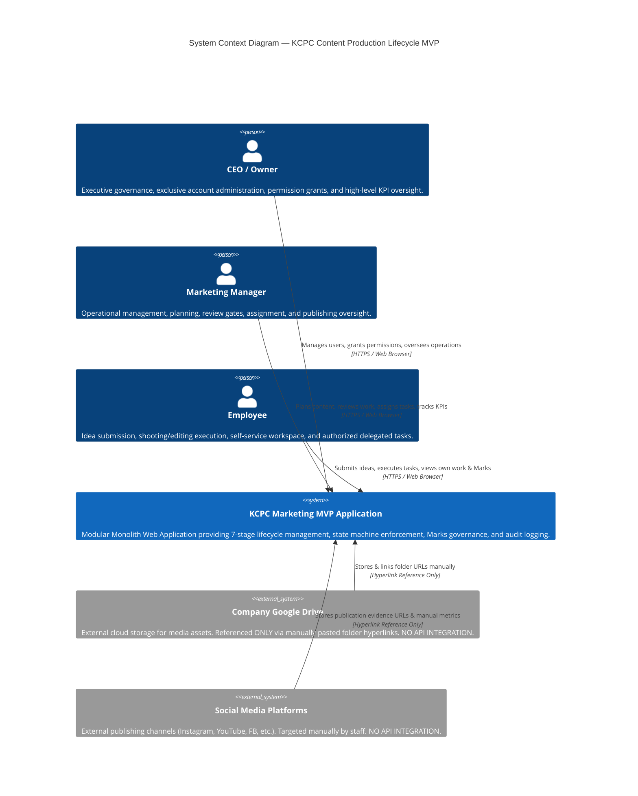

### 5.3 External Interaction & Integration Policy
- **Social Media Platforms:** Zero API connections. Publishing staff log into native platform apps/studios directly. The MVP captures publication timestamps, channel selections, and post evidence URLs entered manually by staff.
- **Google Drive Storage:** Zero API connections. Content creators create Google Drive folders manually and paste the shareable URL into the MVP.
- **Enterprise Systems (ERP/CRM/HRMS):** Completely excluded. No integrations exist or shall be designed.

---

## 6. Solution Architecture Overview

### 6.1 Architectural Style: Modular Monolith
To satisfy the $<15$ concurrent user constraint, 6–8 month operational lifespan, rapid delivery imperative, and zero-redundancy philosophy, the application is architected as a **Modular Monolith**. 

All domain modules execute within a single runtime process sharing a unified, relational database. Logical boundaries between modules are maintained strictly through internal code modularity, service-layer interfaces, and domain-driven directory structures.

### 6.2 Tiered Structure & Conceptual Layering

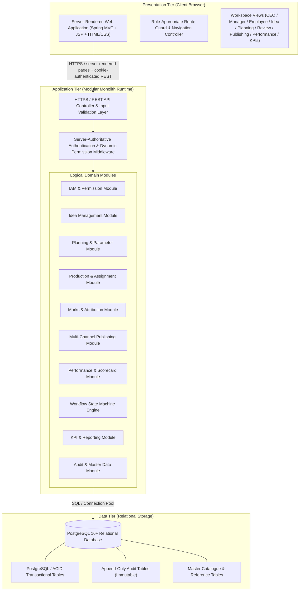

---

## 7. Logical Component Architecture

### 7.1 Component Landscape
The system is decomposed into **10 cohesive logical components** (`SAD-COMP-001` through `SAD-COMP-010`), each encapsulating distinct business capabilities while collaborating via strongly typed service interfaces.

### 7.2 Component Diagram (C4 Level 2)

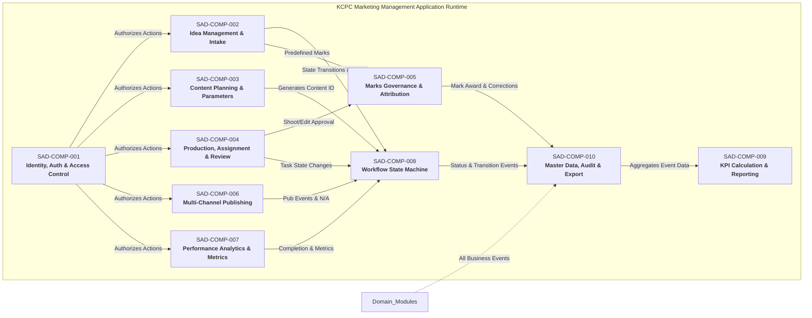

### 7.3 Component Catalog & Responsibilities

#### SAD-COMP-001: Identity, Authentication & Access Control Subsystem (IAM)
- **Responsibilities:** User authentication, password verification, secure session management, CEO user account administration (create, activate, deactivate), Business Role assignment (each resolving to one internal access class — `CEO / Owner`, `Marketing Manager`, `Employee`), Business Role catalogue administration, 17-permission catalog management, granular scope evaluation (Global, Stage-Restricted, Specific-Item), runtime permission checking, onward delegation blocking, and delegated self-approval prohibition enforcement.
- **Primary SRS Requirements Served:** `SRS-REQ-001`, `SRS-REQ-002`, `SRS-REQ-003`, `SRS-REQ-004`, `SRS-REQ-006`, `SRS-REQ-007`, `SRS-REQ-008`, `SRS-REQ-009`, `SRS-REQ-010`, `SRS-REQ-011`, `SRS-REQ-012`, `SRS-REQ-013`, `SRS-REQ-065`, `SRS-REQ-069`, `SRS-REQ-070`.
- **Data Owned/Managed:** `User`, `BaseRole`, `OperationalPermissionGrant`, `UserSession`.
- **Dependencies:** `SAD-COMP-010` (Audit Logging).
- **Security Boundary:** Core security gatekeeper; all incoming HTTP requests pass through this component before reaching any domain logic.

#### SAD-COMP-002: Idea Management & Intake Subsystem
- **Responsibilities:** Dedicated multi-role Idea Submission Form handling (capturing mandatory Title, optional Reference Link/Note, optional Remarks), system-generated unique Idea ID generation, Idea Review evaluation gate execution under Permission #1 (Approve, Reject with mandatory reason, Retain), dormant Retained idea preservation, administrative idea reopening under Permission #1, and routing approved ideas to Planning.
- **Primary SRS Requirements Served:** `SRS-REQ-014`, `SRS-REQ-015`, `SRS-REQ-016`, `SRS-REQ-017`, `SRS-REQ-018`, `SRS-REQ-019`, `SRS-REQ-084`.
- **Data Owned/Managed:** `Idea`, `IdeaReviewDecision`.
- **Dependencies:** `SAD-COMP-001` (Auth), `SAD-COMP-005` (Marks), `SAD-COMP-008` (State Machine), `SAD-COMP-010` (Audit).

#### SAD-COMP-003: Content Planning & Parameter Management Subsystem
- **Responsibilities:** Single Content ID creation (`C-MMYY-NNNN` upon entry to Planning with monthly sequence reset based on business calendar), optional free-text Category attribute capture (supporting blank, single, or multi-value text entered by user without reference list constraints), Content Priority setting (Low, Medium, High), Models/Talent multi-selection, SKU reference / N/A handling, multi-asset Planned Output classification (Photography, Reel, Video), Reel Type attribution (Very Short, Short, Long), Publication Scope target mapping, shared Planned Live Date handling, automated default execution date calculation (-5d shoot, -2d edit) with authorized manual override, Content Asset Folder Link capture under Permission #13, initial Cameraperson assignment under Permission #4, and Planning Review gate coordination under Permission #3.
- **Primary SRS Requirements Served:** `SRS-REQ-020`, `SRS-REQ-021`, `SRS-REQ-022`, `SRS-REQ-023`, `SRS-REQ-024`, `SRS-REQ-025`, `SRS-REQ-026`, `SRS-REQ-027`, `SRS-REQ-028`, `SRS-REQ-029`, `SRS-REQ-030`, `SRS-REQ-040`, `SRS-REQ-062`.
- **Data Owned/Managed:** `ContentPlan`, `PlannedOutput`, `PlannedOutputPublicationTargetMapping`, `PlanningReviewDecision`.
- **Dependencies:** `SAD-COMP-001`, `SAD-COMP-008`, `SAD-COMP-010`.

#### SAD-COMP-004: Production, Assignment & Review Subsystem (Shoot & Edit)
- **Responsibilities:** Human-controlled shooting and editing task assignment and queue management, preventing algorithmic task allocation, folder link prerequisite enforcement prior to Shoot Review submission, Shoot Review gate execution under Permission #5 (Approve, Request Rework), post-Shoot Approval initial Editor assignment under Permission #6, Edit Review gate execution under Permission #7 (Approve, Request Rework), transition to Ready for Publishing, and contextual assignee workload visibility.
- **Primary SRS Requirements Served:** `SRS-REQ-031`, `SRS-REQ-032`, `SRS-REQ-033`, `SRS-REQ-034`, `SRS-REQ-035`, `SRS-REQ-036`, `SRS-REQ-037`, `SRS-REQ-038`, `SRS-REQ-039`, `SRS-REQ-040`.
- **Data Owned/Managed:** `ShootAssignment`, `ShootReviewDecision`, `EditAssignment`, `EditReviewDecision`.
- **Dependencies:** `SAD-COMP-001`, `SAD-COMP-005`, `SAD-COMP-008`, `SAD-COMP-010`.

#### SAD-COMP-005: Marks Governance & Attribution Subsystem
- **Responsibilities:** Enforcing the closed predefined Marks set `[0, 0.5, 1.0, 2.0, 3.0]`, capturing predefined Cameraperson and Editor Marks at Idea Approval, validating numeric 0 as an active intentional mark, executing immutable predefined Mark corrections under Permission #1 with linked history, awarding full predefined Marks to qualifying final Camerapersons upon Shoot Approval, awarding full predefined Marks to qualifying final Editors upon Edit Approval, ensuring no personal Mark attribution record is created on Rework/Publishing and no additional personal Mark attribution record is created on Reposts, and maintaining employee personal Mark ledgers with strict peer privacy.
- **Primary SRS Requirements Served:** `SRS-REQ-085`, `SRS-REQ-086`, `SRS-REQ-087`, `SRS-REQ-090`, `SRS-REQ-066`, `SRS-REQ-067`, `SRS-REQ-068`.
- **Data Owned/Managed:** `PredefinedRoleMark`, `PersonalMarkAttribution`, `PredefinedMarkCorrection`.
- **Dependencies:** `SAD-COMP-001`, `SAD-COMP-010`.

#### SAD-COMP-006: Multi-Channel Publishing Execution Subsystem
- **Responsibilities:** Multi-platform publishing workspace coordination, recording manual Actual Publication events (`Original` vs `Repost`) linked to specific Planned Outputs and Publication Targets, evidence URL capture and correction under Permission #8, Publication Target N/A exception recording with mandatory reasons, reversible/supersedable N/A handling, all-N/A completion blocking, initial publishing scope completion verification, and transition to Performance Pending state.
- **Primary SRS Requirements Served:** `SRS-REQ-041`, `SRS-REQ-042`, `SRS-REQ-043`, `SRS-REQ-044`, `SRS-REQ-045`, `SRS-REQ-046`, `SRS-REQ-047`, `SRS-REQ-053`, `SRS-REQ-055`.
- **Data Owned/Managed:** `ActualPublicationEvent`, `PublicationEvidenceCorrection`, `PublicationTargetNARecord`.
- **Dependencies:** `SAD-COMP-001`, `SAD-COMP-008`, `SAD-COMP-010`.

#### SAD-COMP-007: Performance Analytics & Metric Capture Subsystem
- **Responsibilities:** Event-specific performance obligation tracking, system-derived non-reschedulable Performance Due Date calculation (`Actual Publication Date + 2 calendar days`), manual scorecard metric entry (3s views, plays, watch time, video length, link clicks, impressions), deterministic formula calculation (Hook Rate, Hold Rate, CTR), linked immutable metric correction, deliverable completion verification, deliverable reopening exclusively for metric correction under Permission #9, and implementing the resolved clarifications `SC-REQ-001` (zero-denominator rate → `N/A`) and `SC-REQ-002` (editable scorecard draft-then-submit lifecycle).
- **Primary SRS Requirements Served:** `SRS-REQ-048`, `SRS-REQ-049`, `SRS-REQ-050`, `SRS-REQ-051`, `SRS-REQ-052`, `SRS-REQ-054`, `SRS-REQ-088`, `SRS-REQ-089`.
- **Data Owned/Managed:** `PerformanceObligation`, `CreativePerformanceScorecard`, `PerformanceMetricCorrection`.
- **Dependencies:** `SAD-COMP-001`, `SAD-COMP-008`, `SAD-COMP-010`.

#### SAD-COMP-008: Workflow State Machine & Lifecycle Coordination Engine
- **Responsibilities:** Centralized Finite State Machine (FSM) enforcing the 22 workflow concepts (17 active states, 1 dormant state, 2 terminal states, 1 closed/reopenable state, 1 supplementary delay flag), transition prerequisite validation, absolute manual status edit prohibition, Operational Hold & Resume action execution during active Shoot In Progress or Editing states under BR-063 / SRS-REQ-091 (pausing active work while preserving primary workflow status, assignees, and Content ID identity), cross-stage reschedule execution under Permission #10, reassignment execution with task state reset under Permission #11, pre-first-completion cancellation execution under Permission #12, permanent post-completion cancellation blocking, and reopen coordination for Retained and Completed deliverables.
- **Primary SRS Requirements Served:** `SRS-REQ-056`, `SRS-REQ-057`, `SRS-REQ-058`, `SRS-REQ-059`, `SRS-REQ-083`, `SRS-REQ-091`.
- **Data Owned/Managed:** `WorkflowStateInstance`, `WorkflowTransitionLog`, `OperationalHoldRecord`, `RescheduleRecord`, `ReassignmentRecord`, `CancellationRecord`, `ReopenRecord`.
- **Dependencies:** `SAD-COMP-001`, `SAD-COMP-010`.

#### SAD-COMP-009: KPI Calculation & Operational Reporting Subsystem
- **Responsibilities:** Deterministic querying and calculation for the 30 formal KPIs (`KPI-001` through `KPI-030`) across 5 governed categories, executive/management operational dashboards, team workload aggregate visibility under Permission #14, team KPI aggregate visibility under Permission #15, separate administrative action reporting, employee self-service own-work 5-measure performance view, and delay flag SLA monitoring.
- **Primary SRS Requirements Served:** `SRS-REQ-066`, `SRS-REQ-067`, `SRS-REQ-068`, `SRS-REQ-069`, `SRS-REQ-070`, `SRS-REQ-071`, `SRS-REQ-072`, `SRS-REQ-073`, `SRS-REQ-074`, `SRS-REQ-075`, `SRS-REQ-076`.
- **Data Owned/Managed:** Conceptual KPI reporting views and query projections (read-only derived models).
- **Dependencies:** `SAD-COMP-001`, `SAD-COMP-010`.

#### SAD-COMP-010: Master Data Catalogue, Audit & Data Export Subsystem
- **Responsibilities:** Controlled platform and company channel/account catalogue maintenance under Permission #17, Publication Target entity management, controlled content taxonomy governance, system-wide append-only immutable audit logging, audit trail immutability enforcement, relevant audit history visibility under Permission #16, structured data export generation (JSON/CSV/XLSX) for Business OS migration, and non-functional runtime resilience management.
- **Primary SRS Requirements Served:** `SRS-REQ-005`, `SRS-REQ-013`, `SRS-REQ-060`, `SRS-REQ-061`, `SRS-REQ-063`, `SRS-REQ-064`, `SRS-REQ-065`, `SRS-REQ-077`, `SRS-REQ-078`, `SRS-REQ-079`, `SRS-REQ-080`, `SRS-REQ-081`, `SRS-REQ-082`.
- **Data Owned/Managed:** `PlatformCatalogue`, `CompanyChannelAccount`, `PublicationTarget`, `ContentTaxonomyReference`, `SystemAuditLog`.
- **Dependencies:** `SAD-COMP-001`.

---

## 8. Workflow & State Management Architecture

### 8.1 The 22-State Lifecycle Finite State Machine
The core workflow is architected as an explicit, deterministic **Finite State Machine (FSM)**. The system models exactly **22 workflow concepts** categorized into five lifecycle classes:

| Class                         | Count  | Statuses / Concepts                                                                                                                                                                                                                                                                                                                                              | Operational Behavior                                                                                                                                                                                                       |
| :---------------------------- | :----: | :--------------------------------------------------------------------------------------------------------------------------------------------------------------------------------------------------------------------------------------------------------------------------------------------------------------------------------------------------------------- | :------------------------------------------------------------------------------------------------------------------------------------------------------------------------------------------------------------------------- |
| **Active Lifecycle States**   | **17** | `Idea Submitted`<br/>`Pending Approval`<br/>`Planning`<br/>`Planning Review`<br/>`Planning Approved`<br/>`Shoot Assigned`<br/>`Shoot In Progress`<br/>`Shoot Review`<br/>`Shoot Approved`<br/>`Edit Assigned`<br/>`Editing`<br/>`Edit Review`<br/>`Edit Approved`<br/>`Ready for Publishing`<br/>`Publishing`<br/>`Performance Pending`<br/>`Performance Update` | Normal forward-progressing operational lifecycle states. Advancing between these states requires satisfying explicit business prerequisites and review gate approvals.                                                     |
| **Dormant State**             | **1**  | `Retained`                                                                                                                                                                                                                                                                                                                                                       | Non-operational preserved state for deferred ideas. Preserves Idea ID; allocates no Content ID; excludes from active Planning queues. Reopenable to `Pending Approval` under Permission #1.                                |
| **Terminal States**           | **2**  | `Rejected`<br/>`Cancelled`                                                                                                                                                                                                                                                                                                                                       | Permanent end states. `Rejected` terminates an unapproved Idea (requires mandatory reason; cannot be reopened). `Cancelled` terminates pre-first-completion deliverables under Permission #12 (requires mandatory reason). |
| **Closed / Reopenable State** | **1**  | `Completed`                                                                                                                                                                                                                                                                                                                                                      | Post-performance completion state. Reopenable under Permission #8 (for additional publication, repost, evidence correction, N/A adjustment) or Permission #9 (exclusively for metric correction).                          |
| **Supplementary Flag**        | **1**  | `Delayed`                                                                                                                                                                                                                                                                                                                                                        | System-calculated dynamic indicator evaluated in real time when current date exceeds active milestone targets. **Not a primary database status column**.                                                                   |

### 8.2 State Transition Guards & Manual Status Edit Prohibition
To enforce `SRS-REQ-083`, the state machine architecture implements the following structural controls:
1. **Status Edit Prohibition:** The `current_status` attribute of any deliverable is strictly read-only to general data-mutation APIs. Direct SQL UPDATE commands on status columns are rejected by database triggers.
2. **Command-Driven Transitions:** Status changes occur exclusively as side-effects of validated domain commands (e.g., `ApproveIdeaCommand`, `SubmitShootReviewCommand`, `ApproveEditCommand`, `RecordPublicationEventCommand`, `SubmitScorecardCommand`).
3. **Pre-Transition Validation Guards:** Each command handler validates:
   - Applicable authorization basis, including internal-access-class authority for CEO / Owner or Marketing Manager, ownership/assignment/participation eligibility for Employee default execution actions, and active valid in-scope CEO-Granted Operational Permission for Employee permission-governed actions;
   - Prerequisite data existence (e.g., Folder Link present for Shoot Review, Evidence Link present for Publishing);
   - Delegated self-approval prohibitions;
   - Source-state validity.

### 8.3 Administrative Actions Architecture
Administrative actions (`Reschedule`, `Reassign`, `Cancel`, `Reopen Retained`, `Reopen Completed`) are architected as **Explicit Transactional Operations**, NOT workflow statuses:
- **Reschedule (Permission #10):** Updates planned execution dates (`planned_shoot_date`, `planned_edit_date`, `planned_live_date`), recalculates stage scheduling offset dates (-5d / -2d) if applicable, and writes a `RescheduleRecord` to the audit log with mandatory reason capture. Reschedule retains the deliverable in its applicable active execution state or returns the deliverable to the applicable active execution state according to the source-governed workflow context, without creating a new workflow status or altering Permission #2 / #4 / #6 / #11 boundaries.
- **Reassign (Permission #11):** Updates designated assignees, resets task state to `Assigned` if in progress, and writes a `ReassignmentRecord`.
- **Cancel (Permission #12):** Validates that deliverable has never reached `Completed` (`first_completion_timestamp IS NULL`), transitions state from any eligible active or dormant pre-first-completion state to `Cancelled`, and logs a `CancellationRecord` with mandatory reason capture. Once a deliverable reaches `Completed` at least once, post-first-completion cancellation is permanently prohibited.
- **Reopen Retained (Permission #1):** Transitions `Retained` idea back to `Pending Approval` with a `ReopenRecord`.
- **Reopen Completed (Permissions #8, #9):** Transitions `Completed` deliverable to `Publishing` (Permission #8) or `Performance Update` (Permission #9) with a `ReopenRecord`. Reopened `Publishing` activity exits back to `Performance Pending` if a new publication event creates a new performance obligation, or exits directly to `Completed` if reopened activity (such as evidence URL or Target N/A correction) completes without creating a new performance obligation.

### 8.4 State Machine Transition Diagram

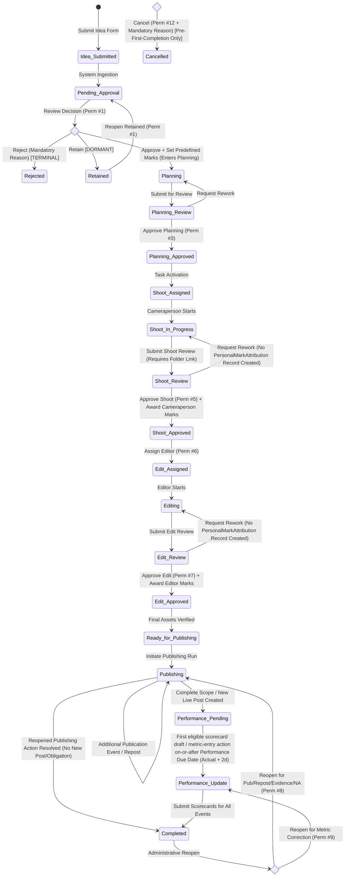

> **Cancellation Origin Governance Note:** Any eligible Active or Dormant record that has never reached `Completed` (`first_completion_timestamp IS NULL`) may invoke `Cancel` under Permission #12. The `Cancel_Gate` represents a conceptual origin set across eligible pre-first-completion states, NOT a separate workflow status. Once a deliverable reaches `Completed` at least once, post-first-completion cancellation is permanently prohibited.

---

## 9. Identity, Access Control & Permission Architecture

### 9.1 3-Access-Class Identity & Authentication Model
The system enforces exactly **three internal access classes** (physically the `base_roles` catalogue; a user is assigned a Business Role that resolves to one of these):

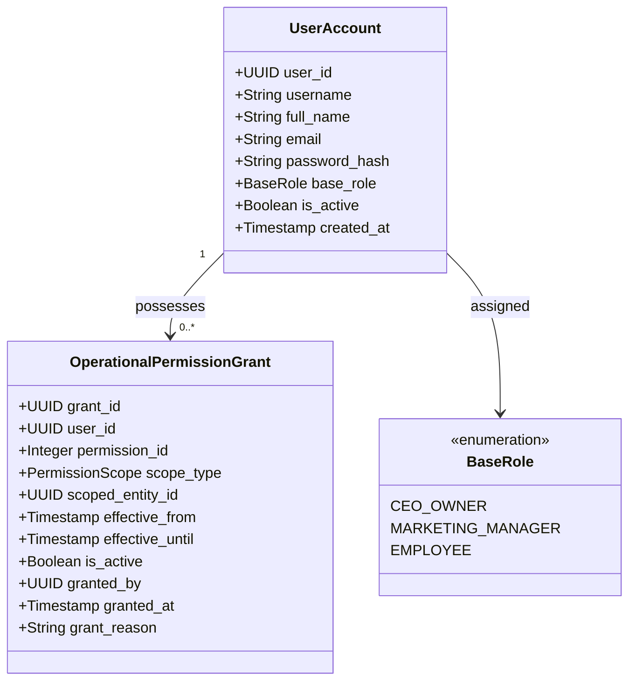

1. **CEO / Owner (`CEO_OWNER`):** Executive governance authority. Exclusive access to user account management (create, activate, deactivate), Business Role assignment/modification (resolving to an internal access class), and operational permission granting/revocation. Inherently possesses all operational authority across all stages.
2. **Marketing Manager (`MARKETING_MANAGER`):** Department-wide operational authority. Possesses default execution authority for planning, review gates, assignments, publishing, performance tracking, and aggregate reporting. Strictly barred from user management, role modification, and permission granting.
3. **Employee (`EMPLOYEE`):** Default operational scope restricted strictly to own work (assigned tasks, deadlines, own Marks, own 5 personal performance measures). Receives expanded operational capabilities exclusively via active CEO-granted operational permissions.

### 9.2 17-Permission Dynamic Authorization Subsystem
The architecture implements runtime enforcement for the exact **17 CEO-Granted Operational Permissions**:

|   ID    | Formal Permission Name                    | Technical Code                    | Capability / Scope                                                                                                                                         |
| :-----: | :---------------------------------------- | :-------------------------------- | :--------------------------------------------------------------------------------------------------------------------------------------------------------- |
| **#1**  | `Idea Review`                             | `PERM_01_IDEA_REVIEW`                     | Evaluate submitted ideas (Approve, Reject, Retain), define predefined role Marks, correct predefined Marks, and reopen Retained ideas.                     |
| **#2**  | `Planning Execution`                      | `PERM_02_PLANNING_EXECUTION`              | Define planning parameters, Category, Content Priority, Models/Talent, SKU, Planned Outputs, Reel Types, Target Mappings, and initial scheduling dates.    |
| **#3**  | `Planning Review`                         | `PERM_03_PLANNING_REVIEW`                 | Review planned content, approve planning parameters, and request planning rework.                                                                          |
| **#4**  | `Shooting Assignment Management`          | `PERM_04_SHOOT_ASSIGNMENT`        | Manage initial Cameraperson assignment(s) during Stage 3 Planning (does not grant independent date scheduling authority).                                  |
| **#5**  | `Shoot Review`                            | `PERM_05_SHOOT_REVIEW`                    | Review completed footage, approve shoot deliverables, trigger Cameraperson Mark award, and request shoot rework.                                           |
| **#6**  | `Editing Assignment Management`           | `PERM_06_EDIT_ASSIGNMENT`         | Assign initial Editor(s) to approved shoot deliverables during Stage 5 (does not grant date rescheduling authority).                                       |
| **#7**  | `Edit Review`                             | `PERM_07_EDIT_REVIEW`                     | Review edited content, approve edit deliverables, trigger Editor Mark award, and request edit rework.                                                      |
| **#8**  | `Publishing Execution`                    | `PERM_08_PUBLISHING_EXECUTION`            | Record manual Actual Publication events (Original/Repost), record Target N/A exceptions, update evidence links, and reopen Completed items for publishing. |
| **#9**  | `Performance Update`                      | `PERM_09_PERFORMANCE_UPDATE`              | Enter Creative Performance Scorecard metrics, correct existing scorecard entries, and reopen Completed items for metric correction.                        |
| **#10** | `Reschedule`                              | `PERM_10_RESCHEDULE`                      | Modify planned shooting, editing, or live dates across active lifecycle stages with mandatory reason logging.                                              |
| **#11** | `Reassign`                                | `PERM_11_REASSIGN`                        | Replace assigned Camerapersons or Editors on active tasks with state reset and mandatory reason logging.                                                   |
| **#12** | `Cancel`                                  | `PERM_12_CANCEL`                          | Terminate pre-first-completion deliverables permanently with mandatory reason logging.                                                                     |
| **#13** | `Content Asset Folder Link Management`    | `PERM_13_FOLDER_LINK_MANAGE`  | Add, update, or correct the parent Content Asset Google Drive folder hyperlink.                                                                            |
| **#14** | `Team Workload Visibility`                | `PERM_14_TEAM_WORKLOAD_VIEW`        | View department-wide contextual task counts and active operational workload aggregations (without peer-private metrics/Marks).                             |
| **#15** | `Team KPI Visibility`                     | `PERM_15_TEAM_KPI_VIEW`             | Access management-level aggregate reporting dashboards and the 30-KPI catalog (without peer-private metrics/Marks).                                        |
| **#16** | `Relevant Audit-History Visibility`       | `PERM_16_AUDIT_HISTORY_VIEW`       | Inspect immutable audit trail history for deliverables within designated scope.                                                                            |
| **#17** | `Platform & Channel Catalogue Management` | `PERM_17_PLATFORM_CATALOGUE_MANAGE` | Add, modify, or deactivate Platforms and Company Channel/Account entities in the master catalogue.                                                         |

### 9.3 Anti-Delegation & Work-Provenance Delegated Self-Approval Barrier
1. **Prohibition of Onward Delegation (`SRS-REQ-011`):** System authorization verifies that the initiating user of any user management, role modification, or permission grant/revocation API is strictly a `CEO_OWNER`. Marketing Managers and Employees have zero technical capability to assign, delegate, or revoke permissions.
2. **Work-Provenance Delegated Self-Approval Barrier (`SRS-REQ-012`):** When an `EMPLOYEE` exercises a delegated review permission (Permissions #1, #3, #5, #7), the authorization subsystem enforces strict work-provenance conflict evaluation. Before checking self-approval conflict, full permission-grant validity is confirmed (grant exists, is active, effective, unexpired, unrevoked, and target resource is within scope). Upon passing permission validation, the authorization interceptor verifies that the Employee did not personally create, prepare, execute, or submit the work being reviewed, evaluating immutable work provenance derived from historical audit and submission records:
   - **`Idea Review (#1)`:** Block if Employee personally submitted the Idea.
   - **`Planning Review (#3)`:** Block if Employee personally prepared the Planning work OR submitted that Planning work for review.
   - **`Shoot Review (#5)`:** Block if Employee personally executed the Shoot work (as recorded qualifying cameraperson/contributor) OR submitted that Shoot work for review.
   - **`Edit Review (#7)`:** Block if Employee personally executed the Edit work (as recorded qualifying editor/contributor) OR submitted that Edit work for review.
   Self-approval conflict evaluation looks beyond static initial assignment lists to inspect actual recorded execution and submission provenance across multi-contributor assignments. If a self-approval conflict exists, access is denied (`HTTP 403 Forbidden`) and security audit logging is executed.

### 9.4 Multi-Layer Authorization Decision Flow

Authorization strictly evaluates the authenticated identity, account state, internal access class (resolved from the user’s Business Role), and requested action type before granting access:

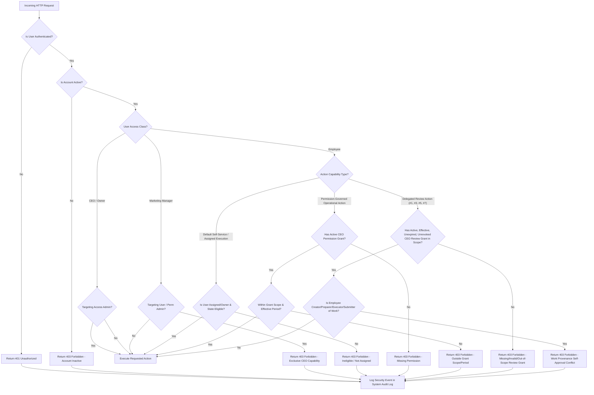

---

## 10. Data Architecture Strategy

### 10.1 Storage Engine & Transactional Philosophy
The data architecture is built on **PostgreSQL 16+**, leveraging:
- Strict relational schema enforcement with Foreign Key constraints and `NOT NULL` domain integrity;
- Serialized ACID transactions for multi-entity workflow transitions;
- Native `TIMESTAMPTZ` for microsecond-accurate timestamp recording in UTC;
- `JSONB` document storage for structured, immutable audit payloads and metadata snapshots;
- Append-only tables protected by database-level privilege revocation (`REVOKE UPDATE, DELETE ON TABLE system_audit_log, ...`).

### 10.2 Conceptual Domain Models & Cardinalities

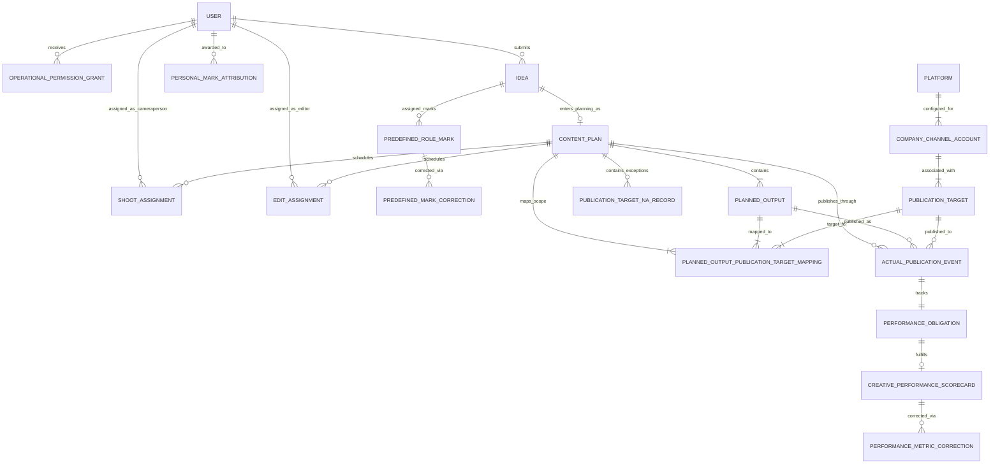

### 10.3 Planning Conceptual Data Model & Parameter Structure
In Stage 3 Planning, the conceptual data model captures the complete governed parameter set:
- **Category:** Optional manually entered free-text attribute (supporting blank, single, or multi-value text entered by the user; no master catalogue table, no delimiter semantics). Applies to the overall `ContentPlan` and is distinct from SKU. (No separate Category Management module or permission).
- **Content Priority:** Single-select value from controlled set `[Low, Medium, High]`.
- **Models / Talent Selection:** Multi-selection of participating talent or empty where non-applicable.
- **SKU Reference:** Optional alphanumeric reference code or explicit N/A indication for generic content.
- **Planned Outputs:** 1 to $N$ `PlannedOutput` records (`Photography`, `Reel`, `Video`). If `Reel`, holds exactly one `ReelType` (`Very Short`, `Short`, `Long`).
- **Publication Target Mappings:** Explicit `PlannedOutputPublicationTargetMapping` linking each `PlannedOutput` to intended `PublicationTarget` entities.
- **Dates & Offsets:** Shared `PlannedLiveDate`, default calculated `PlannedShootDate` (-5 calendar days) and `PlannedEditDate` (-2 calendar days) with authorized manual override.
- **Folder Link:** Mandatory Google Drive parent folder URL captured under Permission #13.
- **Shooting Team:** Initial Cameraperson assignment captured under Permission #4.

### 10.4 Publishing Master Data Hierarchy & Seed Catalogue
The publishing master data model enforces a strict 3-tier conceptual hierarchy:

$$\mathbf{Platform} \longrightarrow \mathbf{Company\ Channel\ /\ Account} \longrightarrow \mathbf{Publication\ Target}$$

- **`Platform`:** The parent social media service entity. Initial seed catalogue contains exactly **6 platforms**: `Instagram`, `Threads`, `YouTube`, `Facebook`, `Moj`, `TikTok`.
- **`CompanyChannelAccount`:** The owned social media handle/account entity. Initial seed catalogue contains exactly **8 accounts**: `kcpcsikar`, `kcpcbandhani`, `kcpc_sikar`, `kcpcbandhani.01`, `kcpc.english`, `piyushxbusiness`, `kcpclegacy`, `kcpc_legacy`.
- **`PublicationTarget`:** The specific governed selectable publishing destination arising from an active, configured Platform $\leftrightarrow$ Company Channel / Account relationship.
- **Configurable Master Data Governance:** Platform and Company Channel / Account are controlled master-data concepts. Their usable associations are configurable master data managed under Permission #17 (`CATALOGUE_MGMT`) and are **not hardcoded in application logic** nor fixed into permanent pairings from seed data. Planned Outputs map to Publication Targets, and Actual Publication Events reference Publication Targets.

### 10.5 Content Identity Invariant & Planning Entry Generation Timing
- **One Content ID (`C-MMYY-NNNN`):** Allocated **atomically during Idea Approval** (`API-OP-013`), as the approved Idea transitions into Planning — created in the same governed transaction as the `content_plans` row. There is **no** separate Planning-entry operation.
- **Invariant:** One Approved Idea $\rightarrow$ One Content ID $\rightarrow$ Multiple Planned Outputs $\rightarrow$ One Shared Workflow. Sub-content IDs or output-specific state machines are strictly prohibited.
- **Month Boundary & Sequence Reset:** The `MMYY` component and monthly sequence reset to `0001` are evaluated using the governed business calendar (IST / Asia/Kolkata) applied at the moment of Planning entry; underlying system persistence timestamps remain UTC.

### 10.6 Marks Model: Predefined Role Marks vs Personal Attribution
The data architecture strictly distinguishes role settings from personal attributions:
1. **`PredefinedRoleMark`:** Established during Stage 2 Idea Review under Permission #1. Stores the potential mark value (`[0, 0.5, 1.0, 2.0, 3.0]`) configured for the Cameraperson role and Editor role. Numeric 0 is a valid selectable predefined mark satisfying mandatory entry.
2. **`PersonalMarkAttribution`:** Created upon Shoot Approval (Permission #5) and Edit Approval (Permission #7). Binds the full predefined mark value to confirmed individual qualifying contributors. 
   - No splitting or averaging among multiple assignees; each qualifying contributor receives the full predefined role mark.
   - On Request Rework: **no personal Mark attribution record is created**.
   - On Publishing: **no personal Mark attribution record is created**.
   - On Repost: **no additional personal Mark attribution record is created**.
   - If the predefined mark is numeric 0 and approval occurs, a valid `PersonalMarkAttribution` record with value `0` is created. Record absence $\ne$ numeric value 0.
3. **`PredefinedMarkCorrection`:** Append-only linked ledger recording any modification to `PredefinedRoleMark` under Permission #1 with mandatory reason, prior value, and actor timestamp.

### 10.7 Identifier Generation Strategies
- **Idea ID:** Formatted as `IDEA-YYYYMMDD-NNNN` (sequential daily integer).
- **Content ID:** Formatted as `C-MMYY-NNNN` where `MMYY` represents the Planning-entry business month/year in IST and `NNNN` is a zero-padded integer reset to `0001` on the 1st of each calendar month.
- **Database Primary Keys:** UUIDv7 (time-ordered UUIDs) for all operational tables to ensure index locality and non-guessable identifiers.

---

## 11. Audit, History & Immutability Architecture

### 11.1 Immutable Event Logging Subsystem
To fulfill `SRS-REQ-063` and `SRS-REQ-064`, the application implements a centralized, append-only **System Audit Subsystem**. 

Every security event, workflow state transition, administrative action, review decision, Marks attribution, folder link modification, and catalogue change writes a permanent record to `system_audit_log`.

```sql
-- Conceptual DDL for Immutable Audit Log
CREATE TABLE system_audit_log (
    audit_id UUID PRIMARY KEY DEFAULT gen_random_uuid(),
    event_timestamp TIMESTAMPTZ NOT NULL DEFAULT clock_timestamp(),
    actor_id UUID NOT NULL REFERENCES users(user_id),
    actor_role VARCHAR(32) NOT NULL,
    acting_permission_id INTEGER,
    event_category VARCHAR(64) NOT NULL, -- AUTH, WORKFLOW, MARKS, ADMIN, CATALOGUE
    event_type VARCHAR(64) NOT NULL,     -- IDEA_APPROVED, RESCHEDULE_EXECUTED, etc.
    entity_type VARCHAR(64) NOT NULL,    -- ContentPlan, PredefinedMark, User, etc.
    entity_id UUID NOT NULL,
    previous_state JSONB,
    new_state JSONB,
    mandatory_reason TEXT,
    client_ip VARCHAR(45),
    user_agent TEXT
);

-- Strict Database-Level Immutability Guard
REVOKE UPDATE, DELETE, TRUNCATE ON system_audit_log FROM PUBLIC;
REVOKE UPDATE, DELETE, TRUNCATE ON system_audit_log FROM app_user;
```

### 11.2 Linked Correction Chains
When an authorized correction occurs (Predefined Mark under Permission #1, Evidence URL under Permission #8, or Performance Metrics under Permission #9), the system never overwrites the prior data row:
1. The active record pointer is updated within a transaction.
2. A new correction row is inserted into the domain correction table (`predefined_mark_correction`, `publication_evidence_correction`, `performance_metric_correction`).
3. The correction row explicitly references the `original_record_id`, `prior_value`, `new_value`, `mandatory_reason`, `actor_id`, and `timestamp`.

### 11.3 Audit Log Diagram

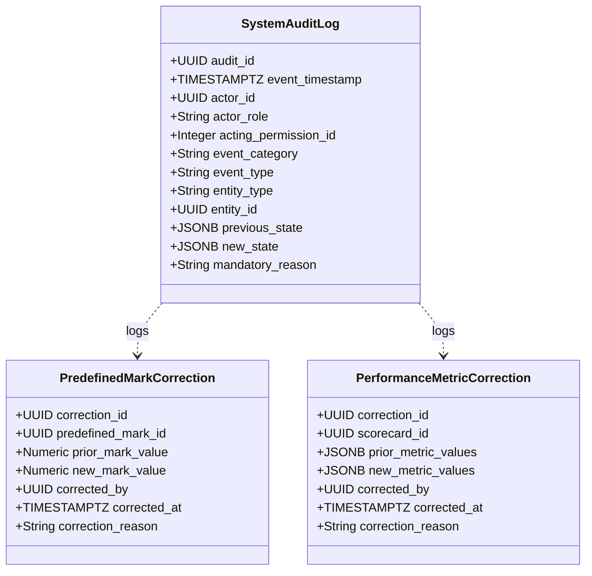

---

## 12. Publishing & Performance Architecture

### 12.1 Multi-Channel Publishing Event Engine & Output Linkage
Under `SRS-REQ-042` and `SRS-REQ-043`, publishing is modeled as discrete, immutable **Actual Publication Events** linked to specific outputs:
- Each `ActualPublicationEvent` explicitly references:
  - Parent `ContentPlan` (Content ID);
  - Specific `PlannedOutput` published;
  - Specific `PublicationTarget` utilized;
  - Associated `Platform` and `CompanyChannelAccount`;
  - Publication Event Type (`Original` vs `Repost`);
  - Actual Publication Date/Time;
  - Publication Evidence URL;
  - Publishing Operator User ID;
  - System Recording Timestamp.
- **Marks Rule:** Publication events create **no personal Mark attribution records**. Reposts create **no additional personal Mark attribution records**.

### 12.2 Target N/A Exception & Supersession Lifecycle
To support `SRS-REQ-045` and `SRS-REQ-047`:
- If an intended publication target is not utilized, an authorized operator (Permission #8) logs a `PublicationTargetNARecord` with a mandatory operational reason.
- **Reversal / Supersession:** If the business decides to publish to that channel later, a reversal event supersedes the N/A record, restoring the target obligation.
- **All-N/A Guard:** The system blocks workflow transition to `Performance Pending` if all planned targets are marked N/A. At least one actual publication event is mandatory.

### 12.3 Event-Level Performance Due Date & Scorecard Capture
- **Event-Level Due Date:** Formulated strictly per `ActualPublicationEvent`:
  $$\mathbf{Performance\ Due\ Date} = \mathbf{Actual\ Publication\ Date} + 2\ \text{Calendar Days}$$
  Non-reschedulable by human users.
- **Creative Performance Scorecard Capture:** Sourced from manual entry by marketing staff:
  - Raw inputs: 3-second views ($V_{3s}$), Plays ($P$), Average watch time ($T_{avg}$), Video length ($L_{vid}$), Link clicks ($C$), Impressions ($I$).
  - System-Calculated Measures:
    $$\mathbf{Hook\ Rate\ (\%)} = \left(\frac{V_{3s}}{P}\right) \times 100$$
    $$\mathbf{Hold\ Rate\ (\%)} = \left(\frac{T_{avg}}{L_{vid}}\right) \times 100$$
    $$\mathbf{CTR\ (\%)} = \left(\frac{C}{I}\right) \times 100$$

---

## 13. KPI & Reporting Architecture

### 13.1 Authoritative 30-KPI Computation Engine
The architecture incorporates an in-process, deterministic calculation engine computing the exact **30 Key Performance Indicators** across the **5 authoritative governed categories**:

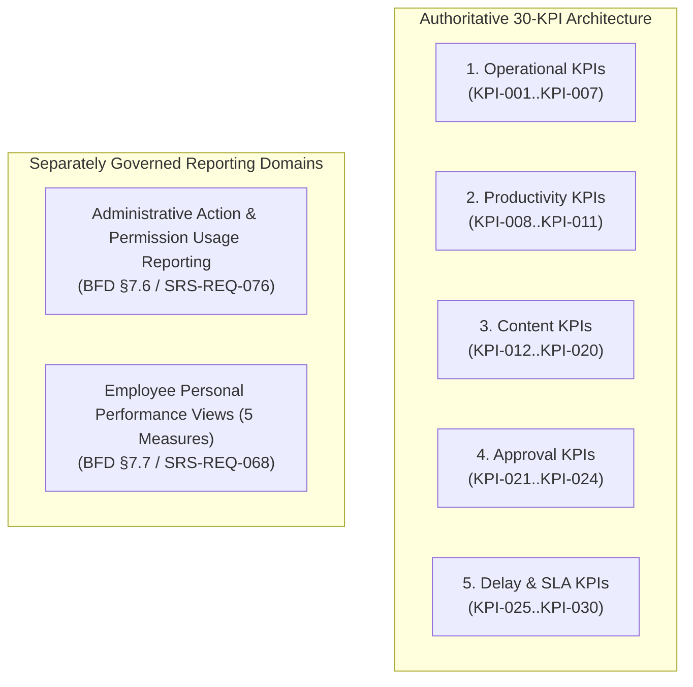

### 13.2 Governed KPI Categories & Mathematical Definitions

| KPI ID      | Governed KPI Name             | Category     | Exact Computation Basis & Formula                                                                                                                                                                                                                                                               |
| :---------- | :---------------------------- | :----------- | :---------------------------------------------------------------------------------------------------------------------------------------------------------------------------------------------------------------------------------------------------------------------------------------------- |
| **KPI-001** | `Pending Work`                | Operational  | Computes total tasks/deliverables currently in applicable Active workflow statuses in real time.                                                                                                                                                                                                |
| **KPI-002** | `Delayed Work`                | Operational  | Computes total active tasks currently exceeding their Current Approved Planned Date (or Current Planned Live Date) in real time.                                                                                                                                                                |
| **KPI-003** | `Upcoming Shoots`             | Operational  | Lists and counts all shoots scheduled within the next 7 calendar days.                                                                                                                                                                                                                          |
| **KPI-004** | `Upcoming Publishing`         | Operational  | Lists and counts all deliverables scheduled for publication within the next 7 calendar days.                                                                                                                                                                                                    |
| **KPI-005** | `Pending Approvals`           | Operational  | Computes total pending review decisions awaiting action across Idea Review, Planning Review, Shoot Review, and Edit Review gates.                                                                                                                                                               |
| **KPI-006** | `Editor Workload`             | Operational  | Computes active editing tasks distributed per Editor.                                                                                                                                                                                                                                           |
| **KPI-007** | `Performance Pending Work`    | Operational  | Counts total Actual Publication events with outstanding performance obligations whose Performance Due Date has not arrived, whose performance entry has not begun, or whose mandatory metrics remain incomplete (including overdue pending obligations).                                        |
| **KPI-008** | `Employee Productivity`       | Productivity | Tracks and aggregates total production tasks completed per employee across stages over monthly periods.                                                                                                                                                                                         |
| **KPI-009** | `Manager Productivity`        | Productivity | Tracks and aggregates total review decisions processed by the Marketing Manager over monthly periods.                                                                                                                                                                                           |
| **KPI-010** | `Tasks Completed`             | Productivity | Counts each Content ID exactly once upon initial transition to Completed status within the selected reporting period (reopened deliverables excluded).                                                                                                                                          |
| **KPI-011** | `Tasks Cancelled`             | Productivity | Aggregates total content deliverables cancelled prior to completion over monthly periods.                                                                                                                                                                                                       |
| **KPI-012** | `Published Content`           | Content      | Counts distinct Content IDs having $\ge 1$ live Actual Publication event, ensuring multiple posts or Reposts under the same Content ID are counted exactly once.                                                                                                                                |
| **KPI-013** | `Reels Produced`              | Content      | Computes total Reel-type Planned Outputs produced and approved across deliverables within the reporting period (reposts excluded from production totals).                                                                                                                                       |
| **KPI-014** | `Photography Produced`        | Content      | Computes total Photography Planned Outputs produced and approved across deliverables within the reporting period (reposts excluded).                                                                                                                                                            |
| **KPI-015** | `Publication Distribution`    | Content      | Reports the distribution of live Actual Publication events across configured Platform and/or Company Channel / Account targets.                                                                                                                                                                 |
| **KPI-016** | `Content by Type`             | Content      | Reports the distribution of produced Planned Outputs across controlled content taxonomy classifications.                                                                                                                                                                                        |
| **KPI-017** | `Ideas Submitted`             | Content      | Tracks total ideas submitted through the Idea Submission Form within the reporting period.                                                                                                                                                                                                      |
| **KPI-018** | `Ideas Approved`              | Content      | Tracks total ideas approved at Idea Review and progressed to Planning within the reporting period.                                                                                                                                                                                              |
| **KPI-019** | `Ideas Rejected`              | Content      | Tracks total ideas rejected at Idea Review within the reporting period.                                                                                                                                                                                                                         |
| **KPI-020** | `Idea Approval Rate`          | Content      | Computes idea approval rate as: $\left(\frac{\text{Ideas Approved}}{\text{Ideas Approved} + \text{Ideas Rejected}}\right) \times 100$, explicitly excluding dormant Retained ideas from the denominator.                                                                                        |
| **KPI-021** | `Approval Turnaround Time`    | Approval     | Measures the average duration from review submission to decision logging across all review gates.                                                                                                                                                                                               |
| **KPI-022** | `Approvals by Manager`        | Approval     | Computes total review decisions processed by the Marketing Manager over monthly periods.                                                                                                                                                                                                        |
| **KPI-023** | `Approvals by CEO`            | Approval     | Computes total review decisions processed by the CEO over monthly periods (excluding unrelated administrative actions).                                                                                                                                                                         |
| **KPI-024** | `Rework Rate`                 | Approval     | Computes the percentage of Planning, Shoot, and Edit reviews resulting in Request Rework: $\left(\frac{\text{Rework Decisions at Planning, Shoot, Edit Gates}}{\text{Total Decisions at Planning, Shoot, Edit Gates}}\right) \times 100$ (Retain and Reject decisions at Idea Review excluded). |
| **KPI-025** | `Average Delay`               | Delay & SLA  | Measures the mean number of calendar days active tasks exceed their Current Approved Planned Date (or Current Planned Live Date).                                                                                                                                                               |
| **KPI-026** | `Content Completion Rate`     | Delay & SLA  | Computes the percentage of planned deliverables currently in Completed status.                                                                                                                                                                                                                  |
| **KPI-027** | `Content Turnaround Time`     | Delay & SLA  | Measures the average duration from Planning initiation (Planning state entry) to initial Completed status.                                                                                                                                                                                      |
| **KPI-028** | `Shoot-to-Publish Cycle Time` | Delay & SLA  | Measures the average duration from Shoot Approved to the latest applicable Actual Publication event under the Content ID publication scope (Publication Target N/A records excluded).                                                                                                           |
| **KPI-029** | `Delay Distribution`          | Delay & SLA  | Reports the breakdown and count of delays categorized by workflow stage against Current Approved Planned Dates.                                                                                                                                                                                 |
| **KPI-030** | `On-Time Delivery Rate`       | Delay & SLA  | Measures the percentage of applicable Actual Publication events whose Actual Publication Date is on or before the applicable Current Planned Live Date (Publication Target N/A records excluded).                                                                                               |

> *Note: The post-deployment phased baseline comparison framework under SC-002 (Days 1–30 Baseline, Days 31–60 Stabilization, Days 61–90 Comparison evaluating $\ge 50\%$ delay reduction) is a governed success criteria evaluation framework and is not part of KPI-030's mathematical formula.*

### 13.3 Administrative Action & Permission Usage Reporting
In accordance with `BFD §7.6` and `SRS-REQ-076`, administrative reporting is architecturally decoupled from the formal 30-KPI catalog. The system generates dedicated administrative governance reports summarizing:
- Frequency and details of `Reschedule` actions under Permission #10;
- Frequency and details of `Reassign` actions under Permission #11;
- Frequency and details of `Cancel` actions under Permission #12;
- Reopen events for `Retained` ideas (Permission #1) and `Completed` deliverables (Permissions #8, #9);
- Publication Target N/A actions and reversal events;
- Master catalogue modifications under Permission #17;
- CEO user access administration events (account creation, activation, deactivation, role modification);
- Operational permission grant, modification, and revocation activity;
- Predefined Mark capture, personal Mark attribution, and predefined Mark correction audit logs.

### 13.4 Employee Personal Performance Views & Peer Privacy

The architecture strictly distinguishes **Employee Self-Service Operational Visibility** (`SRS-REQ-066`) from the **Employee Personal Performance 5 Governed Measures** (`SRS-REQ-068`):

#### A. Employee Self-Service Own-Work Operational Visibility (`SRS-REQ-066`)
Employees have access to a personal workspace displaying record-level operational information for work assigned to them or where their actual participation is recorded:
- Assigned tasks and current workflow statuses;
- Planned execution dates, milestones, and delay alerts;
- Reviewer feedback and rework comments;
- Google Drive folder hyperlinks;
- Personal task workload;
- Own Marks history (for qualifying Camerapersons and Editors);
- Own submitted ideas and their evaluation statuses.

#### B. Employee Personal Performance — 5 Governed Measures (`SRS-REQ-068`)
In strict accordance with `BFD §7.7`, `BRS-REQ-068`, and `SRS-REQ-068`, individual employee performance reporting is derived exclusively from actual recorded participation, limited strictly to the **5 approved quantitative measures**:
1. **Delayed Work:** Total active tasks assigned to the employee exceeding Current Approved Planned Dates.
2. **Approved Work / Task Outputs:** Total production tasks completed and approved where the employee participated.
3. **Review Submissions:** Total deliverables submitted to review gates by the employee.
4. **Request Rework Before Approval:** Total rework requests received on the employee's work before final approval.
5. **Personal Marks:** Total personal Marks awarded to qualifying Camerapersons and Editors upon deliverable approval.

#### C. Shared-Work Attribution & Corporate Aggregation Rules
- Where multiple employees collaboratively complete a task (e.g., multi-assignee shooting or editing), each recorded participant is credited individually with the completed task output in their personal view.
- Personal performance task credits **shall not multiply company-level content counts or formal KPI totals** (e.g., a single deliverable with 2 camerapersons counts as 1 task completed for corporate KPIs, while each cameraperson receives 1 task credit in their personal performance record).

#### D. Strict Peer Privacy Barrier (`SRS-REQ-067`)
- Employees are strictly prohibited from viewing any peer employee's personal performance measures, peer Marks, identifiable peer comparisons, employee rankings, leaderboards, compensation details, payroll data, or incentive calculations.
- All employee-facing queries enforce `WHERE user_id = :current_user_id` at the database/DTO layer.

---

## 14. Security & Privacy Architecture

### 14.1 Authentication Security & Password Governance
- **Password Hashing:** Passwords hashed using **Argon2id** (with **Bcrypt** cost factor 12 fallback) (*Implementation Detail Pending*). Plaintext passwords are never logged or stored.
- **Authentication Token (R3.5, realizing `SAD-ADR-001`):** A **Spring Security signed JWT** delivered in the `kcpc_session` cookie with `Secure`, `HttpOnly`, `SameSite=Lax`, **`Path=/`** (one token serves both `/app/**` and `/api/v1/**`). Each JWT carries a unique `jti`; **`SHA-256(jti)` is persisted in `user_sessions` (`ERD-TBL-002`)** — neither the raw JWT nor the raw `jti` is ever stored. The token is **deliberately stateful**: every authenticated request validates the **JWT signature**, the **expiry**, that the **registry entry exists**, that **`is_revoked = FALSE`**, and that **`users.is_active = TRUE`**. **Logout** revokes the presented registry entry; **account deactivation** revokes all active entries for that user. Registry rows are marked revoked, never physically deleted. This is a resolved architecture decision, **not an implementation detail pending**.
- **Account State Interceptor:** Every authenticated request verifies `users.is_active = TRUE`. Deactivating an account immediately revokes all of that user's non-revoked token-registry entries (`ERD-TBL-002`), so previously issued tokens stop working at once.

### 14.2 Employee Peer Privacy Protection
To enforce `SRS-REQ-067`, database query repositories and API controllers implement strict privacy isolation:
- Queries returning employee Marks or personal performance enforce `WHERE user_id = :current_user_id` unless the requester is `CEO_OWNER` or authorized management.
- SQL views and DTO serializers omit peer marks, peer rankings, and compensation-related attributes from all Employee-accessible endpoints.
- Leaderboards, comparative peer rankings, and department-wide personal marks lists are prohibited by design.

### 14.3 Infrastructure Security, Transport & Data Protection
- **Transport Security:** All client-server traffic strictly encrypted via **TLS 1.3** (HTTPS). HTTP traffic is redirected to HTTPS.
- **Input Sanitization:** All incoming payloads validated server-side using **Jakarta Bean Validation (JSR-380) with Spring Boot validation** on request DTOs and command objects, with parameterized JPA/Hibernate queries and output escaping in JSP views, to prevent SQL injection and Cross-Site Scripting (XSS).
- **CORS Policy:** Restricted strictly to the designated application domain.

---

## 15. Integration & External-System Boundary

### 15.1 Explicit Integration Exclusions
The architecture explicitly excludes, prohibits, and rejects the following integration interfaces:
- **No Social Media APIs:** Zero integration with Meta Graph API (Instagram/Facebook), YouTube Data API, TikTok API, Threads API, or Moj API.
- **No Cloud Storage APIs:** Zero integration with Google Drive API, AWS S3 SDK, or Azure Blob Storage SDK.
- **No Enterprise ERP/CRM/HRMS:** Zero connectivity with external billing, inventory, or payroll systems.
- **No Automated Scraping:** Zero headless browser scraping or automated analytics fetching.

### 15.2 Manual External References & Hyperlink Governance
- **Folder Link Storage:** Stored as validated URL strings (`https://drive.google.com/...`). The application performs regex format validation (`SAD-ADR-004`) without outbound network probing.
- **Publication Evidence Storage:** Stored as validated URL strings pointing to live social media posts, verified by human review.

---

## 16. Deployment & Runtime Architecture

### 16.1 Deployment Topology (C4 Level 3)

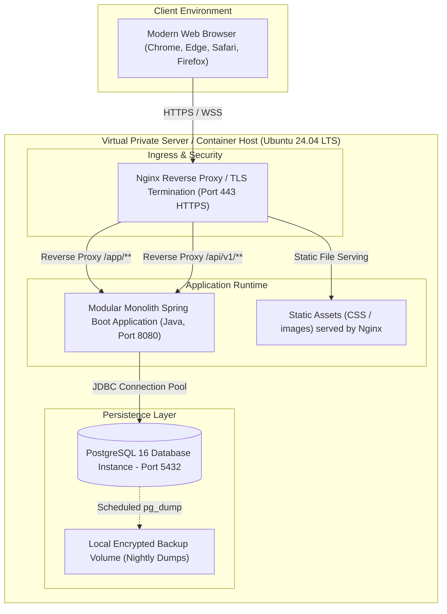

### 16.2 Runtime Components & Technology Stack
- **Client Delivery:** Server-rendered pages produced by **Spring MVC + JSP**, styled with clean vanilla CSS design tokens. No client-side SPA framework and no JavaScript build/bundling pipeline is required.
- **Application Server:** **Java + Spring Boot** structured as a modular monolithic backend, exposing both Spring MVC page controllers (JSP views) and REST controllers under `/api/v1` over a **single shared application/service layer**. Persistence via **Hibernate / JPA**. Security via **Spring Security**. API documentation generated with **Swagger / OpenAPI**, conformant to — and never authoritative over — `KCPC-MKT-API-001`.
- **Database Engine:** PostgreSQL 16+ Relational Database.
- **Process Supervision:** systemd unit (or the container runtime's restart policy under Docker) supervising the Spring Boot process, with automatic crash recovery.
- **Reverse Proxy / TLS:** Nginx with Let's Encrypt automated TLS certificate management.

### 16.3 Environment Strategy
- **Development (`DEV`):** Local developer environments with Dockerized PostgreSQL.
- **Test / Staging (`UAT`):** Dedicated staging VM for CEO and stakeholder acceptance testing.
- **Production (`PROD`):** Dedicated production VM with daily automated backups and uptime monitoring.

---

## 17. Availability, Capacity & Operational Resilience

### 17.1 Concurrency Sizing & Capacity Boundary
- **Sizing Baseline:** Designed for **$< 15$ concurrent internal users** (Engineering Sizing Assumption: typical active concurrency 3–8 marketing staff).
- **Database Connection Pooling:** Configured with modest headroom (Initial Architecture Recommendation: 20 max connections).
- **Server Specifications:** 2 vCPU, 4GB RAM virtual server (Engineering Sizing Assumption).

### 17.2 Availability Target & Resilience
- **Target:** $\ge 99.0\%$ operational availability (24×7 standard), permitting $< 7.2$ hours of unscheduled downtime per month (*Source-Derived Requirement*).
- **Crash Recovery:** Automatic process restart via process manager (*Initial Architecture Recommendation*).
- **Maintenance Windows:** Off-peak scheduled maintenance, proposed for Sundays 02:00–04:00 IST (*Proposed Operational Maintenance Window — Pending Operational Approval*).

---

## 18. Backup, Recovery, Export & Business OS Transition

### 18.1 Automated Backup & Disaster Recovery Guidelines
- **Automated Nightly Backups:** Execution of `pg_dump` every 24 hours at 03:00 IST with Gzip compression and AES-256 encryption (*Initial Architecture Recommendation*).
- **Backup Retention:** 30 daily snapshots retained locally and mirrored to secure off-site secondary storage (*Initial Architecture Recommendation*).
- **Recovery Targets (Operational Recommendations):**
  - *Recovery Point Objective (RPO):* $\le 24\ \text{hours}$ (*Architecture Recommendation — Pending Operational Approval*).
  - *Recovery Time Objective (RTO):* $\le 2\ \text{hours}$ (*Architecture Recommendation — Pending Operational Approval*).

### 18.2 Structured Data Export Engine
To satisfy `SRS-REQ-081`, the application provides a dedicated Export Engine:
- **Comprehensive JSON Export:** Complete, unflattened relational graph including all Content Plans, Planned Outputs, Review Decisions, Marks Ledgers, Publication Events, Scorecards, and Audit Logs.
- **Tabular CSV / XLSX Export:** Flattened operational summaries organized by lifecycle stage for business reporting and spreadsheet analysis.

### 18.3 Future KCPC Business OS Transition Strategy
The MVP is explicitly temporary (6–8 month lifespan). The data architecture supports future migration:
1. All domain entities use standard SQL types and UUIDv7 primary keys.
2. Complete audit histories are exportable in standardized JSON format.
3. No proprietary, vendor-locked database features are used.
4. Clean entity boundaries allow direct ETL extraction into the future KCPC Business OS database.

---

## 19. Observability & Operational Support

### 19.1 Operational Logging vs Immutable Business Audit
The system maintains a strict architectural separation between operational logs and business audit trails:

| Dimension          | Technical Operational Logs                                   | Business Audit Trail (`system_audit_log`)                      |
| :----------------- | :----------------------------------------------------------- | :------------------------------------------------------------- |
| **Purpose**        | Server diagnostics, performance monitoring, crash debugging. | Legal, compliance, Marks, and workflow governance.             |
| **Storage Target** | Log files (`/var/log/app/`) / stdout rotated via logrotate.  | PostgreSQL relational table with revoked DELETE privileges.    |
| **Content**        | Stack traces, HTTP status codes, SQL execution latency.      | Actor ID, permission ID, previous/new state, business reasons. |
| **Retention**      | 14–30 days rolling.                                          | Permanent (entire 6–8 month MVP lifespan and export).          |

### 19.2 Health Checks & Monitoring
- **Health Endpoint (`GET /api/health`):** Validates web server responsiveness, database connectivity, and disk storage threshold (*Initial Architecture Recommendation*).
- **Uptime Monitoring:** External lightweight HTTP ping monitor alerting administrators via email/SMS if endpoint fails (*Initial Architecture Recommendation*).

---

## 20. Architecture Decision Register (ADR)

This section formally records the architecture-level resolutions and downstream handoff statuses for all **8 SRS Downstream Design Decisions (`DDD-001` through `DDD-008`)** and overarching technical choices:

| ADR ID          | Source SRS DDD | Decision Topic                             | Selected Architectural Decision                                                             | Rationale                                                                                                                                                        | Downstream Impact & Artifact                                                              |                            Status                             |
| :-------------- | :------------- | :----------------------------------------- | :------------------------------------------------------------------------------------------ | :--------------------------------------------------------------------------------------------------------------------------------------------------------------- | :---------------------------------------------------------------------------------------- | :-----------------------------------------------------------: |
| **SAD-ADR-001** | `DDD-001`      | User Authentication Mechanism              | **Spring Security with signed JWT delivered via a Secure, HttpOnly, SameSite cookie, backed by a server-side token registry (`ERD-TBL-002`) enabling immediate revocation. Revised under R3.5; supersedes the R3.4 server-managed-session decision and its JWT prohibition.** | Preserves every governed security outcome while matching the implementing team's proven stack. The token is **deliberately stateful**: every authenticated request revalidates the token against the registry and the account's current active status, so logout and CEO account deactivation take effect immediately (`SRS-REQ-003`, `SRS-REQ-005`, `AC-003.1`, `AC-003.2`). The token is **never** placed in `localStorage` or any script-readable store. Because the token travels in an automatically-attached cookie, **CSRF protection applies to every state-changing request authenticated by that cookie** — both `/app/**` MVC form submissions and cookie-authenticated `/api/v1/**` `POST`/`PUT`/`PATCH`/`DELETE` calls — using Spring Security's synchronizer-token pattern reinforced by `SameSite=Lax`; `GET`/`HEAD` are non-mutating and exempt. The cookie is scoped **`Path=/`** so that one token authenticates both the `/app/**` server-rendered pages and the `/api/v1/**` REST contract; a `/api/v1`-scoped cookie would not reach the JSP application. These are technical controls realizing existing governed outcomes and introduce no new business requirement. | Token claims, cookie attributes, registry fields and authentication routes defined in the API & ERD specs (`ERD-TBL-002`, `API-OP-001/002/003`). | **Resolved at Architecture Level (R3.5)** |
| **SAD-ADR-002** | `DDD-002`      | Physical Database Engine & Schema Strategy | **PostgreSQL 16+ Relational Database with strict ACID Foreign Keys.**                       | Robust transactional integrity, rich constraint support, native `JSONB` for audit snapshots, zero licensing costs.                                               | Physical tables, column types, and indexes deferred to ERD / Data Dictionary. **R3.5 note:** PostgreSQL 16+ is **retained unchanged**; object-relational access is realized through **Hibernate / JPA**. The ERD remains the physical source of truth — business tables are **not** redesigned to suit an ORM, and `JSONB`, CHECK constraints and append-only audit privileges are unaffected. | **Architecture Direction Resolved — Physical Design Pending** |
| **SAD-ADR-003** | `DDD-003`      | Timezone, Date Semantics & Precision       | **UTC Timestamp Storage with Explicit IST (UTC+5:30) Business Display & Calendar Offsets.** | Eliminates server-locale ambiguities while correctly evaluating calendar-day offsets (-5d, -2d, +2d) and monthly Content ID sequence resets in IST.              | Formatted date serializers implemented in API & UI specs.                                 |              **Resolved at Architecture Level**               |
| **SAD-ADR-004** | `DDD-004`      | Folder Link & Evidence URL Validation      | **Server-Side Syntactic URL Regex Validation without Outbound HTTP Probing.**               | Fast, zero external network dependencies, complies strictly with out-of-scope boundaries prohibiting external API/HTTP scraping.                                 | Exact field-level regex patterns defined in API & UI specs.                               |  **Architecture Direction Resolved — API/UI Detail Pending**  |
| **SAD-ADR-005** | `DDD-005`      | API Style & Topography Strategy            | **RESTful JSON API over HTTPS with Unified Error Handling.**                                | Industry-standard, highly testable, clean authorization binding. **R3.5 note:** the REST architecture and all governed operation IDs are **retained**. Spring MVC page controllers and REST controllers call the **same application/service layer** — JSP pages never issue HTTP calls back into the application, and business, workflow, permission and validation logic exists in exactly one place. **Swagger / OpenAPI** documents the retained API; generated output must conform to `KCPC-MKT-API-001`, which remains authoritative for business contract semantics.                             | Specific HTTP endpoints, payloads, and response schemas defined in API Spec.              |   **Architecture Direction Resolved — API Detail Pending**    |
| **SAD-ADR-006** | `DDD-006`      | UI Architecture & Responsive Layout        | **Spring MVC + JSP server-rendered pages with custom CSS design tokens and role-scoped layout shells. Revised under R3.5; supersedes the R3.4 React 18+ / TypeScript SPA decision.** | Matches the implementing team's proven stack; removes the JavaScript build/bundling pipeline and the client-side state layer for a small internal MVP. Role-tailored navigation shells, permission-filtered controls, validation states and empty/error/no-permission behaviour are **preserved as governed** — the rendering technology changes, the user-facing behaviour does not. The view layer is **never** a security authority: JSP renders what the server has already authorized. | Screen layouts, colour palette, wireframes and CSS tokens defined in UI/UX Spec. | **Architecture Direction Resolved — UI/UX Detail Pending (R3.5)** |
| **SAD-ADR-007** | `DDD-007`      | Audit Log Storage Strategy                 | **Append-Only PostgreSQL Table with Revoked UPDATE/DELETE Privileges.**                     | ACID transaction coordination with business data, simple SQL querying, zero external SIEM infrastructure required for MVP.                                       | Physical audit DDL, partition strategy, and query views defined in ERD & Data Dictionary. | **Architecture Direction Resolved — Physical Design Pending** |
| **SAD-ADR-008** | `DDD-008`      | Operational Data Export File Format        | **Multi-Format Export Engine: Comprehensive JSON + Tabular CSV/XLSX.**                      | JSON preserves full hierarchical relational graph and audit history for Business OS; CSV/XLSX satisfies human review and spreadsheet reporting.                  | Export serialization schemas and API endpoints defined in API & Data specs.               | **Architecture Direction Resolved — Data/API Detail Pending** |
| **SAD-ADR-009** | N/A            | Application Architecture Style             | **Modular Monolith in a Single Deployable Unit.**                                           | Avoids distributed network latency, deployment complexity, and operational overhead of microservices for $<15$ users.                                            | Internal module code structure governed by software engineering team.                     |              **Resolved at Architecture Level**               |
| **SAD-ADR-010** | N/A            | Deployment & Infrastructure Topology       | **Single Linux VPS (Ubuntu 24.04 LTS) with Nginx reverse proxy, a Docker-compatible Java/Spring Boot application, and PostgreSQL 16+. Revised under R3.5; supersedes the R3.4 Node.js runtime.** | Low cost, rapid setup, minimal operational moving parts, simple backup and recovery. Docker Compose may be used if convenient. **No orchestration platform, service mesh or cloud-platform tooling is required or authorized** — the system serves fewer than 15 concurrent internal users (`SRS-REQ-079`). | Provisioning scripts and hosting setup managed by DevOps team. | **Resolved at Architecture Level (R3.5)** |

---

## 21. Business Clarifications Register (Resolved)

In strict accordance with governance standards, the SAD records the **2 business clarifications** (`SC-REQ-001`, `SC-REQ-002`) identified in `KCPC-MKT-SRS-001 Section 13.1` — **now RESOLVED** by stakeholder decision (August 11, 2026) and recorded in the BFD SSOT `v1.5.0` — without inventing arbitrary business policies:

| Clarification ID | Source Reference                                       | Issue Summary                                                                             | Technical Safety Boundary Established in SAD                                                                                                                                                                                                                                                                                                 |                        Status                        |
| :--------------- | :----------------------------------------------------- | :---------------------------------------------------------------------------------------- | :------------------------------------------------------------------------------------------------------------------------------------------------------------------------------------------------------------------------------------------------------------------------------------------------------------------------------------------- | :--------------------------------------------------: |
| **SC-REQ-001**   | `BRS-REQ-050` / `AC-050.3` / `SRS-REQ-089`             | **Scorecard Metric Division-by-Zero Handling** (Plays = 0 or Impressions = 0).            | **RESOLVED (Aug 11, 2026):** the derived rate is recorded as `N/A` when the denominator (Plays / Video length / Impressions) is 0 — identical to platform-N/A suppression — and excluded from averages and KPI aggregations; never 0, never a division error. | **RESOLVED** |
| **SC-REQ-002**   | `BRS-REQ-050` / `AC-050.2`, `AC-050.4` / `SRS-REQ-088` | **Partial / Incomplete Performance Metric Entry Treatment** (Missing fields on Due Date). | **RESOLVED (Aug 11, 2026):** the scorecard supports an editable DRAFT lifecycle — a partial/incomplete scorecard is saved and revised (`submitted_at IS NULL`), then validated and sealed immutable on explicit Submit, which completes the obligation and progresses the workflow. | **RESOLVED** |

---

## 22. Downstream Design Handoffs

### 22.1 ERD & Physical Data Dictionary Handoff
The upcoming **Entity-Relationship Diagram (ERD) & Physical Data Dictionary** specification shall derive directly from SAD Section 10:
- Physical table definitions for all 10 domain areas;
- PostgreSQL data types (UUIDv7, TIMESTAMPTZ, VARCHAR, INTEGER, NUMERIC(3,1), JSONB, BOOLEAN);
- Explicit Foreign Key constraints, ON DELETE RESTRICT rules, and unique compound indexes;
- Check constraints enforcing Marks values `[0.0, 0.5, 1.0, 2.0, 3.0]`, Reel Types, Output Types, and Role Types.

### 22.2 API Specification Handoff
The upcoming **API Specification** shall derive directly from SAD Section 7 and SAD-ADR-005:
- RESTful HTTP route catalog under `/api/v1/` grouped by domain component;
- Standardized request/response JSON schemas;
- HTTP status codes (200 OK, 201 Created, 400 Bad Request, 401 Unauthorized, 403 Forbidden, 404 Not Found, 409 Conflict, 500 Internal Error);
- Server-side authorization middleware annotations on every route specifying required internal access classes and Operational Permission IDs.

### 22.3 UI/UX Design Specification Handoff
The upcoming **UI/UX Design Specification** shall derive directly from SAD Section 6 and SAD-ADR-006:
- Screen layout specifications for CEO Governance, Marketing Manager Operations, and Employee Self-Service workspaces;
- Dedicated Idea Submission Form layout;
- Interactive Planning, Shooting, Editing, Publishing, and Performance workspaces;
- Visual feedback components for review gates, Marks awards, and delay alerts.

### 22.4 QA & Test Engineering Handoff
The upcoming **Quality Assurance & Verification Strategy** shall derive test scenarios from SAD Sections 8, 9, 10, 11, 12, and 13:
- State machine transition boundary tests (verifying all 22 statuses and prohibition of manual status edits);
- Delegated self-review boundary tests (verifying that permitted delegated Employees cannot make **any** review decision — Approve or Request Rework, and for Idea Review also Reject/Retain — on their own submitted, prepared, or executed work);
- Predefined Marks vs Personal Attribution tests (verifying zero splitting/averaging, verify no PersonalMarkAttribution record is created on rework or publishing, and no additional PersonalMarkAttribution record is created on reposts);
- Database immutability verification tests (verifying SQL UPDATE/DELETE rejection on audit tables);
- Performance Due Date offset and deterministic 30-KPI calculation verification tests.

---

## 23. SAD Design Element Catalogue & Architecture Traceability Matrix

### 23.1 Normative SAD Design Element Catalogue (SAD-DES-001..034)

This catalogue establishes the authoritative definition for all **34 Architectural Design Elements** implementing the system (R3.4 added `SAD-DES-033`/`SAD-DES-034`):

| Design ID       | Design Title                                                                        | Source SRS Requirement(s)                                                                                              | Architectural Behavior / Constraint                                                                                                                                                                                                                                    | Responsible Component(s)                       | Related ADR(s)                                                            | Verification Basis                                                                                                           | Downstream Dependency                   |
| :-------------- | :---------------------------------------------------------------------------------- | :--------------------------------------------------------------------------------------------------------------------- | :--------------------------------------------------------------------------------------------------------------------------------------------------------------------------------------------------------------------------------------------------------------------- | :--------------------------------------------- | :------------------------------------------------------------------------ | :--------------------------------------------------------------------------------------------------------------------------- | :-------------------------------------- |
| **SAD-DES-001** | Shared Authentication, Role Landing & Session Management                            | `SRS-REQ-001`, `SRS-REQ-077`                                                                                           | Authenticates users via Spring Security and a signed JWT delivered in a Secure, HttpOnly, SameSite cookie scoped `Path=/` (so one token serves both `/app/**` and `/api/v1/**`), revalidated server-side against the token registry (`ERD-TBL-002`) and the account's active status on every request, then routes to role-specific landing views (CEO Governance, Manager Operations, Employee Self-Service). Revised realization under R3.5 (`SAD-ADR-001`); the governed authentication and landing behaviour is unchanged.                                                                                                             | `SAD-COMP-001`                                 | `SAD-ADR-001`, `SAD-ADR-006`                                              | Auth session handshake & role routing test.                                                                                  | API Spec / UI Spec                      |
| **SAD-DES-002** | Server-Authoritative RBAC & Access Boundary Enforcement                             | `SRS-REQ-002`, `SRS-REQ-010`                                                                                           | Enforces server-side authorization middleware on all routes; hides unauthorized UI controls while blocking direct unauthorized HTTP requests.                                                                                                                          | `SAD-COMP-001`                                 | `SAD-ADR-001`, `SAD-ADR-005`                                              | Unauthorized URL/API penetration tests.                                                                                      | API Spec / UI Spec                      |
| **SAD-DES-003** | Exclusive CEO User Account & Business Role Administration                           | `SRS-REQ-003`, `SRS-REQ-004`, `SRS-REQ-005`, `SRS-REQ-092`                                                             | Restricts user creation, activation/deactivation, and **Business Role** assignment/modification exclusively to CEO users with mandatory reason capture; the assigned Business Role resolves to one internal access class (see `SAD-DES-033`).                            | `SAD-COMP-001`, `SAD-COMP-010`                 | `SAD-ADR-001`, `SAD-ADR-007`                                              | Non-CEO access rejection & audit write test.                                                                                 | ERD / API Spec / UI Spec                |
| **SAD-DES-004** | 17-Permission Catalogue & Real-Time Dynamic Enforcement                             | `SRS-REQ-006`, `SRS-REQ-007`, `SRS-REQ-008`, `SRS-REQ-009`                                                             | Implements runtime evaluation of CEO-granted permissions (Permissions #1–#17) with scope (Global, Stage, Item) and active date validity.                                                                                                                               | `SAD-COMP-001`                                 | `SAD-ADR-001`, `SAD-ADR-002`, `SAD-ADR-003`                               | Real-time grant/revoke & expiry boundary tests.                                                                              | ERD / API Spec / UI Spec                |
| **SAD-DES-005** | Anti-Delegation & Delegated Self-Approval Prevention Barrier                        | `SRS-REQ-011`, `SRS-REQ-012`                                                                                           | Blocks onward permission delegation by non-CEO users and prevents delegated Employees from making **any** review decision (Approve/Request Rework; Idea Review also Reject/Retain) on their own submitted, prepared, or executed work.                                                                                                                                | `SAD-COMP-001`                                 | `SAD-ADR-001`, `SAD-ADR-005`                                              | Self-review decision-rejection tests (Approve and Request Rework) across all review gates.                                                                   | API Spec / Test Design                  |
| **SAD-DES-006** | Administrative Access Audit & Security Event Logging                                | `SRS-REQ-005`, `SRS-REQ-007`, `SRS-REQ-013`, `SRS-REQ-063`, `SRS-REQ-064`, `SRS-REQ-065`                               | Captures append-only immutable audit records for all access administration events, permission exercises, and security rejections.                                                                                                                                      | `SAD-COMP-001`, `SAD-COMP-010`                 | `SAD-ADR-007`                                                             | Database-level SQL UPDATE/DELETE rejection test.                                                                             | ERD / Database DDL                      |
| **SAD-DES-007** | Dedicated Idea Submission Form & Unique Identifier Engine                           | `SRS-REQ-014`, `SRS-REQ-015`, `SRS-REQ-084`                                                                            | Renders multi-role Idea Form (Title mandatory, Reference Link/Note optional, Remarks optional) and generates unique `IDEA-YYYYMMDD-NNNN`.                                                                                                                              | `SAD-COMP-002`                                 | `SAD-ADR-002`, `SAD-ADR-006`                                              | Field validation & sequential ID uniqueness test.                                                                            | ERD / API Spec / UI Spec                |
| **SAD-DES-008** | Idea Evaluation Gate, Rejection & Dormant Retained Lifecycle                        | `SRS-REQ-016`, `SRS-REQ-017`, `SRS-REQ-018`, `SRS-REQ-019`                                                             | Implements Stage 2 review gate (Approve $\rightarrow$ Planning, Reject with mandatory reason $\rightarrow$ Terminal, Retain $\rightarrow$ Dormant, Reopen Retained $\rightarrow$ Pending Approval).                                                                    | `SAD-COMP-002`, `SAD-COMP-008`                 | `SAD-ADR-002`, `SAD-ADR-005`, `SAD-ADR-007`                               | State machine transition & mandatory reason test.                                                                            | ERD / API Spec / UI Spec                |
| **SAD-DES-009** | Predefined Role Marks Definition, Capture & Immutable Correction                    | `SRS-REQ-085`, `SRS-REQ-090`                                                                                           | Captures predefined Cameraperson and Editor Marks from `[0, 0.5, 1.0, 2.0, 3.0]` at Idea Approval; supports linked immutable corrections under Permission #1.                                                                                                          | `SAD-COMP-002`, `SAD-COMP-005`, `SAD-COMP-010` | `SAD-ADR-002`, `SAD-ADR-007`                                              | Closed set validation & correction audit linkage test.                                                                       | ERD / API Spec / UI Spec                |
| **SAD-DES-010** | Content Identity Model & Planning Entry Monthly Sequence Reset                      | `SRS-REQ-020`                                                                                                          | Generates single `C-MMYY-NNNN` atomically during Idea Approval as the approved Idea transitions into Planning (no separate Planning-entry step), resetting sequence on 1st of month in IST business calendar.                                                                                                                            | `SAD-COMP-003`                                 | `SAD-ADR-002`, `SAD-ADR-003`                                              | Month-rollover ID reset & single-identity invariant test.                                                                    | ERD / API Spec                          |
| **SAD-DES-011** | Planning Parameter Definition & Category Text Capture                               | `SRS-REQ-021`                                                                                                           | Captures optional manual free-text Category (`category_text TEXT NULLABLE`), Content Priority (Low/Med/High), Models/Talent multi-selection, and SKU reference/NA at Stage 3 Planning without foreign keys or catalogue tables. | `SAD-COMP-003`, `SAD-COMP-010`                 | `SAD-ADR-002`                                                             | Parameter validation & nullable free-text Category test.                                                                     | ERD / API Spec / UI Spec                |
| **SAD-DES-012** | Multi-Asset Planned Output Grouping & Controlled Output/Reel Taxonomy               | `SRS-REQ-023`, `SRS-REQ-024`, `SRS-REQ-062`                                                                            | Groups 1..N Planned Outputs (Photography, Reel, Video) under single Content ID; binds Reel Type (Very Short, Short, Long) exclusively to Reels; governs controlled output and reel taxonomies.                                   | `SAD-COMP-003`                                 | `SAD-ADR-002`                                                             | Output grouping & conditional Reel Type schema test.                                                                         | ERD / API Spec / UI Spec                |
| **SAD-DES-013** | Publication Scope Mapping & Shared Planned Live Date Engine                         | `SRS-REQ-025`, `SRS-REQ-026`                                                                                           | Maps Planned Outputs to intended Publication Targets and binds deliverables to a shared approved Planned Live Date.                                                                                                                                                    | `SAD-COMP-003`                                 | `SAD-ADR-002`, `SAD-ADR-003`                                              | Scope mapping join & shared date propagation test.                                                                           | ERD / API Spec / UI Spec                |
| **SAD-DES-014** | Automated Stage Scheduling Offset Engine (Standard −5d / −2d) & Manual Override     | `SRS-REQ-027`                                                                                                          | Under **Standard** Planning Mode, computes default Planned Shoot Date (−5d) and Planned Edit Date (−2d) from Planned Live Date with authorized manual override; under **Urgent** mode the offset engine is not applied (see `SAD-DES-034`).                               | `SAD-COMP-003`                                 | `SAD-ADR-003`                                                             | Offset calculation & manual override audit test.                                                                             | ERD / API Spec / UI Spec                |
| **SAD-DES-015** | Content Asset Folder Hyperlink Storage & Review Gate Prerequisite                   | `SRS-REQ-028`, `SRS-REQ-032`                                                                                           | Stores Google Drive folder URL under Permission #13; blocks Shoot Review submission if folder link is missing.                                                                                                                                                         | `SAD-COMP-003`, `SAD-COMP-004`                 | `SAD-ADR-004`                                                             | URL syntax regex & review gate submission guard test.                                                                        | ERD / API Spec / UI Spec                |
| **SAD-DES-016** | Planning Review Gate, Approval & Task Activation Engine                             | `SRS-REQ-029`, `SRS-REQ-030`                                                                                           | Implements Planning Review gate (Approve $\rightarrow$ Planning Approved $\rightarrow$ Shoot Assigned task activation, Request Rework $\rightarrow$ Planning).                                                                                                         | `SAD-COMP-003`, `SAD-COMP-008`                 | `SAD-ADR-002`, `SAD-ADR-005`                                              | Task activation & rework transition test.                                                                                    | ERD / API Spec / UI Spec                |
| **SAD-DES-017** | Human-Controlled Shooting Assignment & Task Execution Lifecycle                     | `SRS-REQ-022`, `SRS-REQ-031`, `SRS-REQ-040`                                                                            | Supports manual assignment of multiple Camerapersons in Planning; transitions to Shoot In Progress upon execution; blocks algorithmic allocation.                                                                                                                      | `SAD-COMP-003`, `SAD-COMP-004`                 | `SAD-ADR-002`, `SAD-ADR-005`                                              | Multi-assignee support & execution transition test.                                                                          | ERD / API Spec / UI Spec                |
| **SAD-DES-018** | Shoot Review Gate, Approval & Cameraperson Personal Mark Attribution                | `SRS-REQ-033`, `SRS-REQ-034`, `SRS-REQ-086`                                                                            | Implements Shoot Review gate; upon approval awards full predefined Mark to each qualifying Cameraperson (no personal Mark attribution record is created on Request Rework).                                                                                            | `SAD-COMP-004`, `SAD-COMP-005`, `SAD-COMP-008` | `SAD-ADR-002`, `SAD-ADR-005`                                              | Full mark attribution & verify no PersonalMarkAttribution record created on Request Rework.                                  | ERD / API Spec / UI Spec                |
| **SAD-DES-019** | Post-Shoot Editor Assignment & Editing Task Execution Lifecycle                     | `SRS-REQ-035`, `SRS-REQ-036`, `SRS-REQ-039`, `SRS-REQ-040`                                                             | Enables initial Editor assignment exclusively post-Shoot Approval under Permission #6; displays contextual workload counts.                                                                                                                                            | `SAD-COMP-004`, `SAD-COMP-008`, `SAD-COMP-009` | `SAD-ADR-002`, `SAD-ADR-005`                                              | Post-shoot eligibility guard & workload count test.                                                                          | ERD / API Spec / UI Spec                |
| **SAD-DES-020** | Edit Review Gate, Approval & Editor Personal Mark Attribution                       | `SRS-REQ-037`, `SRS-REQ-038`, `SRS-REQ-087`                                                                            | Implements Edit Review gate; upon approval awards full predefined Mark to each qualifying Editor (no personal Mark attribution record is created on Request Rework); moves to Ready for Publishing.                                                                    | `SAD-COMP-004`, `SAD-COMP-005`, `SAD-COMP-008` | `SAD-ADR-002`, `SAD-ADR-005`                                              | Full mark attribution, verify no PersonalMarkAttribution record created on Request Rework, & publishing readiness test.      | ERD / API Spec / UI Spec                |
| **SAD-DES-021** | Multi-Channel Publishing Triggering & Manual Event Capture Engine                   | `SRS-REQ-041`, `SRS-REQ-042`, `SRS-REQ-043`                                                                            | Coordinates publishing workspace; records discrete `ActualPublicationEvent` records (`Original`/`Repost`) referencing specific output & target; Publishing creates no personal Mark attribution record; Repost creates no additional personal Mark attribution record. | `SAD-COMP-006`, `SAD-COMP-008`                 | `SAD-ADR-002`, `SAD-ADR-003`                                              | Verify Publishing creates no PersonalMarkAttribution record and Repost creates no additional PersonalMarkAttribution record. | ERD / API Spec / UI Spec                |
| **SAD-DES-022** | Late Actual Publication Schedule Analysis & Evidence Correction                     | `SRS-REQ-044`, `SRS-REQ-046`                                                                                           | Records late publication timestamps without schedule distortion; supports linked immutable evidence URL corrections under Permission #8.                                                                                                                               | `SAD-COMP-006`, `SAD-COMP-009`, `SAD-COMP-010` | `SAD-ADR-003`, `SAD-ADR-004`, `SAD-ADR-007`                               | Late timestamp analysis & evidence audit chain test.                                                                         | ERD / API Spec / UI Spec                |
| **SAD-DES-023** | Publication Target N/A Exception & Reversal/Supersession Lifecycle                  | `SRS-REQ-045`, `SRS-REQ-047`                                                                                           | Records Target N/A with mandatory reason; supports reversal; blocks completion transition if all planned targets are marked N/A.                                                                                                                                       | `SAD-COMP-006`, `SAD-COMP-008`                 | `SAD-ADR-002`, `SAD-ADR-007`                                              | All-NA blocking guard & reversal restoration test.                                                                           | ERD / API Spec / UI Spec                |
| **SAD-DES-024** | Performance Pending State Transition & Non-Reschedulable Due Date Calculation (+2d) | `SRS-REQ-048`, `SRS-REQ-049`                                                                                           | Transitions to Performance Pending upon publishing scope completion; computes `Performance Due Date = Actual + 2d` (non-reschedulable).                                                                                                                                | `SAD-COMP-007`, `SAD-COMP-008`                 | `SAD-ADR-002`, `SAD-ADR-003`                                              | +2d calendar calculation & non-reschedule guard test.                                                                        | ERD / API Spec                          |
| **SAD-DES-025** | Scorecard Manual Entry, Deterministic Metric Calculation & Linked Correction        | `SRS-REQ-050`, `SRS-REQ-051`, `SRS-REQ-088`, `SRS-REQ-089`                                                             | Captures raw scorecard inputs; supports an editable draft-then-submit lifecycle (`SC-REQ-002`, resolved) and records `N/A` for zero-denominator rates (`SC-REQ-001`, resolved); executes deterministic Hook Rate, Hold Rate, CTR formulas; manages linked immutable metric corrections under Permission #9.                                                                                                             | `SAD-COMP-007`, `SAD-COMP-010`                 | `SAD-ADR-002`, `SAD-ADR-005`, `SAD-ADR-007`                               | Mathematical formula verification & metric correction test.                                                                  | ERD / API Spec / UI Spec                |
| **SAD-DES-026** | Deliverable Completion Verification & Multi-Path Reopening Engine                   | `SRS-REQ-052`, `SRS-REQ-053`, `SRS-REQ-054`, `SRS-REQ-055`                                                             | Transitions deliverable to Completed (Closed/Reopenable); supports reopen for publishing (Perm #8) or exclusively for metric correction (Perm #9).                                                                                                                     | `SAD-COMP-006`, `SAD-COMP-007`, `SAD-COMP-008` | `SAD-ADR-002`, `SAD-ADR-007`                                              | Completion validation & dual-reopen path test.                                                                               | ERD / API Spec / UI Spec                |
| **SAD-DES-027** | Cross-Stage Hold/Resume, Rescheduling, Reassignment & Cancellation Governance        | `SRS-REQ-056`, `SRS-REQ-057`, `SRS-REQ-058`, `SRS-REQ-059`, `SRS-REQ-091`                                             | Executes operational Hold/Resume in SIP and ED (BR-063 / SRS-REQ-091), Reschedule (Perm #10), Reassign with task reset (Perm #11), Cancel pre-first-completion (Perm #12); blocks post-completion cancellation.                                     | `SAD-COMP-004`, `SAD-COMP-007`, `SAD-COMP-008`, `SAD-COMP-010` | `SAD-ADR-002`, `SAD-ADR-003`, `SAD-ADR-005`, `SAD-ADR-007`                | Administrative command execution, hold cycle history & post-completion block test.                                           | ERD / API Spec / UI Spec                |
| **SAD-DES-028** | Master Publishing Catalogue Maintenance & Configuration Management                  | `SRS-REQ-060`, `SRS-REQ-061`                                                                                           | Manages controlled Platform, Company Channel/Account, and Publication Target catalogue entities under Permission #17 with audit logging.                                                                                                                               | `SAD-COMP-010`                                 | `SAD-ADR-002`, `SAD-ADR-007`                                              | Catalogue CRUD authorization & audit write test.                                                                             | ERD / API Spec / UI Spec                |
| **SAD-DES-029** | Employee Self-Service Privacy Barrier & Own-Performance Attribution                 | `SRS-REQ-066`, `SRS-REQ-067`, `SRS-REQ-068`                                                                            | Restricts employee visibility strictly to own tasks, deadlines, own Marks, and 5 personal measures; blocks peer marks/rankings/leaderboards.                                                                                                                           | `SAD-COMP-001`, `SAD-COMP-005`, `SAD-COMP-009` | `SAD-ADR-002`, `SAD-ADR-005`, `SAD-ADR-006`                               | SQL query filtering & peer-privacy isolation test.                                                                           | API Spec / UI Spec / Test               |
| **SAD-DES-030** | Management Aggregate Dashboards & 30-KPI Calculation Engine                         | `SRS-REQ-069`, `SRS-REQ-070`, `SRS-REQ-071`, `SRS-REQ-072`, `SRS-REQ-073`, `SRS-REQ-074`, `SRS-REQ-075`, `SRS-REQ-076` | Computes exact 30 KPIs across 5 governed categories (KPI-001..030); provides aggregate management dashboards under Permissions #14 and #15.                                                                                                                            | `SAD-COMP-001`, `SAD-COMP-009`, `SAD-COMP-010` | `SAD-ADR-003`, `SAD-ADR-005`                                              | 30-KPI computation unit tests & permission access test.                                                                      | API Spec / UI Spec                      |
| **SAD-DES-031** | System State Machine Coordinator & Manual Status Edit Prohibition                   | `SRS-REQ-083`                                                                                                          | Centralizes 22-state lifecycle coordination; rejects direct manual edits to status columns; guarantees command-driven transition integrity.                                                                                                                            | `SAD-COMP-008`                                 | `SAD-ADR-002`, `SAD-ADR-005`                                              | Direct SQL UPDATE rejection & state guard test.                                                                              | ERD / Database DDL / Test               |
| **SAD-DES-032** | Non-Functional Infrastructure, Resilience, Data Export & Operating Environment      | `SRS-REQ-077`, `SRS-REQ-078`, `SRS-REQ-079`, `SRS-REQ-080`, `SRS-REQ-081`, `SRS-REQ-082`                               | Enforces 24x7 $\ge 99\%$ availability, standard modern web browser accessibility across workstations, $<15$ concurrency sizing, zero external API integrations, and multi-format structured export (JSON/CSV/XLSX).                                                    | `SAD-COMP-010`                                 | `SAD-ADR-004`, `SAD-ADR-006`, `SAD-ADR-008`, `SAD-ADR-009`, `SAD-ADR-010` | Web browser compatibility, zero-loss structured export & availability ping tests.                                            | Infrastructure / API Spec / Data Export |
| **SAD-DES-033** | Business Role Catalogue & Access-Class Resolution (R3.4)                             | `SRS-REQ-092`                                                                                                          | Expandable `business_roles` master; user references one Business Role; authorization resolves **user → Business Role → internal access class** (`base_roles`), then evaluates access class + active operational permissions. Ordinary/new roles default to `EMPLOYEE`; no fourth access class; Business Role name never grants a permission; CEO-controlled, audited administration. Modular monolith unchanged.                                              | `SAD-COMP-001`, `SAD-COMP-010`                 | `SAD-ADR-001`, `SAD-ADR-005`, `SAD-ADR-007`                              | Access-class resolution, no-permission-by-name, and seed-count (17) tests.                                                   | ERD / API Spec / UI Spec                |
| **SAD-DES-034** | Planning Mode & Urgent Scheduling Decision (R3.4)                                    | `SRS-REQ-093`                                                                                                          | One Stage-3 Planning entity/workflow carries `planning_mode` (`STANDARD`/`URGENT`) + `urgency_reason`. Standard uses the `SAD-DES-014` offset engine; Urgent suppresses the −5/−2 default derivation, takes manual Shoot/Edit dates + mandatory reason through the same Planning Review gate. Decision rule: Live − current business date `< 5d` ⇒ Urgent required; `= 5d` ⇒ Standard possible; past Live invalid; Urgent may be intentionally chosen at `≥5d`. Independent of Priority; Urgent ≠ Delayed (delay evaluates approved dates); post-approval changes use existing Reschedule. No second workflow. Planned-date chronology `Shoot ≤ Edit ≤ Live` (`ERD-CON-066`); under Urgent, same-day Shoot/Edit (equal dates) is **permitted** (approved by the CEO / Owner (`CEO_OWNER`), 13 August 2026, `KCPC-MKT-DR-R3.4-001`).                                    | `SAD-COMP-003`, `SAD-COMP-008`                 | `SAD-ADR-002`, `SAD-ADR-003`                                             | Standard/Urgent decision, manual-date, same-day-Urgent, mandatory-reason & no-second-workflow tests.                                          | ERD / API Spec / UI Spec                |

---

### 23.2 Architecture Traceability Matrix (SRS -> SAD)

This matrix establishes 100% forward traceability from all **93 SRS Requirements (`SRS-REQ-001` through `SRS-REQ-093`)** to the specific **Architecture Design Elements (`SAD-DES-001` through `SAD-DES-034`)**, Components, and Decision Records (R3.4 added `SRS-REQ-092/093` → `SAD-DES-033/034`):

| SRS Requirement ID | SRS Requirement Title                                                                                   | SAD Design Element ID        | Architectural Component(s)     | Architecture Decision(s)     | Downstream Design Artifact |
| :----------------- | :------------------------------------------------------------------------------------------------------ | :--------------------------- | :----------------------------- | :--------------------------- | :------------------------- |
| `SRS-REQ-001`      | Shared Application Authentication & Role-Appropriate Landing Experience                                 | `SAD-DES-001`                | `SAD-COMP-001`                 | `SAD-ADR-001`, `SAD-ADR-006` | API Spec / UI Spec         |
| `SRS-REQ-002`      | System Access Boundary Enforcement & Screen/Data Scoping                                                | `SAD-DES-002`                | `SAD-COMP-001`                 | `SAD-ADR-001`, `SAD-ADR-005` | API Spec / UI Spec         |
| `SRS-REQ-003`      | Exclusive CEO User Account Management                                                                   | `SAD-DES-003`                | `SAD-COMP-001`                 | `SAD-ADR-001`, `SAD-ADR-007` | ERD / API Spec / UI Spec   |
| `SRS-REQ-004`      | Exclusive CEO Business Role Assignment & Modification                                                       | `SAD-DES-003`                | `SAD-COMP-001`                 | `SAD-ADR-001`, `SAD-ADR-007` | ERD / API Spec / UI Spec   |
| `SRS-REQ-005`      | Account Status Transitions & User Management Audit Logging                                              | `SAD-DES-003`, `SAD-DES-006` | `SAD-COMP-001`, `SAD-COMP-010` | `SAD-ADR-007`                | ERD / API Spec             |
| `SRS-REQ-006`      | Exclusive CEO Operational Permission Administration & 17-Permission Catalogue                           | `SAD-DES-004`                | `SAD-COMP-001`                 | `SAD-ADR-001`, `SAD-ADR-007` | ERD / API Spec / UI Spec   |
| `SRS-REQ-007`      | Real-Time Runtime Permission Validation & Audit Logging                                                 | `SAD-DES-004`, `SAD-DES-006` | `SAD-COMP-001`, `SAD-COMP-010` | `SAD-ADR-001`, `SAD-ADR-007` | API Spec / Test Design     |
| `SRS-REQ-008`      | Operational Permission Granular Scope Configuration                                                     | `SAD-DES-004`                | `SAD-COMP-001`                 | `SAD-ADR-002`                | ERD / API Spec / UI Spec   |
| `SRS-REQ-009`      | Permission Scope, Active Validity, and System Enforcement                                               | `SAD-DES-004`                | `SAD-COMP-001`                 | `SAD-ADR-001`, `SAD-ADR-003` | ERD / API Spec             |
| `SRS-REQ-010`      | Employee Interface Boundary Control for Permission Grants                                               | `SAD-DES-002`                | `SAD-COMP-001`                 | `SAD-ADR-006`                | UI Spec / API Spec         |
| `SRS-REQ-011`      | Prohibition of Onward Permission Delegation                                                             | `SAD-DES-005`                | `SAD-COMP-001`                 | `SAD-ADR-001`, `SAD-ADR-005` | API Spec / Test Design     |
| `SRS-REQ-012`      | Employee Self-Approval Prohibition for Delegated Review Permissions                                     | `SAD-DES-005`                | `SAD-COMP-001`                 | `SAD-ADR-005`                | API Spec / Test Design     |
| `SRS-REQ-013`      | Permission Administration & Exercise Audit Logging                                                      | `SAD-DES-006`                | `SAD-COMP-001`, `SAD-COMP-010` | `SAD-ADR-007`                | ERD / API Spec             |
| `SRS-REQ-014`      | Multi-Role Idea Submission Access via Dedicated Form                                                    | `SAD-DES-007`                | `SAD-COMP-002`                 | `SAD-ADR-006`                | API Spec / UI Spec         |
| `SRS-REQ-015`      | Automated System-Generated Idea ID Assignment                                                           | `SAD-DES-007`                | `SAD-COMP-002`                 | `SAD-ADR-002`                | ERD / API Spec             |
| `SRS-REQ-016`      | Idea Review Evaluation Gate & Decision Enforcement                                                      | `SAD-DES-008`                | `SAD-COMP-002`, `SAD-COMP-008` | `SAD-ADR-002`, `SAD-ADR-005` | ERD / API Spec / UI Spec   |
| `SRS-REQ-017`      | Terminal Idea Rejection Handling                                                                        | `SAD-DES-008`                | `SAD-COMP-002`, `SAD-COMP-008` | `SAD-ADR-007`                | ERD / API Spec / UI Spec   |
| `SRS-REQ-018`      | Dormant Retained Idea Preservation                                                                      | `SAD-DES-008`                | `SAD-COMP-002`, `SAD-COMP-008` | `SAD-ADR-002`                | ERD / API Spec             |
| `SRS-REQ-019`      | Administrative Reopen of Retained Ideas                                                                 | `SAD-DES-008`                | `SAD-COMP-002`, `SAD-COMP-008` | `SAD-ADR-007`                | ERD / API Spec / UI Spec   |
| `SRS-REQ-020`      | Content ID Generation & Single Content Identity Rule                                                    | `SAD-DES-010`                | `SAD-COMP-003`                 | `SAD-ADR-002`, `SAD-ADR-003` | ERD / API Spec             |
| `SRS-REQ-021`      | Non-Assignment Planning Parameter Definition                                                            | `SAD-DES-011`                | `SAD-COMP-003`                 | `SAD-ADR-002`                | ERD / API Spec / UI Spec   |
| `SRS-REQ-022`      | Initial Shooting Assignment during Planning                                                             | `SAD-DES-017`                | `SAD-COMP-003`, `SAD-COMP-004` | `SAD-ADR-002`                | ERD / API Spec / UI Spec   |
| `SRS-REQ-023`      | Planned Output Taxonomy Classification & Multi-Asset Grouping                                           | `SAD-DES-012`                | `SAD-COMP-003`                 | `SAD-ADR-002`                | ERD / API Spec / UI Spec   |
| `SRS-REQ-024`      | Reel Type Duration Attribution per Reel-Type Planned Output                                             | `SAD-DES-012`                | `SAD-COMP-003`                 | `SAD-ADR-002`                | ERD / API Spec / UI Spec   |
| `SRS-REQ-025`      | Intended Publication Scope Mapping                                                                      | `SAD-DES-013`                | `SAD-COMP-003`                 | `SAD-ADR-002`                | ERD / API Spec / UI Spec   |
| `SRS-REQ-026`      | Shared Approved Planned Live Date Model                                                                 | `SAD-DES-013`                | `SAD-COMP-003`                 | `SAD-ADR-003`                | ERD / API Spec / UI Spec   |
| `SRS-REQ-027`      | Default Execution Date Calculation & Manual Override Governance                                         | `SAD-DES-014`                | `SAD-COMP-003`                 | `SAD-ADR-003`                | ERD / API Spec / UI Spec   |
| `SRS-REQ-028`      | Content Asset Folder Link Establishment & Maintenance                                                   | `SAD-DES-015`                | `SAD-COMP-003`                 | `SAD-ADR-004`                | ERD / API Spec / UI Spec   |
| `SRS-REQ-029`      | Planning Review Gate & Rework Handling                                                                  | `SAD-DES-016`                | `SAD-COMP-003`, `SAD-COMP-008` | `SAD-ADR-005`                | ERD / API Spec / UI Spec   |
| `SRS-REQ-030`      | Planning Approval & Task Activation                                                                     | `SAD-DES-016`                | `SAD-COMP-003`, `SAD-COMP-008` | `SAD-ADR-002`                | ERD / API Spec             |
| `SRS-REQ-031`      | Shoot Execution & Shoot In Progress State Transition                                                    | `SAD-DES-017`                | `SAD-COMP-004`, `SAD-COMP-008` | `SAD-ADR-002`                | ERD / API Spec / UI Spec   |
| `SRS-REQ-032`      | Folder Link Prerequisite for Shoot Review Submission                                                    | `SAD-DES-015`                | `SAD-COMP-004`                 | `SAD-ADR-004`                | API Spec / UI Spec / Test  |
| `SRS-REQ-033`      | Shoot Review Gate, Approval, and Rework Handling                                                        | `SAD-DES-018`                | `SAD-COMP-004`, `SAD-COMP-008` | `SAD-ADR-005`                | ERD / API Spec / UI Spec   |
| `SRS-REQ-034`      | Shoot Approval & Post-Shoot Eligibility for Editor Assignment                                           | `SAD-DES-018`                | `SAD-COMP-004`, `SAD-COMP-008` | `SAD-ADR-002`                | API Spec / UI Spec         |
| `SRS-REQ-035`      | Initial Post-Shoot Approval Editor Assignment                                                           | `SAD-DES-019`                | `SAD-COMP-004`                 | `SAD-ADR-002`                | ERD / API Spec / UI Spec   |
| `SRS-REQ-036`      | Edit Assigned Task Activation & Editing Execution                                                       | `SAD-DES-019`                | `SAD-COMP-004`, `SAD-COMP-008` | `SAD-ADR-002`                | ERD / API Spec / UI Spec   |
| `SRS-REQ-037`      | Edit Review Gate, Approval, and Rework Handling                                                         | `SAD-DES-020`                | `SAD-COMP-004`, `SAD-COMP-008` | `SAD-ADR-005`                | ERD / API Spec / UI Spec   |
| `SRS-REQ-038`      | Edit Approval & Transition to Ready for Publishing                                                      | `SAD-DES-020`                | `SAD-COMP-004`, `SAD-COMP-008` | `SAD-ADR-002`                | ERD / API Spec             |
| `SRS-REQ-039`      | Contextual Workload Display during Shooting and Editing Assignments                                     | `SAD-DES-019`                | `SAD-COMP-004`, `SAD-COMP-009` | `SAD-ADR-005`                | API Spec / UI Spec         |
| `SRS-REQ-040`      | Human Assignment Control & Automated Algorithm Prohibition                                              | `SAD-DES-017`, `SAD-DES-019` | `SAD-COMP-004`                 | `SAD-ADR-005`                | Architecture / Policy      |
| `SRS-REQ-041`      | Publishing Stage Triggering & Initiation Governance                                                     | `SAD-DES-021`                | `SAD-COMP-006`, `SAD-COMP-008` | `SAD-ADR-002`                | ERD / API Spec / UI Spec   |
| `SRS-REQ-042`      | Execution of Manual Publishing, Event Type Classification, & Event Recording                            | `SAD-DES-021`                | `SAD-COMP-006`                 | `SAD-ADR-002`                | ERD / API Spec / UI Spec   |
| `SRS-REQ-043`      | Actual Publication Event Traceability & Attribute Capture                                               | `SAD-DES-021`                | `SAD-COMP-006`                 | `SAD-ADR-002`, `SAD-ADR-003` | ERD / API Spec / UI Spec   |
| `SRS-REQ-044`      | Late Actual Publication Recording & Operating Schedule Interpretation                                   | `SAD-DES-022`                | `SAD-COMP-006`, `SAD-COMP-009` | `SAD-ADR-003`                | ERD / API Spec             |
| `SRS-REQ-045`      | Publication Target N/A Exception Recording & Reversal                                                   | `SAD-DES-023`                | `SAD-COMP-006`                 | `SAD-ADR-002`, `SAD-ADR-007` | ERD / API Spec / UI Spec   |
| `SRS-REQ-046`      | Linked Publication Evidence & Link Correction                                                           | `SAD-DES-022`                | `SAD-COMP-006`, `SAD-COMP-010` | `SAD-ADR-004`, `SAD-ADR-007` | ERD / API Spec / UI Spec   |
| `SRS-REQ-047`      | Initial Publishing Scope Completion Rule & Minimum Publication Requirement                              | `SAD-DES-023`                | `SAD-COMP-006`, `SAD-COMP-008` | `SAD-ADR-002`                | API Spec / Test Design     |
| `SRS-REQ-048`      | Performance Pending State Transition & Event Obligation Tracking                                        | `SAD-DES-024`                | `SAD-COMP-007`, `SAD-COMP-008` | `SAD-ADR-002`                | ERD / API Spec             |
| `SRS-REQ-049`      | System-Derived Performance Due Date Calculation                                                         | `SAD-DES-024`                | `SAD-COMP-007`                 | `SAD-ADR-003`                | ERD / API Spec             |
| `SRS-REQ-050`      | Performance Update Eligibility & Stage Activation                                                                     | `SAD-DES-025`                | `SAD-COMP-007`                 | `SAD-ADR-002`                | ERD / API Spec / UI Spec   |
| `SRS-REQ-051`      | Linked Performance Metric Correction Governance                                                         | `SAD-DES-025`                | `SAD-COMP-007`, `SAD-COMP-010` | `SAD-ADR-007`                | ERD / API Spec / UI Spec   |
| `SRS-REQ-052`      | Workflow Completion Rule & Closed / Reopenable Classification                                           | `SAD-DES-026`                | `SAD-COMP-007`, `SAD-COMP-008` | `SAD-ADR-002`                | ERD / API Spec             |
| `SRS-REQ-053`      | Reopen Completed Deliverable for Additional Publication, Repost, Evidence Correction, or N/A Adjustment | `SAD-DES-026`                | `SAD-COMP-006`, `SAD-COMP-008` | `SAD-ADR-007`                | ERD / API Spec / UI Spec   |
| `SRS-REQ-054`      | Reopen Completed Deliverable Exclusively for Metric Correction                                          | `SAD-DES-026`                | `SAD-COMP-007`, `SAD-COMP-008` | `SAD-ADR-007`                | ERD / API Spec / UI Spec   |
| `SRS-REQ-055`      | Exit Condition for Reopened Publishing Activities                                                       | `SAD-DES-026`                | `SAD-COMP-006`, `SAD-COMP-008` | `SAD-ADR-002`                | API Spec / Test Design     |
| `SRS-REQ-056`      | Cross-Stage Reschedule Governance                                                                       | `SAD-DES-027`                | `SAD-COMP-008`, `SAD-COMP-010` | `SAD-ADR-003`, `SAD-ADR-007` | ERD / API Spec / UI Spec   |
| `SRS-REQ-057`      | Reassignment Governance & Task State Reset                                                              | `SAD-DES-027`                | `SAD-COMP-004`, `SAD-COMP-008` | `SAD-ADR-007`                | ERD / API Spec / UI Spec   |
| `SRS-REQ-058`      | Pre-First-Completion Cancellation Governance & Terminal State Transition                                | `SAD-DES-027`                | `SAD-COMP-008`, `SAD-COMP-010` | `SAD-ADR-007`                | ERD / API Spec / UI Spec   |
| `SRS-REQ-059`      | Permanent Post-Completion Cancellation Prohibition                                                      | `SAD-DES-027`                | `SAD-COMP-008`                 | `SAD-ADR-002`                | API Spec / Test Design     |
| `SRS-REQ-060`      | Master Publishing Catalogue Maintenance                                                                 | `SAD-DES-028`                | `SAD-COMP-010`                 | `SAD-ADR-002`                | ERD / API Spec / UI Spec   |
| `SRS-REQ-061`      | Master Catalogue Audit Logging                                                                          | `SAD-DES-028`                | `SAD-COMP-010`                 | `SAD-ADR-007`                | ERD / API Spec             |
| `SRS-REQ-062`      | Controlled Content Taxonomy Governance                                                                  | `SAD-DES-012`                | `SAD-COMP-003`, `SAD-COMP-010` | `SAD-ADR-002`                | ERD / API Spec             |
| `SRS-REQ-063`      | System-Wide Immutable Audit Logging                                                                     | `SAD-DES-006`                | `SAD-COMP-010`                 | `SAD-ADR-007`                | ERD / API Spec             |
| `SRS-REQ-064`      | Audit Trail Immutability & Deletion Prohibition                                                         | `SAD-DES-006`                | `SAD-COMP-010`                 | `SAD-ADR-007`                | ERD / Database DDL         |
| `SRS-REQ-065`      | Relevant Audit-History Visibility Permission                                                            | `SAD-DES-006`                | `SAD-COMP-001`, `SAD-COMP-010` | `SAD-ADR-005`                | API Spec / UI Spec         |
| `SRS-REQ-066`      | Employee Self-Service Own-Work Operational Visibility                                                   | `SAD-DES-029`                | `SAD-COMP-001`, `SAD-COMP-009` | `SAD-ADR-006`                | API Spec / UI Spec         |
| `SRS-REQ-067`      | Peer Privacy Protection & Compensation/Ranking/Marks Boundary                                           | `SAD-DES-029`                | `SAD-COMP-001`, `SAD-COMP-005` | `SAD-ADR-002`, `SAD-ADR-005` | API Spec / Test Design     |
| `SRS-REQ-068`      | Employee Personal Performance Attribution & Approved Indicators                                         | `SAD-DES-029`                | `SAD-COMP-005`, `SAD-COMP-009` | `SAD-ADR-005`                | ERD / API Spec / UI Spec   |
| `SRS-REQ-069`      | Team Workload Visibility Permission & Aggregate Boundaries                                              | `SAD-DES-030`                | `SAD-COMP-001`, `SAD-COMP-009` | `SAD-ADR-005`                | API Spec / UI Spec         |
| `SRS-REQ-070`      | Team KPI Visibility Permission & Aggregate Boundaries                                                   | `SAD-DES-030`                | `SAD-COMP-001`, `SAD-COMP-009` | `SAD-ADR-005`                | API Spec / UI Spec         |
| `SRS-REQ-071`      | Operational KPIs Capture & Reporting (KPI-001 through KPI-007)                                          | `SAD-DES-030`                | `SAD-COMP-009`                 | `SAD-ADR-005`                | API Spec / UI Spec         |
| `SRS-REQ-072`      | Productivity KPIs Capture & Reporting (KPI-008 through KPI-011)                                         | `SAD-DES-030`                | `SAD-COMP-009`                 | `SAD-ADR-005`                | API Spec / UI Spec         |
| `SRS-REQ-073`      | Content & Published Unit KPIs Capture & Reporting (KPI-012 through KPI-020)                             | `SAD-DES-030`                | `SAD-COMP-009`                 | `SAD-ADR-005`                | API Spec / UI Spec         |
| `SRS-REQ-074`      | Approval & Review KPIs Capture & Reporting (KPI-021 through KPI-024)                                    | `SAD-DES-030`                | `SAD-COMP-009`                 | `SAD-ADR-005`                | API Spec / UI Spec         |
| `SRS-REQ-075`      | Delay, SLA, & On-Time Performance KPIs Capture & Reporting (KPI-025 through KPI-030 & SC-002)           | `SAD-DES-030`                | `SAD-COMP-009`                 | `SAD-ADR-003`, `SAD-ADR-005` | API Spec / UI Spec         |
| `SRS-REQ-076`      | Administrative Action & Permission Usage Reporting                                                      | `SAD-DES-030`                | `SAD-COMP-009`, `SAD-COMP-010` | `SAD-ADR-005`                | API Spec / UI Spec         |
| `SRS-REQ-077`      | Web Browser Availability & Operating Environment                                                        | `SAD-DES-001`, `SAD-DES-032` | `SAD-COMP-010`                 | `SAD-ADR-006`                | UI Spec / Test Design      |
| `SRS-REQ-078`      | System Availability & 24×7 Uptime Standard                                                              | `SAD-DES-032`                | `SAD-COMP-010`                 | `SAD-ADR-010`                | Infrastructure Spec        |
| `SRS-REQ-079`      | User Concurrency Sizing & Capacity Boundary                                                             | `SAD-DES-032`                | `SAD-COMP-010`                 | `SAD-ADR-009`, `SAD-ADR-010` | Infrastructure Spec        |
| `SRS-REQ-080`      | Temporary MVP Lifespan & Business OS Transition Readiness                                               | `SAD-DES-032`                | `SAD-COMP-010`                 | `SAD-ADR-002`, `SAD-ADR-008` | Architecture / Migration   |
| `SRS-REQ-081`      | System Data Export Capability                                                                           | `SAD-DES-032`                | `SAD-COMP-010`                 | `SAD-ADR-008`                | API Spec / Data Export     |
| `SRS-REQ-082`      | External API Integration & Automation Exclusion                                                         | `SAD-DES-032`                | `SAD-COMP-010`                 | `SAD-ADR-004`                | Architecture / Policy      |
| `SRS-REQ-083`      | System-Generated Workflow Status & Manual Status Edit Prohibition                                       | `SAD-DES-031`                | `SAD-COMP-008`                 | `SAD-ADR-002`, `SAD-ADR-005` | ERD / API Spec / Test      |
| `SRS-REQ-084`      | Dedicated Idea Form Fields & Planning Field Exclusion Guard                                            | `SAD-DES-007`                | `SAD-COMP-002`                 | `SAD-ADR-002`, `SAD-ADR-006` | ERD / API Spec / UI Spec   |
| `SRS-REQ-085`      | Predefined Role Marks Assignment at Idea Approval                                                       | `SAD-DES-009`                | `SAD-COMP-002`, `SAD-COMP-005` | `SAD-ADR-002`                | ERD / API Spec / UI Spec   |
| `SRS-REQ-086`      | Shoot Approval Qualifying Cameraperson Mark Attribution & Replaced Contributor Exclusion                | `SAD-DES-018`                | `SAD-COMP-004`, `SAD-COMP-005` | `SAD-ADR-002`                | ERD / API Spec / UI Spec   |
| `SRS-REQ-087`      | Edit Approval Qualifying Editor Mark Attribution & Replaced Contributor Exclusion                       | `SAD-DES-020`                | `SAD-COMP-004`, `SAD-COMP-005` | `SAD-ADR-002`                | ERD / API Spec / UI Spec   |
| `SRS-REQ-088`      | Creative Performance Scorecard Raw Metric Capture & Late Entry Compliance                               | `SAD-DES-025`                | `SAD-COMP-007`                 | `SAD-ADR-002`                | ERD / API Spec / UI Spec   |
| `SRS-REQ-089`      | Creative Performance Scorecard Metric Derivation Formulas & Platform N/A Suppression                    | `SAD-DES-025`                | `SAD-COMP-007`                 | `SAD-ADR-005`                | API Spec / Test Design     |
| `SRS-REQ-090`      | Predefined Role Mark Correction Governance under Permission #1                                          | `SAD-DES-009`                | `SAD-COMP-005`, `SAD-COMP-010` | `SAD-ADR-007`                | ERD / API Spec / UI Spec   |
| `SRS-REQ-091`      | In-Progress Work Hold & Resume Governance                                                               | `SAD-DES-027`                | `SAD-COMP-004`, `SAD-COMP-007`, `SAD-COMP-008` | `SAD-ADR-002`, `SAD-ADR-005` | ERD / API Spec / Test      |
| `SRS-REQ-092`      | Business Role Catalogue & Administration (R3.4)                                                         | `SAD-DES-033`                | `SAD-COMP-001`, `SAD-COMP-010`                 | `SAD-ADR-001`, `SAD-ADR-005`, `SAD-ADR-007` | ERD / API Spec / UI Spec   |
| `SRS-REQ-093`      | Planning Mode & Urgent Scheduling (R3.4)                                                                | `SAD-DES-034`                | `SAD-COMP-003`, `SAD-COMP-008`                 | `SAD-ADR-002`, `SAD-ADR-003` | ERD / API Spec / UI Spec   |

---

## 24. Risks, Trade-Offs & Technical Debt Boundaries

### 24.1 Architecture Risk Analysis

| Risk ID        | Risk Description                                                                                                           | Likelihood | Impact | Architectural Mitigation Strategy                                                                                                                                   | Residual Risk |
| :------------- | :------------------------------------------------------------------------------------------------------------------------- | :--------: | :----: | :------------------------------------------------------------------------------------------------------------------------------------------------------------------ | :-----------: |
| **SAD-RK-001** | **Temporary MVP Operates Beyond 8 Months:** Delays in KCPC Business OS development cause MVP to operate for 12–18+ months. |   Medium   | Medium | Sizing database indices, maintaining strict relational integrity, and standard PostgreSQL storage prevents architectural degradation under moderate extended usage. |      Low      |
| **SAD-RK-002** | **Manual Metric Entry Data Errors:** Inaccurate performance numbers entered by staff distort KPI scorecards.               |    High    | Medium | UI range validation, mandatory confirmation dialogs, and immutable linked correction logging (`SAD-DES-025`).                                                       |    Medium     |
| **SAD-RK-003** | **Broken Hyperlink References:** Google Drive folders or social post URLs deleted or modified externally.                  |    High    |  Low   | Regex format validation at capture time (`SAD-DES-015`, `SAD-DES-022`) and authorized evidence correction workflows under Permission #8.                            |      Low      |
| **SAD-RK-004** | **Audit Trail Growth:** Extensive audit logging causes database storage inflation.                                         |    Low     |  Low   | Sized at $< 200\text{ MB}$ for 8 months (*Engineering Sizing Assumption*). Standard table indexing and vacuuming easily handles this volume.                        |      Low      |
| **SAD-RK-005** | **Single Node Hardware Outage:** Virtual server outage temporarily disrupts 24×7 uptime.                                   |    Low     |  High  | Automated daily offsite backups, infrastructure-as-code provisioning script, and $\le 2\text{ hr}$ RTO target (*Pending Operational Approval*).                     |      Low      |

### 24.2 Acceptable MVP Simplifications vs Unacceptable Shortcuts

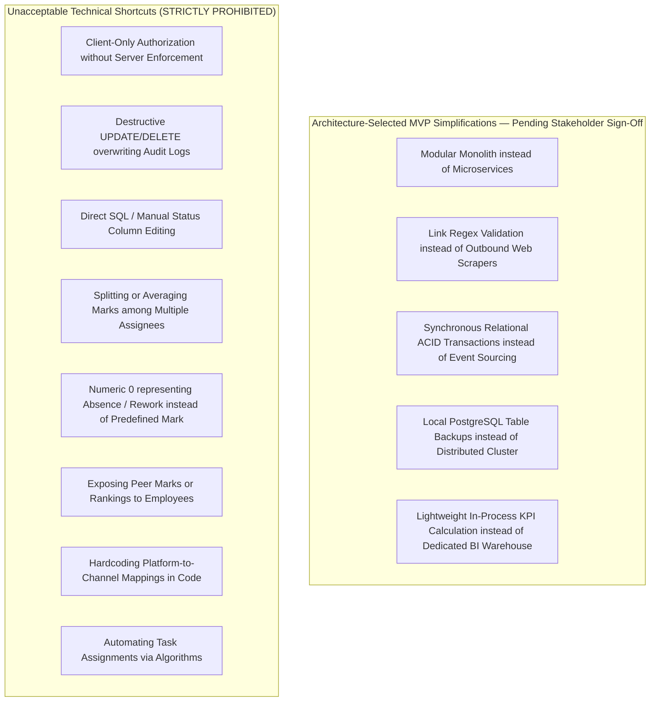

---

## 25. Architecture Change Control & Lifecycle

### 25.1 Change Origin & Propagation Rules
1. **Upstream Business Intent Changes:** Any proposed modification to business roles, permission catalogues, review gates, Marks values, workflow states, or KPI definitions **must originate in BFD v1.5.0**, propagate through **BRS v1.1.0**, and be synchronized into **SRS v0.3** and **RTM v0.4** before any architecture modification is authorized.
2. **Architecture Technical Refinements:** Non-functional engineering refinements (e.g., query optimizations, caching, UI design token adjustments) that do not alter source-defined behavior may be updated directly within this SAD under version control.
3. **Hierarchy Preservation:** The SAD shall never override or contradict BFD, BRS, RTM, or SRS baselines.

---

## 26. Final Architecture Validation Checklist

| Item # | Validation Item                      | Specification / Baseline Standard                                                 | SAD Architectural Alignment                                          |  Status  |
| :----: | :----------------------------------- | :-------------------------------------------------------------------------------- | :------------------------------------------------------------------- | :------: |
| **1**  | **Document Precedence**              | BFD $\succ$ BRS $\succ$ RTM $\succ$ SRS $\succ$ SAD                               | Section 1.2 enforces strict document hierarchy.                      | **PASS** |
| **2**  | **Source Baselines**                 | BFD v1.5.0, BRS v1.1.0, SRS v0.3 (all unchanged by R3.5), RTM v0.4 (R3.5 candidate) | Section 2.1 verified exact source baselines.                         | **PASS** |
| **3**  | **SRS Requirement Coverage**         | 93 / 93 Validated SRS Requirements                                                | Section 23.2 maps all 93 requirements with 0 orphans.                | **PASS** |
| **4**  | **Internal Access Classes**          | Exactly 3 (CEO/Owner, Marketing Manager, Employee); expandable Business Role catalogue layered above (no 4th class) | Section 9.1 models exactly 3 access classes; Business Roles resolve to them (SAD-DES-033). | **PASS** |
| **5**  | **Operational Permissions**          | Exactly 17 CEO-Granted Permissions                                                | Section 9.2 implements runtime enforcement for Permissions #1–#17.   | **PASS** |
| **6**  | **Delegated Self-Approval Barrier**  | Permitted Employee cannot review own work                                         | Section 9.3 & 9.4 enforce self-approval barrier at server layer.     | **PASS** |
| **7**  | **Lifecycle State Machine**          | Exactly 22 Workflow Concepts (17 Active, 1 Dormant, 2 Terminal, 1 Closed, 1 Flag) | Section 8.1 models all 22 states faithfully.                         | **PASS** |
| **8**  | **Manual Status Edit Prohibition**   | System-generated statuses; direct edits blocked                                   | Section 8.2 enforces read-only status and command guards.            | **PASS** |
| **9**  | **Content ID Invariant**             | `C-MMYY-NNNN` upon entry to Planning; monthly reset                               | Section 10.5 & 23.1 enforce single identity & planning entry timing. | **PASS** |
| **10** | **Planned Output & Reel Types**      | Photography, Reel (Very Short, Short, Long), Video                           | Section 10.3 models exact taxonomy without numeric duration bands.   | **PASS** |
| **11** | **Marks Model & Closed Value Set**   | `[0, 0.5, 1.0, 2.0, 3.0]`; no splitting/averaging                                 | Section 10.6 enforces predefined marks and full attribution.         | **PASS** |
| **12** | **Publication Hierarchy & Seeds**    | Platform $\rightarrow$ Channel $\rightarrow$ Target; 6 Platforms, 8 Handles       | Section 10.4 models 6/6 platforms and 8/8 account seeds.             | **PASS** |
| **13** | **Publication Event Classification** | Exactly `Original` and `Repost`; no personal Mark attribution record created      | Section 12.1 models event-level tracking and no-attribution rule.    | **PASS** |
| **14** | **Performance Due Date**             | `Actual Publication Date + 2 Calendar Days` (Non-reschedulable)                   | Section 12.3 enforces exact date offset calculation.                 | **PASS** |
| **15** | **Creative Scorecard Formulas**      | Hook Rate, Hold Rate, CTR formulas exact                                          | Section 12.3 embeds exact mathematical formulas.                     | **PASS** |
| **16** | **Formal KPI Catalogue**             | 30 / 30 Governed KPIs across 5 Categories                                         | Section 13.1 & 13.2 embed exact 30 KPI definitions.                  | **PASS** |
| **17** | **Source Clarifications**            | `SC-REQ-001` and `SC-REQ-002` resolved                                            | Section 21 records both clarifications RESOLVED (N/A rule; draft lifecycle). | **PASS** |
| **18** | **Downstream Design Decisions**      | `DDD-001` through `DDD-008` accounted for                                         | Section 20 records architectural status for all 8 DDDs.              | **PASS** |
| **19** | **Normative SAD-DES Catalogue**      | 34 / 34 Defined Design Elements                                                   | Section 23.1 normatively defines all SAD-DES-001..034 elements (R3.4 added SAD-DES-033/034). | **PASS** |
| **20** | **Peer Privacy Protection**          | Peer Marks and performance hidden from Employees                                  | Section 14.2 models strict query and DTO isolation.                  | **PASS** |

---

<div align="center">

**KCPC Bandhani — Content Production Lifecycle MVP**  
**System Architecture & Solution Design Document (SAD) v0.4 (R3.5 candidate)**  
**Document ID: KCPC-MKT-SAD-001**  
**Status: Draft — Initial Architecture & Solution Design Baseline**  

---

</div>
