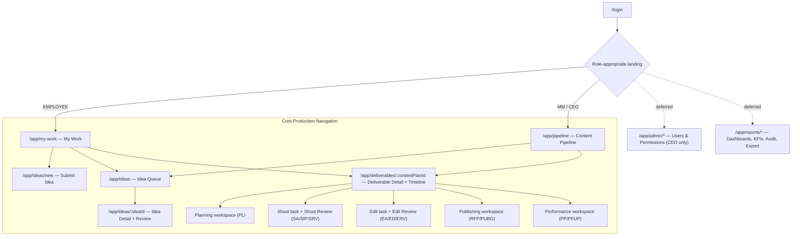

# UI/UX Design Specification — KCPC Marketing Management System (Content Production Lifecycle MVP)

**Document ID:** `KCPC-MKT-UIUX-001`  
**Document Title:** UI/UX Design Specification  
**Project Name:** Content Production Lifecycle MVP  
**Client:** KCPC Bandhani  
**Version:** `0.1.2`  
**Status:** Draft — UI/UX Baseline (MVP Core Flow, Low-Fidelity Wireframes); frontend architecture retargeted under Candidate Successor **R3.5** to Spring MVC + JSP server-rendered pages (`KCPC-MKT-CR-R3.5-001`) — CANDIDATE, PENDING INDEPENDENT RE-REVIEW (not frozen). **Screen behaviour, routes, forms, fields, actions, role-appropriate experiences, permission-filtered controls and validation states are unchanged from R3.4** — only the rendering technology changes.
**Classification:** Confidential — Internal Use Only  
**Created Date:** August 11, 2026  
**Last Modified Date:** August 13, 2026  

---

## 1. Document Control & Governance

### 1.1 Document Metadata
| Metadata Attribute | Governed Specification Value |
| :--- | :--- |
| **Document Identifier** | `KCPC-MKT-UIUX-001` |
| **Document Title** | UI/UX Design Specification — Content Production Lifecycle MVP |
| **System Name** | KCPC Marketing Management System (Bandhani Content Production) |
| **Release Baseline** | Candidate UI/UX Baseline v0.1 — MVP Core Production Flow |
| **Fidelity** | Low-Fidelity structural wireframes (layout, components, flows, states); brand-neutral |
| **Coverage** | MVP core production flow (Stage 1 → Stage 7) + Authentication/Landing + Deliverable Detail. Administration, dashboards, KPI reporting, master-data catalogues, audit viewer, and export screens are **deferred to a later UI/UX pass** (see §14). |
| **Target Frontend** | Server-rendered **Spring MVC + JSP + HTML/CSS** (`SAD-ADR-006`, R3.5). REST contract at base path `/api/v1` retained and externally consumable; page controllers call the shared application/service layer rather than the API over HTTP. |

### 1.2 Upstream Source Baselines
This specification strictly derives from and conforms to the following upstream project baselines. No screen, control, status, permission, or rule herein is invented; each traces to a governed source.

| Baseline ID | Document | Version | Role in this Spec |
| :--- | :--- | :---: | :--- |
| `KCPC-MKT-BFD-001` | Business Foundation Document (BFD) | `v1.5.0` | Roles, permissions, workflow philosophy, privacy invariants |
| `KCPC-MKT-BRS-001` | Business Requirements Specification (BRS) | `v1.1.0` | Business requirements & acceptance criteria |
| `KCPC-MKT-SRS-001` | Software Requirements Specification (SRS) | `v0.3` | Screen behaviour, validation, role/data scoping, landing |
| `KCPC-MKT-SAD-001` | System Architecture & Solution Design (SAD) | `v0.4` | Server-rendered UI architecture, component boundaries |
| `KCPC-MKT-ERD-001` | Entity Relationship Diagram & Data Dictionary (ERD) | `v0.4` | Field names, enumerations, constraints |
| `KCPC-MKT-API-001` | API Specification (API) | `v0.4.0` | Screen ↔ endpoint bindings, request/response DTOs, error envelope |
| `KCPC-MKT-RTM-001` | Requirements Traceability Matrix (RTM) | `v0.4` | Requirement coverage cross-reference |

### 1.3 Revision History
| Version | Date | Author / Role | Description of Changes | Reviewed By |
| :---: | :---: | :--- | :--- | :--- |
| **0.1** | August 11, 2026 | UX/Product Design (Development Review Assistant) | Initial low-fidelity UI/UX baseline for the MVP core production flow (Stage 1–7) + Authentication/Landing + Deliverable Detail. Derived from BFD v1.4.4, BRS v1.0.4, SRS v0.2, SAD v0.2, ERD v0.2, API v0.2. Administration/reporting/master-data/export screens deferred. Current-baseline references were subsequently re-synchronized to BFD v1.4.5 following the recorded SC-REQ-001/002 stakeholder scorecard decisions, which resolved the two previously-open scorecard clarifications — zero-denominator rates are recorded as N/A (excluded from averages/KPIs) and partial metrics use a DRAFT-then-submit lifecycle — thereby changing the affected scorecard capture/derivation semantics; the core role, permission, and workflow business model is unchanged. | Pending UX & Stakeholder Review |
| **0.1** | August 12, 2026 | UX/Product Design (Development Review Assistant) | Round-3 alignment (no business-model change): broadened the delegated self-review presentation so the **entire** review-decision block (Approve and Request Rework) is hidden/disabled on own work (principle 4, §7.3, review-panel rules, Planning/Shoot/Edit wireframes, screen-state table) per `SRS-REQ-012`; split the global URL rule (free-form Reference Link/Note vs strict Folder/Evidence URL); added scorecard `*IsNa` toggles and null-vs-N/A semantics; standardized Content-ID wording; removed retired `API-OP-015` from the §2.2 Stage-3 range; re-synchronized the API reference to v0.2.2. | Pending UX & Stakeholder Review |
| **0.1** | August 12, 2026 | UX/Product Design (Development Review Assistant) | Controlled post-freeze reference sync (Development Baseline R3.2 → **R3.3**): re-synchronized the downstream API reference `v0.2.2 → v0.2.3` (§1.2 baseline table, §3 precedence, closing statement) following the controlled API contract change (mandatory user-creation reason; reporting query parameters). No screen, control, status, permission, field, or KPI change. | Pending UX & Stakeholder Review |
| **0.1.1** | August 12, 2026 | UX/Product Design (Development Review Assistant) | Candidate Successor **R3.4** business-change amendment (candidate, not frozen): added the Stage-3 **Planning Mode** (Standard/Urgent) control, mandatory Urgency Reason field, and manual Shoot/Edit date entry to the Planning wireframe (§9.6) and reflected Planning Mode / Urgency Reason on the Planning Review screen (§9.7) per `SRS-REQ-093`; added the reel-conditional Reel Type note reflecting the `Short Clip`→`Video` rename (`SRS-REQ-024`). Downstream reference set advanced to the R3.4 candidate versions (BFD v1.5.0, BRS v1.1.0, SRS v0.3, SAD v0.3, ERD v0.3, API v0.3.0). No change to access classes, permissions, or KPI logic. **Closure pass (Aug 12, 2026):** added the mandatory Urgency-Reason prerequisite to the §9.6 Submit-for-Review gate and the §9.7 Planning Review prerequisite checklist (`SRS-REQ-093`/`BRS-REQ-086`), and the `Shoot ≤ Edit ≤ Live` date rule with **same-day Shoot/Edit permitted under Urgent** (`ERD-CON-066`). Pending final independent re-audit. **CANDIDATE — PENDING INDEPENDENT REVIEW.** | Pending UX & Stakeholder Review |
| **0.1.2** | August 13, 2026 | UX/Product Design (Solution Architecture Team) | Candidate Successor **R3.5** technical frontend-architecture retargeting (`KCPC-MKT-CR-R3.5-001`): React 18+/TypeScript SPA → **Spring MVC + JSP + HTML/CSS server-rendered** (`SAD-ADR-006`). Upstream references advanced to SAD v0.4 / ERD v0.4 / API v0.4.0 / RTM v0.4. **No screen, route, form, field, action, validation state, permission-filtered control or role-appropriate experience is changed**; the Planning Mode wireframe (§9.6) and Planning Review (§9.7), including same-day Urgent date validation traced to `KCPC-MKT-DR-R3.4-001`, are behaviourally identical. Authentication is now a Spring Security JWT cookie (`SAD-ADR-001`); the view layer remains **never** a security authority. **No business change. CANDIDATE — NOT FROZEN.** | Pending |

### 1.4 Distribution & Governance List
| Role / Stakeholder | Purpose |
| :--- | :--- |
| CEO / Owner | Executive review of role-appropriate experiences & privacy invariants |
| Marketing Manager | Operational workflow & review-gate UX verification |
| Frontend Engineering Lead | Server-rendered view implementation contract (screens, states, service/API bindings) |
| Backend Engineering Lead | Confirm UI actions map to governed API operations & error codes |
| QA / Test Engineering Lead | Screen-level acceptance & negative-path (permission/self-approval) testing |

---

## 2. Purpose, Scope & Audience

### 2.1 Purpose
This document defines the **structural user experience** for the KCPC Bandhani Content Production Lifecycle MVP: the screens, navigation, role-specific views, interaction patterns, form/field behaviour, workflow-driven states, and validation/error presentation required to operate the governed 7-stage content production lifecycle. It is the implementation contract between product, frontend engineering, and QA for the UI layer, and the visual counterpart to the API contract (`KCPC-MKT-API-001`).

### 2.2 In Scope (this v0.1 — MVP Core Production Flow)
- **Authentication & role-appropriate landing** (`SRS-REQ-001`, `SRS-REQ-002`).
- **Stage 1 — Idea Submission** form (`API-OP-010`).
- **Stage 2 — Idea Queue, Idea Detail, Idea Review gate** (Approve + predefined Marks / Reject / Retain) and Reopen Retained (`API-OP-011`–`014`).
- **Stage 3 — Planning workspace** (Content ID, parameters, planned outputs, talent, target mappings, folder link, initial Cameraperson assignment) and **Planning Review** — submit (`API-OP-024`) then decision (`API-OP-064`) (`API-OP-016`–`024`, `API-OP-064`; the content plan is created via `API-OP-013` at Idea Approval — `API-OP-015` retired).
- **Stage 4 — Shoot execution** (start, submit) and **Shoot Review gate** (Approve + confirm Cameraperson marks / Request Rework) (`API-OP-025`–`027`).
- **Stage 5 — Editor assignment**, **Edit execution** (start, submit) and **Edit Review gate** (`API-OP-028`–`031`).
- **Stage 6 — Publishing workspace** (start publishing, record Actual Publication events, Target N/A, evidence correction) (`API-OP-034`–`042`).
- **Stage 7 — Performance workspace** (obligations, **scorecard draft → submit**, metric correction) (`API-OP-043`, `API-OP-063`, `API-OP-044`, `API-OP-046`).
- **Cross-cutting: Deliverable Detail & Workflow Timeline**, and the **Hold / Resume** administrative affordance (`API-OP-047`, `API-OP-048`, `API-OP-054`).

### 2.3 Deferred to a Later UI/UX Pass (NOT specified here — see §14)
User & permission administration (CEO-exclusive), Team Workload & Team KPI dashboards, the 30-KPI reporting screens, the Audit-History viewer, Platform/Channel master-data catalogue management, and the multi-format Export screen. These are governed by existing requirements and API operations but are intentionally out of this MVP-core-flow baseline.

### 2.4 Audience
Frontend engineers (implementation), QA (acceptance & negative paths), product/stakeholders (review), and backend engineers (confirming UI↔API alignment).

---

## 3. Source Hierarchy & Precedence

$$\text{BFD v1.5.0} \succ \text{BRS v1.1.0} \succ \text{RTM v0.4} \succ \text{SRS v0.3} \succ \text{SAD v0.4} \succ \text{ERD v0.4} \succ \text{API v0.4.0} \succ \mathbf{\text{UI/UX Spec v0.1.2 (R3.5 candidate)}}$$

The UI/UX Specification is the most downstream artifact. Where this document and any higher baseline appear to conflict, the higher baseline governs and this document is corrected. This spec introduces **no** business rules, statuses, permissions, fields, or KPI logic; it only prescribes how governed behaviour is presented and operated in the interface.

---

## 4. UX Design Principles & Interface Governance

These principles are binding and derive directly from governed invariants:

1. **Role-Appropriate Experience (`SRS-REQ-001`, `SRS-REQ-002`).** Every authenticated user lands in an access-appropriate context and sees only screens/data within their authority. Three **internal access classes**: `CEO_OWNER`, `MARKETING_MANAGER`, `EMPLOYEE`. These are authorization/security classes, distinct from the visible organizational **Business Role** (designation) each user holds, which resolves to exactly one access class (introduced in R3.4, `SRS-REQ-092`); a Business Role name never grants an Operational Permission.
2. **Permission-Gated Controls (`SRS-REQ-010`).** An action control (button, menu item, form) renders **only** when the user holds the required active operational permission (or is CEO/MM with native authority). Absent permission ⇒ the control is not shown (not merely disabled). The server remains authoritative and returns `403` if bypassed.
3. **System-Driven Status — No Manual Status Edits (`SRS-REQ-083`, `SC-012`).** The UI never exposes a control to set workflow status directly. Status changes are always side-effects of governed commands (submit, approve, request rework, publish, etc.). Status is displayed read-only.
4. **No Self-Review Decision for Delegated Reviewers (`SRS-REQ-012`, `BRS-REQ-012`, `AC-012.1`).** For a user acting under delegated Permission #1/#3/#5/#7 on their own submitted/prepared/executed work, the **entire review-decision control is hidden/disabled** — not only Approve but every decision on that gate (Approve *and* Request Rework; for Idea Review, Approve/Reject/Retain) — with an explanatory note; the server enforces `403 PERM_SELF_APPROVAL_PROHIBITED` on any attempted decision (`AC-012.2`). The gate is routed to another authorized reviewer. CEO/MM are exempt.
5. **Employee Privacy (`SRS-REQ-067`).** Employees see only their own tasks, feedback, marks, and 5 personal measures. Peer marks, rankings, leaderboards, and compensation are never rendered in an employee context.
6. **Mandatory-Reason Gate.** Any destructive or exception action that requires a reason by rule — Reject, Request Rework, Hold, Reschedule, Reassign, Cancel, Target N/A, evidence/metric/mark correction — is blocked until a non-empty reason is entered. The Confirm control stays disabled until the reason field is valid.
7. **Server-Authoritative Validation.** Client validation is a convenience mirror of server rules; the UI must handle and present every governed error code (see §7.4). The UI never assumes success before the server confirms.
8. **Evidence & Auditability Visible.** Actions that generate immutable history (reviews, publications, corrections, holds) surface a confirmation and appear in the Deliverable Timeline; the UI communicates that the action is permanent/append-only where relevant.
9. **Low-Fidelity, Structure-First.** This baseline prescribes layout, hierarchy, components, and states — not final brand visuals. Colour/typography/iconography are placeholders to be defined in the visual-design pass.
10. **Accessibility & Responsiveness by Default (§11).** Keyboard operability, focus management, semantic structure, and a responsive layout down to tablet width are required from the first implementation.

---

## 5. Information Architecture & Global Navigation

### 5.1 Role-Based Navigation Map

Deferred nodes (dotted) are listed for context only and are not specified in this baseline.

### 5.2 Primary Navigation Shell
The application uses a persistent left navigation rail + top bar. Navigation entries are **permission-filtered**:

| Nav Entry | Route | Visible To |
| :--- | :--- | :--- |
| My Work | `/app/my-work` | All roles (Employee default landing) |
| Content Pipeline | `/app/pipeline` | CEO, MM, and Employees with any pipeline-visibility permission |
| Submit Idea | `/app/ideas/new` | All roles |
| Idea Queue | `/app/ideas` | All roles (scoped: Employees always see own submissions) |
| Deliverable Detail | `/app/deliverables/:id` | All roles (opened contextually from a task/pipeline row) |
| *Administration* | `/app/admin/*` | *CEO only — deferred* |
| *Reports & Dashboards* | `/app/reports/*` | *CEO, MM, permission-holders — deferred* |

### 5.3 Route Inventory (this baseline)
```
/login                                  Authentication
/app/my-work                            Employee self-service landing / task queue
/app/pipeline                           CEO/MM pipeline board (all deliverables)
/app/ideas/new                          Stage 1 — Submit Idea
/app/ideas                              Stage 2 — Idea Queue
/app/ideas/:ideaId                      Stage 2 — Idea Detail + Review gate
/app/deliverables/:contentPlanId        Cross-cutting — Deliverable Detail + Timeline
    ?panel=planning                     Stage 3 — Planning workspace / Planning Review
    ?panel=shoot                        Stage 4 — Shoot task / Shoot Review
    ?panel=edit                         Stage 5 — Editor assign / Edit task / Edit Review
    ?panel=publishing                   Stage 6 — Publishing workspace
    ?panel=performance                  Stage 7 — Performance workspace
```
The Deliverable Detail is a single shell whose active **panel** follows the deliverable's workflow status; the panel query param is a deep-link convenience only. No panel exposes a status control (Principle 3).

---

## 6. Global Layout & Low-Fidelity Component System

### 6.1 Application Shell
```
+----------------------------------------------------------------------+
| [KCPC MMS]   Content Production                 [Search]  [User ▾]     |  <- Top bar
+----------+-----------------------------------------------------------+
|  NAV      |  Breadcrumb: Pipeline / C-0826-0001                       |
|  ----     |  +-----------------------------------------------------+  |
| ▸ My Work |  |  PAGE TITLE                    [Primary action(s)]  |  |
| ▸ Pipeline|  |  Status: [SIP • Shoot In Progress]  [Delayed] [Hold]|  |  <- status strip (read-only)
| ▸ Ideas   |  |-----------------------------------------------------|  |
| ▸ Submit  |  |                                                     |  |
|           |  |   ... panel / content ...                           |  |
|           |  |                                                     |  |
+----------+--+-----------------------------------------------------+--+
```
- **Top bar:** product mark, global search (scoped to permitted content), user menu (profile, logout `API-OP-002`).
- **Left nav:** permission-filtered entries (§5.2); collapses to icons on tablet.
- **Status strip:** read-only workflow status badge + supplementary flags (`Delayed`, `On Hold`). Never editable.

### 6.2 Core Components (low-fi specs)
| Component | Purpose | Key behaviour |
| :--- | :--- | :--- |
| **Status Badge** | Show one of 22 workflow concepts | Read-only; label = governed status name; code shown on hover. |
| **Flag Chip** | `Delayed` / `On Hold` | Supplementary, additive to status; `Delayed` computed (current date > approved planned date); `On Hold` when an open `work_hold_records` row exists. |
| **Priority Tag** | `Low` / `Medium` / `High` | Planning attribute only. |
| **Primary Action Button** | The single dominant next step for the current status/role | Permission-gated; disabled with reason tooltip when blocked. |
| **Review-Gate Panel** | Approve / Reject / Retain / Request Rework | See §7.1; decision radio + conditional required fields. |
| **Reason Field** | Mandatory-reason capture | Non-empty validation; Confirm disabled until valid. |
| **Assignee Picker** | Select active user(s) | Multi-select where governed (camerapersons/editors); shows only active users. |
| **Marks Selector** | Pick predefined mark | Segmented control constrained to `[0, 0.5, 1.0, 2.0, 3.0]`; `0` is a valid explicit choice, visually distinct from "unset". |
| **Data Table** | Queues / lists | Server-side pagination, sort, filter, search (page 1..N, pageSize ≤100 per API §14). |
| **Timeline** | Immutable event history | Append-only entries from transitions/audit; newest first. |
| **Toast / Inline Error** | Result feedback | Success toast for 2xx; field-level inline errors for `422`; banner for `403/409`. |
| **Confirm Dialog** | Irreversible/append-only actions | Restates the permanent effect; requires reason where governed. |

### 6.3 Field Formats (from ERD/API)
| Field | Display / Input rule |
| :--- | :--- |
| Idea ID | `IDEA-YYYYMMDD-NNNN` — system-generated, read-only |
| Content ID | `C-MMYY-NNNN` — allocated atomically during Idea Approval as the approved Idea transitions into Planning, read-only, immutable |
| Business calendar dates | `YYYY-MM-DD`, interpreted in `Asia/Kolkata` (IST) |
| System timestamps | ISO-8601 UTC, localized to IST for display |
| Reference Link / Note (Idea Submission) | **Free-form string** (`referenceLinkOrNote`, `SRS-REQ-084`) — a URL is *not* required. Accept any text; render as a safe external link **only when** the value parses as a valid URL, otherwise display as plain text. Never reject on URL format. |
| Folder Link / Publication Evidence URL | **Validated URL format required** (`folderLink`, evidence `linkUrl`) — reject non-URL input with an inline error; render as a safe external link. |
| Marks | one of `0, 0.5, 1.0, 2.0, 3.0` |

---

## 7. Common Interaction Patterns

### 7.1 Review-Gate Pattern (Idea / Planning / Shoot / Edit)
A single reusable gate panel drives all four review gates; the decision set differs by gate:

| Gate | Decisions | Conditional required inputs |
| :--- | :--- | :--- |
| Idea Review (`API-OP-013`) | **Approve** · **Reject** · **Retain** | Approve ⇒ Cameraperson Mark + Editor Mark (`[0..3]`); Reject ⇒ mandatory reason |
| Planning Review (decision `API-OP-064`; submit `API-OP-024`) | **Approve** · **Request Rework** | Rework ⇒ mandatory reason; submission/approval requires prerequisites met (≥1 output, ≥1 cameraperson, valid shoot & edit dates, and — when Planning Mode = Urgent — a non-empty Urgency Reason, `SRS-REQ-093`) |
| Shoot Review (`API-OP-027`) | **Approve** · **Request Rework** | Approve ⇒ confirm qualifying Cameraperson(s); Rework ⇒ mandatory reason |
| Edit Review (`API-OP-031`) | **Approve** · **Request Rework** | Approve ⇒ confirm qualifying Editor(s); Rework ⇒ mandatory reason |

Rules rendered by the panel: **no Reject** on Planning/Shoot/Edit (only Approve/Request Rework); **self-review-decision block** when the reviewer is the submitter/preparer/participant (the whole decision block — both Approve and Request Rework — hidden/disabled + note, per `SRS-REQ-012`); marks are **full to each** confirmed contributor (no split UI).

### 7.2 Mandatory-Reason & Confirmation
Reject, Request Rework, Hold, Reschedule, Reassign, Cancel, Target-N/A, and all correction actions open a confirm panel with a required reason. Confirm stays disabled until the reason is non-empty. For append-only/irreversible actions the dialog states the permanence explicitly.

### 7.3 Permission & Self-Review Presentation
- **No permission:** control absent from the UI (not shown).
- **Self-review conflict (`SRS-REQ-012`, `BRS-REQ-012`):** the **entire review-decision block is hidden/disabled** — every decision on that gate, both Approve **and** Request Rework (Idea Review: Approve/Reject/Retain) — with inline text: "You cannot make a review decision on work you submitted, prepared, or participated in." Request Rework does **not** remain available; the deliverable is routed to another authorized reviewer. Any attempted decision is rejected server-side with `403 PERM_SELF_APPROVAL_PROHIBITED`.
- **CEO/MM:** exempt from self-review; full controls per role.

### 7.4 Error-Envelope → UI Mapping (API §12)
| HTTP | Example codes | UI presentation |
| :--- | :--- | :--- |
| `400` | `REQ_MALFORMED_JSON` | Non-blocking banner "Request could not be processed"; log for support. |
| `401` | `AUTH_SESSION_EXPIRED`, `AUTH_MISSING_SESSION` | Redirect to `/login` with "Session expired" notice. |
| `403` | `PERM_DENIED`, `PERM_SELF_APPROVAL_PROHIBITED`, `PERM_EXECUTIVE_ONLY` | Banner explaining the authority boundary; control should have been hidden — treat as a guard. |
| `404` | `RESOURCE_NOT_FOUND` | Empty-state "Not found or no longer available." |
| `409` | `WORKFLOW_STATE_CONFLICT`, `HOLD_ALREADY_ACTIVE`, `RESUME_NO_ACTIVE_HOLD`, `CANCEL_LOCKED_POST_COMPLETION`, `WORKFLOW_ACTIVE_HOLD_BLOCKS_ACTION` | Banner "This action is not available in the current state" + refresh affordance (state changed under the user). |
| `422` | `VALIDATION_REQUIRED_FIELD_MISSING`, `VALIDATION_ENUM_INVALID`, `VALIDATION_MARKS_SCALE_INVALID`, `VALIDATION_ALL_TARGETS_NA_PROHIBITED`, `VALIDATION_PLANNING_FIELD_IN_IDEA_PROHIBITED` | Inline field-level errors mapped from `error.fieldErrors[]`. |

### 7.5 Optimistic vs Authoritative
Workflow-changing actions are **never** optimistic. The UI disables the action, awaits the server response, then updates status/timeline from the returned state. Read-only navigation may cache within a session.

---

## 8. Workflow Status → UI State Mapping

The 22 governed workflow concepts (`API §10`) map to read-only badges and the single permitted next action per role. `Delayed` and `On Hold` are additive flags, not statuses.

| Code | Status | Primary next action(s) exposed (role/permission) | Panel |
| :---: | :--- | :--- | :--- |
| `IS`/`PA` | Idea Submitted / Pending Approval | Review decision (Perm #1 / CEO / MM) | Idea Detail |
| `RET` | Retained | Reopen (Perm #1) | Idea Detail |
| `RJ` | Rejected | — (terminal, read-only) | Idea Detail |
| `PL` | Planning | Edit plan parameters, outputs, talent, targets, folder link, assign cameraperson (Perm #2/#4/#13); Submit for Planning Review | Planning |
| `PLRV` | Planning Review | Approve / Request Rework (Perm #3) | Planning Review |
| `PLAP`→`SA` | Planning Approved → Shoot Assigned | (auto) → Start Shoot | Shoot |
| `SIP` | Shoot In Progress | Submit for Shoot Review; Hold/Resume (CEO/MM) | Shoot |
| `SRV` | Shoot Review | Approve + confirm camerapersons / Request Rework (Perm #5) | Shoot Review |
| `SAP` | Shoot Approved | Assign Editor (Perm #6) | Edit |
| `EA` | Edit Assigned | Start Edit | Edit |
| `ED` | Editing | Submit for Edit Review; Hold/Resume (CEO/MM) | Edit |
| `ERV` | Edit Review | Approve + confirm editors / Request Rework (Perm #7) | Edit Review |
| `EAP`→`RFP` | Edit Approved → Ready for Publishing | (auto) → Start Publishing | Publishing |
| `PUBG` | Publishing | Record Actual Publication event(s), Target N/A, evidence correction (Perm #8) | Publishing |
| `PP` | Performance Pending | View obligation & due date; Save scorecard draft when eligible (Perm #9) | Performance |
| `PFUP` | Performance Update | Save draft / Submit scorecard / correct metric (Perm #9) | Performance |
| `COMP` | Completed | Reopen for Publishing (Perm #8) / Reopen for Performance (Perm #9) | Deliverable Detail |
| `CAN` | Cancelled | — (terminal, read-only) | Deliverable Detail |
| `DLY` | Delayed (flag) | Additive badge only | any |

Cross-cutting admin actions available from the Deliverable Detail action menu when permitted: **Reschedule** (Perm #10, on approved dates), **Reassign** (Perm #11), **Cancel** (Perm #12, pre-first-completion), **Hold/Resume** (CEO/MM, only in `SIP`/`ED`).

---

## 9. Screen Specifications (MVP Core Flow)

Each screen lists: **Route · Roles/Permissions · Wireframe · Components · Interactions · States · Validation · API bindings · Traceability.** Wireframes are low-fidelity (structure only).

---

### 9.1 Login & Session Establishment
- **Route:** `/login`  ·  **Roles:** unauthenticated (all)  ·  **Permission:** none (public)
```
+--------------------------------------------------+
|                  KCPC MMS                         |
|          Content Production Login                 |
|                                                   |
|   Email     [______________________________]     |
|   Password  [______________________________] 👁   |
|                                                   |
|   [ Sign In ]                                     |
|   ⚠ Inline error area (invalid / inactive)        |
+--------------------------------------------------+
```
- **Components:** email field, password field (masked, reveal toggle), Sign-In button, error area.
- **Interactions:** Submit → `POST /api/v1/auth/login`. On success, store nothing sensitive client-side (HttpOnly cookie set by server); redirect to `data.landingContext`. On failure show the mapped message.
- **States:** default · submitting (button spinner, inputs locked) · error.
- **Validation / errors:** `422 VALIDATION_REQUIRED_FIELD_MISSING` (empty fields, inline); `401 AUTH_INVALID_CREDENTIALS` / `AUTH_ACCOUNT_INACTIVE` (generic "Invalid credentials or inactive account" — do not disclose which).
- **API:** `API-OP-001` (login), `API-OP-003` (session bootstrap after redirect).
- **Trace:** `SRS-REQ-001`, `SRS-REQ-077` · `BRS-REQ-001` · `BFD §6.1`.

---

### 9.2 Role-Appropriate Landing — "My Work" (Employee) / "Content Pipeline" (MM & CEO)
- **Route:** `/app/my-work` (Employee default) · `/app/pipeline` (MM/CEO default)  ·  **Roles:** all  ·  **Permission:** native; pipeline breadth widens with visibility permissions.
```
MY WORK (Employee)                              CONTENT PIPELINE (MM/CEO)
+------------------------------------------+    +---------------------------------------------+
| My Work                     [Submit Idea]|    | Content Pipeline            [Submit Idea]    |
|------------------------------------------|    |---------------------------------------------|
| Filters: [Stage ▾][Status ▾][Search... ] |    | Filters:[Stage▾][Priority▾][Assignee▾][Dly☐]|
|------------------------------------------|    |---------------------------------------------|
| ▸ Assigned Tasks                         |    | Content ID | Title | Status | Pri | Flags   |
|   C-0826-0002 · Editing · due 08-18 [Delayed]| | C-0826-0001| Fest..| SIP    | High| Delayed |
|   C-0826-0007 · Shoot In Progress  [Hold]|    | C-0826-0002| Diwa..| ED     | Med | Hold    |
| ▸ My Review Feedback (received)          |    | C-0826-0003| Sale..| PFUP   | Low |         |
| ▸ My Marks (own)      ▸ My 5 Measures    |    | [pagination ‹ 1 2 3 ›]                       |
+------------------------------------------+    +---------------------------------------------+
```
- **Components:** filter bar, task table (server paginated), employee self-service cards (own tasks, own review feedback, own marks, own 5 personal measures).
- **Interactions:** row → open Idea Detail or Deliverable Detail; Submit Idea → `/app/ideas/new`.
- **Privacy:** Employee context renders **only own** marks/measures/feedback — never peer data (`SRS-REQ-067`). The 5 measures: Delayed Work, Approved Work/Task Outputs, Review Submissions, Request Rework Before Approval, Personal Marks.
- **States:** loading skeleton · empty ("No assigned work") · populated.
- **API:** `API-OP-003` (context), `API-OP-016` (pipeline list), `API-OP-011` (ideas), `API-OP-055` (employee 5 measures — own).
- **Trace:** `SRS-REQ-001/002/066/067/068` · `BRS-REQ-001/066/067/068` · `BFD §6.2, §7.3`.

---

### 9.3 Stage 1 — Submit Idea
- **Route:** `/app/ideas/new`  ·  **Roles:** all (native)  ·  **Permission:** none (any authenticated user).
```
+---------------------------------------------------------+
| Submit Idea                                              |
|---------------------------------------------------------|
| Idea Title *      [_____________________________________]|
| Reference Link/Note (optional) [________________________]|
| Remarks (optional)                                       |
| [                                                       ]|
| [                                                       ]|
|                                                          |
|   [ Cancel ]                       [ Submit Idea ]       |
+---------------------------------------------------------+
```
- **Fields:** `title` (required, non-empty, ≤200 — ERD `VARCHAR(200)`) · `referenceLinkOrNote` (optional; a URL **or** a free-form reference string per `SRS-REQ-084` — a valid URL is not required — ERD `reference_link TEXT`) · `remarks` (optional, long-form free text, **no length limit** — ERD `TEXT`).
- **Planning-Field Exclusion (`SRS-REQ-084`):** the form intentionally contains **no** planning fields (no priority, category, SKU, dates, outputs, reel types, targets, cameraperson, talent). Attempting to send any is rejected `422 VALIDATION_PLANNING_FIELD_IN_IDEA_PROHIBITED`.
- **Interactions:** Submit → `POST /api/v1/ideas`; on success show generated `IDEA-YYYYMMDD-NNNN`, route to Idea Detail; status becomes `PA`.
- **States:** default · submitting · success (ID reveal) · validation error.
- **API:** `API-OP-010`.  ·  **Trace:** `SRS-REQ-014/015/084` · `BRS-REQ-014/015` · `BFD §5.1`.

---

### 9.4 Stage 2 — Idea Queue
- **Route:** `/app/ideas`  ·  **Roles:** all (Employees always see own submissions; review actions gated by Perm #1).
```
+-----------------------------------------------------------------+
| Idea Queue                                          [Submit Idea]|
|-----------------------------------------------------------------|
| Filters: [Status: IS/PA/RJ/RET/PL ▾]  [Search title...]         |
|-----------------------------------------------------------------|
| Idea ID           | Title                 | Status | Submitted   |
| IDEA-20260811-0001| Bandhani Festive...   | PA     | R. Sharma   |
| IDEA-20260811-0002| Diwali Reel Series    | RET    | You         |
| IDEA-20260810-0007| Silk Care Tips        | PL →C-0826-0004| You  |
| [pagination ‹ 1 2 ›]                                            |
+-----------------------------------------------------------------+
```
- **Interactions:** row → Idea Detail. Reviewers (Perm #1/CEO/MM) see a "Review" affordance on `PA` rows.
- **Scoping:** Employees without broad visibility see own submissions + any in operational scope; own submissions always visible.
- **API:** `API-OP-011`.  ·  **Trace:** `SRS-REQ-016` · `BRS-REQ-016` · `BFD §5.1`.

---

### 9.5 Stage 2 — Idea Detail + Idea Review Gate
- **Route:** `/app/ideas/:ideaId`  ·  **Roles:** all (read) · Review = Perm #1 / CEO / MM · Reopen = Perm #1.
```
+---------------------------------------------------------------+
| IDEA-20260811-0001 · Bandhani Festive Styling      [PA]        |
|---------------------------------------------------------------|
| Reference: instagram.com/p/...   Submitted by: R. Sharma      |
| Remarks: Focus on quick pallu pleating for Diwali.            |
|---------------------------------------------------------------|
| ▾ REVIEW DECISION            (shown to Perm#1 / CEO / MM)      |
|  ( ) Approve   ( ) Reject   ( ) Retain                        |
|  — if Approve —                                               |
|    Cameraperson Mark [0][0.5][1][2][3]   Editor Mark [..]     |
|    Review notes (optional) [__________________________]       |
|  — if Reject —                                                |
|    Reason * [__________________________________________]      |
|                                        [ Submit Decision ]    |
|  ⓘ You cannot review your own submitted idea. (self-approval) |
+---------------------------------------------------------------+
```
- **Review-gate rules:** decision = `Approve` / `Reject` / `Retain`. Approve requires **both** predefined marks from `[0,0.5,1,2,3]` (0 is explicit, not "unset"; `422 VALIDATION_MARKS_SCALE_INVALID` if off-scale). Reject requires a non-empty reason → `RJ` (terminal). Retain → `RET`. Approve → `PL` and allocates the Content ID **atomically at approval** (as the approved Idea transitions into Planning, via `API-OP-013`; no separate planning-entry step).
- **Self-approval:** if the viewer is the submitter and acting as delegated Employee, the decision block is hidden with the note; `403 PERM_SELF_APPROVAL_PROHIBITED` guards the server. CEO/MM exempt.
- **Retained view:** on `RET`, a **Reopen** action (Perm #1) returns it to `PA` (`API-OP-014`).
- **API:** `API-OP-012` (detail), `API-OP-013` (review), `API-OP-014` (reopen).
- **Trace:** `SRS-REQ-016/017/018/019/085` · `BRS-REQ-016/017/018/019` · `BFD §5.2` · `ERD-CON-011` (self-approval), `ERD-CON-010` (marks scale).

---

### 9.6 Stage 3 — Planning Workspace
- **Route:** `/app/deliverables/:contentPlanId?panel=planning`  ·  **Status:** `PL`  ·  **Permissions:** Plan params = Perm #2 · Cameraperson assign = Perm #4 · Folder link = Perm #13.
```
+-----------------------------------------------------------------+
| C-0826-0001 · Bandhani Festive Styling                 [PL]      |
| Planning workspace                          [Submit for Review] |
|-----------------------------------------------------------------|
| Parameters (Perm #2)                                            |
|  Title (from Idea, read-only) Bandhani Festive Styling          |
|  Priority [Low|Med|High]                                        |
|  Category (optional free text) [________________________]       |
|  SKU  ( ) Reference [________]   ( ) N/A                        |
|  Planning Mode:  (•) Standard   ( ) Urgent  ⚡                   |
|  Planned Live Date * [YYYY-MM-DD]                               |
|  — Standard —  Shoot (auto = PLD−5d)[..] Edit (auto = PLD−2d)[.]|
|  — Urgent  —  Urgency Reason * [____________]                   |
|               Shoot * [..]   Edit * [..]  (manual)             |
|  ⓘ If PLD is <5 days away, Standard is disabled — use Urgent.   |
|-----------------------------------------------------------------|
| Planned Outputs                                [+ Add Output]   |
|   • Reel — Short        • Photography        • Video       |
|      (Reel Type shown only for Reel; cleared on switch)        |
|      each output → [Map Targets ▸]                             |
| Talent Entries                                 [+ Add Talent]   |
| Publication Targets (per output)  Platform × Channel           |
| Content Asset Folder Link (Perm #13) [drive.google.com/...] [Save]|
| Cameraperson(s) (Perm #4)  [ + Assign ]  R. Verma, S. Kaur     |
+-----------------------------------------------------------------+
```
- **Components:** parameters form; **Planning Mode** selector (Standard/Urgent, R3.4); Planned Output list (type `Photography|Reel|Video`; **Reel Type shown/required only for Reel**, cleared immediately when the output switches to Photography/Video — `SRS-REQ-023/024`, `ERD-CON-008`); Talent list; per-output Target mapping (Platform×Channel); folder-link field (Perm #13); Cameraperson multi-assign (Perm #4).
- **Governed field behaviour:** Title is **read-only**, inherited from the parent Idea (`ideas` / `ERD-TBL-009`) — the content plan carries no title of its own (`ERD-TBL-010`), so it cannot be edited here. Category is **optional free text** — blank never blocks review (`SRS-REQ-021`). SKU Reference and "SKU N/A" are mutually exclusive (`ERD-CON-009`). Content ID is read-only/immutable. Talent entries capture a single free-text **Talent Name** each (`ERD-TBL-041` persists only `talent_name`).
- **Planning Mode (R3.4 — `SRS-REQ-093`, `ERD-CON-064/065`):** `Standard` auto-derives Shoot = PLD−5d and Edit = PLD−2d (overridable, `SRS-REQ-027`). `Urgent` reveals a mandatory **Urgency Reason** and enables manual Shoot/Edit date entry (the −5/−2 auto-calc is suppressed). If `PLD − current business date < 5 days`, Standard is disabled and the message "Standard scheduling cannot be applied to this Planned Live Date. Use Urgent Planning." is shown; at exactly 5 days Standard is available; a past PLD is rejected. Urgent may also be chosen intentionally at ≥5 days. **Date validation:** the client and server enforce `Shoot ≤ Edit ≤ PLD`; under **Urgent, same-day Shoot and Edit (equal dates) are accepted** (approved by the CEO / Owner (`CEO_OWNER`), 13 August 2026, `KCPC-MKT-DR-R3.4-001`), while Edit-before-Shoot or Live-before-Edit are rejected (`ERD-CON-066` / `SRS-REQ-093`). Planning Mode is independent of Priority (no `Urgent` priority); it is not a workflow status. The **same** Planning Review gate approves either mode; the server independently enforces all rules (zero silent coercion).
- **Permission-gated:** an Employee sees the Parameters/Outputs/Talent/Targets controls only with Perm #2; the folder-link control only with Perm #13; the cameraperson assign only with Perm #4. Missing permission ⇒ read-only view of that section.
- **Submit for Review:** enabled only when submission prerequisites are met — ≥1 output, ≥1 cameraperson, valid shoot & edit dates, and **when Planning Mode = Urgent, a non-empty Urgency Reason** (`SRS-REQ-093` / `BRS-REQ-086`); the button stays disabled and the Urgency Reason field is flagged if Urgent is selected with an empty reason. Transitions `PL → PLRV`. The server re-validates the same rule (`API-OP-018`/`API-OP-024`) with zero silent coercion.
- **API:** `API-OP-017/018` (plan — row auto-created at Idea Approval via `API-OP-013`; `API-OP-015` retired), `020` (outputs), `021` (talent), `022` (target mapping), `019` (folder link), `023` (cameraperson), `024` (submit review).
- **Trace:** `SRS-REQ-020..028/030` · `BRS-REQ-020..028` · `BFD §5.3`.

---

### 9.7 Stage 3 — Planning Review Gate
- **Route:** `/app/deliverables/:id?panel=planning` (review mode)  ·  **Status:** `PLRV`  ·  **Permission:** Perm #3.
```
+-----------------------------------------------------------------+
| C-0826-0001 · Planning Review                          [PLRV]   |
|-----------------------------------------------------------------|
| Read-only summary: params, outputs, targets, dates, camerapersons|
| Planning Mode: URGENT ⚡   Urgency Reason: "Owner-directed…"     |
|   Proposed/approved Shoot & Edit dates (manual in Urgent)       |
| Prerequisite check:  ✓ ≥1 output  ✓ ≥1 cameraperson             |
|                      ✓ shoot date  ✓ edit date                  |
|                      ✓ Urgency Reason (required when Urgent)     |
|-----------------------------------------------------------------|
| DECISION (Perm #3):   ( ) Approve    ( ) Request Rework          |
|   — Request Rework —  Reason * [___________________________]     |
|                                        [ Submit Decision ]      |
|  ⓘ No "Reject" at production review gates.                       |
|  ⓘ You prepared this plan — the whole decision block (Approve   |
|     AND Request Rework) is disabled. (self-review)              |
+-----------------------------------------------------------------+
```
- **Rules:** decisions are **Approve** or **Request Rework** only (no Reject). Approve requires prerequisites — including a non-empty **Urgency Reason** when Planning Mode = Urgent (`SRS-REQ-093` / `BRS-REQ-086`) — else `422`/`409`; transitions `PLRV → PLAP → (auto) SA`. Request Rework requires a non-empty reason → `PL`. Self-review: a preparer recorded in `planning_preparers` cannot make **any** decision on this gate — both Approve and Request Rework are disabled/hidden and the item is routed to another authorized reviewer (`SRS-REQ-012`, `ERD-CON-011`); server guards `403 PERM_SELF_APPROVAL_PROHIBITED`.
- **API:** decision `API-OP-064` (`PLRV`→`PLAP`/`PL`); the plan is submitted into the review queue via `API-OP-024` (`PL`→`PLRV`) from the Planning workspace §9.6.  ·  **Trace:** `SRS-REQ-029/030` · `BRS-REQ-029/030` · `SRS-REQ-093` / `BRS-REQ-086` (Planning Mode & Urgent Scheduling — mandatory Urgency Reason) · `BFD §5.3`.

---
### 9.8 Stage 4 — Shoot Task (Execution)
- **Route:** `/app/deliverables/:id?panel=shoot`  ·  **Status:** `SA` → `SIP`  ·  **Actors:** CEO/MM or assigned Cameraperson.
```
+-----------------------------------------------------------------+
| C-0826-0001 · Shoot                        [SA]  (or [SIP] [Hold])|
|-----------------------------------------------------------------|
| Assigned: R. Verma, S. Kaur    Shoot Date: 2026-08-15           |
| Content Asset Folder: drive.google.com/...  (required before review)|
|-----------------------------------------------------------------|
|  Status SA  →  [ Start Shoot ]                                   |
|  Status SIP →  Submission notes [____________]  [Submit for Review]|
|                (CEO/MM) [ Hold ]  /  [ Resume ]                  |
+-----------------------------------------------------------------+
```
- **Interactions:** `SA` → **Start Shoot** (`API-OP-025`) → `SIP` (records execution participant). `SIP` → **Submit for Shoot Review** (`API-OP-026`) → `SRV`; blocked unless the Content Asset Folder link exists (`SRS-REQ-032`) and the deliverable is not on Hold (`409 WORKFLOW_ACTIVE_HOLD_BLOCKS_ACTION`).
- **Hold/Resume (CEO/MM only, `SIP`):** Hold requires a non-empty reason (no length limit); Resume needs none; status stays `SIP`, an `On Hold` flag appears, and progression controls are disabled while held.
- **API:** `API-OP-025/026`, `047/048`.  ·  **Trace:** `SRS-REQ-031/032/091` · `BRS-REQ-031/032/084` · `BFD §5.4, BR-063`.

---

### 9.9 Stage 4 — Shoot Review Gate
- **Route:** `?panel=shoot` (review mode)  ·  **Status:** `SRV`  ·  **Permission:** Perm #5.
```
+-----------------------------------------------------------------+
| C-0826-0001 · Shoot Review                             [SRV]    |
|  Submission notes / footage reference (read-only)               |
|-----------------------------------------------------------------|
| DECISION (Perm #5):  ( ) Approve    ( ) Request Rework           |
|  — Approve —  Confirm qualifying Cameraperson(s):               |
|      [x] R. Verma   [ ] S. Kaur                                 |
|      ⓘ Each confirmed contributor receives the FULL predefined  |
|        Cameraperson mark (no split).                            |
|  — Request Rework —  Reason * [_______________________]         |
|                                        [ Submit Decision ]      |
|  ⓘ You participated in this shoot — the whole decision block   |
|     (Approve AND Request Rework) is disabled. (self-review)     |
+-----------------------------------------------------------------+
```
- **Rules:** Approve requires ≥1 confirmed qualifying Cameraperson; each confirmed receives the full predefined Cameraperson mark into their personal ledger (no split/average); replaced/unconfirmed contributors get nothing. Approve → `SAP`. Request Rework (reason required) → `SIP`, **zero** mark attribution. Self-review: a participant in `shooting_execution_participants` cannot make **any** decision on this gate — both Approve and Request Rework are disabled/hidden and the item routes to another authorized reviewer (`SRS-REQ-012`, `ERD-CON-011`). Blocked while on Hold.
- **API:** `API-OP-027`.  ·  **Trace:** `SRS-REQ-033/086` · `BRS-REQ-033/063` · `BFD §5.4`.

---

### 9.10 Stage 5 — Editor Assignment (Post-Shoot boundary)
- **Route:** `?panel=edit` (assign mode)  ·  **Status:** `SAP`  ·  **Permission:** Perm #6.
```
+-----------------------------------------------------------------+
| C-0826-0001 · Assign Editor                            [SAP]    |
|  ⓘ Editor assignment is available only after Shoot Approval.    |
|  Editor(s) [ + Assign ]   ▸ (multi-select active users)         |
|                                        [ Confirm Assignment ]   |
+-----------------------------------------------------------------+
```
- **Rules:** the Assign-Editor control is **not present** before `SAP` (`ERD-CON-013`; editor assignment prohibited until Shoot Approval). Confirm → `EA` (Edit Assigned).
- **API:** `API-OP-028`.  ·  **Trace:** `SRS-REQ-034/035` · `BRS-REQ-034/035` · `BFD §5.5`.

---

### 9.11 Stage 5 — Edit Task (Execution)
- **Route:** `?panel=edit`  ·  **Status:** `EA` → `ED`  ·  **Actors:** CEO/MM or assigned Editor.
```
| Status EA  →  [ Start Edit ]                                     |
| Status ED  →  Submission notes [__________]  [Submit for Review] |
|               (CEO/MM) [ Hold ] / [ Resume ]                    |
```
- **Interactions:** `EA` → **Start Edit** (`API-OP-029`) → `ED` (records edit participant). `ED` → **Submit for Edit Review** (`API-OP-030`) → `ERV`; blocked while on Hold. Hold/Resume identical pattern to Shoot, valid in `ED` only.
- **API:** `API-OP-029/030`, `047/048`.  ·  **Trace:** `SRS-REQ-036/037/091` · `BRS-REQ-036/037/084` · `BFD §5.5`.

---

### 9.12 Stage 5 — Edit Review Gate
- **Route:** `?panel=edit` (review mode)  ·  **Status:** `ERV`  ·  **Permission:** Perm #7.
- **Wireframe & rules:** mirror of §9.9 for editors. Approve requires ≥1 confirmed qualifying Editor (each receives the full predefined Editor mark; no split); Approve → `EAP → (auto) RFP`. Request Rework (reason) → `ED`, zero attribution. Self-review: a participant in `editing_execution_participants` cannot make **any** decision on this gate — both Approve and Request Rework are disabled/hidden and the item routes to another authorized reviewer (`SRS-REQ-012`, `ERD-CON-011`). No Reject.
- **API:** `API-OP-031`.  ·  **Trace:** `SRS-REQ-037/038/087` · `BRS-REQ-037/038/064` · `BFD §5.5`.

---

### 9.13 Stage 6 — Publishing Workspace
- **Route:** `?panel=publishing`  ·  **Status:** `RFP` → `PUBG`  ·  **Permission:** Perm #8 (Perm #17 for catalogue is deferred/read-only here).
```
+-----------------------------------------------------------------+
| C-0826-0001 · Publishing              [RFP] (or [PUBG])         |
|  Status RFP → [ Start Publishing ]                              |
|-----------------------------------------------------------------|
| Planned Targets (Platform × Channel)          Status            |
|  • Instagram · kcpcbandhani     [Record Event] [Mark N/A]       |
|  • YouTube · kcpc.english       Published ✓  evidence ↗         |
|  • Moj · kcpcsikar              N/A (reason) ↺ Reverse          |
|-----------------------------------------------------------------|
| Record Actual Publication Event                                 |
|   Planned Output [▾]  Target [▾]  Type ( )Original ( )Repost    |
|   Actual Date/Time [.........]  Evidence URL * [____________]   |
|                                        [ Save Event ]           |
|  ⚠ At least one target must be published — all-N/A is blocked.  |
+-----------------------------------------------------------------+
```
- **Rules:** `RFP` → **Start Publishing** (`API-OP-038`) → `PUBG`. Record event (`API-OP-039`): `Original`/`Repost`, evidence URL required; each recorded event creates a performance obligation (due = Actual + 2 calendar days) and moves the deliverable toward `PP`. **Repost awards no marks.** Target N/A (`API-OP-042`) requires a reason and is reversible; **all-targets-N/A is prohibited** (`422 VALIDATION_ALL_TARGETS_NA_PROHIBITED`, `ERD-CON-017`). Evidence correction (`API-OP-041`) appends an immutable linked record — the original event is never mutated.
- **API:** `API-OP-034/035/037` (catalogue read), `038` (start), `039` (event), `041` (evidence correction), `042` (N/A).
- **Trace:** `SRS-REQ-041..047` · `BRS-REQ-041..047` · `BFD §5.7`.

---

### 9.14 Stage 7 — Performance Workspace (Scorecard Draft → Submit)
- **Route:** `?panel=performance`  ·  **Status:** `PP` → `PFUP` → `COMP`  ·  **Permission:** Perm #9.
```
+-----------------------------------------------------------------+
| C-0826-0001 · Performance             [PP] / [PFUP]            |
|  Obligations (per Actual Publication event)                     |
|   • IG · kcpcbandhani  Due 2026-08-18 (non-reschedulable)  DRAFT|
|   • YT · kcpc.english  Due 2026-08-19                    PENDING |
|-----------------------------------------------------------------|
| Scorecard — IG event                         [ Save Draft ]     |
|   3-sec views [____]  Plays [____]   (Hook Rate = auto)         |
|   Avg watch (s)[____]  Video len (s)[____] (Hold Rate = auto)   |
|   Link clicks [____]  Impressions [____]  (CTR = auto)          |
|   ⓘ Any field may be left blank while a DRAFT.                  |
|   [✓ N/A] toggle per metric (3s views · watch · len · clicks)  |
|   ⓘ Platform-N/A metric → rate N/A.  Denominator 0 → rate N/A.  |
|                                   [ Submit Scorecard (final) ]  |
+-----------------------------------------------------------------+
```
- **Draft lifecycle (SC-REQ-002, resolved):** while `PP`/`PFUP`, **Save Draft** (`API-OP-063`) persists a partial, editable scorecard (`submitted_at` null); **the first draft/metric initiation on a `PP` deliverable transitions it `PP` → `PFUP`** (`SRS-REQ-050`), and subsequent saves remain in `PFUP`; every metric field is optional in draft and may be revised repeatedly. **Submit Scorecard** (`API-OP-044`) validates the applicable metrics, computes rates, seals the record immutable, completes the obligation, and — when all obligations are satisfied — transitions to `COMP`.
- **Rate rules (SC-REQ-001, resolved):** Hook Rate = (3-sec views ÷ Plays)×100; Hold Rate = (Avg watch ÷ Video length)×100; CTR = (Link clicks ÷ Impressions)×100. Where a platform does not provide a metric it is marked N/A; **where a denominator is 0 the rate is shown as N/A** (never 0, never an error). Rates render read-only (computed), never hand-entered.
- **Explicit N/A vs blank (`SRS-REQ-088/089`, ERD `*_is_na` flags):** each suppressible metric has a dedicated **N/A toggle** persisting the ERD boolean flag (`views_3sec_is_na`, `watch_time_is_na`, `video_length_is_na`, `clicks_is_na`) — this is distinct from leaving a field blank. In a **draft** a field may be blank with N/A off ("not yet captured"); at **Submit** a metric may be empty only when its N/A toggle is on (a genuine platform/output N/A), otherwise submission is blocked with a validation error. Setting N/A on clears and disables that metric's input and suppresses its dependent rate.
- **Correction:** after submission, metric changes go through **Correct Metric** (`API-OP-046`, reason required) — an immutable linked correction; the sealed scorecard is not overwritten.
- **Due date:** displayed read-only and explicitly non-reschedulable.
- **API:** `API-OP-043` (obligations), `063` (save draft), `044` (submit), `045` (detail), `046` (correction).
- **Trace:** `SRS-REQ-048/049/050/088/089` · `BRS-REQ-047..052` · `BFD §5.8` · `SC-REQ-001/002` (resolved).

---

### 9.15 Cross-Cutting — Deliverable Detail & Workflow Timeline
- **Route:** `/app/deliverables/:contentPlanId`  ·  **Roles:** all (scoped) · admin actions permission-gated.
```
+-----------------------------------------------------------------+
| C-0826-0001 · Bandhani Festive Styling   [SIP] [Delayed] [Hold] |
|                                   [ Actions ▾ ]                  |
|  Actions menu (permission-filtered):                            |
|    Reschedule (Perm#10) · Reassign (Perm#11) · Cancel (Perm#12) |
|    Hold/Resume (CEO/MM, SIP or ED) · Reopen (COMP; Perm#8/#9)   |
|-----------------------------------------------------------------|
| Tabs: Overview | Planning | Shoot | Edit | Publishing | Perf.   |
|-----------------------------------------------------------------|
| Overview: Content ID, priority, dates, assignees, folder link,  |
|           current status, flags.                                |
| Timeline (append-only, newest first):                           |
|   • 08-15 10:04  Shoot started (R. Verma)                       |
|   • 08-14 17:20  Planning approved → Shoot Assigned             |
|   • 08-14 16:05  Idea approved (marks: CP 1.0 / ED 2.0)         |
+-----------------------------------------------------------------+
```
- **Panels/tabs** deep-link to the stage workspaces (§9.6–9.14) and reflect the current status (Principle 3 — no status control anywhere).
- **Administrative actions** (from the Actions menu, each permission-gated, each requiring a mandatory reason except Resume):
  - **Reschedule** (Perm #10, `API-OP-049`): change an approved Shoot/Edit/Live date; **Performance Due Date is not reschedulable** (excluded from the field picker).
  - **Reassign** (Perm #11, `API-OP-050`): replace Cameraperson/Editor; if the deliverable is in `SIP`/`ED`, its status resets to `SA`/`EA`; replaced contributors receive no marks.
  - **Cancel** (Perm #12, `API-OP-051`): allowed for active or dormant pre-first-completion records; blocked once `first_completed_at` is set (`409 CANCEL_LOCKED_POST_COMPLETION`).
  - **Hold / Resume** (CEO/MM only, `API-OP-047/048`): valid only in `SIP`/`ED`; status preserved.
  - **Reopen** (from `COMP`): Reopen for Publishing (Perm #8, `API-OP-052`) → `PUBG`; Reopen for Performance/metric (Perm #9, `API-OP-053`) → `PFUP`.
- **Timeline** is read from immutable history (`workflow_transition_history`, `system_audit_log`, `work_hold_records`); the UI marks these entries as permanent.
- **API:** `API-OP-016/017` (detail), `049/050/051/052/053`, `047/048/054` (hold history).
- **Trace:** `SRS-REQ-052..059/091` · `BRS-REQ-052..059/084` · `BFD §5.8, BR-063`.

---
## 10. Global States (Empty · Loading · Error · Permission)

Every screen implements these states consistently:

| State | Presentation |
| :--- | :--- |
| **Loading** | Skeleton rows/blocks; primary actions disabled until data resolves. |
| **Empty** | Neutral message + the one permitted next action (e.g., "No ideas yet — Submit Idea"). |
| **No-permission (section)** | The section renders read-only or is omitted; no disabled "teaser" of unavailable actions (Principle 2). |
| **Self-review block** | The entire review-decision block (Approve *and* Request Rework) hidden/disabled with the standard note (§7.3). |
| **State conflict (`409`)** | Banner "This changed since you opened it" + Refresh; re-fetch status and re-render available actions. |
| **Field validation (`422`)** | Inline errors bound to `error.fieldErrors[].field`; focus first invalid field. |
| **Session expiry (`401`)** | Redirect to `/login` preserving intended route for post-login return. |
| **On Hold** | `On Hold` flag on the status strip; progression actions disabled; only Resume (CEO/MM) enabled. |

---

## 11. Responsive & Accessibility Requirements

**Responsive:** Desktop-first (primary operating context is desk work), fully usable down to tablet (≥768px): the nav rail collapses to icons, multi-column forms reflow to single column, tables gain horizontal scroll with the identifier column pinned. Phone width is best-effort read/track, not the design target for this MVP.

**Accessibility (baseline, required from first build):**
- Full keyboard operability; visible focus rings; logical tab order; Esc closes dialogs.
- Semantic landmarks (header/nav/main), one `h1` per screen, associated `<label>`s for every field.
- Status conveyed by **text + shape**, never colour alone (colour is a placeholder anyway at this fidelity).
- Errors announced via `aria-live`; required fields marked with `aria-required` and a visible `*`.
- Modals trap focus and return focus to the invoking control on close.
- Target WCAG 2.1 AA in the visual-design pass; structure here must not preclude it.

---

## 12. Screen → Requirement Traceability Matrix

| Screen | Route | Stage | Primary API Ops | Key SRS / BRS | Governed rules enforced in UI |
| :--- | :--- | :---: | :--- | :--- | :--- |
| Login | `/login` | — | `001`,`003` | `SRS-REQ-001/077` · `BRS-REQ-001` | Session cookie; inactive-account block |
| Landing (My Work / Pipeline) | `/app/my-work`,`/app/pipeline` | — | `003`,`016`,`055` | `SRS-REQ-001/002/066/067/068` | Role landing; employee privacy (own only) |
| Submit Idea | `/app/ideas/new` | 1 | `010` | `SRS-REQ-014/015/084` | Planning-field exclusion; ID auto-gen |
| Idea Queue | `/app/ideas` | 2 | `011` | `SRS-REQ-016` | Own submissions always visible |
| Idea Detail + Review | `/app/ideas/:id` | 2 | `012`,`013`,`014` | `SRS-REQ-016/017/018/019/085` | Approve+marks / Reject / Retain; self-approval; marks scale |
| Planning Workspace | `…?panel=planning` | 3 | `015/017/018/019/020/021/022/023` | `SRS-REQ-020..028` | Category optional; SKU mutex; editor-not-yet; Content ID immutable |
| Planning Review | `…?panel=planning` | 3 | `064` (decision), `024` (submit) | `SRS-REQ-029/030` | Approve/Request-Rework only; prerequisites; self-approval |
| Shoot Task | `…?panel=shoot` | 4 | `025`,`026`,`047/048` | `SRS-REQ-031/032/091` | Folder-link prereq; Hold in SIP; no status control |
| Shoot Review | `…?panel=shoot` | 4 | `027` | `SRS-REQ-033/086` | Confirm camerapersons; full mark each; no split; self-approval |
| Editor Assignment | `…?panel=edit` | 5 | `028` | `SRS-REQ-034/035` | Control absent before `SAP` |
| Edit Task | `…?panel=edit` | 5 | `029`,`030`,`047/048` | `SRS-REQ-036/037/091` | Hold in ED; folder/state guards |
| Edit Review | `…?panel=edit` | 5 | `031` | `SRS-REQ-037/038/087` | Confirm editors; full mark each; no Reject; self-approval |
| Publishing | `…?panel=publishing` | 6 | `034/035/037/038/039/041/042` | `SRS-REQ-041..047` | Original/Repost; repost no marks; N/A reversible; all-N/A blocked |
| Performance | `…?panel=performance` | 7 | `043`,`063`,`044`,`045`,`046` | `SRS-REQ-048/049/050/088/089` | Draft→submit; due non-reschedulable; zero-denom→N/A; sealed on submit |
| Deliverable Detail + Timeline | `/app/deliverables/:id` | all | `016/017`,`049/050/051/052/053`,`047/048/054` | `SRS-REQ-052..059/091` | Reschedule excludes due date; cancel lock post-completion; append-only timeline |

Coverage note: this matrix covers the MVP core-flow requirements. Requirements realized only by deferred screens (team workload/KPI/audit/export/admin/master-data — `SRS-REQ-003..013`, `060/061`, `065`, `069..076`, `080/081`) are **not** covered in v0.1 and are tracked in §14.

---

## 13. Design Tokens (Placeholders — defined in the visual pass)

At this low fidelity, only **semantic roles** are fixed; concrete values are deferred:
- **Semantic status intent:** in-progress · awaiting-review · approved/positive · terminal/negative · flag (delayed/hold). To be realized as an accessible palette (text+shape, not colour alone) in the visual pass, per the `dataviz` colour discipline.
- **Spacing/type scale, iconography, KCPC Bandhani brand:** deferred. No hard-coded hex/typography is prescribed here so the structure stays brand-agnostic.

---

## 14. Deferred Scope (Next UI/UX Pass)

The following are governed by existing requirements/API but intentionally excluded from this MVP-core baseline; each is a planned screen set for v0.2 of this spec:

| Deferred screen set | Governing API / SRS |
| :--- | :--- |
| User & Business Role Administration, incl. Business Role catalogue (CEO-exclusive) | `API-OP-004/005/006/071/072/073` · `SRS-REQ-002..005`, `092` |
| Operational Permission grants, revoke & modify/expire (CEO-exclusive) | `API-OP-007/008/009/065` · `SRS-REQ-006..013` |
| Team Workload dashboard (Perm #14) | `API-OP-056` · `SRS-REQ-069` |
| Team KPI dashboard (Perm #15) | `API-OP-057` · `SRS-REQ-070` |
| 30-KPI Reporting (KPI-001..030) | `API-OP-058` · `SRS-REQ-071..075` |
| Administrative-Action report | `API-OP-059` · `SRS-REQ-076` |
| Delayed-deliverables report | `API-OP-060` · `SRS-REQ-075` |
| Audit-History viewer (Perm #16) | `API-OP-061` · `SRS-REQ-063/064/065` |
| Platform/Channel/Target master-catalogue management (Perm #17) | `API-OP-036/066/067/068/069/070` · `SRS-REQ-060/061` |
| Multi-format Export | `API-OP-062` · `SRS-REQ-080/081` |

---

## 15. Open UI/UX Items (for review — no invented resolutions)

These are presentation-layer questions with no governed answer yet. They do **not** affect business rules and are raised for the visual-design pass or stakeholder input:

1. **Visual identity & palette.** KCPC Bandhani brand colours, typography, and iconography are undefined at this fidelity — to be set in the visual pass (accessible, text+shape encoding required regardless).
2. **Save-draft affordance for scorecards.** Whether drafts auto-save on field blur or only on explicit "Save Draft" — behaviourally both satisfy SC-REQ-002; this is a UX preference. *Default assumed here: explicit Save Draft.*
3. **Pipeline board vs list.** Whether the CEO/MM pipeline is a status-column Kanban or a filterable table — this spec shows a table; a board is an optional visual-pass enhancement.
4. **Notification surface.** In-app notification/announcement placement (task assigned, review requested) is not yet governed by a requirement; deferred.

None of the above blocks implementation of the governed core flow.

---

## 16. Change Control & Baseline Status

This UI/UX Design Specification (`KCPC-MKT-UIUX-001 v0.1.2`) is the low-fidelity baseline for the MVP core production flow. It was amended under R3.4 for the Stage-3 Planning Mode and the `Short Clip`→`Video` rename (frozen in `BASELINE_FREEZE_R3.4.md` as file #8), and is retargeted under Candidate Successor **R3.5** from a React SPA to a Spring MVC + JSP server-rendered frontend (`SAD-ADR-006`) with no change to screen behaviour. It is fully cross-referenced against the authoritative upstream baselines (BFD v1.5.0, BRS v1.1.0, SRS v0.3 — frozen in R3.4 and unchanged; SAD v0.4, ERD v0.4, API v0.4.0, RTM v0.4 — R3.5 candidate set) and introduces no business rules, statuses, permissions, fields, or KPI logic. Any change to governed behaviour must originate upstream (BFD → … → API) and then cascade into this document; UI-only changes (layout, component, visual) are managed within this spec's revision history. Final approval remains pending formal UX and stakeholder review, and completion of the deferred screen sets in §14.
