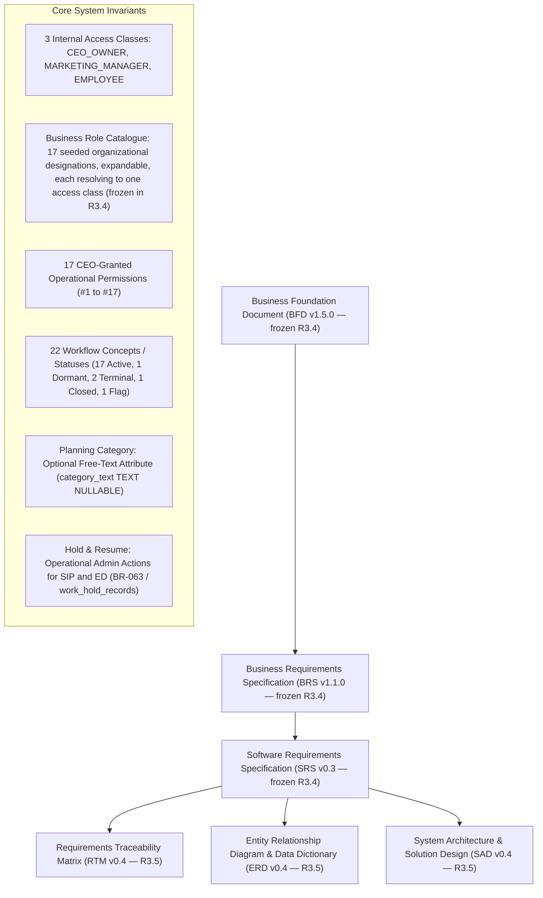

# Walkthrough — KCPC Marketing Management System Specification Alignment & Consistency Pass

**Document ID:** `KCPC-MKT-WALKTHROUGH-001`  
**Date:** August 13, 2026 (Last Modified — R3.5 technical architecture package; independent review rounds 1–5 closure applied)  
**Status:** Development Baseline **R3.4** FROZEN FOR IMPLEMENTATION (current baseline; `BASELINE_FREEZE_R3.4.md`, archived byte-exact at `Baselines/R3.4/`); Candidate Successor **R3.5** technical architecture change package **CANDIDATE — PROPAGATION COMPLETE; INDEPENDENT REVIEW ROUNDS 1–4 RETURNED FAIL WITH ALL CORRECTIONS APPLIED; ROUND 5 RETURNED **TECHNICAL & TRACEABILITY PASS / GOVERNANCE HOLD**; PENDING FINAL FREEZE-READINESS REVIEW** (not frozen; see §8.1–§8.4)

---

## 1. Executive Summary

A comprehensive alignment and consistency repair pass was executed across the governed project specifications in `Required_Documents/` for the KCPC Bandhani — Content Production Lifecycle MVP. The controlled repair work has been applied across the target specifications. **Development Baseline R3.4 passed the Final Independent Freeze-Readiness Review and was frozen on August 13, 2026** (`BASELINE_FREEZE_R3.4.md`; byte-exact archive at `Baselines/R3.4/`), superseding R3.3 as the implementation baseline. The current candidate successor is the **R3.5 technical architecture change package** (§8.4), which retargets the implementation stack without changing the business system.

A **second closure-review pass** subsequently addressed 14 reported findings concentrated in the API contract and its downstream traces. In summary: the operational-permission requirement on every operation card was rebuilt from each card's authorized roles (removing a spurious "Permission #18"); the permission-grant lifecycle was made complete and non-destructive (soft-revoke via `API-OP-009`; **new** modify/expire `API-OP-065`); the Content ID and content-plan row are now allocated atomically at **Idea Approval** (`API-OP-013`), with the former plan-instantiation operation `API-OP-015` **retired** to a reserved identifier; `API-OP-039` (`PUBG`→`PP`) was made conditional on full publication-scope resolution; `API-OP-042`'s N/A path was repaired; the master-catalogue API was completed (**new** `API-OP-066`..`070`); non-persistable DTO fields were removed and the scorecard N/A representation, employee read-scope, and reference-link semantics were aligned to the ERD/SRS. Operation identifiers now span **70 IDs (69 active + retired `API-OP-015`)**.

A **third closure-review pass (Round-3, August 12)** then resolved seven residual findings: the delegated-Employee self-review guard was broadened everywhere from "cannot approve" to blocking **every** review decision (Approve *and* Request Rework) on own work (`SRS-REQ-012` / `BRS-REQ-012` / `AC-012.1`), including the API permission-catalogue and self-approval-checklist summaries; all stale system-wide `API-OP-001`..`064` ranges were synchronized to `API-OP-001`..`070`; the SAD `PP`→`PFUP` state-diagram trigger was corrected to the first eligible scorecard draft/metric entry on-or-after the due date; the API document metadata was normalized to **v0.2.2 / August 12** (header, precedence, checklist, and closing self-reference); the RTM UI/UX column was populated for the 50 designed core-flow rows (34 deferred rows retained as TBD); the UI/UX global URL rule was split (free-form Reference Link/Note vs strict Folder/Evidence URL); and the Content-ID allocation wording was standardized so that the **technical implementation documents (API, SAD, ERD, UI/UX)** use the canonical atomic-allocation wording — "allocated atomically during Idea Approval as the approved Idea transitions into Planning" — while the **business documents (BFD and BRS)** retain equivalent business-outcome wording describing generation as the approved Idea enters/transitions into Planning (a Round-3 draft change to the BRS wording was subsequently reverted to preserve this business-vs-technical layering). These Round-3 fixes (and the subsequent Round-3.1/3.2 corrections) were then subjected to the independent cross-document re-audit recorded in §8.1, which **PASSED** on August 12, 2026; the statements below describe the frozen (post-fix) artifact set. Stakeholder/executive approval remains pending where documented.

Specifically, the following core business requirements and governance rules are harmonized across all project specification documents:
1. **Planning Stage Category Field (Stage 3):** Governed as an **optional, manually entered free-text attribute** (`category_text TEXT NULLABLE`). User can type one or multiple category values into the single field, or leave it blank. No reference list, master table, foreign key, delimiter semantics, or catalogue backing is required.
2. **Operational Hold & Resume Capability (Stage 4 Shooting & Stage 5 Editing):** Governed under **BR-063** (and corresponding `BRS-REQ-084` / `SRS-REQ-091` / `SAD-DES-027` / `ERD-TBL-043` / `RTM-084`). Allows the CEO / Owner or Marketing Manager to place active work in *Shoot In Progress* (`SIP`) or *Editing* (`ED`) on **Hold** during operational reprioritization, pausing execution while preserving primary workflow status, assignee(s), and Content ID identity. Authorized actors can subsequently **Resume** held work to restore active execution.
3. **Trace Chain Alignment:** The target trace chain is aligned for final independent closure verification across `BR-063` → `BRS-REQ-084` → `SRS-REQ-091` → `SAD-DES-027` → `ERD-TBL-043` → `RTM-084`.
4. **Preservation of SRS-REQ-084:** Dedicated Idea Submission Form Field Architecture & Planning Exclusion Guard remains mapped to `BRS-REQ-014` / `AC-014.2`, `AC-014.3` / `SAD-DES-007` / `ERD-TBL-009`.

---

## 2. Specification Baseline Inventory

> **Scope note (R3.4):** The versions and counts in this inventory describe the **frozen Development Baseline R3.3 predecessor** as it stood at freeze (BFD v1.4.5, BRS v1.0.4, SRS v0.2, SAD v0.2, ERD v0.2, RTM v0.2, API v0.2.3). The **candidate successor R3.4** advances these to BFD v1.5.0, BRS v1.1.0 (86 requirements), SRS v0.3 (93 requirements), SAD v0.3 (34 design elements), ERD v0.3 (43 tables, 66 constraints), RTM v0.3 (86 rows, 65 Business Rules), API v0.3.0 (73 operation IDs), 214 Acceptance Criteria, plus UI/UX v0.1.1 and v0.2.1. The R3.4 business-change deltas (Changes A/B/C) are itemized in §8.3 and in `KCPC-MKT-CR-R3.4-001.md`; R3.4 was subsequently **frozen** on August 13, 2026 (`BASELINE_FREEZE_R3.4.md`) and is the current implementation baseline; the **R3.5 technical architecture package** (§8.4) is the current candidate successor and is **not** frozen.

| Document Name | Version & Status | File Link | Governance & Scope Summary |
| :--- | :--- | :--- | :--- |
| **Business Foundation Document (BFD)** | `v1.4.5` (*Read-Only Source Baseline*) | [`Business_Foundation_Document.md`](file:///c:/Kcpc_Marketing_management_Project/Required_Documents/Business_Foundation_Document.md) | Single Source of Truth; governs BR-001 through BR-063, 10 Objectives, 30 KPIs, 13 Success Criteria, 17 Permissions, 22 Workflow concepts; BR-031 Category optional free-text; BR-063 Hold/Resume in SIP & ED. |
| **Business Requirements Specification (BRS)** | `v1.0.4` (*Read-Only Source Baseline*) | [`Business_Requirements_Specification.md`](file:///c:/Kcpc_Marketing_management_Project/Required_Documents/Business_Requirements_Specification.md) | 84 Business Requirements (`BRS-REQ-001..084`), 204 Acceptance Criteria (`AC-001.1..084.4`); BRS-REQ-021 Category optional free-text; BRS-REQ-062 Output/Reel taxonomy; BRS-REQ-084 Hold/Resume. |
| **Software Requirements Specification (SRS)** | `v0.2` (*Target Specification Baseline*) | [`Software_Requirements_Specification.md`](file:///c:/Kcpc_Marketing_management_Project/Required_Documents/Software_Requirements_Specification.md) | 91 Software Requirements (`SRS-REQ-001..091`); 204 AC mappings; 2 clarifications RESOLVED Aug 11, 2026 (`SC-REQ-001` → zero-denominator N/A; `SC-REQ-002` → scorecard draft lifecycle); implementation-agnostic Hold lifecycle record in SRS-REQ-091; Hold/Resume in audit/reporting lists (SRS-REQ-063/076); Category optional free-text in §7/§8. |
| **System Architecture & Solution Design (SAD)** | `v0.2` (*Target Specification Baseline*) | [`System_Architecture_and_Solution_Design.md`](file:///c:/Kcpc_Marketing_management_Project/Required_Documents/System_Architecture_and_Solution_Design.md) | 10 Logical Components (`SAD-COMP-001..010`), 32 Architecture Design Elements (`SAD-DES-001..032`), 10 ADRs (`SAD-ADR-001..010`); Category free-text in SAD-DES-011 / §10.3; Hold/Resume in SAD-DES-027; forward traceability across 91 SRS requirements. |
| **Entity Relationship Diagram & Data Dictionary (ERD)** | `v0.2` (*Target Specification Baseline*) | [`Entity_Relationship_Diagram_and_Data_Dictionary.md`](file:///c:/Kcpc_Marketing_management_Project/Required_Documents/Entity_Relationship_Diagram_and_Data_Dictionary.md) | 42 Active Physical Tables (`ERD-TBL-001..039`, `ERD-TBL-041..043`), 1 Retired Identifier (`ERD-TBL-040`), 1 Dynamic View (`ERD-VW-001`), 62 Constraints (`ERD-CON-001..062`); ERD-CON-009 SKU-only; Section 25 traces all 91 SRS requirements (SRS-REQ-077 Direct, SRS-REQ-079 Indirect, SRS-REQ-078/082 N/A). |
| **Requirements Traceability Matrix (RTM)** | `v0.2` (*Target Specification Baseline*) | [`Requirements_Traceability_Matrix.md`](file:///c:/Kcpc_Marketing_management_Project/Required_Documents/Requirements_Traceability_Matrix.md) | 84 Primary Rows in §3.1 & §3.2; RTM-084 High priority with Administrative Action Governance source; RTM-081 export includes ERD-TBL-043; 84/84 ERD dispositions exact (82 physical + 2 explicit N/A); 91 SRS and 32 SAD mappings. |
| **API Specification (API)** | `v0.2.3` (*Target Specification Baseline*) | [`API_Specification.md`](file:///c:/Kcpc_Marketing_management_Project/Required_Documents/API_Specification.md) | 70 operation IDs (`API-OP-001..070`) = 69 active + 1 retired reserved identifier (`API-OP-015`); server-managed sessions (no JWT); base path `/api/v1`; SC-REQ-001/002 resolved; scorecard draft `API-OP-063`; Planning submit/decision split `API-OP-024`/`API-OP-064`; permission-grant modify/expire `API-OP-065`; master-catalogue CRUD `API-OP-066`..`070`; Content ID allocated at Idea Approval (`API-OP-013`); permission codes `PERM_NN_*`. |
| **Walkthrough & Verification Record** | `KCPC-MKT-WALKTHROUGH-001` (*Status: Updated — Pending Final Closure Review*) | [`walkthrough.md`](file:///c:/Kcpc_Marketing_management_Project/Required_Documents/walkthrough.md) | Comprehensive record of the synchronized specification artifact set, baseline inventory, invariant verification, and closure review status. |

---

## 3. Core System Invariants Enforced Across All Documents

> **Scope note.** This section states the **business invariant set frozen in Development Baseline R3.4**, preserved unchanged by the R3.5 candidate. R3.5 is a technical architecture change and alters none of it. Version tags reference the current R3.5 candidate technical chain (SAD v0.4, ERD v0.4, API v0.4.0, RTM v0.4) over the R3.4-frozen business layer (BFD v1.5.0, BRS v1.1.0, SRS v0.3 — byte-identical to R3.4). The frozen R3.3 predecessor versions are recorded in §2 and §8.1–§8.2.

| Invariant Category | Governed Specification Rule | Status Across Target Documents |
| :--- | :--- | :--- |
| **Internal Access Classes** | Exactly **3 internal access classes**: **`CEO_OWNER`**, **`MARKETING_MANAGER`**, **`EMPLOYEE`**. These are authorization/security classes, not visible organizational roles; no fourth access class exists. | **Consistent — Pending Final Review** |
| **Business Roles (frozen in R3.4)** | An expandable **Business Role (organizational designation) catalogue**, seeded with **17** roles, layered over the unchanged 3 internal access classes: one user → one Business Role → one access class. A Business Role name never grants an Operational Permission. | **Consistent — frozen in R3.4; preserved unchanged by the R3.5 candidate** |
| **Operational Permissions** | Exactly **17 CEO-Granted Operational Permissions** (`Permission #1` to `#17`). | **Consistent — Pending Final Review** |
| **Workflow State Machine** | Exactly **22 formal workflow concepts / statuses** across 7 lifecycle stages (no status #23). | **Consistent — Pending Final Review** |
| **Planning Category Field** | Optional free-text field in Stage 3 Planning (`category_text TEXT NULLABLE`). User can enter one or multiple values or leave blank. No reference table or catalogue. | **Consistent — Pending Final Review** |
| **Hold & Resume Action (BR-063)** | CEO / MM admin action to temporarily pause/resume active work in *Shoot In Progress* (`SIP`) or *Editing* (`ED`). Preserves primary status, assignees, and Content ID. Requires mandatory reason to Hold. Multi-cycle audit history preserved in child table (`ERD-TBL-043`). | **Consistent — Pending Final Review** |
| **Content Identity** | Unique Content ID (`C-MMYY-NNNN` with monthly reset) allocated automatically at **Idea Approval** (`API-OP-013`) as the approved idea enters Planning, together with the `content_plans` row. Shared by all Planned Outputs under the deliverable. | **Consistent — Pending Final Review** |
| **Predefined Marks Model** | Controlled list `[0, 0.5, 1.0, 2.0, 3.0]`. Assigned at Idea Approval, confirmed for qualifying contributors at Shoot/Edit Approval without splitting/averaging. | **Consistent — Pending Final Review** |
| **Publishing & Performance** | Performance Due Date = `Actual Date + 2 calendar days` (non-reschedulable). Scorecard metrics: Hook Rate, Hold Rate, CTR. Target N/A requires mandatory reason. | **Consistent — Pending Final Review** |

---

## 4. Workflow & Status Vocabulary Alignment Record

- **22 Runtime Workflow Statuses:** The system workflow engine maintains exactly 22 valid runtime workflow statuses across 7 lifecycle stages (17 Active, 1 Dormant, 2 Terminal, 1 Closed, 1 Flag). No status #23 exists or is introduced.
- **Administrative Action Governance for Hold & Resume:** "Hold" and "Resume" are administrative lifecycle actions governed by `BR-063` / `BRS-REQ-084` / `SRS-REQ-091` / `SAD-DES-027` / `ERD-TBL-043` / `ERD-CON-061` / `ERD-CON-062` / `ERD-CON-058`. They do NOT introduce a 23rd workflow status.
- **Primary Status & State Machine Invariance:** When a Hold action is executed on an active item in Stage 4 (*Shoot In Progress* / `SIP`) or Stage 5 (*Editing* / `ED`), the primary workflow status in `workflow_instances.current_status_code` remains unchanged as `SIP` or `ED`. The Hold lifecycle is tracked in the child `work_hold_records` table (`ERD-TBL-043`) with auditable history across multiple Hold/Resume cycles. Hold does not automatically change approved execution dates; if an approved Shoot/Edit execution date changes, existing Reschedule governance applies. Performance Due Date remains non-reschedulable.

---

## 5. ERD & Data Dictionary Alignment Record

> **Scope note (R3.4).** The inventory and counts in this record describe the **frozen Development Baseline R3.3 predecessor** ERD (v0.2) as it stood at freeze, and are retained as the accurate predecessor record. The **candidate successor R3.4** (ERD v0.3) advances these to **43 active physical tables** (`+ERD-TBL-044` `business_roles`), **66 integrity constraints** (`+ERD-CON-063/064/065/066`) and **93 SRS requirements** (`SRS-REQ-001`..`093`); `content_plans` gains `planning_mode` and `urgency_reason`, and `users.base_role_code` becomes `users.business_role_id`. The retired identifier `ERD-TBL-040` and the single view are unchanged. R3.4 was subsequently **frozen** on August 13, 2026 (`BASELINE_FREEZE_R3.4.md`) and is the current implementation baseline; the **R3.5 technical architecture package** (§8.4) is the current candidate successor and is **not** frozen.

- **Table Inventory:** 42 active physical tables (`ERD-TBL-001` through `ERD-TBL-039`, `ERD-TBL-041` through `ERD-TBL-043`).
- **View Inventory:** 1 active physical view (`ERD-VW-001` — `active_deliverable_delay_views`).
- **Retired Table Identifier:** 1 retired identifier (`ERD-TBL-040` — `categories`, reserved, uninstantiated).
- **Integrity Constraints:** 62 formal database integrity constraints (`ERD-CON-001` through `ERD-CON-062`).
- **ERD-CON-009 Integrity:** Explicitly verified as SKU N/A Mutual-Exclusion Integrity (`When sku_not_applicable is TRUE, sku_reference MUST be NULL`), traced strictly to `SRS-REQ-021` / `SAD-DES-011` with zero Category rules or contamination.
- **Section 25 SRS Traceability Matrix:** All 91 SRS requirements (`SRS-REQ-001` through `SRS-REQ-091`) are fully represented:
  - `SRS-REQ-077` is classified as `Direct Physical Data Impact`, mapping to `ERD-TBL-002` with physical effect `Session user agent persistence` under `ERD-CON-001`.
  - `SRS-REQ-079` is classified as `Indirect / Constraint Impact`, mapping to `ERD-TBL-002` with physical effect `Connection pool & session limits` under `ERD-CON-001`.
  - `SRS-REQ-078` & `SRS-REQ-082` are classified as `N/A — No Persistent Data Impact`.
  - 89 persistent/constraint impact requirements + 2 explicit N/A requirements = 91 total rows.

---

## 6. Requirements Traceability Matrix Alignment Record

> **Scope note (R3.4).** The counts in this record describe the **frozen Development Baseline R3.3 predecessor** RTM (v0.2) and are retained as the accurate predecessor record. The **candidate successor R3.4** (RTM v0.3) advances these to **86 BRS requirements / 86 RTM rows** (`+RTM-085/086`), **65 Business Rules** (`+BR-064/065`), **214 Acceptance Criteria**, **34 SAD design elements**, and **86/86 ERD dispositions** (84 physical data impact + the same 2 explicit N/A for `RTM-078` and `RTM-082`). R3.4 was subsequently **frozen** on August 13, 2026 (`BASELINE_FREEZE_R3.4.md`) and is the current implementation baseline; the **R3.5 technical architecture package** (§8.4) is the current candidate successor and is **not** frozen.

- **BRS Coverage:** Exactly 84 BRS requirements across §3.1 Primary BFD-to-BRS and §3.2 Downstream Traceability matrices.
- **RTM-084 Traceability:** Governs In-Progress Work Hold & Resume Governance (`BRS-REQ-084`) under `BUS-FUNC` category, `High` priority, `BFD §5.3 BR-063, §6.4 Administrative Action Governance.` source, mapped to `SRS-REQ-091` / `SAD-DES-027` / `ERD-TBL-007, ERD-TBL-043, ERD-TBL-025`.
- **RTM-081 Export Scope:** Explicitly includes `ERD-TBL-043` (`work_hold_records`) within the physical export union (`ERD-TBL-007..033, ERD-TBL-037..039, ERD-TBL-041..043`) and excludes `ERD-TBL-040`.
- **ERD Dispositions:** 84/84 ERD dispositions exact across downstream rows (82 physical data impact + 2 explicit N/A for `RTM-078` and `RTM-082`).

---

## 7. Synchronized Specification Set Verification Summary

> **Scope note (R3.4):** This verification summary records the alignment state of the **frozen R3.3 predecessor** set (versions and counts as frozen). It is retained as the predecessor record; the **candidate successor R3.4** changes and its advanced versions/counts are itemized in §8.3 and `KCPC-MKT-CR-R3.4-001.md`, and are validated in the R3.4 Final Impact Report and Mechanical Audit Report. R3.4 was subsequently **frozen** on August 13, 2026 (`BASELINE_FREEZE_R3.4.md`) and is the current implementation baseline; the **R3.5 technical architecture package** (§8.4) is the current candidate successor and is **not** frozen.

| Target Document | Baseline Version | Verification & Alignment Scope Completed | Review Status |
| :--- | :--- | :--- | :--- |
| **Business Foundation Document** | `BFD v1.4.5` | SSOT; recorded the two stakeholder scorecard decisions in Stage 7 governance & BR-026 (`SC-REQ-001` zero-denominator → N/A; `SC-REQ-002` draft-then-submit); 63 Business Rules, 17 permissions, 22 statuses, 30 KPIs, 13 success criteria preserved (no new BR). | **Consistent — Pending CEO Review** |
| **Business Requirements Specification** | `BRS v1.0.4` | 84 requirements (`BRS-REQ-001..084`), 204 ACs; `AC-050.2/.3` carry the resolved scorecard draft + zero-denominator N/A decisions. | **Consistent — Pending Stakeholder Review** |
| **Software Requirements Specification** | `SRS v0.2` | 91 requirements (`SRS-REQ-001..091`), 204 ACs; implementation-agnostic Hold/Resume in `SRS-REQ-091`; Hold/Resume in audit list (`SRS-REQ-063`) & reporting list (`SRS-REQ-076`); Category optional free-text in §7 & §8. | **Consistent — Pending Final Review** |
| **System Architecture & Solution Design** | `SAD v0.2` | 32 design elements across 10 components; Category free-text in `SAD-DES-011` & §10.3; Hold/Resume in `SAD-DES-027`; baseline references aligned to BFD v1.4.5, BRS v1.0.4, SRS v0.2, RTM v0.2. | **Consistent — Pending Final Review** |
| **Entity Relationship Diagram & Data Dictionary** | `ERD v0.2` | 42 active physical tables, 1 view, 1 retired table (`ERD-TBL-040`), 62 constraints (`ERD-CON-009` SKU-only traced to `SRS-REQ-021`); 91 SRS trace rows in Section 25 (`SRS-REQ-077` Direct, `SRS-REQ-079` Indirect, `SRS-REQ-078/082` N/A). | **Consistent — Pending Final Review** |
| **Requirements Traceability Matrix** | `RTM v0.2` | 84 BRS / 91 SRS requirements; `RTM-084` High priority & Administrative Action Governance source; `RTM-081` export scope includes `ERD-TBL-043`; 84/84 ERD dispositions exact. | **Consistent — Pending Final Review** |
| **API Specification** | `API v0.2.3` | 70 operation IDs (`API-OP-001..070`) = 69 active + retired `API-OP-015`; `SC-REQ-001/002` resolved (scorecard draft `API-OP-063`; Planning submit/decision split `API-OP-024`/`API-OP-064`); Round-2 fixes (permission-requirement rebuild, soft-revoke + `API-OP-065`, Content-ID-at-approval via `API-OP-013`, conditional `API-OP-039` `PUBG`→`PP`, repaired `API-OP-042` N/A path, master-catalogue `API-OP-066`..`070`, DTO fidelity, scorecard N/A flags, employee read-scope) plus Round-3 fixes (delegated self-review blocks **all** decisions on own work per `SRS-REQ-012`; stale `001..064` global ranges → `001..070`; version metadata normalized to v0.2.2); per-endpoint `Source Requirements` reconciled to §27/§28/§29; every active operation card on the full contract template. | **Independent Re-Audit PASSED — Included in Frozen R3.2 Baseline** |
| **UI/UX Design Specification** | `UIUX v0.1` | MVP core-flow low-fidelity screens (Stage 1–7 + auth/landing + deliverable detail); traced to SRS/BRS/API; admin/reporting/master-data/export deferred. | **Consistent — Pending UX Review** |
| **Walkthrough & Verification Record** | `WALKTHROUGH-001` | Conservative non-approval terminology; documented baseline inventory; cross-checked invariants, data dictionaries, workflow state machines, and traceability matrices against the Round-3.2 post-fix artifact set (August 12). Assertions describe the frozen state; the independent cross-document re-audit PASSED (§8.1). | **Independent Re-Audit PASSED — Frozen R3.2** |

---

## 8. Governance & Final Closure Review Status

The governed target specification artifacts were subjected to final independent closure review against the authoritative upstream source baselines (`Business_Foundation_Document.md` v1.4.5 and `Business_Requirements_Specification.md` v1.0.4); the cross-document re-audit **PASSED** on August 12, 2026 and the set is frozen as Development Baseline R3.2 (see §8.1). Formal stakeholder and architectural approval remains pending.

### 8.1 Development Baseline Freeze (R3.2)

The independent cross-document re-audit was completed and **PASSED** on August 12, 2026. On that basis this specification set is frozen as the **KCPC Marketing Content Production Lifecycle MVP — Development Baseline R3.2 — Frozen for Implementation**, recorded in [`BASELINE_FREEZE_R3.2.md`](file:///c:/Kcpc_Marketing_management_Project/Required_Documents/BASELINE_FREEZE_R3.2.md) with a per-file manifest and SHA-256 fingerprints. The general specification-repair cycle is closed; development and QA build against this exact set, and any subsequent requirement, workflow, schema, API, permission, or UI change is made only through controlled change management with impact analysis.

The freeze is an **implementation baseline**, not a stakeholder approval. Per-document sign-off status is unchanged: the BFD remains *Draft — Pending CEO Review*, the BRS remains *Draft — Pending Stakeholder Review*, and the technical documents remain in their respective *Pending Technical / UX / Stakeholder Review* states. No approval flag is advanced by this freeze.

### 8.2 Successor Baseline R3.3 (controlled post-freeze change)

A subsequent independent review of the UI/UX v0.2 companion surfaced two **API-contract** gaps that predated the R3.2 freeze. These were corrected under controlled change, producing successor baseline **R3.3** (recorded in [`BASELINE_FREEZE_R3.3.md`](file:///c:/Kcpc_Marketing_management_Project/Required_Documents/BASELINE_FREEZE_R3.3.md), which supersedes R3.2): (1) `API-OP-005` now requires a mandatory `creationReason`, closing an `SRS-REQ-005` / `AC-005.1` compliance gap on user creation; and (2) reporting operations `API-OP-056/057/059/060` gained explicit filter query parameters (date-range, stage, priority, action-type) matching the existing convention on `API-OP-058`. The API advanced `v0.2.2 → v0.2.3`, and its downstream version references in this walkthrough, the RTM, and the frozen UI/UX v0.1 were re-synchronized accordingly. No business rule, workflow status, permission, field, KPI, table, column, or constraint changed. All other R3.2 documents are unchanged in R3.3; sign-off statuses remain as recorded in §8.1.

### 8.3 Successor Baseline R3.4 (business-change package — SUBSEQUENTLY FROZEN, August 13, 2026)

A controlled **business-change package** was subsequently authored against the frozen R3.3 predecessor and is recorded in change record [`KCPC-MKT-CR-R3.4-001.md`](file:///c:/Kcpc_Marketing_management_Project/Required_Documents/KCPC-MKT-CR-R3.4-001.md). Unlike R3.3 (a corrective API-only alignment), **R3.4 introduces three approved business changes** and therefore touches business rules, the data model, requirements, architecture, the API contract, and the UI/UX:

- **Change A — Business Role catalogue.** An expandable **Business Role** master (organizational designation) is layered over the **unchanged three internal access classes** (`CEO_OWNER`, `MARKETING_MANAGER`, `EMPLOYEE`). Each user is assigned exactly one Business Role, and each Business Role resolves to exactly one access class; a role name never itself grants a permission. Seventeen Business Roles are seeded. **No fourth access class is introduced.** (`BR-064` / `BRS-REQ-085` / `SRS-REQ-092` / `ERD-TBL-044` / `SAD-DES-033` / `API-OP-071..073`.)
- **Change B — Planned Output rename.** The planned output `Short Clip` is renamed to `Video` (enum `SHORT_CLIP` → `VIDEO`). **Reel Type** applies **only** to a Reel; it must be null for Photography and Video. (`ERD-CON-007` / `SRS-REQ-024` / `API-OP-020`.)
- **Change C — Stage-3 Planning Mode.** A per-content-plan **Planning Mode** (`STANDARD` / `URGENT`) is introduced. Standard retains the auto-derived, overridable −5/−2 default schedule; **Urgent** suppresses that default derivation, requires manually entered Shoot/Edit dates and a **mandatory Urgency Reason**, and flows through the **same** Planning Review gate. A target publish date fewer than five days from the current business date requires Urgent. (`BR-065` / `BRS-REQ-086` / `SRS-REQ-093` / `SAD-DES-034` / `ERD-CON-064`/`065`/`066` / `API-OP-018`.)

The API contract advanced `v0.2.3 → v0.3.0` (minor-version bump reflecting additive business capability). R3.4 was a candidate at the time of this record: the independent technical and traceability re-audit **passed** on August 13, 2026 and Finding 6 was closed by CEO / Owner decision record [`KCPC-MKT-DR-R3.4-001.md`](file:///c:/Kcpc_Marketing_management_Project/Required_Documents/KCPC-MKT-DR-R3.4-001.md); the package awaits **final freeze-readiness confirmation** and is **not** frozen. **No `BASELINE_FREEZE_R3.4.md` has been created**, R3.3 remains the current frozen baseline until R3.4 receives final freeze-readiness confirmation and a successor baseline freeze record is issued, and the R3.1–R3.3 history in §8.1–§8.2 is unchanged. Per-document sign-off statuses remain as recorded in §8.1 — no stakeholder or architectural approval is advanced by this candidate package. The one scheduling boundary previously left open (whether Urgent Shoot and Edit dates may be the same calendar day) was **surfaced by independent review (August 12, 2026) and decided by the CEO / Owner (`CEO_OWNER`) on August 13, 2026**, recorded in the business decision record [`KCPC-MKT-DR-R3.4-001.md`](file:///c:/Kcpc_Marketing_management_Project/Required_Documents/KCPC-MKT-DR-R3.4-001.md): under Urgent, same-day Shoot/Edit is **permitted**, with the governing chronology `Shoot ≤ Edit ≤ Live` (`ERD-CON-066`, `AC-086.6`, `API-OP-018`). Across three independent review rounds the first two returned **FAIL — corrections required**; all findings were closed within the R3.4 candidate. The third round returned an **independent technical and traceability PASS** (August 13, 2026), leaving one governance hold, now closed by `KCPC-MKT-DR-R3.4-001`. R3.4 subsequently **passed the Final Independent Freeze-Readiness Review and was frozen** on August 13, 2026 by [`BASELINE_FREEZE_R3.4.md`](file:///c:/Kcpc_Marketing_management_Project/Required_Documents/BASELINE_FREEZE_R3.4.md), superseding R3.3 as the implementation baseline; the frozen bytes are archived at `Baselines/R3.4/`. The successor technical change package R3.5 is recorded in §8.4.

### 8.4 Candidate Successor Baseline R3.5 (technical architecture change — candidate, not frozen)

After the R3.4 freeze, a staffing decision selected a developer whose proven stack differs materially from the frozen R3.4 technical architecture. A controlled **technical architecture** change package was therefore opened against frozen R3.4 and is recorded in [`KCPC-MKT-CR-R3.5-001.md`](file:///c:/Kcpc_Marketing_management_Project/Required_Documents/KCPC-MKT-CR-R3.5-001.md), with pre-edit analysis in [`KCPC-MKT-R3.5-PRE-EDIT-IMPACT-ANALYSIS.md`](file:///c:/Kcpc_Marketing_management_Project/Required_Documents/KCPC-MKT-R3.5-PRE-EDIT-IMPACT-ANALYSIS.md).

**R3.5 carries no business change.** The implementation stack changes; the business system does not.

| Layer | R3.4 (frozen) | R3.5 (candidate) |
| :--- | :--- | :--- |
| Backend runtime | Node.js 20+ (Express/Fastify) | **Java + Spring Boot** |
| Security | Server-managed sessions; JWT prohibited | **Spring Security + signed JWT** in a Secure/HttpOnly/SameSite cookie, server-side token registry (`ERD-TBL-002`) giving immediate revocation |
| Persistence realization | Node data access | **Hibernate / JPA** |
| Frontend | React 18+ / TypeScript SPA | **Spring MVC + JSP + HTML/CSS** server-rendered |
| API documentation | — | **Swagger / OpenAPI**, conformant to the governed API spec |
| Database | PostgreSQL 16+ | **PostgreSQL 16+ — retained, no MySQL conversion** |
| API | REST `/api/v1` | **REST `/api/v1` — retained, all 73 operation IDs unchanged** |
| Architecture style | Modular monolith | **Modular monolith — retained; microservices prohibited** |
| Deployment | Ubuntu VPS, Nginx, Node | Ubuntu VPS, Nginx, **Docker-compatible Java** |

**Preserved without change:** 65 Business Rules · 86 BRS requirements · 214 Acceptance Criteria · 93 SRS requirements · 34 SAD design elements · 43 active ERD tables · 66 ERD constraints · 73 API operation IDs · 86 RTM rows · 3 internal access classes · 17 Business Roles · 17 Operational Permissions · 22 workflow concepts. The BFD, BRS and SRS are **byte-identical to R3.4** — the SRS proved stack-neutral because `DDD-001`/`DDD-002` had already deferred the authentication mechanism and database technology to the architecture and data layers.

**No new identifier of any kind was allocated.** JWT revocation required no new ERD table: `user_sessions` (`ERD-TBL-002`) already carried `session_token_hash` (UNIQUE), `expires_at`, `is_revoked` and the `user_id` foreign key, so it was re-described in place as the token registry.

Versions advanced: SAD v0.3→**v0.4**, ERD v0.3→**v0.4**, API v0.3.0→**v0.4.0**, RTM v0.3→**v0.4**, UIUX v0.1.1→**v0.1.2**, UIUX v0.2.1→**v0.2.2**. BFD v1.5.0, BRS v1.1.0, SRS v0.3 unchanged.

**Migration character:** development had not begun against R3.4 — no Node or React system was built or deployed and no production data exists. R3.5 is therefore **pre-implementation architectural retargeting**, not a runtime production migration. Nothing is migrated because nothing was built.

R3.5 is a **candidate**: it is **not** frozen, **no `BASELINE_FREEZE_R3.5.md` has been created**, and **Development Baseline R3.4 remains the frozen implementation baseline** until R3.5 completes independent review and receives freeze-readiness confirmation. Per-document sign-off statuses are unchanged — the BFD remains *Pending CEO Review* and the BRS *Pending Stakeholder Review*. The R3.1–R3.4 history in §8.1–§8.3 is unchanged, and `KCPC-MKT-DR-R3.4-001` remains authoritative provenance for the same-day Urgent boundary.
